<!-- .slide: data-background-image="../../content/psg-bg-dark.png" data-background-size="100%"-->
 <!-- .element  hidden="true" -->

<br>
<br>
<br>

### Sesión  01
#### Abstracción y Modelado de objetos
#### Representando el mundo real en clases

---

#### Objeto

¿Qué es?

---
- Es una entidad que tiene un estado y un comportamiento.
- Es una representación de algo en el mundo real.
- Es una unidad de programación que agrupa datos y comportamientos relacionados

---

Objetos

# 🍅 🛒 🚗 💸 🎶 🌸  

---

Un objeto tiene:

- **Estado**: Es la información que el objeto tiene en un momento dado.
- **Comportamiento**: Es lo que el objeto puede hacer o lo que le puede suceder.
- **Identidad**: Es lo que distingue a un objeto de otro.

---

Estado de un objeto

# 🎼

##  ⏳ 🎹 🎸 🥁 🎤

---

Comportamiento de un objeto

# 🎼
## ▶ ⏸ ⏹ 🔈 🔊 🔁

---

Identidad de un objeto

# 🎼
### 💿 Hello - Lionel Richie (1984) 
### 💿 Hello - Adele (2015)

---
El proceso para convertir un objeto del mundo real en un objeto de programación se llama **modelado**.

---
#### Modelado

Es el proceso de identificar las características y comportamientos de un objeto en el mundo real y representarlos en un programa.

Es una forma de **abstracción**.

---

#### Abstracción

¿Qué es?

---

- Es separar lo importante de lo trivial. 
- Es un proceso mental que nos permite enfocarnos en lo que es relevante para resolver un problema.
- Es un proceso de simplificación del mundo real a través de la identificación de las características.

---

# 🍅

```text[1|2|3|4|6]
Un tomate es una fruta.
Un tomate es rojo.
Un tomate es dulce.
Un tomate es redondo.

Un tomate es una fruta roja, dulce y redonda.
```
<!-- .element class="fragment" data-fragment-index="1"-->

---
Las características son relativas a un contexto.

---

# 🍅

```text[1|2|3|4|5|6]
# Importante para:
Agricultura: Que crezca saludable y no tenga plagas (plagas y enfermedades)
Transporte: Que sea fácil de transportar y almacenar (tamaño y peso)
Nutricional: Que aporte nutrientes y sea saludable (vitaminas y minerales)
Culinaria: Que sea sabroso y tenga buena textura (sabor y textura)
Consumidor: Que sea atractivo y tenga buen sabor (color y sabor)
Finanzas: Que sea rentable y tenga un precio competitivo (costo y tamaño)
```
<!-- .element class="fragment" data-fragment-index="1"-->

---

---

#### Análisis Orientado a Objetos (AOO)
### OOA

---

- Es el proceso que se enfoca en el problema, sistema o tarea que se quiere convertir en una aplicación.
- Se centra en identificar los objetos y las interacciones entre ellos.
- La etapa de análisis es todo lo que necesita hacerse.

---
- El resultado de la etapa de análisis es un conjunto de requisitos.
- Si completáramos la etapa de análisis, habríamos convertido una tarea, como "necesito un sitio web", en un conjunto de requisitos.

---
Ejemplo

Los visitantes del sitio web deben poder 

*cursiva* → acciones, **negrita** → objetos

- *revisar* nuestros **huertos**
- *postularse* para **trabajos**
- *comparar* y *ordenar* **frutas**

---

#### Diseño Orientado a Objetos (DOO)
### OOD

---

- Es el proceso de convertir los requisitos en un plan formal de implementación.
- El diseñador debe dar nombre a los objetos
- El diseñador debe definir los comportamientos
- El diseñador debe decir qué objetos pueden activar comportamientos en otros objetos.

---
- El resultado de la etapa de diseño es un conjunto de objetos y sus interacciones.
- Si completáramos la etapa de diseño habríamos convertido los requisitos definidos durante el análisis OOA en un conjunto de clases e interfaces que podrían implementarse en cualquier lenguaje de programación orientado a objetos.

---
#### Programación Orientada a Objetos (POO)
### OOP

---

- Es el proceso de convertir un diseño perfectamente definido en un programa funcional que haga exactamente lo que se solicitó originalmente.

---

#### Sí, claro! 

Sería genial si el mundo cumpliera con este ideal y pudiéramos seguir estas etapas una por una, en perfecto orden, 

Como siempre, el mundo real es mucho más confuso.

No importa cuánto intentemos separar estas etapas, siempre encontraremos cosas que necesitan un mayor análisis mientras diseñamos.

---
Cuando programamos, encontramos características que necesitan aclaración en el diseño.

---
La mayor parte del desarrollo del siglo XXI ocurre en un modelo de desarrollo iterativo.

En el desarrollo iterativo, una pequeña parte de la tarea se modela, diseña y programa, luego se revisa el programa y se expande para mejorar cada característica e incluir nuevas características en una serie de ciclos de desarrollo cortos.

---

Inserta imagen

---
#### Ejemplo 1

OOA y OOD

Una tienda de frutas

---
Análisis

Los visitantes del sitio web deben poder

- *revisar* nuestros **productos**
- *añadir* productos a su **cesta**
- *realizar* su **pago**

---

### Objetos
## 🍅, 🛒, 💸

### Acciones: 
## *revisar*, *añadir*, *pagar*

---
Diseño

Diagrama de clases


---
#### Diferencia entre Programación procedural y Programación Orientada a Objetos

| Procedural | Orientada a Objetos
|------------|---------------------|
| Funciones y Procedimientos | Objetos y clases |
| Secuencial | Modular |
| Funciones independientes | Métodos dentro de clases |
| Ejecución lineal | Interacción entre objetos |


---
#### Preparando el proyecto para las sesiones

- Crear un repositorio en GitHub con el nombre **psg-oop-2025**
- Añadir el archivo **README.md** y el archivo **.gitignore**
- Clonar el repositorio en tu computadora
- Abrir el proyecto en VSCode
- Crear una carpeta con el nombre **sesion01**
- Los archivos de la sesión 01 deben estar dentro de la carpeta **sesion01**
- Subir el avance al repositorio de GitHub

---
#### Ejemplo 2

OOA y OOD
Una calculadora de áreas

---
Análisis

Los visitantes deben poder
- *ingresar* la **base** y la **altura**
- *ingresar* el **tipo** de **polígono**
- *calcular* el **área** de un **rectángulo**
- *calcular* el **área** de un **círculo**
- *calcular* el **área** de un **triángulo**

---
### Objetos

## 🟥, 🔴, 🔺

### Acciones:
## *ingresar*, *calcular*

---
Diseño

Diagrama de clases



---

Programación Procedural

```python[1-2|4-5|7-8|10-18|20-25|27]
# ejemplo2procedural.py
def calcular_area_rectangulo(base, altura):
    return base * altura

def calcular_area_circulo(radio):
    return 3.14 * radio ** 2

def calcular_area_triangulo(base, altura):
    return (base * altura) / 2

def calcular_area_poligono(base, altura, tipo):
    if tipo == "🟥":
        return calcular_area_rectangulo(base, altura)
    elif tipo == "🔴":
        return calcular_area_circulo(base)
    elif tipo == "🔺":
        return calcular_area_triangulo(base, altura)
    else:
        raise ValueError("Tipo de polígono no válido")

def main():
    base = float(input("Ingrese la base: "))
    altura = float(input("Ingrese la altura: "))
    tipo = input("Ingrese el tipo de polígono (🟥, 🔴, 🔺): ")
    area = calcular_area_poligono(base, altura, tipo)
    print(f"El área del {tipo} es: {area}")

main()
```

---

Programación Orientada a Objetos

```python[1-7|9-14|15-22|24-41|42]
# ejemplo2objetos.py
class Rectangulo:
    def __init__(self, base, altura):
        self.base = base
        self.altura = altura

    def area(self):
        return self.base * self.altura

class Circulo:
    def __init__(self, radio):
        self.radio = radio

    def area(self):
        return 3.14 * self.radio ** 2

class Triangulo:
    def __init__(self, base, altura):
        self.base = base
        self.altura = altura

    def area(self):
        return (self.base * self.altura) / 2

def main():
    base = float(input("Ingrese la base: "))
    altura = float(input("Ingrese la altura: "))
    tipo = input("Ingrese el tipo de polígono (🟥, 🔴, 🔺): ")

    if tipo == "🟥":
        rectangulo = Rectangulo(base, altura)
        area = rectangulo.area()
    elif tipo == "🔴":
        circulo = Circulo(base)
        area = circulo.area()
    elif tipo == "🔺":
        triangulo = Triangulo(base, altura)
        area = triangulo.area()
    else:
        raise ValueError("Tipo de polígono no válido")

    print(f"El área del {tipo} es: {area}")
main()
```

---
#### Clase 

¿Qué es?

---
<!-- definiciones para personas que no saben programar -->
- Es una plantilla o un modelo para crear objetos.
- Es una forma de agrupar datos y comportamientos relacionados.

---

#### Ejemplo 3

Galletas en forma de corazón

## 💟 ➡ 💙💚💛💜🧡

- **Clase**: GalletaCorazon 💟 
- **Objetos**: 
    - 💙 Galleta de arándano 
    - 💚 Galleta de menta 
    - 💛 Galleta de piña 
    - 💜 Galleta de uva 
    - 🧡 Galleta de naranja 

---

#### Diagrama de clases

¿Qué es?

---

- Es una representación gráfica de las clases y sus relaciones.
- Es una forma de visualizar el diseño de un sistema orientado a objetos.
- Es una herramienta para comunicar el diseño a otros programadores.
- Es una forma de documentar el diseño de un sistema orientado a objetos.


---
Partes de una clase

- **Nombre de la clase**: Galleta
- **Atributos**: 
    - color
    - sabor
    - tamaño
- **Métodos**:
    - hornear()
    - decorar()

---
#### Ejemplo 4

Clase de una galleta

## 🍪

---
#### Diagrama de clases

 <!-- .element  width="30%"-->

---
#### Ejemplo 5

Software para un horno de galletas 

OOA y OOD

---
Análisis

Para hacer galletas, el horno debe poder
- *seleccionar* la **temperatura**
- *seleccionar* el **tiempo**
- *hornear* las **galletas** de diferentes **sabores**
- los sabores son: 
    - 🍪🍊 Galleta de naranja
    - 🍪🍋 Galleta de limón
    - 🍪🍫 Galleta de chocolate

---
### Objetos
## 🔥, ⏳, 🍪🍊, 🍪🍋, 🍪🍫

### Acciones:
## *seleccionar*, *hornear*
---

Diseño




---

En python podemos crear una clase para representar un objeto.

Utilizamos la palabra reservada **class**.

---

La clase galleta del ejemplo 4 se puede representar en python de la siguiente manera:

```python[1-4|6-8]
# ejemplo5.py
class Galleta:
    color = "amarillo"
    sabor = "limón"
    tamaño = "grande"

print (Galleta.color)
print (Galleta.sabor)
print (Galleta.tamaño)
```

La plantilla de la clase Galleta tiene tres atributos: color, sabor y tamaño

Cuenta con valores por defecto.

---

#### Buenas prácticas para nombrar clases

- Utilizar **PascalCase** para nombrar clases.
- Utilizar nombres descriptivos y significativos.
- Evitar abreviaciones y siglas.

---

- Tratar de utilizar nombres en inglés.
- Utilizar nombres en singular.
- Evitar nombres genéricos como "Clase1" o "Clase2".
- Utilizar nombres que reflejen el propósito de la clase.

---

#### Resumen

- Un objeto es una entidad que tiene un estado y un comportamiento.
- El proceso de convertir un objeto del mundo real en un objeto de programación se llama modelado.
- El proceso de identificar las características y comportamientos de un objeto en el mundo real y representarlos en un programa se llama abstracción.

---
- El proceso de identificar los requisitos y las interacciones entre los objetos se llama análisis orientado a objetos.
- El proceso de convertir los requisitos en un plan formal de implementación se llama diseño orientado a objetos.
- El proceso de convertir un diseño perfectamente definido en un programa funcional se llama programación orientada a objetos.

---
- La programación iterativa es un modelo de desarrollo en el que una pequeña parte de la tarea se modela, diseña y programa, luego se revisa el programa y se expande para mejorar cada característica e incluir nuevas características en una serie de ciclos de desarrollo cortos.
- Una clase es una plantilla o un modelo para crear objetos.
- Una clase es una forma de agrupar datos y comportamientos relacionados.

---
- Un diagrama de clases es una representación gráfica de las clases y sus relaciones.
- Un diagrama de clases es una forma de visualizar el diseño de un sistema orientado a objetos.
- En python podemos crear una clase para representar la plantilla de un objeto.
- Utilizamos la palabra reservada class.

---
- Como buenas prácticas para nombrar clases, utilizamos PascalCase
- Utilizamos nombres descriptivos y significativos.
- Evitamos abreviaciones y siglas.

---
- Tratamos de utilizar nombres en inglés.
- Utilizamos nombres en singular.
- Evitamos nombres genéricos como "Clase1" o "Clase2".
- Utilizamos nombres que reflejen el propósito de la clase.

---
#### Retos

Utilizaremos un repositorio de GitHub para almacenar los retos, de todas las sesiones.

De manera iterativa, iremos agregando los retos a medida que avancemos

Como si estuviéramos trabajando en un proyecto real.

---

Crear una carpeta con el nombre "retos_sesion_01" dentro del proyecto en la raíz, en la cual por cada ejercicio debes crear los siguientes archivos:

```bash
# Ejemplo carpeta
psg-oop-2025/
    sesion01/
        ejemplo2procedural.py
        ejemplo2objetos.py
        ejemplo05.py
    retos_sesion_01/
        ejercicio_01.md
        ejercicio_02.md
        ejercicio_03.md
```

---

1. Crear un archivo llamado `ejercicio_01.md` en la carpeta retos_sesion_01 y hacer
    - análisis orientado a objetos
    - diseño orientado a objetos

    Para el siguiente objeto: 

## `Un gato 🐈` 

---
2. Crear un archivo llamado `ejercicio_02.md` en la carpeta retos_sesion_01 y hacer
    - análisis orientado a objetos
    - diseño orientado a objetos

    Para los siguientes objetos y su relación: 

## `Una hoja 🍃 y un árbol 🌳`

---
3. Crear un archivo llamado `ejercicio_03.md` en la carpeta retos_sesion_01 y hacer
    - análisis orientado a objetos
    - diseño orientado a objetos

    Para un o unos objetos a tu elección.
    
---
Los diagramas pueden ser dibujados a mano o con alguna herramienta para diagramas como [draw.io](https://app.diagrams.net/)

---
<!-- .slide: data-background-image="../../content/psg-bg-dark.png" data-background-size="100%"-->

<br>
<br>
<br>
<br>
<br>

[ <!-- .element width="20%"-->](https://github.com/python-la-paz/)

Repositorio de la Sesión

---
<!--.slide: data-visibility="hidden"-->
## Bibliografía y Referencias

https://www.gyata.ai/es/object-oriented-programming/object-oriented-analysis
https://dmd.unadmexico.mx/contenidos/DCEIT/BLOQUE1/DS/02/DDOO/U1/descargables/DDOO_Unidad_1.pdf
https://programacionpro.com/programacion-procedural-vs-orientada-a-objetos-diferencias-y-similitudes/
https://oregoom.com/python/atributos-clase/
https://diagramasuml.com/diagrama-de-clases/
