<!-- .slide: data-background-image="../../content/psg-bg-dark.png" data-background-size="100%"-->
 <!-- .element  hidden="true" -->

<br>
<br>
<br>

### Sesión  01
#### Abstracción y Modelado de objetos
#### Representando el mundo real en clases

---
#### El mundo real

---

Es todo lo que nos rodea.

Compuesto por todo lo que vemos, tocamos, olemos, escuchamos, sentimos e imaginamos.

 <!-- .element  width="30%"-->


---
Cada cosa en el mundo real es un objeto. Sea tangible o intangible.

- 👤 Una persona
- 🌃 Un lugar
- 🐔 Un animal
- 😮 Un sentimiento
- 💡 Una idea


---

#### ¿Qué es un Objeto?

---
- Es una entidad que tiene un estado y un comportamiento.


# 🥚🐣🐤🐔

---

#### ¿Qué es un Objeto en el contexto de la programación?

---
- Es un conjunto de datos que representa algo del mundo real.

# 🎤 ⏱️ 🎧 ⏳ ➡ 🎼

- Es parte de un programa, de un sistema o de una aplicación.

# 🍱 📦 🧩 📱

---

¿Que define a un Objeto?

- **Estado**: Son las características que almacena en un momento dado.       
- **Comportamiento**: Son las acciones que el objeto puede realizar.
- **Identidad**: Es lo que distingue a un objeto de otro aunque tengan el mismo estado y comportamiento.

---

Una canción como un objeto

🎼 Hello - Lionel Richie

---

## Estado

🔍 Las características del objeto


- 🎼 Título: Hello
- 🎤 Artista: Lionel Richie
- ⏱️ Duración: 4:14
- 🎧 Género: Pop / Soul
- ⏳ Año: 1984

---

## Comportamiento

⚙️ Lo que puede hacer o lo que le puede pasar

- ▶️ Reproducir
- ⏸️ Pausar
- ⏹️ Detener
- 🔊 Subir volumen
- 🔉 Bajar volumen
- 🔁 Repetir
- ➕ Añadir a playlist

---

## Identidad

🆔 Es una canción única

- 💿 Canción: Hello 
- 🎤 Artista: Lionel Richie (1984) 
  
🆚

- 💿 Canción: Hello
- 🎤 Artista: Adele (2015)

---

#### Preparemos el proyecto para el Study Group

---

#### 1. Crea el repositorio en GitHub

- Crea un repositorio en GitHub con el nombre

 **psg-oop-2025**

- Añade los archivos iniciales
  - **README.md**
  - **.gitignore** para Python

---

#### 2. Descarga el repositorio

Clona el repositorio en tu computadora

```bash
git clone https://github.com/<usuario>/psg-oop-2025.git
```

Abre el proyecto en VSCode

```bash
code psg-oop-2025
```

---

#### 3. Estructura Sesión 01

Crea una carpeta con el nombre 

**sesion01**

- Los archivos de esta sesión deben estar dentro de esta carpeta

- Al finalizar la sesión, subiremos los cambios al repositorio en un commit

---
### Ejemplo 01

Crea el archivo **ejemplo01.txt** en la carpeta **sesion01**

```markdown
Obtener las características, comportamiento y 
comparar las identidades de estas dos canciones

- "Stay" de Rihanna & Mikky Ekko
- "Stay" de The Kid LAROI & Justin Bieber
```

---

#### Obtener características, comportamiento e identidad

🎼 Stay - Rihanna & Mikky Ekko

```text
Características:
Título: Stay
Artista: Rihanna, Mikky Ekko
Duración: 4:00
Género: Pop
Año: 2013

Comportamiento:
Reproducir
Pausar
Detener
Subir volumen
Bajar volumen
Repetir

Identidad:
- Stay, Rihanna & Mikky Ekko, Pop, 2013
```

---

#### Ejercicio para ti

#### Obtener características, comportamiento e identidad

🎼 Stay - The Kid LAROI & Justin Bieber

3 Minutos

<iframe src="https://time-stuff.com/embed.html" frameborder="0" scrolling="no" width="391" height="140"></iframe>

---

#### Obtener características, comportamiento e identidad

🎼 Stay - The Kid LAROI & Justin Bieber

```text
Características:
Título: Stay
Artista: The Kid LAROI, Justin Bieber
Duración: 2:21
Género: Pop, Hip-hop
Año: 2021

Comportamiento:
Reproducir
Pausar
Detener
Subir volumen
Bajar volumen
Repetir

Identidad:
- Stay, The Kid LAROI & Justin Bieber, Pop / Hip-hop, 2021
```

---

#### Comparación de identidades

```text
Aunque ambas canciones se llamen "Stay"
el resto de sus características los hacen diferentes.
```

---

Ahora abordaremos un concepto fundamental en la programación orientada a objetos:

### Abstracción

---

#### ¿Qué es la **Abstracción**?

---

Es el proceso de identificar las *características* y *comportamientos* relevantes de un *objeto*

En este proceso *se dejan de lado* todo aquello que no es relevante para el *contexto*

El contexto es el *entorno* o *situación* en la que se encuentra el *objeto*


---
¿Que característica tiene un tomate?

# 🍅

```text[1|2|3|4|6]
Un tomate es una fruta (tipo)
Un tomate es rojo (color)
Un tomate es dulce (sabor)
Un tomate es redondo (forma)

Un tomate es una fruta roja, dulce y redonda.
```
<!-- .element class="fragment" data-fragment-index="1"-->

---

### Las características importantes dependen del contexto

---

Si soy un granjero que cultiva y vende tomates

¿Qué características me importan?

# 🍅

```markdown
- Especie de tomate (tipo)
- Color del tomate (color)
- Presencia de defectos (calidad)
- Presencia de hongos o insectos (plagas)
- Uso de pesticidas (pesticidas)
- Estado de madurez (madurez)
```

---
Si soy un chef de alta cocina que utiliza tomates en sus recetas

¿Qué características me importan?

# 🍅

```markdown
- Color del tomate (color)
- Tamaño del tomate (tamaño)
- Textura del tomate (textura)
- Forma del tomate (forma)
- Porcentaje de azúcar (sabor)
- Cantidad de jugo (jugosidad)
```

---

Si soy un nutricionista que elabora dietas para personas

¿Qué características me importan?

# 🍅

```markdown
- Porcentaje de agua (hidratación)
- Porcentaje de fibra (fibra)
- Porcentaje de carbohidratos (carbohidratos)
- Porcentaje de proteínas (proteínas)
- Porcentaje de grasas (grasas)
- Porcentaje de vitaminas (vitaminas)
```

---
El mundo real es complejo y está lleno de detalles

Identificar las características importantes según un contexto nos permite delimitar nuestro enfoque

> El contexto define qué es importante y qué no.

---

### Ejemplo 02

Crea el archivo **ejemplo02.txt** en la carpeta **sesion01**

```markdown
¿Qué características de una papa 🥔 son importantes?

- Para un ingeniero mecánico que diseña máquinas peladoras de papas
- Para un distribuidor de papas fritas
```

---

#### Características de una papa 🥔

```markdown
Para un ingeniero mecánico que diseña máquinas peladoras de papas:
- Tamaño promedio (tamaño)
- Dureza de la cáscara (dureza)
- Resistencia a la presión (resistencia)
- Forma e irregularidades (uniformidad)
- Textura de la piel (textura)
```

---

#### Ejercicio para ti

#### Características de una papa 🥔

Para un distribuidor de papas fritas

5 características

3 minutos

<iframe src="https://time-stuff.com/embed.html" frameborder="0" scrolling="no" width="391" height="140"></iframe>

---


#### Características de una papa 🥔

```markdown
Para un distribuidor de papas fritas:
- Tipo de papa (variedad)
- Tamaño de las papas (tamaño)
- Estado de las papas si son frescas congeladas (estado)
- Tipo o estilo de corte (corte)
- Precio por kilo (precio)

```

---

Hasta el momento identificamos las características de un objeto del mundo real

Separamos lo importante según el contexto

> Esto es parte del proceso de modelado

---

El **enfoque orientado a objetos** trata de representar el mundo real en un programa

Lo hace mediante un proceso de análisis y diseño orientado a objetos

Para posteriormente llevar el diseño en un lenguaje de programación

---

#### Análisis Orientado a Objetos (AOO)
### OOA

---

- En esta etapa se identifican las características, comportamiento e identidad de los objetos según su contexto

- Se centra en identificar la interacción entre objetos

---

- La etapa de análisis determina todo lo que se considerará para las siguientes etapas

- El resultado de la etapa de análisis es el conjunto de requisitos que describen las acciones y funcionalidades que deben implementarse

---

El análisis contiene:

**Objetos** - *Acciones*

- **Objetos**: Son entidades que se van a modelar
- *Operaciones*: Las actividades que los objetos pueden ejecutar

Estructura de los requisitos

*Acciones* de los **Objetos**

---

#### Ejemplo 03

Crear el archivo **ejemplo03.txt** en la carpeta **sesion01**

```text
Una asociación de productores comunitarios de tomates quiere dar
a conocer sus productos, para esto quieren una aplicación web 
donde las personas interesas en comprar sus tomates puedan ver
fotos y ubicaciones de los huertos y comparar los tomates que
producen según color, peso y especie
```

---

Obtendremos los objetos y acciones para obtener los requisitos

```markdown
Requisitos:
- Ver fotos y ubicaciones de los huertos
- Comparar los tomates según color, peso y especie
Objetos:
- huerto 🌱
- tomate 🍅
Características:
- Huerto: ubicación, fotos
- Tomate: color, peso, especie
Acciones:
- ver fotos
- ver ubicaciones
- comparar tomates
``` 

---

#### Ejemplo 04

Crear el archivo **ejemplo04.txt** en la carpeta **sesion01**

Obtener los objetos y acciones para obtener los requisitos

```text
Una aplicación permite descubrir canciones nuevas.
Las personas pueden escuchar fragmentos aleatoriamente,
darle "like" para ver el nombre de la canción, artista y carátula
o "dislike" para pasar a la siguiente.
Compara las canciones con según género, duración y artista.
```

5 minutos

<iframe src="https://time-stuff.com/embed.html" frameborder="0" scrolling="no" width="391" height="140"></iframe>

---

Obtendremos los objetos y acciones para obtener los requisitos

```text
Requisitos:

- escuchar fragmentos aleatoriamente de canciones
- dar "like" para ver el nombre de la canción, artista y carátula
- dar "dislike" para pasar a la siguiente
- comparar canciones según género, duración y artista

Objetos:
- Canción 🎼

Características:
- Canción:
    - nombre
    - artista
    - carátula
    - género
    - duración
    - fragmentos

Acciones:
- escuchar fragmentos
- dar "like"
- dar "dislike"
- ver información
- comparar canciones
```

---

### Diseño Orientado a Objetos (DOO)
#### Oriented Object Design (OOD)

---

- Es la etapa en la que se convierte el análisis orientado a objetos en un diseño orientado a objetos

- El diseñador debe dar nombre a los objetos y define los comportamientos

- Crea los diagramas de clases y las relaciones entre los objetos

---
- El resultado de la etapa de diseño es un conjunto de objetos y sus interacciones

- Al completar esta etapa se tiene un diseño formal que puede ser implementado en un cualquier lenguaje de programación

---

#### ¿Qué es una clase?

- Es una plantilla para crear objetos.

- Es un modelo que define las características y comportamientos de un objeto.

---
Una clase esta formada por

- **Nombre de clase**: Es el nombre que se le da
- **Atributos**: Son las características de la clase
- **Métodos**: Son los comportamientos de la clase

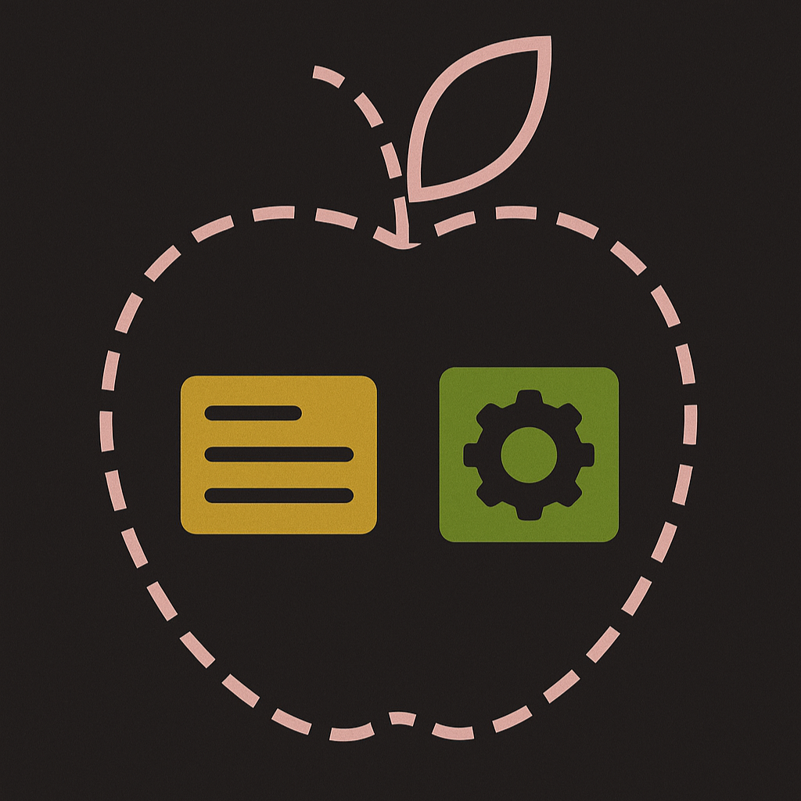 <!-- .element  width="30%"-->

---
#### Buenas prácticas para nombrar clases

- Utilizar **PascalCase** para nombrar clases.
- Utilizar nombres descriptivos y significativos.
- Evitar abreviaciones y siglas.

[Guía PEP 8](https://peps.python.org/pep-0008/#class-names)

---

- Tratar de utilizar nombres en inglés

- Utilizar nombres en singular

- Evitar nombres genéricos como "Clase1" o "Clase2"

- Utilizar nombres que reflejen el propósito de la clase

---

#### Ejemplo 05 

Crear el archivo **ejemplo05.txt** en la carpeta **sesion01**

```text
Un panadero quiere hacer galletas en forma de corazón.
Las galletas pueden ser de arándano, menta, piña, uva y naranja.
Deben tener glaseado azul, verde, amarillo, morado y naranja.
```

Realizar el análisis y obtener las clases necesarias

---

Análisis

```markdown
# Analisis

Requisitos:
- hacer galletas de diferentes sabores
- galletas en forma de corazón
- galletas de arándano, menta, piña, uva y naranja
- glaseado de color azul, verde, amarillo, morado y naranja

Objetos:
- Galleta

Características:
- Galleta:
    - sabor
    - glaseado

Acciones:
- (No hay acciones)
```


---

Diseño de la clase

```markdown
# Diseño:

Clases:
- Galleta 💟:
    - Nombre: GalletaCorazon
    - Atributos:
        - sabor
        - glaseado
    - Métodos:
        - (No hay métodos)

```

---


Tenemos como resultado una clase llamada `GalletaCorazon`

que nos permite crear objetos `GalletaCorazon`

de diferentes sabores y glaseados.

 <!-- .element  width="20%"-->

---

## 💟 ➡ 💙💚💛💜🧡

- **Clase**: GalletaCorazon 💟
- **Objetos**: 
    - 💙 Arándano azul
    - 💚 Menta verde
    - 💛 Piña amarilla
    - 💜 Uva morada
    - 🧡 Naranja anaranjado


---

#### Ejemplo 06

Crear el archivo **ejemplo06.txt** en la carpeta **sesion01**

```text
Una confitería quiere hacer bombones.
Tienen a disposición chocolate negro o blanco
y pueden o no tener nueces el chocolate
Los moldes pueden ser en forma de estrella y circular
```

Realizar el análisis y obtener las clases necesarias

---

Análisis 

```markdown
# Análisis

Requisitos:
- hacer bombones de chocolate negro y blanco
- los bombones pueden tener nueces
- bombones con forma de estrella y circulo

Objetos:
- Bombón

Características:
- Bombón
    - forma
    - nueces
    - chocolate

Acciones:
- (No hay acciones)
```

---

#### Ejercicio para ti

Diseña la clase para los bombones

3 minutos

<iframe src="https://time-stuff.com/embed.html" frameborder="0" scrolling="no" width="391" height="140"></iframe>

---

Diseño de la clase

```markdown
# Diseño:

Clases:
- Bombon 🧆:
    - Nombre: Bombon
    - Atributos:
        - forma
        - chocolate
        - nueces
    - Métodos:
        - (No hay métodos)
```

---

El diseño actual es útil para identificar las partes de nuestra clase

Pero existe una forma visual 

Donde las clases forman un diagrama

> Un Diagrama de clases

---

#### ¿Qué es un diagrama de clases?

- Es la representación gráfica de las clases y sus relaciones.
- Es una herramienta para comunicar el diseño a otros programadores.
- Nos permite documentar el diseño
- Es parte de la etapa de diseño

---

#### Clase en un diagrama

Se representa como un rectángulo dividido en 3 partes

- La parte superior contiene el nombre
- La parte del medio contiene los atributos
- La parte inferior contiene los métodos

---

Visualmente, una clase se ve así:

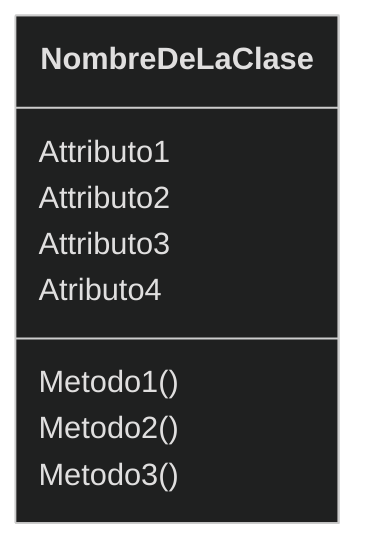

---

Podemos crear los diagramas manualmente o usar herramientas como:

- [draw.io](https://app.diagrams.net/)
- [Lucidchart](https://www.lucidchart.com/)

---

También podemos crear los diagramas usando texto plano y añadirlo
a al markdown 

Una de las herramientas más populares es [Mermaid](https://www.mermaidchart.com/play#pako:eNqrVkrOT0lVslJSqgUAFW4DVg)

---
En VS Code podemos instalar la extensión de [Mermaid](https://marketplace.visualstudio.com/items?itemName=MermaidChart.vscode-mermaid-chart)

Buscamos la extensión en el marketplace de VS Code y la instalamos.

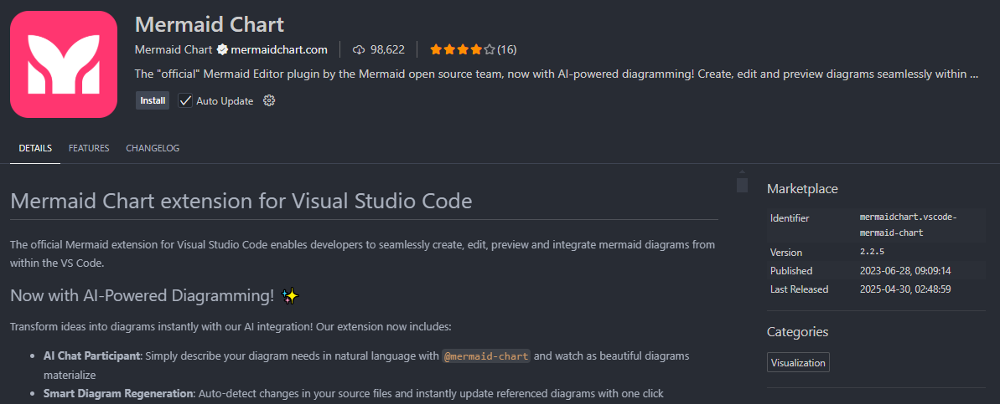 <!-- .element  width="70%"-->

---
Desde un archivo markdown podemos crear un diagrama usando mermaid:

````
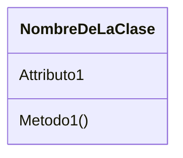
````
- `\`` indica que es un bloque de código
- `mermaid` indica que es un diagrama de mermaid
- `classDiagram` indica que es diagrama de clases
- Las llaves `{}` indican el inicio y el fin de la clase


---

````
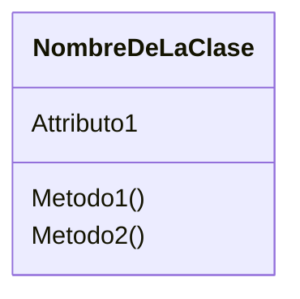
````

- `class` indica que es una clase
- `NombreDeLaClase` es el nombre de la clase
- `Attributo1` es un atributo de la clase
- `Metodo1()` es un método de la clase

---
En VS Code cuando tenemos la extensión instalada, podemos ver el diagrama

de color rojo y el boton de "Edit Diagram" para editar el diagrama

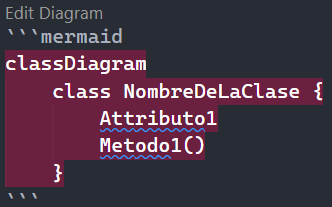 <!-- .element  width="40%"-->

---
Al editar el diagrama, se abre una nueva pestaña donde

podemos ver el código mermaid y previsualizar el diagrama

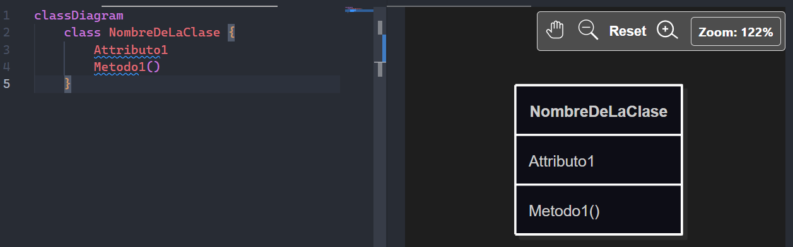 <!-- .element  width="70%"-->

---
Si editamos el diagrama se sincronizará el diseño en el markdown

---
Un diagrama puede ser guardado en un archivo de extensión `.mmd`

Y abierto en VS Code donde podemos editarlo y previsualizarlo

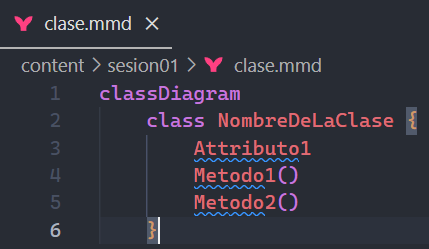 <!-- .element  width="70%"-->

---

Para abrir la previsualización del diagrama, hacemos click derecho y
Seleccionamos "Mermaidchart: Preview Diagram"

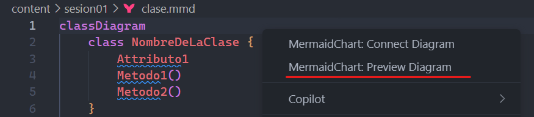 <!-- .element  width="70%"-->

---

#### Ejemplo 07

Crear el archivo **ejemplo07.md** en la carpeta **sesion01**

```markdown
Convertir el siguiente diseño a un diagrama de una clase

# Diseño:

Clases:
- Bombon 🧆:
    - Nombre: Bombon
    - Atributos:
        - forma
        - chocolate
        - nueces
    - Métodos:
        - (No hay métodos)
```

---

````
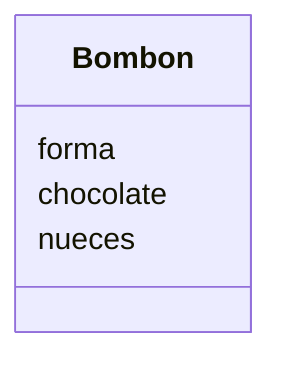
````

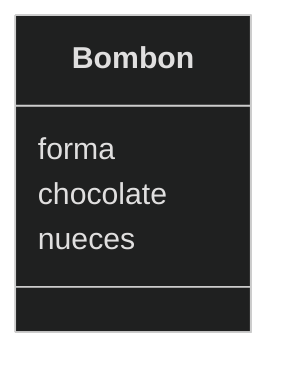

---

#### Ejemplo 08

Crear el archivo **ejemplo08.md** en la carpeta **sesion01**

```text
Una heladería ofrece helados
Los clientes eligen entre helado de vainilla o fresa
Pueden agregar chispas de chocolate y caramelo líquido como extra
Puede llevarse en barquillo o vaso y tener hasta 3 bolitas
```

Realizar el análisis


4 minutos

<iframe src="https://time-stuff.com/embed.html" frameborder="0" scrolling="no" width="391" height="140"></iframe>

---

Análisis

```markdown
# Análisis

Requisitos:
- Ofrece helados de vainilla o fresa
- Agregar chispas de chocolate
- Agregar caramelo líquido
- Utilizar barquillo o vaso
- Llevar hasta 3 porciones

Objetos:
- Helado

Características:
- Helado
    - sabor
    - chispas
    - caramelo
    - envase
    - porciones

Acciones:
- (No hay acciones)

```

---

Ahora diseña la clase para los helados y obtén el diagrama de clases

utilizando mermaid

3 minutos

<iframe src="https://time-stuff.com/embed.html" frameborder="0" scrolling="no" width="391" height="140"></iframe>

---

Diseño de la clase

```markdown
# Diseño:

Clases:
- Helado 🍦:
    - Nombre: Helado
    - Atributos:
        - sabor
        - chispas
        - caramelo
        - envase
        - porciones
    - Métodos:
        - (No hay métodos)
```

---
````
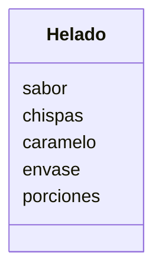
````

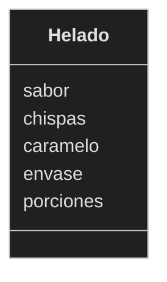

---

Por último, llegamos a la etapa final

✅ Ya conocemos el análisis

✅ Tenemos el diagrama de clases

🎯 Ahora toca programar

---

#### Programación Orientada a Objetos (POO)
### Object Oriented Programming (OOP)

---

- Es la etapa en la que se implementa el diseño orientado a objetos en un lenguaje de programación

- En esta etapa se crean las clases con sus atributos y métodos

- El diseño se convierte en código ejecutable

---

- Se crean los objetos a partir de las clases

- Se implementan los métodos y se crean las interacciones entre los objetos

- El análisis y diseño se convierten en un programa funcional

---

## ANÁLISIS 💭
## ⬇ 
## DISEÑO 🎨
## ⬇
## PROGRAMACIÓN 💻

---

Subimos los avances de la sesión al repositorio en GitHub

```bash
git add .
git commit -m "Sesión 01"
git push origin main
```

---

#### Resumen


- El mundo real está compuesto por objetos

- Los objetos tienen estado, comportamiento e identidad

- La abstracción es el proceso de identificar las características y comportamientos relevantes de un objeto

---

- El contexto define qué es importante y qué no

- El análisis orientado a objetos identifica los objetos y sus interacciones

- El diseño orientado a objetos convierte el análisis en un diseño formal

---

- Las clases son plantillas para crear objetos

- Los diagramas de clases son la representación gráfica de las clases y sus relaciones

---

- La programación orientada a objetos implementa el diseño en un lenguaje de programación

- ANÁLISIS ➡ DISEÑO ➡ PROGRAMACIÓN

---

#### Retos

Utilizaremos el repositorio de GitHub creado en esta sesión "psg-oop-2025" 

para almacenar los retos, de todas las sesiones.

Iremos agregando los retos a medida que avancemos

Como si estuviéramos trabajando en un proyecto real

---

Crear una carpeta con el nombre "retos_sesion_01" dentro del proyecto en la raíz, en la cual por cada ejercicio debes crear los siguientes archivos:

```bash [1-2,11-14]
psg-oop-2025/
    sesion01/
        ejemplo01.txt
        ejemplo02.txt
        ejemplo03.txt
        ejemplo04.txt
        ejemplo05.txt
        ejemplo06.txt
        ejemplo07.md
        ejemplo08.md
    retos_sesion_01/
        ejercicio_01.md
        ejercicio_02.md
        ejercicio_03.md
```

---

1. Crear un archivo llamado `ejercicio_01.md` en la carpeta `retos_sesion_01` y realiza 

Análisis y Diagrama de clases

Para lo siguiente:

```text
Un restaurante quiere ofrecer hamburguesas
Los clientes pueden elegir entre hamburguesa de res, pollo
o vegetariana.
Agregar lechuga, tomate, cebolla y mayonesa como extras
Y comer en el restaurante o para llevar
```


---
2. Crear un archivo llamado `ejercicio_02.md` en la carpeta `retos_sesion_01` y realiza
    
Análisis y Diagrama de clases

Para lo siguiente:

```text
Una tienda de ropa quiere ofrecer camisetas y pantalones
Los clientes pueden elegir entre camiseta
de manga corta o larga y pantalón de mezclilla o tela
Las camisetas pueden ser de color rojo, azul o verde
y los pantalones de color negro, gris o blanco
Las camisetas pueden ser tener talas: S, M, L, XL
Los pantalones tienen desde la talla 32 hasta la talla 44
```

---
3. Crear un archivo llamado `ejercicio_03.md` en la carpeta `retos_sesion_01` y realiza
    
Análisis y Diagrama de clases

Para lo siguiente:

```text
Estas diseñando una app para dibujar de perros con IA 
los usuarios pueden seleccionar características como la
raza del perro como labrador, pastor alemán, y otros
Cambiar el color del pelaje, tamaño y tipo de orejas  
Agregar dos accesorios como sombreros o gafas
El dibujo final puede ser descargado en PNG o JPG
```

    
---
<!-- .slide: data-background-image="../../content/psg-bg-dark.png" data-background-size="100%"-->

<br>
<br>
<br>
<br>
<br>

[ <!-- .element width="20%"-->](https://github.com/python-la-paz/python-study-group-oop/content/sesion01)

Repositorio de la Sesión

---
<!--.slide: data-visibility="hidden"-->
## Bibliografía y Referencias

- [Object Oriented Analysis](https://www.gyata.ai/es/object-oriented-programming/object-oriented-analysis)
- [DDOO Unidad 1](https://dmd.unadmexico.mx/contenidos/DCEIT/BLOQUE1/DS/02/DDOO/U1/descargables/DDOO_Unidad_1.pdf)
- [Programación procedural VS orientada a objetos](https://programacionpro.com/programacion-procedural-vs-orientada-a-objetos-diferencias-y-similitudes/)
- [Python OOP](https://www.learnpython.org/en/Classes_and_Objects)
- [Atributos de clase](https://oregoom.com/python/atributos-clase/)
- [Diagrama de clases](https://diagramasuml.com/diagrama-de-clases/)
- [Guía PEP 8](https://peps.python.org/pep-0008/#class-names)
- [Mermaid Charts](https://www.mermaidchart.com/play)
- [Draw.io](https://app.diagrams.net/)
- [Python 3 Object-oriented Programming, Second Edition, Dusty PhillipsDusty Phillips](https://github.com/PacktPublishing/Python-3-Object-Oriented-Programming-Second-Edition)
- [Objetos en programación](https://ebac.mx/blog/objeto-en-programacion)
- [Enfoque orientado a objetos](https://1library.co/article/enfoque-orientado-a-objetos-base-te%C3%B3rica.qvld461y)
- [OOAD](https://www.tutorialspoint.com/object_oriented_analysis_design/ooad_object_oriented_analysis.htm)

