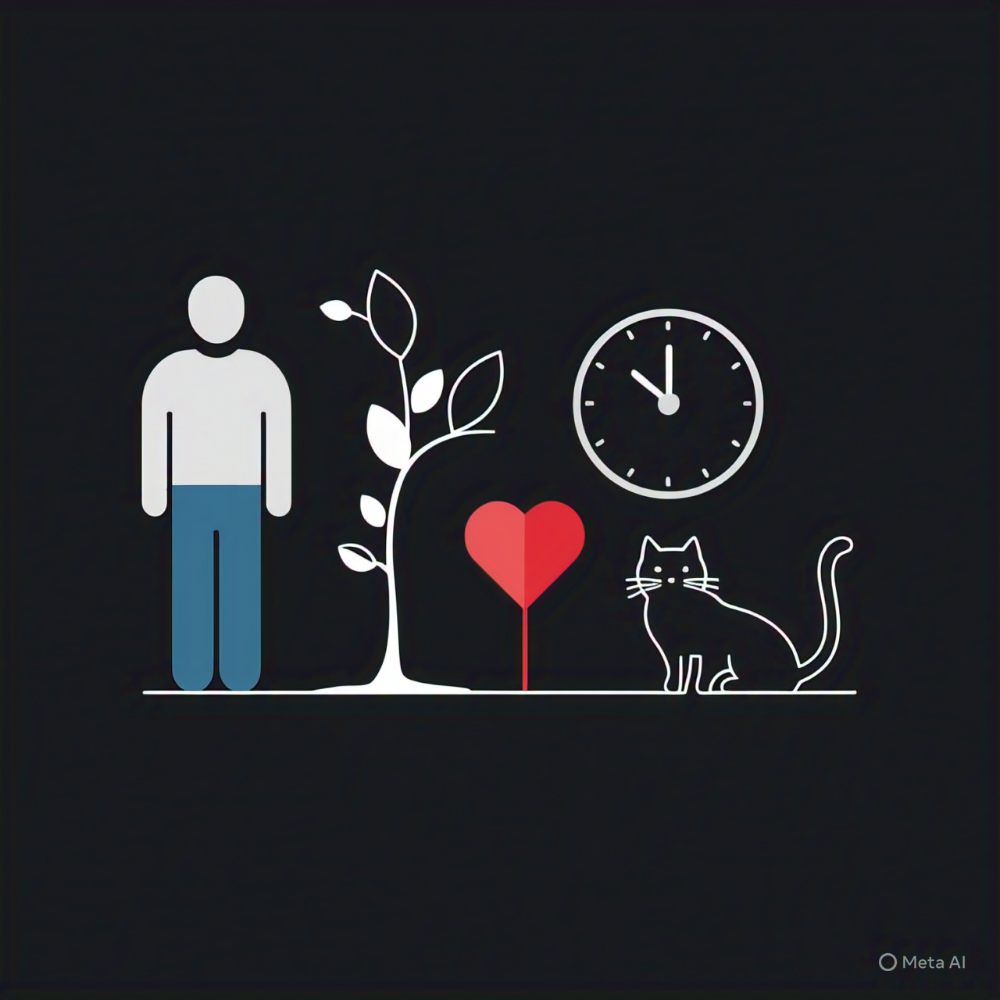

<!-- .slide: data-background-image="../../content/psg-bg-dark.png" data-background-size="100%"-->
 <!-- .element  hidden="true" -->

<br>
<br>
<br>

### Sesión  01
#### Abstracción y Modelado de objetos
#### Representando el mundo real en clases

---
#### El mundo real

---

Es todo lo que nos rodea.

Compuesto por todo lo que vemos, tocamos, olemos, escuchamos, sentimos e imaginamos.

 <!-- .element  width="30%"-->


---
Cada cosa en el mundo real es un objeto. Sea tangible o intangible.

- 👤 Una persona
- 🌃 Un lugar
- 🐔 Un animal
- 😮 Un sentimiento
- 💡 Una idea


---

#### ¿Qué es un Objeto?

---
- Es una entidad que tiene un estado y un comportamiento.


# 🥚🐣🐤🐔

---

#### ¿Qué es un Objeto en el contexto de la programación?

---
- Es un conjunto de datos que representa algo del mundo real.

# 🎤 ⏱️ 🎧 ⏳ ➡ 🎼

- Es parte de un programa, de un sistema o de una aplicación.

# 🍱 📦 🧩 📱

---

¿Que define a un Objeto?

- **Estado**: Son las características que almacena en un momento dado.       
- **Comportamiento**: Son las acciones que el objeto puede realizar.
- **Identidad**: Es lo que distingue a un objeto de otro aunque tengan el mismo estado y comportamiento.

---

Una canción como un objeto

🎼 Hello - Lionel Richie

---

## Estado

🔍 Las características del objeto


- 🎼 Título: Hello
- 🎤 Artista: Lionel Richie
- ⏱️ Duración: 4:14
- 🎧 Género: Pop / Soul
- ⏳ Año: 1984

---

## Comportamiento

⚙️ Lo que puede hacer o lo que le puede pasar

- ▶️ Reproducir
- ⏸️ Pausar
- ⏹️ Detener
- 🔊 Subir volumen
- 🔉 Bajar volumen
- 🔁 Repetir
- ➕ Añadir a playlist

---

## Identidad

🆔 Es una canción única

- 💿 Canción: Hello 
- 🎤 Artista: Lionel Richie (1984) 
  
🆚

- 💿 Canción: Hello
- 🎤 Artista: Adele (2015)

---
#### Preparemos el proyecto para este Study Group

- Crea un repositorio en GitHub con el nombre **psg-oop-2025**
- Añade el archivo **README.md** y el archivo **.gitignore** para Python

---
Clona el repositorio en tu computadora

```bash
git clone https://github.com/<usuario>/psg-oop-2025.git
```

Abre el proyecto en VSCode

```bash
code psg-oop-2025
```

---
Crea una carpeta con el nombre **sesion01**

- Los archivos de esta sesión deben estar dentro de la carpeta **sesion01**

- Al finalizar la sesión, subiremos los cambios al repositorio en un commit

---
### Ejemplo 01

Crea el archivo **ejemplo01.txt** en la carpeta **sesion01**

```markdown
Obtener las características, comportamiento y comparar las identidades de estas dos canciones

- "Stay" de Rihanna & Mikky Ekko
- "Stay" de The Kid LAROI & Justin Bieber
```

---

🎼 Stay - Rihanna & Mikky Ekko

```text
Características:
Título: Stay
Artista: Rihanna, Mikky Ekko
Duración: 4:00
Género: Pop
Año: 2013

Comportamiento:
Reproducir
Pausar
Detener
Subir volumen
Bajar volumen
Repetir

Identidad:
- Stay, Rihanna & Mikky Ekko, Pop, 2013
```

---

3 Minutos

🎼 Stay - The Kid LAROI & Justin Bieber

<iframe src="https://time-stuff.com/embed.html" frameborder="0" scrolling="no" width="391" height="140"></iframe>

---

🎼 Stay - The Kid LAROI & Justin Bieber

```text
Características:
Título: Stay
Artista: The Kid LAROI, Justin Bieber
Duración: 2:21
Género: Pop, Hip-hop
Año: 2021

Comportamiento:
Reproducir
Pausar
Detener
Subir volumen
Bajar volumen
Repetir

Identidad:
- Stay, The Kid LAROI & Justin Bieber, Pop / Hip-hop, 2021
```

---

```text
Aunque ambas canciones se llamen "Stay" el resto de sus características los hacen diferentes.
```


---

Ahora abordaremos un concepto fundamental en la programación orientada a objetos:

### Abstracción

---

#### ¿Qué es la **Abstracción**?

---

- Es el proceso de identificar las características y comportamientos relevantes de un objeto.
- En este proceso se dejan de lado todo aquello que no es relevante para el contexto.

---
¿Que característica tiene?

# 🍅

```text[1|2|3|4|6]
Un tomate es una fruta (tipo)
Un tomate es rojo (color)
Un tomate es dulce (sabor)
Un tomate es redondo (forma)

Un tomate es una fruta roja, dulce y redonda.
```
<!-- .element class="fragment" data-fragment-index="1"-->

---
Las características importantes dependen del contexto.

---

Si soy un granjero que cultiva y vende tomates

¿Qué características me importan?

# 🍅

```markdown
- Especie de tomate (tipo)
- Color del tomate (color)
- Presencia de defectos (calidad)
- Presencia de hongos o insectos (plagas)
- Uso de pesticidas (pesticidas)
- Estado de madurez (madurez)
```

---
Si soy un chef de alta cocina que utiliza tomates en sus recetas

¿Qué características me importan?

# 🍅

```markdown
- Color del tomate (color)
- Tamaño del tomate (tamaño)
- Textura del tomate (textura)
- Forma del tomate (forma)
- Porcentaje de azúcar (sabor)
- Cantidad de jugo (jugosidad)
```

---

Si soy un nutricionista que elabora dietas para personas

¿Qué características me importan?

# 🍅

```markdown
- Porcentaje de agua (hidratación)
- Porcentaje de fibra (fibra)
- Porcentaje de carbohidratos (carbohidratos)
- Porcentaje de proteínas (proteínas)
- Porcentaje de grasas (grasas)
- Porcentaje de vitaminas (vitaminas)
```

---
El mundo real es complejo y está lleno de detalles.

Identificar las características importantes según un contexto nos permite delimitar nuestro enfoque.

> El contexto define qué es importante y qué no.

---
Ejemplo 02

Crea el archivo **ejemplo02.txt** en la carpeta **sesion01**

```markdown
¿Qué características son importantes de una papa 🥔?

- Para un ingeniero eléctrico
- Para un ingeniero de alimentos

```

---
```markdown
Para un ingeniero eléctrico:
- Cantidad de agua (conductividad)
- Cantidad de electrolitos (conductividad)
- Valor de PH ácido (reactivo)
- Resistencia eléctrica (resistencia)
- Tamaño de la papa (tamaño)
```

---


3 minutos

<iframe src="https://time-stuff.com/embed.html" frameborder="0" scrolling="no" width="391" height="140"></iframe>

5 características


---

```markdown
Para un ingeniero de alimentos:
- Cantidad de agua (conservación)
- Cantidad de almidón (textura)
- Presencia de solanina (toxicidad)
- Valor de PH natural (estabilidad)


```

---
Hasta el momento identificamos las características de un objeto del mundo real

Separamos lo importante según el contexto

Es parte del proceso de modelado

---

El enfoque orientado a objetos trata de representar el mundo real en un programa

Lo hace mediante un proceso de análisis y diseño orientado a objetos

Para posteriormente programar el diseño en un lenguaje de programación


---

#### Análisis Orientado a Objetos (AOO)
### OOA

---

- En esta etapa se identifican las características, comportamiento e identidad de los objetos según su contexto.
- También se centra en identificar la interacción entre objetos.
- La etapa de análisis determina todo lo que se considerara para las siguientes etapas.

---

- El resultado de la etapa de análisis un conjunto de requisitos que describen lo que el sistema debe hacer

---

Contiene:

- **Objetos**: Son las entidades que se van a modelar
- *Acciones*: Son las acciones que los objetos pueden realizar

Estructura de los requisitos

*Acciones* de los **Objetos**

---

Ejemplo 03

Crear el archivo **ejemplo03.txt** en la carpeta **sesion01**

```text
Una granja de tomates quiere dar a conocer su nombre y productos
Las personas pueden ver fotos y ubicaciones de los huertos
y comparar los tomates que producen según color, peso y especie
```

---

Obtendremos los objetos y acciones para obtener los requisitos

```text
Requisitos:

- ver fotos y ubicaciones de los huertos
- comparar los tomates según color, peso y especie

Objetos:

- granja 🏡
- huerto 🌱
- tomate 🍅

Características:

- Granja: nombre
- Huerto: ubicación, fotos
- Tomate: color, peso, especie

Acciones:
- ver fotos
- ver ubicaciones
- comparar tomates
``` 

---

Ejemplo 04

Crear el archivo **ejemplo04.txt** en la carpeta **sesion01**

```text
Una aplicación permite descubrir canciones nuevas.
Las personas pueden escuchar fragmentos aleatoriamente,
darle "like" para ver el nombre de la canción, artista y carátula
o "dislike" para pasar a la siguiente.
Compara las canciones con según género, duración y artista.
```

5 minutos

<iframe src="https://time-stuff.com/embed.html" frameborder="0" scrolling="no" width="391" height="140"></iframe>

---
```text
Requisitos:

- escuchar fragmentos aleatoriamente de canciones
- dar "like" para ver el nombre de la canción, artista y carátula
- dar "dislike" para pasar a la siguiente
- comparar canciones según género, duración y artista

Objetos:
- Canción 🎼

Características:
- Canción:
    - nombre
    - artista
    - carátula
    - género
    - duración
    - fragmentos

Acciones:
- escuchar fragmentos
- dar "like"
- dar "dislike"
- ver información
- comparar canciones
```

---

### Diseño Orientado a Objetos (DOO)
#### Oriented Object Design (OOD)

---

- Es la etapa en la que se convierte el análisis orientado a objetos en un diseño orientado a objetos.
- El diseñador debe dar nombre a los objetos y define los comportamientos
- Crea los diagramas de clases y las relaciones entre los objetos.

---
- El resultado de la etapa de diseño es un conjunto de objetos y sus interacciones.
- Al completar esta etapa se tiene un diseño formal que puede ser implementado en un cualquier lenguaje de programación.

---

#### Diagrama de clases

---

#### ¿Qué es una clase?

- Es una plantilla para crear objetos.
- Es un modelo que define las características y comportamientos de un objeto.

---
Una clase esta formada por
- **Nombre de la clase**: Es el nombre que se le da a la clase.
- **Atributos**: Son las características de la clase.
- **Métodos**: Son los comportamientos de la clase.

---
#### Buenas prácticas para nombrar clases

- Utilizar **PascalCase** para nombrar clases.
- Utilizar nombres descriptivos y significativos.
- Evitar abreviaciones y siglas.

[Guía PEP 8](https://peps.python.org/pep-0008/#class-names)

---

- Tratar de utilizar nombres en inglés.
- Utilizar nombres en singular.
- Evitar nombres genéricos como "Clase1" o "Clase2".
- Utilizar nombres que reflejen el propósito de la clase.

---
Ejemplo 05 

Crear el archivo **ejemplo05.txt** en la carpeta **sesion01**

```text
Un panadero quiere hacer galletas en forma de corazón.
Las galletas pueden ser de arándano, menta, piña, uva y naranja.
Deben tener glaseado azul, verde, amarillo, morado y naranja.
```

Realizar el análisis y obtener las clases necesarias

---

```markdown
# Analisis

Requisitos:
- hacer galletas de diferentes sabores
- galletas en forma de corazón
- galletas de arándano, menta, piña, uva y naranja
- glaseado de color azul, verde, amarillo, morado y naranja

Objetos:
- Galleta

Características:
- Galleta:
    - sabor
    - glaseado

Acciones:
- (No hay acciones)
```

---
```markdown
# Diseño:

Clases:
- Galleta 💟:
    - Nombre: GalletaCorazon
    - Atributos:
        - sabor
        - glaseado
    - Métodos:
        - (No hay métodos)

```

Nos da como resultado una clase llamada GalletaCorazon
que nos permite crear objetos GalletaCorazon de diferentes sabores y glaseados.

---

## 💟 ➡ 💙💚💛💜🧡

- **Clase**: GalletaCorazon 💟
- **Objetos**: 
    - 💙 Arándano azul
    - 💚 Menta verde
    - 💛 Piña amarilla
    - 💜 Uva morada
    - 🧡 Naranja anaranjado


---

Ejemplo 06

Crear el archivo **ejemplo06.txt** en la carpeta **sesion01**

```text
Una confitería quiere hacer bombones.
Tienen a disposición chocolate negro o blanco
y pueden o no tener nueces el chocolate
Los moldes pueden ser en forma de estrella y circular
```

Realizar el análisis y obtener las clases necesarias

---

```markdown
# Análisis

Requisitos:
- hacer bombones de chocolate negro y blanco
- los bombones pueden tener nueces
- bombones con forma de estrella y circulo

Objetos:
- Bombón

Características:
- Bombón
    - forma
    - con_nueces
    - chocolate

Acciones:
- (No hay acciones)
```

---

Diseña la clase

3 minutos

<iframe src="https://time-stuff.com/embed.html" frameborder="0" scrolling="no" width="391" height="140"></iframe>

---

```markdown
# Diseño:

Clases:
- Bombon 🧆:
    - Nombre: Bombon
    - Atributos:
        - forma
        - chocolate
        - nueces
    - Métodos:
        - (No hay métodos)
```

---