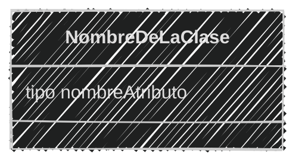
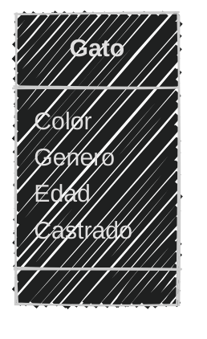
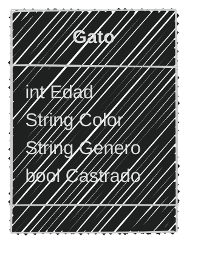
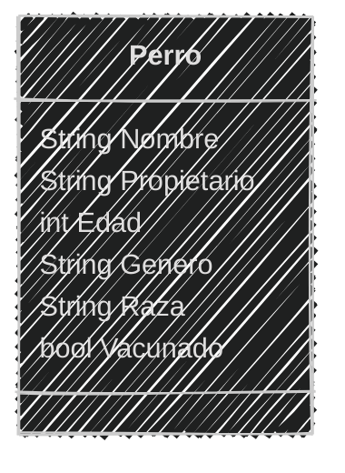
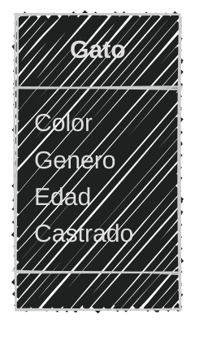
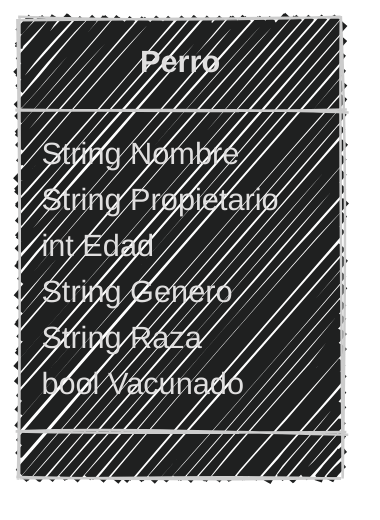

```mermaid
%%{init: {"theme": "dark", "look": "handDrawn" }}%%
flowchart LR
    C{"😺"} -- 🟠 --> D["Color"]
    C -- ♂️ --> F["Género"]
    C -- ⌛️ --> G["Edad"]
    C -- ✂️ --> H["Castrado"]
```

<!-- .slide: data-background-image="../../content/psg-bg-dark.png" data-background-size="100%"-->
 <!-- .element  hidden="true" -->

<br>
<br>
<br>

### Sesión  02
#### Objetos y Atributos
#### Manejo de instancias

---

#### VS Code

Abrimos el proyecto del Study Group

```bash
code psg-oop-2025
```

Creamos una carpeta llamada `sesion02` dentro del proyecto

```bash
mkdir sesion02
```

Aquí guardaremos los ejemplos de la sesión

---

#### Atributos de una clase

Las clases tienen atributos

---

#### Atributos de una clase

- Son las características o propiedades
- Obtenemos los atributos del análisis
- Los atributos son las variables que se definen dentro de una clase


---

Al representar los atributos tratamos que sea lo más general posible

con una sintaxis neutral y no específica de un lenguaje

- int ➡️ Entero
- bool ➡️ Booleano
- float ➡️ Número real
- String ➡️ Cadena de texto

---

En el diagrama de clases los atributos se representan

con su tipo de dato al lado del nombre del atributo



---

### Ejemplo 01

Crea el archivo **ejemplo01.md** en la carpeta **sesion02** 

```markdown
Un coleccionista se dedica a recolectar gatos, las características
que más le gustan son el color, género, edad y si están
castrados o no, va registrando cada gato que encuentra.
```




---

Obteniendo el análisis

```markdown
# Análisis

Requisitos:
- Recolectar gatos
- Registrar los atributos de cada gato

Objetos:
- Gato

Características:
- Gato
    - Color
    - Género
    - Edad
    - Castrado

Acciones:
- (No hay acciones)
```

---

Obteniendo el diseño de diagrama de clase

````markdown


````



---

Atributos de la clase

```markdown[1,7|2,8|3,9|4,10|5,11]
Los atributos son definidos como:
- Edad: Es un número entero
- Color: Es una cadena de texto
- Género: Es una cadena de texto
- Castrado: Es un sí o un no

Representado con tipos de datos
- Edad: int
- Color: String
- Género: String
- Castrado: bool
```

---

Actualizando el diagrama de clases

````markdown

````



---
### Ejemplo 02

Crea el archivo **ejemplo02.md** en la carpeta **sesion02** 

```text
Una veterinaria va registrar a los perros que llegan a consulta
registran el nombre de la mascota y del propietario,
la edad, género, raza y si está vacunado o no 
```

4 minutos (Análisis y diseño de la clase)

<iframe src="https://time-stuff.com/embed.html" frameborder="0" scrolling="no" width="391" height="140"></iframe>

---

Análisis

```markdown
# Análisis
Requisitos:
- Registrar perros
- Registrar los atributos de cada perro
Objetos:
- Perro
Características:
- Perro
    - Nombre
    - Propietario
    - Edad
    - Género
    - Raza
    - Vacunado
Acciones:
- (No hay acciones)
```

---

Diseño

````markdown

````



---

#### Programación

En python podemos representar una clase con la palabra reservada `class`

```python
class Nombre:
    pass
```

Donde:
- `class` es la palabra reservada
- `Nombre` es el nombre de la clase
- `:` es el separador
- `pass` es la palabra reservada para indicar que no hay código en la clase

---
#### Instancia

Una instancia es un objeto creado a partir de una clase

```python
class Nombre:
    pass

a = Nombre()
b = Nombre()
```

Donde:
- Se instancia utilizando el nombre de la clase seguido de paréntesis
- `a` y `b` son instancias de la clase `Nombre`
- `a` y `b` son diferentes, aunque sean de la misma clase

---
#### Añadir atributos

Podemos añadir atributos a una instancia de clase

```python
class Nombre:
    pass
a = Nombre()
a.atributo = "valor"
print(a.atributo)
```

Donde:
- `a` es una instancia de la clase `Nombre`
- `atributo` es el nombre del atributo a añadir
- `"valor"` es el valor del atributo
- `a.atributo` es la forma de asignar y acceder al atributo de la instancia `a`


---

### Ejemplo 03

Crea el archivo **ejemplo03.py** en la carpeta **sesion02** 

```text
Del ejemplo 01 crearemos la primera clase Gato
```



---

Crearemos primero sólo la clase Gato sin atributos e instanciamos un gato

```python
class Gato:
    pass
michi = Gato()
print(michi)
print(type(michi))
```

```bash
python ejemplo03.py
```

```text
<__main__.Gato object at 0x7fe907c618b0>
<class '__main__.Gato'>
```

---

### Ejemplo 04
Crea el archivo **ejemplo04.py** en la carpeta **sesion02** 

```text
Del ejemplo 03 instanciaremos dos gatos y le añadiremos a
cada uno un color, género, edad y si está castrado o no
```

```python
class Gato:
    pass
pelusa = Gato()
pelusa.color = "negro"
pelusa.genero = "hembra"
pelusa.edad = 2
pelusa.castrado = False


miauricio = Gato()
miauricio.color = "naranja"
miauricio.genero = "macho"
miauricio.edad = 1
miauricio.castrado = True

print("Pelusa: ",pelusa)
print(pelusa.color)
print(pelusa.genero)
print(pelusa.edad)
print(pelusa.castrado)
print("Miauricio: ",miauricio)
print(miauricio.color)
print(miauricio.genero)
print(miauricio.edad)
print(miauricio.castrado)
```

---

```bash
python ejemplo04.py
```

```text
Pelusa:  <__main__.Gato object at 0x7f7d7c60c8b0>
negro
hembra
2
False
Miauricio:  <__main__.Gato object at 0x7f7d7c60c430>
naranja
macho
1
True
```

---

### Ejemplo 05

Crea el archivo **ejemplo05.py** en la carpeta **sesion02** 

---

```text
Del ejemplo 02 instanciar dos perros y añadir a cada uno 
un nombre, propietario, edad, género, raza y si está vacunado o no
Muestra los atributos de cada perro
```

4 minutos

<iframe src="https://time-stuff.com/embed.html" frameborder="0" scrolling="no" width="391" height="140"></iframe>

---

```python
class Perro:
    pass
toby = Perro()
toby.nombre = "Toby"
toby.propietario = "Jhon"
toby.edad = 3
toby.genero = "macho"
toby.raza = "labrador"
luna = Perro()
luna.nombre = "Luna"
luna.propietario = "Jane"
luna.edad = 2
luna.genero = "hembra"
luna.raza = "pug"
print("Toby: ",toby)
print(toby.nombre)
print(toby.propietario)
print(toby.edad)
print(toby.genero)
print(toby.raza)
print("Luna: ",luna)
print(luna.nombre)
print(luna.propietario)
print(luna.edad)
print(luna.genero)
print(luna.raza)
```

---

```bash
python ejemplo05.py
```

```text
Toby:  <__main__.Perro object at 0x7f7d7c60c8b0>
Toby
Juan
3
macho
labrador
Luna:  <__main__.Perro object at 0x7f7d7c60c430>
Luna
Jane
2
hembra
pug
```


---

Añadir atributos de esta forma no es recomendable 

Añade complejidad al código y no es escalable

---

¿Existe una forma más sencilla de añadir atributos?

---

Sí, mediante el uso de un constructor

---
#### Constructor

El constructor es un método especial que se ejecuta al crear una instancia de la clase

Permite inicializar los atributos de la clase y asignarles valores

En python se define el método con el nombre `__init__`

---

```python
class Nombre:
    def __init__(self, atrib1, atrib2):
        self.atributo1 = atrib1
        self.atributo2 = atrib2
```
Donde:
- `def` es la palabra reservada para definir un método
- `__init__` es el nombre del método constructor
- `self` es una referencia a la instancia de la clase
- `atrib1` y `atrib2` son los parámetros del constructor que se asigna a la instancia
- `self.atributo1` y `self.atributo2` son los atributos de la instancia

---


---

#### Retos

Crear una carpeta con el nombre "retos_sesion_02" dentro del proyecto en la raíz, en la cual por cada ejercicio debes crear los siguientes archivos:

```bash
# Estructura de carpetas
psg-oop-2025/
    sesion02/
    retos_sesion_01/
        ejercicio_01.md
        ejercicio_02.md
        ejercicio_03.md
```

---

1. Crear un archivo llamado `ejercicio_01.md` en la carpeta retos_sesion_01 y hacer:

    - análisis y diseño

    Para lo siguiente:

    ```text
    Un restaurante quiere ofrecer hamburguesas
    Los clientes pueden elegir entre hamburguesa de res, pollo
    o vegetariana.
    Agregar lechuga, tomate, cebolla y mayonesa como extras
    Y comer en el restaurante o para llevar
    ```


---
2. Crear un archivo llamado `ejercicio_02.md` en la carpeta retos_sesion_01 y hacer:
    
    - análisis y diseño

    Para lo siguiente:

    ```text
    Una tienda de ropa quiere ofrecer camisetas y pantalones
    Los clientes pueden elegir entre camiseta
    de manga corta o larga y pantalón de mezclilla o tela
    Las camisetas pueden ser de color rojo, azul o verde
    y los pantalones de color negro, gris o blanco
    Las camisetas pueden ser tener talas: S, M, L, XL
    Los pantalones tienen desde la talla 32 hasta la talla 44
    ```

---
3. Crear un archivo llamado `ejercicio_03.md` en la carpeta retos_sesion_01 y hacer:
    
    - análisis y diseño

    Para lo siguiente

    ```text
        Estas diseñando una app para dibujar de perros con IA 
        los usuarios pueden seleccionar características como la
        raza del perro como labrador, pastor alemán, y otros
        Cambiar el color del pelaje, tamaño y tipo de orejas  
        Agregar dos accesorios como sombreros o gafas
        El dibujo final puede ser descargado en PNG o JPG
    ```

    
---
<!-- .slide: data-background-image="../../content/psg-bg-dark.png" data-background-size="100%"-->

<br>
<br>
<br>
<br>
<br>

[ <!-- .element width="20%"-->](https://github.com/python-la-paz/python-study-group-oop/tree/main/content/sesion02)

Repositorio de la Sesión

---
<!--.slide: data-visibility="hidden"-->
## Bibliografía y Referencias

- [Object Oriented Analysis](https://www.gyata.ai/es/object-oriented-programming/object-oriented-analysis)
- [DDOO Unidad 1](https://dmd.unadmexico.mx/contenidos/DCEIT/BLOQUE1/DS/02/DDOO/U1/descargables/DDOO_Unidad_1.pdf)
- [Programación procedural VS orientada a objetos](https://programacionpro.com/programacion-procedural-vs-orientada-a-objetos-diferencias-y-similitudes/)
- [Python OOP](https://www.learnpython.org/en/Classes_and_Objects)
- [Atributos de clase](https://oregoom.com/python/atributos-clase/)
- [Diagrama de clases](https://diagramasuml.com/diagrama-de-clases/)
- [Guía PEP 8](https://peps.python.org/pep-0008/#class-names)
- [Mermaid Charts](https://www.mermaidchart.com/play)
- [Draw.io](https://app.diagrams.net/)
- [Python 3 Object-oriented Programming, Second Edition, Dusty PhillipsDusty Phillips](https://github.com/PacktPublishing/Python-3-Object-Oriented-Programming-Second-Edition)
- [Objetos en programación](https://ebac.mx/blog/objeto-en-programacion)
- [Enfoque orientado a objetos](https://1library.co/article/enfoque-orientado-a-objetos-base-te%C3%B3rica.qvld461y)
- [OOAD](https://www.tutorialspoint.com/object_oriented_analysis_design/ooad_object_oriented_analysis.htm)
https://www.visual-paradigm.com/guide/uml-unified-modeling-language/uml-class-diagram-tutorial/
https://www.uml-diagrams.org/data-type.html
https://www.edrawsoft.com/es/diagram-tips/class-diagram.html
https://miro.com/es/diagrama/que-es-diagrama-clases-uml/#atributos
https://www.visual-paradigm.com/guide/uml-unified-modeling-language/uml-class-diagram-tutorial/
https://ellibrodepython.com/programacion-orientada-a-objetos-python