<!-- .slide: data-background-image="../../content/psg-bg-dark.png" data-background-size="100%"-->
 <!-- .element  hidden="true" -->

<br>
<br>
<br>

### Sesión  02
#### Objetos y Atributos
#### Manejo de instancias

---
### Antes de empezar
---

#### Proyecto en VSCode

- Abre el proyecto en VSCode

```bash
code psg-oop-2025
```

- Crea una carpeta con el nombre `sesion02`

```bash
mkdir sesion02
```

- Los archivos de esta sesión deben estar dentro de esta carpeta

- Al finalizar la sesión, sube los cambios al repositorio en un commit

---

#### Atributos de una clase

- Son las características o propiedades
- Obtenemos los atributos del análisis
- Los atributos son las variables que se definen dentro de una clase

---

#### Atributos de una clase

```mermaid
%%{init: {"theme": "dark", "look": "handDrawn" }}%%
mindmap
  root((🍎))
    Color
    Sabor
    Tamaño
    Variedad
    Semillas
```
<!--.element class="center-mermaid"-->

---

Al representar los **tipos de datos de los atributos** tratamos que sean lo más **genéricos** 

Utilizaremos una **sintaxis neutral** y no específica de un lenguaje

- int ➡️ Entero
- bool ➡️ Booleano
- float ➡️ Número real
- String ➡️ Cadena de texto

---

#### Atributos de una clase

```mermaid
%%{init: {"theme": "dark", "look": "handDrawn" }}%%
mindmap
  root((🍎))
    Color: String
    Sabor: String
    Tamaño: float
    Variedad: String
    Semillas: bool
```
<!--.element class="center-mermaid"-->

---

#### Diagrama de clases

Los atributos se representan con su *tipo* de dato al lado izquierdo del *nombre*

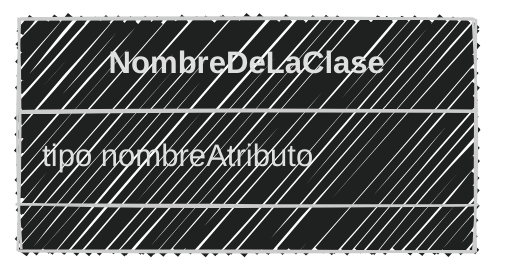
<!--.element class="center-mermaid"-->

---

### Ejemplo 01

Crea el archivo **michi.md** en la carpeta **sesion02** 

```markdown
Un coleccionista de gatos los recolecta según sus
características. Las características que mas le importan
son el color, género, edad y si están castrados o no. 
El coleccionista registra los datos de cada gato 
que encuentra
```


```mermaid
%%{init: {"theme": "dark", "look": "handDrawn" }}%%
flowchart TD
    C{"😺"} -- 🟠 --> D["Color"]
    C -- ♂️ --> F["Género"]
    C -- ⌛️ --> G["Edad"]
    C -- ✂️ --> H["Castrado"]
```
<!--.element class="center-mermaid"-->

---

#### Realizamos el análisis

```markdown
Requisitos:
- Recolectar gatos
- Registrar los atributos de cada gato

Objetos:
- Gato

Características:
- Gato
    - Color
    - Género
    - Edad
    - Castrado

Acciones:
- (No hay acciones)
```

---

#### Realizamos el diseño de diagrama de clase

````markdown

````

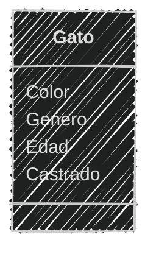

---

#### Atributos de la clase

```markdown[1,7|2,8|3,9|4,10|5,11]
Definimos los atributos de la clase Gato
- Edad: Como un número entero
- Color: Como una cadena de texto
- Género: Como una cadena de texto
- Castrado: Como un sí o un no

Representamos los atributos con un tipo de dato
- Edad: int
- Color: String
- Género: String
- Castrado: bool
```

---

#### Actualizando el diagrama de clases

````markdown

````

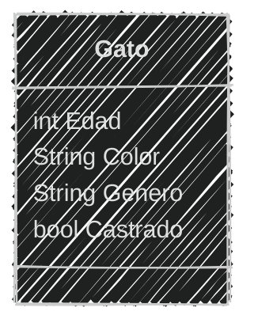

---

### Ejercicio para ti (02)

Crea el archivo **perro.md** en la carpeta **sesion02** 

```text
En un clinica veterinaria quieres registrar a los perros 
que llegan a consulta.
De cada perro se necesita registrar su nombre, edad, 
género, raza y si está vacunado ademas del nombre 
del propietario.
```

Obtener el *Análisis de la clase*

3 minutos 

<iframe src="https://time-stuff.com/embed.html" frameborder="0" scrolling="no" width="391" height="140"></iframe>

---

#### Análisis

```markdown
Requisitos:
- Registrar perros
- Registrar los atributos de cada perro
Objetos:
- Perro
Características:
- Perro
    - Nombre
    - Edad
    - Género
    - Raza
    - Vacunado
    - Propietario
Acciones:
- (No hay acciones)
```

---

#### Ejercicio para ti (02)

Realizamos el diseño del *diagrama de clase*

3 minutos

<iframe src="https://time-stuff.com/embed.html" frameborder="0" scrolling="no" width="391" height="140"></iframe>

---

#### Diseño

````markdown

````

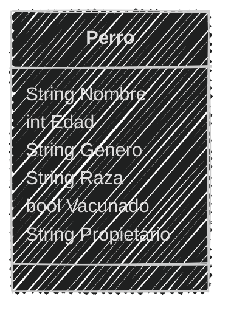

---

Ya tenemos el *análisis y diseño* de la clase

Ahora podemos pasar a la etapa de **programación**

Con `Python`

Dándole vida a las clases

---

### Creando Clases en Python

En python podemos representar una clase con la palabra reservada `class`

```python
class Gato:
    pass
```

Donde:
- `class` es la palabra reservada
- `Gato` es el nombre de la clase
- `:` es el separador
- `pass` es la palabra reservada para indicar que no hay código en la clase

---

De las clases podemos crear *instancias*

Las *instancias* son **objetos** creados a partir de una **clase**

---
### Instancia

Una instancia es un objeto creado a partir de una clase

```python
class Gato:
    pass

michi = Gato()
mau = Gato()
```

Donde:
- Se instancia utilizando el nombre de la clase seguido de paréntesis
- `michi` y `mau` son instancias de la clase `Gato`
- `michi` y `mau` son diferentes, aunque sean de la misma clase

---
#### Atributos de instancia

Podemos añadir atributos a una instancia de clase

```python
class Gato:
    pass
michi = Gato()
michi.color = "naranja"
print(michi.color)
```

Donde:
- `michi` es una instancia de la clase `Gato`
- `color` es el nombre del atributo a añadir
- `"naranja"` es el valor del atributo
- `michi.color` es la forma de asignar y acceder al atributo color del objeto `michi`


---

### Ejemplo 03

Crea el archivo **michi.py** en la carpeta **sesion02** 

Utilizando el análisis y diseño del ejemplo 01
---
#### Análisis

```markdown
Requisitos:
- Recolectar gatos
- Registrar los atributos de cada gato

Objetos:
- Gato

Características:
- Gato
    - Color
    - Género
    - Edad
    - Castrado

Acciones:
- (No hay acciones)
```

---

#### Diseño del diagrama de clases

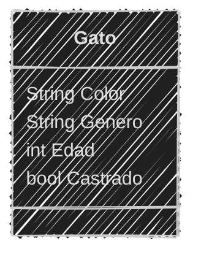
<!--.element class="center-mermaid"-->

---
#### Creando la clase en Python

Crearemos primero sólo la clase Gato sin atributos e instanciamos un gato

```python
class Gato:
    pass
pelusa = Gato()
print(pelusa)
print(type(pelusa))
```

```bash
python michi.py
```

```text
<__main__.Gato object at 0x7fe907c618b0>
<class '__main__.Gato'>
```

---

### Ejemplo 04

Ahora añadimos atributos a las instancias

Del ejemplo 03 instanciaremos dos gatos y le añadiremos a
cada uno un color, género, edad y si está castrado o no

---

```python
class Gato:
    pass
# Instanciar
pelusa = Gato()
miauricio = Gato()

# Añadir atributos
pelusa.color = "negro"
pelusa.genero = "hembra"
pelusa.edad = 2
pelusa.castrado = False

miauricio.color = "naranja"
miauricio.genero = "macho"
miauricio.edad = 1
miauricio.castrado = True

# Mostrar atributos
print("Pelusa: ",pelusa)
print(pelusa.color)
print(pelusa.genero)
print(pelusa.edad)
print(pelusa.castrado)
print("Miauricio: ",miauricio)
print(miauricio.color)
print(miauricio.genero)
print(miauricio.edad)
print(miauricio.castrado)
```

---

```bash
python michi.py
```

```text
Pelusa:  <__main__.Gato object at 0x7f7d7c60c8b0>
negro
hembra
2
False
Miauricio:  <__main__.Gato object at 0x7f7d7c60c430>
naranja
macho
1
True
```

---

Si bien Python soporta la asignación directa de atributos
para instancias. Esta es una **mala práctica** por que incrementa la complejidad de nuestra solución y **no es escalable**

---

#### ¿Existe una forma más eficiente de añadir atributos?

---

Sí, mediante el uso de un `constructor`

---
#### Constructor

Un constructor es un **método** especial que permite **inicializar los atributos** de una clase.

Permite que la creación de instancias sea más sencilla y escalable

---

- El constructor se ejecuta al momento de crear una instancia

- Inicializa los atributos de la clase con los valores que se le pasan como parámetros

- En python se define el método con el nombre especial `__init__`

---

Estructura del constructor

```python [2-4]
class Gato:
    def __init__(self, color, edad):
        self.color = color
        self.edad = edad
```
Donde:
- `def` palabra reservada para definir un método
- `__init__` es el nombre del método constructor
- `self` es una referencia a la instancia de la clase
- `color` y `edad` son los parámetros del constructor que se asigna a la instancia
- `self.color` y `self.edad` son los atributos de la instancia

---

#### `self`

- `self` es una convención en python
- `self` no es una palabra reservada
- `self` puede ser reemplazada por cualquier otro nombre
- `self` es el primer parámetro de todos los métodos de instancia

---

Después de definir el `constructor` podemos **instanciar la clase** enviando los valores de los atributos

---

#### Ejemplo 05

Crea el archivo **gato.py** en la carpeta **sesion02** 

```text
Crearemos una clase Gato con el atributo color
Utilizando el constructor para inicializar el atributo
e instanciar dos gatos con diferente color
```

```python
class Gato:
    def __init__(self, color):
        self.color = color
pantera = Gato("negro")
snowball = Gato("blanco")
print(pantera.color)
print(snowball.color)
```

```bash
python gato.py
```

```text
negro
blanco
```

---

Para utilizar el constructor enviamos los valores de los atributos
al momento de instanciar la clase

```python
pantera = Gato("negro")
snowball = Gato("blanco")
```

---

#### Ejemplo 06

Crea el archivo **michi_constructor.py** en la carpeta **sesion02** 

```text
Del ejemplo 04 vamos a crear la clase Gato declarando 
un constructor e instanciaremo dos gatos
```

---

Clase con constructor y atributos

```python [1-6|7-9|10-15|16-20]
class Gato:
    def __init__(self, color, genero, edad, castrado):
        self.color = color
        self.genero = genero
        self.edad = edad
        self.castrado = castrado
# Instanciar
pelusa = Gato("Negro", "hembra", 2, False)
miauricio = Gato("Naranja", "macho", 1, True)
# Mostrar atributos
print("Pelusa: ",pelusa)
print(pelusa.color)
print(pelusa.genero)
print(pelusa.edad)
print(pelusa.castrado)
print("Miauricio: ",miauricio)
print(miauricio.color)
print(miauricio.genero)
print(miauricio.edad)
print(miauricio.castrado)
```

---

Ejecutamos el script

```bash
python michi_constructor.py
```

```text
Pelusa:  <__main__.Gato object at 0x7faeb4380f10>
Negro
hembra
2
False
Miauricio:  <__main__.Gato object at 0x7faeb4380f70>
Naranja
macho
1
True
```

---
### Ejercicio para ti (07)

Crea el archivo **perro.py** en la carpeta **sesion02** 

```text
Del ejemplo 02 crea la clase Perro, declara su constructor
e instancia dos perros.
```
---
#### Análisis

```markdown

Requisitos:
- Registrar perros
- Registrar los atributos de cada perro
Objetos:
- Perro
Características:
- Perro
    - Nombre
    - Edad
    - Género
    - Raza
    - Vacunado
    - Propietario
Acciones:
- (No hay acciones)
```

---

#### Diseño del diagrama de clases

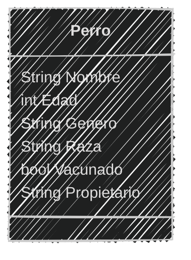
<!--.element class="center-mermaid"-->

Crea la clase con el constructor e instancia dos perros

4 minutos

<iframe src="https://time-stuff.com/embed.html" frameborder="0" scrolling="no" width="391" height="140"></iframe>

---

#### Clase con constructor y atributos

```python [1-7|8-10|11-17|18-23]
class Perro:
    def __init__(self, nombre, edad, genero, raza, propietario):
        self.nombre = nombre
        self.edad = edad
        self.genero = genero
        self.raza = raza
        self.propietario = propietario
# Instanciar
toby = Perro("Toby", 3, "macho", "labrador", "Juan")
luna = Perro("Luna", 2, "hembra", "pug", "Jane")
# Mostrar atributos
print("Toby: ",toby)
print(toby.nombre)
print(toby.edad)
print(toby.genero)
print(toby.raza)
print(toby.propietario)
print("Luna: ",luna)
print(luna.nombre)
print(luna.edad)
print(luna.genero)
print(luna.raza)
print(luna.propietario)
```

---

#### Ejecutamos el script

```bash
python veterinaria.py
```

```text
Toby:  <__main__.Perro object at 0x7efdd7bb4f10>
Toby
3
macho
labrador
Juan
Luna:  <__main__.Perro object at 0x7efdd7bb4a90>
Luna
2
hembra
pug
Jane
```

---

### Atributos de clase

Son atributos que pertenecen a la **clase** y NO a las instancias

- Se definen dentro de la clase pero fuera de los métodos
- Se accede a ellos mediante el nombre de la clase
- Se comparten entre todas las instancias de la clase

---
Sirven para definir constantes o valores que no cambian

```python	
class Gato:
    especie = "felino"
    def __init__(self, color):
        self.color = color
```

Donde:

- `especie` es el nombre del atributo de clase
- `felino` es el valor del atributo de clase
- `self.color` es el nombre del atributo de instancia
- `color` es el valor del atributo de instancia

---

Las instancias pueden acceder a los atributos de clase

```python [1-4|5-6|7-8|9-10]
class Gato:
    especie = "felino"
    def __init__(self, color):
        self.color = color
pantera = Gato("negro")
snowball = Gato("blanco")
print(pantera.especie, pantera.color)
print(snowball.especie, snowball.color)
# Atributo de clase
print(Gato.especie)
```

```text
felino negro
felino blanco
felino
```

---

Diferencia entre atributos de clase e instancia

| **Clase**                                                   | *Instancia*                                            |
| ----------------------------------------------------------- | ------------------------------------------------------ |
| Se definen dentro de la clase pero **fuera** de los métodos | Se definen *dentro* de los métodos de la clase         |
| Se accede a ellos mediante el nombre de la **clase**        | Se accede a ellos mediante el nombre de la *instancia* |
| Se **comparten** entre todas las instancias                 | Son *únicos* para cada instancia de la clase           |

---

### Ejemplo 08 

Modificaremos **michi_constructor.py** en **sesion02** 

```text
Del ejemplo 06 modificaremos la clase Gato agregando el 
atributo de clase "especie" por que todos los 
gatos son felinos.
Después instanciaremos dos gatos.
```
---
#### Análisis

```markdown
Requisitos:
- Recolectar gatos
- Registrar los atributos de cada gato
- Todos los gatos son felinos

Objetos:
- Gato

Características:
- Gato
    - Especie
    - Color
    - Género
    - Edad
    - Castrado

Acciones:
- (No hay acciones)
```

---

#### Diseño del diagrama de clases

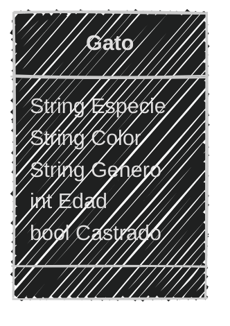
<!--.element class="center-mermaid"-->

---

#### Clase con atributo de clase y atributos de instancia

```python [1-7|2|3-7|9-10|11-15|16-20|21]
class Gato:
    especie = "felino"
    def __init__(self, color, genero, edad, castrado):
        self.color = color
        self.genero = genero
        self.edad = edad
        self.castrado = castrado

michi = Gato("Negro", "hembra", 2, False)
miauricio = Gato("Naranja", "macho", 1, True)
print("Michi: ", michi.especie)
print(michi.color)
print(michi.genero)
print(michi.edad)
print(michi.castrado)
print("Miauricio: ", miauricio.especie)
print(miauricio.color)
print(miauricio.genero)
print(miauricio.edad)
print(miauricio.castrado)
print("Gato es: ", Gato.especie)
```

---

#### Ejecutamos el script

```bash
python michi_constructor.py
```

```text
Michi: felino
Negro
hembra
2
False
Miauricio: felino
Naranja
macho
1
True
Gato es: felino
```

---

### Ejercicio para ti (09)
Modifica el archivo **perro.py** en la carpeta **sesion02** 

```text
Del ejemplo 07 modificar la clase Perro con
tres atributos de clase. Toma en cuenta que 
todos los perros son caninos, mamíferos y terrestres
Después instancia dos perros.

```
---
#### Análisis

```markdown
Requisitos:
- Registrar perros
- Registrar los atributos de cada perro
Objetos:
- Perro
Características:
- Perro
    - Especie
    - Tipo
    - Habitat
    - Nombre
    - Edad
    - Género
    - Raza
    - Vacunado
    - Propietario
Acciones:
- (No hay acciones)
```

---

#### Diseño del diagrama de clases

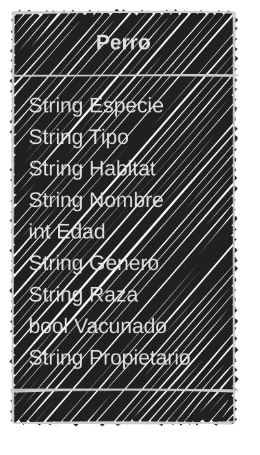
<!--.element class="center-mermaid"-->

2 minutos

<iframe src="https://time-stuff.com/embed.html" frameborder="0" scrolling="no" width="391" height="140"></iframe>

---
#### Definición de la clase en Python
```python
class Perro:
    especie = "canino"
    tipo = "mamífero"
    habitat = "terrestre"
    def __init__(self, nombre, edad, genero, raza, propietario):
        self.nombre = nombre
        self.edad = edad
        self.genero = genero
        self.raza = raza
        self.propietario = propietario
toby = Perro("Toby", 3, "macho", "labrador", "Juan")
luna = Perro("Luna", 2, "hembra", "pug", "Jane")
print("Toby: ",toby.tipo, toby.especie, toby.habitat)
print(toby.nombre)
print(toby.edad)
print(toby.genero)
print(toby.raza)
print(toby.propietario)
print("Luna: ",luna.tipo, luna.especie, luna.habitat)
print(luna.nombre)
print(luna.edad)
print(luna.genero)
print(luna.raza)
print(luna.propietario)
print("Perro es: ", Perro.tipo, "Especie: ", Perro.especie, "Habitat: ", Perro.habitat)
```

---
#### Ejecutamos el script

```bash
python perro.py
```

```text
Toby:  mamífero canino terrestre
Toby
Juan
3
macho
labrador
Luna:  mamífero canino terrestre
Luna
Jane
2
hembra
pug
Perro es:  mamífero Especie:  canino Habitat:  terrestre
```

---

### Modificación de los atributos

Podemos modificar los **atributos** de una **instancia** utilizando su nombre seguido de un punto y el nombre del atributo

```python
NombreClase.atributo = nuevo_valor
```

Donde:
- `NombreClase` es el nombre de la clase
- `atributo` es el nombre del atributo a modificar
- `nuevo_valor` es el nuevo valor del atributo

---

- Recuerda que los **atributos de clase** son compartidos entre todas las instancias
- Si modificas el atributo de clase **todas las instancias verán el nuevo valor**
- Si modificas el **atributo de instancia** sólo esa instancia verá el nuevo valor

---
### Ejemplo 10

Crea el archivo **refugio.md** y el archivo **refugio.py** en la carpeta **sesion02** 

```text
Un refugio de mascotas quiere registrar a los perros y gatos
que ingresan al refugio.
De cada mascota necesitan registrar el nombre, especie y origen.
Todas las mascotas tienen como origen "abandonado", este valor 
cambia a "rescatado" despues de un tiempo.
```
---

#### Análisis

```markdown
Requisitos:
- Registrar animales
- Registrar los atributos de cada animal
- Actualizar su origen después de registrarlos

Objetos:
- Mascota

Características:
- Mascota
    - Origen
    - Nombre
    - Especie

Acciones:
- (No hay acciones)
```

---

#### Diseño del diagrama de clases

````markdown

````
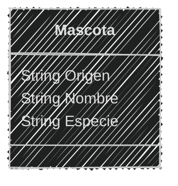

---

#### Definición de la clase en Python

```python [1-5|7-11|13-17|18-20]
class Mascota:
    origen = "abandonado"
    def __init__(self, nombre, especie):
        self.nombre = nombre
        self.especie = especie

print ("Mascotas encontradas...")
perro = Mascota("Perro 001", "perro")
gato = Mascota("Gato 002", "gato")
print("Mascota 1: ",perro.origen, perro.nombre, perro.especie)
print("Mascota 2: ",gato.origen, gato.nombre, gato.especie)

print("Rescatando mascotas...")
Mascota.origen = "rescatado"
perro.nombre = "Milaneso"
gato.nombre = "Kitty"

print("Mascotas rescatadas...")
print("Mascota 1: ",perro.origen, perro.nombre, perro.especie)
print("Mascota 2: ",gato.origen, gato.nombre, gato.especie)
```

---
#### Ejecutamos el script
```bash
python refugio.py
```

```text
Mascotas encontradas...
Mascota 1:  abandonado Perro 001 perro
Mascota 2:  abandonado Gato 002 gato
Rescatando mascotas...
Mascotas rescatadas...
Mascota 1:  rescatado Milaneso perro
Mascota 2:  rescatado Kitty gato
```

---
### Ejercicio para ti (11)

Crea el archivo **acuario.md** y el archivo **acuario.py** en la carpeta **sesion02** 

```text
Un acuario quiere llevar un registro de los peces que tiene.
Necesitan registrar la especie, peso y origen.
Los peces pueden ser de agua dulce o salada.
Todos los peces son criados en cautiverio.
Antes de liberarlos se actualiza su peso y luego son liberados.
```

Obtener el *Análisis de la clase*

3 minutos

<iframe src="https://time-stuff.com/embed.html" frameborder="0" scrolling="no" width="391" height="140"></iframe>

---

#### Analisis

```markdown
Requisitos:
- Registrar peces
- Registrar los atributos de cada pez
- Actualizar su peso antes de liberarlos
- Liberar los peces
Objetos:
- Pez
Características:
- Pez
    - Origen
    - Especie
    - Peso
    - Agua

Acciones:
- (No hay acciones)
```

---

### Ejercicio para ti (11)

Realizamos el diseño del *diagrama de clase*

3 minutos

<iframe src="https://time-stuff.com/embed.html" frameborder="0" scrolling="no" width="391" height="140"></iframe>

---

#### Diseño del diagrama de clases

````markdown

````

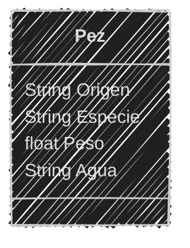

---


Ya tenemos el *análisis y diseño* de la clase

Ahora podemos **programar**

4 minutos

<iframe src="https://time-stuff.com/embed.html" frameborder="0" scrolling="no" width="391" height="140"></iframe>

---
##### Definición de la clase en Python
```python
class Pez:
    origen = "criado en cautiverio"
    def __init__(self, especie, peso, agua):
        self.especie = especie
        self.peso = peso
        self.agua = agua

print ("Peces encontrados...🐠")
pez1 = Pez("Pez payaso", 0.5, "agua dulce")
pez2 = Pez("Pez betta", 0.3, "agua dulce")
print("Pez 1: ",pez1.origen, pez1.especie, pez1.peso, pez1.agua)
print("Pez 2: ",pez2.origen, pez2.especie, pez2.peso, pez2.agua)

print("Liberando peces...")
pez1.peso = 0.6
pez2.peso = 0.4
Pez.origen = "liberado"

print("Peces liberados...🐟")
print("Pez 1: ",pez1.origen, pez1.especie, pez1.peso, pez1.agua)
print("Pez 2: ",pez2.origen, pez2.especie, pez2.peso, pez2.agua)
```
---
#### Ejecutamos el script
```bash
python acuario.py
```

```text
Peces encontrados...🐠
Pez 1:  criado en cautiverio Pez payaso 0.5 agua dulce
Pez 2:  criado en cautiverio Pez betta 0.3 agua dulce
Liberando peces...
Peces liberados...🐟
Pez 1:  liberado Pez payaso 0.6 agua dulce
Pez 2:  liberado Pez betta 0.4 agua dulce
```

---

#### Resumen

- Los atributos de una clase representan las características o propiedades de los objetos y se definen dentro de la clase.
- Es importante analizar y definir los atributos de manera general y con una sintaxis neutral, usando tipos de datos como entero, booleano, número real y cadena de texto.

---

- En los diagramas de clases los atributos se representan con su tipo de dato al lado del nombre.
- Las instancias son objetos creados a partir de una clase y que cada instancia puede tener sus propios atributos.
- Se pueden añadir atributos a las instancias directamente, pero no es recomendable porque no es escalable.

---

- El constructor es un método especial que permite inicializar los atributos de una clase al momento de crear una instancia, y en Python se define con el método `__init__`.
- El parámetro self es una convención en Python y se utiliza para referirse a la instancia actual dentro de los métodos de la clase.

---

- Los atributos de clase pertenecen a la clase y no a las instancias, se definen fuera de los métodos y se comparten entre todas las instancias.
- Diferencia entre atributos de clase y atributos de instancia: los de clase son compartidos y los de instancia son únicos para cada objeto.

---

- Se pueden modificar los atributos de instancia y de clase, y que al modificar un atributo de clase, el cambio afecta a todas las instancias.
- Es importante organizar el análisis y diseño de clases antes de programar, identificando requisitos, objetos, características y acciones.

---

#### Retos

Crear una carpeta con el nombre "retos_sesion_02" dentro del proyecto en la raíz, en la cual por cada ejercicio debes crear los siguientes archivos:

```bash
# Estructura de carpetas
psg-oop-2025/
    sesion02/
    retos_sesion_02/
        ejercicio_01.md
        ejercicio_01.py
        ejercicio_02.md
        ejercicio_02.py
```

---

1. Crear un archivo llamado `ejercicio_01.md` y un archivo `ejercicio_01.py` en la carpeta `retos_sesion_02`
    
 
```text
Un zoológico quiere llevar un registro de los animales que llegan 
a sus instalaciones.
Necesitan registrar su especie, tipo y lugar donde los encontraron.
Los animales del zoológico pueden ser mamíferos, reptiles o aves.
El origen de todos los animales es "feral". 
Este zoológico cuenta con 2 mamíferos, 1 reptil y 1 ave

- Realiza el análisis y diseño de la clase Animal
- Escribe el codigo en Python para crear la clase Animal
- Instancia los 4 animales con sus respectivos atributos
```

---
2. Crear un archivo llamado `ejercicio_02.md` y un archivo `ejercicio_02.py` en la carpeta `retos_sesion_02`

```text
Una vinoteca quiere registrar los vinos y quesos que ofrecen.
De cada vino se necesita registrar su nombre, tipo, cepa y 
año de producción.
De cada queso se necesita registrar su nombre, variedad, 
edad y si lleva sal.
La vinoteca tiene en su inventario 4 vinos y 3 quesos 

- Realiza el análisis y diseño de las clases Vino y Queso
- Escribe el codigo en Python para crear la clases Vino y Queso
- Instancia los 4 vinos y 3 quesos con sus respectivos atributos
```
    
---
<!-- .slide: data-background-image="../../content/psg-bg-dark.png" data-background-size="100%"-->

<br>
<br>
<br>
<br>
<br>

[ <!-- .element width="20%"-->](https://github.com/python-la-paz/python-study-group-oop/tree/main/content/sesion02)

Repositorio de la Sesión

---
<!--.slide: data-visibility="hidden"-->
## Bibliografía y Referencias

- [UML Class Diagram Tutorial](https://www.visual-paradigm.com/guide/uml-unified-modeling-language/uml-class-diagram-tutorial/)
- [Data Type](https://www.uml-diagrams.org/data-type.html)
- [Edraw](https://www.edrawsoft.com/es/diagram-tips/class-diagram.html)
- [Miro](https://miro.com/es/diagrama/que-es-diagrama-clases-uml/#atributos)
- [Python OOP](https://ellibrodepython.com/programacion-orientada-a-objetos-python)
- [Python 3 Object-oriented Programming, Second Edition, Dusty PhillipsDusty Phillips](https://github.com/PacktPublishing/Python-3-Object-Oriented-Programming-Second-Edition)
- [Programación procedural VS orientada a objetos](https://programacionpro.com/programacion-procedural-vs-orientada-a-objetos-diferencias-y-similitudes/)
- [Python OOP](https://www.learnpython.org/en/Classes_and_Objects)
- [Atributos de clase](https://oregoom.com/python/atributos-clase/)
- [Diagrama de clases](https://diagramasuml.com/diagrama-de-clases/)
- [Guía PEP 8](https://peps.python.org/pep-0008/#class-names)
- [Mermaid Charts](https://www.mermaidchart.com/play)
- [Draw.io](https://app.diagrams.net/)
- [Objetos en programación](https://ebac.mx/blog/objeto-en-programacion)