<!-- .slide: data-background-image="../../content/psg-bg-dark.png" data-background-size="100%"-->
 <!-- .element  hidden="true" -->

<br>
<br>
<br>

### Sesión  02
#### Objetos y Atributos
#### Manejo de instancias

---

#### VS Code

Abrimos el proyecto del Study Group

```bash
code psg-oop-2025
```

Creamos una carpeta llamada `sesion02` dentro del proyecto

```bash
mkdir sesion02
```

Aquí guardaremos los ejemplos de la sesión

---

#### Atributos de una clase

Las clases tienen atributos

---

#### Atributos de una clase

- Son las características o propiedades
- Obtenemos los atributos del análisis
- Los atributos son las variables que se definen dentro de una clase


---

Al representar los atributos tratamos que sea lo más general posible

con una sintaxis neutral y no específica de un lenguaje

- int ➡️ Entero
- bool ➡️ Booleano
- float ➡️ Número real
- String ➡️ Cadena de texto

---

En el diagrama de clases los atributos se representan

con su tipo de dato al lado del nombre del atributo

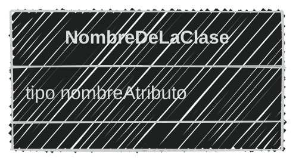

---

### Ejemplo 01

Crea el archivo **ejemplo01.md** en la carpeta **sesion02** 

```markdown
Un coleccionista se dedica a recolectar gatos, las características
que más le gustan son el color, género, edad y si están
castrados o no, va registrando cada gato que encuentra.
```


```mermaid
%%{init: {"theme": "dark", "look": "handDrawn" }}%%
flowchart LR
    C{"😺"} -- 🟠 --> D["Color"]
    C -- ♂️ --> F["Género"]
    C -- ⌛️ --> G["Edad"]
    C -- ✂️ --> H["Castrado"]
```

---

Obteniendo el análisis

```markdown
# Análisis

Requisitos:
- Recolectar gatos
- Registrar los atributos de cada gato

Objetos:
- Gato

Características:
- Gato
    - Color
    - Género
    - Edad
    - Castrado

Acciones:
- (No hay acciones)
```

---

Obteniendo el diseño de diagrama de clase

````markdown


````

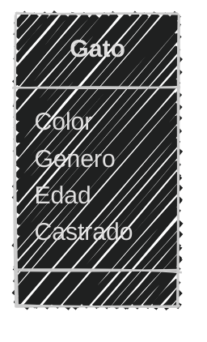

---

Atributos de la clase

```markdown[1,7|2,8|3,9|4,10|5,11]
Los atributos son definidos como:
- Edad: Es un número entero
- Color: Es una cadena de texto
- Género: Es una cadena de texto
- Castrado: Es un sí o un no

Representado con tipos de datos
- Edad: int
- Color: String
- Género: String
- Castrado: bool
```

---

Actualizando el diagrama de clases

````markdown

````

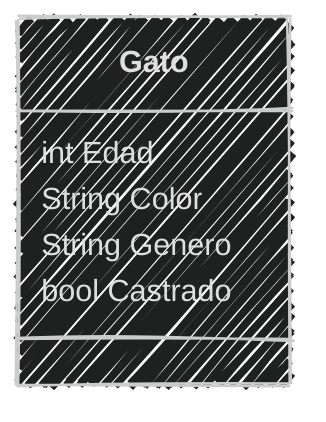

---
### Ejemplo 02

Crea el archivo **ejemplo02.md** en la carpeta **sesion02** 

```text
Una veterinaria va registrar a los perros que llegan a consulta
registran el nombre de la mascota y del propietario,
la edad, género, raza y si está vacunado o no 
```

4 minutos (Análisis y diseño de la clase)

<iframe src="https://time-stuff.com/embed.html" frameborder="0" scrolling="no" width="391" height="140"></iframe>

---

Análisis

```markdown
# Análisis
Requisitos:
- Registrar perros
- Registrar los atributos de cada perro
Objetos:
- Perro
Características:
- Perro
    - Nombre
    - Propietario
    - Edad
    - Género
    - Raza
    - Vacunado
Acciones:
- (No hay acciones)
```

---

Diseño

````markdown

````

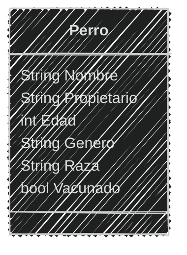

---

#### Programación

En python podemos representar una clase con la palabra reservada `class`

```python
class Nombre:
    pass
```

Donde:
- `class` es la palabra reservada
- `Nombre` es el nombre de la clase
- `:` es el separador
- `pass` es la palabra reservada para indicar que no hay código en la clase

---
#### Instancia

Una instancia es un objeto creado a partir de una clase

```python
class Nombre:
    pass

a = Nombre()
b = Nombre()
```

Donde:
- Se instancia utilizando el nombre de la clase seguido de paréntesis
- `a` y `b` son instancias de la clase `Nombre`
- `a` y `b` son diferentes, aunque sean de la misma clase

---
#### Atributos de instancia

Podemos añadir atributos a una instancia de clase

```python
class Nombre:
    pass
a = Nombre()
a.atributo = "valor"
print(a.atributo)
```

Donde:
- `a` es una instancia de la clase `Nombre`
- `atributo` es el nombre del atributo a añadir
- `"valor"` es el valor del atributo
- `a.atributo` es la forma de asignar y acceder al atributo de la instancia `a`


---

### Ejemplo 03

Crea el archivo **ejemplo03.py** en la carpeta **sesion02** 

```text
Del ejemplo 01 crearemos la primera clase Gato
```

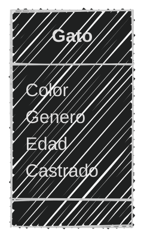

---

Crearemos primero sólo la clase Gato sin atributos e instanciamos un gato

```python
class Gato:
    pass
michi = Gato()
print(michi)
print(type(michi))
```

```bash
python ejemplo03.py
```

```text
<__main__.Gato object at 0x7fe907c618b0>
<class '__main__.Gato'>
```

---

### Ejemplo 04
Crea el archivo **ejemplo04.py** en la carpeta **sesion02** 

```text
Del ejemplo 03 instanciaremos dos gatos y le añadiremos a
cada uno un color, género, edad y si está castrado o no
```

```python
class Gato:
    pass
pelusa = Gato()
pelusa.color = "negro"
pelusa.genero = "hembra"
pelusa.edad = 2
pelusa.castrado = False


miauricio = Gato()
miauricio.color = "naranja"
miauricio.genero = "macho"
miauricio.edad = 1
miauricio.castrado = True

print("Pelusa: ",pelusa)
print(pelusa.color)
print(pelusa.genero)
print(pelusa.edad)
print(pelusa.castrado)
print("Miauricio: ",miauricio)
print(miauricio.color)
print(miauricio.genero)
print(miauricio.edad)
print(miauricio.castrado)
```

---

```bash
python ejemplo04.py
```

```text
Pelusa:  <__main__.Gato object at 0x7f7d7c60c8b0>
negro
hembra
2
False
Miauricio:  <__main__.Gato object at 0x7f7d7c60c430>
naranja
macho
1
True
```

---

### Ejemplo 05

Crea el archivo **ejemplo05.py** en la carpeta **sesion02** 

---

```text
Del ejemplo 02 instanciar dos perros y añadir a cada uno 
un nombre, propietario, edad, género, raza y si está vacunado o no
Muestra los atributos de cada perro
```
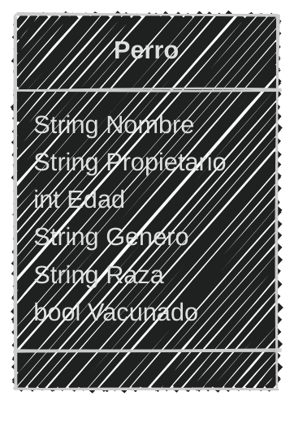
4 minutos

<iframe src="https://time-stuff.com/embed.html" frameborder="0" scrolling="no" width="391" height="140"></iframe>

---

```python
class Perro:
    pass
toby = Perro()
toby.nombre = "Toby"
toby.propietario = "Jhon"
toby.edad = 3
toby.genero = "macho"
toby.raza = "labrador"
luna = Perro()
luna.nombre = "Luna"
luna.propietario = "Jane"
luna.edad = 2
luna.genero = "hembra"
luna.raza = "pug"
print("Toby: ",toby)
print(toby.nombre)
print(toby.propietario)
print(toby.edad)
print(toby.genero)
print(toby.raza)
print("Luna: ",luna)
print(luna.nombre)
print(luna.propietario)
print(luna.edad)
print(luna.genero)
print(luna.raza)
```

---

```bash
python ejemplo05.py
```

```text
Toby:  <__main__.Perro object at 0x7f7d7c60c8b0>
Toby
Juan
3
macho
labrador
Luna:  <__main__.Perro object at 0x7f7d7c60c430>
Luna
Jane
2
hembra
pug
```


---

Añadir atributos de esta forma no es recomendable 

Añade complejidad al código y no es escalable

---

¿Existe una forma más sencilla de añadir atributos?

---

Sí, mediante el uso de un constructor

---
#### Constructor

Un constructor es un método especial que permite inicializar los atributos de una clase

Hace que la creación de instancias sea más sencilla y escalable

---

El constructor se ejecuta en el momento de crear una instancia

Inicializa los atributos de la clase y asigna los valores

En python se define el método con el nombre especial `__init__`

---

```python
class Nombre:
    def __init__(self, atrib1, atrib2):
        self.atributo1 = atrib1
        self.atributo2 = atrib2
```
Donde:
- `def` es la palabra reservada para definir un método
- `__init__` es el nombre del método constructor
- `self` es una referencia a la instancia de la clase
- `atrib1` y `atrib2` son los parámetros del constructor que se asigna a la instancia
- `self.atributo1` y `self.atributo2` son los atributos de la instancia

---

#### `self`

- `self` es una convención en python
- `self` no es una palabra reservada
- `self` puede ser reemplazada por cualquier otro nombre
- `self` es el primer parámetro de todos los métodos de la clase

---

Después de definir el constructor al momento de crear una instancia

se le pasan los valores de los atributos

```python
class Nombre:
    def __init__(self, atrib1):
        self.atributo1 = atrib1
a = Nombre("valor1")
b = Nombre("valor2")
print(a.atributo1)
print(b.atributo1)
```

```bash
python ejemplo06.py
```

```text
valor1
valor2
```

---

#### Ejemplo 06

Crea el archivo **ejemplo06.py** en la carpeta **sesion02** 

```text
Del ejemplo 04 ahora crearemos la clase Gato con un constructor e 
instanciaremos dos gatos 
```

---

```python[1-6|7-8|9-13|14-18]
class Gato:
    def __init__(self, color, genero, edad, castrado):
        self.color = color
        self.genero = genero
        self.edad = edad
        self.castrado = castrado
michi = Gato("Negro", "hembra", 2, False)
miauricio = Gato("Naranja", "macho", 1, True)
print("Michi: ",michi)
print(michi.color)
print(michi.genero)
print(michi.edad)
print(michi.castrado)
print("Miauricio: ",miauricio)
print(miauricio.color)
print(miauricio.genero)
print(miauricio.edad)
print(miauricio.castrado)
```

---

```bash
python ejemplo06.py
```

```text
Michi:  <__main__.Gato object at 0x7faeb4380f10>
Negro
hembra
2
False
Miauricio:  <__main__.Gato object at 0x7faeb4380f70>
Naranja
macho
1
True
```

---
#### Ejemplo 07

Crea el archivo **ejemplo07.py** en la carpeta **sesion02** 

```text
Del ejemplo 05 ahora crearemos la clase Perro con un constructor
e instanciaremos dos perros 
```

3 minutos

<iframe src="https://time-stuff.com/embed.html" frameborder="0" scrolling="no" width="391" height="140"></iframe>

---

```python[1-7|8-9|10-15|16-21]
class Perro:
    def __init__(self, nombre, propietario, edad, genero, raza):
        self.nombre = nombre
        self.propietario = propietario
        self.edad = edad
        self.genero = genero
        self.raza = raza
toby = Perro("Toby", "Jhon", 3, "macho", "labrador")
luna = Perro("Luna", "Jane", 2, "hembra", "pug")
print("Toby: ",toby)
print(toby.nombre)
print(toby.propietario)
print(toby.edad)
print(toby.genero)
print(toby.raza)
print("Luna: ",luna)
print(luna.nombre)
print(luna.propietario)
print(luna.edad)
print(luna.genero)
print(luna.raza)
```

---

```bash
python ejemplo07.py
```

```text
Toby:  <__main__.Perro object at 0x7efdd7bb4f10>
Toby
Juan
3
macho
labrador
Luna:  <__main__.Perro object at 0x7efdd7bb4a90>
Luna
Jane
2
hembra
pug
```

---

#### Atributos de clase

Son atributos que pertenecen a la clase y no a las instancias

- Se definen dentro de la clase pero fuera de los métodos
- Se accede a ellos mediante el nombre de la clase
- Se comparten entre todas las instancias de la clase

---
Sirven para definir constantes o valores que no cambian

```python	
class Nombre:
    atributo_clase = "valor"
    def __init__(self, atrib):
        self.atributo_instancia = atrib
```

Donde:

- `atributo_clase` es el nombre del atributo de clase
- `valor` es el valor del atributo de clase
- `atributo_instancia` es el nombre del atributo de instancia
- `atrib` es el valor del atributo de instancia

---

Las instancias pueden acceder a los atributos de clase

```python[1-4|5-6|7-9]
class Nombre:
    atributo_clase = "clase"
    def __init__(self, atributo_instancia):
        self.atributo_instancia = atributo_instancia
a = Nombre("objeto1")
b = Nombre("objeto2")
print(a.atributo_clase, a.atributo_instancia)
print(b.atributo_clase, b.atributo_instancia)
print(Nombre.atributo_clase)
```

```text
clase objeto1
clase objeto2
clase
```

---

Diferencia entre atributos de clase e instancia

- Atributos de clase:
    - Se definen dentro de la clase pero fuera de los métodos
    - Se accede a ellos mediante el nombre de la clase
    - Se comparten entre todas las instancias
- Atributos de instancia:
    - Se definen dentro de los métodos de la clase
    - Se accede a ellos mediante el nombre de la instancia
    - Son únicos para cada instancia de la clase

---

#### Ejemplo 08

Crea el archivo **ejemplo08.py** en la carpeta **sesion02** 

```text
Del ejemplo 06 ahora crearemos la clase Gato 
con un atributo de clase e instanciaremos dos gatos 
```

```python[1-8|2-3|4-8|10-11|12-16|17-21|22]
class Gato:
    especie = "felino"
    tipo = "mamífero"
    def __init__(self, color, genero, edad, castrado):
        self.color = color
        self.genero = genero
        self.edad = edad
        self.castrado = castrado

michi = Gato("Negro", "hembra", 2, False)
miauricio = Gato("Naranja", "macho", 1, True)
print("Michi: ",michi.tipo, michi.especie)
print(michi.color)
print(michi.genero)
print(michi.edad)
print(michi.castrado)
print("Miauricio: ",miauricio.tipo, miauricio.especie)
print(miauricio.color)
print(miauricio.genero)
print(miauricio.edad)
print(miauricio.castrado)
print("Gato es: ", Gato.tipo, "Especie: ", Gato.especie)
```

---

```bash
python ejemplo08.py
```

```text
Michi:  mamífero felino
Negro
hembra
2
False
Miauricio:  mamífero felino
Naranja
macho
1
True
Gato es: mamífero Especie: felino
```

---

#### Ejemplo 09
Crea el archivo **ejemplo09.py** en la carpeta **sesion02** 

```text
Del ejemplo 07 ahora crearemos la clase Perro con
tres atributos de clase e instanciaremos dos perros 
```

3 minutos

<iframe src="https://time-stuff.com/embed.html" frameborder="0" scrolling="no" width="391" height="140"></iframe>

---

```python
class Perro:
    especie = "canino"
    tipo = "mamífero"
    habitat = "terrestre"
    def __init__(self, nombre, propietario, edad, genero, raza):
        self.nombre = nombre
        self.propietario = propietario
        self.edad = edad
        self.genero = genero
        self.raza = raza
toby = Perro("Toby", "Jhon", 3, "macho", "labrador")
luna = Perro("Luna", "Jane", 2, "hembra", "pug")
print("Toby: ",toby.tipo, toby.especie, toby.habitat)
print(toby.nombre)
print(toby.propietario)
print(toby.edad)
print(toby.genero)
print(toby.raza)
print("Luna: ",luna.tipo, luna.especie, luna.habitat)
print(luna.nombre)
print(luna.propietario)
print(luna.edad)
print(luna.genero)
print(luna.raza)
print("Perro es: ", Perro.tipo, "Especie: ", Perro.especie, "Habitat: ", Perro.habitat)
```

---

```bash
python ejemplo09.py
```

```text
Toby:  mamífero canino terrestre
Toby
Juan
3
macho
labrador
Luna:  mamífero canino terrestre
Luna
Jane
2
hembra
pug
Perro es:  mamífero Especie:  canino Habitat:  terrestre
```

---
#### Modificar los atributos

Podemos modificar los atributos de una instancia
utilizando su nombre seguido de un punto  y el nombre del atributo

```python
miobjeto.atributo = nuevo_valor
```
Donde:
- `miobjeto` es el nombre de la instancia
- `atributo` es el nombre del atributo a modificar
- `nuevo_valor` es el nuevo valor del atributo

---
Podemos modificar los atributos de una clase
utilizando el nombre de la clase seguido de un punto y el nombre del atributo

```python
NombreClase.atributo = nuevo_valor
```

Donde:
- `NombreClase` es el nombre de la clase
- `atributo` es el nombre del atributo a modificar
- `nuevo_valor` es el nuevo valor del atributo

---

Recuerda que los atributos de clase son compartidos entre todas las instancias

Si modificas el atributo de clase, todas las instancias verán el nuevo valor

Si modificas el atributo de instancia, sólo esa instancia verá el nuevo valor

---
#### Ejemplo 10

Crea el archivo **ejemplo10.md** y el archivo **ejemplo10.py** 

en la carpeta **sesion02** 

```text
Un refugio de mascotas quiere registrar a las mascotas que tienen
pueden ser perros o gatos, quieren registrar el nombre
de la mascota y su especie, el origen de todos son abandonados y 
después de un tiempo son rescatados
```

---

```markdown
# Análisis
Requisitos:
- Registrar animales
- Registrar los atributos de cada animal
- Actualizar su origen despues de registrarlos

Objetos:
- Mascota

Características:
- Mascota
    - Origen
    - Nombre
    - Especie

Acciones:
- (No hay acciones)
```

---

Diseño

````markdown
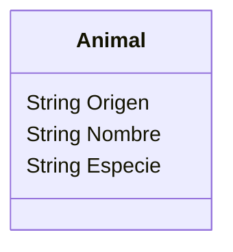
````
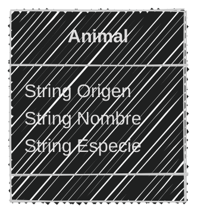

---

Programación

```python [1-5|7-11|13-17|18-20]
class Animal:
    origen = "abandonado"
    def __init__(self, nombre, especie):
        self.nombre = nombre
        self.especie = especie

print ("Animales encontrados...")
perro = Animal("Perro 001", "perro")
gato = Animal("Gato 002", "gato")
print("Mascota 1: ",perro.origen, perro.nombre, perro.especie)
print("Mascota 2: ",gato.origen, gato.nombre, gato.especie)

print("Rescatando animales...")
Animal.origen = "rescatado"
perro.nombre = "Milaneso"
gato.nombre = "Kitty"

print("Animales rescatados...")
print("Mascota 1: ",perro.origen, perro.nombre, perro.especie)
print("Mascota 2: ",gato.origen, gato.nombre, gato.especie)
```

---

```bash
python ejemplo10.py
```

```text
Animales encontrados...
Mascota 1:  abandonado Perro 001 perro
Mascota 2:  abandonado Gato 002 gato
Rescatando animales...
Animales rescatados...
Mascota 1:  rescatado Milaneso perro
Mascota 2:  rescatado Kitty gato
```

---
#### Ejemplo 11

Crea el archivo **ejemplo11.md** y el archivo **ejemplo11.py**

en la carpeta **sesion02** 

```text
Un acuario quiere registrar a los peces que tienen
pueden ser de agua dulce o salada, quieren registrar la
especie y el peso, el origen de todos son criados en cautiverio
Antes de liberarlos se actualiza su peso y luego son liberados
```

4 minutos (Análisis, diseño y programación)

<iframe src="https://time-stuff.com/embed.html" frameborder="0" scrolling="no" width="391" height="140"></iframe>

---

```markdown
# Análisis
Requisitos:
- Registrar peces
- Registrar los atributos de cada pez
- Actualizar su peso antes de liberarlos
- Liberar los peces
Objetos:
- Pez
Características:
- Pez
    - Origen
    - Especie
    - Peso

Acciones:
- (No hay acciones)
```

---
Diseño

````markdown
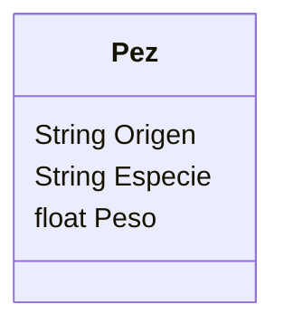
````

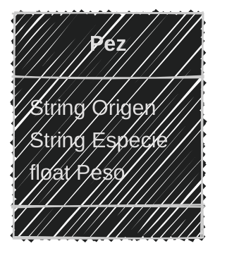

---
Programación

```python
class Pez:
    origen = "criado en cautiverio"
    def __init__(self, especie, peso):
        self.especie = especie
        self.peso = peso

print ("Peces encontrados...🐠")
pez1 = Pez("Pez payaso", 0.5)
pez2 = Pez("Pez betta", 0.3)
print("Pez 1: ",pez1.origen, pez1.especie, pez1.peso)
print("Pez 2: ",pez2.origen, pez2.especie, pez2.peso)

print("Liberando peces...")
pez1.peso = 0.6
pez2.peso = 0.4
Pez.origen = "liberado"

print("Peces liberados...🐟")
print("Pez 1: ",pez1.origen, pez1.especie, pez1.peso)
print("Pez 2: ",pez2.origen, pez2.especie, pez2.peso)
```
---

```bash
python ejemplo11.py
```

```text
Peces encontrados...🐠
Pez 1:  criado en cautiverio Pez payaso 0.5
Pez 2:  criado en cautiverio Pez betta 0.3
Liberando peces...
Peces liberados...🐟
Pez 1:  liberado Pez payaso 0.6
Pez 2:  liberado Pez betta 0.4
```

---

#### Retos

Crear una carpeta con el nombre "retos_sesion_02" dentro del proyecto en la raíz, en la cual por cada ejercicio debes crear los siguientes archivos:

```bash
# Estructura de carpetas
psg-oop-2025/
    sesion02/
    retos_sesion_01/
        ejercicio_01.md
        ejercicio_01.py
        ejercicio_02.md
        ejercicio_02.py
```

---

1. Crear un archivo llamado `ejercicio_01.md` y un archivo `ejercicio_01.py` en la carpeta retos_sesion_02 y hacer:
    
    - análisis y diseño
    - programación

    Para lo siguiente:

    ```text
    Un zoológico quiere registrar a los animales que tienen
    pueden ser mamíferos, reptiles o aves,
    quieren registrar su especie y el lugar donde los encontraron
    El origen de todos son salvajes y después de un tiempo son
    rescatados
    El zoológico cuenta con 2 mamíferos, 1 reptil y 1 ave
    ```


---
2. Crear un archivo llamado `ejercicio_02.md` y un archivo `ejercicio_02.py` en la carpeta retos_sesion_02 y hacer:
    
    - análisis y diseño
    - programación

    Para lo siguiente:

    ```text
    Una vinoteca quiere registrar a los vinos y quesos que tienen
    de los vinos importa el nombre, el tipo, la cepa y el año
    de los quesos quieren el nombre, la variedad,
    la edad y si lleva sal.
    Tiene en su inventario 4 vinos y 3 quesos 
    ```
    
---
<!-- .slide: data-background-image="../../content/psg-bg-dark.png" data-background-size="100%"-->

<br>
<br>
<br>
<br>
<br>

[ <!-- .element width="20%"-->](https://github.com/python-la-paz/python-study-group-oop/tree/main/content/sesion02)

Repositorio de la Sesión

---
<!--.slide: data-visibility="hidden"-->
## Bibliografía y Referencias

- [UML Class Diagram Tutorial](https://www.visual-paradigm.com/guide/uml-unified-modeling-language/uml-class-diagram-tutorial/)
- [Data Type](https://www.uml-diagrams.org/data-type.html)
- [Edraw](https://www.edrawsoft.com/es/diagram-tips/class-diagram.html)
- [Miro](https://miro.com/es/diagrama/que-es-diagrama-clases-uml/#atributos)
- [Python OOP](https://ellibrodepython.com/programacion-orientada-a-objetos-python)
- [Python 3 Object-oriented Programming, Second Edition, Dusty PhillipsDusty Phillips](https://github.com/PacktPublishing/Python-3-Object-Oriented-Programming-Second-Edition)
- [Programación procedural VS orientada a objetos](https://programacionpro.com/programacion-procedural-vs-orientada-a-objetos-diferencias-y-similitudes/)
- [Python OOP](https://www.learnpython.org/en/Classes_and_Objects)
- [Atributos de clase](https://oregoom.com/python/atributos-clase/)
- [Diagrama de clases](https://diagramasuml.com/diagrama-de-clases/)
- [Guía PEP 8](https://peps.python.org/pep-0008/#class-names)
- [Mermaid Charts](https://www.mermaidchart.com/play)
- [Draw.io](https://app.diagrams.net/)
- [Objetos en programación](https://ebac.mx/blog/objeto-en-programacion)