<!-- .slide: data-background-image="../../content/psg-bg-dark.png" data-background-size="100%"-->
 <!-- .element  hidden="true" -->

<br>
<br>
<br>

### Sesión  02
#### Objetos y Atributos
#### Manejo de instancias

---

#### VS Code

Abrimos el proyecto del Study Group

```bash
code psg-oop-2025
```

Creamos una carpeta llamada `sesion02` dentro del proyecto

```bash
mkdir sesion02
```

Aquí guardaremos los ejemplos de la sesión


---

#### Atributos de una clase

- Son las características o propiedades
- Obtenemos los atributos del análisis
- Los atributos son las variables que se definen dentro de una clase

---

#### Atributos de una clase

```mermaid
%%{init: {"theme": "dark", "look": "handDrawn" }}%%
mindmap
  root((🍎))
    Color
    Sabor
    Tamaño
    Variedad
    Semillas
```
<!--.element class="center-mermaid"-->

---

Al representar los atributos tratamos que sea lo más general posible

con una sintaxis neutral y no específica de un lenguaje

- int ➡️ Entero
- bool ➡️ Booleano
- float ➡️ Número real
- String ➡️ Cadena de texto

---

#### Atributos de una clase

```mermaid
%%{init: {"theme": "dark", "look": "handDrawn" }}%%
mindmap
  root((🍎))
    Color: String
    Sabor: String
    Tamaño: float
    Variedad: String
    Semillas: bool
```
<!--.element class="center-mermaid"-->

---

#### Diagrama de clases

Los atributos se representan con su *tipo* de dato al lado del *nombre*

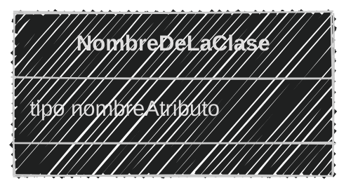
<!--.element class="center-mermaid"-->

---

#### Ejemplo 01

Crea el archivo **ejemplo01.md** en la carpeta **sesion02** 

```markdown
Un coleccionista se dedica a recolectar gatos, las características
que más le gustan son el color, género, edad y si están
castrados o no, va registrando cada gato que encuentra
```


```mermaid
%%{init: {"theme": "dark", "look": "handDrawn" }}%%
flowchart TD
    C{"😺"} -- 🟠 --> D["Color"]
    C -- ♂️ --> F["Género"]
    C -- ⌛️ --> G["Edad"]
    C -- ✂️ --> H["Castrado"]
```
<!--.element class="center-mermaid"-->

---

Obteniendo el análisis

```markdown
# Análisis

Requisitos:
- Recolectar gatos
- Registrar los atributos de cada gato

Objetos:
- Gato

Características:
- Gato
    - Color
    - Género
    - Edad
    - Castrado

Acciones:
- (No hay acciones)
```

---

Obteniendo el diseño de diagrama de clase

````markdown

````

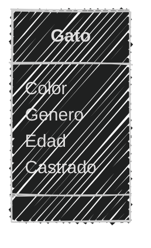

---

Atributos de la clase

```markdown[1,7|2,8|3,9|4,10|5,11]
Los atributos son definidos como:
- Edad: Es un número entero
- Color: Es una cadena de texto
- Género: Es una cadena de texto
- Castrado: Es un sí o un no

Representado con tipos de datos
- Edad: int
- Color: String
- Género: String
- Castrado: bool
```

---

Actualizando el diagrama de clases

````markdown

````

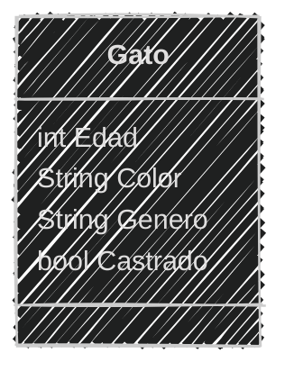

---

#### Ejercicio para ti (02)

Crea el archivo **ejemplo02.md** en la carpeta **sesion02** 

```text
Una veterinaria va registrar a los perros que llegan a consulta
registran el nombre de la mascota y del propietario,
la edad, género, raza y si está vacunado o no 
```

Obtener el *Análisis de la clase*

3 minutos 

<iframe src="https://time-stuff.com/embed.html" frameborder="0" scrolling="no" width="391" height="140"></iframe>

---

#### Análisis

```markdown
# Análisis
Requisitos:
- Registrar perros
- Registrar los atributos de cada perro
Objetos:
- Perro
Características:
- Perro
    - Nombre
    - Propietario
    - Edad
    - Género
    - Raza
    - Vacunado
Acciones:
- (No hay acciones)
```

---

#### Ejercicio para ti (02)

Ahora obtenemos el diseño del *diagrama de clase*

3 minutos

<iframe src="https://time-stuff.com/embed.html" frameborder="0" scrolling="no" width="391" height="140"></iframe>

---

#### Diseño

````markdown

````

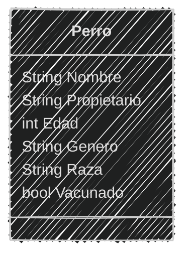

---

Ya tenemos el *análisis y diseño* de la clase

Ahora podemos pasar a la etapa de **programación**

Con `Python`

Dándole vida a las clases

---

#### Programación

En python podemos representar una clase con la palabra reservada `class`

```python
class Gato:
    pass
```

Donde:
- `class` es la palabra reservada
- `Gato` es el nombre de la clase
- `:` es el separador
- `pass` es la palabra reservada para indicar que no hay código en la clase

---

De las clases podemos crear *instancias*

Las *instancias* son **objetos** creados a partir de una **clase**

---
#### Instancia

Una instancia es un objeto creado a partir de una clase

```python
class Gato:
    pass

michi = Gato()
mau = Gato()
```

Donde:
- Se instancia utilizando el nombre de la clase seguido de paréntesis
- `michi` y `mau` son instancias de la clase `Gato`
- `michi` y `mau` son diferentes, aunque sean de la misma clase

---
#### Atributos de instancia

Podemos añadir atributos a una instancia de clase

```python
class Gato:
    pass
michi = Gato()
michi.color = "naranja"
print(michi.color)
```

Donde:
- `michi` es una instancia de la clase `Gato`
- `color` es el nombre del atributo a añadir
- `"naranja"` es el valor del atributo
- `michi.color` es la forma de asignar y acceder al atributo color del objeto `michi`


---

#### Ejemplo 03

Crea el archivo **ejemplo01.py** en la carpeta **sesion02** 

```markdown
Utilizando el análisis y diseño del ejemplo 01

# Análisis

Requisitos:
- Recolectar gatos
- Registrar los atributos de cada gato

Objetos:
- Gato

Características:
- Gato
    - Color
    - Género
    - Edad
    - Castrado

Acciones:
- (No hay acciones)
```

---

El diseño del diagrama de clases

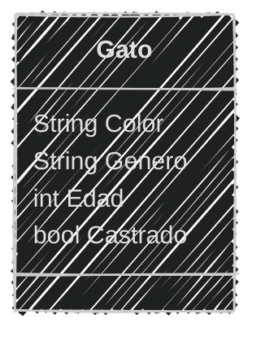
<!--.element class="center-mermaid"-->

---

Crearemos primero sólo la clase Gato sin atributos e instanciamos un gato

```python
class Gato:
    pass
pelusa = Gato()
print(pelusa)
print(type(pelusa))
```

```bash
python ejemplo01.py
```

```text
<__main__.Gato object at 0x7fe907c618b0>
<class '__main__.Gato'>
```

---

#### Ejemplo 04

Ahora añadiremos atributos a las instancias

```markdown
Del ejemplo 03 instanciaremos dos gatos y le añadiremos a
cada uno un color, género, edad y si está castrado o no
```

```python
class Gato:
    pass
# Instanciar
pelusa = Gato()
miauricio = Gato()

# Añadir atributos
pelusa.color = "negro"
pelusa.genero = "hembra"
pelusa.edad = 2
pelusa.castrado = False

miauricio.color = "naranja"
miauricio.genero = "macho"
miauricio.edad = 1
miauricio.castrado = True

# Mostrar atributos
print("Pelusa: ",pelusa)
print(pelusa.color)
print(pelusa.genero)
print(pelusa.edad)
print(pelusa.castrado)
print("Miauricio: ",miauricio)
print(miauricio.color)
print(miauricio.genero)
print(miauricio.edad)
print(miauricio.castrado)
```

---

```bash
python ejemplo01.py
```

```text
Pelusa:  <__main__.Gato object at 0x7f7d7c60c8b0>
negro
hembra
2
False
Miauricio:  <__main__.Gato object at 0x7f7d7c60c430>
naranja
macho
1
True
```

---

Podemos añadir atributos asignando directamente a la instancia

uno por uno pero de esta forma **no es recomendable**

Añade complejidad al código y **no es escalable**

---

¿Existe una forma más eficiente de añadir atributos?

---

Sí, mediante el uso de un `constructor`

---
#### Constructor

Un constructor es un **método** especial que permite **inicializar los atributos** de una clase

Hace que la creación de instancias sea más sencilla y escalable

---

El constructor se ejecuta en el momento de crear una instancia

Inicializa los atributos de la clase y asigna los valores

En python se define el método con el nombre especial `__init__`

---

Estructura del constructor

```python [2-4]
class Gato:
    def __init__(self, color, edad):
        self.color = color
        self.edad = edad
```
Donde:
- `def` palabra reservada para definir un método
- `__init__` es el nombre del método constructor
- `self` es una referencia a la instancia de la clase
- `color` y `edad` son los parámetros del constructor que se asigna a la instancia
- `self.color` y `self.edad` son los atributos de la instancia

---

#### `self`

- `self` es una convención en python
- `self` no es una palabra reservada
- `self` puede ser reemplazada por cualquier otro nombre
- `self` es el primer parámetro de todos los métodos de instancia

---

Después de definir el constructor al momento de crear una instancia

se pasan los valores de los atributos

---

#### Ejemplo 05

Crea el archivo **ejemplo05.py** en la carpeta **sesion02** 

```text
Crearemos una clase Gato con el atributo color
Utilizando el constructor para inicializar el atributo
e instanciar dos gatos con diferente color
```

```python
class Gato:
    def __init__(self, color):
        self.color = color
pantera = Gato("negro")
snowball = Gato("blanco")
print(pantera.color)
print(snowball.color)
```

```bash
python ejemplo05.py
```

```text
negro
blanco
```

---

#### Ejemplo 06

Crea el archivo **ejemplo06.py** en la carpeta **sesion02** 

```text
Del ejemplo 04 vamos a crear ahora utilizando 
un constructor en la clase Gato e instanciaremos
los dos gatos
```

---

Clase con constructor y atributos

```python [1-6|7-9|10-15|16-20]
class Gato:
    def __init__(self, color, genero, edad, castrado):
        self.color = color
        self.genero = genero
        self.edad = edad
        self.castrado = castrado
# Instanciar
pelusa = Gato("Negro", "hembra", 2, False)
miauricio = Gato("Naranja", "macho", 1, True)
# Mostrar atributos
print("Pelusa: ",pelusa)
print(pelusa.color)
print(pelusa.genero)
print(pelusa.edad)
print(pelusa.castrado)
print("Miauricio: ",miauricio)
print(miauricio.color)
print(miauricio.genero)
print(miauricio.edad)
print(miauricio.castrado)
```

---

Ejecutar el script

```bash
python ejemplo06.py
```

```text
Pelusa:  <__main__.Gato object at 0x7faeb4380f10>
Negro
hembra
2
False
Miauricio:  <__main__.Gato object at 0x7faeb4380f70>
Naranja
macho
1
True
```

---
#### Ejercicio para ti (07)

Crea el archivo **ejemplo02.py** en la carpeta **sesion02** 

```text
Del ejemplo 02 ahora crearemos la clase Perro con un constructor
e instanciaremos dos perros 
```

```markdown
# Análisis
Requisitos:
- Registrar perros
- Registrar los atributos de cada perro
Objetos:
- Perro
Características:
- Perro
    - Nombre
    - Propietario
    - Edad
    - Género
    - Raza
    - Vacunado
Acciones:
- (No hay acciones)
```

---

Diseño

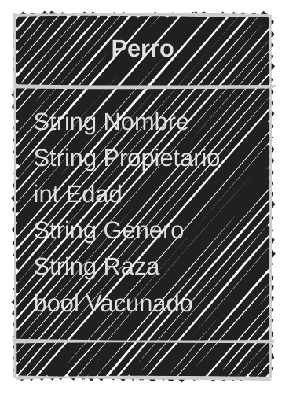
<!--.element class="center-mermaid"-->

Crea la clase con el constructor e instancia dos perros

4 minutos

<iframe src="https://time-stuff.com/embed.html" frameborder="0" scrolling="no" width="391" height="140"></iframe>

---

Clase con constructor y atributos

```python [1-7|8-10|11-17|18-23]
class Perro:
    def __init__(self, nombre, propietario, edad, genero, raza):
        self.nombre = nombre
        self.propietario = propietario
        self.edad = edad
        self.genero = genero
        self.raza = raza
# Instanciar
toby = Perro("Toby", "Jhon", 3, "macho", "labrador")
luna = Perro("Luna", "Jane", 2, "hembra", "pug")
# Mostrar atributos
print("Toby: ",toby)
print(toby.nombre)
print(toby.propietario)
print(toby.edad)
print(toby.genero)
print(toby.raza)
print("Luna: ",luna)
print(luna.nombre)
print(luna.propietario)
print(luna.edad)
print(luna.genero)
print(luna.raza)
```

---

Ejecutar el script

```bash
python ejemplo02.py
```

```text
Toby:  <__main__.Perro object at 0x7efdd7bb4f10>
Toby
Juan
3
macho
labrador
Luna:  <__main__.Perro object at 0x7efdd7bb4a90>
Luna
Jane
2
hembra
pug
```

---

#### Atributos de clase

Son atributos que pertenecen a la **clase** y NO a las instancias

- Se definen dentro de la clase pero fuera de los métodos
- Se accede a ellos mediante el nombre de la clase
- Se comparten entre todas las instancias de la clase

---
Sirven para definir constantes o valores que no cambian

```python	
class Gato:
    especie = "felino"
    def __init__(self, color):
        self.color = color
```

Donde:

- `especie` es el nombre del atributo de clase
- `felino` es el valor del atributo de clase
- `self.color` es el nombre del atributo de instancia
- `color` es el valor del atributo de instancia

---

Las instancias pueden acceder a los atributos de clase

```python [1-4|5-6|7-8|9-10]
class Gato:
    especie = "felino"
    def __init__(self, color):
        self.color = color
pantera = Gato("negro")
snowball = Gato("blanco")
print(pantera.especie, pantera.color)
print(snowball.especie, snowball.color)
# Atributo de clase
print(Gato.especie)
```

```text
felino negro
felino blanco
felino
```

---

Diferencia entre atributos de clase e instancia

| **Clase**                                                   | *Instancia*                                            |
| ----------------------------------------------------------- | ------------------------------------------------------ |
| Se definen dentro de la clase pero **fuera** de los métodos | Se definen *dentro* de los métodos de la clase         |
| Se accede a ellos mediante el nombre de la **clase**        | Se accede a ellos mediante el nombre de la *instancia* |
| Se **comparten** entre todas las instancias                 | Son *únicos* para cada instancia de la clase           |

---

#### Ejemplo 08 

Crea el archivo **ejemplo08.py** en la carpeta **sesion02** 

```text
Del ejemplo 06 ahora crearemos la clase Gato 
con un atributo de clase que será la especie
ya que todos los gatos son felinos
al final instanciaremos dos gatos
```

```markdown
# Análisis

Requisitos:
- Recolectar gatos
- Registrar los atributos de cada gato
- Todos los gatos son felinos

Objetos:
- Gato

Características:
- Gato
    - Especie
    - Color
    - Género
    - Edad
    - Castrado

Acciones:
- (No hay acciones)
```

---

El diseño del diagrama de clases

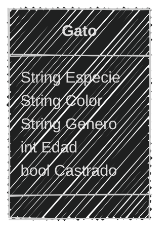
<!--.element class="center-mermaid"-->

---

Clase con atributo de clase y atributos de instancia

```python [1-7|2|3-7|9-10|11-15|16-20|21]
class Gato:
    especie = "felino"
    def __init__(self, color, genero, edad, castrado):
        self.color = color
        self.genero = genero
        self.edad = edad
        self.castrado = castrado

michi = Gato("Negro", "hembra", 2, False)
miauricio = Gato("Naranja", "macho", 1, True)
print("Michi: ", michi.especie)
print(michi.color)
print(michi.genero)
print(michi.edad)
print(michi.castrado)
print("Miauricio: ", miauricio.especie)
print(miauricio.color)
print(miauricio.genero)
print(miauricio.edad)
print(miauricio.castrado)
print("Gato es: ", Gato.especie)
```

---

Ejecutar el script

```bash
python ejemplo08.py
```

```text
Michi: felino
Negro
hembra
2
False
Miauricio: felino
Naranja
macho
1
True
Gato es: felino
```

---

#### Ejercicio para ti (09)
Crea el archivo **ejemplo09.py** en la carpeta **sesion02** 

```text
Del ejemplo 07 ahora crearemos la clase Perro con
tres atributos de clase e instanciaremos dos perros
todos los perros son caninos, mamíferos y terrestres
```

```markdown
# Análisis
Requisitos:
- Registrar perros
- Registrar los atributos de cada perro
Objetos:
- Perro
Características:
- Perro
    - Especie
    - Tipo
    - Habitat
    - Nombre
    - Propietario
    - Edad
    - Género
    - Raza
    - Vacunado
Acciones:
- (No hay acciones)
```

---

El diseño del diagrama de clases

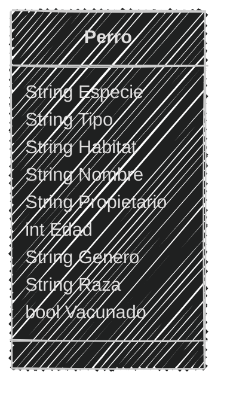
<!--.element class="center-mermaid"-->

3 minutos

<iframe src="https://time-stuff.com/embed.html" frameborder="0" scrolling="no" width="391" height="140"></iframe>

---

```python
class Perro:
    especie = "canino"
    tipo = "mamífero"
    habitat = "terrestre"
    def __init__(self, nombre, propietario, edad, genero, raza):
        self.nombre = nombre
        self.propietario = propietario
        self.edad = edad
        self.genero = genero
        self.raza = raza
toby = Perro("Toby", "Jhon", 3, "macho", "labrador")
luna = Perro("Luna", "Jane", 2, "hembra", "pug")
print("Toby: ",toby.tipo, toby.especie, toby.habitat)
print(toby.nombre)
print(toby.propietario)
print(toby.edad)
print(toby.genero)
print(toby.raza)
print("Luna: ",luna.tipo, luna.especie, luna.habitat)
print(luna.nombre)
print(luna.propietario)
print(luna.edad)
print(luna.genero)
print(luna.raza)
print("Perro es: ", Perro.tipo, "Especie: ", Perro.especie, "Habitat: ", Perro.habitat)
```

---

```bash
python ejemplo09.py
```

```text
Toby:  mamífero canino terrestre
Toby
Juan
3
macho
labrador
Luna:  mamífero canino terrestre
Luna
Jane
2
hembra
pug
Perro es:  mamífero Especie:  canino Habitat:  terrestre
```

---

#### Modificar los atributos

Podemos modificar los atributos de una instancia
utilizando su nombre seguido de un punto  y el nombre del atributo

```python
miobjeto.atributo = nuevo_valor
```
Donde:
- `miobjeto` es el nombre de la instancia
- `atributo` es el nombre del atributo a modificar
- `nuevo_valor` es el nuevo valor del atributo

---
Podemos modificar los atributos de una clase
utilizando el nombre de la clase seguido de un punto y el nombre del atributo

```python
NombreClase.atributo = nuevo_valor
```

Donde:
- `NombreClase` es el nombre de la clase
- `atributo` es el nombre del atributo a modificar
- `nuevo_valor` es el nuevo valor del atributo

---

Recuerda que los atributos de clase son compartidos entre todas las instancias

Si modificas el atributo de clase, todas las instancias verán el nuevo valor

Si modificas el atributo de instancia, sólo esa instancia verá el nuevo valor

---
#### Ejemplo 10

Crea el archivo **ejemplo10.md** y el archivo **ejemplo10.py** 

en la carpeta **sesion02** 

```text
Un refugio de mascotas quiere registrar a las mascotas que tienen
pueden ser perros o gatos, quieren registrar el nombre
de la mascota y su especie, el origen de todos son abandonados y 
después de un tiempo son rescatados
```

---

#### Análisis

```markdown
# Análisis
Requisitos:
- Registrar animales
- Registrar los atributos de cada animal
- Actualizar su origen después de registrarlos

Objetos:
- Mascota

Características:
- Mascota
    - Origen
    - Nombre
    - Especie

Acciones:
- (No hay acciones)
```

---

#### Diseño

````markdown

````
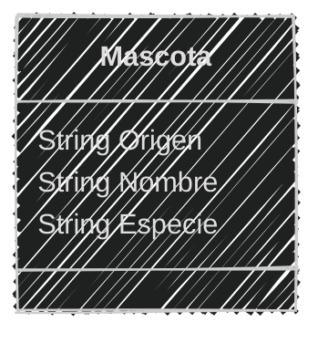

---

Programación

```python [1-5|7-11|13-17|18-20]
class Mascota:
    origen = "abandonado"
    def __init__(self, nombre, especie):
        self.nombre = nombre
        self.especie = especie

print ("Mascotas encontradas...")
perro = Mascota("Perro 001", "perro")
gato = Mascota("Gato 002", "gato")
print("Mascota 1: ",perro.origen, perro.nombre, perro.especie)
print("Mascota 2: ",gato.origen, gato.nombre, gato.especie)

print("Rescatando mascotas...")
Mascota.origen = "rescatado"
perro.nombre = "Milaneso"
gato.nombre = "Kitty"

print("Mascotas rescatadas...")
print("Mascota 1: ",perro.origen, perro.nombre, perro.especie)
print("Mascota 2: ",gato.origen, gato.nombre, gato.especie)
```

---

```bash
python ejemplo10.py
```

```text
Mascotas encontradas...
Mascota 1:  abandonado Perro 001 perro
Mascota 2:  abandonado Gato 002 gato
Rescatando mascotas...
Mascotas rescatadas...
Mascota 1:  rescatado Milaneso perro
Mascota 2:  rescatado Kitty gato
```

---
#### Ejercicio para ti (11)

Crea el archivo **ejemplo11.md** y el archivo **ejemplo11.py** 
en la carpeta **sesion02** 

```text
Un acuario quiere registrar a los peces que tienen
pueden ser de agua dulce o salada, quieren registrar la
especie y el peso, el origen de todos son criados en cautiverio
Antes de liberarlos se actualiza su peso y luego son liberados
```

Obtener el *Análisis de la clase*

3 minutos

<iframe src="https://time-stuff.com/embed.html" frameborder="0" scrolling="no" width="391" height="140"></iframe>

---

Analisis

```markdown
# Análisis
Requisitos:
- Registrar peces
- Registrar los atributos de cada pez
- Actualizar su peso antes de liberarlos
- Liberar los peces
Objetos:
- Pez
Características:
- Pez
    - Origen
    - Especie
    - Peso
    - Agua

Acciones:
- (No hay acciones)
```

---

#### Ejercicio para ti (11)

Ahora obtenemos el diseño del *diagrama de clase*

3 minutos

<iframe src="https://time-stuff.com/embed.html" frameborder="0" scrolling="no" width="391" height="140"></iframe>

---

Diseño

````markdown

````

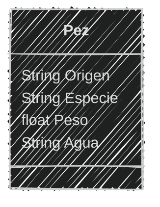

---


Ya tenemos el *análisis y diseño* de la clase

Ahora podemos **programar**

4 minutos

<iframe src="https://time-stuff.com/embed.html" frameborder="0" scrolling="no" width="391" height="140"></iframe>

---

```python
class Pez:
    origen = "criado en cautiverio"
    def __init__(self, especie, peso, agua):
        self.especie = especie
        self.peso = peso
        self.agua = agua

print ("Peces encontrados...🐠")
pez1 = Pez("Pez payaso", 0.5, "agua dulce")
pez2 = Pez("Pez betta", 0.3, "agua dulce")
print("Pez 1: ",pez1.origen, pez1.especie, pez1.peso, pez1.agua)
print("Pez 2: ",pez2.origen, pez2.especie, pez2.peso, pez2.agua)

print("Liberando peces...")
pez1.peso = 0.6
pez2.peso = 0.4
Pez.origen = "liberado"

print("Peces liberados...🐟")
print("Pez 1: ",pez1.origen, pez1.especie, pez1.peso, pez1.agua)
print("Pez 2: ",pez2.origen, pez2.especie, pez2.peso, pez2.agua)
```
---

```bash
python ejemplo11.py
```

```text
Peces encontrados...🐠
Pez 1:  criado en cautiverio Pez payaso 0.5 agua dulce
Pez 2:  criado en cautiverio Pez betta 0.3 agua dulce
Liberando peces...
Peces liberados...🐟
Pez 1:  liberado Pez payaso 0.6 agua dulce
Pez 2:  liberado Pez betta 0.4 agua dulce
```

---

#### Resumen

- Los atributos de una clase representan las características o propiedades de los objetos y se definen dentro de la clase.
- Es importante analizar y definir los atributos de manera general y con una sintaxis neutral, usando tipos de datos como entero, booleano, número real y cadena de texto.

---

- En los diagramas de clases los atributos se representan con su tipo de dato al lado del nombre.
- Las instancias son objetos creados a partir de una clase y que cada instancia puede tener sus propios atributos.
- Se pueden añadir atributos a las instancias directamente, pero no es recomendable porque no es escalable.

---

- El constructor es un método especial que permite inicializar los atributos de una clase al momento de crear una instancia, y en Python se define con el método __init__.
- El parámetro self es una convención en Python y se utiliza para referirse a la instancia actual dentro de los métodos de la clase.

---

- Los atributos de clase pertenecen a la clase y no a las instancias, se definen fuera de los métodos y se comparten entre todas las instancias.
- Diferencia entre atributos de clase y atributos de instancia: los de clase son compartidos y los de instancia son únicos para cada objeto.

---

- Se pueden modificar los atributos de instancia y de clase, y que al modificar un atributo de clase, el cambio afecta a todas las instancias.
- Es importante organizar el análisis y diseño de clases antes de programar, identificando requisitos, objetos, características y acciones.

---

#### Retos

Crear una carpeta con el nombre "retos_sesion_02" dentro del proyecto en la raíz, en la cual por cada ejercicio debes crear los siguientes archivos:

```bash
# Estructura de carpetas
psg-oop-2025/
    sesion02/
    retos_sesion_01/
        ejercicio_01.md
        ejercicio_01.py
        ejercicio_02.md
        ejercicio_02.py
```

---

1. Crear un archivo llamado `ejercicio_01.md` y un archivo `ejercicio_01.py` en la carpeta `retos_sesion_02`
    
 
```text
Un zoológico quiere registrar a los animales que tienen
pueden ser mamíferos, reptiles o aves,
quieren registrar su especie y el lugar donde los encontraron
El origen de todos los animales son salvajes
El zoológico cuenta con 2 mamíferos, 1 reptil y 1 ave

- Realiza el análisis y diseño
- Programa la clase y crea las instancias
```

---
2. Crear un archivo llamado `ejercicio_02.md` y un archivo `ejercicio_02.py` en la carpeta `retos_sesion_02` y hacer:

```text
Una vinoteca quiere registrar los vinos y quesos que tienen
de los vinos importa el nombre, el tipo, la cepa y el año
de los quesos quieren el nombre, la variedad,
la edad y si lleva sal.
Tiene en su inventario 4 vinos y 3 quesos 

- Realiza el análisis y diseño
- Programa las clases y crea las instancias
```
    
---
<!-- .slide: data-background-image="../../content/psg-bg-dark.png" data-background-size="100%"-->

<br>
<br>
<br>
<br>
<br>

[ <!-- .element width="20%"-->](https://github.com/python-la-paz/python-study-group-oop/tree/main/content/sesion02)

Repositorio de la Sesión

---
<!--.slide: data-visibility="hidden"-->
## Bibliografía y Referencias

- [UML Class Diagram Tutorial](https://www.visual-paradigm.com/guide/uml-unified-modeling-language/uml-class-diagram-tutorial/)
- [Data Type](https://www.uml-diagrams.org/data-type.html)
- [Edraw](https://www.edrawsoft.com/es/diagram-tips/class-diagram.html)
- [Miro](https://miro.com/es/diagrama/que-es-diagrama-clases-uml/#atributos)
- [Python OOP](https://ellibrodepython.com/programacion-orientada-a-objetos-python)
- [Python 3 Object-oriented Programming, Second Edition, Dusty PhillipsDusty Phillips](https://github.com/PacktPublishing/Python-3-Object-Oriented-Programming-Second-Edition)
- [Programación procedural VS orientada a objetos](https://programacionpro.com/programacion-procedural-vs-orientada-a-objetos-diferencias-y-similitudes/)
- [Python OOP](https://www.learnpython.org/en/Classes_and_Objects)
- [Atributos de clase](https://oregoom.com/python/atributos-clase/)
- [Diagrama de clases](https://diagramasuml.com/diagrama-de-clases/)
- [Guía PEP 8](https://peps.python.org/pep-0008/#class-names)
- [Mermaid Charts](https://www.mermaidchart.com/play)
- [Draw.io](https://app.diagrams.net/)
- [Objetos en programación](https://ebac.mx/blog/objeto-en-programacion)