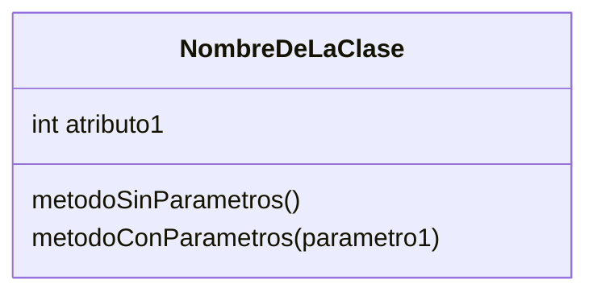
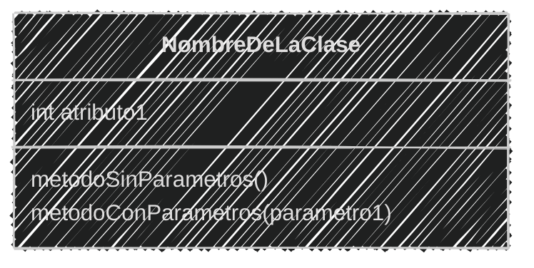
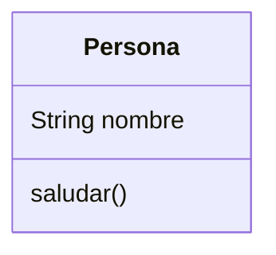
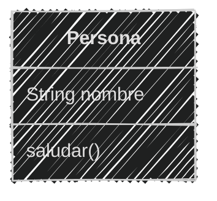
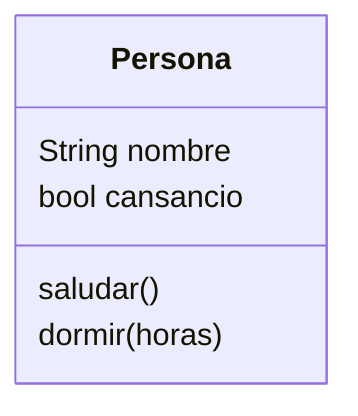
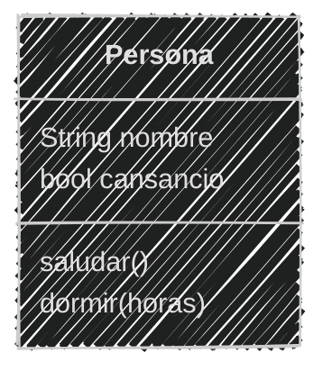
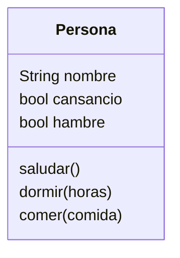
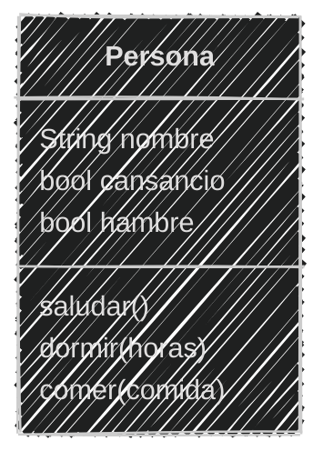
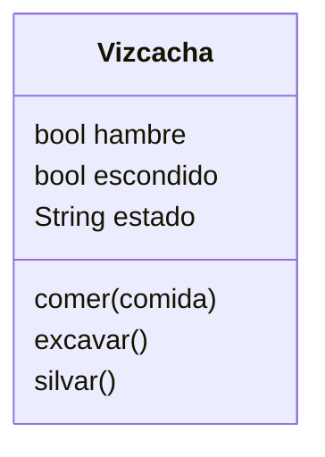
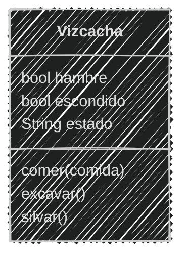

<!-- .slide: data-background-image="../../content/psg-bg-dark.png" data-background-size="100%"-->
 <!-- .element  hidden="true" -->

<br>
<br>
<br>

### Sesión  03
#### Métodos y comportamiento
#### Que los objetos hagan cosas

---

#### VS Code

Abrimos el proyecto del Study Group

```bash
code psg-oop-2025
```

Creamos una carpeta llamada `sesion03` dentro del proyecto

```bash
mkdir sesion03
cd sesion03
```

Aquí guardaremos los ejemplos de la sesión

---

#### Comportamiento

- Es la forma en la que un objeto actúa o realiza una acción.

Un perro ladrando

# 🐶💬

Un auto acelerando

# 🚗💨

---

- El comportamiento en programación se refiere a las acciones que un objeto puede realizar
- Se define a través de métodos

---
#### Métodos

- Un método es una función creada dentro de una clase
- Los métodos permiten a los objetos ejecutar acciones
- Los métodos pueden recibir parámetros y devolver valores

---
#### Diagrama de clases

- En un diagrama de clases, los métodos se representan dentro de la clase.
- Los métodos se escriben en la sección inferior de la clase.
- Se definen con el nombre del método seguido de paréntesis.

---
#### Ejemplo de un diagrama de clases

````markdown [5|6]

````



---
Existen tres tipos de métodos

**Métodos de instancia**: Son los más comunes.

Se utilizan para acceder, modificar o utilizar los atributos de una instancia.

---

Existen tres tipos de métodos

**Métodos de clase**: Se utilizan para acceder, modificar, o utilizar los atributos de la clase

Y **NO** de una instancia específica

---

Existen tres tipos de métodos

**Métodos estáticos**: No requieren acceso a la instancia o a la clase. 

Se utilizan para realizar acciones que no dependen de la clase o de la instancia

---

#### Métodos de instancia

Son utilizados por las instancias de una clase

Se definen con el primer parámetro como `self`

y se accede a los atributos de la instancia a través de `self`

---

- Pueden no tener parámetros
- Pueden tener 1 o más parámetros
- Pueden no devolver nada
- Pueden devolver 1 o más valores

---

#### Ejemplo 01

Crea los archivos **ejemplo01.md** y **ejemplo01.py** en la carpeta **sesion03** 

```text
Estas creando un juego similar a Sims donde las personas
pueden interactuar, tienen un nombre
pueden saludar y decir su nombre
```

---

Análisis y diseño en el archivo **ejemplo01.md**

```markdown
# Análisis

Requisitos:
- Registrar personas
- Las personas tienen un nombre
- Las personas pueden saludar

Objetos:
- Persona

Características:
- Persona: Nombre

Acciones:
- Persona: Saludar
```

---
Creando el diseño de diagrama de clases

````markdown

````



---
Programación en el archivo **ejemplo01.py**

```python [1-7|8-11]
# Definiendo la clase
class Persona:
    def __init__(self, nombre): # Constructor
        self.nombre = nombre

    def saludar(self): # Método de instancia
        print(f"Hola, soy {self.nombre}")
# Instanciando un objeto
jhon = Persona("Jhon")
# Llamando al método de la instancia
jhon.saludar()
```

```bash
python ejemplo01.py
```

```text
Hola, soy Jhon
```
---

Agregando un nuevo método con parámetros

```text
Ahora las personas pueden dormir
```

```markdown
# Análisis

Requisitos:
- Registrar personas
- Las personas tienen un nombre
- Las personas pueden saludar
- Las personas pueden dormir

Objetos:
- Persona

Características:
- Persona: Nombre, cansancio

Acciones:
- Persona: Saludar, dormir

```
---

Creando el diseño de diagrama de clases

````markdown

````



---

```python  [1-13|5|10-13|19]
# Definiendo la clase
class Persona:
    def __init__(self, nombre): # Constructor
        self.nombre = nombre
        self.cansancio = True # Nuevo

    def saludar(self): # Método de instancia
        print(f"Hola, soy {self.nombre}")

    def dormir(self, horas): # Nuevo Método de instancia
        print(f"{self.nombre} duerme por {horas} hrs.")
        self.cansancio = False # Nuevo
        print(f"{self.nombre} se ha despertado")

# Instanciando un objeto
jhon = Persona("Jhon")
jhon.saludar()
# Llamando al método de la instancia
jhon.dormir(8)
```

```bash
python ejemplo01.py
```

```text
Hola, soy Jhon
Jhon duerme por 8 hrs.
Jhon se ha despertado
```

---

Agregando un nuevo método con parámetros que devuelve un valor

```text
Ahora las personas pueden comer y saciar su hambre
```

```markdown
# Análisis
Requisitos:
- Registrar personas
- Las personas tienen un nombre
- Las personas pueden saludar
- Las personas pueden dormir
- Las personas pueden comer

Objetos:
- Persona

Características:
- Persona: Nombre, cansancio, hambre

Acciones:
- Persona: Saludar, dormir, comer
```

---

Creando el diseño de diagrama de clases

````markdown

````



---

```python [1-23|6|16-23|30-33]
# Definiendo la clase
class Persona:
    def __init__(self, nombre): # Constructor
        self.nombre = nombre
        self.cansancio = True
        self.hambre = True # Nuevo

    def saludar(self): # Método de instancia
        print(f"Hola, soy {self.nombre}")

    def dormir(self, horas): # Método de instancia
        print(f"{self.nombre} duerme por {horas} hrs.")
        self.cansancio = False
        print(f"{self.nombre} se ha despertado")

    def comer(self, comida): # Nuevo Método de instancia
        if self.hambre:
            print(f"{self.nombre} está comiendo {comida}")
            self.hambre = False
            return "🍽️"
        else:
            print(f"{self.nombre} no tiene hambre")
            return comida
            
# Instanciando un objeto
jhon = Persona("Jhon")
jhon.saludar()
jhon.dormir(8)
# Llamando al método de la instancia
comida = jhon.comer("🍕")
print(f"Devolvió: {comida}")
comida = jhon.comer("🍔")
print(f"Devolvió: {comida}")
```

```bash
python ejemplo01.py
```

```text
Hola, soy Jhon
Jhon duerme por 8 hrs.
Jhon se ha despertado
Jhon está comiendo 🍕
Devolvió: 🍽️
Jhon no tiene hambre
Devolvió: 🍔
```

---
#### Ejemplo 02

Crea los archivos **ejemplo02.md** y **ejemplo02.py** en la carpeta **sesion03** 

```markdown
Creas un juego de rol donde eres una vizcacha

Puedes comer sólo zanahorias

Puedes excavar agujeros para esconderte cuando tienes miedo

Silvas `iiih iiih` cuando estás feliz
```

5 minutos (Análisis, diagrama y programación)

<iframe src="https://time-stuff.com/embed.html" frameborder="0" scrolling="no" width="391" height="140"></iframe>

---

```markdown
# Análisis
Requisitos:
- Crear una vizcacha
- Puede comer zanahorias
- Puede excavar agujeros cuando esta asustada
- Puede silvar haciendo `iiih iiih` cuando feliz

Objetos:
- Vizcacha

Características:
- Vizcacha: hambre, escondido, estado

Acciones:
- Vizcacha: Comer, excavar, silvar
```

---
Creando el diseño de diagrama de clases

````markdown

````


---

```python [1-24|26-32]
# Definiendo la clase
class Vizcacha:
    def __init__(self): # Constructor
        self.hambre = True
        self.escondido = False
        self.estado = "feliz"

    def comer(self, comida): # Método de instancia
        if comida == "🥕":
            print(f"Vizcacha está comiendo {comida}")
            self.hambre = False
        else:
            print(f"Vizcacha no come {comida}")

    def excavar(self): # Método de instancia
        print("Vizcacha está excavando un agujero")
        self.escondido = True
        self.estado = "asustada"
        print(f"Vizcacha esta {self.estado}")

    def silvar(self): # Método de instancia
        print("iiih iiih")
        self.estado = "feliz"
        print(f"Vizcacha esta {self.estado}")

# Instanciando un objeto
vizcacha = Vizcacha()
vizcacha.comer("🥕")
vizcacha.comer("🍔")
vizcacha.excavar()
vizcacha.silvar()
```

```bash
python ejemplo02.py
```

```text
Vizcacha está comiendo 🥕
Vizcacha no come 🍔
Vizcacha está excavando un agujero
Vizcacha esta asustada
iiih iiih
Vizcacha esta feliz
```

---

#### Resumen

- El mundo real está compuesto por objetos.
- Los objetos tienen estado, comportamiento e identidad.
- La abstracción es el proceso de identificar las características y comportamientos relevantes de un objeto.
- El contexto define qué es importante y qué no.
- El análisis orientado a objetos identifica los objetos y sus interacciones.
- El diseño orientado a objetos convierte el análisis en un diseño formal.
- Las clases son plantillas para crear objetos.
- Los diagramas de clases son la representación gráfica de las clases y sus relaciones.
- La programación orientada a objetos implementa el diseño en un lenguaje de programación.
- ANÁLISIS ➡ DISEÑO ➡ PROGRAMACIÓN

---

#### Retos

Utilizaremos el repositorio de GitHub creado en esta sesión "psg-oop-2025" 

para almacenar los retos, de todas las sesiones.

Iremos agregando los retos a medida que avancemos

Como si estuviéramos trabajando en un proyecto real

---

Crear una carpeta con el nombre "retos_sesion_01" dentro del proyecto en la raíz, en la cual por cada ejercicio debes crear los siguientes archivos:

```bash
# Estructura de carpetas
psg-oop-2025/
    sesion01/
        ejemplo01.txt
        ejemplo02.txt
        ejemplo03.txt
        ejemplo04.txt
        ejemplo05.txt
        ejemplo06.txt
        ejemplo07.md
        ejemplo08.md
    retos_sesion_01/
        ejercicio_01.md
        ejercicio_02.md
        ejercicio_03.md
```

---

1. Crear un archivo llamado `ejercicio_01.md` en la carpeta retos_sesion_01 y hacer:

    - análisis y diseño

    Para lo siguiente:

    ```text
    Un restaurante quiere ofrecer hamburguesas
    Los clientes pueden elegir entre hamburguesa de res, pollo
    o vegetariana.
    Agregar lechuga, tomate, cebolla y mayonesa como extras
    Y comer en el restaurante o para llevar
    ```


---
2. Crear un archivo llamado `ejercicio_02.md` en la carpeta retos_sesion_01 y hacer:
    
    - análisis y diseño

    Para lo siguiente:

    ```text
    Una tienda de ropa quiere ofrecer camisetas y pantalones
    Los clientes pueden elegir entre camiseta
    de manga corta o larga y pantalón de mezclilla o tela
    Las camisetas pueden ser de color rojo, azul o verde
    y los pantalones de color negro, gris o blanco
    Las camisetas pueden ser tener talas: S, M, L, XL
    Los pantalones tienen desde la talla 32 hasta la talla 44
    ```

---
3. Crear un archivo llamado `ejercicio_03.md` en la carpeta retos_sesion_01 y hacer:
    
    - análisis y diseño

    Para lo siguiente

    ```text
        Estas diseñando una app para dibujar de perros con IA 
        los usuarios pueden seleccionar características como la
        raza del perro como labrador, pastor alemán, y otros
        Cambiar el color del pelaje, tamaño y tipo de orejas  
        Agregar dos accesorios como sombreros o gafas
        El dibujo final puede ser descargado en PNG o JPG
    ```

    
---
<!-- .slide: data-background-image="../../content/psg-bg-dark.png" data-background-size="100%"-->

<br>
<br>
<br>
<br>
<br>

[ <!-- .element width="20%"-->](https://github.com/python-la-paz/python-study-group-oop/content/sesion01)

Repositorio de la Sesión

---
<!--.slide: data-visibility="hidden"-->
## Bibliografía y Referencias

- [Object Oriented Analysis](https://www.gyata.ai/es/object-oriented-programming/object-oriented-analysis)
- [DDOO Unidad 1](https://dmd.unadmexico.mx/contenidos/DCEIT/BLOQUE1/DS/02/DDOO/U1/descargables/DDOO_Unidad_1.pdf)
- [Programación procedural VS orientada a objetos](https://programacionpro.com/programacion-procedural-vs-orientada-a-objetos-diferencias-y-similitudes/)
- [Python OOP](https://www.learnpython.org/en/Classes_and_Objects)
- [Atributos de clase](https://oregoom.com/python/atributos-clase/)
- [Diagrama de clases](https://diagramasuml.com/diagrama-de-clases/)
- [Guía PEP 8](https://peps.python.org/pep-0008/#class-names)
- [Mermaid Charts](https://www.mermaidchart.com/play)
- [Draw.io](https://app.diagrams.net/)
- [Python 3 Object-oriented Programming, Second Edition, Dusty PhillipsDusty Phillips](https://github.com/PacktPublishing/Python-3-Object-Oriented-Programming-Second-Edition)
- [Objetos en programación](https://ebac.mx/blog/objeto-en-programacion)
- [Enfoque orientado a objetos](https://1library.co/article/enfoque-orientado-a-objetos-base-te%C3%B3rica.qvld461y)
- [OOAD](https://www.tutorialspoint.com/object_oriented_analysis_design/ooad_object_oriented_analysis.htm)
https://pywombat.com/articles/tipos-metodos-python
https://lathack.com/metodos-de-instancia-en-python/
https://www.luisllamas.es/tipos-de-metodos-en-python/