<!-- .slide: data-background-image="../../content/psg-bg-dark.png" data-background-size="100%"-->
 <!-- .element  hidden="true" -->

<br>
<br>
<br>

### Sesión  03
#### Métodos y comportamiento
#### Que los objetos hagan cosas

---

#### VS Code

Abrimos el proyecto del Study Group

```bash
code psg-oop-2025
```

Creamos una carpeta llamada `sesion03` dentro del proyecto

```bash
mkdir sesion03
cd sesion03
```

Aquí guardaremos los ejemplos de la sesión

---

#### Comportamiento

Es la forma en la que un objeto actúa o realiza una acción.

Un perro ladrando

# 🐶💬

Un auto acelerando

# 🚗💨

---

El *comportamiento* en programación se refiere a las acciones que un *objeto puede realizar*

Se define a través de **métodos**

---
#### Métodos

Es una *función* creada dentro de una clase

Permiten a los objetos *ejecutar acciones*

Pueden *recibir parámetros* y *devolver valores*

---

También pueden ser representados visualmente 

en un diagrama de clases

---

#### Diagrama de clases


En un diagrama de clases, los métodos se representan *dentro de la clase*

Los métodos se escriben en la *sección inferior* de la clase

Se definen con el nombre del método 

*seguido de paréntesis*

---

#### Ejemplo de un diagrama de clases

````markdown [5|6]
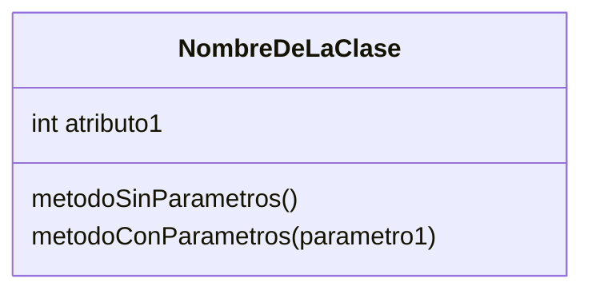
````

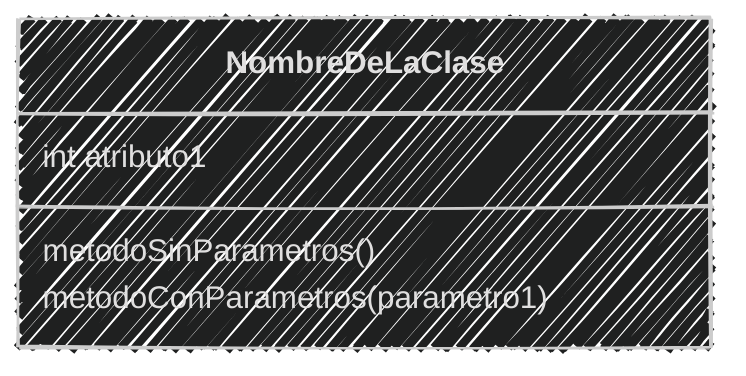
<!--.element class="center-mermaid"-->

---

#### Existen tres tipos de métodos

**Métodos de instancia**: Son los más comunes

Se utilizan para acceder, modificar o utilizar los atributos de una *instancia*

---

#### Existen tres tipos de métodos

**Métodos de clase**: Se utilizan para acceder, modificar, o utilizar los atributos de la *clase*

Y **NO** de una instancia específica

---

#### Existen tres tipos de métodos

**Métodos estáticos**: No requieren acceso a la instancia o a la clase. 

Se utilizan para realizar acciones que *no dependen* de la *clase* o de la *instancia*

---

Los métodos

- Pueden *no* tener parámetros de entrada
- Pueden tener parámetros de entrada *1 o más*
- Pueden *no* devolver valores de salida
- Pueden devolver valores de salida *1 o más*

---

Veamos cada tipo de método empezando por

**métodos de instancia**

---

#### Métodos de instancia

- Son utilizados por las instancias de una clase
- Se definen con el primer parámetro como `self`
- Se accede a los atributos de la instancia a través de `self`

---

- Pueden acceder a los atributos de la *instancia*
- Pueden acceder a los atributos de la *clase*
- Ejecutamos la función llamando a la instancia seguida del nombre de la función

`instancia.metodo()`

---

#### Ejemplo 01


```markdown
Crearemos un juego similar a Sims llamado `PyLife`
Las personas creadas tienen un nombre y
pueden saludar diciendo su nombre
```

Crea los archivos **pylife.md** y **pylife.py** en la carpeta **sesion03** 

---

Análisis y diseño en el archivo **pylife.md**

```markdown
# Análisis

Requisitos:
- Crear personas
- Las personas tienen un nombre
- Las personas pueden saludar
- Tiene un constructor que crea personas con nombre
Objetos:
- Persona
Características:
- Persona: Nombre
Acciones:
- Persona: Saludar
```

---

Creando el diseño de diagrama de clases

````markdown
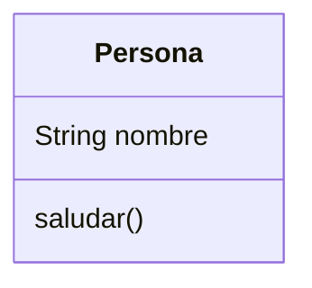
````

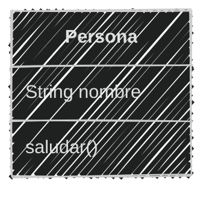

---
Creando el script **pylife.py**

```python [1-7|8-11]
# Definiendo la clase
class Persona:
    def __init__(self, nombre): # Constructor
        self.nombre = nombre

    def saludar(self): # Método de instancia
        print(f"Hola, soy {self.nombre}")
# Instanciando un objeto
jhon = Persona("Jhon")
# Llamando al método de la instancia
jhon.saludar()
```

```bash
python pylife.py
```

```text
Hola, soy Jhon
```
---

Vamos a agregar un nuevo método con parámetros

```text
Ahora las personas pueden dormir una cantidad de horas
```

```markdown
# Análisis

Requisitos:
- Crear personas
- Las personas tienen un nombre
- Las personas pueden saludar
- Las personas pueden dormir

Objetos:
- Persona

Características:
- Persona: Nombre, cansancio

Acciones:
- Persona: Saludar, dormir

```
---

Creando el diagrama de clases

````markdown
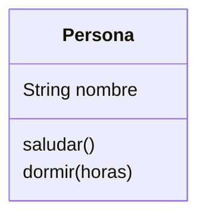
````

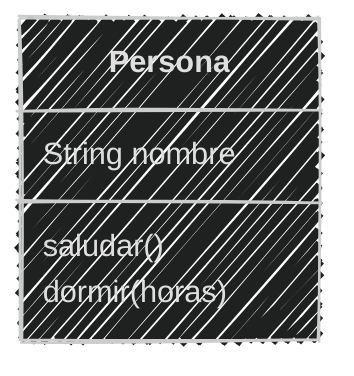

---

```python  [1-11|9-11|19]
# Definiendo la clase
class Persona:
    def __init__(self, nombre): # Constructor
        self.nombre = nombre

    def saludar(self): # Método de instancia
        print(f"Hola, soy {self.nombre}")

    def dormir(self, horas): # Nuevo Método de instancia
        print(f"{self.nombre} duerme por {horas} hrs.")
        print(f"{self.nombre} se ha despertado")

# Instanciando un objeto
jhon = Persona("Jhon")
jhon.saludar()
# Llamando al método de la instancia
jhon.dormir(8)
```

```bash
python pylife.py
```

```text
Hola, soy Jhon
Jhon duerme por 8 hrs.
Jhon se ha despertado
```

---

Agregamos un método que devuelve un valor

```text
En el juego ahora las personas pueden
tener hambre y comer para saciarla
Cuando duerme la persona despierta con hambre
```

```markdown
# Análisis
Requisitos:
- Crear personas
- Las personas tienen un nombre
- Las personas pueden saludar
- Las personas pueden dormir
- Las personas pueden comer
- Al despertar tienen hambre

Objetos:
- Persona

Características:
- Persona: Nombre, hambre

Acciones:
- Persona: Saludar, dormir, comer
```

---

Creando el diseño de diagrama de clases

````markdown
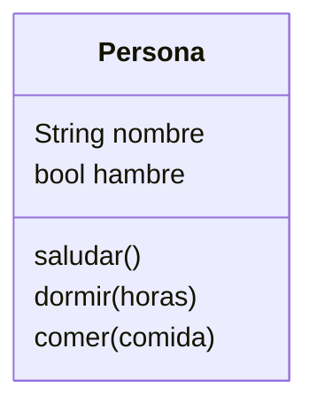
````

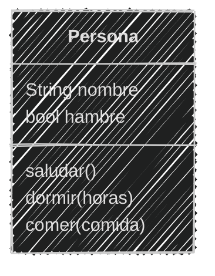

---

```python [1-22|5|15-22|29-32]
# Definiendo la clase
class Persona:
    def __init__(self, nombre): # Constructor
        self.nombre = nombre
        self.hambre = True # Nuevo

    def saludar(self): # Método de instancia
        print(f"Hola, soy {self.nombre}")

    def dormir(self, horas): # Método de instancia
        print(f"{self.nombre} duerme por {horas} hrs.")
        print(f"{self.nombre} se ha despertado")
        self.hambre = True # Al despertar tiene hambre

    def comer(self, comida): # Nuevo Método de instancia
        if self.hambre:
            print(f"{self.nombre} está comiendo {comida}")
            self.hambre = False
            return "🍽️"
        else:
            print(f"{self.nombre} no tiene hambre")
            return comida
            
# Instanciando un objeto
jhon = Persona("Jhon")
jhon.saludar()
jhon.dormir(8)
# Llamando al método de la instancia
comida = jhon.comer("🍕")
print(f"Devolvió: {comida}")
comida = jhon.comer("🍔")
print(f"Devolvió: {comida}")
```

```bash
Hola, soy Jhon
Jhon duerme por 8 hrs.
Jhon se ha despertado
Jhon está comiendo 🍕
Devolvió: 🍽️
Jhon no tiene hambre
Devolvió: 🍔
```

---
#### Ejercicio para ti (02)

Crea los archivos **vizcacha.md** y **vizcacha.py** en la carpeta **sesion03** 

```markdown
Creas un juego de rol donde eres una vizcacha
Puedes comer sólo zanahorias
Puedes excavar agujeros para esconderte cuando te asustas
Silvar `iiih iiih` te hace feliz
```

Obtener el *Análisis*

3 minutos 

<iframe src="https://time-stuff.com/embed.html" frameborder="0" scrolling="no" width="391" height="140"></iframe>

---

Creando el *análisis*
```markdown
# Análisis
Requisitos:
- Crear una vizcacha
- Come sólo zanahorias
- Cuando excava un agujero se asusta
- Cuando excava un agujero se esconde
- Silvar `iiih iiih` le hace feliz

Objetos:
- Vizcacha

Características:
- Vizcacha: hambre, escondido, estado

Acciones:
- Vizcacha: Comer, excavar, silvar
```

---

#### Ejercicio para ti (02)

Ahora obtenemos el diseño del *diagrama de clase*

3 minutos

<iframe src="https://time-stuff.com/embed.html" frameborder="0" scrolling="no" width="391" height="140"></iframe>

---
Creando el diseño de diagrama de clases

````markdown
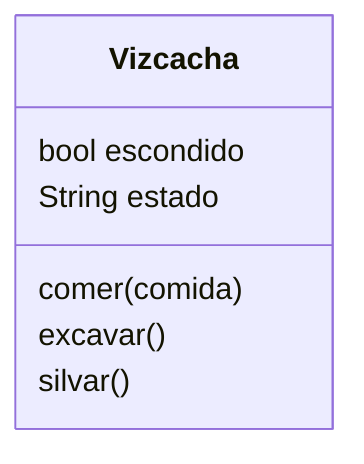
````

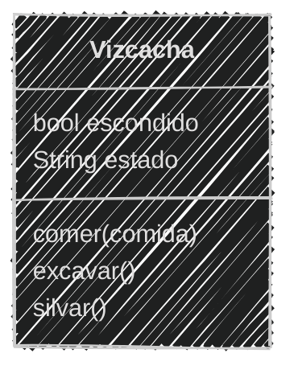

---

Ya tenemos el *análisis y diseño* de la clase

Ahora podemos **programar**

3 minutos

<iframe src="https://time-stuff.com/embed.html" frameborder="0" scrolling="no" width="391" height="140"></iframe>

---

```python [1-22|24-30]
# Definiendo la clase
class Vizcacha:
    def __init__(self): # Constructor
        self.escondido = False
        self.estado = "feliz"

    def comer(self, comida): # Método de instancia
        if comida == "🥕":
            print(f"Vizcacha está comiendo {comida}")
        else:
            print(f"Vizcacha no come {comida}")

    def excavar(self): # Método de instancia
        print("Vizcacha está excavando un agujero")
        self.escondido = True
        self.estado = "asustada"
        print(f"Vizcacha esta {self.estado}")

    def silvar(self): # Método de instancia
        print("iiih iiih")
        self.estado = "feliz"
        print(f"Vizcacha esta {self.estado}")

# Instanciando un objeto
vizcacha = Vizcacha()
vizcacha.comer("🥕")
vizcacha.comer("🍔")
vizcacha.excavar()
vizcacha.silvar()
```

```text
Vizcacha está comiendo 🥕
Vizcacha no come 🍔
Vizcacha está excavando un agujero
Vizcacha esta asustada
iiih iiih
Vizcacha esta feliz
```

---

Antes de continuar con los métodos de

*clase* y *estáticos*

vamos a ver los **decoradores**

ya que son muy importantes para estos tipos de métodos

---

#### Decoradores

Los decoradores son métodos que permiten *modificar* el comportamiento de otros métodos

Se utilizan para *agregar* funcionalidades adicionales a un método *sin modificar* su código original

Se definen con el símbolo `@` seguido del nombre del método decoradora

---

**Es como envolver un regalo**

Un regalo puede ser una pelota

- La *pelota* es el método original
- El *papel de regalo* es el decorador
- El *papel de regalo* contiene una etiqueta y un moño
- Pero el regalo sigue siendo la *pelota*

---

Son muy importantes para los siguientes métodos

- Métodos de clase
- Métodos estáticos

---

#### Ejemplo 03

En un archivo llamado **pelota.py** vamos a crear un decorador

donde vamos a envolver una pelota con papel de regalo

---

Primero definimos el decorador en nuestro caso se llama `envoltura`

La envoltura tiene un `papel` que envuelve un `regalo`

La `envoltura` recibe como parámetro el `regalo` que en este caso es una función

```python
def envoltura(regalo):
    def papel():
        print("🎁🔖")
        regalo()
        print("🎁")
    return papel
```

---

Luego definimos la función `pelota` que es el `regalo`

La función `pelota` imprime un balón de fútbol

```python
def pelota():
    print("⚽")

pelota()
```

---
Finalmente aplicamos el decorador `envoltura` a la función `pelota`

Añadimos `@envoltura` encima de la función `pelota`

```python
@envoltura
def pelota():
    print("⚽")
pelota()
```

---

Queda así el código completo

```python
def envoltura(regalo):
    def papel():
        print("🎁🔖")
        regalo()
        print("🎁")
    return papel

@envoltura
def pelota():
    print("⚽")
pelota()
```

```bash
python pelota.py
```

```text
🎁🔖
⚽
🎁
```

---

Entonces los **decoradores** son muy importantes 

Porque nos permiten modificar el comportamiento de los métodos

ya no son solo métodos de instancia sino que ahora tenemos

- Métodos de clase
- Métodos estáticos

---


#### Métodos de clase

Se definen con el decorador `@classmethod`

El decorador `@classmethod` permite que el método sea llamado desde la clase en lugar de una instancia

---

El primer parámetro es `cls` (clase) y NO `self`

`cls` es una convención, puede utilizarse cualquier nombre

Se utilizan para acceder a los *atributos de la clase*

---

*NO* pueden acceder a los atributos de la *instancia*

**SI** Pueden acceder a los atributos de la **clase**

---

Sirven para crear constructores alternativos o métodos de fábrica

Se utilizan para crear métodos que acceden a atributos de clase

Ejecutamos la función llamando a la clase seguida del nombre de la función

---

#### Ejemplo 04

En los archivos **pylife.md** y **pylife.py** en la **sesion03**

```markdown
En el juego `PyLife` diseñaremos ahora perros que pueden ladrar
Todos los perros tienen un nombre y empiezan como cachorros
La diferencia entre un perro y un humano en edad es de 7 años
y los perros pueden crecer con el tiempo
```

```markdown
# Análisis
Requisitos:
- Crear un perro
- Los perros tienen un nombre
- Los perros pueden ladrar
- Los perros nacen como cachorros
- La edad de un perro es 7 veces menor que la de un humano
Objetos:
- Perro
Características:
- Perro: nombre, edad
Acciones:
- Perro: ladrar, nacer, crecer, edad_a_humano
```

---
Creando el diseño de diagrama de clases

````markdown
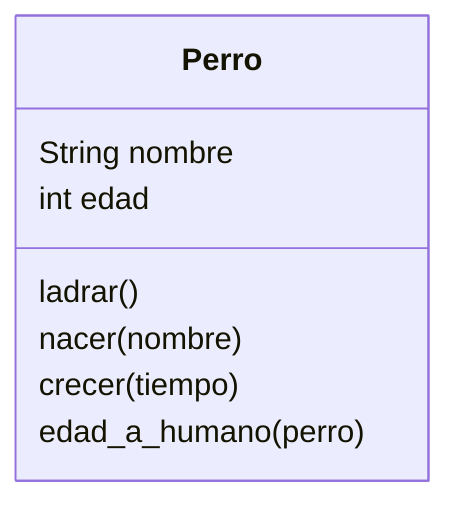
````

---

Creando el diseño de diagrama de clases

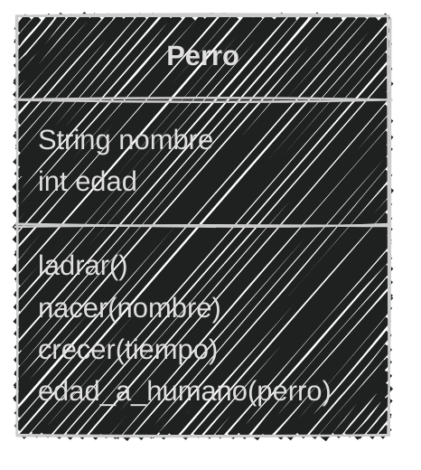
<!--.element class="center-mermaid"-->
---

Definiendo la clase en **pylife.py**

```python [1-23|3|14-23|25-29]
# Definiendo la clase
class Perro:
    factor_edad = 7 # Atributo de clase
    def __init__(self, nombre, edad): # Constructor
        self.nombre = nombre
        self.edad = edad

    def ladrar(self): # Método de instancia
        print(f"{self.nombre} dice: ¡Guau!")

    def crecer(self, tiempo): # Método de instancia
        self.edad += tiempo
        print(f"{self.nombre} ha crecido {tiempo} años")

    @classmethod # Nuevo Método de clase
    def nacer(cls, nombre):
        print(f"{nombre} ha nacido como un cachorro")
        return cls(nombre,0)

    @classmethod # Nuevo Método de clase
    def edad_a_humano(cls, perro):
        print(f"En años humanos, {perro.nombre}")
        print(f"tiene {perro.edad * cls.factor_edad} años")
    
# Instanciando un objeto
rex = Perro.nacer("Rex")
rex.ladrar()
rex.crecer(2)
Perro.edad_a_humano(rex)
```

---

Ejecutando el script

```bash
python pylife.py
```

```text
Rex ha nacido como un cachorro
Rex dice: ¡Guau!
Rex ha crecido 2 años
En años humanos, Rex tiene 14 años
```

---
#### Ejercicio para ti (03)

```markdown
En la simulación de un bosque los arboles pueden crecer
tienen una especie y pueden ser frutales o no.
Nacen desde una semilla, y crecen con el tiempo
Cuando llegan a 10 metros de altura pueden dar frutos
Todos los arboles cuando tiene más de 15 metros mueren
```

Crea el archivo **bosque.md** en la carpeta **sesion03**

3 minutos

Realiza el *Análisis*

<iframe src="https://time-stuff.com/embed.html" frameborder="0" scrolling="no" width="391" height="140"></iframe>

---

Creando el *análisis*

```markdown
# Análisis

Requisitos:
- Crear un árbol
- Los árboles tienen una especie
- Los árboles pueden ser frutales o no
- Los árboles germinan desde una semilla
- Los árboles crecen con el tiempo
- Los árboles dan frutos cuando tienen 10 metros de altura
- Los árboles mueren cuando tienen más de 15 metros

Objetos:
- Árbol

Características:
- Árbol: especie, altura, frutal, vivo

Acciones:
- Árbol: nacer, crecer, dar_frutos, morir
```

---

#### Ejercicio para ti (03)

Ahora obtenemos el diseño del *diagrama de clase*

3 minutos

<iframe src="https://time-stuff.com/embed.html" frameborder="0" scrolling="no" width="391" height="140"></iframe>

---

Creando el diseño de diagrama de clases

````markdown
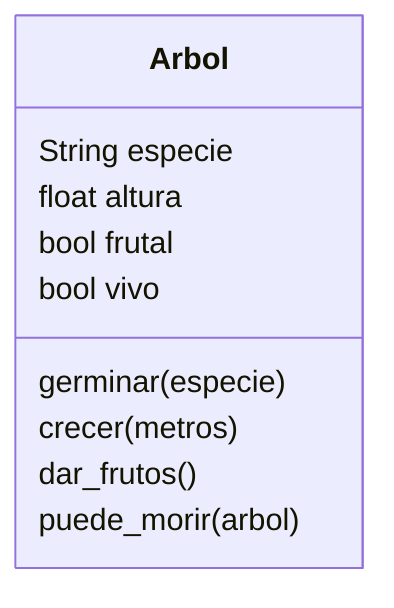
````

---
Creando el diseño de diagrama de clases

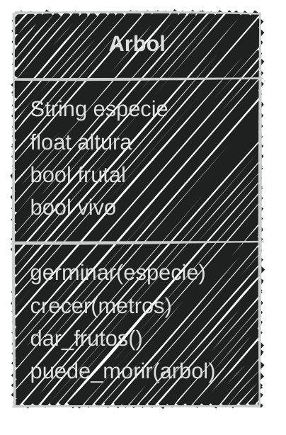
<!--.element class="center-mermaid"-->

---

#### Ejercicio para ti (03)

Ahora programamos la clase en el archivo **bosque.py**

4 minutos

<iframe src="https://time-stuff.com/embed.html" frameborder="0" scrolling="no" width="391" height="140"></iframe>

---

Creando el script **bosque.py**

```python [1-36|38-46]
# Definiendo la clase
class Arbol:
    altura_germinacion = 0.0 # Atributo de clase
    altura_min_frutos = 10.0 # Atributo de clase
    altura_maxima = 15.0 # Atributo de clase
    def __init__(self, especie, altura, frutal): # Constructor
        self.especie = especie
        self.altura = altura
        self.frutal = frutal
        self.vivo = True

    @classmethod # Nuevo Método de clase
    def germinar(cls, especie, frutal):
        print(f"El árbol {especie} ha nacido")
        return cls(especie, cls.altura_germinacion, frutal)

    @classmethod # Nuevo Método de clase
    def puede_morir(cls, arbol):
        if arbol.altura >= cls.altura_maxima:
            print(f"El árbol {arbol.especie} ha muerto")
            arbol.vivo = False
        else:
            print(f"El árbol {arbol.especie} sigue vivo")

    def crecer(self, metros): # Método de instancia
        self.altura += metros
        print(f"El árbol ha crecido {metros} metros")
        print(f"Altura actual: {self.altura} metros")

    def dar_frutos(self): # Método de instancia
        if self.frutal and self.altura >= self.altura_min_frutos:
            print(f"El árbol {self.especie} ha dado frutos")
        elif self.frutal:
            print(f"El árbol {self.especie} no ha dado frutos")
        else:
            print(f"El árbol {self.especie} no es frutal")

# Instanciando un objeto
roble = Arbol.germinar("Roble", True)
roble.crecer(5.1)
roble.dar_frutos()
roble.crecer(6.4)
roble.dar_frutos()
Arbol.puede_morir(roble)
roble.crecer(3.5)
Arbol.puede_morir(roble)
```

---

Ejecutando el script

```bash
python bosque.py
```

```text
El árbol Roble ha nacido
El árbol ha crecido 5.1 metros
Altura actual: 5.1 metros
El árbol Roble no ha dado frutos
El árbol ha crecido 6.4 metros
Altura actual: 11.5 metros
El árbol Roble ha dado frutos
El árbol Roble sigue vivo
El árbol ha crecido 3.5 metros
Altura actual: 15.0 metros
El árbol Roble ha muerto
```

---

#### Métodos estáticos

Se definen con el decorador `@staticmethod`

**No** requieren acceso a la instancia o a la clase

Se utilizan para realizar acciones que **NO** dependen de la clase o de la instancia

---

Como no están relacionados con la clase o la instancia

*NO* tienen acceso a `self` o `cls`

*NO* pueden acceder a los atributos de la *instancia*

*NO* pueden acceder a los atributos de la *clase*

---

Se pueden utilizar para crear funciones auxiliares o utilidades

Son funciones que están relacionadas con la clase pero no dependen de ella

Ejecutamos la función llamando a la clase seguida del nombre de la función

---

#### Ejemplo 06

En los archivos **pylife.md** y **pylife.py** en la **sesion03**

```markdown
En el juego `PyLife` diseñamos gatos que pueden maullar
Todos los gatos tienen un nombre y color, nacen como cachorros
los sonidos más comunes de los gatos son `miau` y `ronroneo`
```

```markdown
# Análisis
Requisitos:
- Crear un gato
- Los gatos tienen un nombre y color
- Los gatos pueden maullar
- Los gatos nacen como cachorros
- Los gatos pueden hacer `miau` y `ronroneo`
- Los gatos pueden crecer con el tiempo
Objetos:
- Gato
Características:
- Gato: nombre, color, edad
Acciones:
- Gato: nacer, crecer, maullar, sonidos
```

---
Creando el diseño de diagrama de clases

````markdown
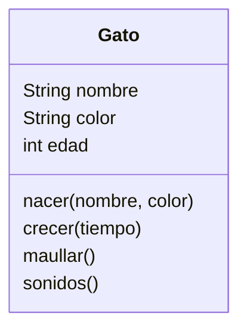
````

---
Creando el diseño de diagrama de clases
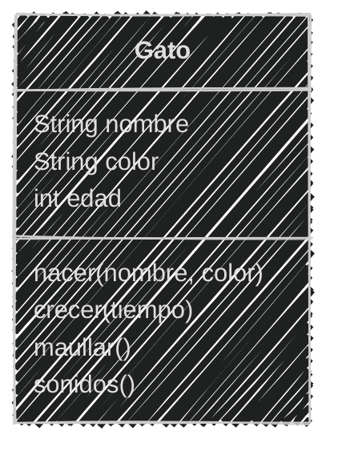
<!--.element class="center-mermaid"-->

---

Definiendo la clase en **pylife.py**

```python [1-22|8-11|13-18|20-22|24-29]
# Definiendo la clase
class Gato:
    def __init__(self, nombre, color): # Constructor
        self.nombre = nombre
        self.color = color
        self.edad = 0

    @classmethod # Método de clase
    def nacer(cls, nombre, color):
        print(f"{nombre} ha nacido como un cachorro")
        return cls(nombre, color)

    def crecer(self, tiempo): # Método de instancia
        self.edad += tiempo
        print(f"{self.nombre} ha crecido {tiempo} años")

    def maullar(self): # Método de instancia
        print(f"{self.nombre} dice: {Gato.sonidos()[0]}")

    @staticmethod # Nuevo Método estático
    def sonidos():
        return ["miau", "ronroneo"]

# Instanciando un objeto
mimi = Gato.nacer("Mimi", "blanco")
mimi.maullar()
mimi.crecer(2)
sonidos = Gato.sonidos()
print(f"Sonidos de {mimi.nombre}: {sonidos}")
```

---

Ejecutando el script

```bash
python pylife.py
```

```text
Mimi ha nacido como un cachorro
Mimi dice: miau
Mimi ha crecido 2 años
Sonidos de Mimi: ['miau', 'ronroneo']
```

---
#### Ejercicio para ti (04)

```markdown
En el diseño de pacman el personaje puede comer puntos
Los puntos tienen un valor de 1 o 2, nace con máximo 2 vidas
Cuando pacman come un punto este suma su valor al puntaje
Cuando pacman muere pierde una vida pero no pierde el puntaje
Cuando pacman se queda sin vidas el juego se da por terminado
Si el juego terminó se puede calcula si hay un nuevo record
```

Crea el archivo **pacman.md** en la carpeta **sesion03**

3 minutos

Realiza el *Análisis*

<iframe src="https://time-stuff.com/embed.html" frameborder="0" scrolling="no" width="391" height="140"></iframe>

---

Creando el *análisis*

```markdown
# Análisis
Requisitos:
- Crear un pacman
- Pacman tiene un puntaje
- Pacman tiene vidas
- Pacman inicia con máximo 2 vidas
- Pacman puede comerse los puntos
- Pacman suma el valor de los puntos
- Pacman pierde una vida cuando muere
- Pacman termina el juego cuando se queda sin vidas
- Pacman calcula si hay un nuevo record
Objetos:
- Pacman
Características:
- Pacman: `max_vidas`, `vidas`, `puntaje`
Acciones:
- Pacman:   `jugar`, `comer_punto`, `morir`,
            `juego_terminado`, `calcular_record`
```

---

#### Ejercicio para ti (04)

Ahora obtenemos el diseño del *diagrama de clase*

3 minutos

<iframe src="https://time-stuff.com/embed.html" frameborder="0" scrolling="no" width="391" height="140"></iframe>

---

Creando el diseño de diagrama de clases

````markdown
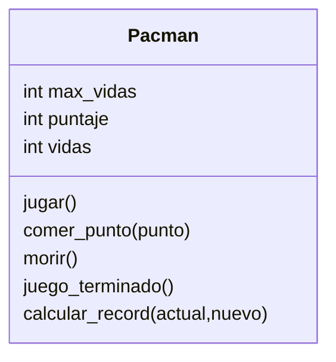
````

---

Creando el diseño de diagrama de clases

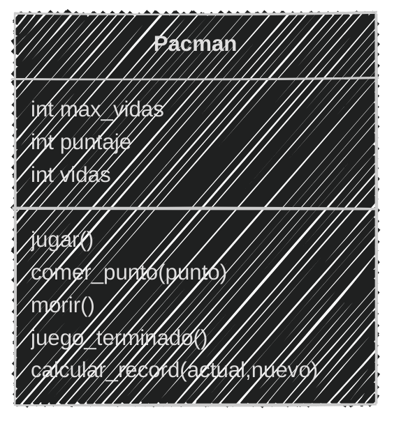

---

#### Ejercicio para ti (04)

Ahora programamos la clase en el archivo **pacman.py**

4 minutos

<iframe src="https://time-stuff.com/embed.html" frameborder="0" scrolling="no" width="391" height="140"></iframe>

---

Creando el script **pacman.py**

```python [1-40|42-53|54-62]
# Definiendo la clase
class Pacman:
    max_vidas = 2 # Atributo de clase
    def __init__(self): # Constructor
        self.puntaje = 0
        self.vidas = self.max_vidas

    @classmethod # Método de clase
    def jugar(cls):
        print("Pacman ha nacido")
        return cls()

    def comer_punto(self, punto): # Método de instancia
        self.puntaje += punto
        print(f"Pacman ha comido un punto de valor {punto}")
        print(f"Puntaje actual: {self.puntaje}")

    def morir(self): # Método de instancia
        if self.vidas > 0:
            self.vidas -= 1
            print(f"Pacman ha muerto, quedan {self.vidas} vidas")
        else:
            print("Pacman no tiene más vidas")            

    def juego_terminado(self): # Método de instancia
        if self.vidas == 0:
            print("El juego ha terminado")
            return True
        else:
            print("Pacman tiene vidas restantes")
            return False

    @staticmethod # Nuevo Método estático
    def calcular_record(actual, nuevo):
        if nuevo > actual:
            print("¡Nuevo record!")
            return nuevo
        else:
            print("No hay nuevo record")
            return actual

# Instanciando un objeto
record = 0
pacman = Pacman.jugar()
pacman.comer_punto(1)
pacman.comer_punto(2)
pacman.morir()
pacman.morir()
if pacman.juego_terminado():
    record = Pacman.calcular_record(record, pacman.puntaje)
    print(f"Record actual: {record}")
else:
    print("Pacman sigue jugando")
pacman_2 = Pacman.jugar()
pacman_2.comer_punto(1)
pacman_2.morir()
pacman_2.morir()
if pacman_2.juego_terminado():
    record = Pacman.calcular_record(record, pacman_2.puntaje)
    print(f"Record actual: {record}")
else:
    print("Pacman sigue jugando")
```

---

```bash
python pacman.py
```

```text
Pacman ha nacido
Pacman ha comido un punto de valor 1
Puntaje actual: 1
Pacman ha comido un punto de valor 2
Puntaje actual: 3
Pacman ha muerto, le quedan 1 vidas
Pacman ha muerto, le quedan 0 vidas
El juego ha terminado
¡Nuevo record!
Record actual: 3
Pacman ha nacido
Pacman ha comido un punto de valor 1
Puntaje actual: 1
Pacman ha muerto, le quedan 1 vidas
Pacman ha muerto, le quedan 0 vidas
El juego ha terminado
No hay nuevo record
Record actual: 3
```

---

#### Métodos especiales o mágicos

Son métodos que permiten definir el comportamiento de los objetos en Python

- Se definen con **dos guiones bajos** al inicio y al final del nombre
- Se utilizan para extender el comportamiento de las clases

---
Algunos de los métodos especiales son:

- `__init__`: Constructor de la clase
- `__str__`: Representación en cadena de la clase
- `__repr__`: Representación oficial de la clase
- `__del__`: Destructor de la clase

---

####  `__init__`

- Es el constructor de la clase 
- Se ejecuta automáticamente al crear una instancia de la clase
- Se utiliza para inicializar los atributos de la instancia

---

Constructor

```python
class Persona:
    def __init__(self, nombre, edad): # Constructor
        self.nombre = nombre
        self.edad = edad

jhon = Persona("Jhon", 30)
print(jhon.nombre) # Jhon
print(jhon.edad) # 30
```

---

#### `__str__`

- Se utiliza para definir la representación en cadena de la clase
- Se ejecuta automáticamente al utilizar la función `print()` en la instancia de la clase

---

- Se ejecuta al utilizar la función `str()` en la instancia de la clase
- Se utiliza para mostrar información de la instancia de la clase
- Si no se define, muestra la información por defecto de la clase

---

Representación en cadena

```python
class Persona:
    def __init__(self, nombre, edad): # Constructor
        self.nombre = nombre
        self.edad = edad

    def __str__(self): # Método especial
        return f"Nombre: {self.nombre}, Edad: {self.edad}"

jhon = Persona("Jhon", 30)
print(persona) # Nombre: Jhon, Edad: 30
jane = Persona("Jane", 25)
detalle = str(jane)
print(detalle) # Nombre: Jane, Edad: 25
```

---
#### `__repr__`

- Se utiliza para definir la representación oficial de la clase
- Se ejecuta automáticamente al utilizar la función `repr()` en la instancia de la clase
- repr() se utiliza para obtener una representación más detallada de la instancia

---

- Sirve para mostrar información de la instancia de la clase
- Cuando no se define, `__str__` se utiliza como respaldo

---

Representación oficial

```python
class Persona:
    def __init__(self, nombre, edad): # Constructor
        self.nombre = nombre
        self.edad = edad

    def __repr__(self): # Método especial
        return f"Persona({self.nombre}, {self.edad})"
jhon = Persona("Jhon", 30)
print(repr(jhon)) # Persona(Jhon, 30)
jane = Persona("Jane", 25)
print(repr(jane)) # Persona(Jane, 25)
```

---
#### `__del__`

- Se utiliza para definir el comportamiento al eliminar la instancia de la clase
- Se utiliza para liberar recursos o realizar limpieza

---

- Sirve para mostrar un mensaje al eliminar la instancia de la clase
- Se ejecuta automáticamente al eliminar la instancia de la clase
- Se ejecuta automáticamente al utilizar la función `del`

---

Destructor

```python
class Persona:
    def __init__(self, nombre, edad): # Constructor
        self.nombre = nombre
        self.edad = edad

    def __del__(self): # Método especial
        print(f"{self.nombre} ha sido eliminado")
jhon = Persona("Jhon", 30)
print(jhon.nombre) # Jhon
del jhon # Jhon ha sido eliminado
jane = Persona("Jane", 25)
print(jane.nombre) # Jane
del jane # Jane ha sido eliminado
```

---
Existen tambien otros atributos especiales:

- `__dict__`: Diccionario que contiene los atributos de la instancia

---
#### `__dict__`

- Es un atributo especial que contiene un diccionario con los atributos de la instancia
- Se utiliza para acceder a los atributos de la instancia
- Permite ver los atributos y sus valores como un diccionario

---

Atributo especial diccionario

```python
class Persona:
    def __init__(self, nombre, edad): # Constructor
        self.nombre = nombre
        self.edad = edad

jhon = Persona("Jhon", 30)
print(jhon.__dict__) # {'nombre': 'Jhon', 'edad': 30}
jane = Persona("Jane", 25)
print(jane.__dict__) # {'nombre': 'Jane', 'edad': 25}
```

---

#### Resumen

- El comportamiento es la forma en que un objeto responde a las acciones
- Los métodos son funciones que definen el comportamiento de un objeto
- Los métodos de instancia son funciones que operan sobre una instancia de la clase

---

- Los métodos de clase son funciones que operan sobre la clase en sí
- Los decoradores son funciones que permiten modificar el comportamiento de otras funciones
- Son como envolver un regalo

---
- Los métodos de instancia se definen sin decoradores
- Los métodos de instancia utilizan `self` como primer parámetro
- Los métodos de instancia son para los objetos

---
- Los métodos de clase se definen con el decorador `@classmethod`
- Los métodos de clase utilizan `cls` como primer parámetro
- Los métodos de clase son para la clase

---
- Los métodos estáticos se definen con el decorador `@staticmethod`
- Los métodos estáticos no utilizan `self` ni `cls` como primer parámetro
- Los métodos estáticos son para funciones que no dependen de la clase o la instancia

---
- Los métodos especiales son funciones que permiten definir el comportamiento de los objetos en Python
- Se definen con dos guiones bajos al inicio y al final del nombre
- Se utilizan para extender el comportamiento de las clases

---
- `__init__`, es el constructor de la clase
- `__str__`, es la representación en cadena de la clase
- `__repr__`, es la representación oficial de la clase
- `__del__`, es el destructor de la clase

---

- Existen otros atributos especiales
- `__dict__`, es un diccionario que contiene los atributos de la instancia
- Se utiliza para acceder a los atributos de la instancia

---

#### Retos

Crear una carpeta con el nombre "retos_sesion_03" dentro del proyecto en la raíz, en la cual por cada ejercicio debes crear los siguientes archivos:

```bash
# Estructura de carpetas
psg-oop-2025/
    sesion03/
    retos_sesion_03/
        ejercicio_01.md
        ejercicio_01.py
        ejercicio_02.md
        ejercicio_02.py
```

---

1. Crear un archivo llamado `ejercicio_01.md` y un archivo `ejercicio_01.py` en la carpeta `retos_sesion_03` y hacer:

    - análisis y diagrama
    - programación (Métodos de instancia, clase y estáticos)

Para lo siguiente:

```text
Un juego de rol donde eres un atleta tiene nombre energía y fuerza
Puedes entrenar para aumentar tu fuerza pero gastas energía
Puedes descansar para recuperar energía
Los únicos alimentos que puedes comer son hamburguesas
```


---
2. Crear un archivo llamado `ejercicio_02.md` y un archivo `ejercicio_02.py` en la carpeta `retos_sesion_03` y hacer:

    - análisis y diagrama
    - programación (Métodos de instancia, clase y estáticos)

Para lo siguiente:

```markdown
Un cocinero tiene una lista de ingredientes y recetas. Puede 
preparar recetas con ingredientes, cada que prepara una
receta suma un punto. Si hay más de un cocinero sus puntos se suman

Las únicas recetas que pueden preparar son:
- pan: harina, agua
- pizza: harina, agua, sal, tomate, queso
- galleta: harina, agua, sal, chocolate

```

    
---
<!-- .slide: data-background-image="../../content/psg-bg-dark.png" data-background-size="100%"-->

<br>
<br>
<br>
<br>
<br>

[ <!-- .element width="20%"-->](https://github.com/python-la-paz/python-study-group-oop/tree/main/content/sesion03)

Repositorio de la Sesión

---
<!--.slide: data-visibility="hidden"-->
## Bibliografía y Referencias

- [Tipos Métodos Python](https://pywombat.com/articles/tipos-metodos-python)
- [Métodos de instancia en Python](https://lathack.com/metodos-de-instancia-en-python/)
- [Tipos de métodos en Python](https://www.luisllamas.es/tipos-de-metodos-en-python/)
- [Decoradores en Python](https://www.programaenpython.com/avanzado/decoradores-en-python/)
- [Decoradores en Python](https://python-intermedio.readthedocs.io/es/latest/decorators.html)
- [classmethod en Python](https://www.geeksforgeeks.org/classmethod-in-python/)
- [classmethod](https://docs.python.org/3.11/library/functions.html#classmethod)
- [staticmethod](https://docs.python.org/3.11/library/functions.html#staticmethod)
- [Métodos estáticos](https://www.delftstack.com/es/howto/python/python-static-method/)
- [Object Oriented Analysis](https://www.gyata.ai/es/object-oriented-programming/object-oriented-analysis)
- [DDOO Unidad 1](https://dmd.unadmexico.mx/contenidos/DCEIT/BLOQUE1/DS/02/DDOO/U1/descargables/DDOO_Unidad_1.pdf)
- [Python OOP](https://www.learnpython.org/en/Classes_and_Objects)
- [Diagrama de clases](https://diagramasuml.com/diagrama-de-clases/)
- [Guía PEP 8](https://peps.python.org/pep-0008/#class-names)
- [Mermaid Charts](https://www.mermaidchart.com/play)
- [Draw.io](https://app.diagrams.net/)
- [Python 3 Object-oriented Programming, Second Edition, Dusty PhillipsDusty Phillips](https://github.com/PacktPublishing/Python-3-Object-Oriented-Programming-Second-Edition)
