<!-- .slide: data-background-image="../../content/psg-bg-dark.png" data-background-size="100%"-->
 <!-- .element  hidden="true" -->

<br>
<br>
<br>

### Sesión  04
#### Encapsulamiento y propiedades
#### Controlando el acceso a los datos

---

#### VS Code

Abrimos el proyecto del Study Group

```bash
code psg-oop-2025
```

Creamos una carpeta llamada `sesion04` dentro del proyecto

```bash
mkdir sesion04
cd sesion04
```

Aquí guardaremos los ejemplos de la sesión

---

#### Encapuslamiento

¿Que piensas cuando escuchas la palabra encapsulamiento?

---
#### Encapsulamiento

Significa "encerrar en una cápsula".

En programación, se refiere a la práctica de restringir el acceso directo a los datos y métodos de una clase

para proteger su integridad y ocultar su implementación interna.

---

Es uno de los principios fundamentales de la programación orientada a objetos (POO).

---

#### ¿Por qué es importante?

- **Protección de datos**: Evita que el código externo modifique directamente los atributos de una clase, lo que ayuda a mantener la integridad de los datos.

---

#### ¿Por qué es importante?

- **Abstracción**: Permite ocultar los detalles de implementación y exponer solo lo necesario a través de algunos métodos.

---

#### ¿Por qué es importante?

- **Control de acceso**: Permite definir qué partes del código pueden acceder a los datos y métodos de una clase.

---

Existen diferentes niveles o tipos de acceso:

- **Público**: Accesible desde cualquier parte del código.
- **Protegido**: Accesible solo desde la propia clase y sus subclases.
- **Privado**: Accesible solo desde la propia clase.

---

#### Niveles de acceso

| Niveles   | ¿Quién puede usarlo? 🧑‍💻 | ¿Se puede ver? 👀 | ¿Se puede cambiar? 🔧 |
| --------- | :--------------------: | :--------------: | :------------------: |
| Público   |        Todos 🌐         |        ✅         |          ✅           |
| Protegido | La clase y sus hijas 👨‍👩‍👧 |        ⚠️         |          ⚠️           |
| Privado   |    Solo la clase 👑     |        🚫         |          🚫           |

---

#### Niveles de acceso

| Niveles   | Ejemplo                                                                   |
| --------- | ------------------------------------------------------------------------- |
| Público   | Un teléfono público 📞, cualquiera puede usarlo llamar y hablar.           |
| Protegido | Un teléfono de una casa ☎️, solo los miembros de la familia pueden usarlo. |
| Privado   | Un teléfono celular 📱, solo el dueño puede usarlo.                        |

---

#### Niveles de acceso en Python

En Python, los niveles de acceso se indican mediante convenciones 
de nomenclatura utilizando guiones bajos `_` y dobles guiones bajos `__`.

| Niveles   | Ejemplo variable | Ejemplo método |
| :-------- | :--------------- | :------------- |
| Público   | `publica`        | `_publico()`   |
| Protegido | `_protegida`     | `_protegido()` |
| Privado   | `__privada`      | `__privado()`  |

---
#### Nivel Público

Es el nivel de acceso más abierto.

Los atributos y métodos públicos son accesibles desde cualquier parte del código

---

Todos pueden ver y modificar los atributos

Todos pueden llamar a los métodos

---

#### Diagrama de clases

Se representa con un símbolo de más (+) antes del nombre del atributo o método.

````
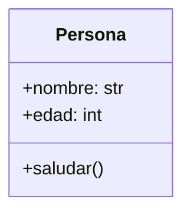
````

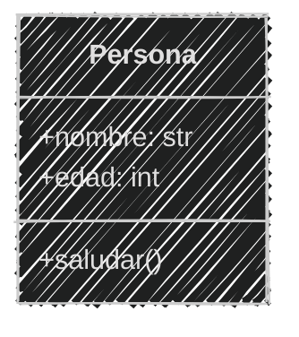

---

En Python, los atributos y métodos públicos se definen sin ningún prefijo

```python
class Persona:
    def __init__(self, nombre, edad):
        self.nombre = nombre  # Atributo público
        self.edad = edad      # Atributo público

    def saludar(self):       # Método público
        print(f"Hola, soy {self.nombre} y tengo {self.edad} años.")
```

---

#### Ejemplo 01

Crea los archivos **ejemplo01.md** y **ejemplo01.py** en la carpeta **sesion04**

```markdown
Diseñaremos un sistema operativo para un celular,
inicialmente sólo tendrá un fondo de pantalla
Podemos ver y cambiar el fondo de pantalla,
el SO se llamara `PyPhoneOS` 
```

Crear el análisis, diagrama y solución en Python

---
```markdown
# Análisis

Requisitos:
-  tener un fondo de pantalla
-  permitir cambiar el fondo de pantalla


Objetos:
- SistemaOperativo

Características:
- SistemaOperativo:
    - nombre: String
    - fondo_pantalla: String

Acciones:
- SistemaOperativo:
    - cambiar_fondo_pantalla(nuevo_fondo)
```

---

Creando el diseño de diagrama de clases

````
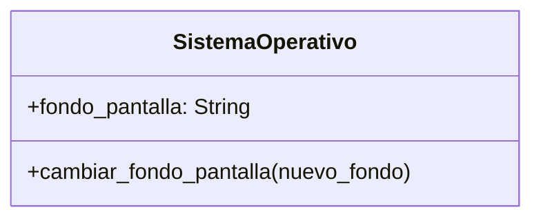
````

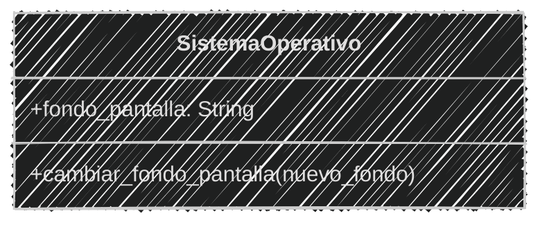

---


```python
# Definiendo la clase
class SistemaOperativo:
    def __init__(self, nombre, fondo_pantalla):
        self.nombre = nombre # Atributo Publico
        self.fondo_pantalla = fondo_pantalla # Atributo Publico

    def cambiar_fondo_pantalla(self, nuevo_fondo): # Método Público
        self.fondo_pantalla = nuevo_fondo
        print(f"Nuevo fondo: {self.fondo_pantalla}")
        return self.fondo_pantalla
# Implementando la clase
so = SistemaOperativo("PyPhoneOS", "gatitos.jpg")
print(f"Fondo de pantalla: {so.fondo_pantalla}")
so.cambiar_fondo_pantalla("perritos.jpg")
```

```bash
python ejemplo01.py
```

```text 
Fondo de pantalla: gatitos.jpg
Nuevo fondo: perritos.jpg
```

---

#### Ejemplo 02

```markdown
Ahora vamos agregarle un `reloj` al sistema operativo,
y que nos permita `ver la hora`
```

3 Minutos (Análisis, diagrama y solución en Python)

<iframe src="https://time-stuff.com/embed.html" frameborder="0" scrolling="no" width="391" height="140"></iframe>

Crea los archivos **ejemplo02.md** y **ejemplo02.py** en la carpeta **sesion04**

---
```markdown [6-7|17,22]
# Análisis

Requisitos:
-  tener un fondo de pantalla
-  permitir cambiar el fondo de pantalla
-  tener un reloj
-  permitir ver la hora 


Objetos:
- SistemaOperativo

Características:
- SistemaOperativo:
    - nombre: String
    - fondo_pantalla: String
    - reloj: String

Acciones:
- SistemaOperativo:
    - cambiar_fondo_pantalla(nuevo_fondo)
    - ver_hora()
```

---

Creando el diseño de diagrama de clases

```` [4,7]

````

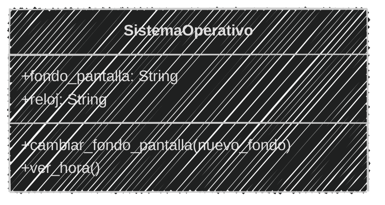

---

```python [6|12-15|22]
# Definiendo la clase
class SistemaOperativo:
    def __init__(self, nombre, fondo_pantalla, reloj):
        self.nombre = nombre # Público
        self.fondo_pantalla = fondo_pantalla # Público
        self.reloj = reloj # Público

    def cambiar_fondo_pantalla(self, nuevo_fondo): # Método Público
        self.fondo_pantalla = nuevo_fondo
        print(f"Nuevo fondo: {self.fondo_pantalla}")
        return self.fondo_pantalla

    def ver_hora(self): # Método Público
        print(f"La hora actual es: {self.reloj}")
        return self.reloj
# Implementando la clase
so = SistemaOperativo("PyPhoneOS", "gatitos.jpg", "12:00 PM")
print(f"Fondo de pantalla: {so.fondo_pantalla}")
so.cambiar_fondo_pantalla("perritos.jpg")
so.ver_hora()
```

```bash
python ejemplo02.py
```

```text
Fondo de pantalla: gatitos.jpg
Nuevo fondo: perritos.jpg
La hora actual es: 12:00 PM
```

---
#### Nivel Protegido

Los atributos y métodos protegidos son accesibles solo desde la propia clase y sus subclases.

Esto significa que no se pueden acceder directamente desde fuera de la clase.

---

Python no tiene encapsulamiento fuerte como otros lenguajes, como Java o C++.

Python sólo fue diseñado para utilizar niveles públicos y privados, pero no protegidos.

A través de convenciones, se puede simular el encapsulamiento protegido de manera débil.

---

Python confía en la disciplina del programador

para no acceder a los atributos protegidos desde fuera de la clase.

---

#### Diagrama de clases
Se representa con un símbolo de numeral `#` antes del nombre del atributo o método.

````
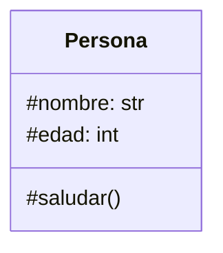
````


---

En Python, los atributos y métodos protegidos se definen con un solo guión bajo `_` antes del nombre.

Se encuentra en PEP 8 como una convención para indicar que un atributo o método es protegido.

```python
class Persona:
    def __init__(self, nombre, edad):
        self._nombre = nombre  # Atributo protegido
        self._edad = edad      # Atributo protegido

    def _saludar(self):       # Método protegido
        print(f"Hola, soy {self._nombre} y tengo {self._edad} años.")
```

---

#### Ejemplo 03
Crea los archivos **ejemplo03.md** y **ejemplo03.py** en la carpeta **sesion04**

```markdown
Ahora vamos a cambiar el reloj a un nivel protegido, 
no queremos que se pueda cambiar la hora desde fuera,
y que sólo se pueda ver la hora mediante un método.
```

---
El análisis se mantendrá igual, pero cambiaremos el diagrama

```markdown
# Análisis
Requisitos:
-  tener un fondo de pantalla
-  permitir cambiar el fondo de pantalla
-  tener un reloj
-  permitir ver la hora
Objetos:
- SistemaOperativo
Características:
- SistemaOperativo:
    - nombre: String
    - fondo_pantalla: String
    - reloj: String
Acciones:
- SistemaOperativo:
    - cambiar_fondo_pantalla(nuevo_fondo)
    - ver_hora()
```
---

Creando el diseño de diagrama de clases

````markdown [5]
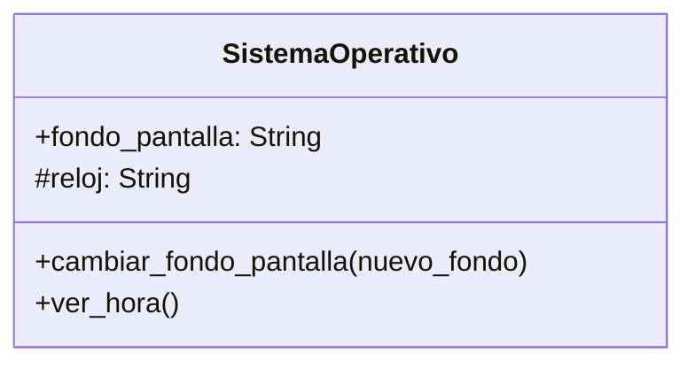
````

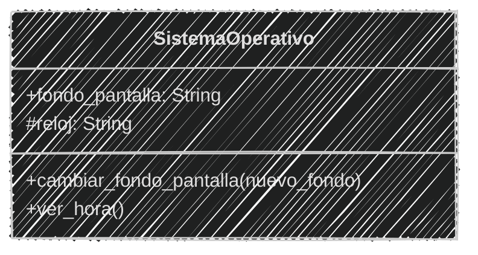


---

```python
# Definiendo la clase
class SistemaOperativo:
    def __init__(self, nombre, fondo_pantalla, reloj):
        self.nombre = nombre  # Público
        self.fondo_pantalla = fondo_pantalla  # Público
        self._reloj = reloj  # Protegido

    def cambiar_fondo_pantalla(self, nuevo_fondo):  # Público
        self.fondo_pantalla = nuevo_fondo
        print(f"Nuevo fondo: {self.fondo_pantalla}")
        return self.fondo_pantalla

    def ver_hora(self):  # Público
        print(f"La hora actual es: {self._reloj}")
        return self._reloj
# Implementando la clase
so = SistemaOperativo("PyPhoneOS", "gatitos.jpg", "12:00 PM")
print(f"Fondo de pantalla: {so.fondo_pantalla}")
so.cambiar_fondo_pantalla("perritos.jpg")
so.ver_hora()
# Intentando acceder al reloj directamente
print(f"Reloj: {so._reloj}")  # Posible, pero no recomendado
```

```bash
python ejemplo03.py
```

```text
Fondo de pantalla: gatitos.jpg
Nuevo fondo: perritos.jpg
La hora actual es: 12:00 PM
Reloj: 12:00 PM
```

---
#### Ejemplo 04

```markdown
Ahora el sistema operativo tendrá una batería, 
sólo el sistema operativo podrá cargar la batería,
a través de un cargador público,
podemos conocer el estado de la batería en porcentaje.
```

3 Minutos (Análisis, diagrama y solución en Python)

<iframe src="https://time-stuff.com/embed.html" frameborder="0" scrolling="no" width="391" height="140"></iframe>

Crea los archivos **ejemplo04.md** y **ejemplo04.py** en la carpeta **sesion04**

---

```markdown [7-9|18|23-25]
# Análisis
Requisitos:
-  tener un fondo de pantalla
-  permitir cambiar el fondo de pantalla
-  tener un reloj
-  permitir ver la hora
-  tener una batería
-  permitir conocer el estado de la batería en porcentaje
-  permitir cargar la batería a través de un cargador público

Objetos:
- SistemaOperativo
Características:
- SistemaOperativo:
    - nombre: String
    - fondo_pantalla: String
    - reloj: String
    - bateria: int
Acciones:
- SistemaOperativo:
    - cambiar_fondo_pantalla(nuevo_fondo)
    - ver_hora()
    - cargar_bateria(cantidad)
    - estado_bateria()
    - cargador(cantidad)
```

---

Creando el diseño de diagrama de clases

```` markdown [6,9-11]
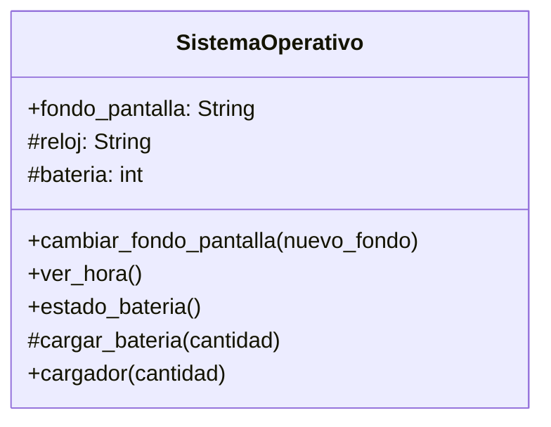
````

---

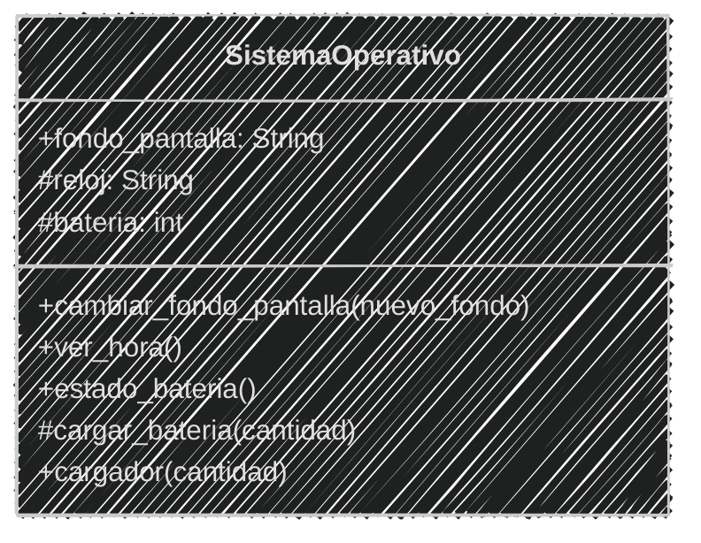

---

```python [7-8|18-29|35-37]
# Definiendo la clase
class SistemaOperativo:
    def __init__(self, nombre, fondo_pantalla, reloj, bateria):
        self.nombre = nombre  # Público
        self.fondo_pantalla = fondo_pantalla  # Público
        self._reloj = reloj  # Protegido
        self._bateria = bateria  # Protegido

    def cambiar_fondo_pantalla(self, nuevo_fondo):  # Público
        self.fondo_pantalla = nuevo_fondo
        print(f"Nuevo fondo: {self.fondo_pantalla}")
        return self.fondo_pantalla

    def ver_hora(self):  # Público
        print(f"La hora actual es: {self._reloj}")
        return self._reloj

    def estado_bateria(self):  # Público
        print(f"Estado de la batería: {self._bateria}%")
        return self._bateria

    def _cargar_bateria(self, cantidad):  # Protegido
        self._bateria += cantidad
        print(f"Batería cargada a: {self._bateria}%")

    def cargador(self, cantidad):  # Público
        print("Cargador conectado.")
        self._cargar_bateria(cantidad)
        print("Cargador desconectado.")
# Implementando la clase
so = SistemaOperativo("PyPhoneOS", "gatitos.jpg", "12:00 PM", 50)
print(f"Fondo de pantalla: {so.fondo_pantalla}")
so.cambiar_fondo_pantalla("perritos.jpg")
so.ver_hora()
so.estado_bateria()
so.cargador(20)  # Cargando la batería
so.estado_bateria()  # Verificando el estado de la batería
```

```bash
python ejemplo04.py
```

```text
Fondo de pantalla: gatitos.jpg
Nuevo fondo: perritos.jpg
La hora actual es: 12:00 PM
Estado de la batería: 50%
Batería cargada a: 70%
Estado de la batería: 70%
```
---

#### Nivel Privado

Los atributos y métodos privados son accesibles solo desde la propia clase.

Esto significa que no se pueden acceder directamente desde fuera de la clase ni desde sus subclases.


---

#### Diagrama de clases

Se representa con un símbolo de guion medio `-` antes del nombre del atributo o método.

````
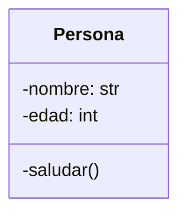
````

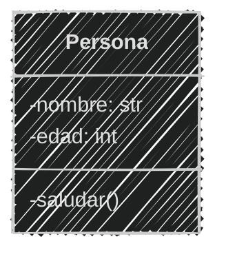

---

En Python, los atributos y métodos privados se definen con dos guiones bajos `__` antes del nombre.

Si se intenta acceder a un atributo o método privado desde fuera de la clase, se producirá un error.

```python
class Persona:
    def __init__(self, nombre, edad):
        self.__nombre = nombre  # Atributo privado
        self.__edad = edad      # Atributo privado

    def __saludar(self):       # Método privado
        print(f"Hola, soy {self.__nombre} y tengo {self.__edad} años.")
```

---

#### Ejemplo 05

Crea los archivos **ejemplo05.md** y **ejemplo05.py** en la carpeta **sesion04**

```markdown
Ahora vamos a cambiar la batería a un nivel privado, porque absolutamente nadie debe poder cambiar la batería,
sólo el sistema operativo podrá cargar la batería,
y que sólo se pueda ver el estado de la batería mediante un método.
```
---

El análisis se mantendrá igual, pero cambiaremos el diagrama

```markdown [7-9|18|23-25]
# Análisis
Requisitos:
-  tener un fondo de pantalla
-  permitir cambiar el fondo de pantalla
-  tener un reloj
-  permitir ver la hora
-  tener una batería
-  permitir conocer el estado de la batería en porcentaje
-  permitir cargar la batería a través de un cargador público

Objetos:
- SistemaOperativo
Características:
- SistemaOperativo:
    - nombre: String
    - fondo_pantalla: String
    - reloj: String
    - bateria: int
Acciones:
- SistemaOperativo:
    - cambiar_fondo_pantalla(nuevo_fondo)
    - ver_hora()
    - cargar_bateria(cantidad)
    - estado_bateria()
    - cargador(cantidad)
```

---
Creando el diseño de diagrama de clases

````markdown [6,9-11]
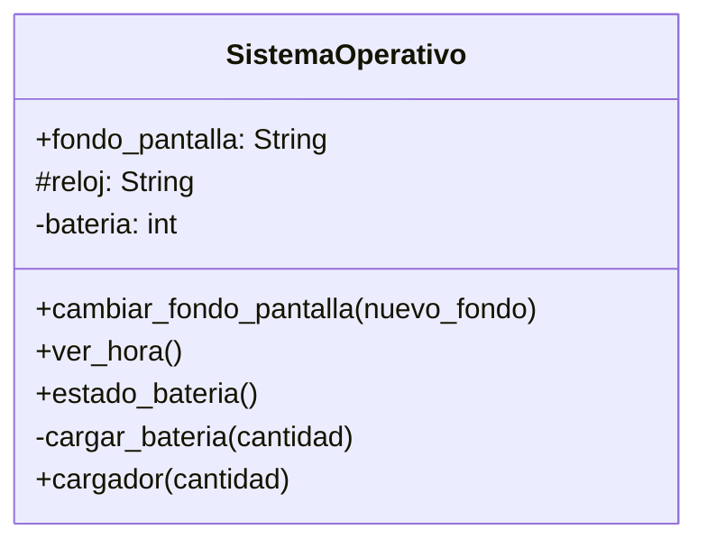
````

---

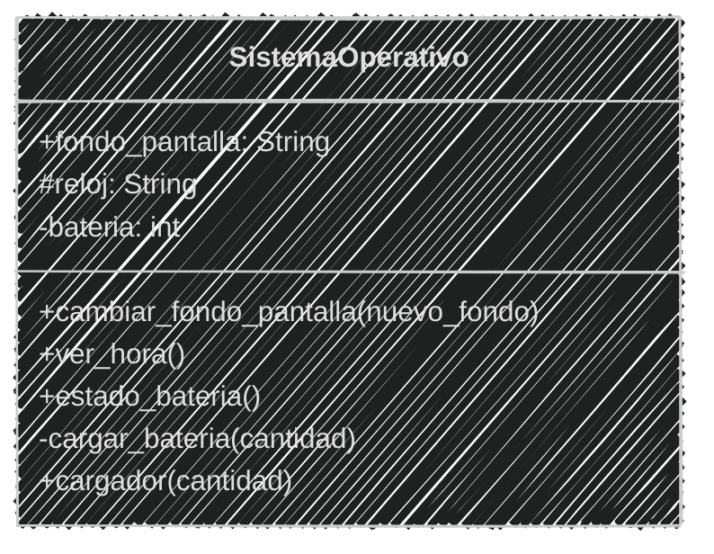
---

```python [7-8|18-29|35-37|38-47]
# Definiendo la clase
class SistemaOperativo:
    def __init__(self, nombre, fondo_pantalla, reloj, bateria):
        self.nombre = nombre  # Público
        self.fondo_pantalla = fondo_pantalla  # Público
        self._reloj = reloj  # Protegido
        self.__bateria = bateria  # Privado

    def cambiar_fondo_pantalla(self, nuevo_fondo):  # Público
        self.fondo_pantalla = nuevo_fondo
        print(f"Nuevo fondo: {self.fondo_pantalla}")
        return self.fondo_pantalla

    def ver_hora(self):  # Público
        print(f"La hora actual es: {self._reloj}")
        return self._reloj

    def estado_bateria(self):  # Público
        print(f"Estado de la batería: {self.__bateria}%")
        return self.__bateria

    def __cargar_bateria(self, cantidad):  # Privado
        self.__bateria += cantidad
        print(f"Batería cargada a: {self.__bateria}%")

    def cargador(self, cantidad):  # Público
        print("Cargador conectado.")
        self.__cargar_bateria(cantidad)
        print("Cargador desconectado.")
# Implementando la clase
so = SistemaOperativo("PyPhoneOS", "gatitos.jpg", "12:00 PM", 50)
print(f"Fondo de pantalla: {so.fondo_pantalla}")
so.cambiar_fondo_pantalla("perritos.jpg")
so.ver_hora()
so.estado_bateria()
so.cargador(20)  # Cargando la batería
# Intentando acceder a la batería directamente
try:
    print(f"Batería: {so.__bateria}")  # Esto producirá un error
except AttributeError as e:
    print(f"Error: {e}")
# Intentando acceder al método privado
try:
    so.__cargar_bateria(10)  # Esto producirá un error
except AttributeError as e:
    print(f"Error: {e}")
```

```bash
python ejemplo05.py
```

```text
Fondo de pantalla: gatitos.jpg
Nuevo fondo: perritos.jpg
La hora actual es: 12:00 PM
Estado de la batería: 50%
Batería cargada a: 70%
Error: 'SistemaOperativo' object has no attribute '__bateria'
Error: 'SistemaOperativo' object has no attribute '__cargar_bateria'
```

---
#### Ejemplo 06

```markdown
Ahora el sistema operativo tendrá que almacenar el pin,
sólo el sistema podrá cambiar el pin de desbloqueo,
y no se puede ver sólo se puede cambiar.
```

3 Minutos (Análisis, diagrama y solución en Python)

<iframe src="https://time-stuff.com/embed.html" frameborder="0" scrolling="no" width="391" height="140"></iframe>

Crea los archivos **ejemplo06.md** y **ejemplo06.py** en la carpeta **sesion04**

---

El análisis se mantendrá igual, pero cambiaremos el diagrama

```markdown [10-11|21|29]
# Análisis
Requisitos:
-  tener un fondo de pantalla
-  permitir cambiar el fondo de pantalla
-  tener un reloj
-  permitir ver la hora
-  tener una batería
-  permitir conocer el estado de la batería en porcentaje
-  permitir cargar la batería a través de un cargador público
-  tener un pin de desbloqueo
-  permitir cambiar el pin de desbloqueo

Objetos:
- SistemaOperativo
Características:
- SistemaOperativo:
    - nombre: String
    - fondo_pantalla: String
    - reloj: String
    - bateria: int
    - pin: int
Acciones:
- SistemaOperativo:
    - cambiar_fondo_pantalla(nuevo_fondo)
    - ver_hora()
    - cargar_bateria(cantidad)
    - estado_bateria()
    - cargador(cantidad)
    - cambiar_pin(nuevo_pin)
```

---
Creando el diseño de diagrama de clases

````markdown [7,13]
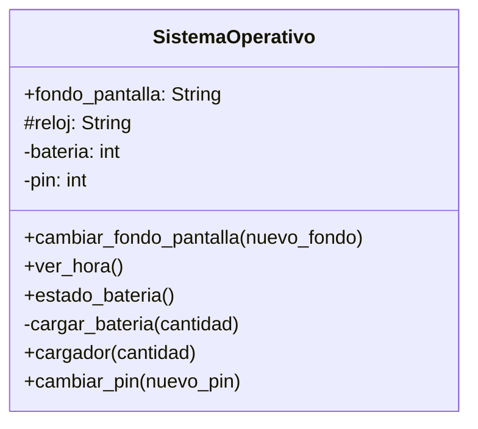
````

---

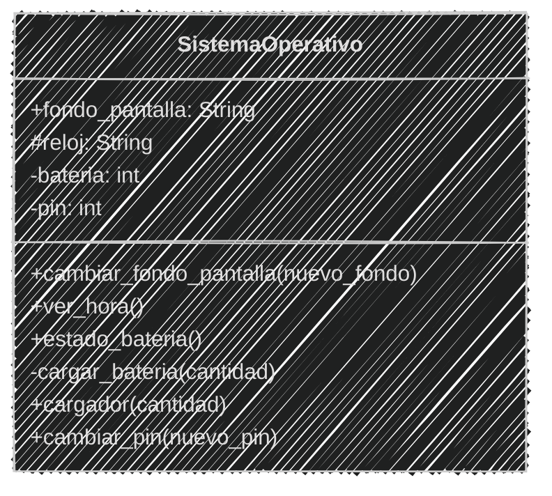
---

```python [8|32-34|43]
# Definiendo la clase
class SistemaOperativo:
    def __init__(self, nombre, fondo_pantalla, reloj, bateria, pin):
        self.nombre = nombre  # Público
        self.fondo_pantalla = fondo_pantalla  # Público
        self._reloj = reloj  # Protegido
        self.__bateria = bateria  # Privado
        self.__pin = pin  # Privado

    def cambiar_fondo_pantalla(self, nuevo_fondo):  # Público
        self.fondo_pantalla = nuevo_fondo
        print(f"Nuevo fondo: {self.fondo_pantalla}")
        return self.fondo_pantalla

    def ver_hora(self):  # Público
        print(f"La hora actual es: {self._reloj}")
        return self._reloj

    def estado_bateria(self):  # Público
        print(f"Estado de la batería: {self.__bateria}%")
        return self.__bateria

    def __cargar_bateria(self, cantidad):  # Privado
        self.__bateria += cantidad
        print(f"Batería cargada a: {self.__bateria}%")

    def cargador(self, cantidad):  # Público
        print("Cargador conectado.")
        self.__cargar_bateria(cantidad)
        print("Cargador desconectado.")

    def cambiar_pin(self, nuevo_pin):  # Público
        self.__pin = nuevo_pin
        print("Pin cambiado exitosamente.")
# Implementando la clase
so = SistemaOperativo("PyPhoneOS", "gatitos.jpg", "12:00 PM", 50, 1234)
print(f"Fondo de pantalla: {so.fondo_pantalla}")
so.cambiar_fondo_pantalla("perritos.jpg")
so.ver_hora()
so.estado_bateria()
so.cargador(20)  # Cargando la batería
so.estado_bateria()  # Verificando el estado de la batería
so.cambiar_pin(5678)  # Cambiando el pin
```

```text
Fondo de pantalla: gatitos.jpg
Nuevo fondo: perritos.jpg
La hora actual es: 12:00 PM
Estado de la batería: 50%
Cargador conectado.
Batería cargada a: 70%
Cargador desconectado.
Estado de la batería: 70%
Pin cambiado exitosamente.
```

---

#### Getters y Setters

Son métodos que permiten acceder y modificar los atributos privados de una clase.

Los getters permiten obtener el valor de un atributo privado

Los setters permiten modificar el valor de un atributo privado de manera controlada.

---

Getters viene del inglés 

- "get" (obtener)
- "set" (establecer).

---

El getter devuelve el valor del atributo privado

El setter recibe un valor y lo asigna al atributo privado

---

Podemos definir un getter y un setter con la palabra get y set respectivamente.

```python
class Persona:
    def __init__(self, nombre):
        self.__nombre = nombre  # Atributo privado

    def get_nombre(self):  # Getter
        return self.__nombre

    def set_nombre(self, nuevo_nombre):  # Setter
        self.__nombre = nuevo_nombre
```
---

#### Ejemplo 06
Crea los archivos **ejemplo06.md** y **ejemplo06.py** en la carpeta **sesion04**

```markdown
Ahora vamos a agregar un getter y un setter para el pin,
sólo se podrá ver el pin a través del getter,
y se podrá cambiar el pin a través del setter
En el getter y setter podemos agregar validaciones
como que el pin sea un número de 4 dígitos
```

---

El análisis tendrá que cambiar un poco

```markdown [10-12|23|31-32]
# Análisis
Requisitos:
-  tener un fondo de pantalla
-  permitir cambiar el fondo de pantalla
-  tener un reloj
-  permitir ver la hora
-  tener una batería
-  permitir conocer el estado de la batería en porcentaje
-  permitir cargar la batería a través de un cargador público
-  tener un pin de desbloqueo
-  permitir cambiar el pin de desbloqueo máximo 4 dígitos
-  permitir ver el pin de desbloqueo


Objetos:
- SistemaOperativo
Características:
- SistemaOperativo:
    - nombre: String
    - fondo_pantalla: String
    - reloj: String
    - bateria: int
    - pin: int
Acciones:
- SistemaOperativo:
    - cambiar_fondo_pantalla(nuevo_fondo)
    - ver_hora()
    - cargar_bateria(cantidad)
    - estado_bateria()
    - cargador(cantidad)
    - get_pin()
    - set_pin(nuevo_pin)
```

---
Creando el diseño de diagrama de clases

````markdown [7,13,14]
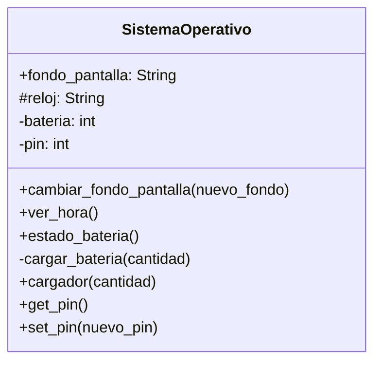
````
---

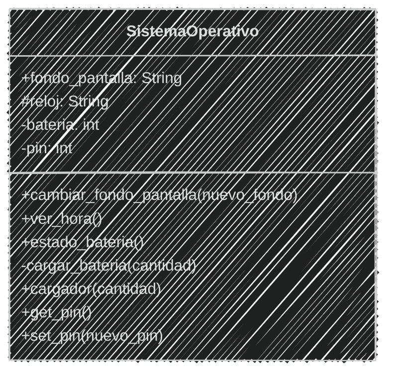

---

Implementando en Python

```python [8|32-40|41-48]
# Definiendo la clase
class SistemaOperativo:
    def __init__(self, nombre, fondo_pantalla, reloj, bateria, pin):
        self.nombre = nombre  # Público
        self.fondo_pantalla = fondo_pantalla  # Público
        self._reloj = reloj  # Protegido
        self.__bateria = bateria  # Privado
        self.__pin = pin  # Privado

    def cambiar_fondo_pantalla(self, nuevo_fondo):  # Público
        self.fondo_pantalla = nuevo_fondo
        print(f"Nuevo fondo: {self.fondo_pantalla}")
        return self.fondo_pantalla

    def ver_hora(self):  # Público
        print(f"La hora actual es: {self._reloj}")
        return self._reloj

    def estado_bateria(self):  # Público
        print(f"Estado de la batería: {self.__bateria}%")
        return self.__bateria

    def __cargar_bateria(self, cantidad):  # Privado
        self.__bateria += cantidad
        print(f"Batería cargada a: {self.__bateria}%")

    def cargador(self, cantidad):  # Público
        print("Cargador conectado.")
        self.__cargar_bateria(cantidad)
        print("Cargador desconectado.")

    def get_pin(self):  # Getter público
        return self.__pin

    def set_pin(self, nuevo_pin):  # Setter público
        if len(str(nuevo_pin)) == 4:
            self.__pin = nuevo_pin
            print("Pin cambiado exitosamente.")
        else:
            print("El pin debe ser un número de 4 dígitos.")
# Implementando la clase
so = SistemaOperativo("PyPhoneOS", "gatitos.jpg", "12:00 PM", 50, 1234)
pin = so.get_pin()  # Verificando el pin
print(f"Pin actual: {pin}")
so.set_pin(123)  # Intentando cambiar el pin
so.set_pin(5678)  # Cambiando el pin
pin = so.get_pin()  # Verificando el pin nuevamente
print(f"Pin actualizado: {pin}")
```

```bash
python ejemplo06.py
```

```text
Pin actual: 1234
El pin debe ser un número de 4 dígitos.
Pin cambiado exitosamente.
Pin actualizado: 5678
```

---

#### Ejemplo 07

```markdown
Ahora el sistema operativo tendrá un número telefónico privado,
se puede ver el número telefónico y cambiarlo
```

3 Minutos (Análisis, diagrama y solución en Python)

<iframe src="https://time-stuff.com/embed.html" frameborder="0" scrolling="no" width="391" height="140"></iframe>

---
Se añade el número telefónico al análisis

```markdown [13-15|27|37-38]
# Análisis
Requisitos:
-  tener un fondo de pantalla
-  permitir cambiar el fondo de pantalla
-  tener un reloj
-  permitir ver la hora
-  tener una batería
-  permitir conocer el estado de la batería en porcentaje
-  permitir cargar la batería a través de un cargador público
-  tener un pin de desbloqueo
-  permitir cambiar el pin de desbloqueo máximo 4 dígitos
-  permitir ver el pin de desbloqueo
-  tener un número telefónico
-  permitir ver el número telefónico
-  permitir cambiar el número telefónico


Objetos:
- SistemaOperativo
Características:
- SistemaOperativo:
    - nombre: String
    - fondo_pantalla: String
    - reloj: String
    - bateria: int
    - pin: int
    - telefono: String
Acciones:
- SistemaOperativo:
    - cambiar_fondo_pantalla(nuevo_fondo)
    - ver_hora()
    - cargar_bateria(cantidad)
    - estado_bateria()
    - cargador(cantidad)
    - get_pin()
    - set_pin(nuevo_pin)
    - get_telefono()
    - set_telefono(nuevo_telefono)
```

---

Creando el diseño de diagrama de clases

````markdown [8,16,17]
```mermaid
classDiagram
    class SistemaOperativo {
        +fondo_pantalla: String
        #reloj: String
        -bateria: int
        -pin: int
        -telefono: String
        +cambiar_fondo_pantalla(nuevo_fondo)
        +ver_hora()
        +estado_bateria()
        -cargar_bateria(cantidad)
        +cargador(cantidad)
        +get_pin()
        +set_pin(nuevo_pin)
        +get_telefono()
        +set_telefono(nuevo_telefono)
    }
```
````

---

```mermaid
%%{init: {"theme": "dark", "look": "handDrawn" }}%%
classDiagram
    class SistemaOperativo {
        +fondo_pantalla: String
        #reloj: String
        -bateria: int
        -pin: int
        -telefono: String
        +cambiar_fondo_pantalla(nuevo_fondo)
        +ver_hora()
        +estado_bateria()
        -cargar_bateria(cantidad)
        +cargador(cantidad)
        +get_pin()
        +set_pin(nuevo_pin)
        +get_telefono()
        +set_telefono(nuevo_telefono)
    }
```

---

Implementando en Python

```python [9|43-48|51-55]
# Definiendo la clase
class SistemaOperativo:
    def __init__(self, nombre, fondo_pantalla, reloj, bateria, pin, telefono):
        self.nombre = nombre  # Público
        self.fondo_pantalla = fondo_pantalla  # Público
        self._reloj = reloj  # Protegido
        self.__bateria = bateria  # Privado
        self.__pin = pin  # Privado
        self.__telefono = telefono  # Privado

    def cambiar_fondo_pantalla(self, nuevo_fondo):  # Público
        self.fondo_pantalla = nuevo_fondo
        print(f"Nuevo fondo: {self.fondo_pantalla}")
        return self.fondo_pantalla

    def ver_hora(self):  # Público
        print(f"La hora actual es: {self._reloj}")
        return self._reloj

    def estado_bateria(self):  # Público
        print(f"Estado de la batería: {self.__bateria}%")
        return self.__bateria

    def __cargar_bateria(self, cantidad):  # Privado
        self.__bateria += cantidad
        print(f"Batería cargada a: {self.__bateria}%")

    def cargador(self, cantidad):  # Público
        print("Cargador conectado.")
        self.__cargar_bateria(cantidad)
        print("Cargador desconectado.")

    def get_pin(self):  # Getter público
        return self.__pin

    def set_pin(self, nuevo_pin):  # Setter público
        if len(str(nuevo_pin)) == 4:
            self.__pin = nuevo_pin
            print("Pin cambiado exitosamente.")
        else:
            print("El pin debe ser un número de 4 dígitos.")

    def get_telefono(self):  # Getter público
        return self.__telefono

    def set_telefono(self, nuevo_telefono):  # Setter público
        self.__telefono = nuevo_telefono
        print("Número telefónico cambiado exitosamente.")
# Implementando la clase
so = SistemaOperativo("PyPhoneOS","gatitos.jpg","12:00 PM",50, 1234, "123-456-7890")
telefono = so.get_telefono()  
print(f"Número telefónico actual: {telefono}")
so.set_telefono("098-765-4321")  
telefono = so.get_telefono()  
print(f"Número telefónico actualizado: {telefono}")
```

```bash	
python ejemplo07.py
```

```text
Número telefónico actual: 123-456-7890
Número telefónico cambiado exitosamente.
Número telefónico actualizado: 098-765-4321
```

---

Definir los getters y setters es una buena práctica para mantener la encapsulación

Existe en python una forma de definir getters y setters de manera más elegante y limpia

---

#### Propiedades en Python

Las propiedades en Python permiten definir métodos que se comportan como atributos.

Permiten acceder a los atributos privados de una clase de manera controlada.

Se definen utilizando el decorador `@property` para el getter y `@nombre.setter` para el setter.

---

Se definen sobre los métodos de la clase, y se accede a ellos como si fueran atributos.

---

El decorador `@property` debe ir en la parte superior del método getter.

El nombre del método getter es el nombre del atributo que se quiere acceder.

```python
@property
def nombre(self):  # Getter
    return self.__nombre
```

---

El decorador `@<nombre>.setter` debe ir en la parte superior del método setter.

Después del `@` se coloca el nombre del atributo que se quiere modificar.

seguido del `.setter`.

```python
@nombre.setter
def nombre(self, nuevo_nombre):  # Setter
    self.__nombre = nuevo_nombre
```


---

Podemos definir una propiedad en Python

```python
class Persona:
    def __init__(self, nombre):
        self.__nombre = nombre  # Atributo privado

    @property
    def nombre(self):  # Getter
        return self.__nombre

    @nombre.setter
    def nombre(self, nuevo_nombre):  # Setter
        self.__nombre = nuevo_nombre
# Uso
persona = Persona("Juan")
print(persona.nombre)  # Acceso al getter
persona.nombre = "Pedro"  # Acceso al setter
```

---

## Ejemplo 08

```markdown
Del sistema operativo vamos a cambiar el getter y setter
del pin por una propiedad para que se pueda acceder
como si fuera un atributo
```

Crea los archivos **ejemplo08.md** y **ejemplo08.py** en la carpeta **sesion04**

---
El análisis se mantendrá igual 

```markdown [10-12,26,35-36]
# Análisis
Requisitos:
-  tener un fondo de pantalla
-  permitir cambiar el fondo de pantalla
-  tener un reloj
-  permitir ver la hora
-  tener una batería
-  permitir conocer el estado de la batería en porcentaje
-  permitir cargar la batería a través de un cargador público
-  tener un pin de desbloqueo
-  permitir cambiar el pin de desbloqueo máximo 4 dígitos
-  permitir ver el pin de desbloqueo
-  tener un número telefónico
-  permitir ver el número telefónico
-  permitir cambiar el número telefónico


Objetos:
- SistemaOperativo
Características:
- SistemaOperativo:
    - nombre: String
    - fondo_pantalla: String
    - reloj: String
    - bateria: int
    - pin: int
    - telefono: String
Acciones:
- SistemaOperativo:
    - cambiar_fondo_pantalla(nuevo_fondo)
    - ver_hora()
    - cargar_bateria(cantidad)
    - estado_bateria()
    - cargador(cantidad)
    - get_pin()
    - set_pin(nuevo_pin)
    - get_telefono()
    - set_telefono(nuevo_telefono)
```

---

El diseño del diagrama de clases se mantendrá igual

````markdown [7,14,15]
```mermaid
classDiagram
    class SistemaOperativo {
        +fondo_pantalla: String
        #reloj: String
        -bateria: int
        -pin: int
        -telefono: String
        +cambiar_fondo_pantalla(nuevo_fondo)
        +ver_hora()
        +estado_bateria()
        -cargar_bateria(cantidad)
        +cargador(cantidad)
        +get_pin()
        +set_pin(nuevo_pin)
        +get_telefono()
        +set_telefono(nuevo_telefono)
    }
```
````

---

```mermaid
%%{init: {"theme": "dark", "look": "handDrawn" }}%%
classDiagram
    class SistemaOperativo {
        +fondo_pantalla: String
        #reloj: String
        -bateria: int
        -pin: int
        -telefono: String
        +cambiar_fondo_pantalla(nuevo_fondo)
        +ver_hora()
        +estado_bateria()
        -cargar_bateria(cantidad)
        +cargador(cantidad)
        +get_pin()
        +set_pin(nuevo_pin)
        +get_telefono()
        +set_telefono(nuevo_telefono)
    }
```

---

```python [8|33-43|53-59]
# Definiendo la clase
class SistemaOperativo:
    def __init__(self, nombre, fondo_pantalla, reloj, bateria, pin, telefono):
        self.nombre = nombre  # Público
        self.fondo_pantalla = fondo_pantalla  # Público
        self._reloj = reloj  # Protegido
        self.__bateria = bateria  # Privado
        self.__pin = pin  # Privado
        self.__telefono = telefono  # Privado

    def cambiar_fondo_pantalla(self, nuevo_fondo):  # Público
        self.fondo_pantalla = nuevo_fondo
        print(f"Nuevo fondo: {self.fondo_pantalla}")
        return self.fondo_pantalla

    def ver_hora(self):  # Público
        print(f"La hora actual es: {self._reloj}")
        return self._reloj

    def estado_bateria(self):  # Público
        print(f"Estado de la batería: {self.__bateria}%")
        return self.__bateria

    def __cargar_bateria(self, cantidad):  # Privado
        self.__bateria += cantidad
        print(f"Batería cargada a: {self.__bateria}%")

    def cargador(self, cantidad):  # Público
        print("Cargador conectado.")
        self.__cargar_bateria(cantidad)
        print("Cargador desconectado.")

    @property
    def pin(self):  # Getter público como propiedad
        return self.__pin

    @pin.setter
    def pin(self, nuevo_pin):  # Setter público como propiedad
        if len(str(nuevo_pin)) == 4:
            self.__pin = nuevo_pin
            print("Pin cambiado exitosamente.")
        else:
            print("El pin debe ser un número de 4 dígitos.")

    def get_telefono(self):  # Getter público
        return self.__telefono

    def set_telefono(self, nuevo_telefono):  # Setter público
        self.__telefono = nuevo_telefono
        print("Número telefónico cambiado exitosamente.")
# Implementando la clase
so = SistemaOperativo("PyPhoneOS", "gatitos.jpg", "12:00 PM",50, 1234, "123-456-7890")
pin = so.pin  
print(f"Pin actual: {pin}")
so.pin = 123  
print(f"Pin después del intento de cambio: {so.pin}")
so.pin = 5678  
pin = so.pin 
print(f"Pin actualizado: {pin}")
```

```bash
python ejemplo08.py
```

```text
Pin actual: 1234
El pin debe ser un número de 4 dígitos.
Pin después del intento de cambio: 1234
Pin cambiado exitosamente.
Pin actualizado: 5678
```

---
Diferencia Getters 

```python
def get_pin(self):  # Getter público
    return self.__pin
# objeto.get_pin()
```

```python
@property
def pin(self):  # Getter público como propiedad
    return self.__pin
# objeto.pin
```

---

Diferencia Setters

```python
def set_pin(self, nuevo_pin):  # Setter público
    if len(str(nuevo_pin)) == 4:
        self.__pin = nuevo_pin
        print("Pin cambiado exitosamente.")
    else:
        print("El pin debe ser un número de 4 dígitos.")
# objeto.set_pin(5678)
```

```python
@pin.setter
def pin(self, nuevo_pin):  # Setter público como propiedad
    if len(str(nuevo_pin)) == 4:
        self.__pin = nuevo_pin
        print("Pin cambiado exitosamente.")
    else:
        print("El pin debe ser un número de 4 dígitos.")
# objeto.pin = 5678
```

---

#### Ejemplo 09

```markdown
El sistema operativo debe definir el telefono como una propiedad,
y se debe poder acceder al telefono como si fuera un atributo
```

Crea los archivos **ejemplo09.md** y **ejemplo09.py** en la carpeta **sesion04**

3 Minutos (Análisis, diagrama y solución en Python)

<iframe src="https://time-stuff.com/embed.html" frameborder="0" scrolling="no" width="391" height="140"></iframe>

El análisis y el diagrama se mantendrán igual

---

```python [9|45-52|55-59]
# Definiendo la clase
class SistemaOperativo:
    def __init__(self, nombre, fondo_pantalla, reloj, bateria, pin, telefono):
        self.nombre = nombre  # Público
        self.fondo_pantalla = fondo_pantalla  # Público
        self._reloj = reloj  # Protegido
        self.__bateria = bateria  # Privado
        self.__pin = pin  # Privado
        self.__telefono = telefono  # Privado

    def cambiar_fondo_pantalla(self, nuevo_fondo):  # Público
        self.fondo_pantalla = nuevo_fondo
        print(f"Nuevo fondo: {self.fondo_pantalla}")
        return self.fondo_pantalla

    def ver_hora(self):  # Público
        print(f"La hora actual es: {self._reloj}")
        return self._reloj

    def estado_bateria(self):  # Público
        print(f"Estado de la batería: {self.__bateria}%")
        return self.__bateria

    def __cargar_bateria(self, cantidad):  # Privado
        self.__bateria += cantidad
        print(f"Batería cargada a: {self.__bateria}%")

    def cargador(self, cantidad):  # Público
        print("Cargador conectado.")
        self.__cargar_bateria(cantidad)
        print("Cargador desconectado.")

    @property
    def pin(self):  # Getter público como propiedad
        return self.__pin

    @pin.setter
    def pin(self, nuevo_pin):  # Setter público como propiedad
        if len(str(nuevo_pin)) == 4:
            self.__pin = nuevo_pin
            print("Pin cambiado exitosamente.")
        else:
            print("El pin debe ser un número de 4 dígitos.")

    @property
    def telefono(self):  # Getter público como propiedad
        return self.__telefono

    @telefono.setter
    def telefono(self, nuevo_telefono):  # Setter público como propiedad
        self.__telefono = nuevo_telefono
        print("Número telefónico cambiado exitosamente.")
# Implementando la clase
so = SistemaOperativo("PyPhoneOS", "gatitos.jpg", "12:00 PM", 50, 1234, "123-456-7890")
telefono = so.telefono
print(f"Número telefónico actual: {telefono}")
so.telefono = "098-765-4321"
telefono = so.telefono
print(f"Número telefónico actualizado: {telefono}")
```

```bash
python ejemplo09.py
```

```text
Número telefónico actual: 123-456-7890
Número telefónico cambiado exitosamente.
Número telefónico actualizado: 098-765-4321
```

---

#### Resumen

- El encapsulamiento es un principio de la programación orientada a objetos que restringe el acceso directo a los datos y métodos de una clase para proteger su integridad y ocultar su implementación interna.
- Es importante porque protege los datos, permite la abstracción y controla el acceso a los atributos y métodos.

---

- Existen tres niveles de acceso: público (accesible desde cualquier parte), protegido (accesible solo desde la clase y sus subclases) y privado (accesible solo desde la propia clase).
- Los diagramas de clases usan símbolos para representar los niveles de acceso: + para público, # para protegido y - para privado.

---

- En Python, los niveles de acceso se indican por convención usando guiones bajos: sin guión para público, un guión bajo para protegido y dos guiones bajos para privado.
- Los getters y setters son métodos que permiten obtener y modificar atributos privados de manera controlada, y pueden incluir validaciones.

---

- Es buena práctica usar encapsulamiento, definir getters y setters para atributos privados y seguir las convenciones de Python para indicar el nivel de acceso.
- En Python, se pueden definir getters y setters de forma tradicional o usando propiedades con los decoradores `@property` y `@<nombre>.setter`.

---

- Las propiedades permiten acceder a métodos como si fueran atributos, haciendo el código más limpio y fácil de usar.
- La diferencia entre métodos tradicionales y propiedades es la forma de acceso: los métodos tradicionales usan llamadas explícitas y las propiedades permiten acceder como si fueran atributos.

---

- El uso de propiedades y encapsulamiento ayuda a mantener la integridad de los datos y facilita el mantenimiento del código.


---
#### Retos

Crear una carpeta con el nombre "retos_sesion_04" dentro del proyecto en la raíz, en la cual por cada ejercicio debes crear los siguientes archivos:

```bash
# Estructura de carpetas
psg-oop-2025/
    sesion04/
    retos_sesion_04/
        ejercicio_01.md
        ejercicio_01.py
        ejercicio_02.md
        ejercicio_02.py
```

---

1. Diseñas el software para una cuenta bancaria, el saldo es privado y solo se puede consultar, se puede depositar dinero y retirar dinero siempre y cuando el saldo sea suficiente. El número de cuenta es privado y se puede consultar, pero no se puede cambiar, el nombre del titular es público y se puede cambiar. 

Utiliza encapsulamiento, getters y setters, y propiedades

---
2. Creas una simulación de una célula, esta tiene ADN se puede consultar, pero no se puede cambiar, el tipo de célula cualquiera puede verlo y cambiarlo, la energia de la celula es privada, puede aumentar o disminuir pero mediante la accion de comer o dividirse.

Utiliza encapsulamiento, getters y setters, y propiedades

---
<!-- .slide: data-background-image="../../content/psg-bg-dark.png" data-background-size="100%"-->

<br>
<br>
<br>
<br>
<br>

[ <!-- .element width="20%"-->](https://github.com/python-la-paz/python-study-group-oop/content/sesion04)

Repositorio de la Sesión

---
<!--.slide: data-visibility="hidden"-->
## Bibliografía y Referencias

- [La importancia del encapsulamiento en la POO](https://elblogpython.com/tecnologia/la-importancia-del-encapsulamiento-en-la-poo/)
- [Method names and instance variables](https://peps.python.org/pep-0008/#method-names-and-instance-variables)
- [Python Double Underscore](https://realpython.com/python-double-underscore/)
- [Descriptive naming styles](https://peps.python.org/pep-0008/#descriptive-naming-styles)
- [Getters y Setters en programación](https://www.luisllamas.es/que-son-getters-y-setters-en-programacion/)
- [Getters y Setters](https://codigonautas.com/que-son-getters-setters/)
- [Python Property](https://realpython.com/python-property/)
- [Python Property Function](https://docs.python.org/3/library/functions.html#property)
- [Object Oriented Analysis](https://www.gyata.ai/es/object-oriented-programming/object-oriented-analysis)
- [DDOO Unidad 1](https://dmd.unadmexico.mx/contenidos/DCEIT/BLOQUE1/DS/02/DDOO/U1/descargables/DDOO_Unidad_1.pdf)
- [Programación procedural VS orientada a objetos](https://programacionpro.com/programacion-procedural-vs-orientada-a-objetos-diferencias-y-similitudes/)
- [Python OOP](https://www.learnpython.org/en/Classes_and_Objects)
- [Atributos de clase](https://oregoom.com/python/atributos-clase/)
- [Diagrama de clases](https://diagramasuml.com/diagrama-de-clases/)
- [Guía PEP 8](https://peps.python.org/pep-0008/#class-names)
- [Mermaid Charts](https://www.mermaidchart.com/play)
- [Draw.io](https://app.diagrams.net/)
- [Python 3 Object-oriented Programming, Second Edition, Dusty PhillipsDusty Phillips](https://github.com/PacktPublishing/Python-3-Object-Oriented-Programming-Second-Edition)
- [Objetos en programación](https://ebac.mx/blog/objeto-en-programacion)
- [Enfoque orientado a objetos](https://1library.co/article/enfoque-orientado-a-objetos-base-te%C3%B3rica.qvld461y)
- [OOAD](https://www.tutorialspoint.com/object_oriented_analysis_design/ooad_object_oriented_analysis.htm)