<!-- .slide: data-background-image="../../content/psg-bg-dark.png" data-background-size="100%"-->
 <!-- .element  hidden="true" -->

<br>
<br>
<br>

### Sesión  04
#### Encapsulamiento y propiedades
#### Controlando el acceso a los datos

---

### Antes de empezar

---

#### Proyecto en VSCode

Abre el proyecto en VSCode

```bash
code psg-oop-2025
```

Crea una carpeta con el nombre `sesion04`

```bash
mkdir sesion04
cd sesion04
```

- Los archivos de esta sesión deben estar dentro de esta carpeta

- Al finalizar la sesión, sube los cambios al repositorio en un commit

---

#### Encapsulamiento

¿Que piensas cuando escuchas la palabra encapsulamiento?

---
#### Encapsulamiento

Significa *"encerrar en una cápsula"*.

En **programación**, se refiere a la práctica de restringir el acceso directo a los datos y métodos de una clase

para **proteger** su integridad y **ocultar** su implementación interna.

---

#### Principios fundamentales

Es el **2º** principio fundamental de la Programación Orientada a Objetos (POO)

### **Encapsulamiento**

---

#### ¿Por qué es importante?

| Motivo                  | Descripción breve                                       |
| ----------------------- | ------------------------------------------------------- |
| **Protección de datos** | Evita cambios externos directos, mantiene la integridad |
| **Abstracción**         | Oculta detalles internos, muestra solo lo necesario     |
| **Control de acceso**   | Limita qué código puede acceder a atributos y métodos   |


---

Existen diferentes niveles o tipos de acceso:

**Público**: Accesible desde *cualquier parte* del código

**Protegido**: Accesible solo desde la propia *clase* y sus *subclases* (clases hijas)

**Privado**: Accesible solo desde la propia *clase*

---

#### Niveles de acceso

| Niveles   | ¿Quién puede usarlo? 🧑‍💻 | ¿Se puede ver? 👀 | ¿Se puede cambiar? 🔧 |
| --------- | :--------------------: | :--------------: | :------------------: |
| Público   |        Todos 🌐         |        ✅         |          ✅           |
| Protegido | La clase y sus hijas 👨‍👩‍👧 |        ⚠️         |          ⚠️           |
| Privado   |    Solo la clase 👑     |        🚫         |          🚫           |

---

#### Niveles de acceso

| Niveles   | Ejemplo                                                                      |
| --------- | ---------------------------------------------------------------------------- |
| Público   | Un teléfono público 📞, **cualquiera** puede usarlo llamar y hablar           |
| Protegido | Un teléfono de una casa ☎️, solo los **miembros de la familia** pueden usarlo |
| Privado   | Un teléfono celular 📱, solo el **dueño** puede usarlo                        |

---

#### Niveles de acceso en Python

En Python, los niveles de acceso se indican mediante convenciones 
de nomenclatura utilizando guiones bajos `_` y dobles guiones bajos `__`.

| Niveles   | Ejemplo variable | Ejemplo método |
| :-------- | :--------------- | :------------- |
| Público   | `publica`        | `_publico()`   |
| Protegido | `_protegida`     | `_protegido()` |
| Privado   | `__privada`      | `__privado()`  |

---
#### Nivel Público

Es el nivel de acceso más abierto

Los atributos y métodos públicos son accesibles desde cualquier parte del código

*Todos* pueden **ver y modificar** los atributos públicos

*Todos* pueden llamar a los métodos públicos

---

#### Diagrama de clases

Se representa con un símbolo de más (+) antes del nombre del atributo o método.

````
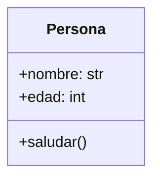
````

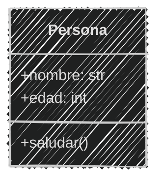

---

Los atributos y métodos públicos se definen sin ningún prefijo

```python
class Persona:
    def __init__(self, nombre, edad):
        self.nombre = nombre  # Atributo público
        self.edad = edad      # Atributo público

    def saludar(self):       # Método público
        print(f"Hola, soy {self.nombre} tengo {self.edad} años")
```

---

#### Ejemplo 01

Crea los archivos **sistema.md** y **sistema.py** en la carpeta **sesion04**

```markdown
Un pequeño equipo de desarrolladores decidió crear
un sistema operativo para un celular,
inicialmente sólo tendrá un fondo de pantalla
Todos podemos ver y cambiar el fondo de pantalla,
el SO se llamará `PyPhoneOS`
tendrá un fondo inicial de `gatitos.jpg`
```

---

Análisis en el archivo **sistema.md**

```markdown
# Análisis
Requisitos:
- Tiene un nombre
- Tiene un fondo de pantalla
- Cualquiera puede cambiar el fondo de pantalla
Objetos:
- SistemaOperativo
Características:
- SistemaOperativo:
    - nombre: String
    - fondo_pantalla: String
Acciones:
- SistemaOperativo:
    - cambiar_fondo_pantalla(imagen)
```

---

Creando el diseño de diagrama de clases

````
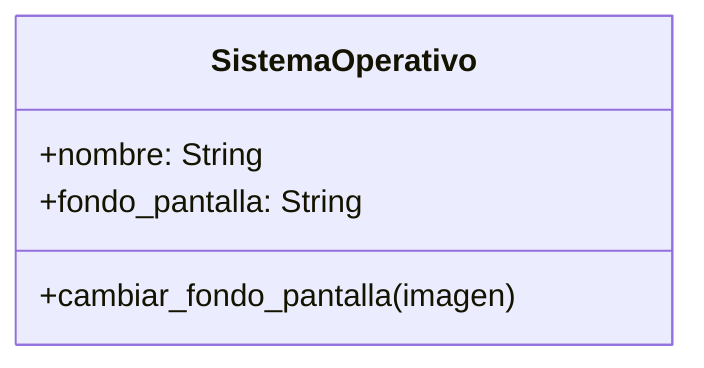
````

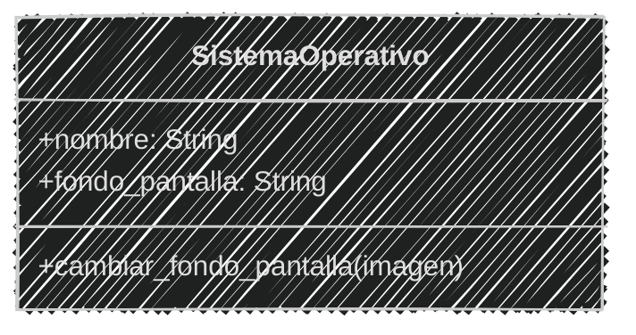

---

Creando el script **sistema.py**

```python [1-9|10-15]
# Definiendo la clase
class SistemaOperativo:
    def __init__(self, nombre, fondo_pantalla):
        self.nombre = nombre
        self.fondo_pantalla = fondo_pantalla
    def cambiar_fondo_pantalla(self, imagen):
        self.fondo_pantalla = imagen
        print(f"Nuevo fondo: {self.fondo_pantalla}")
        return self.fondo_pantalla
# Implementando la clase
so = SistemaOperativo("PyPhoneOS", "gatitos.jpg")
print(f"Fondo de pantalla: {so.fondo_pantalla}")
so.cambiar_fondo_pantalla("perritos.jpg")
so.fondo_pantalla = "paisajes.jpg"  # Cambiando directamente
print(f"Fondo de pantalla: {so.fondo_pantalla}")
```

```text 
Fondo de pantalla: gatitos.jpg
Nuevo fondo: perritos.jpg
Fondo de pantalla: paisajes.jpg
```

---

#### Ejercicio para ti (02)

En la carpeta **sesion04** modifica los archivos **sistema.md** y **sistema.py**

```markdown
Vamos agregar un `reloj` al sistema operativo,
cualquiera puede ver la hora a través de un método `ver hora`,
también se puede observar la hora directamente,
mediante el atributo `reloj`
```

Obtener el *Análisis*

2 minutos 

<iframe src="https://time-stuff.com/embed.html" frameborder="0" scrolling="no" width="391" height="140"></iframe>

---

Creando el *análisis*

```markdown [7-8|13,17,19,22]
# Análisis

Requisitos:
- Tiene un nombre
- Tiene un fondo de pantalla
- Cualquiera puede cambiar el fondo de pantalla
- Tiene un reloj
- Existe un método ver hora 

Objetos:
- SistemaOperativo

Características:
- SistemaOperativo:
    - nombre: String
    - fondo_pantalla: String
    - reloj: String

Acciones:
- SistemaOperativo:
    - cambiar_fondo_pantalla(imagen)
    - ver_hora()
```

---

#### Ejercicio para ti (02)

Ahora obtenemos el diseño del *diagrama de clase*

2 minutos

<iframe src="https://time-stuff.com/embed.html" frameborder="0" scrolling="no" width="391" height="140"></iframe>

---

Creando el diseño de diagrama de clases

````

````

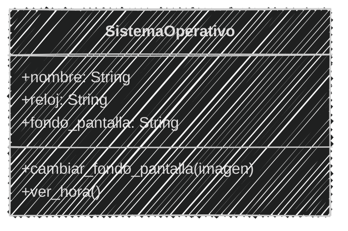

---

#### Ejercicio para ti (02)

Ya tenemos el *análisis y diseño* de la clase

Ahora podemos **programar**

2 minutos

<iframe src="https://time-stuff.com/embed.html" frameborder="0" scrolling="no" width="391" height="140"></iframe>

---

```python [3,6,11-13|15,20]
# Definiendo la clase
class SistemaOperativo:
    def __init__(self, nombre, fondo_pantalla, reloj):
        self.nombre = nombre 
        self.fondo_pantalla = fondo_pantalla 
        self.reloj = reloj 
    def cambiar_fondo_pantalla(self, nuevo_fondo):
        self.fondo_pantalla = nuevo_fondo
        print(f"Nuevo fondo: {self.fondo_pantalla}")
        return self.fondo_pantalla
    def ver_hora(self):
        print(f"La hora actual es: {self.reloj}")
        return self.reloj
# Implementando la clase
so = SistemaOperativo("PyPhoneOS", "gatitos.jpg", "12:00 PM")
print(f"Fondo de pantalla: {so.fondo_pantalla}")
so.cambiar_fondo_pantalla("perritos.jpg")
so.fondo_pantalla = "paisajes.jpg"
print(f"Fondo de pantalla: {so.fondo_pantalla}")
so.ver_hora()
```

```text
Fondo de pantalla: gatitos.jpg
Nuevo fondo: perritos.jpg
Fondo de pantalla: paisajes.jpg
La hora actual es: 12:00 PM
```

---
#### Nivel Protegido

Los atributos y métodos protegidos son accesibles **solo** desde la propia **clase** y sus **subclases**

Esto significa que *NO* se pueden acceder directamente desde fuera de la clase

---

Python **no** tiene encapsulamiento fuerte como otros lenguajes, como Java o C++

Python fue diseñado para utilizar niveles **públicos** y **privados**, pero no protegidos

A través de convenciones, se puede simular el encapsulamiento protegido de manera débil

---

Python confía en la disciplina del programador

para *NO* acceder a los atributos protegidos desde fuera de la clase

---

#### Diagrama de clases

Se representa con un símbolo de numeral `#` antes del nombre del atributo o método

````
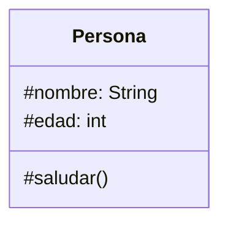
````

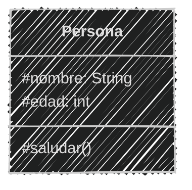

---

En Python, los atributos y métodos protegidos se definen con un solo guión bajo `_` antes del nombre

Se encuentra en PEP 8 como una convención para indicar que un atributo o método es protegido

```python
class Persona:
    def __init__(self, nombre, edad):
        self._nombre = nombre  # Atributo protegido
        self._edad = edad      # Atributo protegido

    def _saludar(self):       # Método protegido
        print(f"Hola, soy {self._nombre} tengo {self._edad} años")
```

---

#### Ejemplo 03

En la carpeta **sesion04** modifica los archivos **sistema.md** y **sistema.py**

```markdown
Cambiaremos el reloj a un nivel protegido, 
no queremos que se pueda cambiar la hora desde fuera,
sólo se pueda ver la hora mediante un método público `ver_hora`
```

---
El análisis se mantendrá igual, pero cambiaremos el diagrama

```markdown
# Análisis
Requisitos:
- Tiene un nombre
- Tiene un fondo de pantalla
- Cualquiera puede cambiar el fondo de pantalla
- Tiene un reloj
- Existe un método ver hora 
Objetos:
- SistemaOperativo
Características:
- SistemaOperativo:
    - nombre: String
    - fondo_pantalla: String
    - reloj: String
Acciones:
- SistemaOperativo:
    - cambiar_fondo_pantalla(imagen)
    - ver_hora()
```
---

Creando el diseño de diagrama de clases

```` markdown [5]
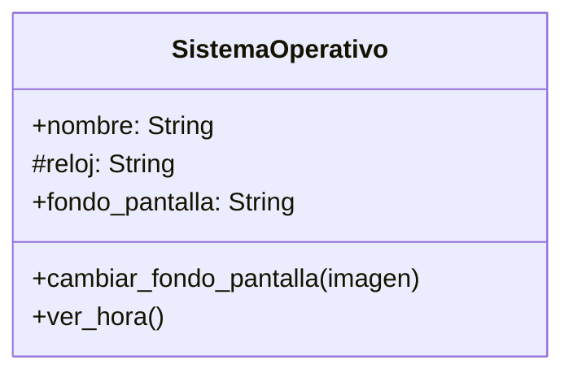
````

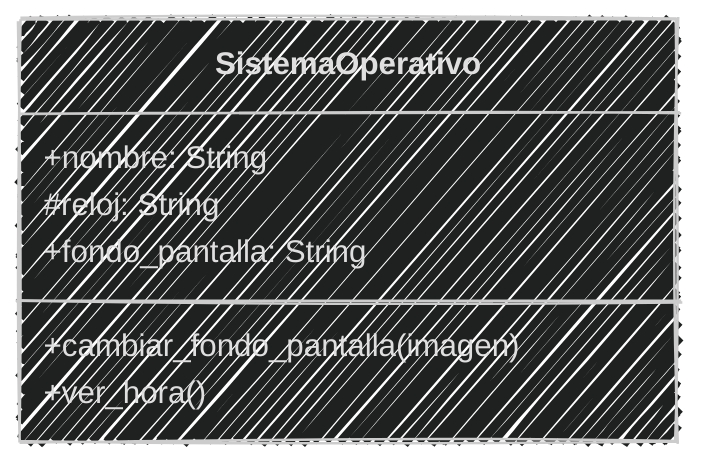


---

```python [6,11-13|20-21]
# Definiendo la clase
class SistemaOperativo:
    def __init__(self, nombre, fondo_pantalla, reloj):
        self.nombre = nombre 
        self.fondo_pantalla = fondo_pantalla 
        self._reloj = reloj 
    def cambiar_fondo_pantalla(self, nuevo_fondo):
        self.fondo_pantalla = nuevo_fondo
        print(f"Nuevo fondo: {self.fondo_pantalla}")
        return self.fondo_pantalla
    def ver_hora(self):
        print(f"La hora actual es: {self._reloj}")
        return self._reloj
# Implementando la clase
so = SistemaOperativo("PyPhoneOS", "gatitos.jpg", "12:00 PM")
print(f"Fondo de pantalla: {so.fondo_pantalla}")
so.cambiar_fondo_pantalla("perritos.jpg")
so.fondo_pantalla = "paisajes.jpg"
print(f"Fondo de pantalla: {so.fondo_pantalla}")
so.ver_hora()
print(f"Reloj: {so._reloj}")  # Posible, pero no recomendado
```

```text
Fondo de pantalla: gatitos.jpg
Nuevo fondo: perritos.jpg
Fondo de pantalla: paisajes.jpg
La hora actual es: 12:00 PM
Reloj: 12:00 PM
```

---
#### Ejercicio para ti (04)

En la carpeta **sesion04** modifica los archivos **sistema.md** y **sistema.py**

```markdown
El sistema operativo tendrá una batería, 
sólo el sistema operativo cargará la batería,
mediante un método público podemos conocer
el porcentaje de batería y mediante otro
método público podremos cargar la batería,
de manera similar a un puerto de carga
```

Obtener el *Análisis*

2 minutos 

<iframe src="https://time-stuff.com/embed.html" frameborder="0" scrolling="no" width="391" height="140"></iframe>

---

Creando el *análisis*

```markdown [7-9|18|23-25]
# Análisis
Requisitos:
- Tiene un nombre
- Tiene un fondo de pantalla
- Cualquiera puede cambiar el fondo de pantalla
- Tiene un reloj
- Existe un método ver hora 
- Tiene una batería
- Existe un método estado_batería
- Existe un método cargador para cargar la batería
Objetos:
- SistemaOperativo
Características:
- SistemaOperativo:
    - nombre: String
    - fondo_pantalla: String
    - reloj: String
    - bateria: int
Acciones:
- SistemaOperativo:
    - cambiar_fondo_pantalla(imagen)
    - ver_hora()
    - estado_bateria()
    - cargador(cantidad)
```

---

#### Ejercicio para ti (04)

Ahora obtenemos el diseño del *diagrama de clase*

2 minutos

<iframe src="https://time-stuff.com/embed.html" frameborder="0" scrolling="no" width="391" height="140"></iframe>

---

Creando el diseño de diagrama de clases

````
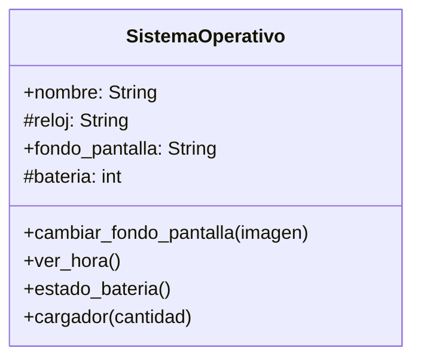
````

---

Creando el diseño de diagrama de clases

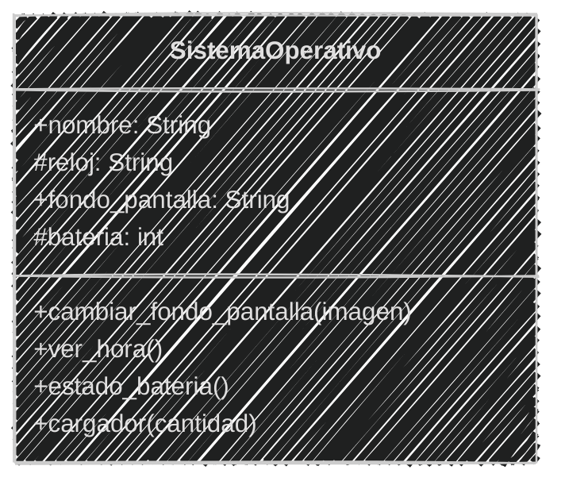
<!--.element class="center-mermaid"-->

---

#### Ejercicio para ti (04)

Ya tenemos el *análisis y diseño* de la clase

Ahora podemos **programar**

3 minutos

<iframe src="https://time-stuff.com/embed.html" frameborder="0" scrolling="no" width="391" height="140"></iframe>

---

```python [7|15-24|32-34]
# Definiendo la clase
class SistemaOperativo:
    def __init__(self, nombre, fondo_pantalla, reloj):
        self.nombre = nombre 
        self.fondo_pantalla = fondo_pantalla 
        self._reloj = reloj
        self._bateria = 1  # Protegido
    def cambiar_fondo_pantalla(self, nuevo_fondo):
        self.fondo_pantalla = nuevo_fondo
        print(f"Nuevo fondo: {self.fondo_pantalla}")
        return self.fondo_pantalla
    def ver_hora(self):
        print(f"La hora actual es: {self._reloj}")
        return self._reloj
    def estado_bateria(self):
        print(f"Estado de la batería: {self._bateria}%")
        return self._bateria
    def cargador(self, cantidad):
        print("🔌 Cargador conectado.")
        self._bateria += cantidad
        print(f"Batería cargada a: {self._bateria}%")
        print("🔌 Cargador desconectado.")
# Implementando la clase
so = SistemaOperativo("PyPhoneOS", "gatitos.jpg", "12:00 PM")
print(f"Fondo de pantalla: {so.fondo_pantalla}")
so.cambiar_fondo_pantalla("perritos.jpg")
so.fondo_pantalla = "paisajes.jpg"
print(f"Fondo de pantalla: {so.fondo_pantalla}")
so.ver_hora()
so.estado_bateria()
so.cargador(20)
so.estado_bateria()
```

---

Ejecutando el script

```bash
python sistema.py
```

```text
Fondo de pantalla: gatitos.jpg
Nuevo fondo: perritos.jpg
Fondo de pantalla: paisajes.jpg
La hora actual es: 12:00 PM
Estado de la batería: 1%
🔌 Cargador conectado.
Batería cargada a: 21%
🔌 Cargador desconectado.
Estado de la batería: 21%
```
---

#### Nivel Privado

Los atributos y métodos privados son accesibles **solo** desde la propia **clase**

Esto significa que *NO* se pueden acceder directamente desde fuera de la clase ni desde sus subclases


---

#### Diagrama de clases

Se representa con un símbolo de guion medio `-` antes del nombre del atributo o método

````
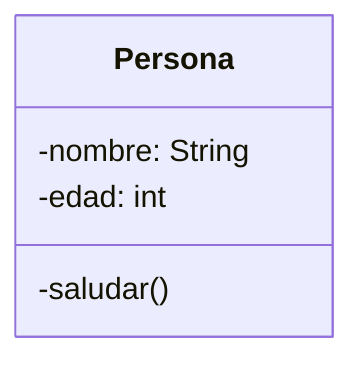
````

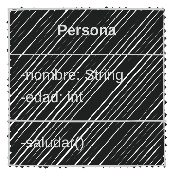

---

En Python, los atributos y métodos privados se definen con dos guiones bajos `__` antes del nombre

```python
class Persona:
    def __init__(self, nombre, edad):
        self.__nombre = nombre  # Atributo privado
        self.__edad = edad      # Atributo privado

    def __saludar(self):       # Método privado
        print(f"Hola, soy {self.__nombre} tengo {self.__edad} años")
```

Si se intenta acceder a un atributo o método privado desde fuera de la clase, se producirá un error

``` text
AttributeError: 'Persona' object has no attribute '__nombre'
```

---

#### Ejemplo 05

En la carpeta **sesion04** modifica los archivos **sistema.md** y **sistema.py**

```markdown
La batería del sistema operativo tendrá que ser privada,
sólo el sistema podrá cargar la batería, lo cambiamos
a un nivel privado, y que sólo se pueda ver el estado 
de la batería mediante un método.
```
---

El análisis se mantendrá igual, pero cambiaremos el diagrama

```markdown
# Análisis
Requisitos:
- Tiene un nombre
- Tiene un fondo de pantalla
- Cualquiera puede cambiar el fondo de pantalla
- Tiene un reloj
- Existe un método ver hora 
- Tiene una batería
- Existe un método estado_batería
- Existe un método cargador para cargar la batería
Objetos:
- SistemaOperativo
Características:
- SistemaOperativo:
    - nombre: String
    - fondo_pantalla: String
    - reloj: String
    - bateria: int
Acciones:
- SistemaOperativo:
    - cambiar_fondo_pantalla(imagen)
    - ver_hora()
    - estado_bateria()
    - cargador(cantidad)
```

---
Creando el diseño de diagrama de clases

````markdown [7]

````

---

Creando el diseño de diagrama de clases

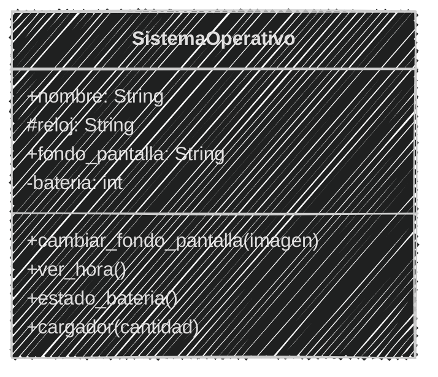
<!--.element class="center-mermaid"-->
---

```python [7|15-22|33-36]
# Definiendo la clase
class SistemaOperativo:
    def __init__(self, nombre, fondo_pantalla, reloj):
        self.nombre = nombre 
        self.fondo_pantalla = fondo_pantalla 
        self._reloj = reloj
        self.__bateria = 1  # Privado
    def cambiar_fondo_pantalla(self, nuevo_fondo):
        self.fondo_pantalla = nuevo_fondo
        print(f"Nuevo fondo: {self.fondo_pantalla}")
        return self.fondo_pantalla
    def ver_hora(self):
        print(f"La hora actual es: {self._reloj}")
        return self._reloj
    def estado_bateria(self):
        print(f"Estado de la batería: {self.__bateria}%")
        return self.__bateria
    def cargador(self, cantidad):
        print("🔌 Cargador conectado.")
        self.__bateria += cantidad
        print(f"Batería cargada a: {self.__bateria}%")
        print("🔌 Cargador desconectado.")
# Implementando la clase
so = SistemaOperativo("PyPhoneOS", "gatitos.jpg", "12:00 PM")
print(f"Fondo de pantalla: {so.fondo_pantalla}")
so.cambiar_fondo_pantalla("perritos.jpg")
so.fondo_pantalla = "paisajes.jpg"
print(f"Fondo de pantalla: {so.fondo_pantalla}")
so.ver_hora()
so.estado_bateria()
so.cargador(20)
so.estado_bateria()
try:
    print(f"Batería: {so.__bateria}")  # Error
except AttributeError as e:
    print(f"Error: {e}")
```

---

Ejecutando el script

```bash
python sistema.py
```


```text
Fondo de pantalla: gatitos.jpg
Nuevo fondo: perritos.jpg
Fondo de pantalla: paisajes.jpg
La hora actual es: 12:00 PM
Estado de la batería: 1%
🔌 Cargador conectado.
Batería cargada a: 21%
🔌 Cargador desconectado.
Estado de la batería: 21%
Error: 'SistemaOperativo' object has no attribute '__bateria'
```

---
#### Ejercicio para ti (06)

En la carpeta **sesion04** modifica los archivos **sistema.md** y **sistema.py**

```markdown
El Sistema Operativo tendrá un pin de desbloqueo,
Se tiene que almacenar el pin,
sólo el sistema podrá cambiar el pin de desbloqueo,
y no se puede ver sólo se puede cambiar por
defecto el pin será 0000
```

Obtener el *Análisis*

2 minutos 

<iframe src="https://time-stuff.com/embed.html" frameborder="0" scrolling="no" width="391" height="140"></iframe>

---

Creando el *análisis*

```markdown [11-13|22|29]
# Análisis
Requisitos:
- Tiene un nombre
- Tiene un fondo de pantalla
- Cualquiera puede cambiar el fondo de pantalla
- Tiene un reloj
- Existe un método ver hora 
- Tiene una batería
- Existe un método estado_batería
- Existe un método cargador para cargar la batería
- Tiene un pin de desbloqueo
- Sólo el sistema puede cambiar el pin de desbloqueo
- No se puede ver el pin de desbloqueo
Objetos:
- SistemaOperativo
Características:
- SistemaOperativo:
    - nombre: String
    - fondo_pantalla: String
    - reloj: String
    - bateria: int
    - pin: String
Acciones:
- SistemaOperativo:
    - cambiar_fondo_pantalla(imagen)
    - ver_hora()
    - estado_bateria()
    - cargador(cantidad)
    - cambiar_pin(nuevo_pin)
```

---

#### Ejercicio para ti (06)

Ahora obtenemos el diseño del *diagrama de clase*

2 minutos

<iframe src="https://time-stuff.com/embed.html" frameborder="0" scrolling="no" width="391" height="140"></iframe>

---

Creando el diseño de diagrama de clases

````markdown [8,13]
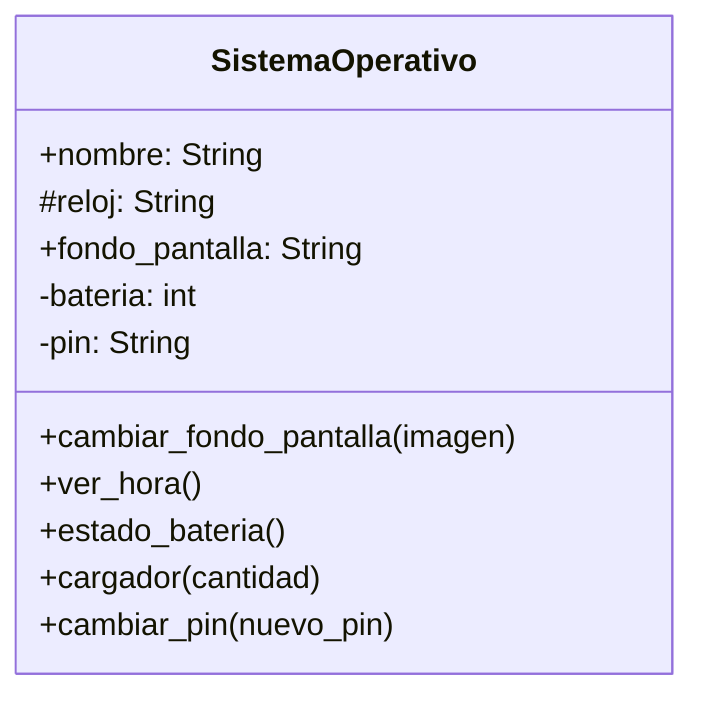
````

---

Creando el diseño de diagrama de clases

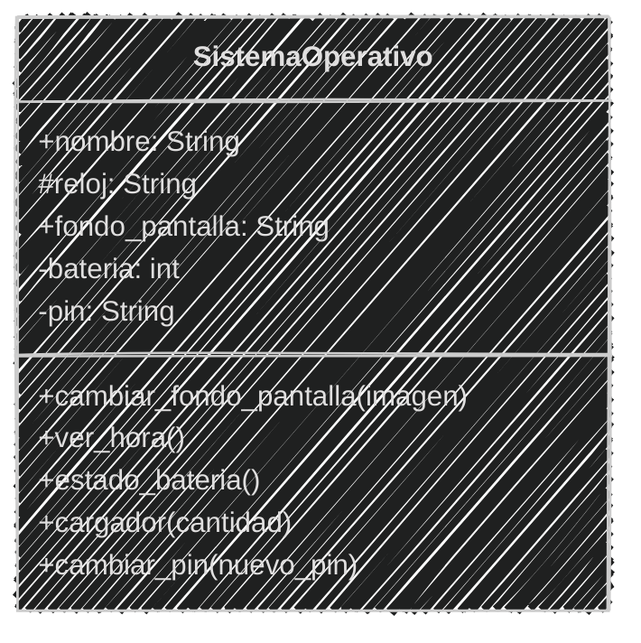
<!--.element class="center-mermaid"-->

---

#### Ejercicio para ti (06)

Ya tenemos el *análisis y diseño* de la clase

Ahora podemos **programar**

2 minutos

<iframe src="https://time-stuff.com/embed.html" frameborder="0" scrolling="no" width="391" height="140"></iframe>

---

```python [8|24-26|37]
# Definiendo la clase
class SistemaOperativo:
    def __init__(self, nombre, fondo_pantalla, reloj):
        self.nombre = nombre 
        self.fondo_pantalla = fondo_pantalla 
        self._reloj = reloj
        self.__bateria = 1  # Privado
        self.__pin = '0000'  # Privado
    def cambiar_fondo_pantalla(self, nuevo_fondo):
        self.fondo_pantalla = nuevo_fondo
        print(f"Nuevo fondo: {self.fondo_pantalla}")
        return self.fondo_pantalla
    def ver_hora(self):
        print(f"La hora actual es: {self._reloj}")
        return self._reloj
    def estado_bateria(self):
        print(f"Estado de la batería: {self.__bateria}%")
        return self.__bateria
    def cargador(self, cantidad):
        print("🔌 Cargador conectado.")
        self.__bateria += cantidad
        print(f"Batería cargada a: {self.__bateria}%")
        print("🔌 Cargador desconectado.")
    def cambiar_pin(self, nuevo_pin):
        self.__pin = nuevo_pin
        print("Pin cambiado exitosamente.")
# Implementando la clase
so = SistemaOperativo("PyPhoneOS", "gatitos.jpg", "12:00 PM")
print(f"Fondo de pantalla: {so.fondo_pantalla}")
so.cambiar_fondo_pantalla("perritos.jpg")
so.fondo_pantalla = "paisajes.jpg"
print(f"Fondo de pantalla: {so.fondo_pantalla}")
so.ver_hora()
so.estado_bateria()
so.cargador(20)
so.estado_bateria()
so.cambiar_pin('5678') 
try:
    print(f"Batería: {so.__bateria}")  # Error
except AttributeError as e:
    print(f"Error: {e}")
```

---

Ejecutando el script

```bash
python sistema.py
```

```text
Fondo de pantalla: gatitos.jpg
Nuevo fondo: perritos.jpg
Fondo de pantalla: paisajes.jpg
La hora actual es: 12:00 PM
Estado de la batería: 1%
🔌 Cargador conectado.
Batería cargada a: 21%
🔌 Cargador desconectado.
Estado de la batería: 21%
Pin cambiado exitosamente.
Error: 'SistemaOperativo' object has no attribute '__bateria'
```

---

#### Getters y Setters

Son métodos que permiten acceder y modificar los atributos privados de una clase

Los getters permiten **obtener el valor** de un atributo privado

Los setters permiten **modificar el valor** de un atributo privado de manera controlada

---

Getters viene del inglés 

- "get" (obtener)
- "set" (establecer)

El **getter** devuelve el valor del atributo privado

El **setter** recibe un valor y lo asigna al atributo privado

---

Podemos definir un getter y un setter con la palabra get y set respectivamente.

```python
class Persona:
    def __init__(self, nombre):
        self.__nombre = nombre  # Atributo privado

    def get_nombre(self):  # Getter
        return self.__nombre

    def set_nombre(self, nuevo_nombre):  # Setter
        self.__nombre = nuevo_nombre
```
---

#### Ejemplo 06

```markdown
Un edificio necesita un sistema de control de acceso,
existe un pin de desbloqueo privado,
cualquier persona puede ver el pin de desbloqueo 
cualquier persona puede cambiar el pin
el pin de desbloqueo debe ser máximo 4 dígitos
el pin inicial será 1234
```

Crea los archivos **edificio.md** y **edificio.py** en la carpeta **sesion04**

---

Realizando el análisis

```markdown 
# Análisis
Requisitos:
- Un edificio necesita un sistema de control de acceso
- Existe un pin de desbloqueo privado
- Se puede ver el pin de desbloqueo mediante método público
- Se puede cambiar el pin de desbloqueo mediante método público
- El pin de desbloqueo debe ser máximo 4 dígitos
- El pin inicial será 1234
Objetos:
- Edificio
Características:
- Edificio:
    - pin: String
Acciones:
- Edificio:
    - get_pin()
    - set_pin(nuevo_pin)
```

---
Creando el diseño de diagrama de clases

````markdown
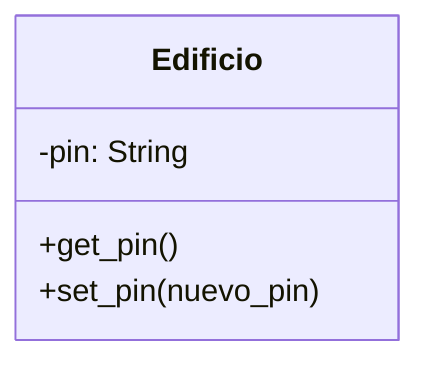
````

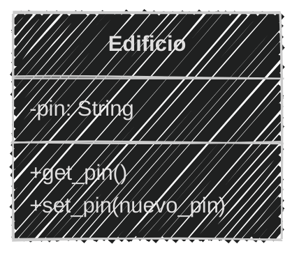

---

Implementando en Python

```python [1-12|13-18]
# Definiendo la clase
class Edificio:
    def __init__(self):
        self.__pin = '1234'  # Privado
    def get_pin(self):  # Getter público
        return self.__pin
    def set_pin(self, nuevo_pin):  # Setter público
        if len(str(nuevo_pin)) == 4:
            self.__pin = nuevo_pin
            print("Pin cambiado exitosamente.")
        else:
            print("El pin debe ser número de 4 dígitos.")
# Implementando la clase
edificio = Edificio()
print(f"Pin actual: {edificio.get_pin()}")
edificio.set_pin('56789')  # Error
edificio.set_pin('5678')   # Correcto
print(f"Pin actualizado: {edificio.get_pin()}")
```


```text
Pin actual: 1234
El pin debe ser un número de 4 dígitos.
Pin cambiado exitosamente.
Pin actualizado: 5678
```

---

#### Ejercicio para ti (07)

```markdown
El edificio tendrá un número telefónico,
cualquiera puede ver el número telefónico
cualquiera puede cambiar el número telefónico
el número telefónico inicial será 123-456-7890
```

Obtener el *Análisis*

2 minutos

<iframe src="https://time-stuff.com/embed.html" frameborder="0" scrolling="no" width="391" height="140"></iframe>

---

Creando el *análisis*

```markdown [9-11,17,22-23]
# Análisis
Requisitos:
- Un edificio necesita un sistema de control de acceso
- Existe un pin de desbloqueo privado
- Se puede ver el pin de desbloqueo mediante método público
- Se puede cambiar el pin de desbloqueo mediante método público
- El pin de desbloqueo debe ser máximo 4 dígitos
- El pin inicial será 1234
- El edificio tendrá un número telefónico
- Cualquiera puede ver el número telefónico 
- Cualquiera puede cambiar el número telefónico
Objetos:
- Edificio
Características:
- Edificio:
    - pin: String
    - telefono: String
Acciones:
- Edificio:
    - get_pin()
    - set_pin(nuevo_pin)
    - get_telefono()
    - set_telefono(nuevo_telefono)
```

---

#### Ejercicio para ti (07)

Ahora obtenemos el diseño del *diagrama de clase*

2 minutos

<iframe src="https://time-stuff.com/embed.html" frameborder="0" scrolling="no" width="391" height="140"></iframe>

---

Creando el diseño de diagrama de clases

````markdown [5,8-9]
```mermaid
classDiagram
    class Edificio {
        -pin: String
        -telefono: String
        +get_pin()
        +set_pin(nuevo_pin)
        +get_telefono()
        +set_telefono(nuevo_telefono)
    }
```
````

---

Creando el diseño de diagrama de clases

```mermaid
%%{init: {"theme": "dark", "look": "handDrawn" }}%%
classDiagram
    class Edificio {
        -pin: String
        -telefono: String
        +get_pin()
        +set_pin(nuevo_pin)
        +get_telefono()
        +set_telefono(nuevo_telefono)
    }
```
<!--.element class="center-mermaid"-->

---

#### Ejercicio para ti (07)

Ya tenemos el *análisis y diseño* de la clase

Ahora podemos **programar**

2 minutos

<iframe src="https://time-stuff.com/embed.html" frameborder="0" scrolling="no" width="391" height="140"></iframe>

---

Implementando en Python

```python [5|14-18|25-27]
# Definiendo la clase
class Edificio:
    def __init__(self):
        self.__pin = '1234' 
        self.__telefono = "123-456-7890" 
    def get_pin(self):  
        return self.__pin
    def set_pin(self, nuevo_pin): 
        if len(str(nuevo_pin)) == 4:
            self.__pin = nuevo_pin
            print("Pin cambiado exitosamente.")
        else:
            print("El pin debe ser número de 4 dígitos.")
    def get_telefono(self):
        return self.__telefono
    def set_telefono(self, nuevo_telefono):
        self.__telefono = nuevo_telefono
        print("Número telefónico cambiado exitosamente.")
# Implementando la clase
edificio = Edificio()
print(f"Pin actual: {edificio.get_pin()}")
edificio.set_pin('56789')  # Error
edificio.set_pin('5678')   # Correcto
print(f"Pin actualizado: {edificio.get_pin()}")
print(f"# telefónico actual: {edificio.get_telefono()}")
edificio.set_telefono("098-765-4321")
print(f"# telefónico actualizado: {edificio.get_telefono()}")
```

---
Ejecutando el script

```bash	
python edificio.py
```

```text
Pin actual: 1234
El pin debe ser número de 4 dígitos.
Pin cambiado exitosamente.
Pin actualizado: 5678
# telefónico actual: 123-456-7890
Número telefónico cambiado exitosamente.
# telefónico actualizado: 098-765-4321
```

---

Definir los getters y setters es una buena práctica para mantener la **encapsulación**

Existe en Python una forma de definir getters y setters de manera más elegante y limpia

Mediante las **propiedades**

---

#### Propiedades en Python

Las propiedades en Python permiten definir *métodos* que se comportan como **atributos**

Permiten acceder a los atributos privados de una clase de manera controlada

Se definen utilizando el decorador `@property` para el getter y `@nombre.setter` para el setter

---

Se definen sobre los métodos de la instancia y se accede a ellos como si fueran atributos

---

El decorador `@property` debe ir en la parte superior del método getter

El nombre del método getter es el nombre del atributo que se quiere acceder

```python
@property
def nombre(self):  # Getter
    return self.__nombre
```

---

El decorador `@<nombre>.setter` debe ir en la parte superior del método setter

Después del `@` se coloca el nombre del atributo que se quiere modificar

seguido del `.setter`

```python
@nombre.setter
def nombre(self, nuevo_nombre):  # Setter
    self.__nombre = nuevo_nombre
```

---

Podemos definir una propiedad en Python

```python
class Persona:
    def __init__(self, nombre):
        self.__nombre = nombre  # Atributo privado
    @property
    def nombre(self):  # Getter
        return self.__nombre
    @nombre.setter
    def nombre(self, nuevo_nombre):  # Setter
        self.__nombre = nuevo_nombre
# Uso
persona = Persona("Juan")
print(persona.nombre)  # Acceso al getter
persona.nombre = "Pedro"  # Acceso al setter
```

---

#### Ejemplo 08

```markdown
Del edificio vamos a cambiar el getter y setter
del pin por una propiedad para que se pueda acceder
como si fuera un atributo y no como métodos
```

En la carpeta **sesion04** modifica los archivos **edificio.md** y **edificio.py**

---
El análisis se mantendrá igual ya que no depende del uso de getters o setters

```markdown [16,20-21]
# Análisis
Requisitos:
- Un edificio necesita un sistema de control de acceso
- Existe un pin de desbloqueo privado
- Se puede ver el pin de desbloqueo mediante método público
- Se puede cambiar el pin de desbloqueo mediante método público
- El pin de desbloqueo debe ser máximo 4 dígitos
- El pin inicial será 1234
- El edificio tendrá un número telefónico
- Cualquiera puede ver el número telefónico 
- Cualquiera puede cambiar el número telefónico
Objetos:
- Edificio
Características:
- Edificio:
    - pin: String
    - telefono: String
Acciones:
- Edificio:
    - get_pin()
    - set_pin(nuevo_pin)
    - get_telefono()
    - set_telefono(nuevo_telefono)
```

---

El diseño del diagrama de clases se mantendrá igual, no depende del lenguaje de programación

````markdown [4,6-7]
```mermaid
classDiagram
    class Edificio {
        -pin: String
        -telefono: String
        +get_pin()
        +set_pin(nuevo_pin)
        +get_telefono()
        +set_telefono(nuevo_telefono)
    }
```
````

---

El diseño del diagrama de clases se mantendrá igual, no depende del lenguaje de programación

```mermaid
%%{init: {"theme": "dark", "look": "handDrawn" }}%%
classDiagram
    class Edificio {
        -pin: String
        -telefono: String
        +get_pin()
        +set_pin(nuevo_pin)
        +get_telefono()
        +set_telefono(nuevo_telefono)
    }
```

---

Cambiando el getter y setter del pin por una propiedad

```python [6-15|23-26]
# Definiendo la clase
class Edificio:
    def __init__(self):
        self.__pin = '1234' 
        self.__telefono = "123-456-7890" 
    @property
    def pin(self):  
        return self.__pin
    @pin.setter
    def pin(self, nuevo_pin): 
        if len(str(nuevo_pin)) == 4:
            self.__pin = nuevo_pin
            print("Pin cambiado exitosamente.")
        else:
            print("El pin debe ser número de 4 dígitos.")
    def get_telefono(self):
        return self.__telefono
    def set_telefono(self, nuevo_telefono):
        self.__telefono = nuevo_telefono
        print("Número telefónico cambiado exitosamente.")
# Implementando la clase
edificio = Edificio()
print(f"Pin actual: {edificio.pin}")
edificio.pin = '56789'  # Error
edificio.pin = '5678'   # Correcto
print(f"Pin actualizado: {edificio.pin}")
print(f"# telefónico actual: {edificio.get_telefono()}")
edificio.set_telefono("098-765-4321")
print(f"# telefónico actualizado: {edificio.get_telefono()}")
```

---

Ejecutando el script

```bash
python edificio.py
```

```text
Pin actual: 1234
El pin debe ser número de 4 dígitos.
Pin cambiado exitosamente.
Pin actualizado: 5678
# telefónico actual: 123-456-7890
Número telefónico cambiado exitosamente.
# telefónico actualizado: 098-765-4321
```

---
Diferencia Getters 

```python
def get_pin(self):  # Getter público
    return self.__pin
# objeto.get_pin()
```

```python
@property
def pin(self):  # Getter público como propiedad
    return self.__pin
# objeto.pin
```

---

Diferencia Setters

```python
def set_pin(self, nuevo_pin):  # Setter público
    if len(str(nuevo_pin)) == 4:
        self.__pin = nuevo_pin
        print("Pin cambiado exitosamente.")
    else:
        print("El pin debe ser un número de 4 dígitos.")
# objeto.set_pin('5678')
```

```python
@pin.setter
def pin(self, nuevo_pin):  # Setter público como propiedad
    if len(str(nuevo_pin)) == 4:
        self.__pin = nuevo_pin
        print("Pin cambiado exitosamente.")
    else:
        print("El pin debe ser número de 4 dígitos.")
# objeto.pin = '5678'
```

---

#### Ejercicio para ti (09)

```markdown
Del edificio el número telefónico lo vamos a cambiar
por una propiedad para que se pueda acceder
como si fuera un atributo y no como métodos
```

Ya tenemos el *análisis y diseño* de la clase se mantiene igual

Ahora podemos **programar**

2 minutos

<iframe src="https://time-stuff.com/embed.html" frameborder="0" scrolling="no" width="391" height="140"></iframe>


---

```python [16-22|29-31]
# Definiendo la clase
class Edificio:
    def __init__(self):
        self.__pin = 1234 
        self.__telefono = "123-456-7890" 
    @property
    def pin(self):  
        return self.__pin
    @pin.setter
    def pin(self, nuevo_pin): 
        if len(str(nuevo_pin)) == 4:
            self.__pin = nuevo_pin
            print("Pin cambiado exitosamente.")
        else:
            print("El pin debe ser número de 4 dígitos.")
    @property
    def telefono(self):
        return self.__telefono
    @telefono.setter
    def telefono(self, nuevo_telefono):
        self.__telefono = nuevo_telefono
        print("Número telefónico cambiado exitosamente.")
# Implementando la clase
edificio = Edificio()
print(f"Pin actual: {edificio.pin}")
edificio.pin = '56789'  # Error
edificio.pin = '5678'   # Correcto
print(f"Pin actualizado: {edificio.pin}")
print(f"# telefónico actual: {edificio.telefono}")
edificio.telefono = "098-765-4321"
print(f"# telefónico actualizado: {edificio.telefono}")
```

---

Ejecutando el script

```bash
python edificio.py
```

```text
Pin actual: 1234
El pin debe ser número de 4 dígitos.
Pin cambiado exitosamente.
Pin actualizado: 5678
# telefónico actual: 123-456-7890
Número telefónico cambiado exitosamente.
# telefónico actualizado: 098-765-4321
```

---

Subimos los avances de la sesión al repositorio en **GitHub**

```bash
git add .
git commit -m "Sesión 04"
git push origin main
```

---

#### Resumen

- El encapsulamiento es un principio de la programación orientada a objetos que restringe el acceso directo a los datos y métodos de una clase para proteger su integridad y ocultar su implementación interna.
- Es importante porque protege los datos, permite la abstracción y controla el acceso a los atributos y métodos.

---

- Existen tres niveles de acceso: público (accesible desde cualquier parte), protegido (accesible solo desde la clase y sus subclases) y privado (accesible solo desde la propia clase).
- Los diagramas de clases usan símbolos para representar los niveles de acceso: + para público, # para protegido y - para privado.

---

- En Python, los niveles de acceso se indican por convención usando guiones bajos: sin guión para público, un guión bajo para protegido y dos guiones bajos para privado.
- Los getters y setters son métodos que permiten obtener y modificar atributos privados de manera controlada, y pueden incluir validaciones.

---

- Es buena práctica usar encapsulamiento, definir getters y setters para atributos privados y seguir las convenciones de Python para indicar el nivel de acceso.
- En Python, se pueden definir getters y setters de forma tradicional o usando propiedades con los decoradores `@property` y `@<nombre>.setter`.

---

- Las propiedades permiten acceder a métodos como si fueran atributos, haciendo el código más limpio y fácil de usar.
- La diferencia entre métodos tradicionales y propiedades es la forma de acceso: los métodos tradicionales usan llamadas explícitas y las propiedades permiten acceder como si fueran atributos.

---

- El uso de propiedades y encapsulamiento ayuda a mantener la integridad de los datos y facilita el mantenimiento del código.

---
#### Retos

Crear una carpeta con el nombre "retos_sesion_04" dentro del proyecto en la raíz, en la cual por cada ejercicio debes crear los siguientes archivos:

```bash
# Estructura de carpetas
psg-oop-2025/
    sesion04/
    retos_sesion_04/
        ejercicio_01.md
        ejercicio_01.py
        ejercicio_02.md
        ejercicio_02.py
```

---

1. Un banco necesita desarrollar un módulo para gestionar cuentas bancarias. Cada cuenta tiene las siguientes caracteristicas:
- `saldo`: Es un dato privado. Solo puede consultar. Se puede modificar únicamente a través de `deposito` y `retiro`
- `deposito`: Permite ingresar dinero, incrementando el saldo.
- `retiro`: Permite retirar dinero, siempre y cuando el saldo disponible sea suficiente.

*(1/3)*

---

- `número de cuenta`: Es privado. Puede consultarse, pero no puede modificarse una vez asignado.
- `nombre del titular`: Es público. Puede consultarse y modificarse libremente.

*(2/3)*

---
- Realiza el análisis y diagrama de clases de la clase `Cuenta` en el archivo `ejercicio_01.md`.
- Escribe el codigo en Python para la clase `Cuenta` en el archivo `ejercicio_01.py`.
- Implementa encapsulamiento para proteger los atributos sensibles
- Utiliza *getters* y *setters* para controlar el acceso y la modificación de los atributos.
- Propiedades para ofrecer una interfaz clara y segura al usuario del sistema.


*(3/3)*

---
2. Un médico necesita simular el comportamiento de una célula. Cada célula debe cumplir con las siguientes características:
- `ADN`: Se puede consultar pero no puede cambiar.
- `tipo de célula`: Puede consultarse y modificarse libremente.
- `energía`: Es un dato privado. Puede aumentar o disminuir, únicamente mediante las acciones de comer o dividirse.

*(1/2)*

---
- Realiza el análisis y el diagrama de clases de la clase `Celula` en el archivo `ejercicio_02.md`.
- Escribe el código en Python para la clase `Celula` en el archivo `ejercicio_02.py`.
- Implementa encapsulamiento para proteger los atributos sensibles.
- Utiliza *getters* y *setters* para controlar el acceso y la modificación de los atributos.
- Aplica propiedades para ofrecer una interfaz clara y segura al usuario del sistema.

*(2/2)*

---
<!-- .slide: data-background-image="../../content/psg-bg-dark.png" data-background-size="100%"-->

<br>
<br>
<br>
<br>
<br>

[ <!-- .element width="20%"-->](https://github.com/python-la-paz/python-study-group-oop/tree/main/content/sesion04)

Repositorio de la Sesión

---
<!--.slide: data-visibility="hidden"-->
## Bibliografía y Referencias

- [La importancia del encapsulamiento en la POO](https://elblogpython.com/tecnologia/la-importancia-del-encapsulamiento-en-la-poo/)
- [Method names and instance variables](https://peps.python.org/pep-0008/#method-names-and-instance-variables)
- [Python Double Underscore](https://realpython.com/python-double-underscore/)
- [Descriptive naming styles](https://peps.python.org/pep-0008/#descriptive-naming-styles)
- [Getters y Setters en programación](https://www.luisllamas.es/que-son-getters-y-setters-en-programacion/)
- [Getters y Setters](https://codigonautas.com/que-son-getters-setters/)
- [Python Property](https://realpython.com/python-property/)
- [Python Property Function](https://docs.python.org/3/library/functions.html#property)
- [Object Oriented Analysis](https://www.gyata.ai/es/object-oriented-programming/object-oriented-analysis)
- [DDOO Unidad 1](https://dmd.unadmexico.mx/contenidos/DCEIT/BLOQUE1/DS/02/DDOO/U1/descargables/DDOO_Unidad_1.pdf)
- [Programación procedural VS orientada a objetos](https://programacionpro.com/programacion-procedural-vs-orientada-a-objetos-diferencias-y-similitudes/)
- [Python OOP](https://www.learnpython.org/en/Classes_and_Objects)
- [Atributos de clase](https://oregoom.com/python/atributos-clase/)
- [Diagrama de clases](https://diagramasuml.com/diagrama-de-clases/)
- [Guía PEP 8](https://peps.python.org/pep-0008/#class-names)
- [Mermaid Charts](https://www.mermaidchart.com/play)
- [Draw.io](https://app.diagrams.net/)
- [Python 3 Object-oriented Programming, Second Edition, Dusty PhillipsDusty Phillips](https://github.com/PacktPublishing/Python-3-Object-Oriented-Programming-Second-Edition)
- [Objetos en programación](https://ebac.mx/blog/objeto-en-programacion)
- [Enfoque orientado a objetos](https://1library.co/article/enfoque-orientado-a-objetos-base-te%C3%B3rica.qvld461y)
- [OOAD](https://www.tutorialspoint.com/object_oriented_analysis_design/ooad_object_oriented_analysis.htm)
