<!-- .slide: data-background-image="../../content/psg-bg-dark.png" data-background-size="100%"-->
 <!-- .element  hidden="true" -->

<br>
<br>
<br>

### Sesión  05
#### Herencia y Composición
#### Relaciones y reutilización de objetos


---

#### VS Code

Abrimos el proyecto del Study Group

```bash
code psg-oop-2025
```

Creamos una carpeta llamada `sesion05` dentro del proyecto

```bash
mkdir sesion05
cd sesion05
```

Aquí guardaremos los ejemplos de la sesión

---

#### Herencia

¿Qué es la herencia?

---

La herencia es la transmisión de las características de los progenitores a sus descendientes

# 👨‍👦 👩‍👧

---

La herencia es un concepto fundamental en la programación orientada a objetos

Permite crear nuevas clases basadas en clases existentes, heredando sus atributos y métodos

---

#### Beneficios de la herencia

- **Reutilización de código**: Al heredar atributos y métodos de una clase base, se evita la duplicación de código y se promueve la reutilización.

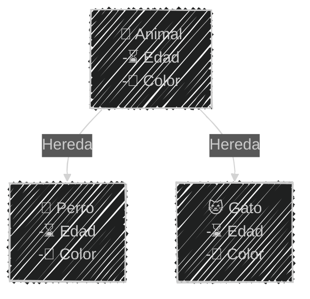

---

#### Beneficios de la herencia
- **Jerarquía de clases**: Permite organizar las clases en una jerarquía, facilitando la comprensión y el mantenimiento del código.

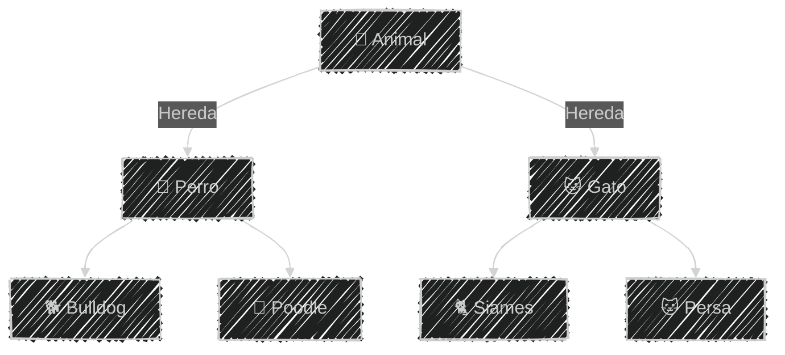

---

#### Beneficios de la herencia
- **Mantenibilidad**: Al modificar la clase base, los cambios se propagan automáticamente a las clases derivadas, lo que facilita el mantenimiento del código.

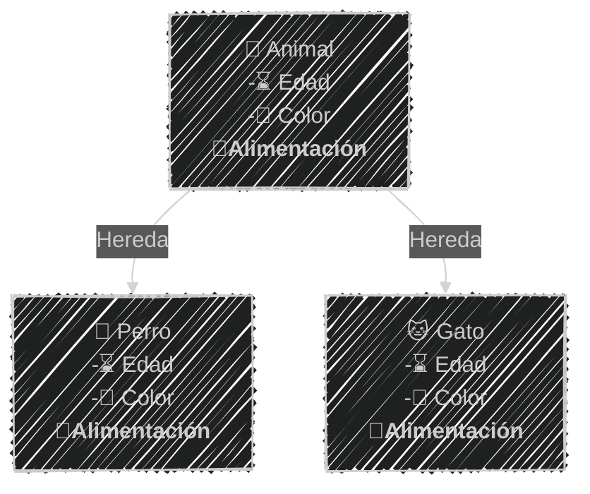

---
#### Herencia y niveles de acceso

- **Público**: Los atributos y métodos se heredan, y son accesibles desde fuera de las clases
- **Protegido**: Los atributos y métodos se heredan, pero no son accesibles directamente desde fuera de las clases
- **Privado**: Los atributos y métodos no se heredan, y no son accesibles desde fuera de las clases

---

Para acceder a los atributos privados o protegidos se recomienda utilizar métodos de acceso (getters y setters)

---

#### Diagrama de clases

La herencia se representa en un diagrama de clases con una flecha `➡` que apunta desde la clase hija hacia la clase padre

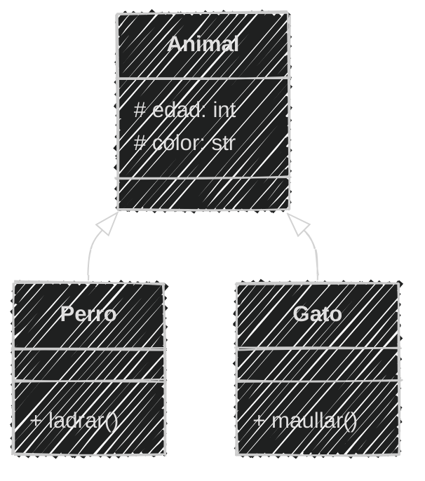

---

En mermaid, la herencia se representa con la sintaxis

`Animal <|-- Perro`

donde `Animal` es clase padre y `Perro` es clase hija

````
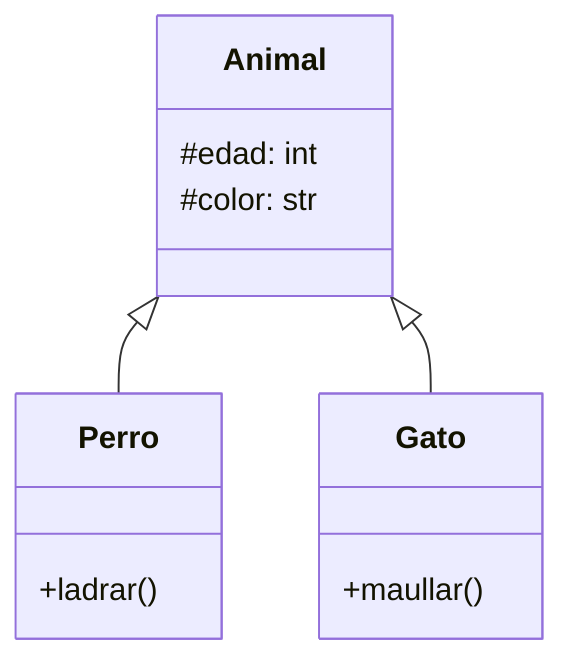
````

---

#### Herencia en Python

La herencia se implementa utilizando paréntesis para indicar cual es la clase padre

```python
class Animal:
    def __init__(self, edad, color):
        self.edad = edad
        self.color = color

class Perro(Animal): # Hereda de Animal
    def ladrar(self):
        print("¡Guau!")

class Gato(Animal): # Hereda de Animal
    def maullar(self):
        print("¡Miau!")
```

---

Los atributos de Animal se heredan en Perro y Gato

```python [1-11|13-23]
# Definición
class Animal:
    def __init__(self, edad, color):
        self.edad = edad
        self.color = color
class Perro(Animal): # Hereda de Animal
    def ladrar(self):
        print("¡Guau!")
class Gato(Animal): # Hereda de Animal
    def maullar(self):
        print("¡Miau!")

# Uso
fido = Perro(5, "marrón")
print(fido.edad)  # Heredado
print(fido.color)  # Heredado
fido.ladrar() # Método de la clase Perro

michi = Gato(3, "blanco")
print(michi.edad)  # Heredado
print(michi.color)  # Heredado
michi.maullar() # Método de la clase Gato
```

```
5
marrón
¡Guau!
3
blanco
¡Miau!
```

---

#### Ejemplo 01

Crea los archivos **herencia.md** y **herencia.py** en la carpeta **sesion05**

```markdown
Un zoológico tiene un catálogo de especies mamíferos y aves
Todos los animales tienen una especie
Los mamíferos son terrestres o acuáticos 
y pueden amamantar a sus crías
Las aves ponen huevos y no todas pueden volar
```

---

Análisis

```markdown [1-25|4,12,15]
# Análisis
Requisitos:
- Generar especies mamíferos y aves
- Almacenar información de especie
- Los mamíferos son terrestres o acuáticos
- Las aves pueden volar o no
Objetos:
- Mamífero
- Ave
Características:
- Mamífero:
  - especie: String
  - tipo: String (terrestre, acuático)
- Ave:
  - especie: String
  - volar: bool
Acciones:
- Mamífero:
  - amamantar()
- Ave:
  - ovoponer()
```

---
Análisis mejorado sin repetición

```markdown [1-26|8,12-13,19-20|9-10,14-17,21-24]
# Análisis Mejorado
Requisitos:
- Generar especies mamíferos y aves
- Almacenar información de especie
- Los mamíferos son terrestres o acuáticos
- Las aves pueden volar o no
Objetos:
- Animal (clase padre)
- Mamífero (hereda de Animal)
- Ave (hereda de Animal)
Características:
- Animal:
  - especie: String
- Mamífero:
  - tipo: String (terrestre, acuático)
- Ave:
  - volar: bool
Acciones:
- Animal:
  - (sin acciones)
- Mamífero:
  - amamantar()
- Ave:
  - ovoponer()
```

---

Diseño Mermaid

````
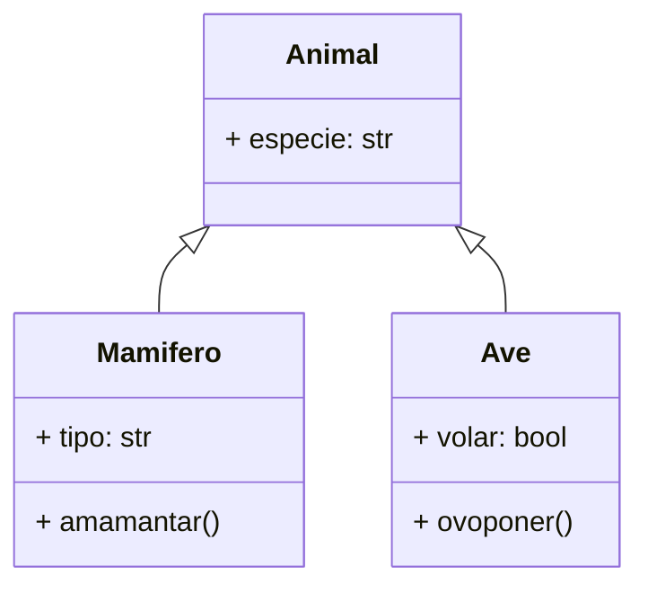
````

---

Diseño Diagrama

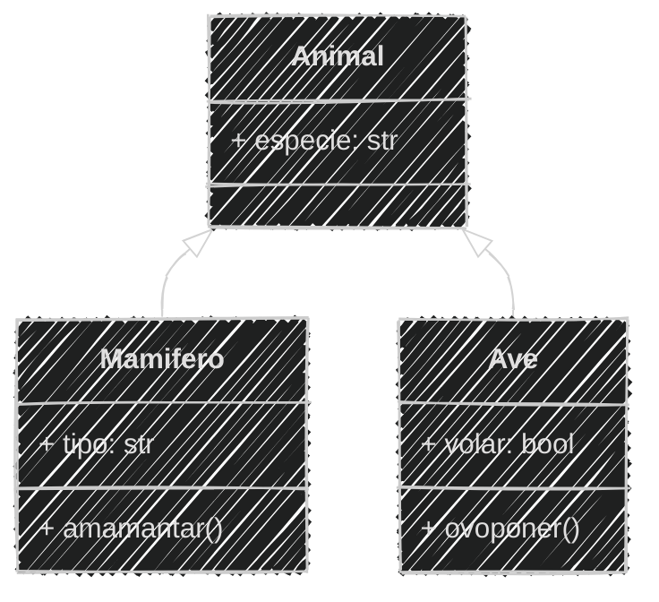

---

Script en python herencia.py

```python [2-4|5-7|8-10|12-15|16-19]
# Definición
class Animal:
    def __init__(self, especie):
        self.especie = especie
class Mamifero(Animal):
    def amamantar(self):
        print(f"{self.especie} amamanta 🍼 a sus crías")
class Ave(Animal):
    def ovoponer(self):
        print(f"{self.especie} pone huevos 🥚")
# Uso
caballo = Mamifero("Caballo")
caballo.tipo = "Terrestre"
print(f"Especie: {caballo.especie} - Tipo: {caballo.tipo}")
caballo.amamantar()
paloma = Ave("Paloma")
paloma.volar = True
print(f"Especie: {paloma.especie} - Puede volar: {paloma.volar}")
paloma.ovoponer()
```

```bash
python herencia.py
```

```text
Especie: Caballo - Tipo: Terrestre
Caballo amamanta 🍼 a sus crías
Especie: Paloma - Puede volar: True
Paloma pone huevos 🥚
```

---

#### Ejemplo 02

Adicionar al ejemplo `herencia.md` y `herencia.py`

```markdown
Adicionar al catálogo del zoológico reptiles
los reptiles pueden ser terrestres o acuáticos
puede ser venenosos o no
```

4 Minutos

<iframe src="https://time-stuff.com/embed.html" frameborder="0" scrolling="no" width="391" height="140"></iframe>

---

Análisis

```markdown [7,8,21-23,31-32]
# Análisis Mejorado
Requisitos:
- Generar especies mamíferos y aves
- Almacenar información de especie
- Los mamíferos son terrestres o acuáticos
- Las aves pueden volar o no
- Los reptiles pueden ser terrestres o acuáticos
- Los reptiles pueden ser venenosos o no
Objetos:
- Animal (clase padre)
- Mamífero (hereda de Animal)
- Ave (hereda de Animal)
- Reptil (hereda de Animal)
Características:
- Animal:
  - especie: String
- Mamífero:
  - tipo: String (terrestre, acuático)
- Ave:
  - volar: bool
- Reptil:
  - tipo: String (terrestre, acuático)
  - venenoso: bool
Acciones:
- Animal:
  - (sin acciones)
- Mamífero:
  - amamantar()
- Ave:
  - ovoponer()
- Reptil:
  - reptar()
```

---
Diseño Mermaid

```` [14-18,21]
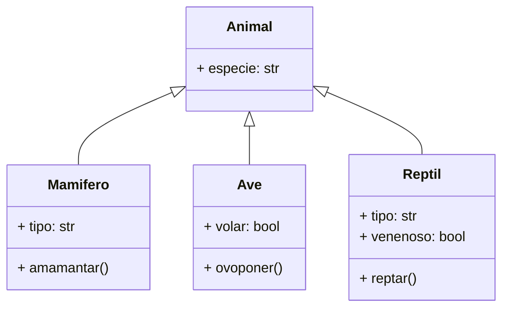
````
---

Diagrama
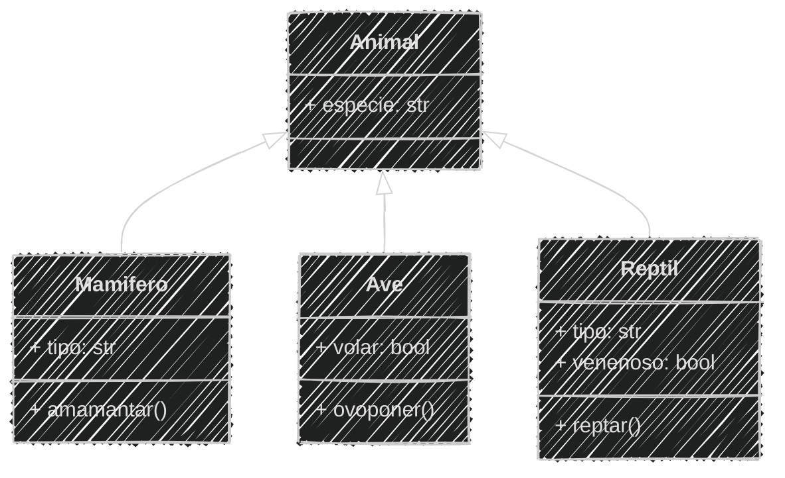


---

Script en python herencia.py

```python [11-13|23-27]
# Definición
class Animal:
    def __init__(self, especie):
        self.especie = especie
class Mamifero(Animal):
    def amamantar(self):
        print(f"{self.especie} amamanta 🍼 a sus crías")
class Ave(Animal):
    def ovoponer(self):
        print(f"{self.especie} pone huevos 🥚")
class Reptil(Animal):
    def reptar(self):
        print(f"{self.especie} se arrastra 🐍")
# Uso
caballo = Mamifero("Caballo")
caballo.tipo = "Terrestre"
print(f"Especie: {caballo.especie} - Tipo: {caballo.tipo}")
caballo.amamantar()
paloma = Ave("Paloma")
paloma.volar = True
print(f"Especie: {paloma.especie} - Puede volar: {paloma.volar}")
paloma.ovoponer()
cocodrilo = Reptil("Cocodrilo")
cocodrilo.tipo = "Acuático"
cocodrilo.venenoso = False
print(f"Especie: {cocodrilo.especie} - Tipo: {cocodrilo.tipo} - Venenoso: {cocodrilo.venenoso}")
cocodrilo.reptar()
```

```text
Especie: Caballo - Tipo: Terrestre
Caballo amamanta 🍼 a sus crías
Especie: Paloma - Puede volar: True
Paloma pone huevos 🥚
Especie: Cocodrilo - Tipo: Acuático - Venenoso: False
Cocodrilo se arrastra 🐍
```


---

#### Constructores y herencia

Las clases hijas heredan los atributos y métodos de la clase padre

Pero pueden tener sus propios métodos y atributos

Y también tener su propio constructor

---

Cuando definimos un constructor en una clase hija, debemos llamar al constructor de la clase padre utilizando `super()`

---

#### super()

`super()` es una método que permite acceder a los métodos y atributos de la clase padre desde la clase hija

Es propio de Python 

Podemos utilizarlo para llamar al constructor de la clase padre

---

Constructor con super()

```python [2-4|6-9|15-17]
# Definición
class Animal:
    def __init__(self, especie):
        self.especie = especie

class Mamifero(Animal):
    def __init__(self, especie, tipo):
        super().__init__(especie) # Constructor Padre
        self.tipo = tipo

    def amamantar(self):
        print(f"{self.especie} amamanta 🍼 a sus crías")

# Uso
caballo = Mamifero("Caballo", "Terrestre")
print(f"Especie: {caballo.especie} - Tipo: {caballo.tipo}")
caballo.amamantar()
```

```bash
python herencia.py
```

```text
Especie: Caballo - Tipo: Terrestre
Caballo amamanta 🍼 a sus crías
```
---

#### Ejemplo 03
En el ejemplo `herencia.py`

```markdown
Añadir constructor con super() a la clase Ave y Reptil
```

3 Minutos

<iframe src="https://time-stuff.com/embed.html" frameborder="0" scrolling="no" width="391" height="140"></iframe>

El análisis y diseño es el mismo

---

```python [13-15|20-23|27,30,33]
# Definición
class Animal:
    def __init__(self, especie):
        self.especie = especie
class Mamifero(Animal):
    def __init__(self, especie, tipo):
        super().__init__(especie) # Constructor Padre
        self.tipo = tipo
    def amamantar(self):
        print(f"{self.especie} amamanta 🍼 a sus crías")

class Ave(Animal):
    def __init__(self, especie, volar):
        super().__init__(especie) # Constructor Padre
        self.volar = volar
    def ovoponer(self):
        print(f"{self.especie} pone huevos 🥚")

class Reptil(Animal):
    def __init__(self, especie, tipo, venenoso):
        super().__init__(especie) # Constructor Padre
        self.tipo = tipo
        self.venenoso = venenoso
    def reptar(self):
        print(f"{self.especie} se arrastra 🐍")
# Uso
caballo = Mamifero("Caballo", "Terrestre")
print(f"Especie: {caballo.especie} - Tipo: {caballo.tipo}")
caballo.amamantar()
paloma = Ave("Paloma", True)
print(f"Especie: {paloma.especie} - Puede volar: {paloma.volar}")
paloma.ovoponer()
cocodrilo = Reptil("Cocodrilo", "Acuático", False)
print(f"Especie: {cocodrilo.especie} - Tipo: {cocodrilo.tipo} - Venenoso: {cocodrilo.venenoso}")
cocodrilo.reptar()
```

```text
Especie: Caballo - Tipo: Terrestre
Caballo amamanta 🍼 a sus crías
Especie: Paloma - Puede volar: True
Paloma pone huevos 🥚
Especie: Cocodrilo - Tipo: Acuático - Venenoso: False
Cocodrilo se arrastra 🐍
```

---

#### Personalización de métodos

Podemos personalizar los métodos de la clase padre en la clase hija

Redefiniendo los métodos de la clase padre en la clase hija

---

Añadir al ejemplo `herencia.md` y `herencia.py`

```markdown
El catálogo del zoológico tiene un método para mostrar información
general de cada animal
```

Análisis

```markdown [26]
# Análisis Mejorado
Requisitos:
- Generar especies mamíferos y aves
- Almacenar información de especie
- Los mamíferos son terrestres o acuáticos
- Las aves pueden volar o no
- Los reptiles pueden ser terrestres o acuáticos
- Los reptiles pueden ser venenosos o no
Objetos:
- Animal (clase padre)
- Mamífero (hereda de Animal)
- Ave (hereda de Animal)
- Reptil (hereda de Animal)
Características:
- Animal:
  - especie: String
- Mamífero:
  - tipo: String (terrestre, acuático)
- Ave:
  - volar: bool
- Reptil:
  - tipo: String (terrestre, acuático)
  - venenoso: bool
Acciones:
- Animal:
  - mostrar()
- Mamífero:
  - amamantar()
- Ave:
  - ovoponer()
- Reptil:
  - reptar()
```

---

Diseño Mermaid

```` [5]
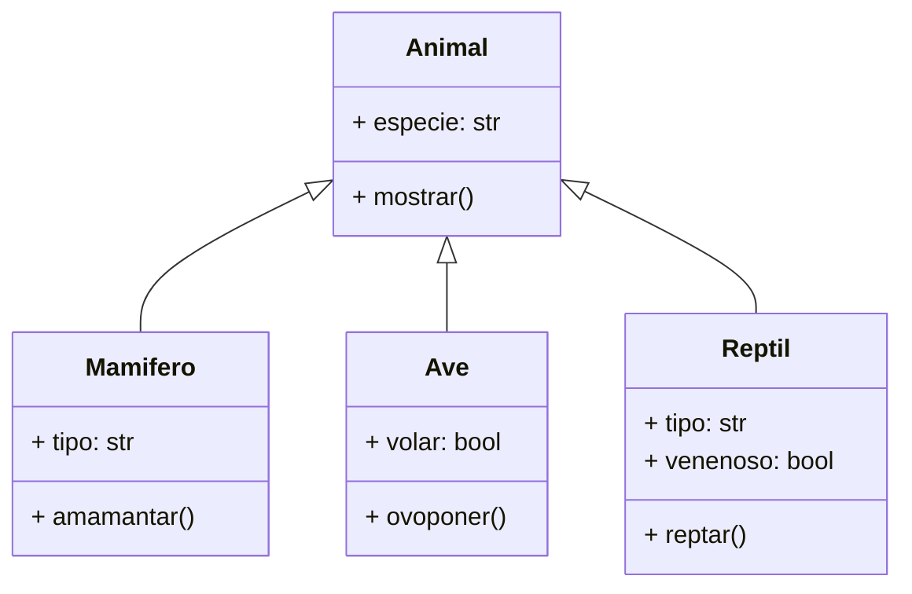
````

---

Diagrama

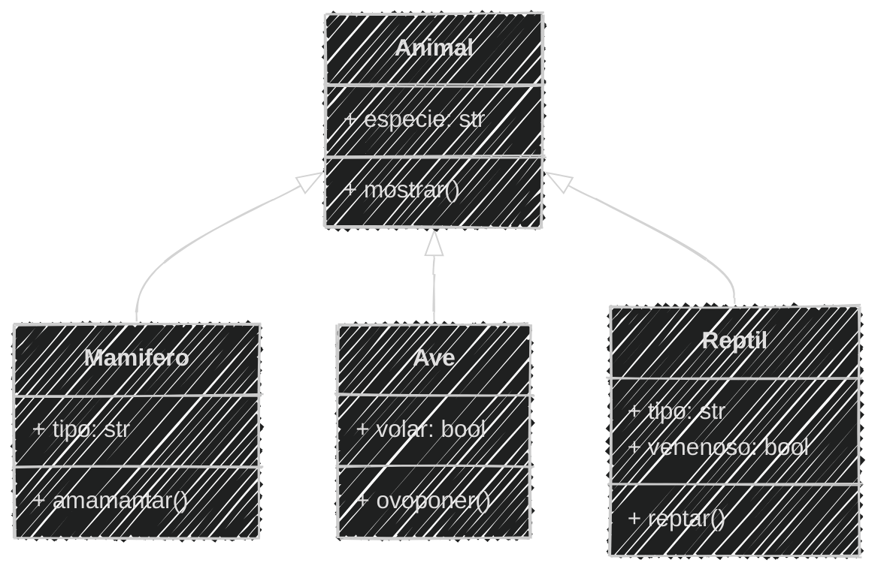

---

```python [6-7|31,36,41]
# Definición
class Animal:
    def __init__(self, especie):
        self.especie = especie

    def mostrar(self): # Nuevo método
        print(f"Especie: {self.especie}")
class Mamifero(Animal):
    def __init__(self, especie, tipo):
        super().__init__(especie) 
        self.tipo = tipo
    def amamantar(self):
        print(f"{self.especie} amamanta 🍼 a sus crías")

class Ave(Animal):
    def __init__(self, especie, volar):
        super().__init__(especie) 
        self.volar = volar
    def ovoponer(self):
        print(f"{self.especie} pone huevos 🥚")

class Reptil(Animal):
    def __init__(self, especie, tipo, venenoso):
        super().__init__(especie)
        self.tipo = tipo
        self.venenoso = venenoso
    def reptar(self):
        print(f"{self.especie} se arrastra 🐍")
# Uso
caballo = Mamifero("Caballo", "Terrestre")
caballo.mostrar() # Llamada al método de la clase Animal
print(f"Tipo: {caballo.tipo}")
caballo.amamantar()

paloma = Ave("Paloma", True)
paloma.mostrar() # Llamada al método de la clase Animal
print(f"Puede volar: {paloma.volar}")
paloma.ovoponer()

cocodrilo = Reptil("Cocodrilo", "Acuático", False)
cocodrilo.mostrar() # Llamada al método de la clase Animal
print(f"Tipo: {cocodrilo.tipo} - Venenoso: {cocodrilo.venenoso}")
cocodrilo.reptar()
```

```text
Especie: Caballo
Tipo: Terrestre
Caballo amamanta 🍼 a sus crías
Especie: Paloma
Puede volar: True
Paloma pone huevos 🥚
Especie: Cocodrilo
Tipo: Acuático - Venenoso: False
Cocodrilo se arrastra 🐍
```

---

Añadir al ejemplo `herencia.md` y `herencia.py`

```markdown
Los mamíferos muestran su especie, tipo y la acción de amamantar
A traves de un método propio `mostrar()`
```


Análisis

```markdown [29]
# Análisis Mejorado
Requisitos:
- Generar especies mamíferos y aves
- Almacenar información de especie
- Los mamíferos son terrestres o acuáticos
- Las aves pueden volar o no
- Los reptiles pueden ser terrestres o acuáticos
- Los reptiles pueden ser venenosos o no
Objetos:
- Animal (clase padre)
- Mamífero (hereda de Animal)
- Ave (hereda de Animal)
- Reptil (hereda de Animal)
Características:
- Animal:
  - especie: String
- Mamífero:
  - tipo: String (terrestre, acuático)
- Ave:
  - volar: bool
- Reptil:
  - tipo: String (terrestre, acuático)
  - venenoso: bool
Acciones:
- Animal:
  - mostrar()
- Mamífero:
  - amamantar()
  - mostrar()
- Ave:
  - ovoponer()
- Reptil:
  - reptar()
```

---

Diseño Mermaid

```` [10]
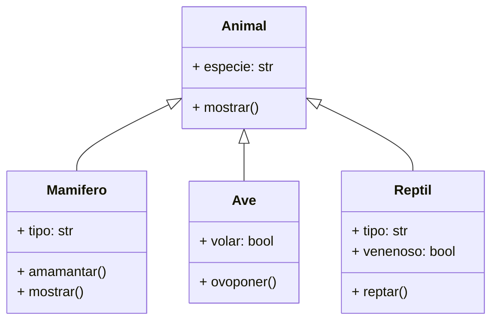
````

---

Diagrama

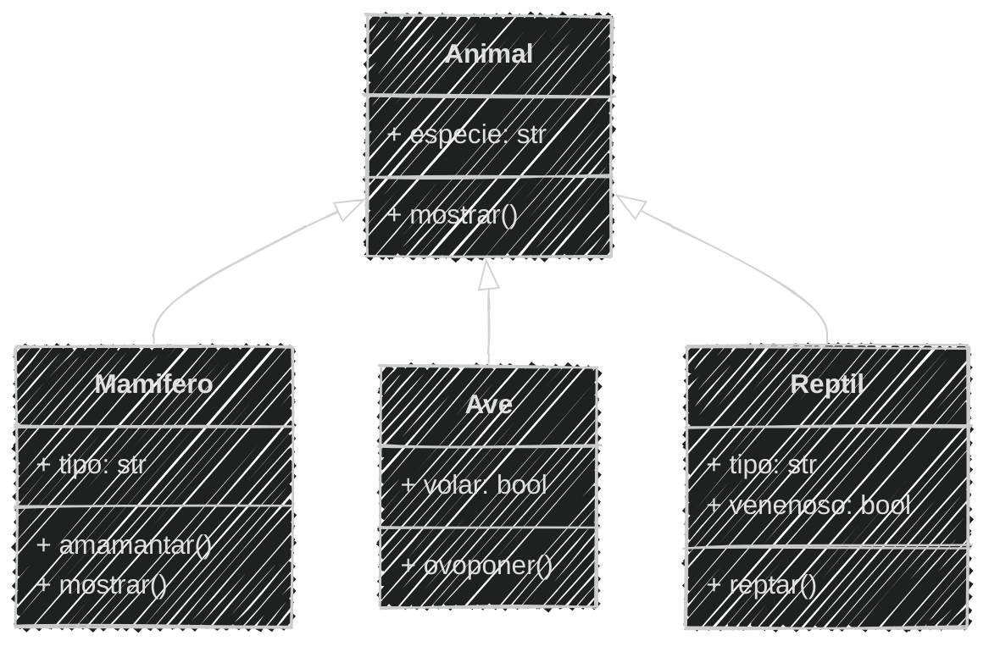

---

```python [6-7,15-17|34-35]
# Definición
class Animal:
    def __init__(self, especie):
        self.especie = especie

    def mostrar(self): # Nuevo método
        print(f"Especie: {self.especie}")
class Mamifero(Animal):
    def __init__(self, especie, tipo):
        super().__init__(especie) 
        self.tipo = tipo
    def amamantar(self):
        print(f"{self.especie} amamanta 🍼 a sus crías")
    
    def mostrar(self): # Método personalizado
        print(f"Tipo: {self.tipo}")
        self.amamantar()

class Ave(Animal):
    def __init__(self, especie, volar):
        super().__init__(especie) 
        self.volar = volar
    def ovoponer(self):
        print(f"{self.especie} pone huevos 🥚")

class Reptil(Animal):
    def __init__(self, especie, tipo, venenoso):
        super().__init__(especie)
        self.tipo = tipo
        self.venenoso = venenoso
    def reptar(self):
        print(f"{self.especie} se arrastra 🐍")
# Uso
caballo = Mamifero("Caballo", "Terrestre")
caballo.mostrar()

paloma = Ave("Paloma", True)
paloma.mostrar() # Llamada al método de la clase Animal
print(f"Puede volar: {paloma.volar}")
paloma.ovoponer()

cocodrilo = Reptil("Cocodrilo", "Acuático", False)
cocodrilo.mostrar() # Llamada al método de la clase Animal
print(f"Tipo: {cocodrilo.tipo} - Venenoso: {cocodrilo.venenoso}")
cocodrilo.reptar()
```

```text
Tipo: Terrestre
Caballo amamanta 🍼 a sus crías
Especie: Paloma
Puede volar: True
Paloma pone huevos 🥚
Especie: Cocodrilo
Tipo: Acuático - Venenoso: False
Cocodrilo se arrastra 🐍
```

---

Ahora se ejecuta el método `mostrar()` de la clase `Mamifero` 

Pero no el de la clase `Animal`

> Para que se ejecute el de la clase `Animal` debemos llamar 
> al método `mostrar()` de la clase padre utilizando `super()`


---

```python [6-7,15-18|35-36]
# Definición
class Animal:
    def __init__(self, especie):
        self.especie = especie

    def mostrar(self): # Nuevo método
        print(f"Especie: {self.especie}")
class Mamifero(Animal):
    def __init__(self, especie, tipo):
        super().__init__(especie) 
        self.tipo = tipo
    def amamantar(self):
        print(f"{self.especie} amamanta 🍼 a sus crías")
    
    def mostrar(self): # Método personalizado
        super().mostrar()  # Llamada al método del padre
        print(f"Tipo: {self.tipo}")
        self.amamantar()

class Ave(Animal):
    def __init__(self, especie, volar):
        super().__init__(especie) 
        self.volar = volar
    def ovoponer(self):
        print(f"{self.especie} pone huevos 🥚")

class Reptil(Animal):
    def __init__(self, especie, tipo, venenoso):
        super().__init__(especie)
        self.tipo = tipo
        self.venenoso = venenoso
    def reptar(self):
        print(f"{self.especie} se arrastra 🐍")
# Uso
caballo = Mamifero("Caballo", "Terrestre")
caballo.mostrar()

paloma = Ave("Paloma", True)
paloma.mostrar() # Llamada al método de la clase Animal
print(f"Puede volar: {paloma.volar}")
paloma.ovoponer()

cocodrilo = Reptil("Cocodrilo", "Acuático", False)
cocodrilo.mostrar() # Llamada al método de la clase Animal
print(f"Tipo: {cocodrilo.tipo} - Venenoso: {cocodrilo.venenoso}")
cocodrilo.reptar()
```

```text
Especie: Caballo
Tipo: Terrestre
Caballo amamanta 🍼 a sus crías
Especie: Paloma
Puede volar: True
Paloma pone huevos 🥚
Especie: Cocodrilo
Tipo: Acuático - Venenoso: False
Cocodrilo se arrastra 🐍
```

---
#### Ejemplo 04

Adicionar al ejemplo `herencia.md` y `herencia.py`

```markdown
Las aves tienen un método `mostrar()` que muestra
su especie y si pueden volar
Los reptiles tienen un método `mostrar()` que muestra
su especie, tipo y si son venenosos
```

3 Minutos

<iframe src="https://time-stuff.com/embed.html" frameborder="0" scrolling="no" width="391" height="140"></iframe>

Modificar el análisis y diseño

---
Análisis

```markdown [32,35]
# Análisis Mejorado
Requisitos:
- Generar especies mamíferos y aves
- Almacenar información de especie
- Los mamíferos son terrestres o acuáticos
- Las aves pueden volar o no
- Los reptiles pueden ser terrestres o acuáticos
- Los reptiles pueden ser venenosos o no
Objetos:
- Animal (clase padre)
- Mamífero (hereda de Animal)
- Ave (hereda de Animal)
- Reptil (hereda de Animal)
Características:
- Animal:
  - especie: String
- Mamífero:
  - tipo: String (terrestre, acuático)
- Ave:
  - volar: bool
- Reptil:
  - tipo: String (terrestre, acuático)
  - venenoso: bool
Acciones:
- Animal:
  - mostrar()
- Mamífero:
  - amamantar()
  - mostrar()
- Ave:
  - ovoponer()
  - mostrar()
- Reptil:
  - reptar()
  - mostrar()  
```

---

Diseño Mermaid

```` [15,21]
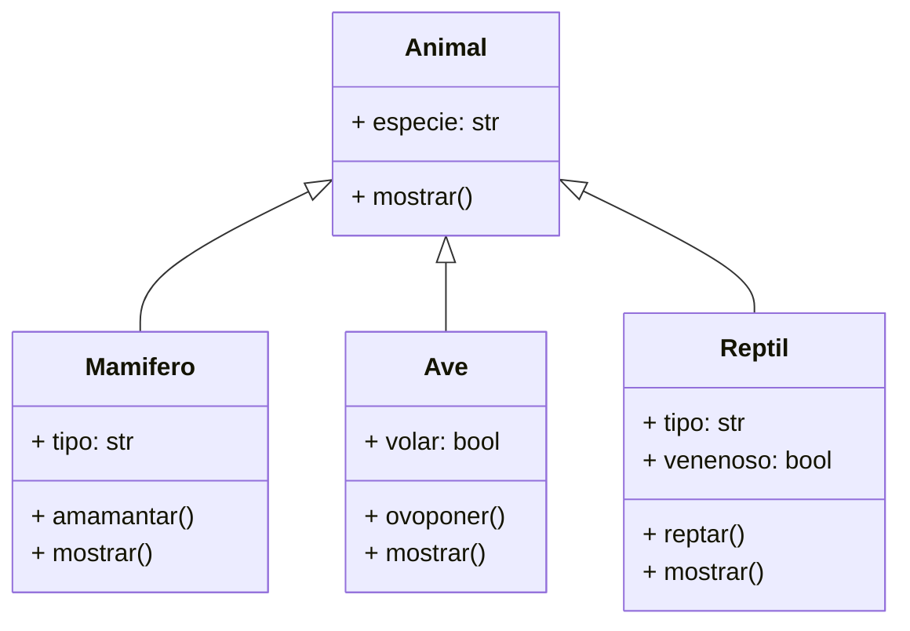
````

---

Diagrama

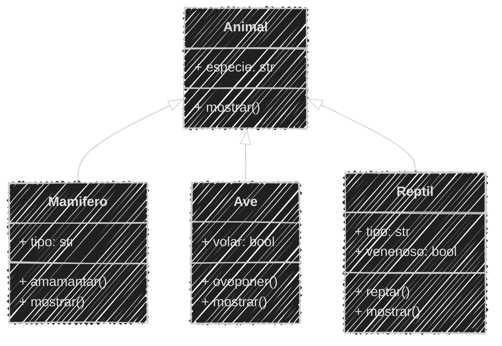

---


```python [15-18|27-30|40-43|48-52]
# Definición
class Animal:
    def __init__(self, especie):
        self.especie = especie

    def mostrar(self): # Nuevo método
        print(f"Especie: {self.especie}")
class Mamifero(Animal):
    def __init__(self, especie, tipo):
        super().__init__(especie) 
        self.tipo = tipo
    def amamantar(self):
        print(f"{self.especie} amamanta 🍼 a sus crías")
    
    def mostrar(self): # Método personalizado
        super().mostrar()  # Llamada al método del padre
        print(f"Tipo: {self.tipo}")
        self.amamantar()

class Ave(Animal):
    def __init__(self, especie, volar):
        super().__init__(especie) 
        self.volar = volar
    def ovoponer(self):
        print(f"{self.especie} pone huevos 🥚")
    
    def mostrar(self): # Método personalizado
        super().mostrar()  # Llamada al método del padre
        print(f"Puede volar: {self.volar}")
        self.ovoponer()

class Reptil(Animal):
    def __init__(self, especie, tipo, venenoso):
        super().__init__(especie)
        self.tipo = tipo
        self.venenoso = venenoso
    def reptar(self):
        print(f"{self.especie} se arrastra 🐍")

    def mostrar(self): # Método personalizado
        super().mostrar()  # Llamada al método del padre
        print(f"Tipo: {self.tipo} - Venenoso: {self.venenoso}")
        self.reptar()
# Uso
caballo = Mamifero("Caballo", "Terrestre")
caballo.mostrar()

paloma = Ave("Paloma", True)
paloma.mostrar() 

cocodrilo = Reptil("Cocodrilo", "Acuático", False)
cocodrilo.mostrar()
```

```text
Especie: Caballo
Tipo: Terrestre
Caballo amamanta 🍼 a sus crías
Especie: Paloma
Puede volar: True
Paloma pone huevos 🥚
Especie: Cocodrilo
Tipo: Acuático - Venenoso: False
Cocodrilo se arrastra 🐍
```

---

#### Consulta de tipos de clase

En Python podemos preguntar si un objeto es de un tipo de clase específico

Para esto utilizamos la función `isinstance()` y `issubclass()`

Se utiliza de manera similar a `type()`

---

#### isinstance()

`isinstance()` es una función que verifica si un objeto es una instancia de una clase o de una subclase

Se utiliza principalmente para verificar el tipo de un objeto

En el ejemplo `herencia.py` podemos verificar si un objeto es de tipo `Mamifero`, `Ave` o `Reptil`

---

En el ejemplo `herencia.py` podemos añadir consultas de tipo

```python [54-60]
# Definición
class Animal:
    def __init__(self, especie):
        self.especie = especie

    def mostrar(self): # Nuevo método
        print(f"Especie: {self.especie}")
class Mamifero(Animal):
    def __init__(self, especie, tipo):
        super().__init__(especie) 
        self.tipo = tipo
    def amamantar(self):
        print(f"{self.especie} amamanta 🍼 a sus crías")
    
    def mostrar(self): # Método personalizado
        super().mostrar()  # Llamada al método del padre
        print(f"Tipo: {self.tipo}")
        self.amamantar()

class Ave(Animal):
    def __init__(self, especie, volar):
        super().__init__(especie) 
        self.volar = volar
    def ovoponer(self):
        print(f"{self.especie} pone huevos 🥚")
    
    def mostrar(self): # Método personalizado
        super().mostrar()  # Llamada al método del padre
        print(f"Puede volar: {self.volar}")
        self.ovoponer()

class Reptil(Animal):
    def __init__(self, especie, tipo, venenoso):
        super().__init__(especie)
        self.tipo = tipo
        self.venenoso = venenoso
    def reptar(self):
        print(f"{self.especie} se arrastra 🐍")

    def mostrar(self): # Método personalizado
        super().mostrar()  # Llamada al método del padre
        print(f"Tipo: {self.tipo} - Venenoso: {self.venenoso}")
        self.reptar()
# Uso
caballo = Mamifero("Caballo", "Terrestre")
caballo.mostrar()

paloma = Ave("Paloma", True)
paloma.mostrar() 

cocodrilo = Reptil("Cocodrilo", "Acuático", False)
cocodrilo.mostrar()
# Uso isinstance()
caballo_is_mamifero = isinstance(caballo, Mamifero)
print (type(caballo_is_mamifero))
print("Caballo Es Mamifero: ", caballo_is_mamifero)
caballo_is_animal = isinstance(caballo, Animal)
print("Caballo Es Animal: ", caballo_is_animal)
caballo_is_ave = isinstance(caballo, Ave)
print("Caballo Es Ave: ", caballo_is_ave)
```

---

```bash
python herencia.py
```

```text	[10-13]
Especie: Caballo
Tipo: Terrestre
Caballo amamanta 🍼 a sus crías
Especie: Paloma
Puede volar: True
Paloma pone huevos 🥚
Especie: Cocodrilo
Tipo: Acuático - Venenoso: False
Cocodrilo se arrastra 🐍
<class 'bool'>
Caballo Es Mamifero:  True
Caballo Es Animal:  True
Caballo Es Ave:  False
```

---
#### issubclass()

`issubclass()` es una función que verifica si una clase es una hija de otra clase

Se utiliza para verificar la relación de herencia entre clases

En el ejemplo `herencia.py` podemos verificar si una clase es una subclase de `Animal`

---
En el ejemplo `herencia.py` podemos añadir consultas de subclase

```python [62-67]
# Definición
class Animal:
    def __init__(self, especie):
        self.especie = especie

    def mostrar(self): # Nuevo método
        print(f"Especie: {self.especie}")
class Mamifero(Animal):
    def __init__(self, especie, tipo):
        super().__init__(especie) 
        self.tipo = tipo
    def amamantar(self):
        print(f"{self.especie} amamanta 🍼 a sus crías")
    
    def mostrar(self): # Método personalizado
        super().mostrar()  # Llamada al método del padre
        print(f"Tipo: {self.tipo}")
        self.amamantar()

class Ave(Animal):
    def __init__(self, especie, volar):
        super().__init__(especie) 
        self.volar = volar
    def ovoponer(self):
        print(f"{self.especie} pone huevos 🥚")
    
    def mostrar(self): # Método personalizado
        super().mostrar()  # Llamada al método del padre
        print(f"Puede volar: {self.volar}")
        self.ovoponer()

class Reptil(Animal):
    def __init__(self, especie, tipo, venenoso):
        super().__init__(especie)
        self.tipo = tipo
        self.venenoso = venenoso
    def reptar(self):
        print(f"{self.especie} se arrastra 🐍")

    def mostrar(self): # Método personalizado
        super().mostrar()  # Llamada al método del padre
        print(f"Tipo: {self.tipo} - Venenoso: {self.venenoso}")
        self.reptar()
# Uso
caballo = Mamifero("Caballo", "Terrestre")
caballo.mostrar()

paloma = Ave("Paloma", True)
paloma.mostrar() 

cocodrilo = Reptil("Cocodrilo", "Acuático", False)
cocodrilo.mostrar()
# Uso isinstance()
caballo_is_mamifero = isinstance(caballo, Mamifero)
print (type(caballo_is_mamifero))
print("Caballo Es Mamifero: ", caballo_is_mamifero)
caballo_is_animal = isinstance(caballo, Animal)
print("Caballo Es Animal: ", caballo_is_animal)
caballo_is_ave = isinstance(caballo, Ave)
print("Caballo Es Ave: ", caballo_is_ave)

# Uso issubclass()
mamifero_is_animal = issubclass(Mamifero, Animal)
print (type(mamifero_is_animal))
print("Mamifero Es Animal: ", mamifero_is_animal)
mamifero_is_ave = issubclass(Mamifero, Ave)
print("Mamifero Es Ave: ", mamifero_is_ave)
```

---
```bash
python herencia.py
```

```text	[14-16]
Especie: Caballo
Tipo: Terrestre
Caballo amamanta 🍼 a sus crías
Especie: Paloma
Puede volar: True
Paloma pone huevos 🥚
Especie: Cocodrilo
Tipo: Acuático - Venenoso: False
Cocodrilo se arrastra 🐍
<class 'bool'>
Caballo Es Mamifero:  True
Caballo Es Animal:  True
Caballo Es Ave:  False
<class 'bool'>
Mamifero Es Animal:  True
Mamifero Es Ave:  False
```

---

#### Herencia múltiple

En Python, una clase puede heredar de múltiples clases

Esto se conoce como herencia múltiple

Es útil cuando queremos combinar varias clases en una sola

---

Hay que tener cuidado con la herencia múltiple 

porque puede generar problemas de ambigüedad

Si dos clases padre tienen un método con el mismo nombre

Python utiliza la primera clase padre en el orden de herencia

---
Cuando se llama al constructor de ambas clases se puede usar super()

Pero solo da prioridad a primera clase que hereda

Se debe tener cuidado con el orden de herencia

---

En la vida real existen herencias múltiples

Como el Limón

#### 🍋

El limón no es una fruta pura

---

```markdown
El limón es la mezcla de la cidra y la naranja amarga
La cidra aporta el sabor ácido y la dureza de la cáscara
La naranja amarga aporta el sabor dulce y la jugosidad
```

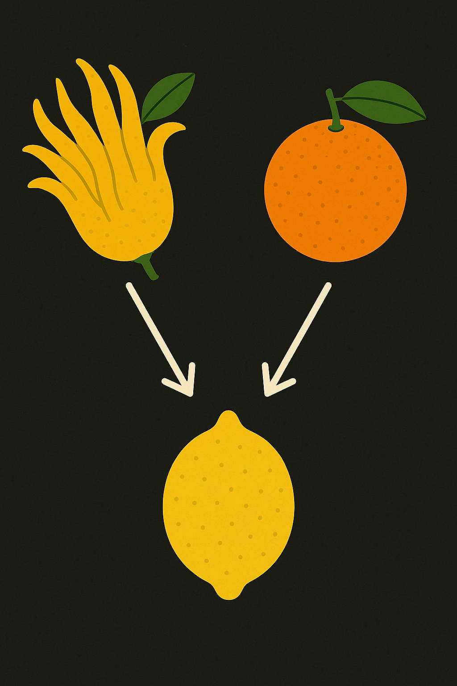  <!-- .element  width="20%"-->

Crear un archivo llamado `multiple.md` y `multiple.py` 

---

Análisis

```markdown
# Análisis
Requisitos:
- La naranja y la cidra son frutas
- El limón es una mezcla de la cidra y la naranja amarga
Objetos:
- Fruta (clase padre)
- Naranja (hereda de Fruta)
- Cidra (hereda de Fruta)
- Limón (hereda de Naranja y Cidra)
Características:
- Fruta:
  - color: String
- Cidra:
  - acidez: String
  - cascara: String
- Naranja:
  - dulzura: String
  - jugosidad: String
- Limon:
  - (sin características)
Acciones:
- Fruta:
  - (sin acciones)
- Cidra:
  - (sin acciones)
- Naranja:
  - (sin acciones)
- Limón:
  - (sin acciones)
```

---

Diseño Mermaid

````
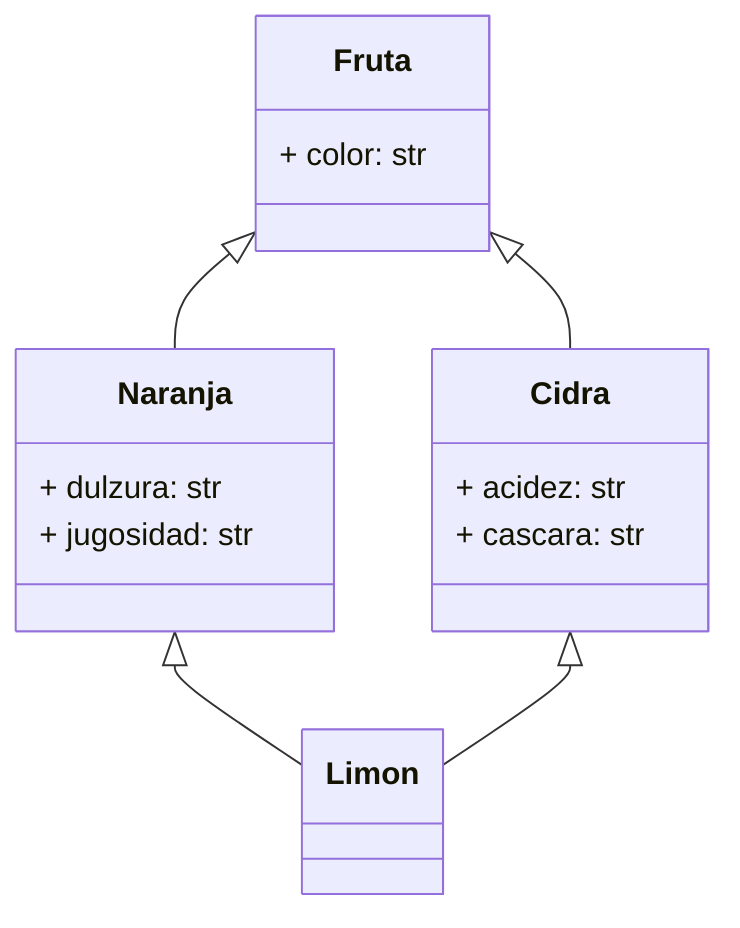
````

---
Diagrama

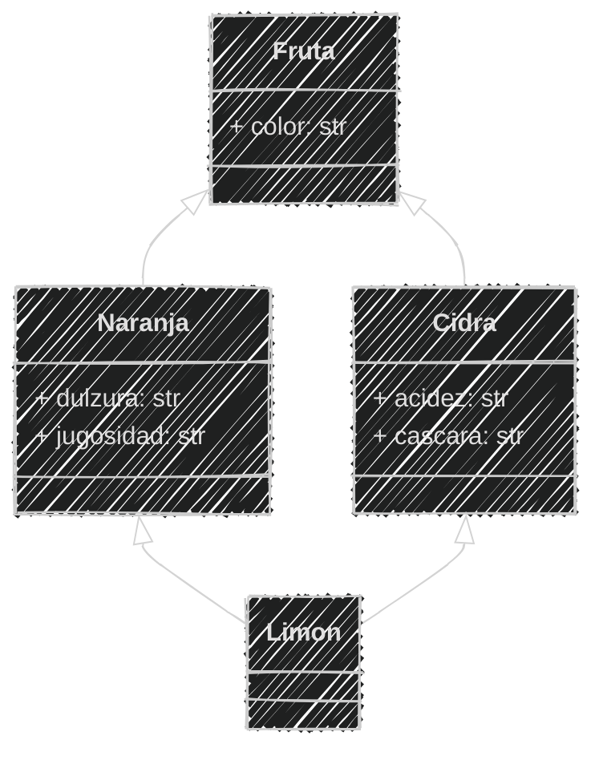

---

```python
# Definición
class Fruta:
    def __init__(self, color):
        self.color = color

class Cidra(Fruta):
    def __init__(self, color, acidez, cascara):
        super().__init__(color)
        self.acidez = acidez
        self.cascara = cascara
class Naranja(Fruta):
    def __init__(self, color, dulzura, jugosidad):
        super().__init__(color)
        self.dulzura = dulzura
        self.jugosidad = jugosidad
class Limon(Cidra, Naranja):
    def __init__(self, color, acidez, cascara, dulzura, jugosidad):
        Fruta.__init__(self, color)
        self.acidez = acidez
        self.cascara = cascara
        self.dulzura = dulzura
        self.jugosidad = jugosidad
        # No necesita atributos propios, hereda de Cidra y Naranja

# Ejemplo de uso
cidra = Cidra("amarilla", "alta", "dura")
naranja = Naranja("naranja", "media", "jugosa")
limon = Limon("amarillo", "alta", "dura", "baja", "media")

print(f"Cidra: {cidra.color}, Acidez: {cidra.acidez}")
print(f"Cáscara: {cidra.cascara}")

print(f"Naranja: {naranja.color}, Dulzura: {naranja.dulzura}")
print(f"Jugosidad: {naranja.jugosidad}")

print(f"Limón: {limon.color}, Acidez: {limon.acidez}")
print(f"Cáscara: {limon.cascara}, Dulzura: {limon.dulzura}, Jugosidad: {limon.jugosidad}")
```

```bash
python multiple.py
```

```text
Cidra: amarilla, Acidez: alta
Cáscara: dura
Naranja: naranja, Dulzura: media
Jugosidad: jugosa
Limón: amarillo, Acidez: alta
Cáscara: dura, Dulzura: baja, Jugosidad: media
```

---

#### Resumen

- La herencia es un concepto fundamental en la programación orientada a objetos que permite crear nuevas clases basadas en clases existentes, heredando sus atributos y métodos.
- La herencia facilita la reutilización de código, evita la duplicación y promueve la mantenibilidad.
- En los diagramas de clases, la herencia se representa con flechas que indican la relación entre clases padre e hija.
---

- Permite organizar las clases en jerarquías, facilitando la comprensión y el mantenimiento del código.
- En Python, la herencia se implementa indicando la clase padre entre paréntesis al definir la clase hija.
- Las clases hijas pueden tener sus propios métodos y atributos, además de los heredados.

---

- El método super() permite acceder a métodos y atributos de la clase padre desde la clase hija, útil para llamar al constructor del padre.
- Se puede personalizar el comportamiento de los métodos heredados redefiniéndolos en la clase hija.
- Las funciones isinstance() y issubclass() permiten verificar si un objeto es instancia de una clase o si una clase es subclase de otra, respectivamente.

---

- La herencia múltiple puede combinar características de varias clases en una sola, como en el ejemplo del limón que hereda de cidra y naranja.
- Python permite la herencia múltiple, donde una clase puede heredar de varias clases, pero se debe tener cuidado con el orden de herencia y posibles ambigüedades.

---

#### Retos

Crear una carpeta con el nombre "retos_sesion_05" dentro del proyecto en la raíz, en la cual por cada ejercicio debes crear los siguientes archivos:

```bash
# Estructura de carpetas
psg-oop-2025/
    retos_sesion_05/
        ejercicio_01.md
        ejercicio_01.py
        ejercicio_02.md
        ejercicio_02.py
```

---

1. Crear un archivo llamado `ejercicio_01.md`

y un archivo `ejercicio_01.py` en la carpeta

retos_sesion_05 y hacer:

- análisis, diseño y script en Python

Para lo siguiente:

```text
En una simulación de transporte, tienes una clase
Vehiculo con un atributo velocidad y un atributo
de medio en el que se desplaza (terrestre, acuático, aéreo).
Crea una clase Bicicleta que herede de Vehiculo
y tenga un método pedalear que aumente la velocidad.
Crea una clase Avion que herede de Vehiculo
y tenga un método volar que aumente la velocidad.
```


---
2. Crear un archivo llamado `ejercicio_02.md`

y un archivo `ejercicio_02.py` en la carpeta

- análisis, diseño y script en Python

Para lo siguiente:

```text
Estás creando un videojuego tipo aventura donde
los personajes tienen habilidades.
Para eso, vas a crear clases:
Nadador, que tiene un método nadar.
Volador, que tiene un método volar.
Un personaje será un Pez que hereda de Nadador.
Un personaje será un Pajaro que hereda de Volador.
Un personaje será un Pato que hereda de Nadador y Volador
Crea un método mostrar en cada clase 
que imprima el tipo de personaje y su habilidad.
```
    
---
<!-- .slide: data-background-image="../../content/psg-bg-dark.png" data-background-size="100%"-->

<br>
<br>
<br>
<br>
<br>

[ <!-- .element width="20%"-->](https://github.com/python-la-paz/python-study-group-oop/content/sesion05)

Repositorio de la Sesión

---
<!--.slide: data-visibility="hidden"-->
## Bibliografía y Referencias

- [Herencia](https://concepto.de/herencia/)
- [Programación orientada a objetos: herencia y sus beneficios](https://programacionpro.com/programacion-orientada-a-objetos-herencia-y-sus-beneficios/)
- [Python super()](https://www.geeksforgeeks.org/python-super/)
- [Python Mixin](https://www.pythontutorial.net/python-oop/python-mixin/)
- [Python super() function](https://docs.python.org/3/library/functions.html#super)
- [Method Overriding in Python](https://www.geeksforgeeks.org/method-overriding-in-python/)
- [isinstance() function](https://docs.python.org/3/library/functions.html#isinstance)
- [Python Tutorial - Multiple Inheritance](https://docs.python.org/3/tutorial/classes.html#multiple-inheritance)
- [Herencia múltiple](https://www.geeksforgeeks.org/multiple-inheritance-in-python/)
- [Object Oriented Analysis](https://www.gyata.ai/es/object-oriented-programming/object-oriented-analysis)
- [Python OOP](https://www.learnpython.org/en/Classes_and_Objects)
- [Atributos de clase](https://oregoom.com/python/atributos-clase/)
- [Diagrama de clases](https://diagramasuml.com/diagrama-de-clases/)
- [Guía PEP 8](https://peps.python.org/pep-0008/#class-names)
- [Mermaid Charts](https://www.mermaidchart.com/play)
- [Draw.io](https://app.diagrams.net/)
- [Python 3 Object-oriented Programming, Second Edition, Dusty PhillipsDusty Phillips](https://github.com/PacktPublishing/Python-3-Object-Oriented-Programming-Second-Edition)
- [Objetos en programación](https://ebac.mx/blog/objeto-en-programacion)
- [Enfoque orientado a objetos](https://1library.co/article/enfoque-orientado-a-objetos-base-te%C3%B3rica.qvld461y)
- [OOAD](https://www.tutorialspoint.com/object_oriented_analysis_design/ooad_object_oriented_analysis.htm)