<!-- .slide: data-background-image="../../content/psg-bg-dark.png" data-background-size="100%"-->
 <!-- .element  hidden="true" -->

<br>
<br>
<br>

### Sesión  05
#### Herencia
#### Relaciones y reutilización de objetos


---

#### Proyecto en VSCode

Abre el proyecto en VSCode

```bash
code psg-oop-2025
```

Crea una carpeta con el nombre `sesion05`

```bash
mkdir sesion05
cd sesion05
```

- Los archivos de esta sesión deben estar dentro de esta carpeta

- Al finalizar la sesión, sube los cambios al repositorio en un commit

---

#### Herencia

¿Qué es la herencia?

---

La herencia es la **transmisión** de las características de los progenitores a sus descendientes

# 👨 👶 👩

---

La herencia es un concepto fundamental en la programación orientada a objetos

Permite **crear nuevas clases** basadas en clases existentes, **heredando** sus **atributos y métodos**

---

#### Principios fundamentales

Es el **3º** principio fundamental de la Programación Orientada a Objetos (POO)

## **Herencia**

---


#### Beneficios de la herencia

**Reutilización de código**: Al heredar atributos y métodos de una clase base, se evita la duplicación de código y se promueve la reutilización

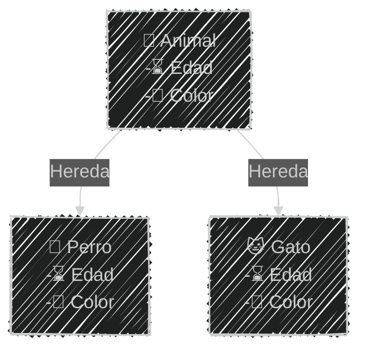
<!--.element class="center-mermaid"-->

---

**Jerarquía de clases**: Permite organizar las clases en una jerarquía, facilitando la comprensión y el mantenimiento del código

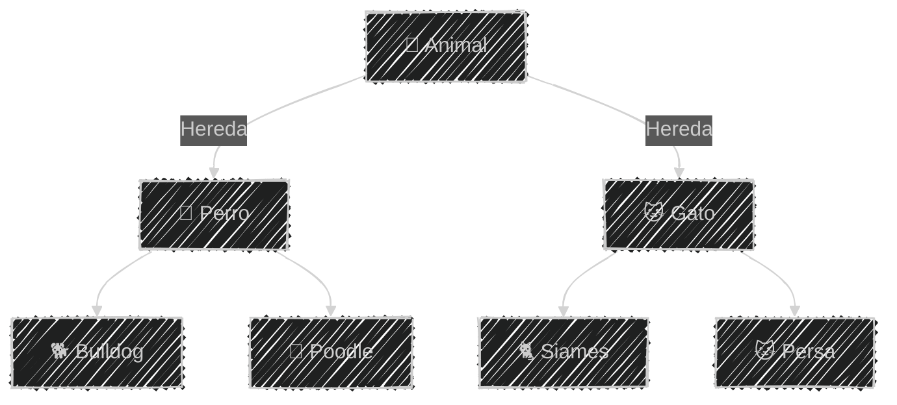
<!--.element class="center-mermaid"-->

---

**Mantenibilidad**: Al modificar la clase base, los cambios se propagan automáticamente a las clases derivadas, lo que facilita el mantenimiento del código

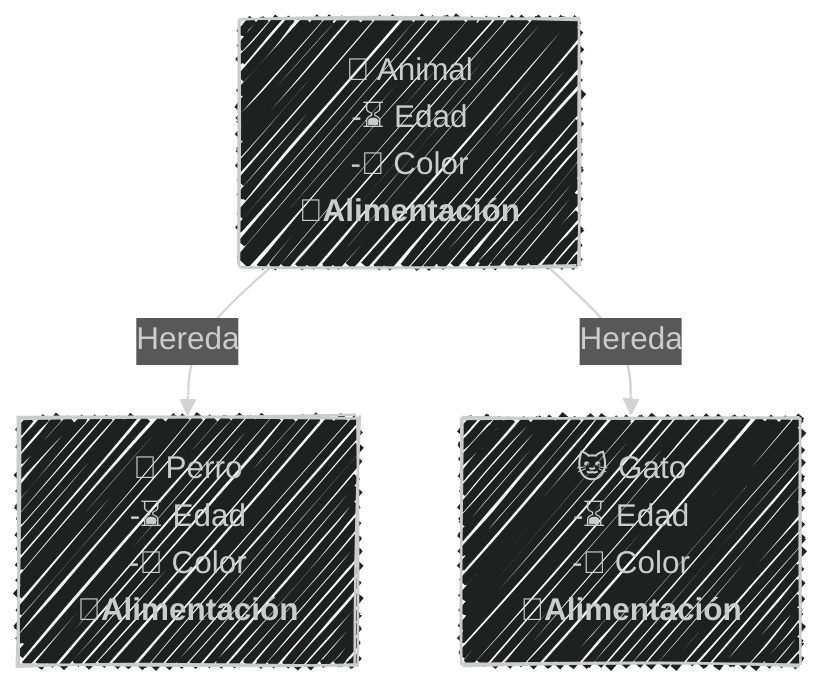
<!--.element class="center-mermaid"-->

---
#### Herencia y niveles de acceso

**Público**: Atributos y métodos **se heredan** y **son** accesibles desde fuera de las clases

**Protegido**: Atributos y métodos **se heredan** y *no son* accesibles desde desde fuera de las clases

**Privado**: Atributos y métodos *no se heredan* y *no son* accesibles desde fuera de las clases

---

Para acceder a los atributos privados o protegidos se recomienda utilizar métodos de acceso 

**getters** y **setters**

---

#### Diagrama de clases

La herencia se representa en un diagrama de clases con una flecha `➡` que apunta desde

la clase **hija** hacia la clase **padre**

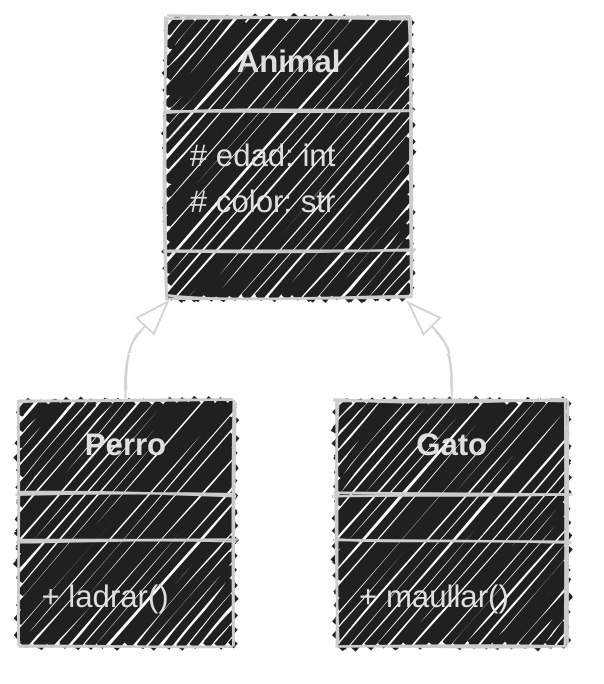
<!--.element class="center-mermaid"-->

---

En mermaid, la herencia se representa con la sintaxis

`Animal <|-- Perro`

`Animal` es clase padre y `Perro` es clase hija

````
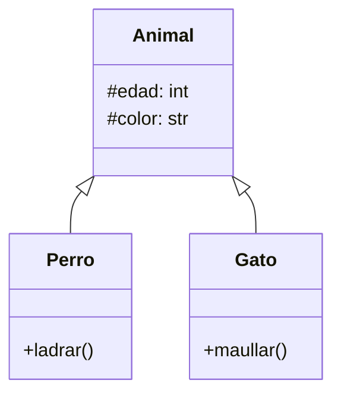
````

---

#### Herencia en Python

La herencia se define colocando **entre paréntesis** el nombre de la clase **padre** después del nombre de la clase **hija**

```python
class Animal:
    def __init__(self, edad, color):
        self.edad = edad
        self.color = color

class Perro(Animal): # Hereda de Animal
    def ladrar(self):
        print("¡Guau!")

class Gato(Animal): # Hereda de Animal
    def maullar(self):
        print("¡Miau!")
```

---

Los atributos de Animal se heredan en Perro y Gato

```python [1-11|13-23]
# Definición
class Animal:
    def __init__(self, edad, color):
        self.edad = edad
        self.color = color
class Perro(Animal): # Hereda de Animal
    def ladrar(self):
        print("¡Guau!")
class Gato(Animal): # Hereda de Animal
    def maullar(self):
        print("¡Miau!")

# Uso
fido = Perro(5, "marrón")
print(fido.edad)  # Heredado
print(fido.color)  # Heredado
fido.ladrar() # Método de la clase Perro

michi = Gato(3, "blanco")
print(michi.edad)  # Heredado
print(michi.color)  # Heredado
michi.maullar() # Método de la clase Gato
```

```
5
marrón
¡Guau!
3
blanco
¡Miau!
```

---

#### Ejemplo 01

Crea los archivos **herencia.md** y **zoo.py** en la carpeta **sesion05**

```markdown
Un zoológico posee un catálogo digital de animales
Existes dos categorías principales: mamíferos y aves
Los animales tienen registrado la especie a la que pertenecen
Los mamíferos puede ser de dos tipos: terrestres o acuáticos
y puede amamantar a crías
Las aves tienen la característica de poder volar o no
y tienen la capacidad de poner huevos
```

---

Análisis inicial

```markdown [1-27|11-13|16,18,21]
# Análisis
Requisitos:
- Registrar animales
- Almacenar información de especie
- Categorías principales mamíferos y aves
- Mamíferos son terrestres o acuáticos
- Aves pueden volar o no
- Mamíferos pueden amamantar
- Aves pueden poner huevos
Objetos:
- Animal
- Mamífero
- Ave
Características:
- Animal:
  - especie: String
- Mamífero:
  - especie: String
  - tipo: String (terrestre, acuático)
- Ave:
  - especie: String
  - volar: bool
Acciones:
- Mamífero:
  - amamantar()
- Ave:
  - poner_huevo()
```

Posee repetición de características se debe mejorar

---
Análisis mejorado sin repetición

```markdown [1-29|13-15|17-22|23-29]
# Análisis Mejorado
Requisitos:
- Registrar animales
- Almacenar información de especie
- Categorías principales mamíferos y aves
- Mamíferos son animales
- Mamíferos son terrestres o acuáticos
- Mamíferos pueden amamantar
- Aves son animales
- Aves pueden volar o no
- Aves pueden poner huevos
Objetos:
- Animal (clase padre)
- Mamífero (clase hija)
- Ave (clase hija)
Características:
- Animal:
  - especie: String
- Mamífero:
  - tipo: String (terrestre, acuático)
- Ave:
  - volar: bool
Acciones:
- Animal:
  - (sin acciones)
- Mamífero:
  - amamantar()
- Ave:
  - poner_huevo()
```

Las características comunes se heredan de la clase padre Animal

---

Diseño diagrama en Mermaid

````
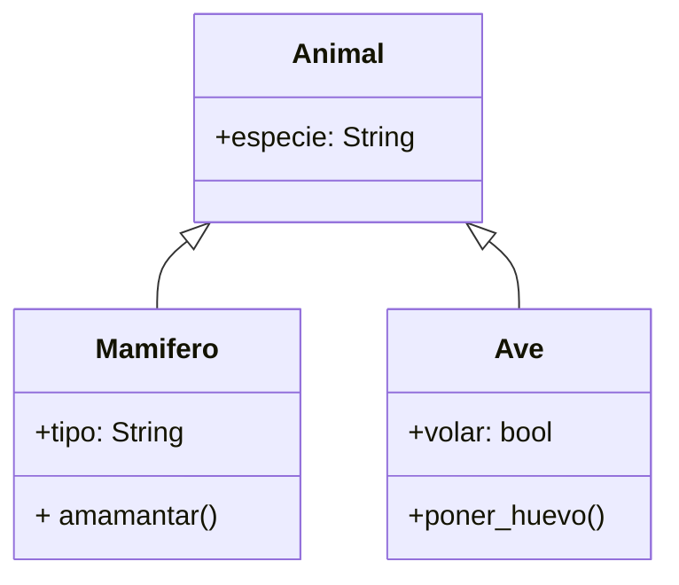
````

---

Diseño Diagrama

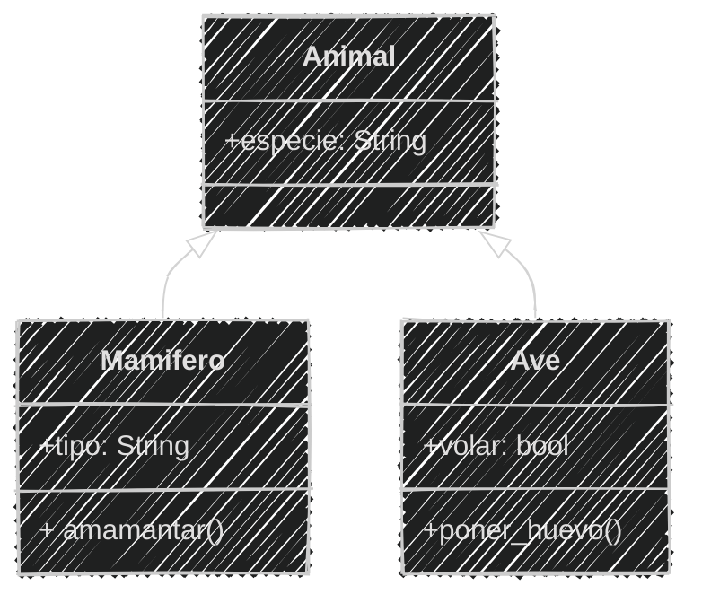
<!--.element class="center-mermaid"-->

Se crea una relación de herencia entre

*Animal* y **Mamífero** | *Animal* y **Ave**

---

Ya con la herencia definida en el análisis y diseño

podemos implementar el código en Python

---

En el archivo `zoo.py`

```python [2-4|5-7|8-10|12-15|16-19]
# Definición
class Animal:
    def __init__(self, especie):
        self.especie = especie
class Mamifero(Animal):
    def amamantar(self):
        print(f"{self.especie} amamanta 🍼 a crías")
class Ave(Animal):
    def poner_huevo(self):
        print(f"{self.especie} pone huevos 🥚")
# Uso
caballo = Mamifero("Caballo")
caballo.tipo = "Terrestre" # Asignar atributo
print(f"Especie:{caballo.especie} - Tipo:{caballo.tipo}")
caballo.amamantar()
paloma = Ave("Paloma")
paloma.volar = True # Asignar atributo
print(f"Especie:{paloma.especie}, puede volar:{paloma.volar}")
paloma.poner_huevo()
```

```text
Especie: Caballo, Tipo: Terrestre
Caballo amamanta 🍼 a crías
Especie: Paloma, puede volar: True
Paloma pone huevos 🥚
```

---

#### Ejercicio para ti (02)

En la carpeta **sesion05** modifica los archivos **herencia.md** y **zoo.py**

```markdown
En el zoológico se esta ampliando el catálogo
añadiendo una nueva categoría: reptiles
los reptiles pueden ser terrestres o acuáticos
pueden ser venenosos o no 
y tienen la capacidad de reptar
```

Obtener el *Análisis*

2 Minutos

<iframe src="https://time-stuff.com/embed.html" frameborder="0" scrolling="no" width="391" height="140"></iframe>

---

Modificando el *Análisis*

```markdown [5,12-15|20,28-30|38-39]
# Análisis Mejorado
Requisitos:
- Registrar animales
- Almacenar información de especie
- Categorías principales mamíferos, aves y reptiles
- Mamíferos son animales
- Mamíferos son terrestres o acuáticos
- Mamíferos pueden amamantar
- Aves son animales
- Aves pueden volar o no
- Aves pueden poner huevos
- Reptiles son animales
- Reptiles pueden ser terrestres o acuáticos
- Reptiles pueden ser venenosos o no
- Reptiles pueden reptar
Objetos:
- Animal (clase padre)
- Mamífero (clase hija)
- Ave (clase hija)
- Reptil (clase hija)
Características:
- Animal:
  - especie: String
- Mamífero:
  - tipo: String (terrestre, acuático)
- Ave:
  - volar: bool
- Reptil:
  - tipo: String (terrestre, acuático)
  - venenoso: bool
Acciones:
- Animal:
  - (sin acciones)
- Mamífero:
  - amamantar()
- Ave:
  - poner_huevo()
- Reptil:
    - reptar()
```

---

#### Ejercicio para ti (02)

Ahora obtenemos el diseño del *diagrama de clase*

2 minutos

<iframe src="https://time-stuff.com/embed.html" frameborder="0" scrolling="no" width="391" height="140"></iframe>

---

Creando el diseño de diagrama de clases

```` [14-18,21]
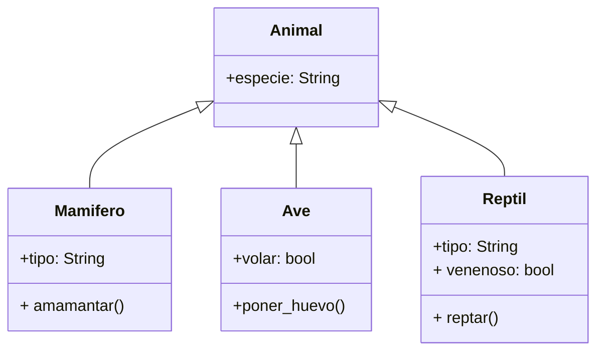
````
---

Creando el diseño de diagrama de clases

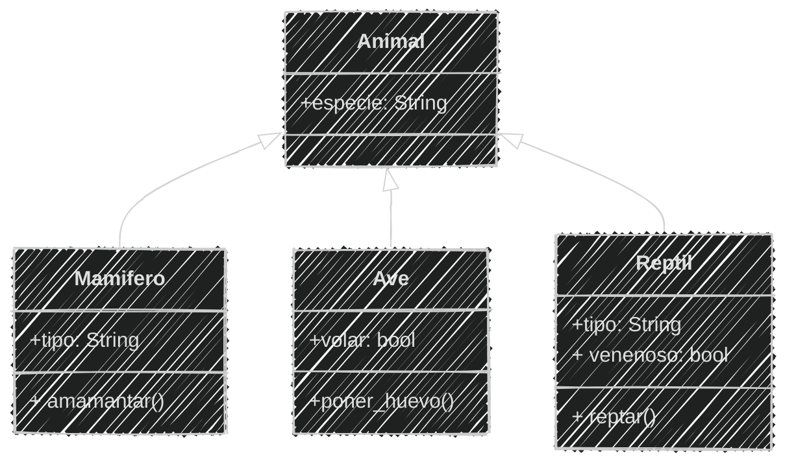
<!--.element class="center-mermaid"-->

---

#### Ejercicio para ti (02)

Ya tenemos el *análisis y diseño* de la clase

Ahora podemos **programar**

Modifica el archivo `zoo.py`

3 minutos

<iframe src="https://time-stuff.com/embed.html" frameborder="0" scrolling="no" width="391" height="140"></iframe>

---

Implementando la clase Reptil

```python [11-13|23-27]
# Definición
class Animal:
    def __init__(self, especie):
        self.especie = especie
class Mamifero(Animal):
    def amamantar(self):
        print(f"{self.especie} amamanta 🍼 a crías")
class Ave(Animal):
    def poner_huevo(self):
        print(f"{self.especie} pone huevos 🥚")
class Reptil(Animal):
    def reptar(self):
        print(f"{self.especie} se arrastra 🐍")
# Uso
caballo = Mamifero("Caballo")
caballo.tipo = "Terrestre"
print(f"Especie: {caballo.especie}, Tipo: {caballo.tipo}")
caballo.amamantar()
paloma = Ave("Paloma")
paloma.volar = True
print(f"Especie: {paloma.especie}, puede volar:{paloma.volar}")
paloma.poner_huevo()
coco = Reptil("Cocodrilo")
coco.tipo = "Acuático" # Asignar atributo
coco.venenoso = False # Asignar atributo
print(f"Especie:{coco.especie}, tipo:{coco.tipo}, Venenoso:{coco.venenoso}")
coco.reptar()
```

```text
Especie: Caballo, Tipo: Terrestre
Caballo amamanta 🍼 a crías
Especie: Paloma, puede volar: True
Paloma pone huevos 🥚
Especie:Cocodrilo, tipo:Acuático, Venenoso:False
Cocodrilo se arrastra 🐍
```

---

Hemos implementado **herencia** en Python

los **atributos** los asignamos **después** de crear el objeto

ya que no definimos **constructor** en las clases hijas


Los constructores tienen una relación especial con la herencia

Veamos cómo se relacionan

---

#### Constructores y herencia

Las clases hijas **heredan** atributos y métodos de la clase padre

El constructor también se hereda de la clase padre

Las clases hijas **pueden** tener sus propios métodos y atributos

Las clases hijas **pueden** definir su propio constructor

---

Cuando definimos un **constructor** en una clase hija

Se *sobrescribe* el constructor de la clase padre y para **definir** los atributos heredados de la clase padre

debemos llamar al constructor de la clase padre utilizando el método `super()`

---

#### super()

`super()` es una método que **permite** acceder a los métodos y atributos de la clase **padre**

desde la clase **hija**

Es propio de Python y se utiliza comúnmente en la herencia

---

Para llamar al constructor de la clase padre desde la clase hija

se utiliza la sintaxis `super().__init__(parámetros)`

Donde:

- `super()` hace referencia a la clase padre
- `__init__` es el constructor de la clase padre
- `parámetros` son los argumentos que se pasan al constructor de la clase padre

---

Constructor con super() en la clase Mamífero cambiando el archivo `zoo.py`


```python [2-4|6-9|15-17]
# Definición
class Animal:
    def __init__(self, especie):
        self.especie = especie

class Mamifero(Animal):
    def __init__(self, especie, tipo): # Constructor hija
        super().__init__(especie) # Constructor Padre
        self.tipo = tipo

    def amamantar(self):
        print(f"{self.especie} amamanta 🍼 a crías")

# Uso
caballo = Mamifero("Caballo", "Terrestre")
print(f"Especie: {caballo.especie}, Tipo: {caballo.tipo}")
caballo.amamantar()
```

---

#### Ejercicio para ti (03)

Ya tenemos el *análisis y diseño* de la clase

```markdown
Añade constructores con super() a la clase Ave y Reptil
Modifica la asignación de atributos utilizando los constructores
```

Modifica el archivo `zoo.py`

3 Minutos

<iframe src="https://time-stuff.com/embed.html" frameborder="0" scrolling="no" width="391" height="140"></iframe>


---

```python [13-15|20-23|27,30,33]
# Definición
class Animal:
    def __init__(self, especie):
        self.especie = especie
class Mamifero(Animal):
    def __init__(self, especie, tipo):
        super().__init__(especie) # Constructor Padre
        self.tipo = tipo
    def amamantar(self):
        print(f"{self.especie} amamanta 🍼 a crías")

class Ave(Animal):
    def __init__(self, especie, volar):
        super().__init__(especie) # Constructor Padre
        self.volar = volar
    def poner_huevo(self):
        print(f"{self.especie} pone huevos 🥚")

class Reptil(Animal):
    def __init__(self, especie, tipo, venenoso):
        super().__init__(especie) # Constructor Padre
        self.tipo = tipo
        self.venenoso = venenoso
    def reptar(self):
        print(f"{self.especie} se arrastra 🐍")
# Uso
caballo = Mamifero("Caballo", "Terrestre")
print(f"Especie: {caballo.especie}, Tipo: {caballo.tipo}")
caballo.amamantar()
paloma = Ave("Paloma", True)
print(f"Especie:{paloma.especie}, puede volar:{paloma.volar}")
paloma.poner_huevo()
coco = Reptil("Cocodrilo", "Acuático", False)
print(f"Especie: {coco.especie} - Tipo: {coco.tipo} - Venenoso: {coco.venenoso}")
coco.reptar()
```

```text
Especie: Caballo, Tipo: Terrestre
Caballo amamanta 🍼 a crías
Especie: Paloma, puede volar: True
Paloma pone huevos 🥚
Especie:Cocodrilo, tipo:Acuático, Venenoso:False
Cocodrilo se arrastra 🐍
```

---

#### Sobrescritura de métodos

Podemos **sobrescribir** los métodos de la clase padre en la clase hija

Redefiniendo los métodos con el mismo nombre

Haciendo que la clase hija tenga **su propia implementación** de los métodos heredados

---

#### Ejemplo 04

Modifica los archivos **herencia.md** y **zoo.py** en la carpeta **sesion05**

```markdown
En el catálogo digital del zoológico
cada animales muestra su información
A través de un método propio `mostrar()`
Añade el método `mostrar()` a la clase Animal
y sobrescribe el método en la clase Mamífero
para mostrar más información de los mamíferos
```

---

Análisis

```markdown [6,10|35,38]
# Análisis Mejorado
Requisitos:
- Registrar animales
- Almacenar información de especie
- Categorías principales mamíferos, aves y reptiles
- Los animales muestran su información
- Mamíferos son animales
- Mamíferos son terrestres o acuáticos
- Mamíferos pueden amamantar
- Mamíferos muestran su especie y tipo
- Aves son animales
- Aves pueden volar o no
- Aves pueden poner huevos
- Reptiles son animales
- Reptiles pueden ser terrestres o acuáticos
- Reptiles pueden ser venenosos o no
- Reptiles pueden reptar
Objetos:
- Animal (clase padre)
- Mamífero (clase hija)
- Ave (clase hija)
- Reptil (clase hija)
Características:
- Animal:
  - especie: String
- Mamífero:
  - tipo: String (terrestre, acuático)
- Ave:
  - volar: bool
- Reptil:
  - tipo: String (terrestre, acuático)
  - venenoso: bool
Acciones:
- Animal:
  - mostrar()
- Mamífero:
  - amamantar()
  - mostrar()
- Ave:
  - poner_huevo()
- Reptil:
    - reptar()
```

---

Diseño diagrama en Mermaid

```` [5,10]
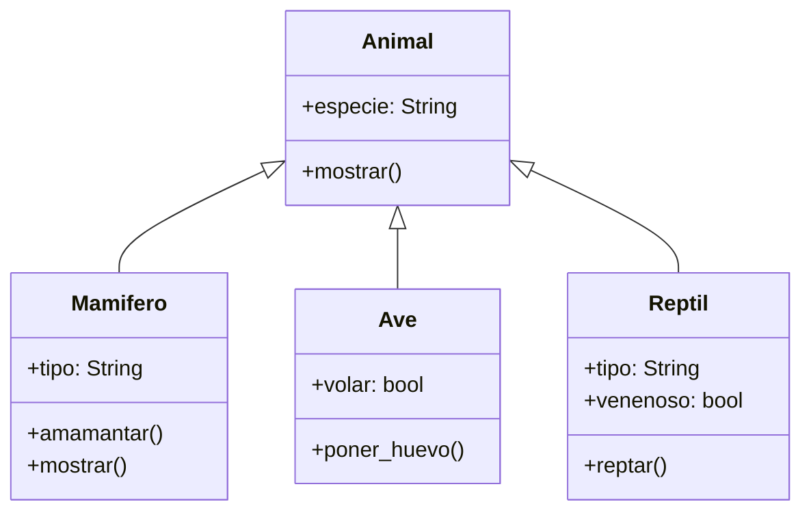
````

---

Diagrama de clases

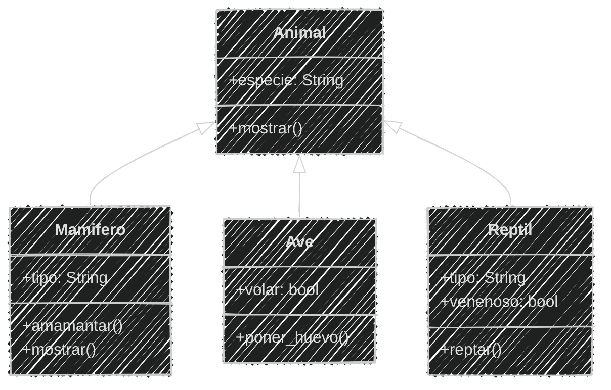
<!--.element class="center-mermaid"-->

---

Implementando el método mostrar() en el archivo `zoo.py`

```python [6-7|15-18|36|38-39,42-43]
# Definición
class Animal:
    def __init__(self, especie):
        self.especie = especie

    def mostrar(self): # Nuevo método
        print(f"Especie: {self.especie}")
class Mamifero(Animal):
    def __init__(self, especie, tipo):
        super().__init__(especie) # Constructor Padre
        self.tipo = tipo
    def amamantar(self):
        print(f"{self.especie} amamanta 🍼 a crías")

    def mostrar(self): # Método sobreescrito
        super().mostrar()
        print(f"Tipo: {self.tipo}")
        self.amamantar()

class Ave(Animal):
    def __init__(self, especie, volar):
        super().__init__(especie) 
        self.volar = volar
    def poner_huevo(self):
        print(f"{self.especie} pone huevos 🥚")

class Reptil(Animal):
    def __init__(self, especie, tipo, venenoso):
        super().__init__(especie)
        self.tipo = tipo
        self.venenoso = venenoso
    def reptar(self):
        print(f"{self.especie} se arrastra 🐍")
# Uso
caballo = Mamifero("Caballo", "Terrestre")
caballo.mostrar()
paloma = Ave("Paloma", True)
paloma.mostrar()
print(f"Puede volar:{paloma.volar}")
paloma.poner_huevo()
coco = Reptil("Cocodrilo", "Acuático", False)
coco.mostrar()
print(f"tipo:{coco.tipo}, venenoso:{coco.venenoso}")
coco.reptar()
```

---

Ejecución del código

```bash
python zoo.py
```

```text
Especie: Caballo
Tipo: Terrestre
Caballo amamanta 🍼 a crías
Especie: Paloma
Puede volar:True
Paloma pone huevos 🥚
Especie: Cocodrilo
tipo:Acuático, venenoso:False
Cocodrilo se arrastra 🐍
```

---
#### Ejercicio para ti (05)

En la carpeta **sesion05** modifica los archivos **herencia.md** y **zoo.py**

```markdown
En el catálogo digital del zoológico
Las aves tienen un método `mostrar()` que muestra
su especie y si pueden volar o no
Los reptiles tienen un método `mostrar()` que muestra
su especie, tipo y si son venenosos
```

Obtener el *Análisis*

2 Minutos

<iframe src="https://time-stuff.com/embed.html" frameborder="0" scrolling="no" width="391" height="140"></iframe>

---

Modificando el *Análisis*

```markdown [14,19|43,46]
# Análisis Mejorado
Requisitos:
- Registrar animales
- Almacenar información de especie
- Categorías principales mamíferos, aves y reptiles
- Los animales muestran su información
- Mamíferos son animales
- Mamíferos son terrestres o acuáticos
- Mamíferos pueden amamantar
- Mamíferos muestran su especie y tipo
- Aves son animales
- Aves pueden volar o no
- Aves pueden poner huevos
- Aves muestran su especie y si pueden volar
- Reptiles son animales
- Reptiles pueden ser terrestres o acuáticos
- Reptiles pueden ser venenosos o no
- Reptiles pueden reptar
- Reptiles muestran su especie, tipo y si son venenosos
Objetos:
- Animal (clase padre)
- Mamífero (clase hija)
- Ave (clase hija)
- Reptil (clase hija)
Características:
- Animal:
  - especie: String
- Mamífero:
  - tipo: String (terrestre, acuático)
- Ave:
  - volar: bool
- Reptil:
  - tipo: String (terrestre, acuático)
  - venenoso: bool
Acciones:
- Animal:
  - mostrar()
- Mamífero:
  - amamantar()
  - mostrar()
- Ave:
  - poner_huevo()
  - mostrar()
- Reptil:
  - reptar()
  - mostrar()
```

---

#### Ejercicio para ti (05)

Ahora obtenemos el diseño del *diagrama de clase*

2 minutos

<iframe src="https://time-stuff.com/embed.html" frameborder="0" scrolling="no" width="391" height="140"></iframe>

---

Creando el diseño de diagrama de clases

```` [15,21]
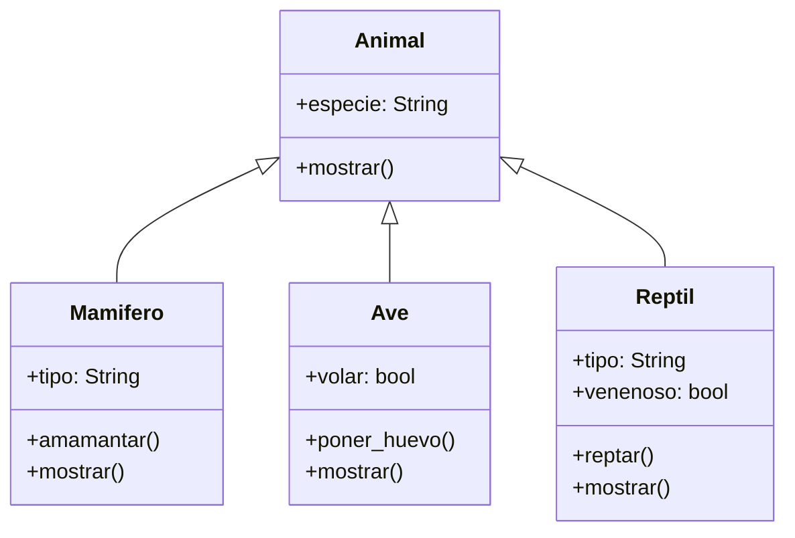
````

---

Creando el diseño de diagrama de clases

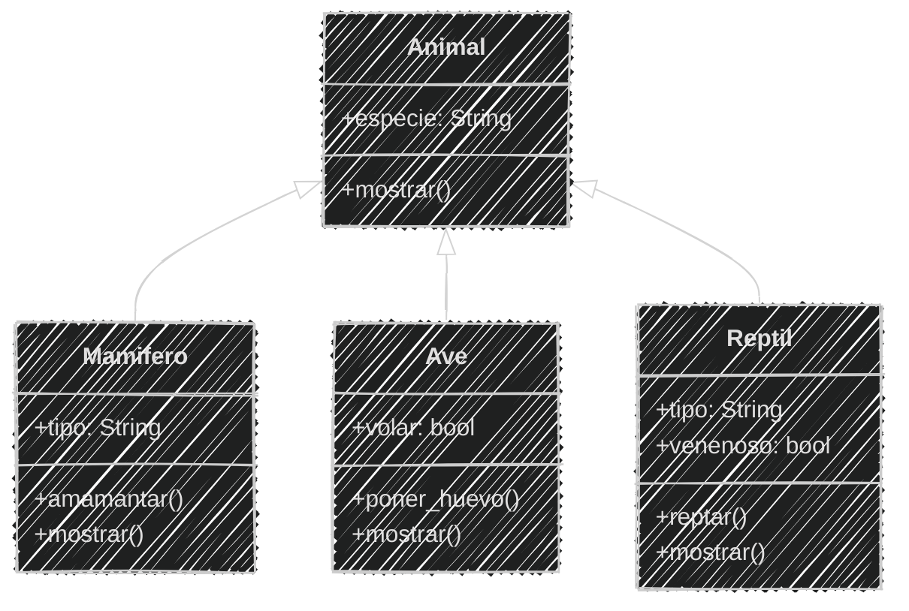
<!--.element class="center-mermaid"-->

---

#### Ejercicio para ti (05)

Ya tenemos el *análisis y diseño* de la clase

Ahora podemos **programar**

3 minutos

<iframe src="https://time-stuff.com/embed.html" frameborder="0" scrolling="no" width="391" height="140"></iframe>

---

Implementando en el archivo `zoo.py`

```python [15-18|27-30|40-43|47-50]
# Definición
class Animal:
    def __init__(self, especie):
        self.especie = especie

    def mostrar(self): # Nuevo método
        print(f"Especie: {self.especie}")
class Mamifero(Animal):
    def __init__(self, especie, tipo):
        super().__init__(especie) # Constructor Padre
        self.tipo = tipo
    def amamantar(self):
        print(f"{self.especie} amamanta 🍼 a crías")

    def mostrar(self):
        super().mostrar()
        print(f"Tipo: {self.tipo}")
        self.amamantar()

class Ave(Animal):
    def __init__(self, especie, volar):
        super().__init__(especie) 
        self.volar = volar
    def poner_huevo(self):
        print(f"{self.especie} pone huevos 🥚")
    
    def mostrar(self): # Método sobreescrito
        super().mostrar()  # Llamada al método del padre
        print(f"Puede volar: {self.volar}")
        self.poner_huevo()

class Reptil(Animal):
    def __init__(self, especie, tipo, venenoso):
        super().__init__(especie)
        self.tipo = tipo
        self.venenoso = venenoso
    def reptar(self):
        print(f"{self.especie} se arrastra 🐍")

    def mostrar(self): # Método sobreescrito
        super().mostrar()  # Llamada al método del padre
        print(f"Tipo: {self.tipo}, venenoso: {self.venenoso}")
        self.reptar()
# Uso
caballo = Mamifero("Caballo", "Terrestre")
caballo.mostrar()
paloma = Ave("Paloma", True)
paloma.mostrar()
coco = Reptil("Cocodrilo", "Acuático", False)
coco.mostrar()
```

---

Ejecución del código

```bash
python zoo.py
```

```text
Especie: Caballo
Tipo: Terrestre
Caballo amamanta 🍼 a crías
Especie: Paloma
Puede volar: True
Paloma pone huevos 🥚
Especie: Cocodrilo
Tipo: Acuático, venenoso: False
Cocodrilo se arrastra 🐍
```

---

#### Consulta de tipos de clase

En Python podemos preguntar si una **instancia** es de un tipo de clase específico

Para esto utilizamos los métodos 

`isinstance` y `issubclass`

Se utiliza de manera similar a `type`

---

#### isinstance()

`isinstance()` es una función que verifica si una instancia es de un tipo de clase específico

Se utiliza principalmente para verificar el tipo de instancia

---

Es una función incorporada en Python que recibe dos parámetros

1. La **instancia** que se desea verificar
2. La **clase o tipo** contra el cual se desea verificar la instancia

Devuelve un valor booleano (True o False)

La sintaxis es:

```python
isinstance(instancia, Clase)
```

---

Cuando se utiliza `isinstance()` sobre una instancia de una clase **hija**
también devuelve `True` si se verifica contra la clase **padre**

Esto es porque la clase hija hereda de la clase padre y por lo tanto **también es una instancia** de la clase padre

---

#### Ejemplo 06

```markdown
Verifica si la instancia `caballo`
es de tipo `Mamifero`, `Animal` y `Ave`
Utiliza `isinstance()` para realizar las verificaciones
después de instanciar los objetos
```

Modifica el archivo `zoo.py` en la carpeta **sesion05**

---

Verificando tipos con `isinstance()` en el archivo `zoo.py`

```python [51-57]
# Definición
class Animal:
    def __init__(self, especie):
        self.especie = especie

    def mostrar(self): # Nuevo método
        print(f"Especie: {self.especie}")
class Mamifero(Animal):
    def __init__(self, especie, tipo):
        super().__init__(especie) # Constructor Padre
        self.tipo = tipo
    def amamantar(self):
        print(f"{self.especie} amamanta 🍼 a crías")

    def mostrar(self):
        super().mostrar()
        print(f"Tipo: {self.tipo}")
        self.amamantar()

class Ave(Animal):
    def __init__(self, especie, volar):
        super().__init__(especie) 
        self.volar = volar
    def poner_huevo(self):
        print(f"{self.especie} pone huevos 🥚")
    
    def mostrar(self): # Método sobreescrito
        super().mostrar()  # Llamada al método del padre
        print(f"Puede volar: {self.volar}")
        self.poner_huevo()

class Reptil(Animal):
    def __init__(self, especie, tipo, venenoso):
        super().__init__(especie)
        self.tipo = tipo
        self.venenoso = venenoso
    def reptar(self):
        print(f"{self.especie} se arrastra 🐍")

    def mostrar(self): # Método sobreescrito
        super().mostrar()  # Llamada al método del padre
        print(f"Tipo: {self.tipo}, venenoso: {self.venenoso}")
        self.reptar()
# Uso
caballo = Mamifero("Caballo", "Terrestre")
caballo.mostrar()
paloma = Ave("Paloma", True)
paloma.mostrar()
coco = Reptil("Cocodrilo", "Acuático", False)
coco.mostrar()
# Uso isinstance()
caballo_es_mamifero = isinstance(caballo, Mamifero)
print("Caballo Es Mamifero: ", caballo_es_mamifero)
caballo_es_animal = isinstance(caballo, Animal)
print("Caballo Es Animal: ", caballo_es_animal)
caballo_es_ave = isinstance(caballo, Ave)
print("Caballo Es Ave: ", caballo_es_ave)
```

---

Ejecución del código

```bash
python zoo.py
```

```text	[10-12]
Especie: Caballo
Tipo: Terrestre
Caballo amamanta 🍼 a crías
Especie: Paloma
Puede volar: True
Paloma pone huevos 🥚
Especie: Cocodrilo
Tipo: Acuático, venenoso: False
Cocodrilo se arrastra 🐍
Caballo Es Mamifero:  True
Caballo Es Animal:  True
Caballo Es Ave:  False
```

---

#### issubclass()

`issubclass()` es una función que verifica si una clase es hija de otra clase

Se utiliza para **verificar la relación de herencia** entre clases

---

Es una función incorporada en Python que recibe dos parámetros

1. La **clase hija** que se desea verificar
2. La **clase padre** contra la cual se desea verificar la relación de herencia

Devuelve un valor booleano (True o False)

La sintaxis es:

```python
issubclass(ClaseHija, ClasePadre)
```

---

#### Ejemplo 07

```markdown
Verifica si la clase `Mamifero`
es subclase de `Animal` y `Ave`
Utiliza `issubclass()` para realizar las verificaciones
después de instanciar los objetos
```

Modificando el archivo `zoo.py` en la carpeta **sesion05**

---

Verificando tipos con `issubclass()` en el archivo `zoo.py`

```python [58-62]
# Definición
class Animal:
    def __init__(self, especie):
        self.especie = especie

    def mostrar(self): # Nuevo método
        print(f"Especie: {self.especie}")
class Mamifero(Animal):
    def __init__(self, especie, tipo):
        super().__init__(especie) # Constructor Padre
        self.tipo = tipo
    def amamantar(self):
        print(f"{self.especie} amamanta 🍼 a crías")

    def mostrar(self):
        super().mostrar()
        print(f"Tipo: {self.tipo}")
        self.amamantar()

class Ave(Animal):
    def __init__(self, especie, volar):
        super().__init__(especie) 
        self.volar = volar
    def poner_huevo(self):
        print(f"{self.especie} pone huevos 🥚")
    
    def mostrar(self): # Método sobreescrito
        super().mostrar()  # Llamada al método del padre
        print(f"Puede volar: {self.volar}")
        self.poner_huevo()

class Reptil(Animal):
    def __init__(self, especie, tipo, venenoso):
        super().__init__(especie)
        self.tipo = tipo
        self.venenoso = venenoso
    def reptar(self):
        print(f"{self.especie} se arrastra 🐍")

    def mostrar(self): # Método sobreescrito
        super().mostrar()  # Llamada al método del padre
        print(f"Tipo: {self.tipo}, venenoso: {self.venenoso}")
        self.reptar()
# Uso
caballo = Mamifero("Caballo", "Terrestre")
caballo.mostrar()
paloma = Ave("Paloma", True)
paloma.mostrar()
coco = Reptil("Cocodrilo", "Acuático", False)
coco.mostrar()
# Uso isinstance()
caballo_es_mamifero = isinstance(caballo, Mamifero)
print("Caballo Es Mamifero: ", caballo_es_mamifero)
caballo_es_animal = isinstance(caballo, Animal)
print("Caballo Es Animal: ", caballo_es_animal)
caballo_es_ave = isinstance(caballo, Ave)
print("Caballo Es Ave: ", caballo_es_ave)
# Uso issubclass()
mamifero_es_animal = issubclass(Mamifero, Animal)
print("Mamifero Es Animal: ", mamifero_es_animal)
mamifero_es_ave = issubclass(Mamifero, Ave)
print("Mamifero Es Ave: ", mamifero_es_ave)
```

---

Ejecución del código

```bash
python zoo.py
```

```text	[13-14]
Especie: Caballo
Tipo: Terrestre
Caballo amamanta 🍼 a crías
Especie: Paloma
Puede volar: True
Paloma pone huevos 🥚
Especie: Cocodrilo
Tipo: Acuático, venenoso: False
Cocodrilo se arrastra 🐍
Caballo Es Mamifero:  True
Caballo Es Animal:  True
Caballo Es Ave:  False
Mamifero Es Animal:  True
Mamifero Es Ave:  False
```

---

#### Herencia múltiple

En Python, una clase puede heredar de **múltiples** clases

Esto se conoce como herencia múltiple

Es útil cuando queremos **combinar varias clases** en una sola

---

Se define una clase hija que hereda de varias clases padre

```python
class ClaseHija(ClasePadre1, ClasePadre2):
    # Cuerpo de la clase
```

---

Hay que tener cuidado con la herencia múltiple 

porque puede generar *problemas de ambigüedad*

Si dos clases padre tienen un método con el 

*mismo nombre*

Python utilizará el método de la *1ra* clase padre en el orden de herencia

---

Cuando se llama al *constructor* de ambas clases se puede usar `super()`

Pero solo da prioridad a la primera clase de la que hereda

Se debe tener cuidado con el *orden* de herencia

---

Es importante definir un **constructor propio** en la clase hija

Y para llamar a los constructores de las clases padre se 

utiliza una llamada **explícita** a cada clase padre

```python
class ClaseHija(ClasePadre1, ClasePadre2):
    def __init__(self, args1, args2):
        ClasePadre1.__init__(self, args1)
        ClasePadre2.__init__(self, args2)
```

---

En la vida real existen herencias múltiples

Como el Limón

## 🍋

El limón no es una fruta **primaria**

---

#### Ejemplo 08

```markdown
Un agrónomo quiere registrar frutas cítricas
La naranja y la cidra son frutas primarias
Pero el limón no es una fruta primaria
El limón es la mezcla de la cidra y la naranja amarga
La cidra aporta el sabor ácido y la dureza de la cáscara
La naranja amarga aporta el sabor dulce y la jugosidad
```

  <!-- .element  width="15%"-->

En la carpeta **sesion05** crea los archivos `citricos.md` y `citricos.py`

---

Análisis

```markdown
# Análisis
Requisitos:
- La naranja y la cidra son frutas cítricas primarias
- El limón no es una fruta primaria
- El limón es una mezcla de la cidra y la naranja amarga
Objetos:
- Naranja (Clase Padre)
- Cidra (Clase Padre)
- Limón (hereda de Naranja y Cidra)
Características:
- Cidra:
  - acidez: String
  - cascara: String
- Naranja:
  - dulzura: String
  - jugosidad: String
- Limon:
  - (sin características)
Acciones:
- Cidra:
  - (sin acciones)
- Naranja:
  - (sin acciones)
- Limón:
  - (sin acciones)
```

---

Diseño Mermaid

````
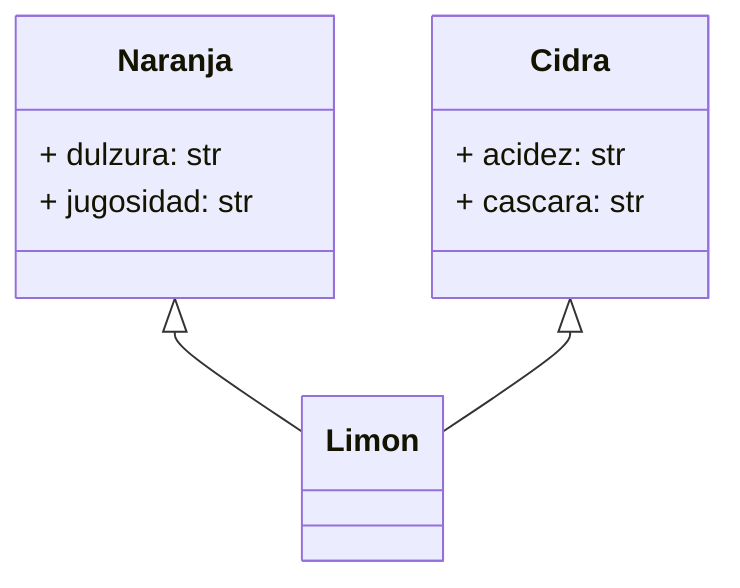
````

---
Diagrama

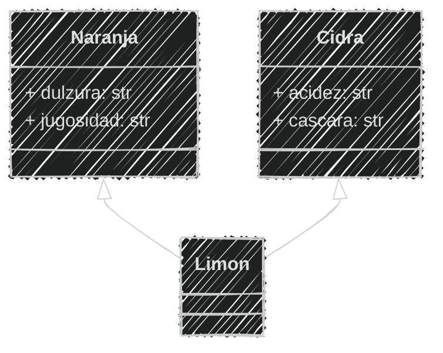

---

Implementando en el archivo `citricos.py`

```python [1-13|15-30]
# Definición
class Cidra():
    def __init__(self, acidez, cascara):
        self.acidez = acidez
        self.cascara = cascara
class Naranja():
    def __init__(self, dulzura, jugosidad):
        self.dulzura = dulzura
        self.jugosidad = jugosidad
class Limon(Cidra, Naranja):
    def __init__(self, acidez, cascara, dulzura, jugosidad):
        Cidra.__init__(self, acidez, cascara)
        Naranja.__init__(self, dulzura, jugosidad)

# Ejemplo de uso
cidra = Cidra("alta", "dura")
naranja = Naranja("media", "jugosa")
limon = Limon("alta", "dura", "baja", "media")

print(f"Cidra => Acidez: {cidra.acidez}")
print(f"Cáscara: {cidra.cascara}")


print(f"Naranja => Dulzura: {naranja.dulzura}")
print(f"Jugosidad: {naranja.jugosidad}")

print(f"Limón => Acidez: {limon.acidez}")
print(f"Cáscara: {limon.cascara}")
print(f"Dulzura: {limon.dulzura}")
print(f"Jugosidad: {limon.jugosidad}")
```

---

Ejecución del código


```bash
python citricos.py
```

```text
Cidra => Acidez: alta
Cáscara: dura
Naranja => Dulzura: media
Jugosidad: jugosa
Limón => Acidez: alta
Cáscara: dura
Dulzura: baja
Jugosidad: media
```

---

Subimos los avances de la sesión al repositorio en **GitHub**

```bash
git add .
git commit -m "Sesión 05"
git push origin main
```

---

#### Resumen

- La herencia es un concepto fundamental en la programación orientada a objetos que permite crear nuevas clases basadas en clases existentes, heredando sus atributos y métodos.
- La herencia facilita la reutilización de código, evita la duplicación y promueve la mantenibilidad.
- En los diagramas de clases, la herencia se representa con flechas que indican la relación entre clases padre e hija.
---

- Permite organizar las clases en jerarquías, facilitando la comprensión y el mantenimiento del código.
- En Python, la herencia se implementa indicando la clase padre entre paréntesis al definir la clase hija.
- Las clases hijas pueden tener sus propios métodos y atributos, además de los heredados.

---

- El método super() permite acceder a métodos y atributos de la clase padre desde la clase hija, útil para llamar al constructor del padre.
- Se puede personalizar el comportamiento de los métodos heredados redefiniéndolos en la clase hija.
- Las funciones isinstance() y issubclass() permiten verificar si un objeto es instancia de una clase o si una clase es subclase de otra, respectivamente.

---

- La herencia múltiple puede combinar características de varias clases en una sola, como en el ejemplo del limón que hereda de cidra y naranja.
- Python permite la herencia múltiple, donde una clase puede heredar de varias clases, pero se debe tener cuidado con el orden de herencia y posibles ambigüedades.

---

#### Retos

Crear una carpeta con el nombre "retos_sesion_05" dentro del proyecto en la raíz, en la cual por cada ejercicio debes crear los siguientes archivos:

```bash
# Estructura de carpetas
psg-oop-2025/
    sesion05/
    retos_sesion_05/
        ejercicio_01.md
        ejercicio_01.py
        ejercicio_02.md
        ejercicio_02.py
```

---

1. Una empresa de transporte desea simular el comportamiento de sus vehículos.

Cada **vehículo** tiene las siguientes características:  
- `velocidad`: Es un dato protegido. Puede consultarse, pero solo modificarse mediante acciones específicas.  
- `medio`: Indica el tipo de entorno en el que se desplaza (por ejemplo, *terrestre*, *acuático*, *aéreo*). Puede consultarse y modificarse libremente.  

*(1/3)*

---

Existen dos tipos de vehículos:  
- **Bicicleta**, que puede incrementar su velocidad mediante la acción de `pedalear`.  
- **Avión**, que puede incrementar su velocidad mediante la acción de `volar`.  

Ambas clases deben heredar de la clase base `Vehiculo` y respetar las reglas de encapsulamiento.  

*(2/3)*

---

- Realiza el análisis y el diagrama de clases de la clase `Vehiculo` y sus subclases `Bicicleta` y `Avion` en el archivo `ejercicio_01.md`.
- Escribe el código en Python para las clases `Vehiculo`, `Bicicleta` y `Avion` en el archivo `ejercicio_01.py`.
- Aplica **herencia** de manera adecuada.

*(3/3)*

---

2. Creación de clases para un videojuego de aventura con habilidades especiales

Estás desarrollando un **videojuego tipo aventura**, donde los personajes tiene distintas **habilidades**

Cada personaje pertenece a una o más clases que definen sus comportamientos:  
- `Nadador`: Posee el método `nadar()`, que representa la acción de desplazarse en el agua.  
- `Volador`: Posee el método `volar()`, que representa la acción de desplazarse por el aire.  

*(1/3)*

---

Existen tres tipos de personajes en el juego:  
- **Pez**, que hereda de `Nadador`.  
- **Pájaro**, que hereda de `Volador`.  
- **Pato**, que hereda de ambas clases (`Nadador` y `Volador`).  

Cada clase debe implementar un método `mostrar()` que indique el **tipo de personaje** y su **habilidad principal o combinada**.  

*(2/3)*

---

- Realiza el **análisis y diagrama de clases** de las clases `Nadador`, `Volador`, `Pez`, `Pajaro` y `Pato` en el archivo `ejercicio_02.md`.
- Escribe el **código en Python** correspondiente en el archivo `ejercicio_02.py`.
- Aplica **herencia múltiple** de manera adecuada.
- Utiliza un método `mostrar()` en cada clase para identificar al personaje y sus habilidades.

*(3/3)*

    
---
<!-- .slide: data-background-image="../../content/psg-bg-dark.png" data-background-size="100%"-->

<br>
<br>
<br>
<br>
<br>

[ <!-- .element width="20%"-->](https://github.com/python-la-paz/python-study-group-oop/tree/main/content/sesion05)

Repositorio de la Sesión

---
<!--.slide: data-visibility="hidden"-->
## Bibliografía y Referencias

- [Herencia](https://concepto.de/herencia/)
- [Programación orientada a objetos: herencia y sus beneficios](https://programacionpro.com/programacion-orientada-a-objetos-herencia-y-sus-beneficios/)
- [Python super()](https://www.geeksforgeeks.org/python-super/)
- [Python Mixin](https://www.pythontutorial.net/python-oop/python-mixin/)
- [Python super() function](https://docs.python.org/3/library/functions.html#super)
- [Method Overriding in Python](https://www.geeksforgeeks.org/method-overriding-in-python/)
- [isinstance() function](https://docs.python.org/3/library/functions.html#isinstance)
- [Python Tutorial - Multiple Inheritance](https://docs.python.org/3/tutorial/classes.html#multiple-inheritance)
- [Herencia múltiple](https://www.geeksforgeeks.org/multiple-inheritance-in-python/)
- [Object Oriented Analysis](https://www.gyata.ai/es/object-oriented-programming/object-oriented-analysis)
- [Python OOP](https://www.learnpython.org/en/Classes_and_Objects)
- [Atributos de clase](https://oregoom.com/python/atributos-clase/)
- [Diagrama de clases](https://diagramasuml.com/diagrama-de-clases/)
- [Guía PEP 8](https://peps.python.org/pep-0008/#class-names)
- [Mermaid Charts](https://www.mermaidchart.com/play)
- [Draw.io](https://app.diagrams.net/)
- [Python 3 Object-oriented Programming, Second Edition, Dusty PhillipsDusty Phillips](https://github.com/PacktPublishing/Python-3-Object-Oriented-Programming-Second-Edition)
- [Objetos en programación](https://ebac.mx/blog/objeto-en-programacion)
- [Enfoque orientado a objetos](https://1library.co/article/enfoque-orientado-a-objetos-base-te%C3%B3rica.qvld461y)
- [OOAD](https://www.tutorialspoint.com/object_oriented_analysis_design/ooad_object_oriented_analysis.htm)