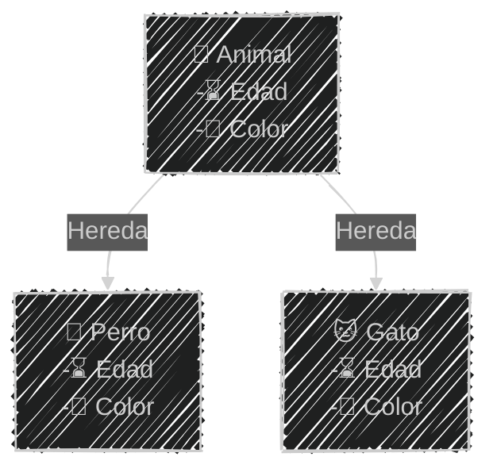
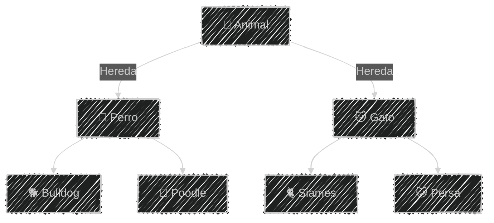
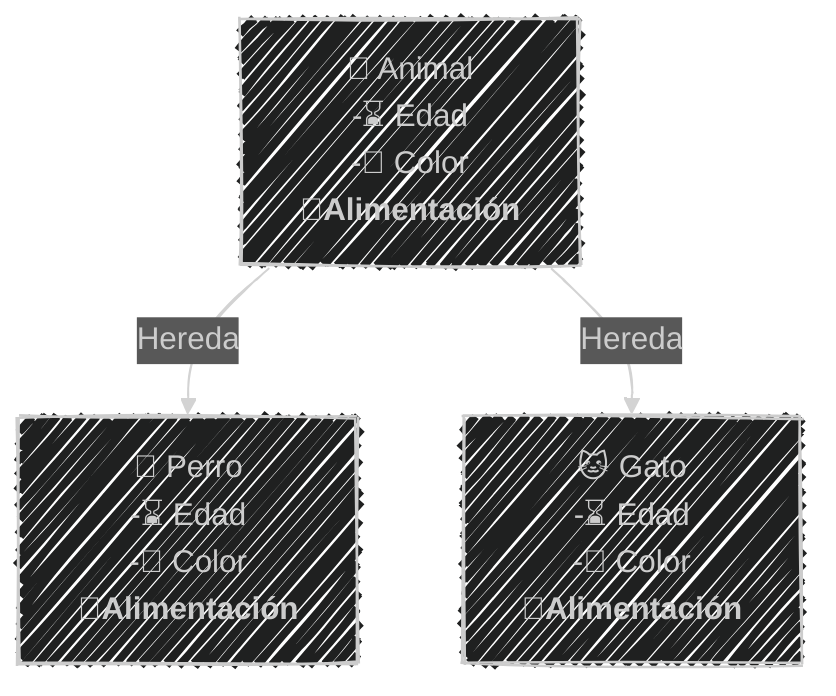
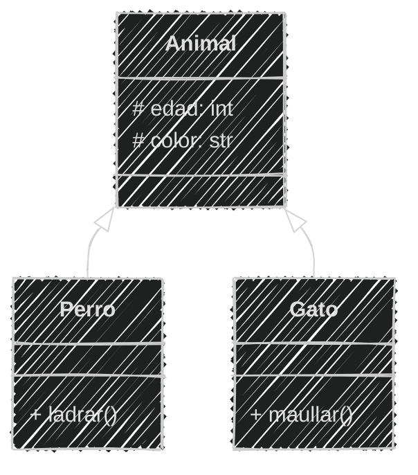
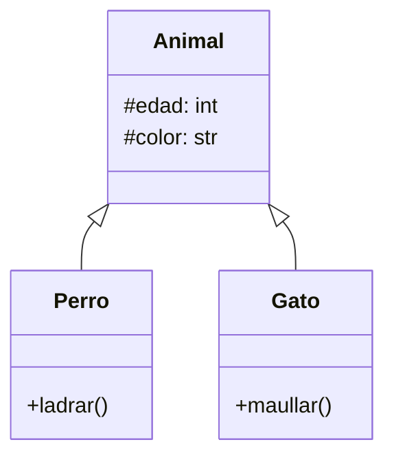
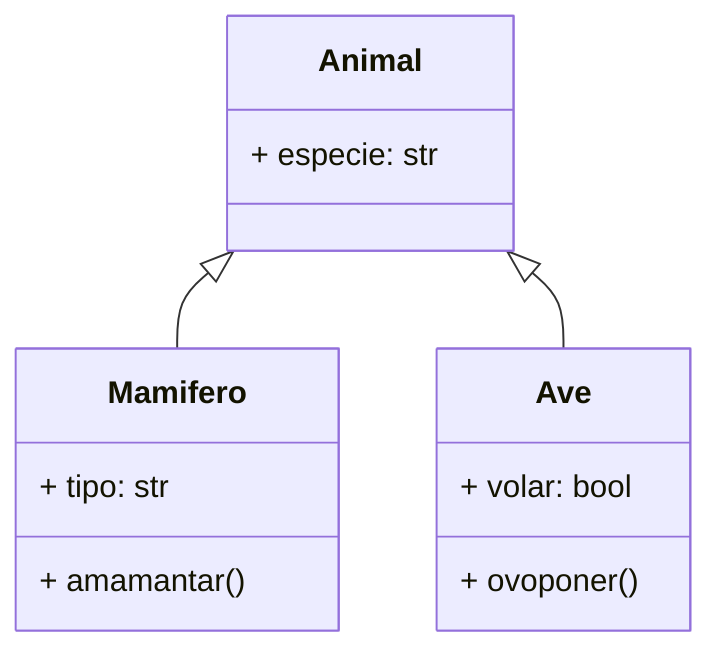
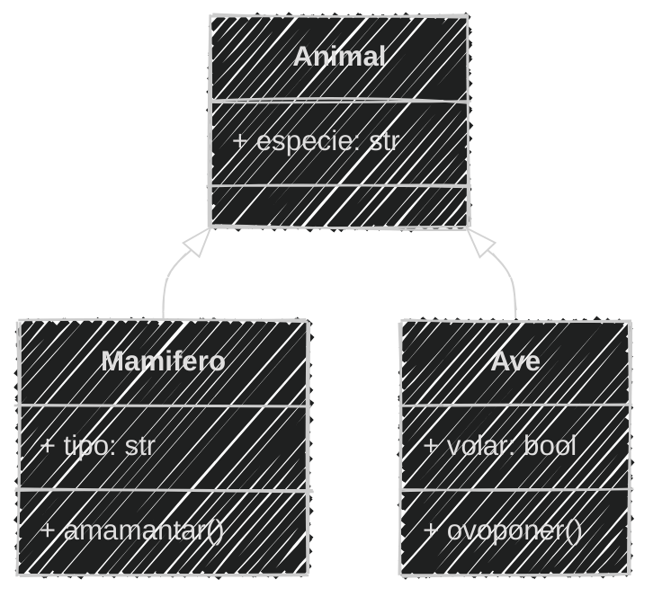

<!-- .slide: data-background-image="../../content/psg-bg-dark.png" data-background-size="100%"-->
 <!-- .element  hidden="true" -->

<br>
<br>
<br>

### Sesión  05
#### Herencia y Composición
#### Relaciones y reutilización de objetos


---

#### VS Code

Abrimos el proyecto del Study Group

```bash
code psg-oop-2025
```

Creamos una carpeta llamada `sesion05` dentro del proyecto

```bash
mkdir sesion05
cd sesion05
```

Aquí guardaremos los ejemplos de la sesión

---

#### Herencia

¿Qué es la herencia?

---

La herencia es la transmisión de las características de los progenitores a sus descendientes

# 👨‍👦 👩‍👧

---

La herencia es un concepto fundamental en la programación orientada a objetos

Permite crear nuevas clases basadas en clases existentes, heredando sus atributos y métodos

---

#### Beneficios de la herencia

- **Reutilización de código**: Al heredar atributos y métodos de una clase base, se evita la duplicación de código y se promueve la reutilización.



---

#### Beneficios de la herencia
- **Jerarquía de clases**: Permite organizar las clases en una jerarquía, facilitando la comprensión y el mantenimiento del código.



---

#### Beneficios de la herencia
- **Mantenibilidad**: Al modificar la clase base, los cambios se propagan automáticamente a las clases derivadas, lo que facilita el mantenimiento del código.



---
#### Herencia y niveles de acceso

- **Público**: Los atributos y métodos se heredan, y son accesibles desde fuera de las clases
- **Protegido**: Los atributos y métodos se heredan, pero no son accesibles directamente desde fuera de las clases
- **Privado**: Los atributos y métodos no se heredan, y no son accesibles desde fuera de las clases

---

Para acceder a los atributos privados o protegidos se recomienda utilizar métodos de acceso (getters y setters)

---

#### Diagrama de clases

La herencia se representa en un diagrama de clases con una flecha `➡` que apunta desde la clase hija hacia la clase padre



---

En mermaid, la herencia se representa con la sintaxis

`Animal <|-- Perro`

donde `Animal` es clase padre y `Perro` es clase hija

````

````

---

#### Herencia en Python

La herencia se implementa utilizando paréntesis para indicar cual es la clase padre

```python
class Animal:
    def __init__(self, edad, color):
        self.edad = edad
        self.color = color

class Perro(Animal): # Hereda de Animal
    def ladrar(self):
        print("¡Guau!")

class Gato(Animal): # Hereda de Animal
    def maullar(self):
        print("¡Miau!")
```

---

Los atributos de Animal se heredan en Perro y Gato

```python [1-11|13-23]
# Definición
class Animal:
    def __init__(self, edad, color):
        self.edad = edad
        self.color = color
class Perro(Animal): # Hereda de Animal
    def ladrar(self):
        print("¡Guau!")
class Gato(Animal): # Hereda de Animal
    def maullar(self):
        print("¡Miau!")

# Uso
fido = Perro(5, "marrón")
print(fido.edad)  # Heredado
print(fido.color)  # Heredado
fido.ladrar() # Método de la clase Perro

michi = Gato(3, "blanco")
print(michi.edad)  # Heredado
print(michi.color)  # Heredado
michi.maullar() # Método de la clase Gato
```

```
5
marrón
¡Guau!
3
blanco
¡Miau!
```

---

#### Ejemplo 01

Crea los archivos **ejemplo01.md** y **ejemplo01.py** en la carpeta **sesion05**

```markdown
Un zoológico tiene un catálogo de especies mamíferos y aves
Todos los animales tienen una especie
Los mamíferos son terrestres o acuáticos 
y pueden amamantar a sus crías
Las aves ponen huevos y no todas pueden volar
```

---

Análisis

```markdown [1-25|4,12,15]
# Análisis
Requisitos:
- Generar especies mamíferos y aves
- Almacenar información de especie
- Los mamíferos son terrestres o acuáticos
- Las aves pueden volar o no
Objetos:
- Mamífero
- Ave
Características:
- Mamífero:
  - especie: String
  - tipo: String (terrestre, acuático)
- Ave:
  - especie: String
  - volar: bool
Acciones:
- Mamífero:
  - amamantar()
- Ave:
  - ovoponer()
```

---
Análisis mejorado sin repetición

```markdown [1-26|8,12-13,19-20|9-10,14-17,21-24]
# Análisis Mejorado
Requisitos:
- Generar especies mamíferos y aves
- Almacenar información de especie
- Los mamíferos son terrestres o acuáticos
- Las aves pueden volar o no
Objetos:
- Animal (clase padre)
- Mamífero (hereda de Animal)
- Ave (hereda de Animal)
Características:
- Animal:
  - especie: String
- Mamífero:
  - tipo: String (terrestre, acuático)
- Ave:
  - volar: bool
Acciones:
- Animal:
  - (sin acciones)
- Mamífero:
  - amamantar()
- Ave:
  - ovoponer()
```

---

Diseño Mermaid

````

````

---

Diseño Diagrama



---

Script en python ejemplo01.py

```python [2-4|5-7|8-10|12-15|16-19]
# Definición
class Animal:
    def __init__(self, especie):
        self.especie = especie
class Mamifero(Animal):
    def amamantar(self):
        print(f"{self.especie} amamanta 🍼 a sus crías")
class Ave(Animal):
    def ovoponer(self):
        print(f"{self.especie} pone huevos 🥚")
# Uso
caballo = Mamifero("Caballo")
caballo.tipo = "Terrestre"
print(f"Especie: {caballo.especie} - Tipo: {caballo.tipo}")
caballo.amamantar()
paloma = Ave("Paloma")
paloma.volar = True
print(f"Especie: {paloma.especie} - Puede volar: {paloma.volar}")
paloma.ovoponer()
```

```bash
python ejemplo01.py
```

```text
Especie: Caballo - Tipo: Terrestre
Caballo amamanta 🍼 a sus crías
Especie: Paloma - Puede volar: True
Paloma pone huevos 🥚
```

---


Crear una carpeta con el nombre "retos_sesion_01" dentro del proyecto en la raíz, en la cual por cada ejercicio debes crear los siguientes archivos:

```bash
# Estructura de carpetas
psg-oop-2025/
    sesion01/
        ejemplo01.txt
        ejemplo02.txt
        ejemplo03.txt
        ejemplo04.txt
        ejemplo05.txt
        ejemplo06.txt
        ejemplo07.md
        ejemplo08.md
    retos_sesion_01/
        ejercicio_01.md
        ejercicio_02.md
        ejercicio_03.md
```

---

1. Crear un archivo llamado `ejercicio_01.md` en la carpeta retos_sesion_01 y hacer:

    - análisis y diseño

    Para lo siguiente:

    ```text
    Un restaurante quiere ofrecer hamburguesas
    Los clientes pueden elegir entre hamburguesa de res, pollo
    o vegetariana.
    Agregar lechuga, tomate, cebolla y mayonesa como extras
    Y comer en el restaurante o para llevar
    ```


---
2. Crear un archivo llamado `ejercicio_02.md` en la carpeta retos_sesion_01 y hacer:
    
    - análisis y diseño

    Para lo siguiente:

    ```text
    Una tienda de ropa quiere ofrecer camisetas y pantalones
    Los clientes pueden elegir entre camiseta
    de manga corta o larga y pantalón de mezclilla o tela
    Las camisetas pueden ser de Color rojo, azul o verde
    y los pantalones de Color negro, gris o blanco
    Las camisetas pueden ser tener talas: S, M, L, XL
    Los pantalones tienen desde la talla 32 hasta la talla 44
    ```

---
3. Crear un archivo llamado `ejercicio_03.md` en la carpeta retos_sesion_01 y hacer:
    
    - análisis y diseño

    Para lo siguiente

    ```text
        Estas diseñando una app para dibujar de perros con IA 
        los usuarios pueden seleccionar características como la
        raza del perro como labrador, pastor alemán, y otros
        Cambiar el Color del pelaje, tamaño y tipo de orejas  
        Agregar dos accesorios como sombreros o gafas
        El dibujo final puede ser descargado en PNG o JPG
    ```

    
---
<!-- .slide: data-background-image="../../content/psg-bg-dark.png" data-background-size="100%"-->

<br>
<br>
<br>
<br>
<br>

[ <!-- .element width="20%"-->](https://github.com/python-la-paz/python-study-group-oop/content/sesion01)

Repositorio de la Sesión

---
<!--.slide: data-visibility="hidden"-->
## Bibliografía y Referencias

- [Object Oriented Analysis](https://www.gyata.ai/es/object-oriented-programming/object-oriented-analysis)
- [DDOO Unidad 1](https://dmd.unadmexico.mx/contenidos/DCEIT/BLOQUE1/DS/02/DDOO/U1/descargables/DDOO_Unidad_1.pdf)
- [Programación procedural VS orientada a objetos](https://programacionpro.com/programacion-procedural-vs-orientada-a-objetos-diferencias-y-similitudes/)
- [Python OOP](https://www.learnpython.org/en/Classes_and_Objects)
- [Atributos de clase](https://oregoom.com/python/atributos-clase/)
- [Diagrama de clases](https://diagramasuml.com/diagrama-de-clases/)
- [Guía PEP 8](https://peps.python.org/pep-0008/#class-names)
- [Mermaid Charts](https://www.mermaidchart.com/play)
- [Draw.io](https://app.diagrams.net/)
- [Python 3 Object-oriented Programming, Second Edition, Dusty PhillipsDusty Phillips](https://github.com/PacktPublishing/Python-3-Object-Oriented-Programming-Second-Edition)
- [Objetos en programación](https://ebac.mx/blog/objeto-en-programacion)
- [Enfoque orientado a objetos](https://1library.co/article/enfoque-orientado-a-objetos-base-te%C3%B3rica.qvld461y)
- [OOAD](https://www.tutorialspoint.com/object_oriented_analysis_design/ooad_object_oriented_analysis.htm)

https://concepto.de/herencia/
https://programacionpro.com/programacion-orientada-a-objetos-herencia-y-sus-beneficios/