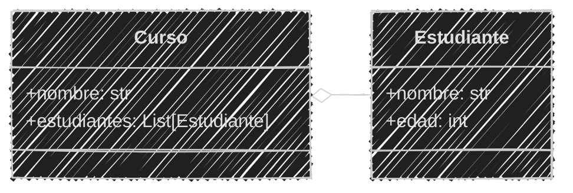
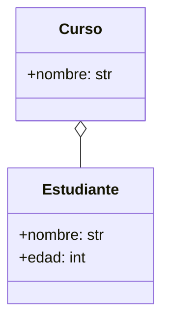
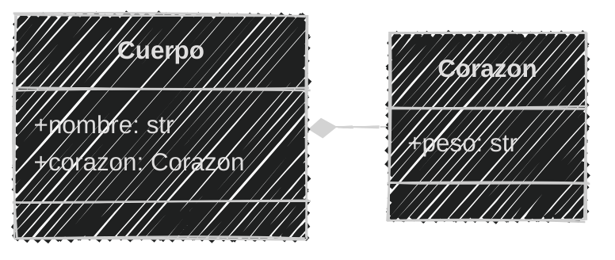
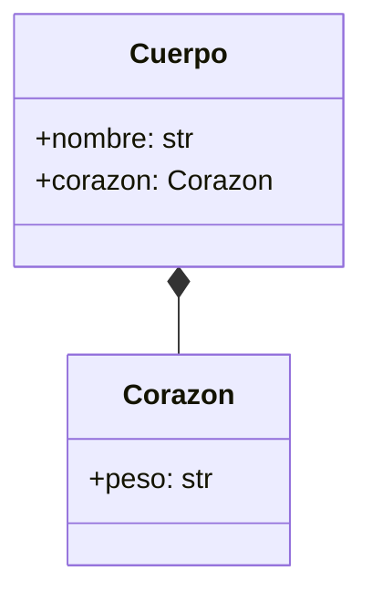
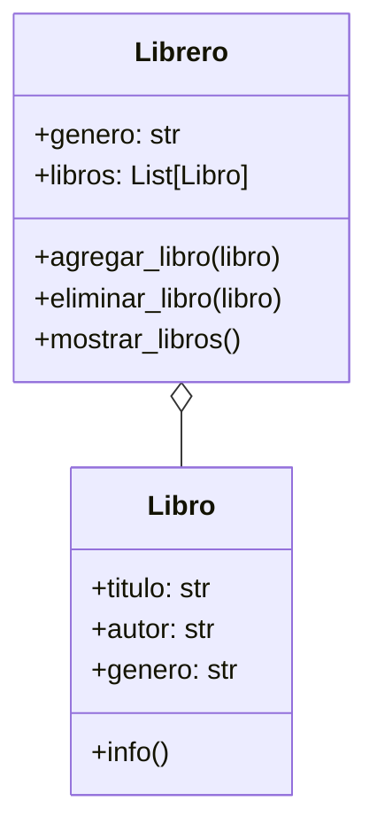
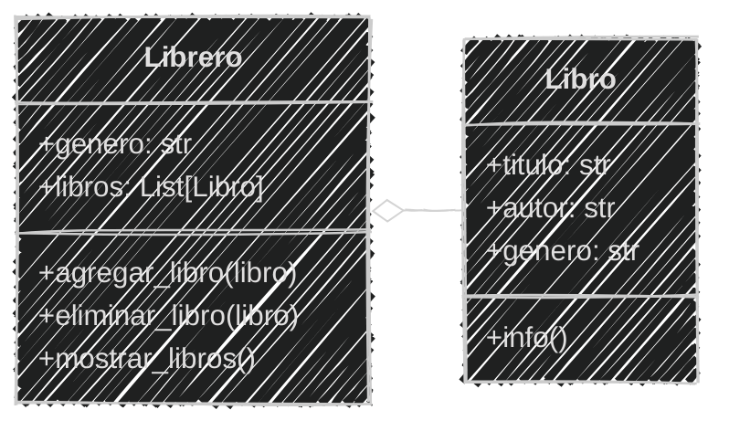

<!-- .slide: data-background-image="../../content/psg-bg-dark.png" data-background-size="100%"-->
 <!-- .element  hidden="true" -->

<br>
<br>
<br>

### Sesión  06
#### Agrupación y Composición
#### Relaciones entre objetos

---

#### VS Code

Abrimos el proyecto del Study Group

```bash
code psg-oop-2025
```

Creamos una carpeta llamada `sesion06` dentro del proyecto

```bash
mkdir sesion06
cd sesion06
```

Aquí guardaremos los ejemplos de la sesión

---
#### Asociación

¿Qué es una asociación?

---

En el mundo real una asociación es una relación entre dos o más personas u objetos

Para colaborar y llegar a un fin común

# 👨‍🎓 🤝 👩‍🏫

---

Es una de las formas más poderosas de entender, aprender y adaptarnos al mundo

Los humanos hacemos agrupaciones y composiciones para construir y controlar mejor nuestro entorno

---

> La unión es la fuerza

 <!-- .element width="50%"-->

---

En programación, una asociación es una relación entre dos o más clases que permite que se comuniquen entre sí

---

Existen dos tipos de asociación:

- **Agregación**: relación "tiene un" (has-a)
- **Composición**: relación "es parte de" (is-a-part-of)

---

#### Agregación

La agregación es un tipo de asociación que indica que una clase tiene una relación con otra

Es una relación débil porque el objeto agregado puede existir independientemente del objeto que lo contiene

---

#### Agregación

Una clase de estudiantes, los alumnos forman parte de la clase, pero pueden irse y siguen existiendo.

## 🏫 👨‍🏫 👩‍🎓 👨‍🎓 👨‍🎓 👩‍🎓 

---

#### Composición

La composición es un tipo de asociación que indica que una clase es parte de otra

Es una relación fuerte porque el objeto compuesto no puede existir sin el otro objeto

---

Un cuerpo humano, los órganos como el corazón, los pulmones, etc. forman parte del cuerpo, pero no pueden existir sin él

## 🧠 + ❤️ + 💀 + 🦴 + 👁️ = 🧍

---
#### Diferencias entre Agregación y Composición

| Característica | Agregación                       | Composición                         |
| -------------- | -------------------------------- | ----------------------------------- |
| Relación       | Débil                            | Fuerte                              |
| Ciclo de vida  | Independiente                    | Dependiente                         |
| Existencia     | Puede existir sin el otro objeto | No puede existir sin el otro objeto |

---

#### Diagrama de clases

En un diagrama de clases, la agregación se representa con una línea con un rombo vacío, la línea inicia en la clase contenida

y termina con el rombo en la clase que agrega



---

#### Diagrama en mermaid

Se utiliza la notación `o--` para la agregación

`"o"`  es el carácter que representa el rombo vacío

`"--"` es la línea que conecta las dos clases

````

````

---

En un diagrama de clases, la composición se representa con una línea con un rombo lleno, la línea inicia en la clase compuesta

y termina con el rombo en la clase que es parte de la composición



---
#### Diagrama en mermaid
Se utiliza la notación `*--` para la composición

`"*"` es el carácter que representa el rombo lleno

`"--"` es la línea que conecta las dos clases

````

````

---
#### En Python

En Python, la agregación y la composición se implementan utilizando atributos

Se declara una clase que contiene otra clase como un atributo

---

#### Agregación en Python 

agregacion.py

```python [1-5|7-21|22-26]
# Definición
class Estudiante:
    def __init__(self, nombre, edad):
        self.nombre = nombre
        self.edad = edad

class Curso:
    def __init__(self, nombre):
        self.nombre = nombre
        self.estudiantes = []  # Lista de estudiantes

    def agregar_estudiante(self, estudiante):
        self.estudiantes.append(estudiante)
    
    def ver(self):
        print(f"Curso: {self.nombre}")
        print("Estudiantes:")
        for estudiante in self.estudiantes:
            nombre = estudiante.nombre
            edad = estudiante.edad
            print(f"Nombre: {nombre}, Edad: {edad}")
# Uso
curso = Curso("Matemáticas")
estudiante1 = Estudiante("Juan", 20)
curso.agregar_estudiante(estudiante1)
curso.ver()
```

```text
Curso: Matemáticas
Estudiantes:
Nombre: Juan, Edad: 20
``` 

---

#### Composición en Python

composicion.py

```python [1-4|6-13|15-17]
# Definición
class Corazon:
    def __init__(self, peso):
        self.peso = peso

class Cuerpo:
    def __init__(self, nombre, corazon_peso):
        self.nombre = nombre
        self.corazon = Corazon(corazon_peso)  # Composición
    
    def ver(self):
        print(f"Cuerpo: {self.nombre}")
        print(f"Corazón: Peso {self.corazon.peso} kg")

# Uso
cuerpo = Cuerpo("Humano", 0.3)
cuerpo.ver()
```

```text
Cuerpo: Humano
Corazón: Peso 0.3 kg
```

---
Practiquemos un poco de los siguientes ejemplos identificar si es `agregación` o `composición`

---

1. Una persona cuenta con múltiples órganos. Estos no pueden existir fuera de la persona.

¿Qué tipo de relación es esta?

A. Agregación 

B. Composición

> Respuesta: B. Composición  <!-- .element class="fragment" data-fragment-index="2"-->

---
2. Una biblioteca tiene muchos libros. Los libros pueden ser trasladados a otra biblioteca o incluso prestarse.

¿Qué tipo de relación es esta?

A. Agregación

B. Composición

> Respuesta: A. Agregación  <!-- .element class="fragment" data-fragment-index="2"-->

---

3. Un coche no puede funcionar sin su motor. El motor es una parte esencial del coche.

¿Qué tipo de relación es esta?

A. Agregación

B. Composición

> Respuesta: B. Composición  <!-- .element class="fragment" data-fragment-index="2"-->

---

4. Un equipo de fútbol está formado por varios jugadores. Pueden pertenecer a varios equipos.

¿Qué tipo de relación es esta?

A. Agregación

B. Composición

> Respuesta: A. Agregación <!-- .element class="fragment" data-fragment-index="2"-->

---

5. Una casa está compuesta por varias habitaciones. Si la casa es destruida, sus habitaciones también dejan de existir.

¿Qué tipo de relación es esta?

A. Agregación

B. Composición

> Respuesta: B. Composición <!-- .element class="fragment" data-fragment-index="2"-->

---

6. Un músico tiene varios instrumentos. Puede prestar, venderlos o dejar de usarlos

¿Qué tipo de relación es esta?

A. Agregación

B. Composición

> Respuesta: A. Agregación <!-- .element class="fragment" data-fragment-index="2"-->

---

7. Un examen está compuesto por múltiples preguntas. Si se elimina el examen, las preguntas ya no se usan.

¿Qué tipo de relación es esta?

A. Agregación

B. Composición

> Respuesta: B. Composición <!-- .element class="fragment" data-fragment-index="2"-->

---

8. Un minibus puede tener varios pasajeros y cada pasajero puede tomar otros minibuses durante el día

¿Qué tipo de relación es esta?

A. Agregación

B. Composición

> Respuesta: A. Agregación <!-- .element class="fragment" data-fragment-index="2"-->

---

9. Bolivia tiene 9 departamentos, si un departamento es eliminado ya no seguiría existiendo Bolivia

¿Qué tipo de relación es esta?

A. Agregación

B. Composición

> Respuesta: B. Composición <!-- .element class="fragment" data-fragment-index="2"-->

---

10. Un libro tiene varias páginas, si se quita una página el libro ya no se encuentra completo

¿Qué tipo de relación es esta?

A. Agregación

B. Composición

> Respuesta: B. Composición <!-- .element class="fragment" data-fragment-index="2"-->

---

#### Ejemplo 01

```markdown
Una biblioteca guarda la siguiente información de sus libros
el título, autor y género
Los libros están ordenados en libreros por género, y se puede
agregar o eliminar libros de cada librero

Actualmente existen 2 géneros: 
- Cocina
- Arte
Y los libros de cada uno de estos géneros
son:
- Cocina
  - Cocina Criolla Boliviana, Daniel Figliuzzi
  - Gran libro cocina Boliviana, Jaime Cisneros
- Arte
  - Arte textil y mundo andino, Teresa Gisbert
  - Arte contemporáneo en Bolivia, Galería Altamira
```

¿Qué tipo de relación tienen los libros con el librero?

>Respuesta: Agregación <!-- .element class="fragment" data-fragment-index="2"-->

---

Un libro puede existir sin el librero y el librero puede existir sin los libros

Tienen una relación débil

### 📗📕📘📙 ➡ 📚

---
Crear el archivo `ejemplo_01.md` y `ejemplo_01.py` en la carpeta `sesion06`

```markdown
# Análisis
Requisitos:
- Guardar información de libros (título, autor, género)
- Organizar libros por género en libreros
- Mostrar libros de cada librero 
- Mostrar la información de un libro
Objetos:
- Librero
- Libro
Características:
- Libro:
    - título: String
    - autor: String
    - género: String
- Librero:
  - género: String
  - libros: List[Libro]
Acciones:
- Librero:
  - agregar_libro(libro)
  - eliminar_libro(libro)
  - mostrar_libros()
- Libro:
  - info()
```

---

#### Diagrama de clases
````

````



---

#### Implementación en Python

```python [2-11|12-30|33-38|40-45|47-49]
# Definición
class Libro:
    def __init__(self, titulo, autor, genero):
        self.titulo = titulo
        self.autor = autor
        self.genero = genero

    def info(self):
        print (f"Título: {self.titulo} \
                \nAutor: {self.autor} \
                \nGénero: {self.genero}")
class Librero:
    def __init__(self, genero):
        self.genero = genero
        self.libros = []  # Lista de libros

    def agregar_libro(self, libro):
        self.libros.append(libro)
    
    def eliminar_libro(self, libro):
        if libro in self.libros:
            print(f"❌ Libro eliminado: {libro.titulo}")
        else:
            print("El libro no está en el librero")
        self.libros.remove(libro)
    
    def mostrar_libros(self):
        print(f"📘 Librero de género: {self.genero}")
        for libro in self.libros:
            libro.info()

# Uso
librero_cocina = Librero("Cocina")
libro1 = Libro("Cocina Criolla Boliviana", "Daniel Figliuzzi", "Cocina")
libro2 = Libro("Gran libro cocina Boliviana", "Jaime Cisneros", "Cocina")
librero_cocina.agregar_libro(libro1)
librero_cocina.agregar_libro(libro2)
librero_cocina.mostrar_libros()

librero_arte = Librero("Arte")
libro3 = Libro("Arte textil y mundo andino", "Teresa Gisbert", "Arte")
libro4 = Libro("Arte contemporáneo en Bolivia", "Galería Altamira", "Arte")
librero_arte.agregar_libro(libro3)
librero_arte.agregar_libro(libro4)
librero_arte.mostrar_libros()

librero_cocina.eliminar_libro(libro1)
librero_cocina.mostrar_libros()
libro1.info()
```
---

```text
📘 Librero de género: Cocina
Título: Cocina Criolla Boliviana                 
Autor: Daniel Figliuzzi                 
Género: Cocina
Título: Gran libro cocina Boliviana                 
Autor: Jaime Cisneros                 
Género: Cocina
📘 Librero de género: Arte
Título: Arte textil y mundo andino                 
Autor: Teresa Gisbert                 
Género: Arte
Título: Arte contemporáneo en Bolivia                 
Autor: Galería Altamira                 
Género: Arte
❌ Libro eliminado: Cocina Criolla Boliviana
📘 Librero de género: Cocina
Título: Gran libro cocina Boliviana                 
Autor: Jaime Cisneros                 
Género: Cocina
Título: Cocina Criolla Boliviana                 
Autor: Daniel Figliuzzi                 
Género: Cocina
```


---


<!-- .slide: data-background-image="../../content/psg-bg-dark.png" data-background-size="100%"-->

<br>
<br>
<br>
<br>
<br>

[ <!-- .element width="20%"-->](https://github.com/python-la-paz/python-study-group-oop/content/sesion06)

Repositorio de la Sesión

---
<!--.slide: data-visibility="hidden"-->
## Bibliografía y Referencias

- [Object Oriented Analysis](https://www.gyata.ai/es/object-oriented-programming/object-oriented-analysis)
- [DDOO Unidad 1](https://dmd.unadmexico.mx/contenidos/DCEIT/BLOQUE1/DS/02/DDOO/U1/descargables/DDOO_Unidad_1.pdf)
- [Programación procedural VS orientada a objetos](https://programacionpro.com/programacion-procedural-vs-orientada-a-objetos-diferencias-y-similitudes/)
- [Python OOP](https://www.learnpython.org/en/Classes_and_Objects)
- [Atributos de clase](https://oregoom.com/python/atributos-clase/)
- [Diagrama de clases](https://diagramasuml.com/diagrama-de-clases/)
- [Guía PEP 8](https://peps.python.org/pep-0008/#class-names)
- [Mermaid Charts](https://www.mermaidchart.com/play)
- [Draw.io](https://app.diagrams.net/)
- [Python 3 Object-oriented Programming, Second Edition, Dusty PhillipsDusty Phillips](https://github.com/PacktPublishing/Python-3-Object-Oriented-Programming-Second-Edition)
- [Objetos en programación](https://ebac.mx/blog/objeto-en-programacion)
- [Enfoque orientado a objetos](https://1library.co/article/enfoque-orientado-a-objetos-base-te%C3%B3rica.qvld461y)
- [OOAD](https://www.tutorialspoint.com/object_oriented_analysis_design/ooad_object_oriented_analysis.htm)
https://www.seas.es/blog/informatica/agregacion-vs-composicion-en-diagramas-de-clases-uml/
https://www.guru99.com/es/association-aggregation-composition-difference.html
https://definicion.de/asociacion/
https://www.enfocate.doneber.dev/poo/11
https://ecosistema.buap.mx/forms/files/dspace-23/16_relaciones.html
https://warriorminds.github.io/poo/poo-composicion/