<!-- .slide: data-background-image="../../content/psg-bg-dark.png" data-background-size="100%"-->
 <!-- .element  hidden="true" -->

<br>
<br>
<br>

### Sesión  06
#### Agrupación y Composición
#### Relaciones entre objetos

---

#### Proyecto en VSCode

Abre el proyecto en VSCode

```bash
code psg-oop-2025
```

Crea una carpeta con el nombre `sesion06`

```bash
mkdir sesion06
cd sesion06
```

- Los archivos de esta sesión deben estar dentro de esta carpeta

- Al finalizar la sesión, sube los cambios al repositorio en un commit

---

#### Asociación

¿Qué es una asociación?

---

En el mundo real una asociación es una relación **entre dos o más** personas u objetos

Para colaborar y llegar a un fin común

# 👨‍🎓 🤝 👩‍🏫

---

Es una de las formas más poderosas de 

entender, aprender y adaptarnos al mundo

Los humanos hacemos

**agrupaciones y composiciones**

para construir y controlar mejor nuestro entorno

---

> La unión es la fuerza

 <!-- .element width="50%"-->

---

En la programación

una **asociación** es una relación entre dos o más clases que permite que se comuniquen **entre sí**

---

Existen dos tipos de asociación:

**Agregación**: relación "tiene un" (has-a)

*Composición*: relación "es parte de" (is-a-part-of)

---

#### **Agregación**

La agregación es un tipo de asociación que indica que una **clase tiene una relación con otra**

Es una relación **débil** porque el objeto agregado **puede existir** independientemente del objeto que lo contiene

Una clase de estudiantes, los alumnos forman parte de la clase, pero pueden irse y siguen existiendo

## 🏫 👨‍🏫 👩‍🎓 👨‍🎓 👨‍🎓 👩‍🎓 

---

#### *Composición*

La composición es un tipo de asociación que indica que una *clase es parte de otra*

Es una relación *fuerte* porque el objeto compuesto *no puede existir* sin el otro objeto

Un cuerpo humano, los órganos como el corazón, los pulmones, etc. forman parte del cuerpo, pero no pueden existir sin él

## 🧠 + ❤️ + 💀 + 🦴 + 👁️ = 🧍

---
#### Diferencias entre Agregación y Composición

| Característica | Agregación                       | Composición                         |
| -------------- | -------------------------------- | ----------------------------------- |
| Relación       | Débil                            | Fuerte                              |
| Ciclo de vida  | Independiente                    | Dependiente                         |
| Existencia     | Puede existir sin el otro objeto | No puede existir sin el otro objeto |

---

De acuerdo al `contexto` podemos decidir si usar **agregación** o *composición*

---

#### Diagrama de clases

**Agregación** 

Se representa con una línea con un **rombo vacío**

La línea inicia en la clase `contenida`

y termina con el rombo en la clase que `contiene`

El tipo de dato contiene la clase contenida

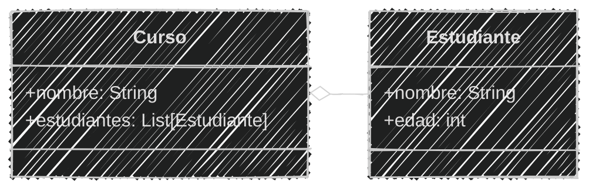
<!--.element class="center-mermaid"-->

---

#### Diagrama en mermaid

Se utiliza la sintaxis `o--` para la **agregación**

`"o"`  es el carácter que representa el rombo vacío

`"--"` es la línea que conecta las dos clases

````
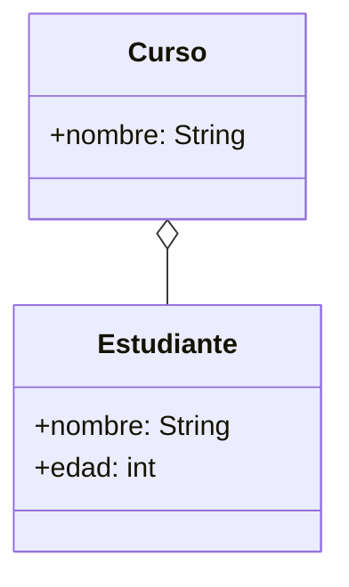
````

---

#### Diagrama de clases

*Composición*

Se representa con una línea con un *rombo lleno*

La línea inicia en la clase `componente`

y termina con el rombo en la clase que `contiene`

El tipo de dato contiene la clase componente

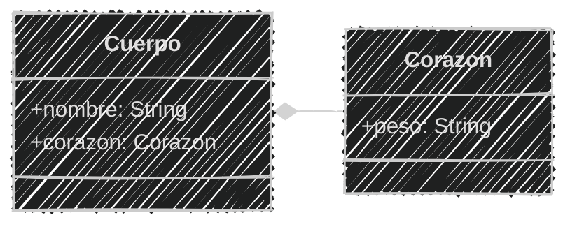
<!--.element class="center-mermaid"-->

---
#### Diagrama en mermaid

Se utiliza la sintaxis `*--` para la *composición*

`"*"` es el carácter que representa el rombo lleno

`"--"` es la línea que conecta las dos clases

````
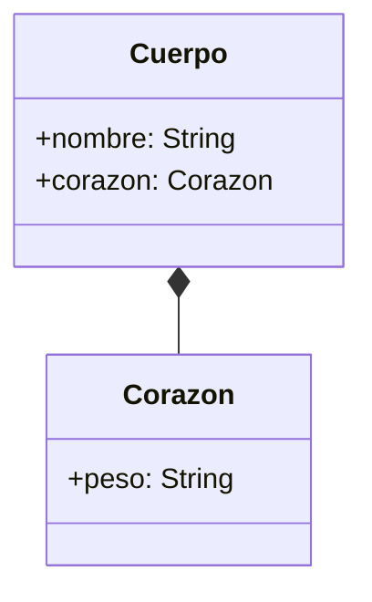
````

---
#### En Python

La **agregación** y la *composición* se implementan utilizando atributos

Se declara una clase que contiene otra clase como un atributo

---

#### **Agregación en Python**

agregacion.py

```python [1-5|7-21|22-26]
# Definición
class Estudiante:
    def __init__(self, nombre, edad):
        self.nombre = nombre
        self.edad = edad

class Curso:
    def __init__(self, nombre):
        self.nombre = nombre
        self.estudiantes = []  # Lista de estudiantes

    def agregar_estudiante(self, estudiante):
        self.estudiantes.append(estudiante)
    
    def ver(self):
        print(f"Curso: {self.nombre}")
        print("Estudiantes:")
        for estudiante in self.estudiantes:
            nombre = estudiante.nombre
            edad = estudiante.edad
            print(f"Nombre: {nombre}, Edad: {edad}")
# Uso
curso = Curso("Matemáticas")
estudiante1 = Estudiante("Juan", 20)
curso.agregar_estudiante(estudiante1)
curso.ver()
```

```text
Curso: Matemáticas
Estudiantes:
Nombre: Juan, Edad: 20
``` 

---

#### *Composición en Python*

composicion.py

```python [1-4|6-13|15-17]
# Definición
class Corazon:
    def __init__(self, peso):
        self.peso = peso

class Cuerpo:
    def __init__(self, nombre, corazon_peso):
        self.nombre = nombre
        self.corazon = Corazon(corazon_peso)  # Composición
    
    def ver(self):
        print(f"Cuerpo: {self.nombre}")
        print(f"Corazón: Peso {self.corazon.peso} kg")

# Uso
cuerpo = Cuerpo("Humano", 0.3)
cuerpo.ver()
```

```text
Cuerpo: Humano
Corazón: Peso 0.3 kg
```

---
Practiquemos un poco...

De los siguientes ejemplos identificar si es 

**agregación** o *composición*

---

1. Una persona cuenta con múltiples órganos. Estos no pueden existir fuera de la persona

¿Qué tipo de relación es esta?

A. Agregación 

B. Composición

> Respuesta: *B. Composición*  
<!-- .element class="fragment" data-fragment-index="2"-->

---
2. Un librero tiene muchos libros. Los libros pueden ser agregados o eliminados del librero sin afectar su existencia

¿Qué tipo de relación es esta?

A. Agregación

B. Composición

> Respuesta: **A. Agregación**
<!-- .element class="fragment" data-fragment-index="2"-->

---

3. Un coche no puede funcionar sin su motor. El motor es una parte esencial del coche.

¿Qué tipo de relación es esta?

A. Agregación

B. Composición

> Respuesta: *B. Composición*
<!-- .element class="fragment" data-fragment-index="2"-->

---

4. Un equipo de fútbol está formado por varios jugadores. Pueden pertenecer a varios equipos.

¿Qué tipo de relación es esta?

A. Agregación

B. Composición

> Respuesta: **A. Agregación**
<!-- .element class="fragment" data-fragment-index="2"-->

---

5. Una casa está compuesta por varias habitaciones. Si la casa es destruida, sus habitaciones también dejan de existir.

¿Qué tipo de relación es esta?

A. Agregación

B. Composición

> Respuesta: *B. Composición*
<!-- .element class="fragment" data-fragment-index="2"-->

---

6. Un músico tiene varios instrumentos. Puede prestar, venderlos o dejar de usarlos

¿Qué tipo de relación es esta?

A. Agregación

B. Composición

> Respuesta: **A. Agregación**
<!-- .element class="fragment" data-fragment-index="2"-->

---

7. Un examen está compuesto por múltiples preguntas. Si se elimina el examen, las preguntas ya no se usan.

¿Qué tipo de relación es esta?

A. Agregación

B. Composición

> Respuesta: *B. Composición*
<!-- .element class="fragment" data-fragment-index="2"-->

---

8. Un minibus puede tener varios pasajeros y cada pasajero puede tomar otros minibuses durante el día

¿Qué tipo de relación es esta?

A. Agregación

B. Composición

> Respuesta: **A. Agregación**
<!-- .element class="fragment" data-fragment-index="2"-->

---

9. Bolivia tiene 9 departamentos, si un departamento es eliminado ya no seguiría existiendo Bolivia

¿Qué tipo de relación es esta?

A. Agregación

B. Composición

> Respuesta: *B. Composición*
<!-- .element class="fragment" data-fragment-index="2"-->

---

10. Un libro tiene varias páginas, si se quita una página el libro ya no se encuentra completo

¿Qué tipo de relación es esta?

A. Agregación

B. Composición

> Respuesta: *B. Composición*
<!-- .element class="fragment" data-fragment-index="2"-->

---

#### Ejemplo 01

```markdown
Una biblioteca guarda en un sistema el título, autor y género
de sus libros. Existen libreros digitales para organizar
Los libros están organizados por género, y se puede
agregar o eliminar libros de cada librero.
Se puede mostrar todos los libros de un librero
Actualmente existen 2 géneros: 
- Cocina
- Arte
```

```markdown
Los libros de cada uno de estos géneros
son:
- Cocina
  - Cocina Criolla Boliviana, Daniel Figliuzzi
  - Gran libro cocina Boliviana, Jaime Cisneros
- Arte
  - Arte textil y mundo andino, Teresa Gisbert
  - Arte contemporáneo en Bolivia, Galería Altamira
```

---

Un libro puede existir sin el librero y el librero puede existir sin los libros

Tienen una relación débil

Por lo tanto es una **agregación**

### 📕📘📙📗 ➡ 📚

---

Crear el archivo `biblioteca.md` y `biblioteca.py` en la carpeta `sesion06`

Vamos a realizar el análisis del ejemplo

---

Análisis inicial

```markdown
# Análisis
Requisitos:
- Guardar información de libros (título, autor, género)
- Organizar libros por género en libreros
- Mostrar libros de cada librero 
- Mostrar la información de un libro
Objetos:
- Libro
- Librero
Características:
- Libro:
    - título: String
    - autor: String
    - género: String
- Librero:
  - género: String
  - libros: List[Libro]
Acciones:
- Libro:
  - info()
- Librero:
  - agregar_libro(libro)
  - eliminar_libro(libro)
  - mostrar_libro()
```

Los libros se representan como una **lista** dentro del librero porqué puede tener **múltiples** libros

---

Diseño diagrama en Mermaid

````
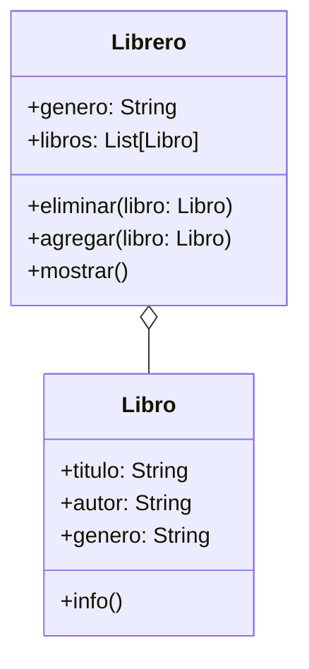
````

---

Diseño Diagrama

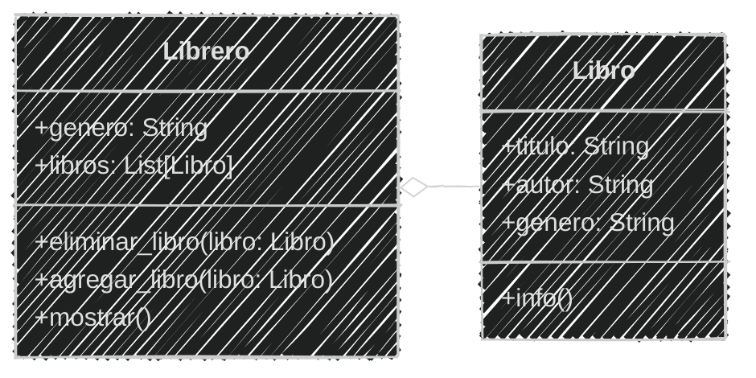
<!--.element class="center-mermaid"-->

---

Ya con el análisis y la **agregación** identificada podemos implementar las clases en python

Se puede utilizar una estructura de datos como una **lista** para guardar los objetos agregados

---

En el archivo `biblioteca.py`

```python [2-9|10-28|30-36|38-43|45-47]
# Definición
class Libro:
    def __init__(self, titulo, autor, genero):
        self.titulo = titulo
        self.autor = autor
        self.genero = genero

    def info(self):
        print (f"Título:{self.titulo}\nAutor:{self.autor}\nGénero:{self.genero}")
class Librero:
    def __init__(self, genero):
        self.genero = genero
        self.libros = []  # Lista de libros

    def agregar_libro(self, libro):
        self.libros.append(libro)
    
    def eliminar_libro(self, libro):
        if libro not in self.libros:
            print("El libro no está en el librero")
            return
        print(f"❌ Libro eliminado: {libro.titulo}")
        self.libros.remove(libro)

    def mostrar_libros(self):
        print(f"📘 Librero de {self.genero}")
        for libro in self.libros:
            libro.info()

# Uso
librero_cocina = Librero("Cocina")
libro1 = Libro("Cocina Criolla Boliviana", "Daniel Figliuzzi", "Cocina")
libro2 = Libro("Gran libro cocina Boliviana", "Jaime Cisneros", "Cocina")
librero_cocina.agregar_libro(libro1)
librero_cocina.agregar_libro(libro2)
librero_cocina.mostrar_libros()

librero_arte = Librero("Arte")
libro3 = Libro("Arte textil y mundo andino", "Teresa Gisbert", "Arte")
libro4 = Libro("Arte contemporáneo en Bolivia", "Galería Altamira", "Arte")
librero_arte.agregar_libro(libro3)
librero_arte.agregar_libro(libro4)
librero_arte.mostrar_libros()

librero_cocina.eliminar_libro(libro1)
librero_cocina.mostrar_libros()
libro1.info()
```
---

Ejecución del código

```bash
python biblioteca.py
```

```text
📘 Librero de Cocina
Título: Cocina Criolla Boliviana                 
Autor: Daniel Figliuzzi                 
Género: Cocina
Título: Gran libro cocina Boliviana                 
Autor: Jaime Cisneros                 
Género: Cocina
📘 Librero de Arte
Título: Arte textil y mundo andino                 
Autor: Teresa Gisbert                 
Género: Arte
Título: Arte contemporáneo en Bolivia                 
Autor: Galería Altamira                 
Género: Arte
❌ Libro eliminado: Cocina Criolla Boliviana
📘 Librero de género: Cocina
Título: Gran libro cocina Boliviana                 
Autor: Jaime Cisneros                 
Género: Cocina
Título: Cocina Criolla Boliviana                 
Autor: Daniel Figliuzzi                 
Género: Cocina
```

---

#### Ejercicio para ti (02)

```markdown
El sistema bibliotecario ahora va almacenar en los libreros
periódicos de años pasados cada librero guarda periódicos 
de diferentes fechas de todas las editoriales.
Cada periódico guarda un día, mes, año y editorial
Se puede agregar o eliminar periódicos de cada librero
Se puede mostrar todos los periódicos de un librero
```

2 minutos

Modifica el *Análisis*

<iframe src="https://time-stuff.com/embed.html" frameborder="0" scrolling="no" width="391" height="140"></iframe>

Modifica el archivo `biblioteca.md`

---

Modificando el *análisis*

```markdown [7-10|14,20-24|32,33,38-40]
# Análisis
Requisitos:
- Guardar información de libros (título, autor, género)
- Organizar libros por género en libreros
- Mostrar libros de cada librero 
- Mostrar la información de un libro
- Periódicos tienen dia, mes, gestión y editorial
- Guardar periódicos en los libreros
- Mostrar la información de un periódico
- Mostrar periódicos de cada librero
Objetos:
- Libro
- Librero
- Periódico
Características:
- Libro:
    - título: String
    - autor: String
    - género: String
- Periódico:
    - dia: int
    - mes: int
    - gestión: int
    - editorial: String
- Librero:
  - género: String
  - libros: List[Libro]
  - periódicos: List[Periódico]
Acciones:
- Libro:
  - info()
- Periódico:
  - info()
- Librero:
  - agregar_libro(libro)
  - eliminar_libro(libro)
  - mostrar_libro()
  - agregar_periodico(periodico)
  - eliminar_periodico(periodico)
  - mostrar_periodicos()
```

---

#### Ejercicio para ti (02)

Ahora obtenemos el diseño del *diagrama de clase*

2 minutos

<iframe src="https://time-stuff.com/embed.html" frameborder="0" scrolling="no" width="391" height="140"></iframe>

Modifica el archivo `biblioteca.md`

---

Creando el diseño de diagrama de clases

```` [9-15|19,23-25,29]
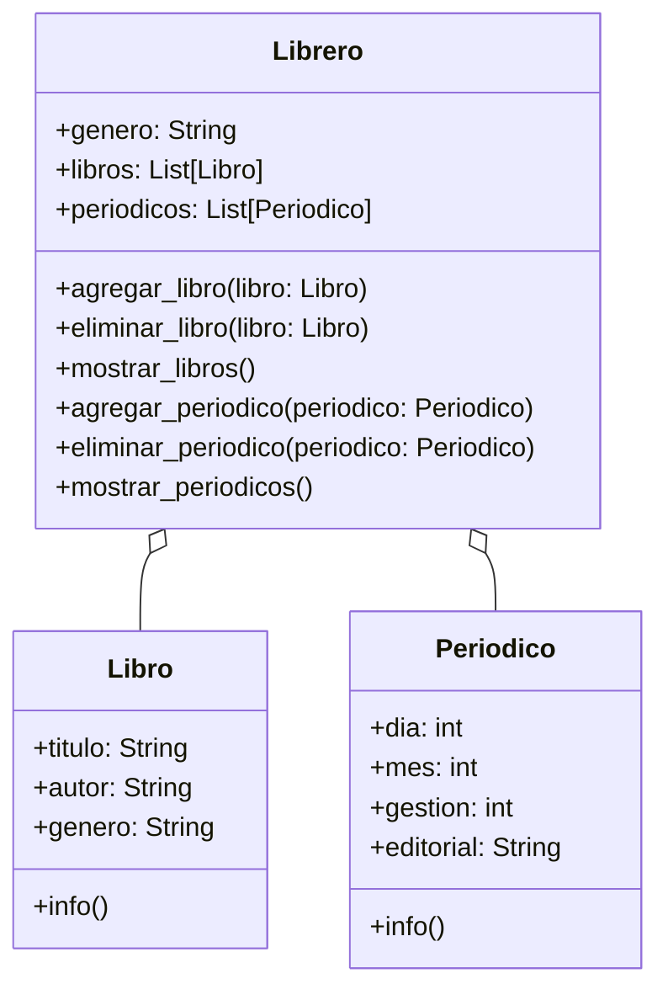
````

---

Creando el diseño de diagrama de clases

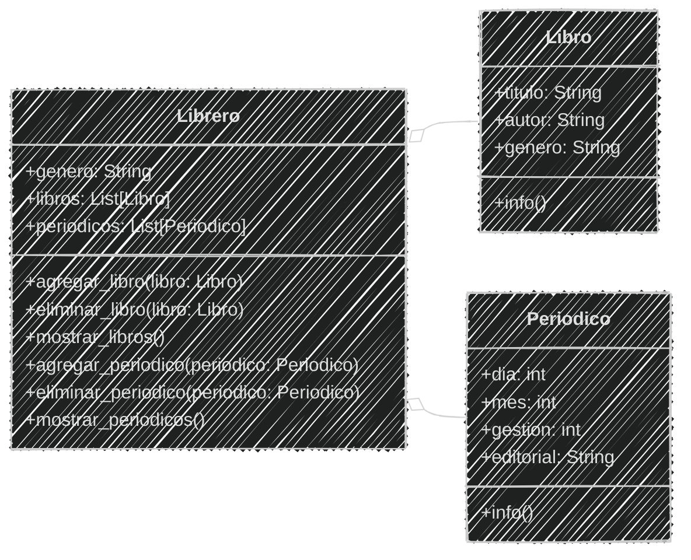
<!--.element class="center-mermaid"-->

---

#### Ejercicio para ti (02)

Ya tenemos el *análisis y diseño* de la clase

Ahora podemos **programar**

Modifica el archivo `biblioteca.py`

3 minutos

<iframe src="https://time-stuff.com/embed.html" frameborder="0" scrolling="no" width="391" height="140"></iframe>

---

Implementando la **agregación** de periódicos

```python [11-19|25|42-55|75-81]
# Definición
class Libro:
    def __init__(self, titulo, autor, genero):
        self.titulo = titulo
        self.autor = autor
        self.genero = genero

    def info(self):
        print (f"Título:{self.titulo}\nAutor:{self.autor}\nGénero:{self.genero}")

class Periodico:
    def __init__(self, dia, mes, gestion, editorial):
        self.dia = dia
        self.mes = mes
        self.gestion = gestion
        self.editorial = editorial

    def info(self):
        print(f"Periódico:{self.editorial}\nFecha:{self.dia}/{self.mes}/{self.gestion}")

class Librero:
    def __init__(self, genero):
        self.genero = genero
        self.libros = []  # Lista de libros
        self.periodicos = []  # Lista de periódicos

    def agregar_libro(self, libro):
        self.libros.append(libro)
    
    def eliminar_libro(self, libro):
        if libro not in self.libros:
            print("El libro no está en el librero")
            return
        print(f"❌ Libro eliminado: {libro.titulo}")
        self.libros.remove(libro)

    def mostrar_libros(self):
        print(f"📘 Librero de {self.genero}")
        for libro in self.libros:
            libro.info()
    
    def agregar_periodico(self, periodico):
        self.periodicos.append(periodico)

    def eliminar_periodico(self, periodico):
        if periodico not in self.periodicos:
            print("El periódico no está en el librero")
            return
        print(f"❌ Periódico eliminado:{periodico.editorial} {periodico.dia}/{periodico.mes}/{periodico.gestion}")
        self.periodicos.remove(periodico)
    
    def mostrar_periodicos(self):
        print(f"📰 Periódicos de librero de {self.genero}")
        for periodico in self.periodicos:
            periodico.info()
# Uso
librero_cocina = Librero("Cocina")
libro1 = Libro("Cocina Criolla Boliviana", "Daniel Figliuzzi", "Cocina")
libro2 = Libro("Gran libro cocina Boliviana", "Jaime Cisneros", "Cocina")
librero_cocina.agregar_libro(libro1)
librero_cocina.agregar_libro(libro2)
librero_cocina.mostrar_libros()

librero_arte = Librero("Arte")
libro3 = Libro("Arte textil y mundo andino", "Teresa Gisbert", "Arte")
libro4 = Libro("Arte contemporáneo en Bolivia", "Galería Altamira", "Arte")
librero_arte.agregar_libro(libro3)
librero_arte.agregar_libro(libro4)
librero_arte.mostrar_libros()

librero_cocina.eliminar_libro(libro1)
librero_cocina.mostrar_libros()
libro1.info()

periodico1 = Periodico(1, 1, 2020, "La Prensa")
periodico2 = Periodico(2, 1, 2020, "El Deber")
librero_cocina.agregar_periodico(periodico1)
librero_cocina.agregar_periodico(periodico2)
librero_cocina.mostrar_periodicos()
librero_cocina.eliminar_periodico(periodico1)
librero_cocina.mostrar_periodicos()
```

---

Ejecución del código

```bash
python biblioteca.py
```

```text	[23-31]
📘 Librero de Cocina
Título:Cocina Criolla Boliviana
Autor:Daniel Figliuzzi
Género:Cocina
Título:Gran libro cocina Boliviana
Autor:Jaime Cisneros
Género:Cocina
📘 Librero de Arte
Título:Arte textil y mundo andino
Autor:Teresa Gisbert
Género:Arte
Título:Arte contemporáneo en Bolivia
Autor:Galería Altamira
Género:Arte
❌ Libro eliminado: Cocina Criolla Boliviana
📘 Librero de Cocina
Título:Gran libro cocina Boliviana
Autor:Jaime Cisneros
Género:Cocina
Título:Cocina Criolla Boliviana
Autor:Daniel Figliuzzi
Género:Cocina
📰 Periódicos de librero de Cocina
Periódico:La Prensa
Fecha:1/1/2020
Periódico:El Deber
Fecha:2/1/2020
❌ Periódico eliminado:La Prensa 1/1/2020
📰 Periódicos de librero de Cocina
Periódico:El Deber
Fecha:2/1/2020
```

---

#### Ejemplo 03

```markdown
Un instituto de salud tiene una simulación del cuerpo humano
Cuenta con un corazón que posee un peso (kg) y tamaño (cm)
El corazón bombea sangre y funciona mediante
dos acciones: sístole y diástole
El cuerpo sólo posee un corazón, si puede latir
el cuerpo está vivo,
Si el corazón esta contraído hace díastole
Si el corazón está relajado hace sístole
Cada cuerpo tiene un nombre para identificarlo
Se puede mostrar la información del cuerpo y del corazón
```
¿Qué tipo de relación tienen los órganos con el cuerpo?
> Respuesta: *Composición*
<!-- .element class="fragment" data-fragment-index="2"-->


---
El corazón no puede existir sin el cuerpo y el cuerpo no puede vivir sin el corazón

Posee una relación fuerte el corazón es parte del cuerpo

Por lo tanto es una *composición*

###  ❤️ ➡ 🧍

---
Crear el archivo `humano.md` y `humano.py` en la carpeta `sesion06`

Vamos a realizar el análisis del ejemplo

---

Análisis inicial

```markdown
# Análisis
Requisitos:
- Guardar información del corazón (peso, tamaño)
- Guardar información del cuerpo (nombre, corazón)
- Cuando esta contraído hace diástole
- Cuando esta relajado hace sístole
- El cuerpo puede vivir si el corazón puede latir
Objetos:
- Corazón
- Cuerpo
Características:
- Corazón:
    - peso: float
    - tamaño: float
    - contraido: bool
    - puede_latir: bool
- Cuerpo:
    - nombre: String
    - corazón: Corazón
Acciones:
- Corazón:
    - latir()
    - info()
- Cuerpo:
    - info()
    - vivir()
```

El corazón es parte del cuerpo, solo tiene *un corazón* se representa como *un atributo* dentro del cuerpo

---

Diseño diagrama en Mermaid

````
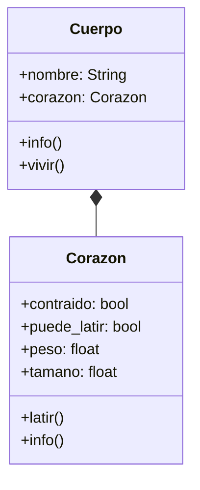
````

---

Diseño Diagrama

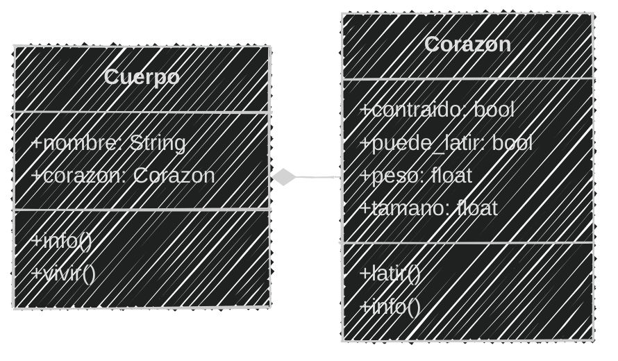
<!--.element class="center-mermaid"-->

---

Ahora con el análisis y la *composición* identificada podemos implementar las clases en python


---

En el archivo `humano.py`

```python [2-18|20-32|33-37]
# Definición
class Corazon:
    def __init__(self, peso, tamano):
        self.contraido = False
        self.puede_latir = True
        self.peso = peso
        self.tamano = tamano
    def latir(self):
        if self.puede_latir:
            if self.contraido:
                print("❤️ Diástole: Corazón relajandose")
            else:
                print("❤️ Sístole: Corazón contrayendose")
            self.contraido = not self.contraido
    def info(self):
        estado = "Contraído" if self.contraido else "Relajado"
        print(f"Corazón: {self.peso} kg, {self.tamano} cm")
        print(f"Estado: {estado} Puede latir: {self.puede_latir}")

class Cuerpo:
    def __init__(self, nombre, peso_corazon, tamano_corazon):
        self.nombre = nombre
        self.corazon = Corazon(peso_corazon, tamano_corazon)
    def info(self):
        print(f"Cuerpo: {self.nombre}")
        self.corazon.info()
    def vivir(self):
        if self.corazon.puede_latir:
            self.corazon.latir()
            print(f"{self.nombre} está vivo")
        else:
            print(f"{self.nombre} esta muerto")
# Uso
cuerpo = Cuerpo("Jhon", 0.3, 12)
cuerpo.info()
cuerpo.vivir()
cuerpo.vivir()
```

---

Ejecución del código

```bash
python humano.py
```

```text
Cuerpo: Jhon
Corazón: 0.3 kg, 12 cm
Estado: Relajado Puede latir: True
❤️ Sístole: Corazón contrayendose
Jhon está vivo
❤️ Diástole: Corazón relajandose
Jhon está vivo
```

---

#### Ejercicio para ti (04)

```markdown
Se va agregar a  la simulación del cuerpo humano el 
cerebro posee peso y cuenta con una acción: pensar
Es parte del cuerpo y no puede vivir sin él
El peso del cerebro es de 1.4 kg para todos los humanos
Mientras el corazón pueda latir el cerebro puede pensar
Se puede mostrar la información del cerebro
```

2 minutos

Modifica el *Análisis*

<iframe src="https://time-stuff.com/embed.html" frameborder="0" scrolling="no" width="391" height="140"></iframe>

Modifica el archivo `humano.md`

---

Modificando el *análisis*

```markdown [8-10|13,21-22|30-32]
# Análisis
Requisitos:
- Guardar información del corazón (peso, tamaño)
- Guardar información del cuerpo (nombre, corazón)
- Cuando esta contraído hace diástole
- Cuando esta relajado hace sístole
- El cuerpo puede vivir si el corazón puede latir
- Guardar información del cerebro (peso)
- El cerebro piensa si el corazón puede latir
- Mostrar la información del cerebro
Objetos:
- Corazón
- Cerebro
- Cuerpo
Características:
- Corazón:
    - peso: float
    - tamaño: float
    - contraido: bool
    - puede_latir: bool
- Cerebro:
    - peso: float
- Cuerpo:
    - nombre: String
    - corazón: Corazón
Acciones:
- Corazón:
    - latir()
    - info()
- Cerebro:
    - pensar()
    - info()
- Cuerpo:
    - info()
    - vivir()
```

---

#### Ejercicio para ti (04)

Ahora obtenemos el diseño del *diagrama de clase*

2 minutos

<iframe src="https://time-stuff.com/embed.html" frameborder="0" scrolling="no" width="391" height="140"></iframe>

Modifica el archivo `humano.md`

---

Modificando el diseño de diagrama de clases

```` [11-15,19,24]
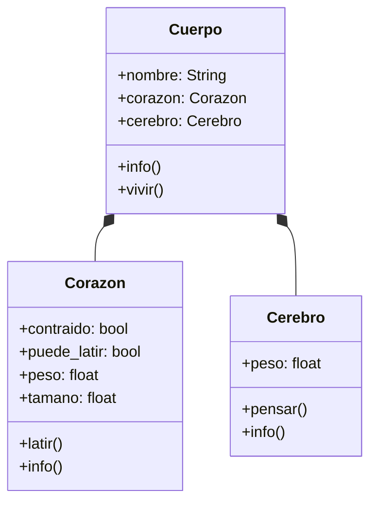
````

---

Modificando el diseño de diagrama de clases

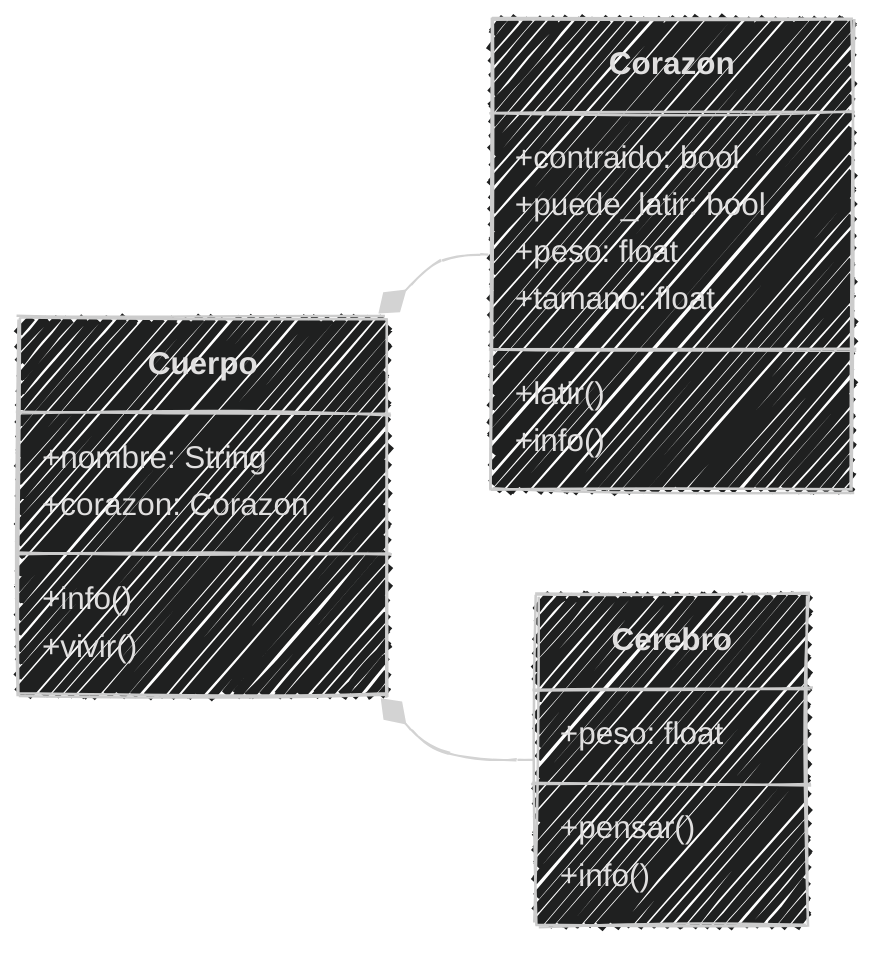
<!--.element class="center-mermaid"-->

---

#### Ejercicio para ti (04)

Ya tenemos el *análisis y diseño* de la clase

Ahora podemos **programar**

Modifica el archivo `humano.py`

3 minutos

<iframe src="https://time-stuff.com/embed.html" frameborder="0" scrolling="no" width="391" height="140"></iframe>

---

Implementando la *composición* del cerebro

```python [19-25|30,38]
# Definición
class Corazon:
    def __init__(self, peso, tamano):
        self.contraido = False
        self.puede_latir = True
        self.peso = peso
        self.tamano = tamano
    def latir(self):
        if self.puede_latir:
            if self.contraido:
                print("❤️ Diástole: Corazón relajandose")
            else:
                print("❤️ Sístole: Corazón contrayendose")
            self.contraido = not self.contraido
    def info(self):
        estado = "Contraído" if self.contraido else "Relajado"
        print(f"Corazón: {self.peso} kg, {self.tamano} cm")
        print(f"Estado: {estado} Puede latir: {self.puede_latir}")
class Cerebro:
    def __init__(self, peso):
        self.peso = peso
    def pensar(self):
        print("🧠 Pensando...")
    def info(self):
        print(f"Cerebro: {self.peso} kg")
class Cuerpo:
    def __init__(self, nombre, peso_corazon, tamano_corazon):
        self.nombre = nombre
        self.corazon = Corazon(peso_corazon, tamano_corazon)
        self.cerebro = Cerebro(1.4)
    def info(self):
        print(f"Cuerpo: {self.nombre}")
        self.corazon.info()
        self.cerebro.info()
    def vivir(self):
        if self.corazon.puede_latir:
            self.corazon.latir()
            self.cerebro.pensar()
            print(f"{self.nombre} está vivo")
        else:
            print(f"{self.nombre} esta muerto")
# Uso
cuerpo = Cuerpo("Jhon", 0.3, 12)
cuerpo.info()
cuerpo.vivir()
cuerpo.vivir()
```

---

Ejecución del código

```bash
python humano.py
```

```text
Cuerpo: Jhon
Corazón: 0.3 kg, 12 cm
Estado: Relajado Puede latir: True
Cerebro: 1.4 kg
❤️ Sístole: Corazón contrayendose
🧠 Pensando...
Jhon está vivo
❤️ Diástole: Corazón relajandose
🧠 Pensando...
Jhon está vivo
```

---

Subimos los avances de la sesión al repositorio en **GitHub**

```bash
git add .
git commit -m "Sesión 06"
git push origin main
```

---

#### Resumen

- La asociación es una relación entre dos o más clases que permite que se comuniquen entre sí.
- Existen dos tipos de asociación: agregación (relación "tiene un") y composición (relación "es parte de").
- La agregación es una relación débil donde los objetos pueden existir independientemente.

---

- La composición es una relación fuerte donde los objetos no pueden existir sin el objeto principal.
- En los diagramas de clases, la agregación se representa con un rombo vacío y la composición con un rombo lleno.
- Los diagramas de clases ayudan a visualizar las relaciones entre objetos y su tipo de asociación.

---

- En Python, la agregación y la composición se implementan usando atributos que contienen instancias de otras clases.
- La agregación permite que los objetos agregados sean compartidos o eliminados sin afectar al objeto principal.
- La composición implica que los objetos compuestos dependen completamente del objeto principal para existir.

---

- Es importante analizar los requisitos y características de los objetos para identificar correctamente el tipo de relación.
- La correcta identificación de agregación y composición facilita el diseño de la programación orientada a objetos

---

#### Retos

Crear una carpeta con el nombre "retos_sesion_06" dentro del proyecto en la raíz, en la cual por cada ejercicio debes crear los siguientes archivos:

```bash
# Estructura de carpetas
psg-oop-2025/
    sesion06/
    retos_sesion_06/
        ejercicio_01.md
        ejercicio_01.py
        ejercicio_02.md
        ejercicio_02.py
```

---

1. Simulación del transporte urbano con minibuses y pasajeros

Las personas, al dirigirse a su trabajo, pueden tomar distintos **minibuses**.  
Cada minibus tiene un **número** de ruta y posee varias **paradas** (ubicaciones)

Por otro lado, cada **pasajero** tiene un **nombre** y una **ubicación** al que desea llegar

*(1/4)*

---

Los pasajeros pueden **subir o bajar** en cualquier parada pero sólo bajo ciertas condiciones:
- Un pasajero sólo puede subir a un minibus si alguna de sus paradas coincide con su destino
- Un pasajero sólo puede bajar en la parada **actual** que coincide con su destino
- Las paradas son circulares, es decir, después de la última parada vuelve a la primera

*(2/4)*

---

**Requisitos:**  
- Crear las clases necesarias para representar **Minibus** y **Pasajero**.
- Implementar la relación entre las clases: un minibus tiene varias paradas programadas y un minibus tiene varios pasajeros
- Simular el movimiento del minibus entre las paradas y las acciones de subir o bajar pasajeros.

*(3/4)*

---

**Tareas:**  
- Realiza el **análisis y diagrama de clases** en el archivo `ejercicio_01.md`.  
- Escribe el **código en Python** correspondiente en el archivo `ejercicio_01.py`.  
- Aplica los conceptos de **relaciones entre objetos**.
- Asegúrate de que las clases tengan atributos y métodos coherentes con su función.  
- Utiliza buenas prácticas de **nomenclatura y encapsulamiento**.

*(4/4)*


---

2. Sistema para administrar un edificio

Se desea representar un **edificio** ubicado en la ciudad de **La Paz**, el cual cuenta con **3 pisos**.
Cada piso contiene **departamentos** y **oficinas**.

- Cada **departamento** tiene un **número** de departamento, comienza con el número del piso seguido de *número* de departamento (*201* o *304*).
- Cada **oficina** tiene un **número** de oficina, comienza con el número del piso seguido de una **letra** (*2A* o *3C*).

*(1/4)*

---

Además:
- El **edificio** tiene `direccion` y `nombre`.
- Los **pisos** tienen un atributo `numero`
- Las **oficinas** cuentan con un atributo `telefono`.  
- Los **departamentos** tienen un atributo `inquilinos`.  

El sistema debe permitir crear pisos con sus departamentos y oficinas correspondientes, y acceder a la información del edificio de forma organizada.  

*(2/4)*

---

**Tareas:**  
- Realiza el **análisis y diagrama de clases** de las clases `Edificio`, `Piso`, `Departamento` y `Oficina` en el archivo `ejercicio_02.md`.  
- Escribe el **código en Python** correspondiente en el archivo `ejercicio_02.py`.  
- Implementa relaciones jerárquicas entre las clases (por ejemplo, un edificio contiene pisos, y cada piso contiene oficinas y departamentos).  

*(3/4)*

---

- Aplica los conceptos de **relaciones entre objetos**.
- Utiliza propiedades y métodos adecuados para mostrar la información de cada edificio, piso, departamento y oficina.

*(4/4)*

---

<!-- .slide: data-background-image="../../content/psg-bg-dark.png" data-background-size="100%"-->

<br>
<br>
<br>
<br>
<br>

[ <!-- .element width="20%"-->](https://github.com/python-la-paz/python-study-group-oop/tree/main/content/sesion06)

Repositorio de la Sesión

---
<!--.slide: data-visibility="hidden"-->
## Bibliografía y Referencias

- [Agregacion Vs Composicion En Diagramas De Clases Uml](https://www.seas.es/blog/informatica/agregacion-vs-composicion-en-diagramas-de-clases-uml/)
- [Association Aggregation Composition Difference](https://www.guru99.com/es/association-aggregation-composition-difference.html)
- [Definición de Asociación](https://definicion.de/asociacion/)
- [POO](https://www.enfocate.doneber.dev/poo/11)
- [Relaciones POO](https://ecosistema.buap.mx/forms/files/dspace-23/16_relaciones.html)
- [POO Composición](https://warriorminds.github.io/poo/poo-composicion/)
- [Programación procedural VS orientada a objetos](https://programacionpro.com/programacion-procedural-vs-orientada-a-objetos-diferencias-y-similitudes/)
- [Python OOP](https://www.learnpython.org/en/Classes_and_Objects)
- [Guía PEP 8](https://peps.python.org/pep-0008/#class-names)
- [Mermaid Charts](https://www.mermaidchart.com/play)
- [Draw.io](https://app.diagrams.net/)
- [Python 3 Object-oriented Programming, Second Edition, Dusty PhillipsDusty Phillips](https://github.com/PacktPublishing/Python-3-Object-Oriented-Programming-Second-Edition)
- [Objetos en programación](https://ebac.mx/blog/objeto-en-programacion)
- [Enfoque orientado a objetos](https://1library.co/article/enfoque-orientado-a-objetos-base-te%C3%B3rica.qvld461y)
