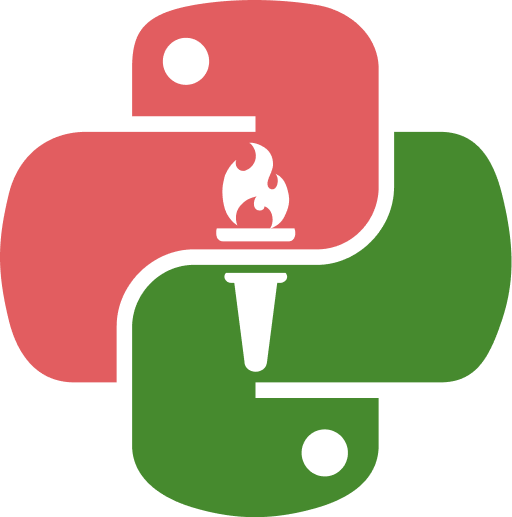

<!-- .slide: data-background-image="../../content/psg-bg-dark.png" data-background-size="100%"-->
 <!-- .element  hidden="true" -->

 
 
 

### Sesión  06
#### Agrupación y Composición
#### Relaciones entre objetos

---
#### Asociación

¿Qué es una asociación?

---

En el mundo real una asociación es una relación entre dos o más personas u objetos

Para colaborar y llegar a un fin común

# 👨‍🎓 🤝 👩‍🏫

---

Es una de las formas más poderosas de entender, aprender y adaptarnos al mundo

Los humanos hacemos agrupaciones y composiciones para construir y controlar mejor nuestro entorno

---

> La unión es la fuerza

 <!-- .element width="50%"-->

---

En programación, una asociación es una relación entre dos o más clases que permite que se comuniquen entre sí

---

Existen dos tipos de asociación:

- **Agregación**: relación "tiene un" (has-a)
- **Composición**: relación "es parte de" (is-a-part-of)

---

#### Agregación

La agregación es un tipo de asociación que indica que una clase tiene una relación con otra

Es una relación débil porque el objeto agregado puede existir independientemente del objeto que lo contiene

---

#### Agregación

Una clase de estudiantes, los alumnos forman parte de la clase, pero pueden irse y siguen existiendo.

## 🏫 👨‍🏫 👩‍🎓 👨‍🎓 👨‍🎓 👩‍🎓 

---

#### Composición

La composición es un tipo de asociación que indica que una clase es parte de otra

Es una relación fuerte porque el objeto compuesto no puede existir sin el otro objeto

---

Un cuerpo humano, los órganos como el corazón, los pulmones, etc. forman parte del cuerpo, pero no pueden existir sin él

## 🧠 + ❤️ + 💀 + 🦴 + 👁️ = 🧍

---
#### Diferencias entre Agregación y Composición

| Característica | Agregación                       | Composición                         |
| -------------- | -------------------------------- | ----------------------------------- |
| Relación       | Débil                            | Fuerte                              |
| Ciclo de vida  | Independiente                    | Dependiente                         |
| Existencia     | Puede existir sin el otro objeto | No puede existir sin el otro objeto |

---

 
---
<!-- .slide: data-background-image="../../content/psg-bg-dark.png" data-background-size="100%"-->

 
 
 
 
 

[ <!-- .element width="20%"-->](https://github.com/python-la-paz/python-study-group-oop/content/sesion06)

Repositorio de la Sesión

---
<!--.slide: data-visibility="hidden"-->
## Bibliografía y Referencias

- [Object Oriented Analysis](https://www.gyata.ai/es/object-oriented-programming/object-oriented-analysis)
- [DDOO Unidad 1](https://dmd.unadmexico.mx/contenidos/DCEIT/BLOQUE1/DS/02/DDOO/U1/descargables/DDOO_Unidad_1.pdf)
- [Programación procedural VS orientada a objetos](https://programacionpro.com/programacion-procedural-vs-orientada-a-objetos-diferencias-y-similitudes/)
- [Python OOP](https://www.learnpython.org/en/Classes_and_Objects)
- [Atributos de clase](https://oregoom.com/python/atributos-clase/)
- [Diagrama de clases](https://diagramasuml.com/diagrama-de-clases/)
- [Guía PEP 8](https://peps.python.org/pep-0008/#class-names)
- [Mermaid Charts](https://www.mermaidchart.com/play)
- [Draw.io](https://app.diagrams.net/)
- [Python 3 Object-oriented Programming, Second Edition, Dusty PhillipsDusty Phillips](https://github.com/PacktPublishing/Python-3-Object-Oriented-Programming-Second-Edition)
- [Objetos en programación](https://ebac.mx/blog/objeto-en-programacion)
- [Enfoque orientado a objetos](https://1library.co/article/enfoque-orientado-a-objetos-base-te%C3%B3rica.qvld461y)
- [OOAD](https://www.tutorialspoint.com/object_oriented_analysis_design/ooad_object_oriented_analysis.htm)
https://www.seas.es/blog/informatica/agregacion-vs-composicion-en-diagramas-de-clases-uml/
https://www.guru99.com/es/association-aggregation-composition-difference.html
https://definicion.de/asociacion/
https://www.enfocate.doneber.dev/poo/11
