<!-- .slide: data-background-image="../../content/psg-bg-dark.png" data-background-size="100%"-->
 <!-- .element  hidden="true" -->

<br>
<br>
<br>

### Sesión  06
#### Agrupación y Composición
#### Relaciones entre objetos

---

#### VS Code

Abrimos el proyecto del Study Group

```bash
code psg-oop-2025
```

Creamos una carpeta llamada `sesion06` dentro del proyecto

```bash
mkdir sesion06
cd sesion06
```

Aquí guardaremos los ejemplos de la sesión

---
#### Asociación

¿Qué es una asociación?

---

En el mundo real una asociación es una relación entre dos o más personas u objetos

Para colaborar y llegar a un fin común

# 👨‍🎓 🤝 👩‍🏫

---

Es una de las formas más poderosas de entender, aprender y adaptarnos al mundo

Los humanos hacemos agrupaciones y composiciones para construir y controlar mejor nuestro entorno

---

> La unión es la fuerza

 <!-- .element width="50%"-->

---

En programación, una asociación es una relación entre dos o más clases que permite que se comuniquen entre sí

---

Existen dos tipos de asociación:

- **Agregación**: relación "tiene un" (has-a)
- **Composición**: relación "es parte de" (is-a-part-of)

---

#### Agregación

La agregación es un tipo de asociación que indica que una clase tiene una relación con otra

Es una relación débil porque el objeto agregado puede existir independientemente del objeto que lo contiene

---

#### Agregación

Una clase de estudiantes, los alumnos forman parte de la clase, pero pueden irse y siguen existiendo.

## 🏫 👨‍🏫 👩‍🎓 👨‍🎓 👨‍🎓 👩‍🎓 

---

#### Composición

La composición es un tipo de asociación que indica que una clase es parte de otra

Es una relación fuerte porque el objeto compuesto no puede existir sin el otro objeto

---

Un cuerpo humano, los órganos como el corazón, los pulmones, etc. forman parte del cuerpo, pero no pueden existir sin él

## 🧠 + ❤️ + 💀 + 🦴 + 👁️ = 🧍

---
#### Diferencias entre Agregación y Composición

| Característica | Agregación                       | Composición                         |
| -------------- | -------------------------------- | ----------------------------------- |
| Relación       | Débil                            | Fuerte                              |
| Ciclo de vida  | Independiente                    | Dependiente                         |
| Existencia     | Puede existir sin el otro objeto | No puede existir sin el otro objeto |

---

#### Diagrama de clases

En un diagrama de clases, la agregación se representa con una línea con un rombo vacío, la línea inicia en la clase contenida

y termina con el rombo en la clase que agrega

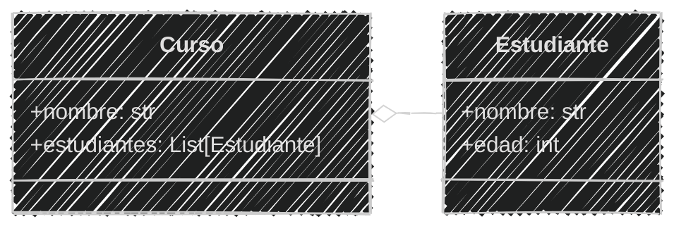

---

#### Diagrama en mermaid

Se utiliza la notación `o--` para la agregación

`"o"`  es el carácter que representa el rombo vacío

`"--"` es la línea que conecta las dos clases

````
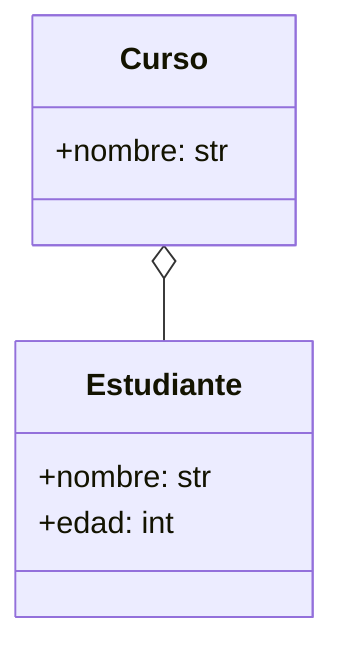
````

---

En un diagrama de clases, la composición se representa con una línea con un rombo lleno, la línea inicia en la clase compuesta

y termina con el rombo en la clase que es parte de la composición

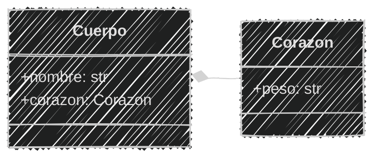

---
#### Diagrama en mermaid
Se utiliza la notación `*--` para la composición

`"*"` es el carácter que representa el rombo lleno

`"--"` es la línea que conecta las dos clases

````
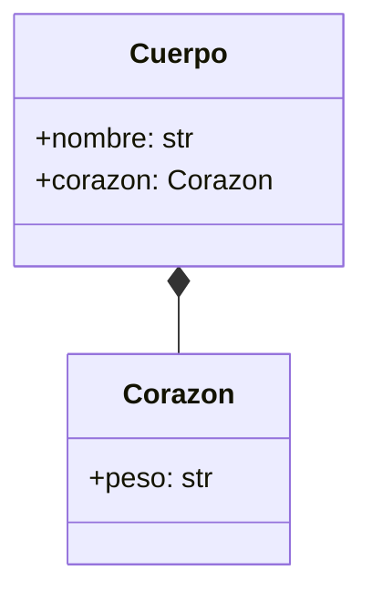
````

---
#### En Python

En Python, la agregación y la composición se implementan utilizando atributos

Se declara una clase que contiene otra clase como un atributo

---

#### Agregación en Python 

agregacion.py

```python [1-5|7-21|22-26]
# Definición
class Estudiante:
    def __init__(self, nombre, edad):
        self.nombre = nombre
        self.edad = edad

class Curso:
    def __init__(self, nombre):
        self.nombre = nombre
        self.estudiantes = []  # Lista de estudiantes

    def agregar_estudiante(self, estudiante):
        self.estudiantes.append(estudiante)
    
    def ver(self):
        print(f"Curso: {self.nombre}")
        print("Estudiantes:")
        for estudiante in self.estudiantes:
            nombre = estudiante.nombre
            edad = estudiante.edad
            print(f"Nombre: {nombre}, Edad: {edad}")
# Uso
curso = Curso("Matemáticas")
estudiante1 = Estudiante("Juan", 20)
curso.agregar_estudiante(estudiante1)
curso.ver()
```

```text
Curso: Matemáticas
Estudiantes:
Nombre: Juan, Edad: 20
``` 

---

#### Composición en Python

composicion.py

```python [1-4|6-13|15-17]
# Definición
class Corazon:
    def __init__(self, peso):
        self.peso = peso

class Cuerpo:
    def __init__(self, nombre, corazon_peso):
        self.nombre = nombre
        self.corazon = Corazon(corazon_peso)  # Composición
    
    def ver(self):
        print(f"Cuerpo: {self.nombre}")
        print(f"Corazón: Peso {self.corazon.peso} kg")

# Uso
cuerpo = Cuerpo("Humano", 0.3)
cuerpo.ver()
```

```text
Cuerpo: Humano
Corazón: Peso 0.3 kg
```

---
Practiquemos un poco de los siguientes ejemplos identificar si es `agregación` o `composición`

---

1. Una persona cuenta con múltiples órganos. Estos no pueden existir fuera de la persona.

¿Qué tipo de relación es esta?

A. Agregación 

B. Composición

> Respuesta: B. Composición  <!-- .element class="fragment" data-fragment-index="2"-->

---
2. Un librero tiene muchos libros. Los libros pueden ser agregados o eliminados del librero sin afectar su existencia.

¿Qué tipo de relación es esta?

A. Agregación

B. Composición

> Respuesta: A. Agregación  <!-- .element class="fragment" data-fragment-index="2"-->

---

3. Un coche no puede funcionar sin su motor. El motor es una parte esencial del coche.

¿Qué tipo de relación es esta?

A. Agregación

B. Composición

> Respuesta: B. Composición  <!-- .element class="fragment" data-fragment-index="2"-->

---

4. Un equipo de fútbol está formado por varios jugadores. Pueden pertenecer a varios equipos.

¿Qué tipo de relación es esta?

A. Agregación

B. Composición

> Respuesta: A. Agregación <!-- .element class="fragment" data-fragment-index="2"-->

---

5. Una casa está compuesta por varias habitaciones. Si la casa es destruida, sus habitaciones también dejan de existir.

¿Qué tipo de relación es esta?

A. Agregación

B. Composición

> Respuesta: B. Composición <!-- .element class="fragment" data-fragment-index="2"-->

---

6. Un músico tiene varios instrumentos. Puede prestar, venderlos o dejar de usarlos

¿Qué tipo de relación es esta?

A. Agregación

B. Composición

> Respuesta: A. Agregación <!-- .element class="fragment" data-fragment-index="2"-->

---

7. Un examen está compuesto por múltiples preguntas. Si se elimina el examen, las preguntas ya no se usan.

¿Qué tipo de relación es esta?

A. Agregación

B. Composición

> Respuesta: B. Composición <!-- .element class="fragment" data-fragment-index="2"-->

---

8. Un minibus puede tener varios pasajeros y cada pasajero puede tomar otros minibuses durante el día

¿Qué tipo de relación es esta?

A. Agregación

B. Composición

> Respuesta: A. Agregación <!-- .element class="fragment" data-fragment-index="2"-->

---

9. Bolivia tiene 9 departamentos, si un departamento es eliminado ya no seguiría existiendo Bolivia

¿Qué tipo de relación es esta?

A. Agregación

B. Composición

> Respuesta: B. Composición <!-- .element class="fragment" data-fragment-index="2"-->

---

10. Un libro tiene varias páginas, si se quita una página el libro ya no se encuentra completo

¿Qué tipo de relación es esta?

A. Agregación

B. Composición

> Respuesta: B. Composición <!-- .element class="fragment" data-fragment-index="2"-->

---

#### Ejemplo 01

```markdown
Una biblioteca guarda la siguiente información de sus libros
el título, autor y género
Los libros están ordenados en libreros por género, y se puede
agregar o eliminar libros de cada librero

Actualmente existen 2 géneros: 
- Cocina
- Arte
Y los libros de cada uno de estos géneros
son:
- Cocina
  - Cocina Criolla Boliviana, Daniel Figliuzzi
  - Gran libro cocina Boliviana, Jaime Cisneros
- Arte
  - Arte textil y mundo andino, Teresa Gisbert
  - Arte contemporáneo en Bolivia, Galería Altamira
```

¿Qué tipo de relación tienen los libros con el librero?

>Respuesta: Agregación <!-- .element class="fragment" data-fragment-index="2"-->

---

Un libro puede existir sin el librero y el librero puede existir sin los libros

Tienen una relación débil

### 📗📕📘📙 ➡ 📚

---
Crear el archivo `biblioteca.md` y `biblioteca.py` en la carpeta `sesion06`

```markdown
# Análisis
Requisitos:
- Guardar información de libros (título, autor, género)
- Organizar libros por género en libreros
- Mostrar libros de cada librero 
- Mostrar la información de un libro
Objetos:
- Librero
- Libro
Características:
- Libro:
    - título: String
    - autor: String
    - género: String
- Librero:
  - género: String
  - libros: List[Libro]
Acciones:
- Librero:
  - agregar_libro(libro)
  - eliminar_libro(libro)
  - mostrar_libros()
- Libro:
  - info()
```

---

#### Diagrama de clases
````
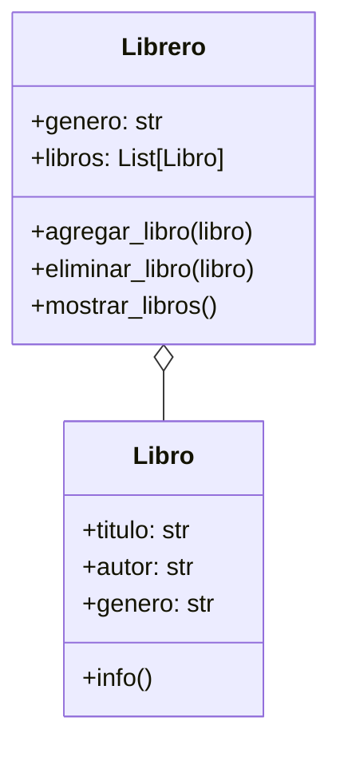
````

---

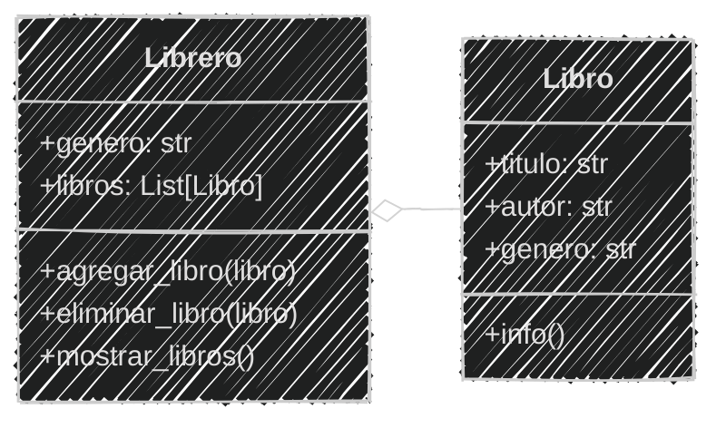

---

#### Implementación en Python

```python [2-11|12-30|33-38|40-45|47-49]
# Definición
class Libro:
    def __init__(self, titulo, autor, genero):
        self.titulo = titulo
        self.autor = autor
        self.genero = genero

    def info(self):
        print (f"Título: {self.titulo} \
                \nAutor: {self.autor} \
                \nGénero: {self.genero}")
class Librero:
    def __init__(self, genero):
        self.genero = genero
        self.libros = []  # Lista de libros

    def agregar_libro(self, libro):
        self.libros.append(libro)
    
    def eliminar_libro(self, libro):
        if libro in self.libros:
            print(f"❌ Libro eliminado: {libro.titulo}")
        else:
            print("El libro no está en el librero")
        self.libros.remove(libro)
    
    def mostrar_libros(self):
        print(f"📘 Librero de género: {self.genero}")
        for libro in self.libros:
            libro.info()

# Uso
librero_cocina = Librero("Cocina")
libro1 = Libro("Cocina Criolla Boliviana", "Daniel Figliuzzi", "Cocina")
libro2 = Libro("Gran libro cocina Boliviana", "Jaime Cisneros", "Cocina")
librero_cocina.agregar_libro(libro1)
librero_cocina.agregar_libro(libro2)
librero_cocina.mostrar_libros()

librero_arte = Librero("Arte")
libro3 = Libro("Arte textil y mundo andino", "Teresa Gisbert", "Arte")
libro4 = Libro("Arte contemporáneo en Bolivia", "Galería Altamira", "Arte")
librero_arte.agregar_libro(libro3)
librero_arte.agregar_libro(libro4)
librero_arte.mostrar_libros()

librero_cocina.eliminar_libro(libro1)
librero_cocina.mostrar_libros()
libro1.info()
```
---

```text
📘 Librero de género: Cocina
Título: Cocina Criolla Boliviana                 
Autor: Daniel Figliuzzi                 
Género: Cocina
Título: Gran libro cocina Boliviana                 
Autor: Jaime Cisneros                 
Género: Cocina
📘 Librero de género: Arte
Título: Arte textil y mundo andino                 
Autor: Teresa Gisbert                 
Género: Arte
Título: Arte contemporáneo en Bolivia                 
Autor: Galería Altamira                 
Género: Arte
❌ Libro eliminado: Cocina Criolla Boliviana
📘 Librero de género: Cocina
Título: Gran libro cocina Boliviana                 
Autor: Jaime Cisneros                 
Género: Cocina
Título: Cocina Criolla Boliviana                 
Autor: Daniel Figliuzzi                 
Género: Cocina
```

---

#### Ejemplo 02

```markdown
La biblioteca ahora almacena en la parte inferior de los libreros
para ocupar espacio periódicos de años pasados cada librero guarda 
los periódicos de diferentes fechas de todas las editoriales
```

2 minutos

<iframe src="https://time-stuff.com/embed.html" frameborder="0" scrolling="no" width="391" height="140"></iframe>

Añadir al archivos `biblioteca.md` el análisis

---

```markdown [7-8|18-22,26|32-34|37-38]
# Análisis
Requisitos:
- Guardar información de libros (título, autor, género)
- Organizar libros por género en libreros
- Mostrar libros de cada librero 
- Mostrar la información de un libro
- Guardar periódicos por mes y año en los libreros
- Cada periódico guarda un dia, mes, año y editorial
Objetos:
- Librero
- Libro
- Periódico
Características:
- Libro:
    - título: String
    - autor: String
    - género: String
- Periodico:
    - dia: int
    - mes: int
    - anio: int
    - editorial: String
- Librero:
    - género: String
    - libros: List[Libro]
    - periodicos: List[Periodico]
Acciones:
- Librero:
    - agregar_libro(libro)
    - eliminar_libro(libro)
    - mostrar_libros()
    - agregar_periodico(periodico)
    - eliminar_periodico(periodico)
    - mostrar_periodicos()
- Libro:
    - info()
- Periodico:
    - info()
```

---

Ahora que tenemos los requisitos, características y acciones de cada objeto
podemos crear el diagrama de clases 

2 minutos

<iframe src="https://time-stuff.com/embed.html" frameborder="0" scrolling="no" width="391" height="140"></iframe>

Añadir al archivo `biblioteca.md` el diagrama de clases

---

#### Diagrama de clases
```` [9-15|18,22-25|29]
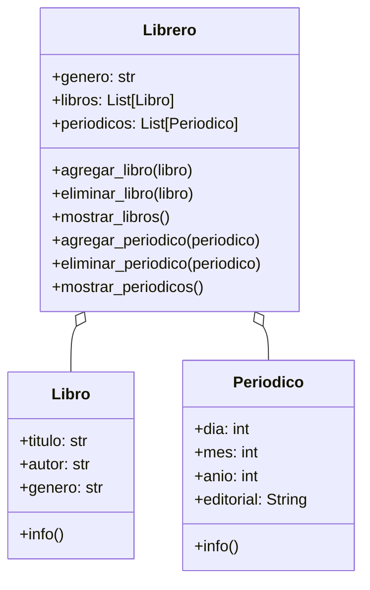
````

---


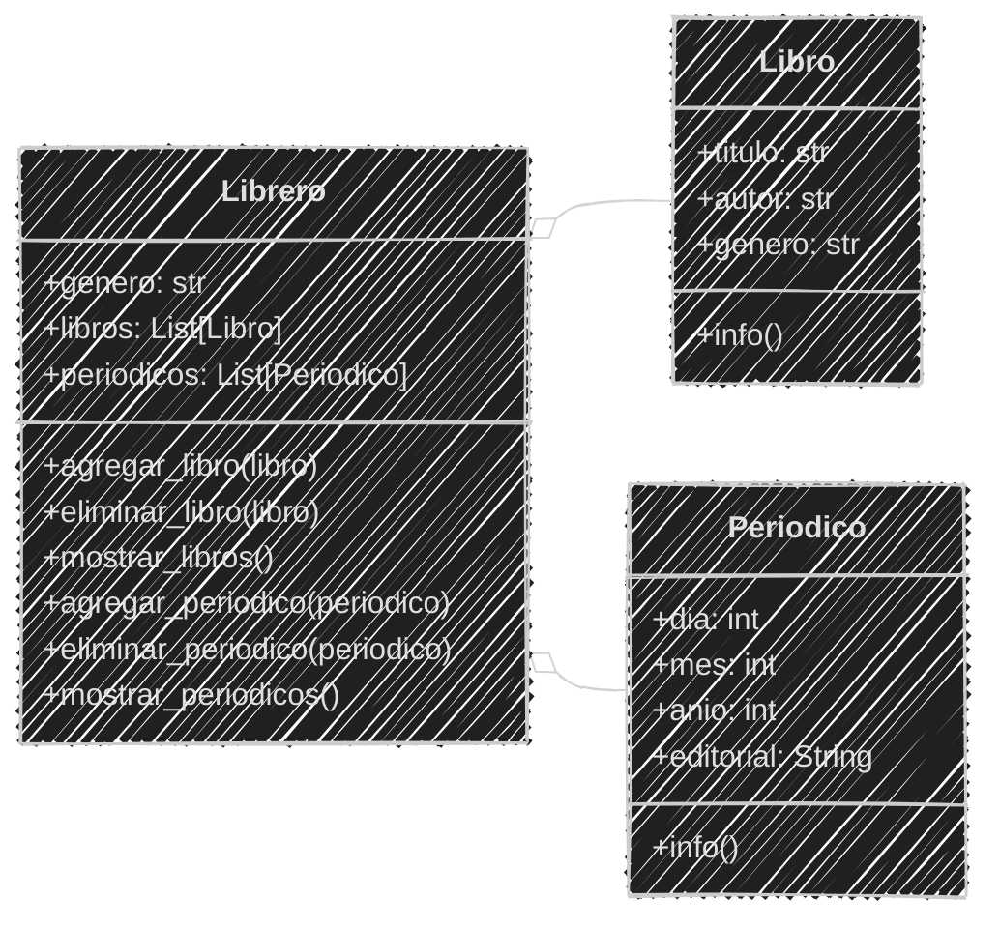

---

Por último, implementamos las clases en el archivo `biblioteca.py`

3 minutos

<iframe src="https://time-stuff.com/embed.html" frameborder="0" scrolling="no" width="391" height="140"></iframe>

---

#### Implementación en Python

```python [13-22|28|45-58|78-84]
# Definición
class Libro:
    def __init__(self, titulo, autor, genero):
        self.titulo = titulo
        self.autor = autor
        self.genero = genero

    def info(self):
        print (f"Título: {self.titulo} \
                \nAutor: {self.autor} \
                \nGénero: {self.genero}")

class Periodico:
    def __init__(self, dia, mes, anio, editorial):
        self.dia = dia
        self.mes = mes
        self.anio = anio
        self.editorial = editorial

    def info(self):
        print(f"Periódico: {self.editorial} \
                \nFecha: {self.dia}/{self.mes}/{self.anio}")

class Librero:
    def __init__(self, genero):
        self.genero = genero
        self.libros = []  # Lista de libros
        self.periodicos = []  # Lista de periódicos

    def agregar_libro(self, libro):
        self.libros.append(libro)
    
    def eliminar_libro(self, libro):
        if libro in self.libros:
            print(f"❌ Libro eliminado: {libro.titulo}")
        else:
            print("El libro no está en el librero")
        self.libros.remove(libro)
    
    def mostrar_libros(self):
        print(f"📘 Librero de género: {self.genero}")
        for libro in self.libros:
            libro.info()
    
    def agregar_periodico(self, periodico):
        self.periodicos.append(periodico)

    def eliminar_periodico(self, periodico):
        if periodico in self.periodicos:
            print(f"❌ Periódico eliminado: {periodico.editorial} {periodico.dia}/{periodico.mes}/{periodico.anio}")
        else:
            print("El periódico no está en el librero")
        self.periodicos.remove(periodico)
    
    def mostrar_periodicos(self):
        print(f"📰 Librero de género: {self.genero}")
        for periodico in self.periodicos:
            periodico.info()
# Uso
librero_cocina = Librero("Cocina")
libro1 = Libro("Cocina Criolla Boliviana", "Daniel Figliuzzi", "Cocina")
libro2 = Libro("Gran libro cocina Boliviana", "Jaime Cisneros", "Cocina")
librero_cocina.agregar_libro(libro1)
librero_cocina.agregar_libro(libro2)
librero_cocina.mostrar_libros()

librero_arte = Librero("Arte")
libro3 = Libro("Arte textil y mundo andino", "Teresa Gisbert", "Arte")
libro4 = Libro("Arte contemporáneo en Bolivia", "Galería Altamira", "Arte")
librero_arte.agregar_libro(libro3)
librero_arte.agregar_libro(libro4)
librero_arte.mostrar_libros()

librero_cocina.eliminar_libro(libro1)
librero_cocina.mostrar_libros()
libro1.info()

periodico1 = Periodico(1, 1, 2020, "La Prensa")
periodico2 = Periodico(2, 1, 2020, "El Deber")
librero_cocina.agregar_periodico(periodico1)
librero_cocina.agregar_periodico(periodico2)
librero_cocina.mostrar_periodicos()
librero_cocina.eliminar_periodico(periodico1)
librero_cocina.mostrar_periodicos()
```
---

```text	[23-31]
📘 Librero de género: Cocina
Título: Cocina Criolla Boliviana                 
Autor: Daniel Figliuzzi                 
Género: Cocina
Título: Gran libro cocina Boliviana                 
Autor: Jaime Cisneros                 
Género: Cocina
📘 Librero de género: Arte
Título: Arte textil y mundo andino                 
Autor: Teresa Gisbert                 
Género: Arte
Título: Arte contemporáneo en Bolivia                 
Autor: Galería Altamira                 
Género: Arte
❌ Libro eliminado: Cocina Criolla Boliviana
📘 Librero de género: Cocina
Título: Gran libro cocina Boliviana                 
Autor: Jaime Cisneros                 
Género: Cocina
Título: Cocina Criolla Boliviana                 
Autor: Daniel Figliuzzi                 
Género: Cocina
📰 Librero de género: Cocina
Periódico: La Prensa                 
Fecha: 1/1/2020
Periódico: El Deber                 
Fecha: 2/1/2020
❌ Periódico eliminado: La Prensa 1/1/2020
📰 Librero de género: Cocina
Periódico: El Deber                 
Fecha: 2/1/2020
```

---

#### Ejemplo 03

```markdown
El cuerpo humano está compuesto por varios órganos, 
cada órgano tiene diferentes características y funciones
Cuenta con un corazón que posee un peso y tamaño
El corazón bombea sangre y funciona todo el tiempo mediante
dos acciones: sístole y diástole
El cuerpo sólo posee un corazón y si el corazón puede latir
el cuerpo está vivo,
Si el corazón esta contraído hace díastole
Si el corazón está relajado hace sístole
```
¿Qué tipo de relación tienen los órganos con el cuerpo?
> Respuesta: Composición <!-- .element class="fragment" data-fragment-index="2"-->


---
Un órgano no puede existir sin el cuerpo y el cuerpo no puede existir sin los órganos

Posee una relación fuerte el corazón es parte del cuerpo

###  ❤️ ➡ 🧍

---
Crear el archivo `humano.md` y `humano.py` en la carpeta `sesion06`

```markdown
# Análisis
Requisitos:
- Guardar información del corazón (peso, tamaño)
- Guardar información del cuerpo (nombre, corazón)
- El corazón late mediante dos acciones: sístole y diástole
Objetos:
- Corazón
- Cuerpo
Características:
- Corazón:
    - contraido: bool
    - puede_latir: bool
    - peso: float
    - tamaño: float
- Cuerpo:
    - nombre: String
    - corazón: Corazón
Acciones:
- Corazón:
    - latir()
    - info()
- Cuerpo:
    - info()
    - vivir()
```

---

#### Diagrama de clases
````
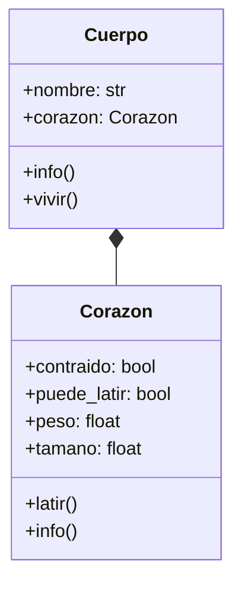
````

---

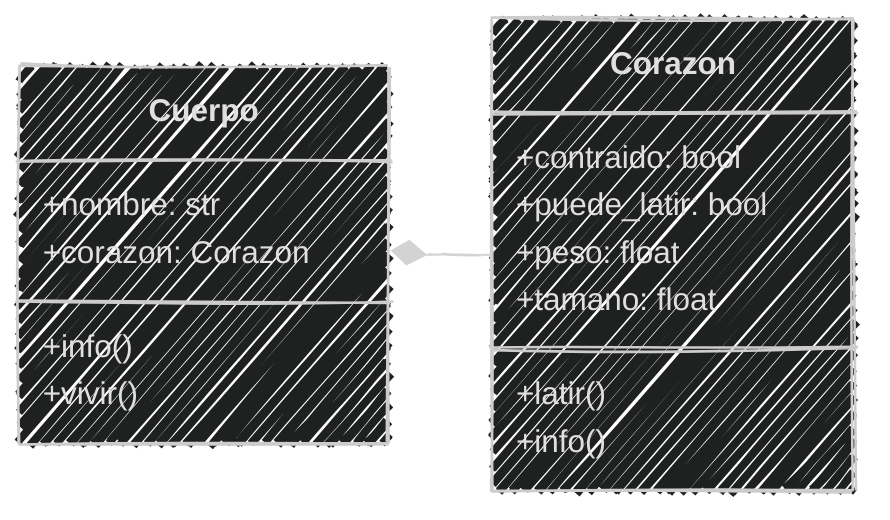

---
#### Implementación en Python

```python [2-18|20-34|36-40]
# Definición
class Corazon:
    def __init__(self, peso, tamano):
        self.contraido = False
        self.puede_latir = True
        self.peso = peso
        self.tamano = tamano

    def latir(self):
        if self.puede_latir:
            if self.contraido:
                print("❤️ Diástole: Se está relajando el corazón")
            else:
                print("❤️ Sístole: Se está contrayendo el corazón")
            self.contraido = not self.contraido
    def info(self):
        estado = "Contraído" if self.contraido else "Relajado"
        print(f"Corazón: {self.peso} kg, {self.tamano} cm, Estado: {estado}")

class Cuerpo:
    def __init__(self, nombre, peso_corazon, tamano_corazon):
        self.nombre = nombre
        self.corazon = Corazon(peso_corazon, tamano_corazon)  # Composición
    
    def info(self):
        print(f"Cuerpo: {self.nombre}")
        self.corazon.info()
    
    def vivir(self):
        if self.corazon.puede_latir:
            self.corazon.latir()
            print(f"{self.nombre} está vivo")
        else:
            print(f"{self.nombre} esta muerto")

# Uso
cuerpo = Cuerpo("Jhon", 0.3, 12)
cuerpo.info()
cuerpo.vivir()
cuerpo.vivir()
```

```text
Cuerpo: Jhon
Corazón: 0.3 kg, 12 cm, Estado: Relajado
❤️ Sístole: Se está contrayendo el corazón
Jhon está vivo
❤️ Diástole: Se está relajando el corazón
Jhon está vivo
```

---

#### Ejemplo 04

```markdown
Adicionar al cuerpo humano los siguientes órganos:
- Pulmónes poseen volumen y cuenta con
  dos acciones: inhalar y exhalar
- Cerebro posee peso y cuenta con una acción: pensar

Ambos órganos son parte del cuerpo y no pueden existir sin él
El peso del cerebro es de 1.4 kg para todos los humanos
Y el volumen de los pulmones es de 6 litros para todos los humanos

Mientras el corazón pueda latir el cuerpo puede respirar y pensar
```

2 minutos

<iframe src="https://time-stuff.com/embed.html" frameborder="0" scrolling="no" width="391" height="140"></iframe>

Añadir al archivo `humano.md` el análisis

---

```markdown [6-9|12-13|21-25,29-31|36-41]
# Análisis
Requisitos:
- Guardar información del corazón (peso, tamaño)
- Guardar información del cuerpo (nombre, corazón)
- El corazón late mediante dos acciones: sístole y diástole
- Guardar información de los pulmones (volumen)
- Guardar información del cerebro (peso)
- Los pulmones inhalan y exhalan
- El cerebro piensa
Objetos:
- Corazón
- Pulmón
- Cerebro
- Cuerpo
Características:
- Corazón:
    - contraido: bool
    - puede_latir: bool
    - peso: float
    - tamaño: float
- Pulmón:
    - volumen: float
    - expandido: bool
- Cerebro:
    - peso: float
- Cuerpo:
    - nombre: String
    - corazón: Corazón
    - pulmon_derecho: Pulmón
    - pulmon_izquierdo: Pulmón
    - cerebro: Cerebro
Acciones:
- Corazón:
    - latir()
    - info()
- Pulmón:
    - respirar()
    - info()
- Cerebro:
    - pensar()
    - info()
- Cuerpo:
    - info()
    - vivir()
```

---

Ahora que tenemos los requisitos, características y acciones de cada objeto
podemos crear el diagrama de clases

2 minutos

<iframe src="https://time-stuff.com/embed.html" frameborder="0" scrolling="no" width="391" height="140"></iframe>

Añadir al archivo `humano.md` el diagrama de clases

---

#### Diagrama de clases
```` [11-21|25-27|33-34]
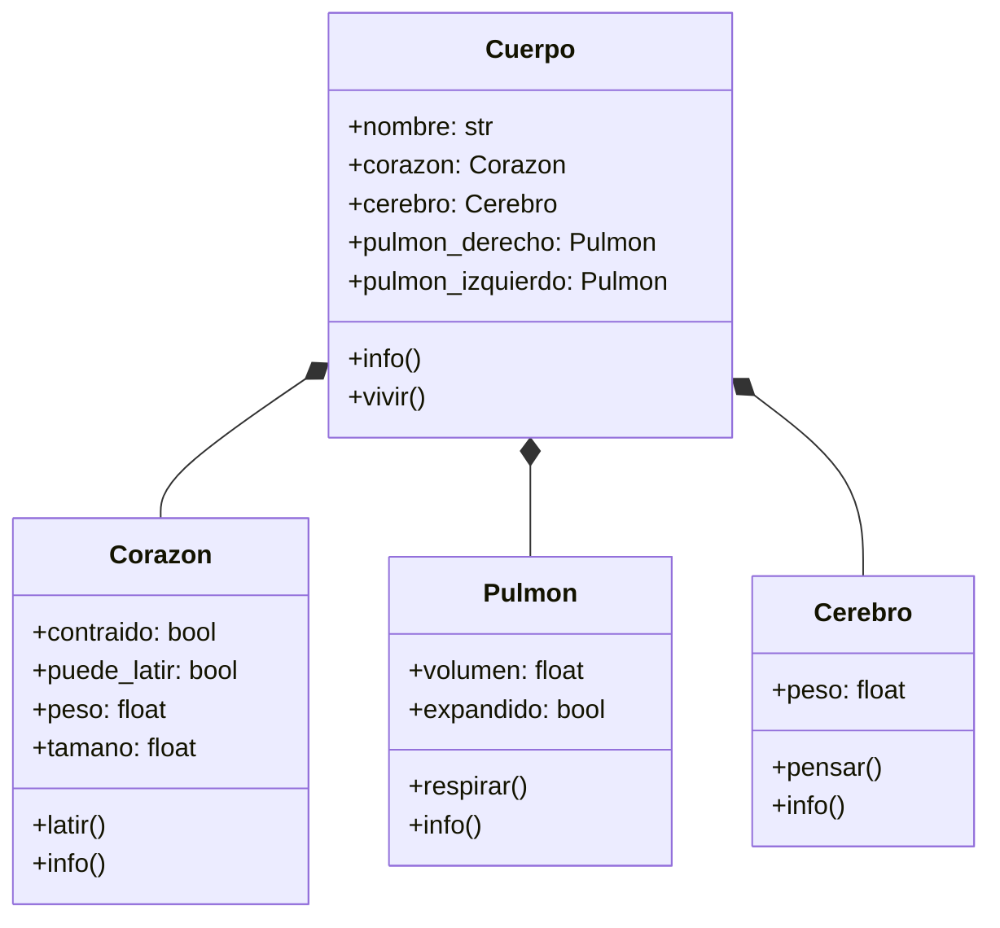
````

---

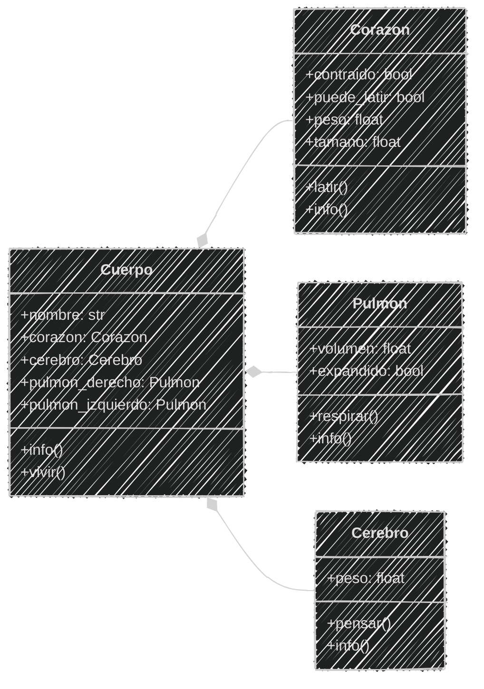

---
Ya tenemos el análisis y el diagrama de clases, ahora implementamos las clases en el archivo `humano.py`

3 minutos

<iframe src="https://time-stuff.com/embed.html" frameborder="0" scrolling="no" width="391" height="140"></iframe>

---

#### Implementación en Python

```python [20-34|36-44|50-52|61-63|69-72]
# Definición
class Corazon:
    def __init__(self, peso, tamano):
        self.contraido = False
        self.puede_latir = True
        self.peso = peso
        self.tamano = tamano

    def latir(self):
        if self.puede_latir:
            if self.contraido:
                print("❤️ Diástole: Se está relajando el corazón")
            else:
                print("❤️ Sístole: Se está contrayendo el corazón")
            self.contraido = not self.contraido
    def info(self):
        estado = "Contraído" if self.contraido else "Relajado"
        print(f"Corazón: {self.peso} kg, {self.tamano} cm, Estado: {estado}")

class Pulmon:
    def __init__(self, volumen):
        self.volumen = volumen
        self.expandido = False

    def respirar(self):
        if self.expandido:
            print("🌬️ Exhalando aire")
        else:
            print("🌬️ Inhalando aire")
        self.expandido = not self.expandido

    def info(self):
        estado = "Expandido" if self.expandido else "Contraído"
        print(f"Pulmón: {self.volumen} litros, Estado: {estado}")

class Cerebro:
    def __init__(self, peso):
        self.peso = peso

    def pensar(self):
        print("🧠 Pensando...")

    def info(self):
        print(f"Cerebro: {self.peso} kg")

class Cuerpo:
    def __init__(self, nombre, peso_corazon, tamano_corazon):
        self.nombre = nombre
        self.corazon = Corazon(peso_corazon, tamano_corazon)  # Composición
        self.pulmon_derecho = Pulmon(6)  # Volumen en litros
        self.pulmon_izquierdo = Pulmon(6)  # Volumen en litros
        self.cerebro = Cerebro(1.4)  # Peso en kg
    
    def info(self):
        print(f"Cuerpo: {self.nombre}")
        self.corazon.info()
    
    def vivir(self):
        if self.corazon.puede_latir:
            self.corazon.latir()
            self.pulmon_derecho.respirar()
            self.pulmon_izquierdo.respirar()
            self.cerebro.pensar()
            print(f"{self.nombre} está vivo")
        else:
            print(f"{self.nombre} esta muerto")

# Uso
cuerpo = Cuerpo("Jhon", 0.3, 12)
cuerpo.info()
cuerpo.vivir()
cuerpo.vivir()
```

---

```text
Cuerpo: Jhon
Corazón: 0.3 kg, 12 cm, Estado: Relajado
❤️ Sístole: Se está contrayendo el corazón
🌬️ Inhalando aire
🌬️ Inhalando aire
🧠 Pensando...
Jhon está vivo
❤️ Diástole: Se está relajando el corazón
🌬️ Exhalando aire
🌬️ Exhalando aire
🧠 Pensando...
Jhon está vivo
```

---

#### Resumen

- La asociación es una relación entre dos o más clases que permite que se comuniquen entre sí.
- Existen dos tipos de asociación: agregación (relación "tiene un") y composición (relación "es parte de").
- La agregación es una relación débil donde los objetos pueden existir independientemente.

---

- La composición es una relación fuerte donde los objetos no pueden existir sin el objeto principal.
- En los diagramas de clases, la agregación se representa con un rombo vacío y la composición con un rombo lleno.
- Los diagramas de clases ayudan a visualizar las relaciones entre objetos y su tipo de asociación.

---

- En Python, la agregación y la composición se implementan usando atributos que contienen instancias de otras clases.
- La agregación permite que los objetos agregados sean compartidos o eliminados sin afectar al objeto principal.
- La composición implica que los objetos compuestos dependen completamente del objeto principal para existir.

---

- Ls importante analizar los requisitos y características de los objetos para identificar correctamente el tipo de relación.
- La correcta identificación de agregación y composición facilita el diseño de la programación orientada a objetos

---

#### Retos

Crear una carpeta con el nombre "retos_sesion_06" dentro del proyecto en la raíz, en la cual por cada ejercicio debes crear los siguientes archivos:

```bash
# Estructura de carpetas
psg-oop-2025/
    retos_sesion_06/
        ejercicio_01.md
        ejercicio_01.py
        ejercicio_02.md
        ejercicio_02.py
```

---

1. Crear un archivo llamado `ejercicio_01.md` y un archivo `ejercicio_01.py` en la carpeta

retos_sesion_06 y hacer:

- análisis, diseño y script en Python

Para lo siguiente:

```markdown
Las persona al ir a su trabajo pueden tomar
varios minibuses diferentes, cada minibus
tienen un número de ruta y varias paradas
donde cada parada tiene una ubicación.
El pasajero tiene un nombre y destino 
donde quiere llegar. El minibus se mueve
de una parada a otra y el pasajero puede
subir o bajar en cualquier parada
```


---

2. Crear un archivo llamado `ejercicio_02.md` y un archivo `ejercicio_02.py` en la carpeta
retos_sesion_06 y hacer:

- análisis, diseño y script en Python

Para lo siguiente:

```markdown
Un edificio ubicado en la ciudad de La Paz
tiene varios departamentos y oficinas,
cuenta con 4 pisos y cada piso tiene
departamentos y oficinas.

Cada departamento tiene un número de departamento
que empieza con el número del piso y un número de departamento,
y cada oficina tiene un número de oficina
que empieza con el número del piso y una letra

Las oficinas tienen un télefono
Y los departamentos tienen un número de inquilinos
```

---

<!-- .slide: data-background-image="../../content/psg-bg-dark.png" data-background-size="100%"-->

<br>
<br>
<br>
<br>
<br>

[ <!-- .element width="20%"-->](https://github.com/python-la-paz/python-study-group-oop/content/sesion06)

Repositorio de la Sesión

---
<!--.slide: data-visibility="hidden"-->
## Bibliografía y Referencias

- [Agregacion Vs Composicion En Diagramas De Clases Uml](https://www.seas.es/blog/informatica/agregacion-vs-composicion-en-diagramas-de-clases-uml/)
- [Association Aggregation Composition Difference](https://www.guru99.com/es/association-aggregation-composition-difference.html)
- [Definición de Asociación](https://definicion.de/asociacion/)
- [POO](https://www.enfocate.doneber.dev/poo/11)
- [Relaciones POO](https://ecosistema.buap.mx/forms/files/dspace-23/16_relaciones.html)
- [POO Composición](https://warriorminds.github.io/poo/poo-composicion/)
- [Programación procedural VS orientada a objetos](https://programacionpro.com/programacion-procedural-vs-orientada-a-objetos-diferencias-y-similitudes/)
- [Python OOP](https://www.learnpython.org/en/Classes_and_Objects)
- [Guía PEP 8](https://peps.python.org/pep-0008/#class-names)
- [Mermaid Charts](https://www.mermaidchart.com/play)
- [Draw.io](https://app.diagrams.net/)
- [Python 3 Object-oriented Programming, Second Edition, Dusty PhillipsDusty Phillips](https://github.com/PacktPublishing/Python-3-Object-Oriented-Programming-Second-Edition)
- [Objetos en programación](https://ebac.mx/blog/objeto-en-programacion)
- [Enfoque orientado a objetos](https://1library.co/article/enfoque-orientado-a-objetos-base-te%C3%B3rica.qvld461y)
