<!-- .slide: data-background-image="../../content/psg-bg-dark.png" data-background-size="100%"-->
 <!-- .element  hidden="true" -->

<br>
<br>
<br>

### Sesión  07
#### Polimorfismo
#### Flexibilidad en el diseño de objetos

---
### Antes de empezar

---

#### Proyecto en VSCode

Abre el proyecto en VSCode

```bash
code psg-oop-2025
```

Crea una carpeta con el nombre `sesion07`

```bash
mkdir sesion07
cd sesion07
```

- Los archivos de esta sesión deben estar dentro de esta carpeta

- Al finalizar la sesión, sube los cambios al repositorio en un commit

---

#### **Duck Typing**

En programación orientada a objetos es una **técnica** que desempeña un papel importante en la **flexibilidad** y **reutilización** del código

Bajo la premisa

---

> Si camina como un pato, suena como un pato y nada como un pato
> entonces probablemente sea

### **un pato 🦆**  <!-- .element class="fragment" data-fragment-index="2"-->

---

¿Qué significa esto?

Significa que **NO** importa el tipo de un objeto, sino como se comporta

---

Python destaca por su enfoque de tipado **dinámico** y **flexibilidad** para trabajar con diferentes tipos de datos

---

En lugar de enfocarse en el **tipo** específico de un objeto, Python se enfoca en el **comportamiento** del objeto

> Si un objeto *puede* realizar las operaciones requeridas, Python lo acepta como *válido*

---
Un ejemplo de duck typing en Python es la función `len()`

Cuando llamamos a `len()` no importa el tipo de dato que le pasamos

---

| Tipo de dato         | Ejemplo            | ¿Qué hace `len()`?    | Res |
| -------------------- | ------------------ | --------------------- | --- |
| `str` (cadena)       | `"hola"`           | Cuenta **caracteres** | `4` |
| `list` (lista)       | `[1, 2, 3]`        | Cuenta **elementos**  | `3` |
| `tuple` (tupla)      | `(1, 2)`           | Cuenta **elementos**  | `2` |
| `dict` (diccionario) | `{"a": 1, "b": 2}` | Cuenta **claves**     | `2` |

---

#### Ventajas del Duck Typing

**Flexibilidad**: Permite que diferentes tipos de objetos sean utilizados de manera intercambiable si cumplen con el comportamiento esperado

**Reutilización de código**: Facilita la creación de funciones dinámicas

---

#### Desventajas del Duck Typing

**Errores en tiempo de ejecución**: Si un objeto no cumple con el comportamiento esperado, puede generar errores en tiempo de ejecución

**Dificultad para depurar**: Puede ser más difícil rastrear errores relacionados con el tipo de objeto

---

#### Ejemplo 01

Crear los archivos `discman.md` y `discman.py` en la carpeta `sesion07`

```markdown
La empresa `PySound` desarrolla un Discman para niños
reproduce sonidos de animales y muestra el nombre del animal en
su pantalla. Actualmente tiene los siguientes animales:
- Pato 🦆 (Cuac, Cuac)
- Gato 🐱 (Miau, Miau)
```

---

Análisis

```markdown
# Analisis
Requisitos
- El Discman debe reproducir sonidos de animales
- Debe mostrar el animal que emite el sonido
- El pato debe emitir el sonido "cuac"
- El gato debe emitir el sonido "miau"
- Debe reproducir el sonido del pato
- Debe reproducir el sonido del gato

Objetos
- Pato
- Gato
- Discman

Características
- Pato:
    - sonido "cuac"
- Gato:
    - sonido "miau"

Acciones
- Pato: emitir sonido
- Gato: emitir sonido
- Discman: reproducir sonido
```

---

Diseño diagrama en Mermaid

````
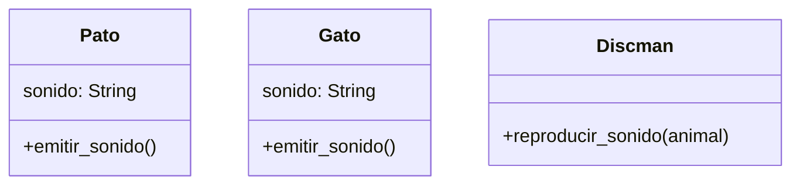
````

---

Diseño Diagrama

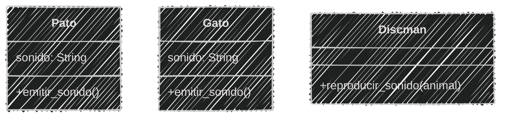
<!--.element class="center-mermaid"-->

---

Tanto el `Pato` como el `Gato` tienen el mismo método

`emitir_sonido()`

`Discman` utilizará ese nombre de método para reproducir el sonido de cualquier animal

---

En el archivo `discman.py` 

```python [1-14|15-20]
# Definición
class Pato:
    sonido = "cuac"
    def emitir_sonido(self):
        print (f"El pato 🦆 hace: {self.sonido}")

class Gato:
    sonido = "miau"
    def emitir_sonido(self):
        print (f"El gato 🐱 hace: {self.sonido}")

class Discman:
    def reproducir_sonido(self, objeto):
        objeto.emitir_sonido()
# Uso
pato = Pato()
gato = Gato()
discman = Discman()
discman.reproducir_sonido(pato)
discman.reproducir_sonido(gato)
```

```text
El pato 🦆 hace: cuac
El gato 🐱 hace: miau
```

---

#### Ejercicio para ti (02)

En la carpeta **sesion07** modifica los archivos **discman.md** y **discman.py**

```markdown
La empresa `PySound` quiere mejorar su Discman para niños.
Le añaden la capacidad de reproducir sonidos
de objetos que no son animales,
añadiendo los siguientes instrumentos:
- Campana que hace "ding"
- Tambor que hace "boom"
```

Obtener el *Análisis*

<iframe src="https://time-stuff.com/embed.html" frameborder="0" scrolling="no" width="391" height="140"></iframe>

---

Modificando el *Análisis*

```markdown [10-13|18,19,26-29,35-36]
# Analisis

Requisitos
- El Discman debe reproducir sonidos de animales
- Debe mostrar el animal que emite el sonido
- El pato debe emitir el sonido "cuac"
- El gato debe emitir el sonido "miau"
- Debe reproducir el sonido del pato
- Debe reproducir el sonido del gato
- La campana debe emitir el sonido "ding"
- El tambor debe emitir el sonido "boom"
- Debe reproducir el sonido de la campana
- Debe reproducir el sonido del tambor
Objetos
- Pato
- Gato
- Discman
- Campana
- Tambor

Características
- Pato:
    - sonido "cuac"
- Gato:
    - sonido "miau"
- Campana:
    - sonido "ding"
- Tambor:
    - sonido "boom"

Acciones
- Pato: emitir sonido
- Gato: emitir sonido
- Discman: reproducir sonido
- Campana: emitir sonido
- Tambor: emitir sonido
```

---

#### Ejercicio para ti (02)

Ahora obtenemos el diseño del *diagrama de clase*

2 minutos

<iframe src="https://time-stuff.com/embed.html" frameborder="0" scrolling="no" width="391" height="140"></iframe>

Modifica el archivo `discman.md`

---

Modificando el diseño de diagrama de clases

```` [13-21]
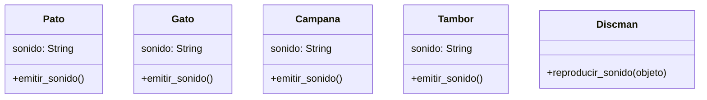
````

---

Modificando el diseño de diagrama de clases

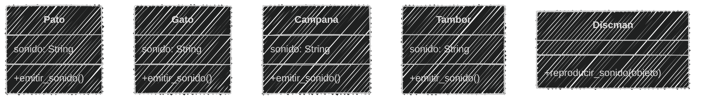
<!--.element class="center-mermaid"-->

---

#### Ejercicio para ti (02)

Ya tenemos el *análisis y diseño* de la clase

Ahora podemos **programar**

Modifica el archivo `discman.py`

3 minutos

<iframe src="https://time-stuff.com/embed.html" frameborder="0" scrolling="no" width="391" height="140"></iframe>

---

Implementando las clases

```python [12-20|31-34]
# Definición
class Pato:
    sonido = "cuac"
    def emitir_sonido(self):
        print (f"El pato 🦆 hace: {self.sonido}")

class Gato:
    sonido = "miau"
    def emitir_sonido(self):
        print (f"El gato 🐱 hace: {self.sonido}")

class Campana:
    sonido = "ding"
    def emitir_sonido(self):
        print (f"La campana 🔔 hace: {self.sonido}")

class Tambor:
    sonido = "boom"
    def emitir_sonido(self):
        print (f"El tambor 🥁 hace: {self.sonido}")

class Discman:
    def reproducir_sonido(self, objeto):
        objeto.emitir_sonido()
# Uso
pato = Pato()
gato = Gato()
discman = Discman()
discman.reproducir_sonido(pato)
discman.reproducir_sonido(gato)
campana = Campana()
tambor = Tambor()
discman.reproducir_sonido(campana)
discman.reproducir_sonido(tambor)
```

---

Ejecución del código

```bash
python discman.py
```

```text
El pato 🦆 hace: cuac
El gato 🐱 hace: miau
La campana 🔔 hace: ding
El tambor 🥁 hace: boom
```

---

El Duck Typing permite que la `Discman` trabaje con diferentes tipos de objetos
siempre y cuando tengan el método `emitir_sonido()`

Esto hace que el código sea más flexible y reutilizable

---

#### Polimorfismo

¿Qué es el polimorfismo?

---

Viene del griego

**poly** = "muchos"

**morphē** = "formas"

*→* **polymorphos** = "muchas formas"

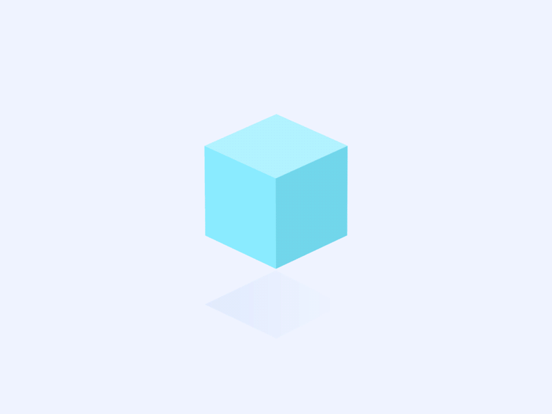 <!-- .element  width="30%"-->


---

#### Principios fundamentales

Es el **4º** y **último** principio fundamental de la Programación Orientada a Objetos (POO)

## **Polimorfismo**

## **o** 

## **Sobrecarga** 

---

Es la capacidad de usar **un mismo método** con distintos tipos o cantidades de parámetros

Permite que diferentes clases implementen **el mismo método** con comportamientos diferentes

---

Por ejemplo, en nuestro caso,

El `Pato`, el `Gato`, la `Campana` y el `Tambor` tienen un **mismo método**

`emitir_sonido()`

Pero cada uno de ellos emite un sonido **diferente**

---

El polimorfismo permite que el `Discman` llame al método `emitir_sonido()` de cualquier objeto que se le pase, sin importar su tipo

---

Esto es posible gracias al **duck typing**

ya que el `Discman` no necesita conocer el tipo del objeto que recibe,

solo necesita que el objeto tenga un método `emitir_sonido()`

---

Podemos ver polimorfismo mediante:

- Herencia
- Sobrecarga de métodos
- Sobrecarga de operadores

---

#### Polimorfismo con **herencia**

Una clase base define un método y las clases hijas lo implementan de manera propia

---

El polimorfismo con herencia permite que una **clase base** defina un método general
y las **clases hijas** lo implementen de manera única de acuerdo a sus necesidades

---

#### Ejemplo 03

Crear los archivos `herencia.md` y `herencia.py` en la carpeta `sesion07`

```markdown
Una empresa de delívery `PyHL` controla diferentes
tipos de vehículos de manera remota para 
transportar paquetes, sus vehículos más comunes son:

🚗 Auto: terrestre, a gasolina, mueve a 200 km/h
🚲 Bicicleta: terrestre, a pedal, mueve a 20 km/h

Los vehículos pueden moverse de manera diferente
```

---

Análisis en el archivo `herencia.md` 

```markdown
# Análisis
Requisitos
- Registrar los vehículos de la empresa
- Los autos pueden moverse mediante motor a gasolina
- Las bicicletas pueden moverse mediante pedales

Objetos
- Vehículo
    - Auto
    - Bicicleta

Características
- Vehículo: tipo, energia
- Auto: tipo, energia
- Bicicleta: tipo, energia

Acciones
- Vehículo: moverse
- Auto: moverse
- Bicicleta: moverse
```

---

Creando el diseño de diagrama de clases

````
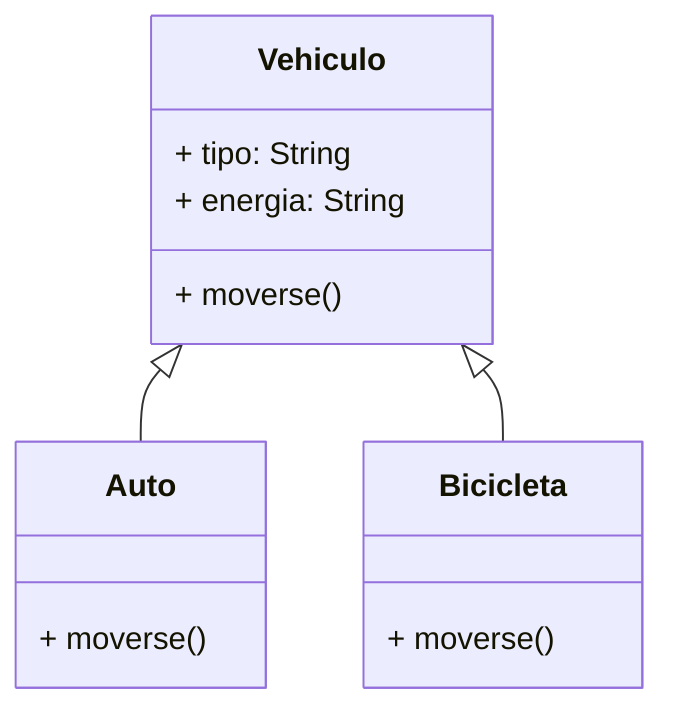
````

---

Creando el diseño de diagrama de clases

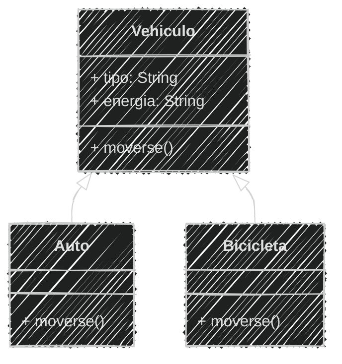
<!--.element class="center-mermaid"-->
---

Creando el script `herencia.py`

```python [1-25|26-30]
# Definición
class Vehiculo:
    def __init__(self, tipo, energia):
        self.tipo = tipo
        self.energia = energia
    
    def moverse(self):
        print(f"El vehículo {self.tipo}")
        print(f"Se mueve con {self.energia}")

class Auto(Vehiculo):
    def __init__(self):
        super().__init__("Terrestre", "motor a gasolina")
    
    def moverse(self):
        print("El 🚗 avanza a 200 km/h")
        print(f"Utiliza {self.energia} y es {self.tipo}")

class Bicicleta(Vehiculo):
    def __init__(self):
        super().__init__("Terrestre", "pedales")
    
    def moverse(self):
        print("La 🚲 avanza a 20 km/h")
        print(f"Es {self.tipo} y {self.energia}")
# Uso
auto = Auto()
bicicleta = Bicicleta()
auto.moverse()
bicicleta.moverse()
```

---

Ejecución del código

```bash
python herencia.py
```

```text
El 🚗 avanza a 200 km/h
Utiliza motor a gasolina y es Terrestre
La 🚲 avanza a 20 km/h
Es Terrestre y pedales
```

---

#### Ejercicio para ti (04)

```markdown
La empresa de delívery `PyHL` quiere ampliar su flota de vehículos
añadiendo nuevos tipos de transporte:

- ✈️ Avión: aéreo, a gasolina, mueve a 900 km/h
- ⛵ Bote: acuático, a viento, mueve a 30 km/h

Los vehículos pueden moverse de manera diferente
```

Obtener el *Análisis*

2 minutos 

<iframe src="https://time-stuff.com/embed.html" frameborder="0" scrolling="no" width="391" height="140"></iframe>

Modifica al archivo `herencia.md`

---

Creando el *análisis*

```markdown [6-7,13-14|20-21,27-28]
# Análisis
Requisitos
- Registrar los vehículos de la empresa
- Los autos pueden moverse mediante motor a gasolina
- Las bicicletas pueden moverse mediante pedales
- Los aviones pueden moverse mediante motor a gasolina
- Los botes pueden moverse mediante viento

Objetos
- Vehículo
    - Auto
    - Bicicleta
    - Avión
    - Bote

Características
- Vehículo: tipo, energia
- Auto: tipo, energia
- Bicicleta: tipo, energia
- Avión: tipo, energia
- Bote: tipo, energia

Acciones
- Vehículo: moverse
- Auto: moverse
- Bicicleta: moverse
- Avión: moverse
- Bote: moverse
```

---

#### Ejercicio para ti (04)

Ahora obtenemos el diseño del *diagrama de clase*

2 minutos

<iframe src="https://time-stuff.com/embed.html" frameborder="0" scrolling="no" width="391" height="140"></iframe>

Modificar al archivo `herencia.md`

---

Creando el diseño de diagrama de clases

```` [14-19|22-23]
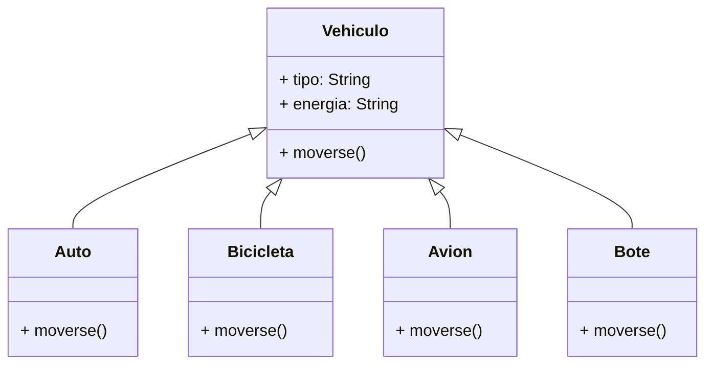
````

---

Creando el diseño de diagrama de clases

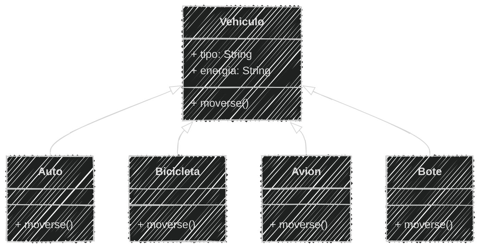
<!--.element class="center-mermaid"-->

---

#### Ejercicio para ti (04)

Ya tenemos el *análisis y diseño* de la clase

Ahora podemos **programar**

3 minutos

<iframe src="https://time-stuff.com/embed.html" frameborder="0" scrolling="no" width="391" height="140"></iframe>

Modificar el archivo `herencia.py`

---

Implementando las clases

```python [27-41|47-50]
# Definición
class Vehiculo:
    def __init__(self, tipo, energia):
        self.tipo = tipo
        self.energia = energia
    
    def moverse(self):
        print(f"El vehículo {self.tipo}")
        print(f"Se mueve con {self.energia}")

class Auto(Vehiculo):
    def __init__(self):
        super().__init__("Terrestre", "motor a gasolina")
    
    def moverse(self):
        print("El 🚗 avanza a 200 km/h")
        print(f"Utiliza {self.energia} y es {self.tipo}")

class Bicicleta(Vehiculo):
    def __init__(self):
        super().__init__("Terrestre", "pedales")
    
    def moverse(self):
        print("La 🚲 avanza a 20 km/h")
        print(f"Es {self.tipo} y {self.energia}")

class Avion(Vehiculo):
    def __init__(self):
        super().__init__("Aéreo", "motor a gasolina")
    
    def moverse(self):
        print("El ✈️ vuela a 900 km/h")
        print(f"Utiliza {self.energia} y es {self.tipo}")

class Bote(Vehiculo):
    def __init__(self):
        super().__init__("Acuático", "viento")
    
    def moverse(self):
        print("El ⛵ navega a 30 km/h")
        print(f"Utiliza {self.energia} y es {self.tipo}")
# Uso
auto = Auto()
bicicleta = Bicicleta()
auto.moverse()
bicicleta.moverse()
avion = Avion()
bote = Bote()
avion.moverse()
bote.moverse()
```

---

Ejecución del código

```bash
python herencia.py
```

```text
El 🚗 avanza a 200 km/h
Utiliza motor a gasolina y es Terrestre
La 🚲 avanza a 20 km/h
Es Terrestre y pedales
El ✈️ vuela a 900 km/h
Utiliza motor a gasolina y es Aéreo
El ⛵ navega a 30 km/h
Utiliza viento y es Acuático
```

---

#### Polimorfismo de **métodos**

Consiste en definir **múltiples métodos** con el mismo nombre dentro de una **misma clase**, pero con diferentes parámetros

```text
clase Persona 
    método hablar() 
        // Emite un sonido genérico

    método hablar(frase)
        // Habla con una frase
```

---

En otros lenguajes de programación es posible la polimorfismo de métodos

en la misma clase, definiendo múltiples métodos con el mismo nombre pero con diferentes parámetros

---

En Python, esto *NO es posible*

Python NO permite el polimorfismo de métodos por parámetros

Si definimos múltiples métodos con el mismo nombre en una clase, el último definido sobrescribirá a los anteriores

Pero, se puede lograr un **comportamiento similar** 

1. Con parámetros por defecto
2. Con argumentos variables `*args` y `**kwargs`

---

#### Ejemplo 05

Crear el archivo `mensaje.md` y los archivos

`mensaje_01.py` y `mensaje_02.py`

en la carpeta `sesion07`

```markdown
Una empresa de mensajería posee un sistema capaz de
enviar diferentes tipos de mensajes:
- Mensajes de texto
- Mensajes de audio
De acuerdo al tipo de mensaje, se debe enviar de manera diferente
Los mensajes de texto se envían como texto
Los mensajes de audio se envían como sonido
Un mensaje tiene un contenido
```

---

En el archivo **mensaje.md**

```markdown
# Análisis
Requisitos
- Los mensajes tienen un contenido
- Existen dos tipos de mensajes: texto y audio
- Los mensajes de texto deben enviarse como texto
- Los mensajes de audio deben enviarse como sonido
Objetos
- Mensaje

Características
- Mensaje: contenido: String

Acciones
- Mensaje: enviar()
```

---

Creando el diseño de diagrama de clases

````
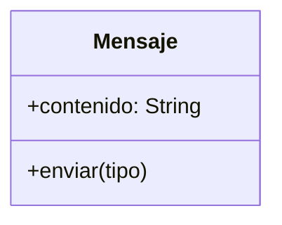
````

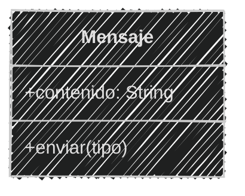
<!--.element class="center-mermaid"-->

---

En `mensaje_01.py` con **parámetros por defecto**

```python
# Definición
class Mensaje:
    def __init__(self, contenido):
        self.contenido = contenido
    def enviar(self, audio=False):
        if audio:
            print(f"📣 {self.contenido}")
        else:
            print(f"💬 {self.contenido}")
# Uso
mensaje = Mensaje("Hola, ¿cómo estás?")
mensaje.enviar()
mensaje.enviar(audio=True)
```

---

Ejecución del código

```bash
python mensaje_01.py
```

```text
💬 Hola, ¿cómo estás?
📣 Hola, ¿cómo estás?
```

---

En `mensaje_02.py` con **argumentos variables**

```python
# Definición
class Mensaje:
    def __init__(self, contenido):
        self.contenido = contenido
    def enviar(self, *args):
        if "audio" in args:
            print(f"📣 {self.contenido}")
        if "texto" in args:
            print(f"💬 {self.contenido}")
# Uso
mensaje = Mensaje("Hola, ¿cómo estás?")
mensaje.enviar("texto")
mensaje.enviar("audio")
mensaje.enviar("texto", "audio")
```

---
Ejecución del código

```bash
python mensaje_02.py
```

```text
💬 Hola, ¿cómo estás?
📣 Hola, ¿cómo estás?
📣 Hola, ¿cómo estás?
💬 Hola, ¿cómo estás?
```

---
#### Ejercicio para ti (06)


```markdown
La empresa de mensajería quiere ampliar su sistema de mensajes
añadiendo la capacidad de enviar mensajes mediante video
Los mensajes de video deben enviarse como video 🎥
```

Obtener el *Análisis*

1 minuto 

<iframe src="https://time-stuff.com/embed.html" frameborder="0" scrolling="no" width="391" height="140"></iframe>

Modifica al archivo `mensaje.md`

---

```markdown [7]
# Análisis
Requisitos
- Los mensajes tienen un contenido
- Existen dos tipos de mensajes: texto y audio
- Los mensajes de texto deben enviarse como texto
- Los mensajes de audio deben enviarse como sonido
- Los mensajes de video deben enviarse como video
Objetos
- Mensaje

Características
- Mensaje: contenido: String

Acciones
- Mensaje: enviar()
```

---

No cambiaremos el diagrama de clases, ya que el mensaje sigue siendo el mismo objeto

````

````
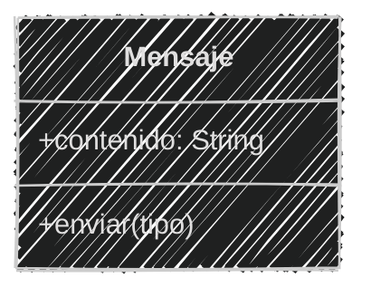
<!--.element class="center-mermaid"-->

---

#### Ejercicio para ti (06)

Ya tenemos el *análisis y diseño* de la clase

Ahora podemos **programar**

3 minutos

<iframe src="https://time-stuff.com/embed.html" frameborder="0" scrolling="no" width="391" height="140"></iframe>

Modifica los archivos `mensaje_01.py` y `mensaje_02.py`

---

En `mensaje_01.py` con **parámetros por defecto**

```python [5-11|13-17]
# Definición
class Mensaje:
    def __init__(self, contenido):
        self.contenido = contenido
    def enviar(self, audio=False, video=False):
        if audio:
            print(f"📣 {self.contenido}")
        if video:
            print(f"🎥 {self.contenido}")
        if not audio and not video:
            print(f"💬 {self.contenido}")
# Uso
mensaje = Mensaje("Hola, ¿cómo estás?")
mensaje.enviar()
mensaje.enviar(audio=True)
mensaje.enviar(video=True)
mensaje.enviar(audio=True, video=True)
```

---
Ejecución del código

```bash
python mensaje_01.py
```

```text
💬 Hola, ¿cómo estás?
📣 Hola, ¿cómo estás?
🎥 Hola, ¿cómo estás?
📣 Hola, ¿cómo estás?
🎥 Hola, ¿cómo estás?
```

---

En `mensaje_02.py` con **argumentos variables**

```python [5-11|13-17]
# Definición
class Mensaje:
    def __init__(self, contenido):
        self.contenido = contenido
    def enviar(self, *args):
        if "audio" in args:
            print(f"📣 {self.contenido}")
        if "texto" in args:
            print(f"💬 {self.contenido}")
        if "video" in args:
            print(f"🎥 {self.contenido}")
# Uso
mensaje = Mensaje("Hola, ¿cómo estás?")
mensaje.enviar("texto")
mensaje.enviar("audio")
mensaje.enviar("video")
mensaje.enviar("audio", "video")
```

---

Ejecución del código

```bash
python mensaje_02.py
```

```text
💬 Hola, ¿cómo estás?
📣 Hola, ¿cómo estás?
🎥 Hola, ¿cómo estás?
📣 Hola, ¿cómo estás?
🎥 Hola, ¿cómo estás?
```

---

#### Polimorfismo de **operadores**

El polimorfismo de operadores o 

**sobrecarga de operadores**

es la capacidad de definir el comportamiento de los operadores para objetos personalizados

Los operadores como `+`, `-`, `*`, `/`, pueden ser redefinidos para trabajar con instancias de clases

---
En Python con el operador `+` podemos **sumar** números y también **concatenar** cadenas

```python
a = 5
b = 10
c = a + b  # Suma de números
d = "Hola"
e = "Mundo"
f = d + " " + e  # Concatenación de cadenas
```

---
En Python se puede definir métodos especiales para **sobrecargar operadores**

Estos métodos tienen nombres específicos que comienzan y terminan con dos guiones bajos `__`

---

| Operador | Método especial |
| -------- | --------------- |
| `+`      | `__add__`       |
| `-`      | `__sub__`       |
| `*`      | `__mul__`       |
| `/`      | `__truediv__`   |
| `//`     | `__floordiv__`  |
| `%`      | `__mod__`       |
| `**`     | `__pow__`       |

---

Es una buena práctica definir **métodos propios** privados o protegidos

para que se puedan reutilizar en los **métodos especiales** de los operadores

---

#### Ejemplo 07

Crear los archivos `operadores.md` y `operadores.py` en la carpeta `sesion07`

```markdown
Una profesor de matemáticas quiere crear una calculadora
de vectores bidimensionales, los vectores tienen
dos componentes: x , y. Pueden sumarse y restarse
entre sí utilizando operadores + y -
Se muestran como pares (x, y) y tienen valores flotantes
La suma como la resta genera un nuevo vector resultante
Ejemplo:    A = (1, 1); B = (2, 3) 
            A + B = (3, 4) ; A - B = (-1, -2)
```

 <!-- .element  width="10%"-->

En el archivo `operadores.md`


---

En el archivo `operadores.md`

```markdown
# Análisis
Requisitos
- Los vectores deben tener componentes x , y flotantes
- Los vectores pueden sumarse y restarse entre sí
- Los vectores se pueden mostrar como (x, y)
- La suma de vectores genera un nuevo vector
- La resta de vectores genera un nuevo vector
- Los vectores pueden sumarse con el operador `+`
- Los vectores pueden restarse con el operador `-`
Objetos
- Vector
Características
- Vector: x, y
Acciones
- Vector:   sumar, restar, mostrar
```

---

Creando el diseño de diagrama de clases

````
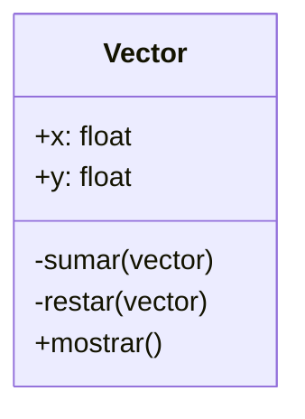
````

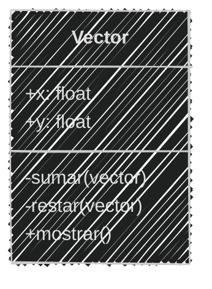
<!--.element class="center-mermaid"-->

---

En el archivo `operadores.py` 

```python [1-11|12-15|16-20|21-24]
# Definición
class Vector:
    def __init__(self, x, y):
        self.x = float(x)
        self.y = float(y)
    def __sumar(self, vector):
        return Vector(self.x + vector.x, self.y + vector.y)
    def __restar(self, vector):
        return Vector(self.x - vector.x, self.y - vector.y)
    def mostrar(self):
        return f"({self.x}, {self.y})"
    def __add__(self, vector):
        return self.__sumar(vector)
    def __sub__(self, vector):
        return self.__restar(vector)
# Uso
vector1 = Vector(1, 1)
vector2 = Vector(2, 3)
vector3 = vector1 + vector2  # Suma de vectores
vector4 = vector1 - vector2  # Resta de vectores
print(f"A: {vector1.mostrar()}")
print(f"B: {vector2.mostrar()}")
print(f"A+B: {vector3.mostrar()}")
print(f"A-B: {vector4.mostrar()}")
```

---

Ejecución del código

```bash
python operadores.py
```

```text
A: (1.0, 1.0)
B: (2.0, 3.0)
A+B: (3.0, 4.0)
A-B: (-1.0, -2.0)
```

---

#### Ejercicio para ti (08)

```markdown
El profesor de matemáticas quiere ampliar la calculadora
de vectores bidimensionales, añadiendo la capacidad
de multiplicar y dividir vectores utilizando operadores * y /
Los vectores se puede multiplicar y dividirse
por un escalar (número) generando un nuevo vector resultante
Ejemplo:    (2, 4) * 2 = (4, 8)
            (2, 4) / 2 = (1, 2)
```


Obtener el *Análisis*

2 minutos

<iframe src="https://time-stuff.com/embed.html" frameborder="0" scrolling="no" width="391" height="140"></iframe>

Modifica al archivo `operadores.md`

---

En el archivo `operadores.md`

```markdown [10-15|22]
# Análisis
Requisitos
- Los vectores deben tener componentes x , y flotantes
- Los vectores pueden sumarse y restarse entre sí
- Los vectores se pueden mostrar como (x, y)
- La suma de vectores genera un nuevo vector
- La resta de vectores genera un nuevo vector
- Los vectores pueden sumarse con el operador `+`
- Los vectores pueden restarse con el operador `-`
- Los vectores pueden multiplicarse por un escalar
- Los vectores pueden dividirse por un escalar
- La multiplicación de vectores genera un nuevo vector
- La división de vectores genera un nuevo vector
- Los vectores pueden multiplicarse por el operador `*`
- Los vectores pueden dividirse por el operador `/`
Objetos
- Vector
Características
- Vector: x, y
Acciones
- Vector:   sumar, restar, mostrar
            multiplicar, dividir
```

---

#### Ejercicio para ti (08)

Ahora obtenemos el diseño del *diagrama de clase*

2 minutos

<iframe src="https://time-stuff.com/embed.html" frameborder="0" scrolling="no" width="391" height="140"></iframe>

Modificar al archivo `operadores.md`

---

Creando el diseño de diagrama de clases

```` [9-10]
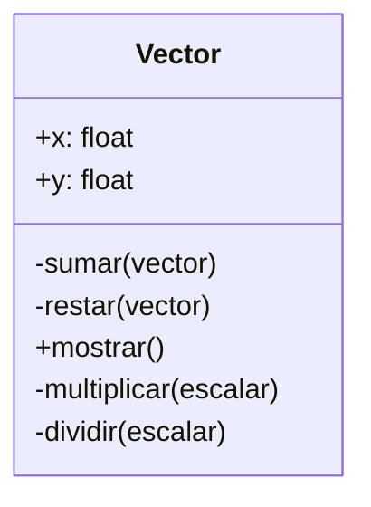
````

---

Creando el diseño de diagrama de clases

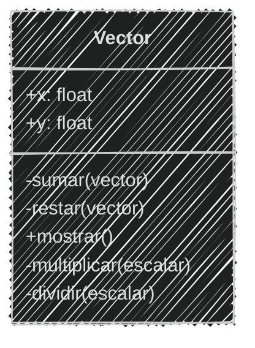
<!--.element class="center-mermaid"-->

---

#### Ejercicio para ti (08)

Ya tenemos el *análisis y diseño* de la clase

3 minutos

<iframe src="https://time-stuff.com/embed.html" frameborder="0" scrolling="no" width="391" height="140"></iframe>

Modifica el archivo `operadores.py`

---

Implementando los operadores

```python [10-13|20-23|33-36]
# Definición
class Vector:
    def __init__(self, x, y):
        self.x = float(x)
        self.y = float(y)
    def __sumar(self, vector):
        return Vector(self.x + vector.x, self.y + vector.y)
    def __restar(self, vector):
        return Vector(self.x - vector.x, self.y - vector.y)
    def __multiplicar(self, escalar):
        return Vector(self.x * escalar, self.y * escalar)
    def __dividir(self, escalar):
        return Vector(self.x / escalar, self.y / escalar)
    def mostrar(self):
        return f"({self.x}, {self.y})"
    def __add__(self, vector):
        return self.__sumar(vector)
    def __sub__(self, vector):
        return self.__restar(vector)
    def __mul__(self, escalar):
        return self.__multiplicar(escalar)
    def __truediv__(self, escalar):
        return self.__dividir(escalar)
# Uso
vector1 = Vector(1, 1)
vector2 = Vector(2, 3)
vector3 = vector1 + vector2  # Suma de vectores
vector4 = vector1 - vector2  # Resta de vectores
print(f"A: {vector1.mostrar()}")
print(f"B: {vector2.mostrar()}")
print(f"A+B: {vector3.mostrar()}")
print(f"A-B: {vector4.mostrar()}")
vector5 = vector1 * 2  # Multiplicación por escalar
vector6 = vector2 / 2  # División por escalar
print(f"A*2: {vector5.mostrar()}")
print(f"B/2: {vector6.mostrar()}")
```

---

Ejecución del código

```bash
python operadores.py
```

```text
A: (1.0, 1.0)
B: (2.0, 3.0)
A+B: (3.0, 4.0)
A-B: (-1.0, -2.0)
A*2: (2.0, 2.0)
B/2: (1.0, 1.5)
```

---

Subimos los avances de la sesión al repositorio en **GitHub**

```bash
git add .
git commit -m "Sesión 07"
git push origin main
```

---

#### Resumen

- El duck typing en Python permite que los objetos sean utilizados según su comportamiento y no por su tipo específico.
- El duck typing otorga flexibilidad y reutilización de código, pero puede causar errores en tiempo de ejecución si un objeto no cumple con el comportamiento esperado.

---

- El polimorfismo es la capacidad de usar un mismo método para trabajar con diferentes tipos de objetos, permitiendo que cada clase implemente el método de manera diferente.
- El polimorfismo se puede lograr mediante herencia, sobrecarga de métodos y sobrecarga de operadores.

---

- La herencia permite que una clase base defina métodos generales y que las clases hijas los implementen de manera específica.
- En Python la sobrecarga de métodos por parámetros no es posible, pero se puede simular usando argumentos por defecto `*args` y `**kwargs`.

---

- La sobrecarga de operadores permite definir el comportamiento de los operadores como +, -, *, / para objetos personalizados mediante métodos especiales.
- Es buena práctica definir métodos generales privados o protegidos para reutilizarlos en la sobrecarga de operadores.

---

#### Retos

Crear una carpeta con el nombre "retos_sesion_07" dentro del proyecto en la raíz, en la cual por cada ejercicio debes crear los siguientes archivos:

```bash
# Estructura de carpetas
psg-oop-2025/
    sesion07/
    retos_sesion_07/
        ejercicio_01.md
        ejercicio_01.py
        ejercicio_02.md
        ejercicio_02.py
        ejercicio_03.md
        ejercicio_03.py
```

---

1. En un **taller de carpintería**, los trabajadores utilizan diferentes **herramientas** para construir muebles, reparar objetos o ajustar piezas.  
Cada herramienta tiene una función particular, pero todas pueden ser **utilizadas** por el carpintero de manera similar.

Por ejemplo:  
- El **martillo** se usa para **clavar clavos**
- El **destornillador** se usa para **ajustar tornillos**
- La **llave inglesa** se usa para **apretar tuercas**

*(1/5)*

---

El carpintero no necesita saber el tipo exacto de herramienta que usa
solo necesita que la herramienta pueda ejecutar la acción **usar()**

*(2/5)*

---

- Diseña las clases necesarias para representar las herramientas e implementa su comportamiento `Martillo`, `Destornillador`, `LlaveInglesa`
- Cada herramienta debe tener su propio comportamiento en el método `usar()`

*(3/5)*

---

- Realiza el **análisis** y **diagrama de clases** para las clases `Martillo`, `Destornillador` y `LlaveInglesa` en el archivo `ejercicio_01.md`
- Escribe el código en Python utilizando **duck typing** en el archivo `ejercicio_01.py`

*(4/5)*

---

- Asegúrate de que las clases incluyan *atributos* y *métodos* coherentes con su propósito
- Utiliza buenas prácticas de *nomenclatura*, *encapsulamiento* y *legibilidad*
- Implementa el uso de los instrumentos

*(5/5)*

---

2. Una aplicación de aprendizaje musical permite a los usuarios practicar con distintos **instrumentos**
Cada instrumento tiene una forma diferente de producir sonido, pero todos pueden ser **tocados** por el usuario

Por ejemplo:  
- La **guitarra** hace "strum"
- El **piano** hace "plin"
- El **tambor** hace "boom"

*(1/5)*

---

Aunque cada instrumento suena distinto, todos comparten una característica común:  
pueden ejecutar la acción **tocar()**

*(2/5)*

---

- Diseña las clases necesarias para representar los diferentes **Instrumentos**
- Crea una clase base `Instrumento` con un método `tocar()` que será redefinido por cada clase hija
- Cada instrumento debe mostrar su propio sonido cuando se ejecuta el método `tocar()`

*(3/5)*

---

- Realiza el **análisis** y el **diagrama de clases** para `Instrumento`, `Guitarra`, `Piano` en el archivo `ejercicio_03.md`
- Escribe el código en Python en el archivo `ejercicio_03.py`

*(4/5)*

---

- Asegúrate de que las clases incluyan *atributos* y *métodos* coherentes con su propósito
- Utiliza buenas prácticas de *nomenclatura*, *encapsulamiento* y *legibilidad*
- Implementa el uso de loss instrumentos

*(5/5)*


---

3. Un profesor de matemáticas tiene una **calculadora de números romanos**.  
Cada número se representa con una letra o combinación de letras romanas, como:  
- I = 1  
- V = 5  
- X = 10  
- L = 50  
- C = 100  

*(1/3)*

---

Crear una clase que permita **sumar números romanos** usando el operador `+`

```python
num1 = Romano("X")   # 10  
num2 = Romano("V")   # 5
resultado = num1 + num2
```

El resultado debe ser un nuevo objeto con el valor "XV" (15)

Se logra implementando la **sobrecarga de operadores**, definiendo cómo funciona `+` en la clase **Romano**

*(2/3)*

---


- Asegúrate de que las clases incluyan *atributos* y *métodos* coherentes con su propósito
- Utiliza buenas prácticas de *nomenclatura*, *encapsulamiento* y *legibilidad*
- Implementa la suma de números romanos en el archivo `ejercicio_03.py`
- Realiza el **análisis** y el **diagrama de clases** en el archivo `ejercicio_03.md`

*(3/3)*

---

<!-- .slide: data-background-image="../../content/psg-bg-dark.png" data-background-size="100%"-->

<br>
<br>
<br>
<br>
<br>

[ <!-- .element width="20%"-->](https://github.com/python-la-paz/python-study-group-oop/tree/main/content/sesion07)

Repositorio de la Sesión

---
<!--.slide: data-visibility="hidden"-->
## Bibliografía y Referencias

- [Duck Typing](https://coggle.it/diagram/aAEvbcfX6LrOExL8/t/duck-typing)
- [Qué es Duck Typing](https://codigonautas.com/que-es-duck-typing/)
- [Duck Typing en Python](https://keepcoding.io/blog/duck-typing-en-python/)
- [Duck Typing Python](https://ellibrodepython.com/duck-typing-python)
- [Polimorfismo en POO](https://desarrolloweb.com/articulos/polimorfismo-programacion-orientada-objetos-concepto.html)
- [Polimorfismo en Python](https://fredygeek.com/2025/04/23/polimorfismo-en-python-que-es-y-como-funciona-con-ejemplos-claros/)
- [Polimorfismo en Python](https://www.guru99.com/es/polymorphism-in-python.html)
- [Sobrecarga de operadores](https://docs.python.org/3/library/operator.html)
- [Python Operator Overloading](https://www.delftstack.com/es/howto/python/python-operator-overloading/)
- [Object Oriented Analysis](https://www.gyata.ai/es/object-oriented-programming/object-oriented-analysis)
- [Guía PEP 8](https://peps.python.org/pep-0008/#class-names)
- [Mermaid Charts](https://www.mermaidchart.com/play)
- [Draw.io](https://app.diagrams.net/)
- [Python 3 Object-oriented Programming, Second Edition, Dusty PhillipsDusty Phillips](https://github.com/PacktPublishing/Python-3-Object-Oriented-Programming-Second-Edition)
- [Enfoque orientado a objetos](https://1library.co/article/enfoque-orientado-a-objetos-base-te%C3%B3rica.qvld461y)
