<!-- .slide: data-background-image="../../content/psg-bg-dark.png" data-background-size="100%"-->
 <!-- .element  hidden="true" -->

<br>
<br>
<br>

### Sesión  08
#### Dunder Methods
#### Personalización y control del comportamiento

---

### Antes de empezar

---

#### Proyecto en VSCode

Abre el proyecto en VSCode

```bash
code psg-oop-2025
```

Crea una carpeta con el nombre `sesion08`

```bash
mkdir sesion08
cd sesion08
```

- Los archivos de esta sesión deben estar dentro de esta carpeta

- Al finalizar la sesión, sube los cambios al repositorio en un commit

---

#### Dunder Methods

¿Qué son los Dunder Methods?

---
Los **Dunder Methods** o **Double Underscore Methods**

Son métodos especiales en Python que permiten personalizar el comportamiento de las instancias de una clase

---
Son llamados también *métodos mágicos* o *métodos especiales*

Es parte del enfoque de Python para implementar **sobrecarga**

Permitiendo a las clases definir un propio comportamiento con respecto a los **operadores** y **funciones integradas** del lenguaje

---

#### Ventajas de los Dunder Methods

- **Personalización**: Permiten definir cómo se comportan las instancias de una clase en situaciones específicas, como la impresión, la comparación o la conversión a otros tipos

- **Legibilidad**: Hacen que el código sea más intuitivo y fácil de entender

---

- **Integración**: Crea compatibilidad con las funciones y operadores integrados de Python

- **Reutilización**: Reduce la cantidad de código necesario para implementar ciertas funcionalidades


---

#### Usos Reales

- En las finanzas, para modelar valores monetarios y definir cómo se suman, restan o comparan
- En la geometría, para modelar puntos, círculos facilitando su comportamiento entre sí

---

En el mundo real varias librerías y frameworks utilizan Dunder Methods para definir el comportamiento de sus objetos

- **Pandas** utiliza Dunder Methods para definir cómo se comportan los DataFrames al realizar operaciones matemáticas o lógicas
- **Django** utiliza Dunder Methods para definir cómo se comportan los modelos al realizar consultas a la base de datos

---

- **SQLAlchemy** utiliza Dunder Methods para definir cómo se comportan los objetos al realizar operaciones de base de datos
- **Requests** utiliza Dunder Methods para definir cómo se comportan las peticiones HTTP

---

El uso de Dunder Methods es una práctica común en Python su comprensión es esencial para aprovechar al máximo el lenguaje

Es parte de hacer que tu código sea más elegante, eficiente y fácil de mantener

---

#### Notación de Dunder Methods

Los Dunder Methods se definen con dos guiones bajos al principio y al final del nombre del método

```python
def __init__(self, valor):
    self.valor = valor

def __str__(self):
    return f"Valor: {self.valor}"
```

---

Se pueden clasificar en:

- Métodos de Inicialización y Destrucción
- Métodos de Representación y Conversión
- Métodos de Comparación
- Operadores Aritméticos
- Métodos para colecciones


---

#### Métodos de **Inicialización y Destrucción**

Permiten definir el comportamiento de una clase al ser **creada o destruida**

Son utilizados para inicializar atributos o liberar recursos

NO retornan ningún valor

---

Métodos más comunes

| Método     | Descripción                            |
| ---------- | -------------------------------------- |
| `__init__` | Método de inicialización (constructor) |
| `__del__`  | Método de destrucción (destructor)     |

---

#### `__init__`

| Característica     | Descripción                        |
| ------------------ | ---------------------------------- |
| Propósito          | Inicializa atributos de instancia  |
| Cuándo se llama    | Al crear un objeto de la clase     |
| 1er parámetro      | `self` (instancia)                 |
| Otros parámetros   | Valores para inicializar atributos |
| Nombre alternativo | Constructor                        |

---

Su uso es fundamental para establecer el **estado inicial** de un objeto

Se usa en todos los contextos para preparar un objeto antes de su uso

---

#### Ejemplo 01

Crear el archivo `persona.py` en la carpeta `sesion08`

```markdown
Existe la clase `Persona` que representa a una persona
con un nombre y una edad.
Cada que creamos una persona, queremos inicializar
sus atributos `nombre` y `edad` y posee la acción saludar
```

---

Análisis

```markdown
# Análisis
Requisitos
- Debe tener un constructor que reciba `nombre` y `edad`
- Debe almacenar estos valores en atributos de instancia
- Debe llamarse `Persona`
- La Persona debe poder saludar

Objetos
- Persona

Características
- Persona: nombre, edad

Acciones
- Persona: saludar
```

---

Diagrama de clases en Mermaid

````
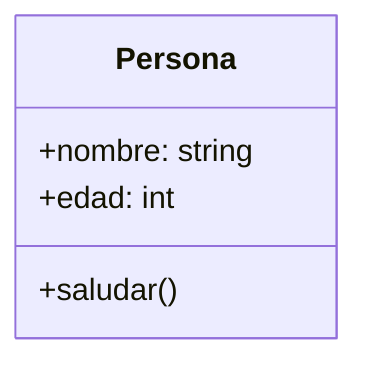
````

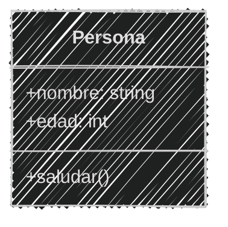
<!--.element class="center-mermaid"-->

---

En el archivo `persona.py`

```python [1-7|8-10]
# Definición
class Persona:
    def __init__(self, nombre, edad): # Constructor
        self.nombre = nombre
        self.edad = edad
    def saludar(self):
        print(f"Hola, soy {self.nombre} con {self.edad} años")
# Uso
jhon = Persona('Jhon', 30)
jhon.saludar()
```

```text
Hola, soy Jhon con 30 años
```
---

Para el siguiente método especial `__del__` es importante entender el uso de la palabra reservada `del`

---

#### Palabra reservada "`del`"


La palabra reservada `del` se utiliza para eliminar una *referencia* a un objeto

Después de eliminar la referencia, la instancia se destruye y ya no se puede acceder a ella

Puede ser utilizada para eliminar **variables**, **atributos** de objetos, **elementos** de listas o diccionarios

Incluso para eliminar **instancias** de clases

---

Usos comunes de `del`:

| Uso                | Ejemplo               |
| ------------------ | --------------------- |
| Eliminar variable  | `del variable`        |
| Eliminar atributo  | `del objeto.atributo` |
| Eliminar elemento  | `del lista[indice]`   |
| Eliminar instancia | `del instancia`       |

---

Uso de `del` para eliminar una variable

```python
try:
  edad = 10
  print(edad) 
  del edad  # Elimina la referencia a 'edad'
  print(edad) # Esto generará un error porque 'edad' ya no existe
except Exception as e:
  print(e)
```

```text
10
name 'edad' is not defined
```

---

Veamos ahora el método especial `__del__`

---

#### `__del__`

| Característica     | Descripción                                          |
| ------------------ | ---------------------------------------------------- |
| Propósito          | Realiza acción antes de destruir                     |
| Cuándo se llama    | Al eliminar la referencia o al finalizar el programa |
| 1er parámetro      | `self` (instancia)                                   |
| Otros parámetros   | *Ninguno*                                            |
| Nombre alternativo | Destructor                                           |

---

El método `__del__` se utiliza para liberar recursos o realizar acciones antes de que una instancia de la clase sea **eliminada o destruida**

---

Se llama **automáticamente** cuando el recolector de basura de Python elimina la instancia o cuando se utiliza la función `del` al eliminar una referencia a la instancia

Su uso es menos común, ya que Python maneja **automáticamente** la memoria

---

Es útil para liberar recursos externos, como

**archivos abiertos** o **conexiones de red**

---

#### Ejemplo 02

Modifica los archivos `persona.md` y `persona.py` en la carpeta `sesion08`

```markdown
Tenemos la clase `Persona` que representa a una persona
con un nombre y una edad y queremos que al eliminar una persona
se despida con un mensaje y su nombre antes de ser destruida
```

---

Modificando `persona.md`

```markdown [7,16]
# Análisis
Requisitos
- Debe tener un constructor que reciba `nombre` y `edad`
- Debe almacenar estos valores en atributos de instancia
- Debe llamarse `Persona`
- La Persona debe poder saludar
- La Persona debe despedirse al ser destruida

Objetos
- Persona

Características
- Persona: nombre, edad

Acciones
- Persona: saludar, despedirse
```

---

Diagrama de clases en Mermaid

````
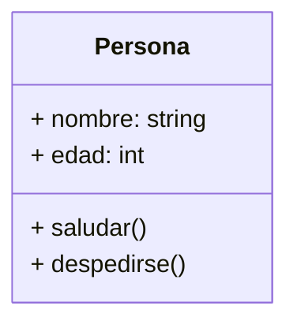
````

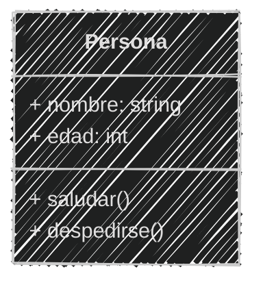
<!--.element class="center-mermaid"-->

---

En el archivo `persona.py`

Cuando termina la ejecución

```python [10-14|15-17]
# Definición
class Persona:
    def __init__(self, nombre, edad): # Constructor
        self.nombre = nombre
        self.edad = edad

    def saludar(self):
        print(f"Hola, soy {self.nombre} con {self.edad} años")
    
    def despedirse(self):
        print(f"Adiós, soy {self.nombre}")

    def __del__(self): # Destructor
        self.despedirse()
# Uso
jhon = Persona('Jhon', 30)
jhon.saludar()
```
```text
Hola, soy Jhon con 30 años
Adiós, soy Jhon
```

---

En el archivo `persona.py`

Cuando se elimina la instancia

```python [10-14|15-18]
# Definición
class Persona:
    def __init__(self, nombre, edad): # Constructor
        self.nombre = nombre
        self.edad = edad

    def saludar(self):
        print(f"Hola, soy {self.nombre} con {self.edad} años")
    
    def despedirse(self):
        print(f"Adiós, soy {self.nombre}")

    def __del__(self): # Destructor
        self.despedirse()
# Uso
jhon = Persona('Jhon', 30)
jhon.saludar()
del jhon  # Eliminación
```

```text
Hola, soy Jhon con 30 años
Adiós, soy Jhon
```

---
#### Métodos de Representación

Permiten definir cómo se **ve** una instancia de la clase cuando se **imprime** o se **convierte a una cadena**

Se utilizan para facilitar la depuración y la visualización de objetos

---

Métodos más comunes

| Método     | Descripción                         |
| ---------- | ----------------------------------- |
| `__repr__` | Representación oficial del objeto   |
| `__str__`  | Representación en cadena del objeto |


---

#### `__repr__`

| Característica  | Descripción                                 |
| --------------- | ------------------------------------------- |
| Propósito       | Representación oficial del objeto           |
| Cuándo se llama | Al usar `repr()` o en entornos interactivos |
| 1er parámetro   | `self` (instancia)                          |
| Retorno         | Cadena que representa el objeto             |

---

Se utiliza principalmente para proporcionar una representación clara y precisa de un objeto, que puede ser utilizada para depuración o desarrollo.

---

#### Palabras reservadas `repr` - `eval`

`repr` es un método que devuelve una cadena que representa el objeto de manera que pueda ser evaluada por Python

Significa que pueda ser evaluada por la función `eval()` para recrear el objeto original

`eval` es un método que evalúa una cadena como código Python y ejecuta la expresión contenida en ella

---

Se utiliza al llamar a la función `repr()` o al imprimir un objeto en un entorno interactivo

Es diferente del `str()` que se utiliza para mostrar una representación en cadena más amigable para el usuario

```python
msj = 'Hola\nMundo'
print(repr(msj))  # Representación oficial del objeto
print(str(msj))   # Representación en cadena del objeto
msj2 = eval(repr(msj))  # Recrea el objeto original
print(msj2)
```

```text
'Hola\nMundo'
Hola
Mundo
Hola
Mundo
```

---
#### Ejemplo 03

Modifica los archivos `persona.md` y `persona.py` en la carpeta `sesion08`

```markdown
Tenemos la clase `Persona` que representa a una persona
con un nombre y una edad.
La representación oficial del objeto debe mostrar
su nombre y edad de manera clara para poder recrear el objeto
```

---

Análisis

```markdown[8,17]
# Análisis
Requisitos
- Debe tener un constructor que reciba `nombre` y `edad`
- Debe almacenar estos valores en atributos de instancia
- Debe llamarse `Persona`
- La Persona debe poder saludar
- La Persona debe despedirse al ser destruida
- Debe tener una representación oficial del objeto

Objetos
- Persona

Características
- Persona: nombre, edad

Acciones
- Persona: saludar, despedirse, representación oficial
```

---

Diagrama de clases en Mermaid

````
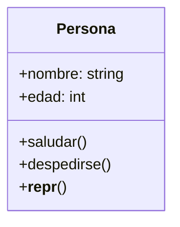
````

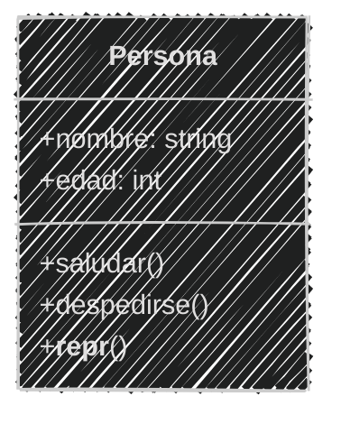
<!--.element class="center-mermaid"-->

---

En el archivo `persona.py`

```python [12-13|14-19]
# Definición
class Persona:
    def __init__(self, nombre, edad): # Constructor
        self.nombre = nombre
        self.edad = edad
    def saludar(self):
        print(f"Hola, soy {self.nombre} con {self.edad} años")
    def despedirse(self):
        print(f"Adiós, soy {self.nombre}")
    def __del__(self): 
        self.despedirse()
    def __repr__(self):  # Método de representación oficial
        return f"Persona('{self.nombre}', {self.edad})"
# Uso
jhon = Persona('Jhon', 30)
jhon.saludar()
# del jhon
print(repr(jhon))  # Representación oficial
print(eval(repr(jhon)))  # Recrea el objeto original
```

```text
Hola, soy Jhon con 30 años
Persona('Jhon', 30)
Persona('Jhon', 30)
Adiós, soy Jhon
Adiós, soy Jhon
```

---

#### `__str__`

| Característica  | Descripción                         |
| --------------- | ----------------------------------- |
| Propósito       | Representación en cadena del objeto |
| Cuándo se llama | Al usar "`print()`" o "`str()`"     |
| 1er parámetro   | `self` (instancia)                  |
| Retorno         | Cadena que representa el objeto     |

---

El método `__str__` se utiliza para proporcionar una representación legible del objeto, **más amigable** para el usuario

Se utiliza al llamar a la función `print()` o al convertir un objeto a una cadena con `str()`

---

Es útil para mostrar información al usuario de manera **clara y concisa**, como en la impresión de objetos en la consola o en la interfaz de usuario

---

#### Ejemplo 04

Modifica los archivos `persona.md` y `persona.py` en la carpeta `sesion08`

```markdown
La clase `Persona` que representa a una persona
con un nombre y una edad.
La representación en cadena del objeto debe mostrar el
 nombre y la edad de manera legible.
Con el formato `"[Nombre] ➡ [Edad] años"`
```

---

Análisis

```markdown[9,19]
# Análisis
Requisitos
-  Debe tener un constructor que reciba `nombre` y `edad`
-  Debe almacenar estos valores en atributos de instancia
-  Debe llamarse `Persona`
- La Persona debe poder saludar
- La Persona debe despedirse al ser destruida
- Debe tener una representación oficial del objeto
- Debe tener una representación en cadena del objeto

Objetos
- Persona

Características
- Persona: nombre, edad

Acciones
- Persona: saludar, despedirse, 
- Persona: representación oficial, representación en cadena
```

---

Diagrama de clases en Mermaid

````
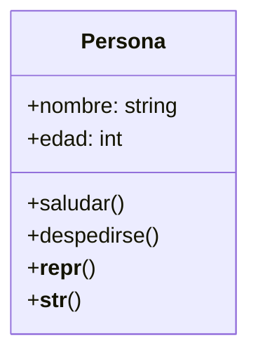
````

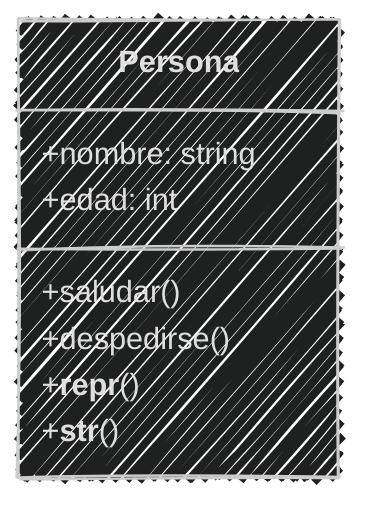
<!--.element class="center-mermaid"-->

---

En el archivo `persona.py`

```python [14-15|16-22]
# Definición
class Persona:
    def __init__(self, nombre, edad): # Constructor
        self.nombre = nombre
        self.edad = edad
    def saludar(self):
        print(f"Hola, soy {self.nombre} con {self.edad} años")
    def despedirse(self):
        print(f"Adiós, soy {self.nombre}")
    def __del__(self): 
        self.despedirse()
    def __repr__(self):
        return f"Persona('{self.nombre}', {self.edad})"
    def __str__(self):  # Método de representación en cadena
        return f"{self.nombre} ➡ {self.edad} años"
# Uso
jhon = Persona('Jhon', 30)
jhon.saludar()
# del jhon
print(repr(jhon))  # Representación oficial
# print(eval(repr(jhon)))
print(jhon)  # Representación en cadena
```

```text
Hola, soy Jhon con 30 años
Persona('Jhon', 30)
Jhon ➡ 30 años
Adiós, soy Jhon
```

---

Al momento de programar

Una **buena práctica** es definir al menos uno o ambos métodos `__repr__` y `__str__` para proporcionar 
una representación oficial y una representación amigable del objeto

---

#### Métodos de Conversión

Permiten definir cómo se **convierte** una instancia de la clase a otros tipos de datos

Son utilizados para facilitar la conversión de objetos a **tipos de datos nativos** de Python

---

Métodos más comunes


| Método      | Descripción                          |
| ----------- | ------------------------------------ |
| `__int__`   | Conversión a entero                  |
| `__float__` | Conversión a flotante                |
| `__bool__`  | Conversión a booleano                |
| `__str__`   | Conversión a cadena *representación* |

---

#### `__int__`

| Característica  | Descripción                     |
| --------------- | ------------------------------- |
| Propósito       | Conversión a entero             |
| Cuándo se llama | Al usar `int()`                 |
| 1er parámetro   | `self` (instancia)              |
| Retorno         | Entero que representa el objeto |

---

Su uso permite que los **objetos** se comporten correctamente al ser convertidos a **enteros**

Facilita la conversión de objetos a tipos de datos nativos de Python

---

#### Ejemplo 05

En los archivos `vector.md` y `vector.py` en la carpeta `sesion08`

```markdown
Un profesor de física tiene una calculadora de vectores
bidimensionales, los vectores tiene dos componentes x , y
la magnitud del vector es la suma de los componentes
absolutos de x , y.
Se representa visualmente con la forma `[x, y]`
Se convierte un vector a entero utilizando su magnitud
Los componentes son números flotantes
```

---

Análisis

```markdown
# Análisis
Requisitos
- Debe tener un constructor que reciba x , y flotantes
- Debe almacenar estos valores en atributos de instancia
- Debe poder convertirse a entero utilizando su magnitud
- Debe poder calcular su magnitud
- Debe poder representarse visualmente como `[x, y]`

Objetos
- Vector

Características
- Vector: x, y

Acciones
- Vector: magnitud, conversión a entero, representación

```

---

Diagrama de clases en Mermaid

````
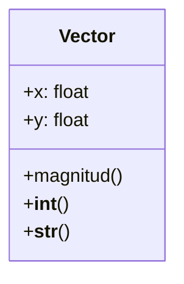
````

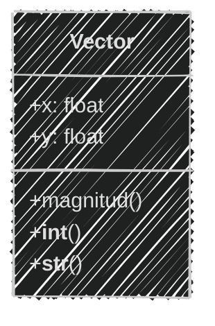
<!--.element class="center-mermaid"-->

---

En el archivo `vector.py`

```python [1-14|10-14|15-20]
# Definición
class Vector:
    def __init__(self, x, y):  # Constructor
        self.x = float(x)
        self.y = float(y)

    def __str__(self):  # Método de representación en cadena
        return f"[{self.x}, {self.y}]"

    def magnitud(self):
        return abs(self.x) + abs(self.y)

    def __int__(self):  # Método de conversión a entero
        return int(self.magnitud())

# Uso
a = Vector(3.1, -4.1)
print(a)  # Representación visual
magnitud = int(a)  # Conversión a entero
print(magnitud) 
```

```text
[3.1, -4.1]
7
```

---
#### `__float__`

| Característica  | Descripción                       |
| --------------- | --------------------------------- |
| Propósito       | Conversión a flotante             |
| Cuándo se llama | Al usar `float()`                 |
| 1er parámetro   | `self` (instancia)                |
| Retorno         | Flotante que representa el objeto |

---

Permite que los **objetos** se comporten correctamente al ser convertidos a **flotantes**

Facilita la conversión de objetos a tipos de datos nativos de Python

---

#### Ejemplo 06

Modifica los archivos `vector.md` y `vector.py` en la carpeta `sesion08`

```markdown
El profesor de física necesita que su calculadora de vectores
bidimensionales también pueda convertir vectores a flotantes
utilizando su magnitud
```

---

Análisis

```markdown [8,18]
# Análisis
Requisitos
- Debe tener un constructor que reciba x , y flotantes
- Debe almacenar estos valores en atributos de instancia
- Debe poder calcular su magnitud
- Debe poder representarse visualmente como `[x, y]`
- Debe poder convertirse a entero utilizando su magnitud
- Debe poder convertirse a flotante utilizando su magnitud

Objetos
- Vector

Características
- Vector: x, y

Acciones
- Vector: magnitud, conversión a entero, representación
- Vector: conversión a flotante

```

---

Diagrama de clases en Mermaid

```` [9]
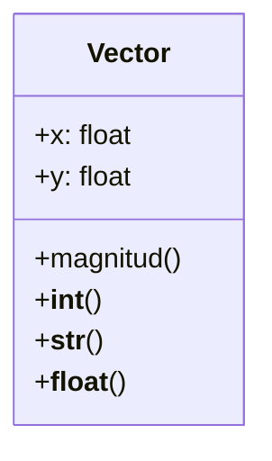
````

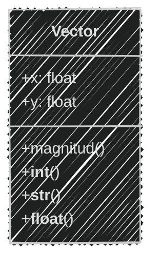
<!--.element class="center-mermaid"-->

---

En el archivo `vector.py`

```python [12-13|14-20]
# Definición
class Vector:
    def __init__(self, x, y):  # Constructor
        self.x = float(x)
        self.y = float(y)
    def __str__(self):
        return f"[{self.x}, {self.y}]"
    def magnitud(self):
        return abs(self.x) + abs(self.y)
    def __int__(self):
        return int(self.magnitud())
    def __float__(self):  # Método de conversión a flotante
        return float(self.magnitud())
# Uso
a = Vector(3.1, -4.1)
print(a)
magnitud = int(a) 
print(magnitud) 
magnitud = float(a)  # Conversión a flotante
print(magnitud) 
```

```text
[3.1, -4.1]
7
7.199999999999999
```

---

#### `__bool__`

| Característica  | Descripción                                                        |
| --------------- | ------------------------------------------------------------------ |
| Propósito       | Conversión a booleano                                              |
| Cuándo se llama | Al usar `bool()` o en contextos booleanos `if`, operadores lógicos |
| 1er parámetro   | `self` (instancia)                                                 |
| Retorno         | `True` o `False` dependiendo del estado del objeto                 |

---

Se usa para definir el comportamiento de un objeto en condicionales, como en sentencias `if` o bucles `while`

Permite definir el **truthiness** de un objeto, es decir, si el objeto se considera **verdadero o falso** en un contexto booleano

---

#### Ejemplo 07

En el archivo `vector.py`

```markdown
Para la calculadora de vectores bidimensionales
es importante poder evaluar si un vector es "verdadero" o "falso"
Se considera "verdadero" si su magnitud es mayor que cero
Se considera "falso" si su magnitud es igual a cero
```

---

Análisis

```markdown [9-10,20]
# Análisis
Requisitos
- Debe tener un constructor que reciba x , y flotantes
- Debe almacenar estos valores en atributos de instancia
- Debe poder calcular su magnitud
- Debe poder representarse visualmente como `[x, y]`
- Debe poder convertirse a entero utilizando su magnitud
- Debe poder convertirse a flotante utilizando su magnitud
- Debe poder convertirse a booleano utilizando su magnitud
- Se considera "verdadero" si su magnitud es mayor que cero

Objetos
- Vector

Características
- Vector: x, y

Acciones
- Vector: magnitud, conversión a entero, representación
- Vector: conversión a flotante, conversión a booleano

```

---

Diagrama de clases en Mermaid

```` [10]
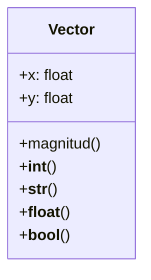
````

---

Diagrama de clases en Mermaid

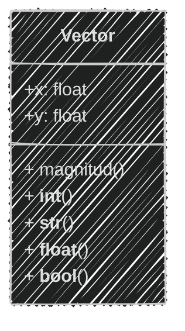
<!--.element class="center-mermaid"-->

---

En el archivo `vector.py`

```python [14-15|16-25]
# Definición
class Vector:
    def __init__(self, x, y):  # Constructor
        self.x = float(x)
        self.y = float(y)
    def __str__(self):
        return f"[{self.x}, {self.y}]"
    def magnitud(self):
        return abs(self.x) + abs(self.y)
    def __int__(self):
        return int(self.magnitud())
    def __float__(self):
        return float(self.magnitud())
    def __bool__(self):  # Método de conversión a booleano
        return self.magnitud() > 0
# Uso
a = Vector(3.1, -4.1)
print(a)
magnitud = int(a) 
print(magnitud) 
magnitud = float(a) 
print(magnitud) 
booleano = bool(a)
print(booleano)  # Conversión a booleano
```

```text
[3.1, -4.1]
7
7.199999999999999
True
```

---
#### Métodos de Comparación

Permiten definir cómo se comparan las instancias de la clase entre sí.

Son utilizados para facilitar la comparación de objetos en operaciones de ordenamiento, búsqueda y filtrado.

---

Los más comunes son:

| Método   | Descripción                        |
| -------- | ---------------------------------- |
| `__eq__` | Método de igualdad (`==`)          |
| `__lt__` | Método de menor que (`<`)          |
| `__gt__` | Método de mayor que (`>`)          |
| `__ne__` | Método de desigualdad (`!=`)       |
| `__le__` | Método de menor o igual que (`<=`) |
| `__ge__` | Método de mayor o igual que (`>=`) |


---

#### `__eq__`

| Característica  | Descripción                           |
| --------------- | ------------------------------------- |
| Propósito       | Comparar dos instancias para igualdad |
| Cuándo se llama | Al usar `==`                          |
| 1er parámetro   | `self` (instancia)                    |
| 2do parámetro   | `otro` (otra instancia)               |
| Retorno         | `True` o `False`                      |

---

El método `__eq__` se utiliza para definir cómo se **comparan** dos instancias de la clase para determinar si **son iguales**

Permite personalizar la comparación lógica de igualdad entre objetos

---

##### `__lt__`

| Característica  | Descripción                            |
| --------------- | -------------------------------------- |
| Propósito       | Comparar dos instancias para menor que |
| Cuándo se llama | Al usar `<`                            |
| 1er parámetro   | `self` (instancia)                     |
| 2do parámetro   | `otro` (otra instancia)                |
| Retorno         | `True` o `False`                       |

---

El método `__lt__` se utiliza para definir cómo se **comparan** dos instancias de la clase para determinar si una **es menor** que la otra

Permite personalizar la comparación lógica de menor que entre objetos


---

##### `__gt__`

| Característica  | Descripción                            |
| --------------- | -------------------------------------- |
| Propósito       | Comparar dos instancias para mayor que |
| Cuándo se llama | Al usar `>`                            |
| 1er parámetro   | `self` (instancia)                     |
| 2do parámetro   | `otro` (otra instancia)                |
| Retorno         | `True` o `False`                       |

---

El método `__gt__` se utiliza para definir cómo se **comparan** dos instancias de la clase para determinar si una **es mayor** que la otra

Permite personalizar la comparación lógica de mayor que entre objetos.

---

#### `__ne__`

| Característica  | Descripción                              |
| --------------- | ---------------------------------------- |
| Propósito       | Comparar dos instancias para desigualdad |
| Cuándo se llama | Al usar `!=`                             |
| 1er parámetro   | `self` (instancia)                       |
| 2do parámetro   | `otro` (otra instancia)                  |
| Retorno         | `True` o `False`                         |

---

El método `__ne__` se utiliza para definir cómo se **comparan** dos instancias de la clase para determinar si son **diferentes**.

Permite personalizar la comparación lógica de desigualdad entre objetos.

---

##### `__le__`

| Característica  | Descripción                                    |
| --------------- | ---------------------------------------------- |
| Propósito       | Comparar dos instancias para menor o igual que |
| Cuándo se llama | Al usar `<=`                                   |
| 1er parámetro   | `self` (instancia)                             |
| 2do parámetro   | `otro` (otra instancia)                        |
| Retorno         | `True` o `False`                               |

---

El método `__le__` se utiliza para definir cómo se **comparan** dos instancias de la clase para determinar si una es **menor o igual** que la otra

Permite personalizar la comparación lógica de menor o igual que entre objetos

---

##### `__ge__`

| Característica  | Descripción                                    |
| --------------- | ---------------------------------------------- |
| Propósito       | Comparar dos instancias para mayor o igual que |
| Cuándo se llama | Al usar `>=`                                   |
| 1er parámetro   | `self` (instancia)                             |
| 2do parámetro   | `otro` (otra instancia)                        |
| Retorno         | `True` o `False`                               |

---

El método `__ge__` se utiliza para definir cómo se **comparan** dos instancias de la clase para determinar si una es **mayor o igual** que la otra

Permite personalizar la comparación lógica de mayor o igual que entre objetos

---

#### Ejemplo 08

En los archivos `fruta.md` y `fruta.py` en la carpeta `sesion08`

```markdown
Un agrónomo tiene una herramienta para comparar frutas y
clasificarlas. Cada fruta tiene un nombre y un peso
Mediante el nombre y peso
- Quiere comparar si dos frutas son iguales
- Quiere comparar si dos frutas si una es menor que otra
- Quiere comparar si dos frutas si una es mayor que otra
- Se representa una fruta como `"[nombre] ➡ [peso] g"`
El peso de la fruta es un número entero que representa gramos
```

---

Análisis

```markdown
# Análisis
Requisitos
- Debe debe tener dos atributos: nombre y peso
- Debe poder representarse como "[nombre] ➡ [peso] g"
- Debe poder compararse con otra fruta
- Debe poder compararse para ver si son iguales
- Debe poder compararse para ver si es menor que otra fruta
  Mediante el peso y si ambas tienen el mismo nombre.
- Debe poder compararse para ver si es mayor que otra fruta
  Mediante el peso y si ambas tienen el mismo nombre.


Objetos
- Fruta
Características
- Fruta: nombre, peso
Acciones
- Fruta: igualdad, representación
- Fruta: menor que, mayor que
```

---

Diagrama de clases en Mermaid

````
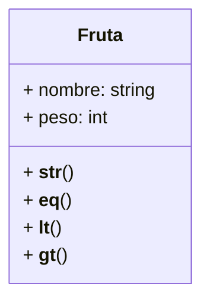
````

---

Diagrama de clases en Mermaid

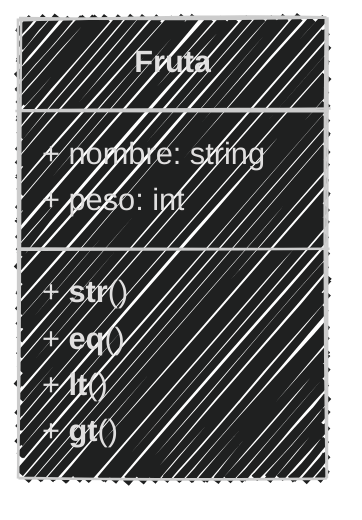
<!--.element class="center-mermaid"-->

---
En el archivo `fruta.py`

```python [1-8|10-13|15-18|20-23|24-33]
# Definición
class Fruta:
    def __init__(self, nombre, peso):  # Constructor
        self.nombre = nombre
        self.peso = int(peso)

    def __str__(self):  # Método de representación en cadena
        return f"{self.nombre} ➡ {self.peso} g"

    def __eq__(self, otro):  # Método de igualdad
        if isinstance(otro, Fruta):
            return self.nombre == otro.nombre and self.peso == otro.peso
        return False
    
    def __lt__(self, otro):  # Método de menor que
        if isinstance(otro, Fruta):
            return self.nombre == otro.nombre and self.peso < otro.peso
        return False

    def __gt__(self, otro):  # Método de mayor que
        if isinstance(otro, Fruta):
            return self.nombre == otro.nombre and self.peso > otro.peso
        return False
# Uso
manzana1 = Fruta('🍎', 150)
manzana2 = Fruta('🍎', 120)
manzana3 = Fruta('🍎', 150)
print(f'{manzana1} | {manzana2} | {manzana3}')
print(manzana1 == manzana3) 
print(manzana1 < manzana2)  
print(manzana1 > manzana2)
print(manzana2 < manzana3)
print(manzana2 > manzana3)
```

---

Ejecución del código

```bash
python fruta.py
```

```text
🍎 ➡ 150 g | 🍎 ➡ 120 g | 🍎 ➡ 150 g
True
False
True
True
False
```

---

#### Ejercicio para ti (09)

```markdown
El agrónomo mediante el nombre y el peso de la fruta
quiere ampliar la comparación de frutas
- Quiere comparar si dos frutas son diferentes
- Quiere comparar si dos frutas son menores o iguales
- Quiere comparar si dos frutas son mayores o iguales
```

Obtener el *Análisis*

2 minutos

<iframe src="https://time-stuff.com/embed.html" frameborder="0" scrolling="no" width="391" height="140"></iframe>

Modifica al archivo `fruta.md`

---
#### Análisis

```markdown
# Análisis
Requisitos
- Debe debe tener dos atributos: nombre y peso
- Debe poder representarse como "[nombre] ➡ [peso] g"
- Debe poder compararse con otra fruta
- Debe poder compararse para ver si son iguales
- Debe poder compararse para ver si es menor que otra fruta
  Mediante el peso y si ambas tienen el mismo nombre.
- Debe poder compararse para ver si es mayor que otra fruta
  Mediante el peso y si ambas tienen el mismo nombre.


Objetos
- Fruta
Características
- Fruta: nombre, peso
Acciones
- Fruta: igualdad, representación
- Fruta: menor que, mayor que
- Fruta: desigualdad, menor o igual que, mayor o igual que
```

---

#### Ejercicio para ti (09)

Ahora obtenemos el diseño del *diagrama de clase*

2 minutos

<iframe src="https://time-stuff.com/embed.html" frameborder="0" scrolling="no" width="391" height="140"></iframe>

Modificar al archivo `fruta.md`


---

Diagrama de clases en Mermaid

````
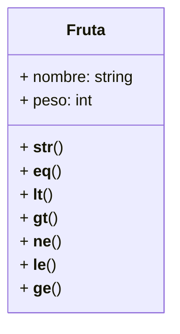
````

---

Diagrama de clases en Mermaid

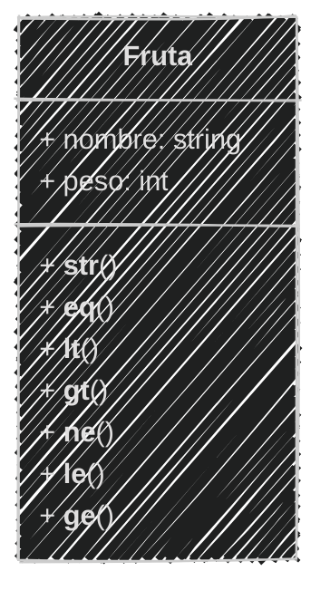
<!--.element class="center-mermaid"-->

---

#### Ejercicio para ti (08)

Ya tenemos el *análisis y diseño* de la clase

3 minutos

<iframe src="https://time-stuff.com/embed.html" frameborder="0" scrolling="no" width="391" height="140"></iframe>

Modifica el archivo `fruta.py`

---

En el archivo `fruta.py`

```python [25-38|49-51]
# Definición
class Fruta:
    def __init__(self, nombre, peso):  # Constructor
        self.nombre = nombre
        self.peso = int(peso)

    def __str__(self):  # Método de representación en cadena
        return f"{self.nombre} ➡ {self.peso} g"

    def __eq__(self, otro):  # Método de igualdad
        if isinstance(otro, Fruta):
            return self.nombre == otro.nombre and self.peso == otro.peso
        return False
    
    def __lt__(self, otro):  # Método de menor que
        if isinstance(otro, Fruta):
            return self.nombre == otro.nombre and self.peso < otro.peso
        return False

    def __gt__(self, otro):  # Método de mayor que
        if isinstance(otro, Fruta):
            return self.nombre == otro.nombre and self.peso > otro.peso
        return False
    
    def __ne__(self, otro):  # Método de desigualdad
        if isinstance(otro, Fruta):
            return self.nombre != otro.nombre or self.peso != otro.peso
        return True

    def __le__(self, otro):  # Método de menor o igual que
        if isinstance(otro, Fruta):
            return self.nombre == otro.nombre and self.peso <= otro.peso
        return False

    def __ge__(self, otro):  # Método de mayor o igual que
        if isinstance(otro, Fruta):
            return self.nombre == otro.nombre and self.peso >= otro.peso
        return False
# Uso
manzana1 = Fruta('🍎', 150)
manzana2 = Fruta('🍎', 120)
manzana3 = Fruta('🍎', 150)
print(f'{manzana1} | {manzana2} | {manzana3}')
print(manzana1 == manzana3) 
print(manzana1 < manzana2)  
print(manzana1 > manzana2)
print(manzana2 < manzana3)  
print(manzana2 > manzana3)
print(manzana1 != manzana3)
print(manzana2 <= manzana3)
print(manzana1 >= manzana3)
```

---

Ejecución del código

```bash
python fruta.py
```


```text
🍎 ➡ 150 g | 🍎 ➡ 120 g | 🍎 ➡ 150 g
True
False
True
True
False
False
True
True
```

---

#### Operadores Aritméticos

Los métodos especiales de **operadores aritméticos** permiten definir cómo se comportan las instancias de una clase al utilizar operadores aritméticos de:

- `+` Suma
- `-` Resta
- `*` Multiplicación
- `/` División

Son definidos para facilitar las operaciones matemáticas entre objetos

---

Los métodos más comunes son

| Método         | Descripción                        |
| -------------- | ---------------------------------- |
| `__add__`      | Suma, al utilizar `+`              |
| `__sub__`      | Resta, al utilizar `-`             |
| `__mul__`      | Multiplicación, al utilizar `*`    |
| `__truediv__`  | División, al utilizar  `/`         |
| `__floordiv__` | División entera, al utilizar  `//` |
| `__mod__`      | Módulo, al utilizar  `%`           |
| `__pow__`      | Potencia, al utilizar `**`         |


---

En la sesión de Polimorfismo, vimos el uso de los métodos para realizar operaciones aritméticas entre instancias de una clase.

[Sobrecarga de operadores](../../content/sesion07/#/69)

Ahora detallaremos sus características

---

#### `__add__`

| Característica  | Descripción                                 |
| --------------- | ------------------------------------------- |
| Propósito       | Definir la suma de dos instancias           |
| Cuándo se llama | Al usar `+`                                 |
| 1er parámetro   | `self` (instancia)                          |
| 2do parámetro   | `otro` (otra instancia)                     |
| Retorno         | Nueva instancia con el resultado de la suma |

---

#### `__sub__`

| Característica  | Descripción                                  |
| --------------- | -------------------------------------------- |
| Propósito       | Definir la resta de dos instancias           |
| Cuándo se llama | Al usar `-`                                  |
| 1er parámetro   | `self` (instancia)                           |
| 2do parámetro   | `otro` (otra instancia)                      |
| Retorno         | Nueva instancia con el resultado de la resta |

---

#### `__mul__`

| Característica  | Descripción                                           |
| --------------- | ----------------------------------------------------- |
| Propósito       | Definir la multiplicación de dos instancias           |
| Cuándo se llama | Al usar `*`                                           |
| 1er parámetro   | `self` (instancia)                                    |
| 2do parámetro   | `otro` (otra instancia)                               |
| Retorno         | Nueva instancia con el resultado de la multiplicación |

---
#### `__truediv__`

| Característica  | Descripción                                     |
| --------------- | ----------------------------------------------- |
| Propósito       | Definir la división de dos instancias           |
| Cuándo se llama | Al usar `/`                                     |
| 1er parámetro   | `self` (instancia)                              |
| 2do parámetro   | `otro` (otra instancia)                         |
| Retorno         | Nueva instancia con el resultado de la división |

---
#### `__floordiv__`

| Característica  | Descripción                                            |
| --------------- | ------------------------------------------------------ |
| Propósito       | Definir la división entera de dos instancias           |
| Cuándo se llama | Al usar `//`                                           |
| 1er parámetro   | `self` (instancia)                                     |
| 2do parámetro   | `otro` (otra instancia)                                |
| Retorno         | Nueva instancia con el resultado de la división entera |

---
#### `__mod__`

| Característica  | Descripción                                 |
| --------------- | ------------------------------------------- |
| Propósito       | Definir el módulo de dos instancias         |
| Cuándo se llama | Al usar `%`                                 |
| 1er parámetro   | `self` (instancia)                          |
| 2do parámetro   | `otro` (otra instancia)                     |
| Retorno         | Nueva instancia con el resultado del módulo |

---
#### `__pow__`

| Característica  | Descripción                                     |
| --------------- | ----------------------------------------------- |
| Propósito       | Definir la potencia de dos instancias           |
| Cuándo se llama | Al usar `**`                                    |
| 1er parámetro   | `self` (instancia)                              |
| 2do parámetro   | `otro` (otra instancia)                         |
| Retorno         | Nueva instancia con el resultado de la potencia |

---

#### Métodos para colecciones

Los métodos especiales para **colecciones** permiten definir cómo se comportan las instancias de una clase al utilizar operaciones comunes de colecciones, como obtener la longitud y acceder a elementos

---

Los métodos de colecciones se utilizan cuando se trabaja con **objetos que actúan como colecciones** con elementos indexados, como listas o diccionarios

---

Algunos de los más comunes son:

| Método        | Descripción                    |
| ------------- | ------------------------------ |
| `__len__`     | Longitud, `len()`              |
| `__getitem__` | Obtener, `obj[indice]`         |
| `__setitem__` | Asignar, `obj[indice] = valor` |
| `__delitem__` | Eliminar, `del obj[indice]`    |
| `__iter__`    | Iterar, `for elemento in obj`  |

---
#### `__len__`

| Característica  | Descripción                          |
| --------------- | ------------------------------------ |
| Propósito       | Definir la longitud de una instancia |
| Cuándo se llama | Al usar `len()`                      |
| 1er parámetro   | `self` (instancia)                   |
| Retorno         | Longitud del objeto (entero)         |

---
El método `__len__` se utiliza para definir cómo se **obtiene la longitud** de 

**una instancia** o de **sus atributos**

Es utilizado de manera similar al len en cadenas, listas, diccionarios y otros tipos de colecciones

---

#### `__getitem__`

| Característica  | Descripción                        |
| --------------- | ---------------------------------- |
| Propósito       | Definir cómo se obtienen elementos |
| Cuándo se llama | Al usar `objeto[indice]`           |
| 1er parámetro   | `self` (instancia)                 |
| 2do parámetro   | `indice` (índice del elemento)     |
| Retorno         | Elemento en el índice dado         |

---
El método `__getitem__` se utiliza para definir cómo se **obtienen los elementos** de una instancia de la clase al utilizar notación de corchetes `[]`

Se utiliza para acceder a elementos de objetos personalizados como **listas o diccionarios**

---

#### `__setitem__`

| Característica  | Descripción                          |
| --------------- | ------------------------------------ |
| Propósito       | Definir cómo se establecen elementos |
| Cuándo se llama | `objeto[indice] = valor`             |
| 1er parámetro   | `self` (instancia)                   |
| 2do parámetro   | `indice` (índice del elemento)       |
| 3er parámetro   | `valor` (valor nuevo)                |
| Retorno         | No retorna ningún valor              |

---

El método `__setitem__` se utiliza para definir cómo se **establecen los elementos** de una instancia de la clase al utilizar notación de corchetes `[]`

Se utiliza para asignar valores a elementos de objetos personalizados como **listas o diccionarios**

---

#### `__delitem__`

| Característica  | Descripción                        |
| --------------- | ---------------------------------- |
| Propósito       | Definir cómo se eliminan elementos |
| Cuándo se llama | Al usar `del objeto[indice]`       |
| 1er parámetro   | `self` (instancia)                 |
| 2do parámetro   | `indice` (índice del elemento)     |
| Retorno         | No retorna ningún valor            |

---

El método `__delitem__` se utiliza para definir cómo se **eliminan los elementos** de una instancia de la clase al utilizar notación de corchetes `[]`

Se utiliza para eliminar elementos de objetos personalizados como **listas o diccionarios**

---

#### `__iter__`

| Característica  | Descripción                              |
| --------------- | ---------------------------------------- |
| Propósito       | Definir cómo se itera sobre la instancia |
| Cuándo se llama | En, `for elemento in objeto`             |
| 1er parámetro   | `self` (instancia)                       |
| Retorno         | Iterador de la instancia                 |

---

El método `__iter__` se utiliza para definir cómo se **itera sobre una instancia** de la clase al utilizar un bucle `for`

Permite que la instancia **sea iterable**, lo que significa que se puede **recorrer elemento por elemento**


---

#### Ejemplo 14

```markdown
La biblioteca almacena una colección digital de libros
Quieren poder saber cuántos libros hay en la colección
De cada libro se guarda su título y autor.
- Ver los libros en formato `"[título] - [autor]"`.
- Ver la biblioteca en formato `"[libro1], [libro2], ..."`
- Los libros se almacenan en una lista dentro de la biblioteca
- La biblioteca debe permitir ver algunos libros por su índice
- La biblioteca debe permitir agregar nuevos libros
- La biblioteca debe permitir eliminar libros
- Se debe poder iterar sobre los libros de la biblioteca
```

En el archivo `biblioteca.py`

---

#### Análisis

```markdown
# Análisis
Requisitos
- La biblioteca debe tener una colección de libros
- Cada libro debe tener un título y un autor
- La biblioteca debe poder saber cuántos libros hay
- Existe una relación de agregación entre Biblioteca y Libro
- El libro se representa como `"(título - autor)"`
- La biblioteca se representa como `"libro1, libro2, ..."`
- La biblioteca debe poder acceder a los libros por su índice
- La biblioteca debe poder agregar nuevos libros
- La biblioteca debe poder eliminar libros
- La biblioteca debe poder iterar sobre los libros
Objetos
- Biblioteca
- Libro
Características
- Biblioteca: colección de libros
- Libro: título, autor
Acciones
- Biblioteca: longitud, representación
- Biblioteca: acceso a libros por índice, agregar, eliminar, iterar
- Libro: representación
```

---

Diagrama de clases en Mermaid

````
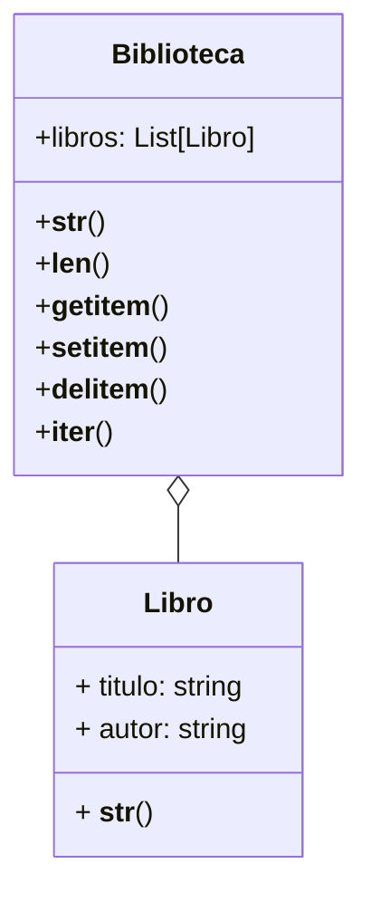
````

---

#### Diagrama de clases

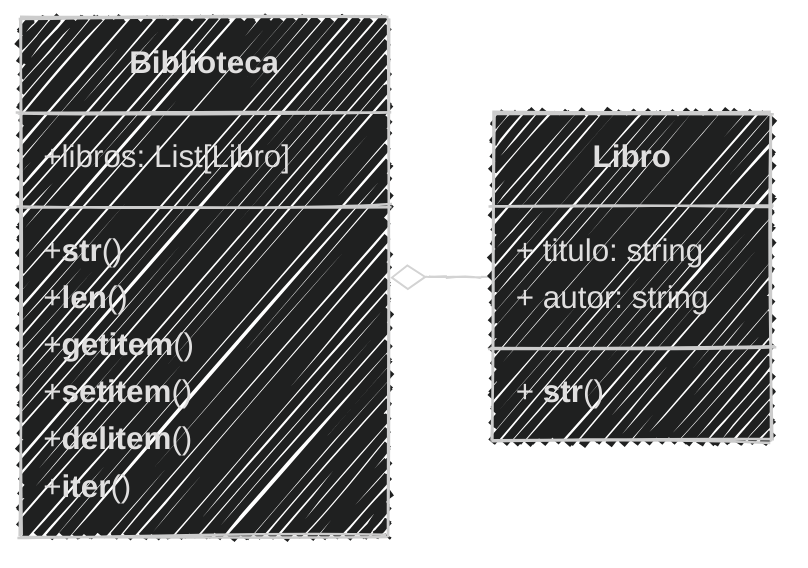
<!--.element class="center-mermaid"-->

---

En el archivo `biblioteca.py`

```python [1-7,9-13|14-23|25-30|31-32|33-34|35-36|37-38]
# Definición
class Libro:
    def __init__(self, titulo, autor):  # Constructor
        self.titulo = titulo
        self.autor = autor
    def __str__(self):
        return f"({self.titulo} - {self.autor})"

class Biblioteca:
    def __init__(self):  # Constructor
        self.libros = []  # Colección de libros
    def __str__(self):
        return ', '.join(str(libro) for libro in self.libros) 
    def __len__(self):  # Método de longitud
        return len(self.libros)
    def __getitem__(self, indice):  # Obtención de elementos
        return self.libros[indice]
    def __setitem__(self, indice, valor):  # Asignación de elementos
        self.libros[indice] = valor
    def __delitem__(self, indice):  # Eliminación de elementos
        del self.libros[indice]
    def __iter__(self):  # Iterador
        return iter(self.libros)
# Uso
biblioteca = Biblioteca()
biblioteca.libros.append(Libro("1984", "George Orwell"))
biblioteca.libros.append(Libro("La odisea", "Homero"))
print(biblioteca)
longiud = len(biblioteca)  # Obtener la longitud 
print(f"Número de libros: {longiud}")
libro = biblioteca[0]  # Acceder al primer libro
print(libro)
biblioteca[1] = Libro("Don Quijote", "Miguel de Cervantes")
print(biblioteca)
for libro in biblioteca:  # Iterar sobre los libros
    print(libro)
del biblioteca[0]  # Eliminar el primer libro
print(biblioteca)
```

---

Ejecución del código

```bash
python biblioteca.py
```

```text
(1984 - George Orwell), (La odisea - Homero)
Número de libros: 2
(1984 - George Orwell)
(1984 - George Orwell), (Don Quijote - Miguel de Cervantes)
(1984 - George Orwell)
(Don Quijote - Miguel de Cervantes)
(Don Quijote - Miguel de Cervantes)
```

---

#### Resumen

- Los Dunder Methods son métodos especiales en Python que permiten personalizar el comportamiento de las instancias de una clase.
- Estos métodos también se conocen como métodos mágicos o métodos especiales y se definen con dos guiones bajos al principio y al final del nombre.
- Permiten la personalización, legibilidad, integración con funciones y operadores integrados de Python, y la reutilización de código.

---

- Su uso es común en librerías y frameworks como Pandas, Django, SQLAlchemy y Requests para definir el comportamiento de sus objetos.
- Se pueden clasificar en métodos de inicialización y destrucción, métodos de representación y conversión, métodos de comparación, operadores aritméticos, y métodos para colecciones.

---

- Los métodos de inicialización y destrucción:
- `__init__` se utiliza para inicializar los atributos de una instancia al crear un objeto de la clase.
- `__del__` se utiliza para realizar acciones antes de destruir una instancia, como liberar recursos.

---

- Los métodos de representación y conversión:
- `__repr__` y `__str__` permiten definir la representación oficial y en cadena de los objetos.
- Los métodos de conversión como `__int__`, `__float__` y `__bool__` permiten convertir objetos personalizados a tipos nativos de Python.

---

- Los métodos de comparación:
- `__eq__`, `__ne__`, `__lt__`, `__le__`, `__gt__` y `__ge__` que permiten comparar instancias de una clase entre sí.

---

- Los métodos de operadores aritméticos:
- `__add__`, `__sub__`, `__mul__`, `__truediv__`, `__floordiv__`, `__mod__` y `__pow__` permiten definir operaciones matemáticas entre objetos.

---
- Los métodos para colecciones:
- `__len__`, `__getitem__`, `__setitem__`, `__delitem__` y `__iter__` permiten trabajar con objetos personalizados como si fueran colecciones.

---

- Comprender y utilizar los Dunder Methods es esencial para escribir código Python elegante, eficiente y fácil de mantener
- Permiten que las clases personalizadas se integren de manera fluida con el lenguaje y sus características, mejorando la legibilidad y funcionalidad del código.

---

#### Retos

Crear una carpeta con el nombre "retos_sesion_08" dentro del proyecto en la raíz, en la cual por cada ejercicio debes crear los siguientes archivos:

```bash
# Estructura de carpetas
psg-oop-2025/
    retos_sesion_08/
        ejercicio_01.md
        ejercicio_01.py
        ejercicio_02.md
        ejercicio_02.py
```

---

1. Un profesor de matemáticas necesita una calculadora de fracciones para enseñar conceptos básicos de aritmética. Cada fracción se representa mediante un numerador y un denominador.

Por ejemplo, la fracción **3/4** tiene un *numerador* igual a *3* y un *denominador* igual a *4*.


*(1/4)*

---

Crea la clase `Fraccion` que permita representar y operar con fracciones de forma intuitiva utilizando métodos especiales (dunder methods) y cumpla con los siguientes:
- Representación: `"numerador/denominador"`
- Puede sumar con otra fracción, operador: `+`
- Puede restar con otra fracción,  operador: `-`
- Puede multiplicar con otra fracción, operador: `*`
- Puede dividir con otra fracción, operador: `/`

*(2/4)*

---

Además, la clase `Fraccion` debe permitir comparar:

- Con otra fracción para igualdad, operador: `==`
- Con otra fracción para menor que, operador: `<`
- Con otra fracción para mayor que, operador: `>`
- Con otra fracción para desigualdad, operador: `!=`

*(3/4)*

---

- Realiza el **análisis** y **diagrama de clases** para la clase `Fraccion` en el archivo `ejercicio_01.md`
- Escribe el código en Python para la clase `Fraccion` en el archivo `ejercicio_01.py`
- Asegúrate de que la clase implemente correctamente los métodos especiales para operaciones y comparaciones.
- Crea varias instancias de `Fraccion` y realiza operaciones y comparaciones entre ellas para verificar el correcto funcionamiento de la clase.

*(4/4)*

---

Una agencia de viajes gestiona un **catálogo digital** que contiene información sobre destinos turísticos. Cada **destino** tiene un *nombre* y un *costo* asociado, y la agencia desea que el catálogo permita visualizar, modificar y recorrer los destinos de forma intuitiva.

*(1/4)*

---
- Los Destinos se representan como:

`"[destino] ➡ [costo] USD"`

- El Catálogo de Destino se representa como:

```text
🗺 Destinos 🗺
1. destino1
2. destino2
...
n. destinoN
```

*(2/4)*

---
El catálogo debe permitir:
- Ver la longitud del catálogo, `len(catalogo)`
- Acceder por su índice, `catalogo[indice]`
- Agregar destinos, `catalogo[indice]=destino`
- Eliminar destinos, `del catalogo[indice]`
- Iterar sobre los destinos, `for destino in catalogo`
- Ver el catálogo en el formato especificado
- Ver un destino en el formato especificado

*(3/4)*


---

- Realiza el **análisis** y **diagrama de clases** para las clases `Destino` y `Catalogo` en el archivo `ejercicio_02.md`
- Escribe el código en Python para las clases `Destino` y `Catalogo` en el archivo `ejercicio_02.py`
- Asegúrate de que la clase implemente correctamente los métodos especiales (dunder methods).
- Crea un catálogo con al menos 4 destinos turísticos y verifica el correcto funcionamiento de las operaciones y representaciones.

*(4/4)*

---
<!-- .slide: data-background-image="../../content/psg-bg-dark.png" data-background-size="100%"-->

<br>
<br>
<br>
<br>
<br>

[ <!-- .element width="20%"-->](https://github.com/python-la-paz/python-study-group-oop/tree/main/content/sesion08)

Repositorio de la Sesión

---
<!--.slide: data-visibility="hidden"-->
## Bibliografía y Referencias

- [Every Dunder Method](https://www.pythonmorsels.com/every-dunder-method/)
- [Python Operator Module](https://docs.python.org/3/library/operator.html)
- [Python Data Model](https://docs.python.org/3/reference/datamodel.html#object.__len__)
- [Dunder Methods](https://www.pythonmorsels.com/terms/#dunder)
- [Special Method Names](https://docs.python.org/3/reference/datamodel.html#special-method-names)
- [Dunder Magic Methods](https://diveintopython.org/es/learn/classes/dunder-magic-methods)
- [Dunder Methods in Python 3](https://web.archive.org/web/20110131211638/http://diveintopython3.org/special-method-names.html)
- [Object Oriented Analysis](https://www.gyata.ai/es/object-oriented-programming/object-oriented-analysis)
- [Python OOP](https://www.learnpython.org/en/Classes_and_Objects)
- [Diagrama de clases](https://diagramasuml.com/diagrama-de-clases/)
- [Guía PEP 8](https://peps.python.org/pep-0008/#class-names)
- [Mermaid Charts](https://www.mermaidchart.com/play)
- [Draw.io](https://app.diagrams.net/)
- [Python 3 Object-oriented Programming, Second Edition, Dusty PhillipsDusty Phillips](https://github.com/PacktPublishing/Python-3-Object-Oriented-Programming-Second-Edition)
