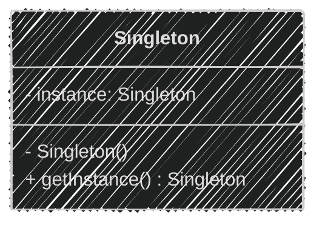
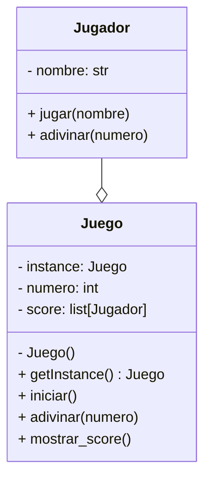
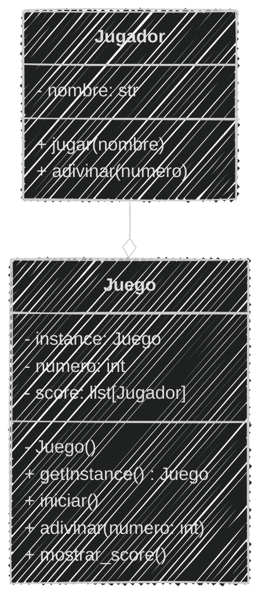

<!-- .slide: data-background-image="../../content/psg-bg-dark.png" data-background-size="100%"-->
 <!-- .element  hidden="true" -->

<br>
<br>
<br>

### Sesión  09
#### Patrones de Diseño
#### Singleton

---

#### VS Code

Abrimos el proyecto del Study Group

```bash
code psg-oop-2025
```

Creamos una carpeta llamada `sesion09` dentro del proyecto

```bash
mkdir sesion09
cd sesion09
```

Aquí guardaremos los ejemplos de la sesión

---

#### ¿Qué es un patrón de diseño?

Un patron de diseño es una idea o una solución típica para resolver un problema
que se repite una y otra vez.

---

Imagina que tu armas sillas de madera, cada vez que armas una silla tienes un 
manual con pasos claros que indican como armarla.

El manual no es la silla
pero es una forma probada para armar bien una silla.

### 📐📏🔨 → 🪑 🪑 🪑

> Los patrones de diseño son como esos manuales, pero para construir programas.

---

❌ No es un fragmento de código, no es una librería, no es un framework que 
puedes pegar y usar.

✅ Es un concepto, una solución probada a un problema común en el desarrollo.

---
#### ¿Por qué usar patrones de diseño?

- **Reutilización**: No tienes que reinventar la rueda cada vez que enfrentas un problema
- **Mantenibilidad**: El código es más fácil de entender y mantener

---
#### ¿Por qué usar patrones de diseño?

- **Colaboración**: Facilita la comunicación entre desarrolladores, ya que todos conocen los patrones comunes
- **Escalabilidad**: Permite que el código crezca de manera ordenada y estructurada

---

Los patrones varían en complejidad y propósito y pueden ser clasificados en tres categorías principales:

- **Creacionales**: Se centran en la creación de objetos y clases
- **Estructurales**: Se centran en la composición de clases y objetos
- **De Comportamiento**: Se centran en la interacción y responsabilidad entre objetos

---
Nos enfocaremos en los patrones creacionales, que son los que nos ayudan a
crear objetos de manera eficiente y flexible.

---

#### Patrones Creacionales

Los patrones creacionales son aquellos que se encargan de la creación de objetos

Ofrecen enfoques estructurados y reutilizables para crear instancias de clases

los más comunes son:

- **Singleton**
- **Factory**

---

#### Singleton

También llamado "patrón de diseño de instancia única"

Garantiza que una clase tenga una **ÚNICA** instancia y proporciona un punto de acceso global a ella

---

Esto significa que no importa cuántas veces intentes crear una instancia de
esa clase, siempre obtendrás la misma instancia.

---

#### ¿Por qué usar Singleton?

- **Control de acceso**: Permite controlar el acceso a recursos compartidos
- **Consistencia**: Asegura que todos los componentes del sistema utilicen la misma instancia
- **Eficiencia**: Evita la creación innecesaria de múltiples instancias

---

#### Casos de Uso

**Aplicaciones web y escritorio**

- Conexión a bases de datos: Evita múltiples conexiones a la misma base de datos
- Configuración global: Mantiene una configuración única para toda la aplicación
- Acceso a recursos compartidos: Controla el acceso a recursos como archivos, impresoras, etc.

---
#### Casos de Uso

**Juegos**

- Gestor de recursos: Carga y gestiona recursos como imágenes, sonidos, etc.
- Control de escena: Control del cambio de escenas o niveles en el juego
- Control de puntaje: Lleva el puntaje del jugador de manera centralizada

---
#### Casos de Uso

**Seguridad**

- Gestión de claves: Mantiene una única instancia de administración de claves de seguridad
- Autenticación: Controla el acceso a recursos sensibles
- Registro de actividad: Registro único de eventos y actividades realizadas

---

#### Ventajas del Singleton

- **Simplicidad**: Fácil de implementar y entender
- **Control**: Permite un control centralizado sobre la instancia
- **Eficiencia**: Reduce el uso de memoria al evitar múltiples instancias

---
#### Desventajas del Singleton

- **Dificultad en pruebas**: Al ser única y global no puede remplazarse fácilmente por una versión de prueba
- **Alto acoplamiento**: Crea una dependencia fuerte entre las clases y la instancia única
- **Persistencia**: Puede guardar estados no deseados si no se maneja correctamente

---

#### Diagrama de Clases



- `instance`: es la instancia única de la clase, es un atributo de clase
- `Singleton()`: es el constructor privado que evita la creación de instancias externas
- `getInstance()`: es un método estático que devuelve la instancia única de la clase

---

#### Ejemplo 01

```text
El juego "Adivina el número" permite a un jugador adivinar
un número secreto entre 1 y 100. El juego sólo permite un 
número a la vez y da pistas si el número es mayor o menor
que el número secreto.
Cada vez que un jugador adivina se guarda el jugador,
el número de intentos que le tomó adivinar y se muestra el score
El juego termina cuando el jugador escribe "salir"
```

En el archivo `adivina.md` se realizará el análisis y en el archivo `adivina.py` se implementará el patrón Singleton

---
#### Análisis

```markdown
Requisitos:
- El juego debe seleccionar un número secreto al azar entre 1 y 100
- El jugador debe adivinar el número secreto
- El juego debe informar si el número es mayor o menor que el número secreto
- El juego registra un Score con el jugador y el número de intentos
- El juego termina cuando el jugador escribe "salir"

Objetos:
- Juego: Representa el juego en sí
- Jugador: Representa al jugador que adivina el número

Características:
- Juego: numero, score
- Jugador: nombre

Acciones:
- Juego: iniciar(), adivinar(numero), mostrar_score()
- Jugador: jugar(nombre), adivinar(numero)
```

---
#### Diagrama de Clases

````

````

---

#### Diagrama de Clases


---
#### Implementación en Python

```python
class Jugador:
    def __init__(self, nombre):
        self.nombre = nombre

    def jugar(self):
        print(f"Jugador {self.nombre} ha comenzado a jugar.")
    
    def __str__(self):
        return f"🕹️ {self.nombre}"

class Juego:
    _instancia = None
    _score = []

    def __new__(cls):
        if cls._instancia is None:
            cls._instancia = super().__new__(cls)
        return cls._instancia

    def iniciar(self):
        print("Juego iniciado. Adivina el número entre 1 y 100.")
        self._semilla = {"Hola", "Python", "La Paz", "2025"}
        self._semilla.add(id(self._semilla))
        self._semilla |= set(self._score)
        semilla = (abs(hash(tuple(self._semilla))) * 71 + 79) % 73
        self.numero = (semilla % 100) + 1
        self.intentos = 0

    def adivinar(self, numero, jugador):
        self.intentos += 1
        if numero < self.numero:
            print("El número es mayor.")
        elif numero > self.numero:
            print("El número es menor.")
        else:
            print("¡Felicidades! Has adivinado el número.")
            Juego._score.append((jugador, self.intentos))
            return True
        return False

    def mostrar_score(self):
        print("Score:")
        for jugador, intentos in Juego._score:
            print(f"{jugador}: {intentos} intentos")

while True:
    nombre = input("Ingresa tu nombre (o 'salir' para terminar): ")
    if nombre.lower() == "salir":
        break
    jugador = Jugador(nombre)
    juego = Juego()
    juego.iniciar()
    while True:
        numero = input("Adivina el número: ")
        if numero.lower() == "salir":
            break
        try:
            numero = int(numero)
            finalizo = juego.adivinar(numero, jugador)
            if finalizo:
                break
        except ValueError:
            print("Por favor, ingresa un número válido.")
    juego.mostrar_score()
print("Gracias por jugar. ¡Hasta luego!")
```

---

#### Ejecución

```bash
python adivina.py
```
```text
Ingresa tu nombre (o 'salir' para terminar): Pedro
Juego iniciado. Adivina el número entre 1 y 100.
Adivina el número: 50
¡Felicidades! Has adivinado el número.
Score:
🕹️ Pedro: 1 intentos
Ingresa tu nombre (o 'salir' para terminar): juan
Juego iniciado. Adivina el número entre 1 y 100.
Adivina el número: 50
El número es menor.
Adivina el número: 25
El número es mayor.
Adivina el número: 37
El número es menor.
Adivina el número: 32
El número es mayor.
Adivina el número: 35
El número es mayor.
Adivina el número: 36
¡Felicidades! Has adivinado el número.
Score:
🕹️ Pedro: 1 intentos
🕹️ juan: 6 intentos
Ingresa tu nombre (o 'salir' para terminar): salir
Gracias por jugar. ¡Hasta luego!
```


#### Resumen

---

#### Retos


    
---
<!-- .slide: data-background-image="../../content/psg-bg-dark.png" data-background-size="100%"-->

<br>
<br>
<br>
<br>
<br>

[ <!-- .element width="20%"-->](https://github.com/python-la-paz/python-study-group-oop/content/sesion09)

Repositorio de la Sesión

---
<!--.slide: data-visibility="hidden"-->
## Bibliografía y Referencias

- [Object Oriented Analysis](https://www.gyata.ai/es/object-oriented-programming/object-oriented-analysis)
- [DDOO Unidad 1](https://dmd.unadmexico.mx/contenidos/DCEIT/BLOQUE1/DS/02/DDOO/U1/descargables/DDOO_Unidad_1.pdf)
- [Programación procedural VS orientada a objetos](https://programacionpro.com/programacion-procedural-vs-orientada-a-objetos-diferencias-y-similitudes/)
- [Python OOP](https://www.learnpython.org/en/Classes_and_Objects)
- [Atributos de clase](https://oregoom.com/python/atributos-clase/)
- [Diagrama de clases](https://diagramasuml.com/diagrama-de-clases/)
- [Guía PEP 8](https://peps.python.org/pep-0008/#class-names)
- [Mermaid Charts](https://www.mermaidchart.com/play)
- [Draw.io](https://app.diagrams.net/)
- [Python 3 Object-oriented Programming, Second Edition, Dusty PhillipsDusty Phillips](https://github.com/PacktPublishing/Python-3-Object-Oriented-Programming-Second-Edition)
- [Objetos en programación](https://ebac.mx/blog/objeto-en-programacion)
- [Enfoque orientado a objetos](https://1library.co/article/enfoque-orientado-a-objetos-base-te%C3%B3rica.qvld461y)
- [OOAD](https://www.tutorialspoint.com/object_oriented_analysis_design/ooad_object_oriented_analysis.htm)
https://refactoring.guru/es/design-patterns/what-is-pattern
https://academia-lab.com/enciclopedia/patron-creacional/
https://www.codigoycafe.net/patrones-de-diseno-de-software/patrones-de-diseno-creacionales-construyendo-objetos-de-manera-inteligente/560/
https://www.codigoycafe.net/programacion/cpp/patron-de-diseno-creacional-singleton/574/
https://academia-lab.com/enciclopedia/generador-lineal-congruente/