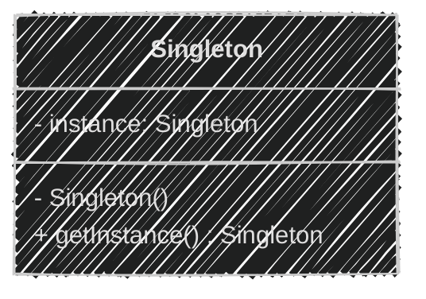
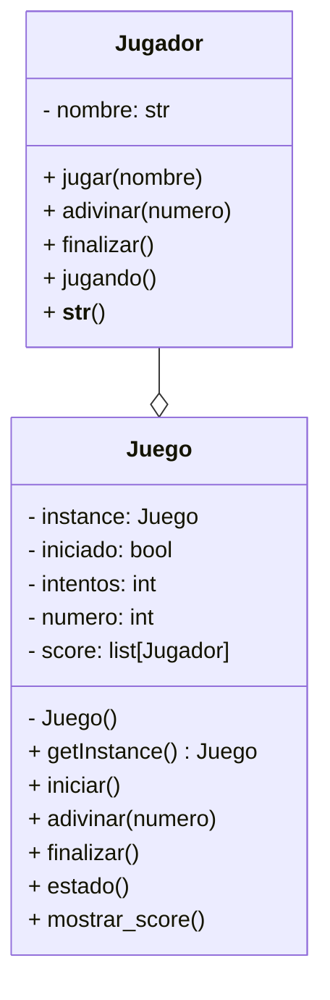
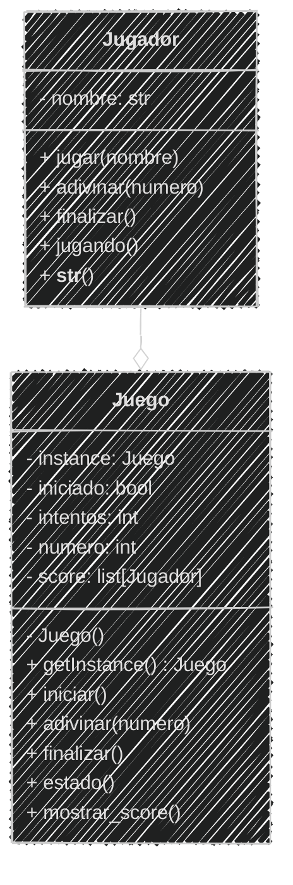

<!-- .slide: data-background-image="../../content/psg-bg-dark.png" data-background-size="100%"-->
 <!-- .element  hidden="true" -->

<br>
<br>
<br>

### Sesión  09
#### Patrones de Diseño
#### Singleton

---

#### VS Code

Abrimos el proyecto del Study Group

```bash
code psg-oop-2025
```

Creamos una carpeta llamada `sesion09` dentro del proyecto

```bash
mkdir sesion09
cd sesion09
```

Aquí guardaremos los ejemplos de la sesión

---

#### ¿Qué es un patrón de diseño?

Un patron de diseño es una idea o una solución típica para resolver un problema
que se repite una y otra vez.

---

Imagina que tu armas sillas de madera, cada vez que armas una silla tienes un 
manual con pasos claros que indican como armarla.

El manual no es la silla
pero es una forma probada para armar bien una silla.

### 📐📏🔨 → 🪑 🪑 🪑

> Los patrones de diseño son como esos manuales, pero para construir programas.

---

❌ No es un fragmento de código, no es una librería, no es un framework que 
puedes pegar y usar.

✅ Es un concepto, una solución probada a un problema común en el desarrollo.

---
#### ¿Por qué usar patrones de diseño?

- **Reutilización**: No tienes que reinventar la rueda cada vez que enfrentas un problema
- **Mantenibilidad**: El código es más fácil de entender y mantener

---
#### ¿Por qué usar patrones de diseño?

- **Colaboración**: Facilita la comunicación entre desarrolladores, ya que todos conocen los patrones comunes
- **Escalabilidad**: Permite que el código crezca de manera ordenada y estructurada

---

Los patrones varían en complejidad y propósito y pueden ser clasificados en tres categorías principales:

- **Creacionales**: Se centran en la creación de objetos y clases
- **Estructurales**: Se centran en la composición de clases y objetos
- **De Comportamiento**: Se centran en la interacción y responsabilidad entre objetos

---
Nos enfocaremos en los patrones creacionales, que son los que nos ayudan a
crear objetos de manera eficiente y flexible.

---

#### Patrones Creacionales

Los patrones creacionales son aquellos que se encargan de la creación de objetos

Ofrecen enfoques estructurados y reutilizables para crear instancias de clases

los más comunes son:

- **Singleton**
- **Factory**

---

#### Singleton

También llamado "patrón de diseño de instancia única"

Garantiza que una clase tenga una **ÚNICA** instancia y proporciona un punto de acceso global a ella

---

Esto significa que no importa cuántas veces intentes crear una instancia de
esa clase, siempre obtendrás la misma instancia.

---

#### ¿Por qué usar Singleton?

- **Control de acceso**: Permite controlar el acceso a recursos compartidos
- **Consistencia**: Asegura que todos los componentes del sistema utilicen la misma instancia
- **Eficiencia**: Evita la creación innecesaria de múltiples instancias

---

#### Casos de Uso

**Aplicaciones web y escritorio**

- Conexión a bases de datos: Evita múltiples conexiones a la misma base de datos
- Configuración global: Mantiene una configuración única para toda la aplicación
- Acceso a recursos compartidos: Controla el acceso a recursos como archivos, impresoras, etc.

---
#### Casos de Uso

**Juegos**

- Gestor de recursos: Carga y gestiona recursos como imágenes, sonidos, etc.
- Control de escena: Control del cambio de escenas o niveles en el juego
- Control de puntaje: Lleva el puntaje del jugador de manera centralizada

---
#### Casos de Uso

**Seguridad**

- Gestión de claves: Mantiene una única instancia de administración de claves de seguridad
- Autenticación: Controla el acceso a recursos sensibles
- Registro de actividad: Registro único de eventos y actividades realizadas

---

#### Ventajas del Singleton

- **Simplicidad**: Fácil de implementar y entender
- **Control**: Permite un control centralizado sobre la instancia
- **Eficiencia**: Reduce el uso de memoria al evitar múltiples instancias

---
#### Desventajas del Singleton

- **Dificultad en pruebas**: Al ser única y global no puede remplazarse fácilmente por una versión de prueba
- **Alto acoplamiento**: Crea una dependencia fuerte entre las clases y la instancia única
- **Persistencia**: Puede guardar estados no deseados si no se maneja correctamente

---

#### Diagrama de Clases



- `instance`: es la instancia única de la clase, es un atributo de clase
- `Singleton()`: es el constructor privado que evita la creación de instancias externas
- `getInstance()`: es un método estático que devuelve la instancia única de la clase

---

#### Estructura del Singleton en Python

```python
class Singleton:
    _instance = None
    def __new__(cls):
        if cls._instance is None:
            cls._instance = super().__new__(cls)
        return cls._instance
```

```markdown
- `Singleton`: es la clase que implementa el patrón
- `_instance`: es un atributo de clase que guarda
  la instancia única
- `__new__`: es un método especial que se llama al 
  crear una nueva instancia de la clase
- `if cls._instance is None`: verifica si la instancia ya existe
  si no existe, crea una nueva instancia
- `super().__new__(cls)`: llama al constructor de la 
  clase base para crear una nueva instancia
- `return cls._instance`: devuelve la instancia única de la clase
```

---

#### Ejemplo 01

```text
El juego "Adivina el número" permite a un jugador adivinar
un número secreto entre 1 y 100. El juego sólo permite un 
número a la vez y da pistas si el número es mayor o menor
que el número secreto.
Cada vez que un jugador adivina se guarda el jugador,
el número de intentos que le tomó adivinar y se muestra el score
El juego termina cuando el jugador escribe "salir"
```

En el archivo `adivina.md` se realizará el análisis y en el archivo `adivina.py` se implementará el patrón Singleton

---
#### Análisis

```markdown
Requisitos:
- El juego debe seleccionar un número secreto 
  al azar entre 1 y 100
- El jugador debe adivinar el número secreto
- El juego debe informar si el número es mayor o
  menor que el número secreto
- El juego registra un Score con el jugador y el 
  número de intentos
- El juego termina cuando el jugador escribe "salir"

Objetos:
- Juego: Representa el juego en sí
- Jugador: Representa al jugador que adivina el número

Características:
- Juego: numero, score
- Jugador: nombre

Acciones:
- Juego: iniciar(), adivinar(numero), mostrar_score()
- Juego: estado(), finalizar()
- Jugador: jugar(nombre), adivinar(numero)
- Jugador: finalizar(), jugando()
```

---
#### Diagrama de Clases

````

````

---

#### Diagrama de Clases


---
#### Implementación del Juego

Primero tenemos el juego, sera un Singleton, 
ya que solo debe haber una instancia del juego en curso

```python
class Juego:
    _instancia = None

    def __new__(cls):
        if cls._instancia is None:
            cls._instancia = super().__new__(cls)
        return cls._instancia
```

---

El juego tiene un estado, si está iniciado o no, el numero de intentos y el score de los jugadores

Estos atributos deben ser accesibles desde cualquier parte del juego

```python [3-5]
class Juego:
    _instancia = None
    iniciado = False
    intentos = 0
    score = []

    def __new__(cls):
        if cls._instancia is None:
            cls._instancia = super().__new__(cls)
        return cls._instancia
```

---

Para iniciar el juego se debe generar un número secreto al azar entre 1 y 100

¿Cómo lo hacemos?

Para esto usamos el módulo `random` de Python, que nos permite generar números aleatorios

¿Como lo utilizamos?

---

Para añadir un módulo a nuestro código, usamos la palabra clave `import`

Python ya tiene muchos módulos preinstalados, como `random`, que nos permite generar números aleatorios

Lo importamos al inicio del archivo

```python [1]
import random
...
class Juego:
```

---
El método `randint` del módulo `random` genera un número entero aleatorio entre dos valores

```python
import random
print(random.randint(1, 100))  
```
```text
3
```

---
Ahora si podemos iniciar el juego, 
1. Si el juego ya está iniciado, no se puede reiniciar
2. Generamos un número secreto al azar
3. Los intentos se reinician e inicia el juego

```python [3-10]
class Juego:
    ...
    def iniciar(self):
        if self.iniciado:
            print("💢 El juego ya está en curso.")
            return
        print("💬 Adivina el número entre 1 y 100.")
        self.numero = random.randint(1, 100)
        self.intentos = 0
        self.iniciado = True
```

---
El juego puede mostrar su estado, si está iniciado o no
El juego puede finalizarse, para poder reiniciarse

```python [3-7]
class Juego:
    ...
    def finalizar(self):
        print("❗ Juego finalizado.")
        self.iniciado = False
    def estado(self):
        return self.iniciado
```

---
El juego puede verificar si el número adivinado es correcto, y dar pistas
Siempre que el juego esté iniciado

```python [3-17]
class Juego:
    ...
    def adivinar(self, numero, jugador):
        if not self.iniciado:
            print("💢 El juego no ha iniciado.")
            return False
        self.intentos += 1
        if numero < self.numero:
            print("💡 El número es mayor.")
        elif numero > self.numero:
            print("💡 El número es menor.")
        else:
            print("🎉Adivinaste el número 🎉")
            self.score.append((jugador, self.intentos))
            self.finalizar()
            return True
        return False
```

---
Por último, el juego puede mostrar el score de los jugadores

```python [3-11]
class Juego:
    ...
    def mostrar_score(self):
        print("🏁 Score")
        for jugador, intentos in self.score:
            print(f"{jugador}: {intentos} intentos")
```

---
La lógica del juego está completa, el juego tiene sus reglas y pueden jugar

Ahora necesitamos un jugador que pueda interactuar con el juego

---
#### Implementación del Jugador

El jugador tiene un nombre y una forma amigable de mostrarse

```python
class Jugador:
    def __init__(self, nombre):
        self.nombre = nombre
    def __str__(self):
        return f"🕹️ {self.nombre}"
```

---
El juego por si solo no hace nada, el jugador es quien interactúa con el juego

Y el patron Singleton nos permite que el jugador pueda acceder al juego

---
Donde el jugador puede iniciar el juego, adivinar un número, finalizar el juego y verificar si está jugando

Sin acoplarse al juego, ya que el jugador no es parte del juego, solo interactúa con él

```python [3-16]
class Jugador:
    ...
    def jugar(self):
        Juego().iniciar()
    
    def adivinar(self, numero):
        return Juego().adivinar(numero, self)
    
    def finalizar(self):
        Juego().finalizar()

    def jugando(self):
        return Juego().estado()
```

---
#### Interacción del Jugador

Luego de definir al Juego y al Jugador, podemos crear el ciclo de interacción
Donde las personas pueden jugar de forma continua

A travez de un bucle `while` infinito, que se detiene cuando el jugador escribe "salir"

```python [5-8]
class Juego:
    ...
class Jugador:
    ...
while True:
    nombre = input("💬 Tu nombre (o 'salir' para terminar): ")
    if nombre.lower() == "salir":
        break
```

---
Después de obtener el nombre del jugador, creamos al jugador y empezamos el juego

```python [7-8]
class Juego:
    ...
class Jugador:
    ...
while True:
    ...
    jugador = Jugador(nombre)
    jugador.jugar()
```

---

Para iniciar el juego, entra en otro bucle `while` que permite 
al jugador adivinar números hasta que el juego finalice o el jugador escriba "salir"

Es importante validar la entrada del jugador, para evitar errores

```python [3-12]
while True:
    ...
    while jugador.jugando():
        numero = input("💬 Adivina el número o 'salir': ")
        if numero.lower() == "salir":
            jugador.finalizar()
        try:
            jugador.adivinar(int(numero))
        except ValueError:
            print("💢 Ingresa un número válido")
```

---

Finalmente, mostramos el score de los jugadores y agradecemos al jugador por jugar

```python [3-4]
while True:
    ...
    Juego().mostrar_score()
print("👋 Gracias por jugar. ¡Hasta luego!")
```

---

#### Código Completo

```python
import random
class Juego:
    _instancia = None
    iniciado = False
    intentos = 0
    score = []

    def __new__(cls):
        if cls._instancia is None:
            cls._instancia = super().__new__(cls)
        return cls._instancia

    def iniciar(self):
        if self.iniciado:
            print("💢 El juego ya está en curso.")
            return
        print("💬 Adivina el número entre 1 y 100.")
        self.numero = random.randint(1, 100)
        self.intentos = 0
        self.iniciado = True
    
    def finalizar(self):
        print("❗ Juego finalizado.")
        self.iniciado = False

    def estado(self):
        return self.iniciado

    def adivinar(self, numero, jugador):
        if not self.iniciado:
            print("💢 El juego no ha iniciado.")
            return False
        self.intentos += 1
        if numero < self.numero:
            print("💡 El número es mayor.")
        elif numero > self.numero:
            print("💡 El número es menor.")
        else:
            print("🎉Adivinaste el número 🎉")
            self.score.append((jugador, self.intentos))
            self.finalizar()
            return True
        return False

    def mostrar_score(self):
        print("🏁 Score")
        for jugador, intentos in self.score:
            print(f"{jugador}: {intentos} intentos")

class Jugador:
    def __init__(self, nombre):
        self.nombre = nombre

    def __str__(self):
        return f"🕹️ {self.nombre}"

    def jugar(self):
        Juego().iniciar()

    def adivinar(self, numero):
        return Juego().adivinar(numero, self)    
    
    def finalizar(self):
        Juego().finalizar()

    def jugando(self):
        return Juego().estado()

while True:
    nombre = input("💬 Tu nombre (o 'salir' para terminar): ")
    if nombre.lower() == "salir":
        break
    jugador = Jugador(nombre)
    jugador.jugar()
    while jugador.jugando():
        numero = input("💬 Adivina el número o 'salir': ")
        if numero.lower() == "salir":
            jugador.finalizar()
        try:
            jugador.adivinar(int(numero))
        except ValueError:
            print("💢 Ingresa un número válido")
    Juego().mostrar_score()
print("👋 Gracias por jugar. ¡Hasta luego!")
```

---

#### Ejecución

```bash
python adivina.py
```
```text
💬 Tu nombre (o 'salir' para terminar): jhon
💬 Adivina el número entre 1 y 100.
💬 Adivina el número o 'salir': 56
🎉Adivinaste el número 🎉
❗ Juego finalizado.
🏁 Score
🕹️ jhon: 1 intentos
💬 Tu nombre (o 'salir' para terminar): jane
💬 Adivina el número entre 1 y 100.
💬 Adivina el número o 'salir': 80
💡 El número es mayor.
💬 Adivina el número o 'salir': 86
🎉Adivinaste el número 🎉
❗ Juego finalizado.
🏁 Score
🕹️ jhon: 1 intentos
🕹️ jane: 2 intentos
💬 Tu nombre (o 'salir' para terminar): salir
👋 Gracias por jugar. ¡Hasta luego!
```

---

En el ejemplo anterior los Singletons son útiles para mantener un único
estado del juego y acceder a él desde cualquier parte del código

---

En los juegos multijugador, el patrón Singleton puede ser útil para gestionar
el estado del juego y asegurar que todos los jugadores interactúan con la misma
partida 

---
#### Ejercicio 02


---


#### Resumen

---

#### Retos


    
---
<!-- .slide: data-background-image="../../content/psg-bg-dark.png" data-background-size="100%"-->

<br>
<br>
<br>
<br>
<br>

[ <!-- .element width="20%"-->](https://github.com/python-la-paz/python-study-group-oop/content/sesion09)

Repositorio de la Sesión

---
<!--.slide: data-visibility="hidden"-->
## Bibliografía y Referencias

- [Object Oriented Analysis](https://www.gyata.ai/es/object-oriented-programming/object-oriented-analysis)
- [DDOO Unidad 1](https://dmd.unadmexico.mx/contenidos/DCEIT/BLOQUE1/DS/02/DDOO/U1/descargables/DDOO_Unidad_1.pdf)
- [Programación procedural VS orientada a objetos](https://programacionpro.com/programacion-procedural-vs-orientada-a-objetos-diferencias-y-similitudes/)
- [Python OOP](https://www.learnpython.org/en/Classes_and_Objects)
- [Atributos de clase](https://oregoom.com/python/atributos-clase/)
- [Diagrama de clases](https://diagramasuml.com/diagrama-de-clases/)
- [Guía PEP 8](https://peps.python.org/pep-0008/#class-names)
- [Mermaid Charts](https://www.mermaidchart.com/play)
- [Draw.io](https://app.diagrams.net/)
- [Python 3 Object-oriented Programming, Second Edition, Dusty PhillipsDusty Phillips](https://github.com/PacktPublishing/Python-3-Object-Oriented-Programming-Second-Edition)
- [Objetos en programación](https://ebac.mx/blog/objeto-en-programacion)
- [Enfoque orientado a objetos](https://1library.co/article/enfoque-orientado-a-objetos-base-te%C3%B3rica.qvld461y)
- [OOAD](https://www.tutorialspoint.com/object_oriented_analysis_design/ooad_object_oriented_analysis.htm)
https://refactoring.guru/es/design-patterns/what-is-pattern
https://academia-lab.com/enciclopedia/patron-creacional/
https://www.codigoycafe.net/patrones-de-diseno-de-software/patrones-de-diseno-creacionales-construyendo-objetos-de-manera-inteligente/560/
https://www.codigoycafe.net/programacion/cpp/patron-de-diseno-creacional-singleton/574/
https://academia-lab.com/enciclopedia/generador-lineal-congruente/
https://www.geeksforgeeks.org/python/python-hash-method/