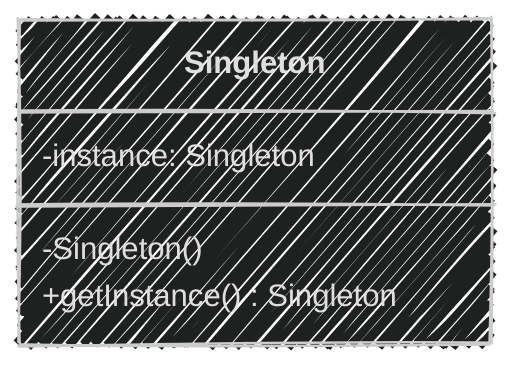
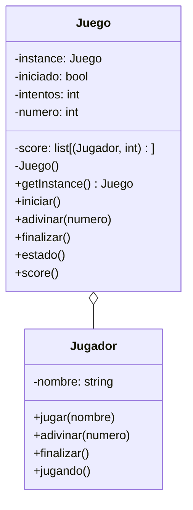
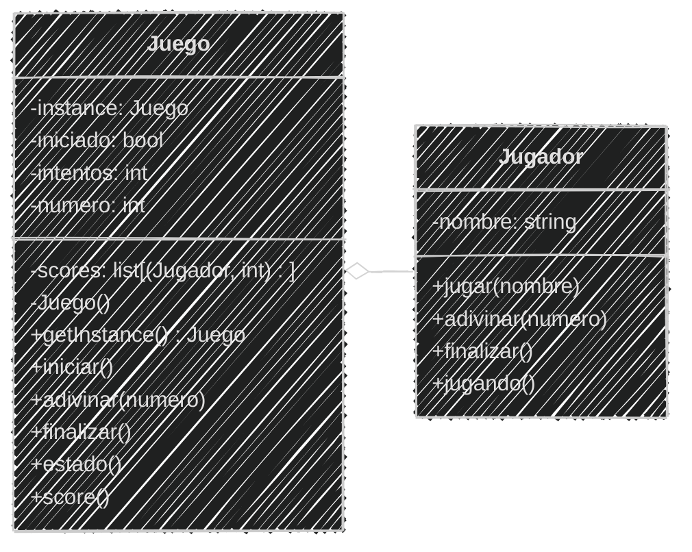
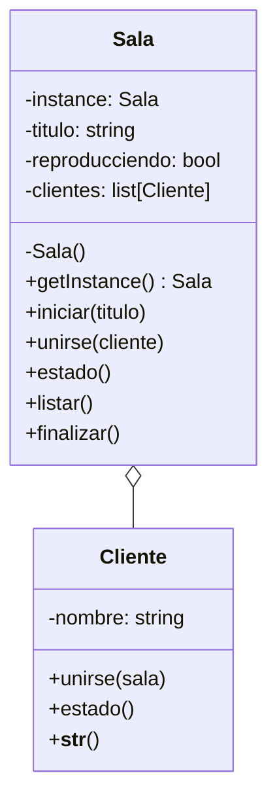
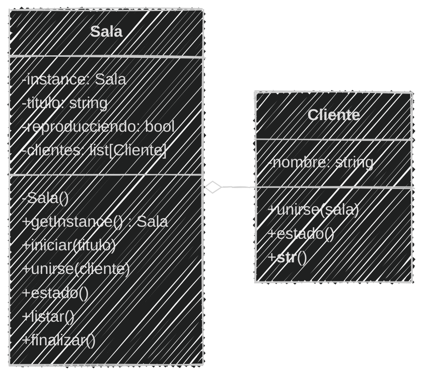

<!-- .slide: data-background-image="../../content/psg-bg-dark.png" data-background-size="100%"-->
 <!-- .element  hidden="true" -->

<br>
<br>
<br>

### Sesión  09
#### Patrones de Diseño
#### Singleton

---

### Antes de empezar

---

#### Proyecto en VSCode

Abre el proyecto en VSCode

```bash
code psg-oop-2025
```

Crea una carpeta con el nombre `sesion09`

```bash
mkdir sesion09
cd sesion09
```

- Los archivos de esta sesión deben estar dentro de esta carpeta

- Al finalizar la sesión, sube los cambios al repositorio en un commit

---

#### ¿Qué es un patrón de diseño?

Un patron de diseño es una **idea o solución** típica para resolver un problema
que se repite **una y otra vez**

---

Imagina que armas sillas de madera, cada vez que armas una silla usas un 
manual con **pasos claros** que indican como armarla

El manual no es la silla
pero es una **forma probada** para armar **bien una silla**

### 📐📏🔨 → 🪑 🪑 🪑

> Los patrones de diseño son como esos manuales, pero para construir programas

---

❌ *No* es un fragmento de código, *no* es una librería, *no* es un framework que 
puedes pegar y usar.

✅ **Es** un concepto, **es** una solución probada a un problema común en el desarrollo

---

#### ¿Por qué usar patrones de diseño?

- **Reutilización**: No tienes que reinventar la rueda cada vez que enfrentas un problema
- **Mantenibilidad**: El código es más fácil de entender y mantener

---

- **Colaboración**: Facilita la comunicación entre desarrolladores, ya que todos conocen los patrones comunes
- **Escalabilidad**: Permite que el código crezca de manera ordenada y estructurada

---

Los patrones varían en complejidad y propósito y pueden ser clasificados en tres categorías principales:

- **Creacionales**: Se centran en la *creación* de objetos y clases
- **Estructurales**: Se centran en la *composición* de clases y objetos
- **De Comportamiento**: Se centran en la *interacción y responsabilidad* entre objetos

---

Nos enfocaremos en los **patrones creacionales**

que son los que nos ayudan a crear objetos de manera eficiente y flexible

---

#### Patrones Creacionales

Son aquellos que se encargan de la **creación** de objetos

Ofrecen enfoques estructurados y reutilizables para crear **instancias** de clases

los más comunes son:

- **Singleton**
- **Factory**

---

#### Singleton

Llamado 

**"patrón de diseño de instancia única"**

Garantiza que una clase tenga una **ÚNICA** instancia y proporciona un punto de acceso global a ella

Define una clase que solo puede ser 

**instanciada una vez**

---

Significa que no importa cuántas veces intentes **crear una instancia** de esa clase

**siempre obtendrás la misma instancia**

y

*no se crearán nuevas instancias*

---

#### ¿Por qué usar Singleton?

- **Control de acceso**: Permite controlar el acceso a recursos compartidos
- **Consistencia**: Asegura que todos los componentes del sistema utilicen la misma instancia
- **Eficiencia**: Evita la creación innecesaria de múltiples instancias

---

#### Casos de Uso

*Aplicaciones web y escritorio*

- **Conexión a bases de datos:** Evita múltiples conexiones a la misma base de datos
- **Configuración global:** Mantiene una configuración única para toda la aplicación
- **Acceso a recursos compartidos:** Controla el acceso a recursos como archivos, impresoras, etc.

---

*Juegos*

- **Gestor de recursos:** Carga y gestiona recursos como imágenes, sonidos, etc.
- **Control de escena:** Control del cambio de escenas o niveles en el juego
- **Control de puntaje:** Lleva el puntaje del jugador de manera centralizada

---

*Seguridad*

- **Gestión de claves:** Mantiene una única instancia de administración de claves de seguridad
- **Autenticación:** Controla el acceso a recursos sensibles
- **Registro de actividad:** Registro único de eventos y actividades realizadas

---

#### Ventajas del Singleton

- **Simplicidad**: Fácil de implementar y entender
- **Control**: Permite un control centralizado sobre la instancia
- **Eficiencia**: Reduce el uso de memoria al evitar múltiples instancias

---
#### Desventajas del Singleton

- **Dificultad en pruebas**: Al ser única y global no puede remplazarse fácilmente por una versión de prueba
- **Alto acoplamiento**: Crea una dependencia fuerte entre las clases y la instancia única
- **Persistencia**: Puede guardar estados no deseados si no se maneja correctamente

---

#### Diagrama de Clases


<!--.element class="center-mermaid"-->

- `instance`: es un atributo de clase que guarda la instancia única
- `Singleton()`: es el constructor privado que evita la creación de instancias externas
- `getInstance()`: es un método estático que devuelve la instancia única de la clase

---

#### Estructura del Singleton en Python

```python [1|2|3|4|5|6]
class Singleton:
    __instance = None
    def __new__(cls):
        if cls.__instance is None:
            cls.__instance = super().__new__(cls)
        return cls.__instance
```

```markdown
- `Singleton`: la clase que implementa el patrón
- `__instance`: atributo de clase que guarda la instancia única
- `__new__`: es un método especial que se llama al 
            crear una nueva instancia de la clase
- `if cls.__instance is None`: verifica si la instancia ya existe
                            si no existe, crea una nueva instancia
- `super().__new__(cls)`: llama al constructor de la 
                        clase base para crear una nueva instancia
- `return cls.__instance`: devuelve la instancia única de la clase
```

---

#### Ejemplo 01

Crear los archivos `adivina.md` y `adivina.py` en la carpeta `sesion09`


```text
El juego "Adivina el número" permite a un jugador adivinar
un número secreto entre 1 y 100. El juego sólo permite un 
número a la vez y da pistas si el número es mayor o menor
que el número secreto.
Cada vez que un jugador adivina se guarda el jugador,
el número de intentos que le tomó adivinar y se muestra el score
El juego termina cuando el jugador escribe "salir"
Cada jugador posee un nombre
```

---

Análisis

```markdown
Requisitos:
- El juego debe seleccionar un número secreto 
  al azar entre 1 y 100
- El jugador debe adivinar el número secreto
- El juego debe informar si el número es mayor o
  menor que el número secreto
- El juego registra un Score con el jugador y el 
  número de intentos
- El juego termina cuando el jugador escribe "salir"

Objetos:
- Juego: Representa el juego en sí
- Jugador: Representa al jugador que adivina el número

Características:
- Juego: numero, score
- Jugador: nombre

Acciones:
- Juego: iniciar, adivinar, score
- Juego: estado, finalizar
- Jugador: jugar, adivinar
- Jugador: finalizar, jugando
```

---

Diagrama de clases en Mermaid

```` [3-9|10-24]

````

---

Diagrama de clases en Mermaid


<!--.element class="center-mermaid"-->

---

#### Implementación del Juego

Primero tenemos el juego, sera un Singleton, 
ya que solo debe haber **una instancia del juego** en curso

```python
class Juego:
    __instancia = None

    def __new__(cls):
        if cls.__instancia is None:
            cls.__instancia = super().__new__(cls)
        return cls.__instancia
```

---

El juego tiene un estado, si está iniciado o no, el numero de intentos y el score de los jugadores

Estos atributos deben ser accesibles desde cualquier parte del juego

```python [3-5]
class Juego:
    __instancia = None
    iniciado = False
    intentos = 0
    scores = []

    def __new__(cls):
        if cls.__instancia is None:
            cls.__instancia = super().__new__(cls)
        return cls.__instancia
```

---

Para iniciar el juego, se debe generar un número secreto al azar entre 1 y 100

**¿Cómo lo hacemos?**

Para esto usamos el módulo `random` de Python, que nos permite generar números aleatorios

**¿Como lo utilizamos?**

---

Para añadir un módulo a nuestro código, usamos la palabra clave `import`

Python ya tiene muchos módulos preinstalados, como `random`, que nos permite generar números aleatorios

Lo importamos al inicio del archivo

```python [1]
import random
...
class Juego:
```

---

El módulo `random` tiene muchas funciones, una de ellas es `randint`

El método `randint` genera un número entero aleatorio entre dos valores

```python
import random
print(random.randint(1, 100))  
```
```text
3
```

---
Ahora si podemos crear el método `iniciar` del juego

1. Si el juego ya está iniciado, no se puede reiniciar
2. Generamos un número secreto al azar
3. Los intentos se reinician e inicia el juego

```python [3-10]
class Juego:
    ...
    def iniciar(self):
        if self.iniciado:
            print("💢 El juego ya está en curso.")
            return
        print("💬 Adivina el número entre 1 y 100.")
        self.numero = random.randint(1, 100)
        self.intentos = 0
        self.iniciado = True
```

---

Después de iniciar el juego, necesitamos métodos para verificar el `estado` y `finalizar` el juego

El juego puede mostrar su estado, si está iniciado o no
El juego puede finalizarse, para poder reiniciarse

```python [3-7]
class Juego:
    ...
    def finalizar(self):
        print("❗ Juego finalizado.")
        self.iniciado = False
    def estado(self):
        return self.iniciado
```

---

El juego debe poder verificar si el número a `adivinar` es correcto y guardar el score
dar pistas si no es correcto usando mayor o menor

**Siempre** que el juego esté iniciado

```python [3-17]
class Juego:
    ...
    def adivinar(self, numero, jugador):
        if not self.iniciado:
            print("💢 El juego no ha iniciado.")
            return False
        self.intentos += 1
        if numero < self.numero:
            print("💡 El número es mayor.")
        elif numero > self.numero:
            print("💡 El número es menor.")
        else:
            print("🎉Adivinaste el número 🎉")
            self.scores.append((jugador, self.intentos))
            self.finalizar()
            return True
        return False
```

---

Por último, el juego debe poder mostrar el score de los jugadores

```python [3-11]
class Juego:
    ...
    def score(self):
        print("🏁 Score")
        for jugador, intentos in self.scores:
            print(f"{jugador}: {intentos} intentos")
```

---

La lógica del juego está completa, el juego tiene sus **reglas y se puede jugar**

Ahora necesitamos un jugador que pueda **interactuar** con el juego

---

#### Implementación del Jugador

El jugador tiene un nombre y una forma amigable de mostrarse

```python
class Jugador:
    def __init__(self, nombre):
        self.nombre = nombre
    def __str__(self):
        return f"🕹️ {self.nombre}"
```

---

El juego por si solo *no hace nada*, el jugador es quien **interactúa** con el juego

Y el patron Singleton **permite** que el jugador pueda acceder al juego

---

El jugador puede iniciar el juego, adivinar un número, finalizar el juego y verificar si está jugando

Sin ser parte del juego, ya que el jugador *no* es parte del juego, solo **interactúa** con él

```python [3-16]
class Jugador:
    ...
    def jugar(self):
        Juego().iniciar()
    
    def adivinar(self, numero):
        return Juego().adivinar(numero, self)
    
    def finalizar(self):
        Juego().finalizar()

    def jugando(self):
        return Juego().estado()
```

---
#### Interacción del Jugador

Luego de definir al Juego y al Jugador, podemos crear el ciclo de interacción

Donde las personas pueden jugar de forma continua

A travez de un bucle `while` infinito, que se detiene cuando el jugador escribe "salir"

```python [5-8]
class Juego:
    ...
class Jugador:
    ...
while True:
    nombre = input("💬 Tu nombre (o 'salir' para terminar): ")
    if nombre.lower() == "salir":
        break
```

---
Después de obtener el nombre del jugador, creamos al jugador y empezamos el juego

```python [7-8]
class Juego:
    ...
class Jugador:
    ...
while True:
    ...
    jugador = Jugador(nombre)
    jugador.jugar()
```

---

Para **iniciar el juego**, entra en otro bucle `while` que permite 
al jugador adivinar números hasta que el juego finalice o el jugador escriba "salir"

Es importante validar la entrada del jugador, para evitar errores

```python [3-12]
while True:
    ...
    while jugador.jugando():
        numero = input("💬 Adivina el número o 'salir': ")
        if numero.lower() == "salir":
            jugador.finalizar()
        else:
            try:
                jugador.adivinar(int(numero))
            except ValueError:
                print("💢 Ingresa un número válido")
```

---

Finalmente, mostramos el `score` de los jugadores y agradecemos al jugador por jugar

cuando finaliza el juego o el jugador escribe "salir"

```python [3-4]
while True:
    ...
    Juego().score()
print("👋 Gracias por jugar. ¡Hasta luego!")
```

---

#### Código Completo

```python
import random
class Juego:
    __instancia = None
    iniciado = False
    intentos = 0
    scores = []

    def __new__(cls):
        if cls.__instancia is None:
            cls.__instancia = super().__new__(cls)
        return cls.__instancia

    def iniciar(self):
        if self.iniciado:
            print("💢 El juego ya está en curso.")
            return
        print("💬 Adivina el número entre 1 y 100.")
        self.numero = random.randint(1, 100)
        self.intentos = 0
        self.iniciado = True
    
    def finalizar(self):
        print("❗ Juego finalizado.")
        self.iniciado = False

    def estado(self):
        return self.iniciado

    def adivinar(self, numero, jugador):
        if not self.iniciado:
            print("💢 El juego no ha iniciado.")
            return False
        self.intentos += 1
        if numero < self.numero:
            print("💡 El número es mayor.")
        elif numero > self.numero:
            print("💡 El número es menor.")
        else:
            print("🎉Adivinaste el número 🎉")
            self.scores.append((jugador, self.intentos))
            self.finalizar()
            return True
        return False

    def score(self):
        print("🏁 Score")
        for jugador, intentos in self.scores:
            print(f"{jugador}: {intentos} intentos")

class Jugador:
    def __init__(self, nombre):
        self.nombre = nombre

    def __str__(self):
        return f"🕹️ {self.nombre}"

    def jugar(self):
        Juego().iniciar()

    def adivinar(self, numero):
        return Juego().adivinar(numero, self)    
    
    def finalizar(self):
        Juego().finalizar()

    def jugando(self):
        return Juego().estado()

while True:
    nombre = input("💬 Tu nombre (o 'salir' para terminar): ")
    if nombre.lower() == "salir":
        break
    jugador = Jugador(nombre)
    jugador.jugar()
    while jugador.jugando():
        numero = input("💬 Adivina el número o 'salir': ")
        if numero.lower() == "salir":
            jugador.finalizar()
        else:
            try:
                jugador.adivinar(int(numero))
            except ValueError:
                print("💢 Ingresa un número válido")
    Juego().score()
print("👋 Gracias por jugar. ¡Hasta luego!")
```

---

#### Ejecución

```bash
python adivina.py
```
```text
💬 Tu nombre (o 'salir' para terminar): jhon
💬 Adivina el número entre 1 y 100.
💬 Adivina el número o 'salir': 56
🎉Adivinaste el número 🎉
❗ Juego finalizado.
🏁 Score
🕹️ jhon: 1 intentos
💬 Tu nombre (o 'salir' para terminar): jane
💬 Adivina el número entre 1 y 100.
💬 Adivina el número o 'salir': 80
💡 El número es mayor.
💬 Adivina el número o 'salir': 86
🎉Adivinaste el número 🎉
❗ Juego finalizado.
🏁 Score
🕹️ jhon: 1 intentos
🕹️ jane: 2 intentos
💬 Tu nombre (o 'salir' para terminar): salir
👋 Gracias por jugar. ¡Hasta luego!
```

---

En el ejemplo anterior los Singletons son útiles para mantener un **único**
estado del juego y acceder a él desde **cualquier parte** del código

---

En juegos multijugador, el patrón Singleton puede ser útil para gestionar
el estado del juego y asegurar que todos los jugadores interactúan con la misma
partida

---
#### Ejercicio para ti (02)

Crea los archivos `cine.md` y `cine.py` en la carpeta `sesion09`

Obtener el *Análisis*

---

```markdown
Una empresa de cine desea llevar el cine a casa de sus clientes,
para ello creó un sistema donde los clientes pueden unirse 
a una sala de cine virtual y ver películas juntos.
Todos los clientes ven la misma película
Si un cliente se une, se adiciona a la misma sala de
cine virtual y continua viendo la película desde donde está
Los clientes tienen un nombre y la película tiene un título
y un estado de reproducción (en reproducción o detenida)
Puedes ver cuantas personas hay en la sala y el título
Al iniciar se debe ingresar el título de la película e iniciará
reproducción, después irán ingresando clientes dando su nombre
Cada cliente puede saber el estado y título de la película
Tiene que tener un menú donde: 

1. Iniciar película
2. Unirse a sala
3. Ver estado
4. Ver clientes
5. Finalizar película
6. Salir
```

4 minutos

<iframe src="https://time-stuff.com/embed.html" frameborder="0" scrolling="no" width="391" height="140"></iframe>

---

Análisis

```markdown
# Análisis
Requisitos
- Los clientes pueden unirse a una sala de cine virtual
- Los clientes pueden ver una película juntos
- Los clientes pueden ver el estado de la película
- Los clientes pueden ver cuantas personas hay en la sala
- Los clientes pueden ver el título de la película
- La película puede ser iniciada y finalizada
- El sistema debe tener un menú para interactuar
- La película tiene un título y un estado de reproducción
- Los clientes tienen un nombre
- La sala de cine es única
- La sala tiene una lista de clientes
Objetos
- Sala: Representa la sala de cine virtual
- Cliente: Representa al cliente que se une a la sala
Características
- Sala: titulo, reproducciendo, clientes
- Cliente: nombre
Acciones
- Sala: iniciar, unirse, estado, listar
- Cliente: unirse, estado
```

---

#### Ejercicio para ti (02)

Ahora obtenemos el diseño del *diagrama de clase*

2 minutos

<iframe src="https://time-stuff.com/embed.html" frameborder="0" scrolling="no" width="391" height="140"></iframe>

Modifica el archivo `cine.md`

---

Modificando el diseño de diagrama de clases

````

````

---


<!--.element class="center-mermaid"-->

---

#### Ejercicio para ti (02)

Ya tenemos el *análisis y diseño* de la clase

Ahora podemos **programar**

Modifica el archivo `cine.py`

2 minutos

<iframe src="https://time-stuff.com/embed.html" frameborder="0" scrolling="no" width="391" height="140"></iframe>


Primero el Singleton y sus atributos ya que solo debe haber una sala de cine virtual

---

Singleton de la Sala de Cine

```python
class Sala:
    __instancia = None
    titulo = ""
    reproducciendo = False
    clientes = []

    def __new__(cls):
        if cls.__instancia is None:
            cls.__instancia = super().__new__(cls)
        return cls.__instancia
```

---
Adicionar los **métodos** para iniciar la película, unirse a la sala, ver el estado, listar clientes y finalizar la película

Modificar el archivo `cine.py`

4 minutos

<iframe src="https://time-stuff.com/embed.html" frameborder="0" scrolling="no" width="391" height="140"></iframe>


---

Adicionar los métodos a la clase `Sala`

```python
class Sala:
    ...
    def iniciar(self, titulo):
        if self.reproducciendo:
            print("💢 La película ya está en reproducción.")
            return
        self.titulo = titulo
        self.reproducciendo = True
        print(f"🎬 Iniciando la película: {self.titulo}")

    def unirse(self, cliente):
        self.clientes.append(cliente)
        print(f"{cliente} se ha unido a la sala.")

    def estado(self):
        estado = "En reproducción" if self.reproducciendo else "Detenida"
        print(f"🎥 Película: {self.titulo} | Estado: {estado}")

    def listar(self):
        print(f"👥 Clientes en la sala: {len(self.clientes)}")
        for cliente in self.clientes:
            print(f"- {cliente}")
    
    def finalizar(self):
        print("❗ Película finalizada.")
        self.reproducciendo = False
```

---

#### Implementación del Cliente


Luego de implementar la sala, podemos implementar el cliente
ya que el cliente **interactuará** con la sala

El cliente tiene un nombre y una forma amigable de mostrarse

Modificar el archivo `cine.py`

3 minutos

<iframe src="https://time-stuff.com/embed.html" frameborder="0" scrolling="no" width="391" height="140"></iframe>


---

Adicionar la clase `Cliente`

```python
class Cliente:
    def __init__(self, nombre):
        self.nombre = nombre
    def __str__(self):
        return f"👤 {self.nombre}"
```

---

El cliente puede **unirse** a la sala y ver el estado de la película

Implementar el método en la clase `Cliente`, uniéndose a la sala

Modificar el archivo `cine.py`

2 minutos

<iframe src="https://time-stuff.com/embed.html" frameborder="0" scrolling="no" width="391" height="140"></iframe>


---
```python
class Cliente:
    ...
    def unirse(self):
        Sala().unirse(self)
```

---

#### Interacción del Cliente

Luego de definir la sala y el cliente, podemos crear el ciclo de **interacción**

Donde los clientes pueden unirse a la sala, iniciar la película y ver el estado

Modificar el archivo `cine.py`

3 minutos

<iframe src="https://time-stuff.com/embed.html" frameborder="0" scrolling="no" width="391" height="140"></iframe>

---

Ciclo de interacción del cliente

```python
while True:
    print("="*30)
    print("🎬 Menú de Cine Virtual")
    print("1. Iniciar película")
    print("2. Unirse a sala")
    print("3. Ver estado")
    print("4. Ver clientes")
    print("5. Finalizar película")
    print("6. Salir")
    print("="*30)

    opcion = input("Selecciona una opción: ")

    if opcion == "1":
        titulo = input("💬 Título de la película: ")
        Sala().iniciar(titulo)
    elif opcion == "2":
        nombre = input("💬 Tu nombre: ")
        cliente = Cliente(nombre)
        cliente.unirse()
    elif opcion == "3":
        Sala().estado()
    elif opcion == "4":
        Sala().listar()
    elif opcion == "5":
        Sala().finalizar()
    elif opcion == "6":
        break
    else:
        print("💢 Opción no válida.")
```

---

#### Código Completo

```python
class Sala:
    __instancia = None
    titulo = ""
    reproducciendo = False
    clientes = []

    def __new__(cls):
        if cls.__instancia is None:
            cls.__instancia = super().__new__(cls)
        return cls.__instancia

    def iniciar(self, titulo):
        if self.reproducciendo:
            print("💢 La película ya está en reproducción.")
            return
        self.titulo = titulo
        self.reproducciendo = True
        print(f"🎬 Iniciando la película: {self.titulo}")

    def unirse(self, cliente):
        self.clientes.append(cliente)
        print(f"{cliente} se ha unido a la sala.")

    def estado(self):
        estado = "En reproducción" if self.reproducciendo else "Detenida"
        print(f"🎥 Película: {self.titulo} | Estado: {estado}")

    def listar(self):
        print(f"👥 Clientes en la sala: {len(self.clientes)}")
        for cliente in self.clientes:
            print(f"- {cliente}")

    def finalizar(self):
        print("❗ Película finalizada.")
        self.reproducciendo = False

class Cliente:
    def __init__(self, nombre):
        self.nombre = nombre
    def __str__(self):
        return f"👤 {self.nombre}"
    def unirse(self):
        Sala().unirse(self)


while True:
    print("="*30)
    print("🎬 Menú de Cine Virtual")
    print("1. Iniciar película")
    print("2. Unirse a sala")
    print("3. Ver estado")
    print("4. Ver clientes")
    print("5. Finalizar película")
    print("6. Salir")
    print("="*30)

    opcion = input("Selecciona una opción: ")

    if opcion == "1":
        titulo = input("💬 Título de la película: ")
        Sala().iniciar(titulo)
    elif opcion == "2":
        nombre = input("💬 Tu nombre: ")
        cliente = Cliente(nombre)
        cliente.unirse()
    elif opcion == "3":
        Sala().estado()
    elif opcion == "4":
        Sala().listar()
    elif opcion == "5":
        Sala().finalizar()
    elif opcion == "6":
        break
    else:
        print("💢 Opción no válida.")
```

---
#### Ejecución

```bash
python cine.py
```
```text
==============================
🎬 Menú de Cine Virtual
1. Iniciar película
2. Unirse a sala
3. Ver estado
4. Ver clientes
5. Finalizar película
6. Salir
==============================
Selecciona una opción: 1
💬 Título de la película: Juanito y los clonosaurios
🎬 Iniciando la película: Juanito y los clonosaurios
==============================
🎬 Menú de Cine Virtual
1. Iniciar película
2. Unirse a sala
3. Ver estado
4. Ver clientes
5. Finalizar película
6. Salir
==============================
Selecciona una opción: 2
💬 Tu nombre: Jhon
👤 Jhon se ha unido a la sala.
==============================
🎬 Menú de Cine Virtual
1. Iniciar película
2. Unirse a sala
3. Ver estado
4. Ver clientes
5. Finalizar película
6. Salir
==============================
Selecciona una opción: 3
🎥 Película: Juanito y los clonosaurios | Estado: En reproducción
==============================
🎬 Menú de Cine Virtual
1. Iniciar película
2. Unirse a sala
3. Ver estado
4. Ver clientes
5. Finalizar película
6. Salir
==============================
Selecciona una opción: 4
👥 Clientes en la sala: 1
- 👤 Jhon
==============================
🎬 Menú de Cine Virtual
1. Iniciar película
2. Unirse a sala
3. Ver estado
4. Ver clientes
5. Finalizar película
6. Salir
==============================
Selecciona una opción: 5
❗ Película finalizada.
```

---

Subimos los avances de la sesión al repositorio en **GitHub**

```bash
git add .
git commit -m "Sesión 09"
git push origin main
```

---    

#### Resumen

- Un patrón de diseño es una solución típica y probada para resolver problemas recurrentes en el desarrollo de software.
- Los patrones de diseño no son fragmentos de código, librerías ni frameworks, sino conceptos reutilizables para estructurar soluciones.
- El uso de patrones de diseño facilita la reutilización, mantenibilidad, colaboración y escalabilidad del código.

---

- Los patrones de diseño se clasifican en creacionales, estructurales y de comportamiento, según su propósito.
- Los patrones creacionales se enfocan en la creación eficiente y flexible de objetos y clases.
- El patrón Singleton es un patrón creacional que garantiza que una clase tenga una única instancia y proporciona un punto de acceso global a ella.

---

- El Singleton es útil para controlar el acceso a recursos compartidos, asegurar la consistencia y evitar la creación innecesaria de instancias.
- El Singleton se utiliza en casos como conexiones a bases de datos, configuración global, acceso a recursos compartidos, gestión de claves y autenticación.
- Las ventajas del Singleton incluyen simplicidad, control centralizado y eficiencia en el uso de memoria.

---

- Las desventajas del Singleton incluyen dificultad en pruebas, alto acoplamiento y posibles problemas de persistencia de estado.
- El Singleton en Python se implementa usando un atributo de clase para almacenar la instancia única y el método especial `__new__` para controlar su creación.

---

- El análisis de requisitos, características y acciones es fundamental para diseñar correctamente las clases y sus relaciones en la aplicación de patrones de diseño.
- Los diagramas de clases ayudan a visualizar la estructura y relaciones entre las clases al aplicar patrones de diseño como Singleton.


---

#### Retos

Crear una carpeta con el nombre "retos_sesion_09" dentro del proyecto en la raíz, en la cual por cada ejercicio debes crear los siguientes archivos:

```bash
# Estructura de carpetas
psg-oop-2025/
    sesion09/
    retos_sesion_09/
        ejercicio_01.md
        ejercicio_01.py
        ejercicio_02.md
        ejercicio_02.py
```

---

1. Crea el juego **"Piedra, Papel o Tijera"** utilizando el patrón **Singleton**
para asegurar que solo exista **una única instancia del juego** en ejecución

El juego permite que un jugador compita contra la computadora, la cual elige aleatoriamente entre las tres opciones:

`Piedra` , `Papel` , `Tijera`

El objetivo es registrar las partidas ganadas por el jugador y por la computadora, manteniendo el control del puntaje dentro de la **única instancia** del juego

*(1/3)*

---

Crea la clase `PiedraPapelTijera` implementando el patrón **Singleton**
Debe incluir:

- Un método para **iniciar una partida**
- Un método para **mostrar el puntaje actual**
- Un método para **reiniciar el juego** (puntajes en cero)
- Un **menú interactivo en consola** que permita:
```markdown
1. Iniciar una nueva partida
2. Mostrar puntajes
3. Reiniciar el juego
4. Salir
```

*(2/3)*
 
---

Realiza el **análisis** y el **diagrama de clases** para la clase `PiedraPapelTijera` en el archivo `ejercicio_04.md`

Escribe el código Python en el archivo `ejercicio_04.py`

- Asegúrate de que las clases incluyan *atributos* y *métodos* coherentes con su propósito
 
- Utiliza buenas prácticas de *nomenclatura*, *encapsulamiento* y *legibilidad*

- Prueba el juego en la consola para verificar su correcto funcionamiento

*(3/3)*

---

2. Un DJ necesita una nueva consola de mezcla `BeatBox` que permita mezclar pistas de audio en tiempo real
Utiliza el patrón **Singleton** para asegurar que solo exista una única instancia de la consola de mezcla en ejecución
La consola debe permitir:
- Seleccionar pista de audio
- Subir y bajar volumen
- Mostrar el estado actual de la consola (pista seleccionada y volumen)
- Puede aplicar un efecto de sonido a la vez (eco, reverb, distorsión)

*(1/3)*

---

Crea la clase `BeatBox` implementando el patrón **Singleton**
Debe incluir:
- Un método para **seleccionar pista de audio**
- Un método para **ajustar el volumen**
- Un método para **aplicar un efecto de sonido**
- Un método para **mostrar el estado actual** de la consola
- Un **menú interactivo en consola** que permita:
```markdown
1. Ingresar el nombre de la pista de audio
2. Ajustar volumen
3. Aplicar efecto de sonido
4. Mostrar estado actual
5. Salir
```

*(2/3)*

---

Realiza el **análisis** y el **diagrama de clases** para la clase `BeatBox` en el archivo `ejercicio_05.md`
Escribe el código Python en el archivo `ejercicio_05.py`
- Asegúrate de que las clases incluyan *atributos* y *métodos* coherentes con su propósito
- Utiliza buenas prácticas de *nomenclatura*, *encapsulamiento* y *legibilidad*
- Prueba la consola de mezcla en la consola para verificar su correcto funcionamiento

*(3/3)*

---

<!-- .slide: data-background-image="../../content/psg-bg-dark.png" data-background-size="100%"-->

<br>
<br>
<br>
<br>
<br>

[ <!-- .element width="20%"-->](https://github.com/python-la-paz/python-study-group-oop/tree/main/content/sesion09)

Repositorio de la Sesión

---
<!--.slide: data-visibility="hidden"-->
## Bibliografía y Referencias

- [What is Pattern](https://refactoring.guru/es/design-patterns/what-is-pattern)
- [Patron creacional](https://academia-lab.com/enciclopedia/patron-creacional/)
- [Patrones de diseño creacionales](https://www.codigoycafe.net/patrones-de-diseno-de-software/patrones-de-diseno-creacionales-construyendo-objetos-de-manera-inteligente/560/)
- [Patrón de diseño Singleton](https://www.codigoycafe.net/programacion/cpp/patron-de-diseno-creacional-singleton/)
- [Python hash method](https://www.geeksforgeeks.org/python/python-hash-method/)
- [Object Oriented Analysis](https://www.gyata.ai/es/object-oriented-programming/object-oriented-analysis)
- [DDOO Unidad 1](https://dmd.unadmexico.mx/contenidos/DCEIT/BLOQUE1/DS/02/DDOO/U1/descargables/DDOO_Unidad_1.pdf)
- [Programación procedural VS orientada a objetos](https://programacionpro.com/programacion-procedural-vs-orientada-a-objetos-diferencias-y-similitudes/)
- [Python OOP](https://www.learnpython.org/en/Classes_and_Objects)
- [Atributos de clase](https://oregoom.com/python/atributos-clase/)
- [Diagrama de clases](https://diagramasuml.com/diagrama-de-clases/)
- [Guía PEP 8](https://peps.python.org/pep-0008/#class-names)
- [Mermaid Charts](https://www.mermaidchart.com/play)
- [Draw.io](https://app.diagrams.net/)
- [Python 3 Object-oriented Programming, Second Edition, Dusty PhillipsDusty Phillips](https://github.com/PacktPublishing/Python-3-Object-Oriented-Programming-Second-Edition)
- [Objetos en programación](https://ebac.mx/blog/objeto-en-programacion)
- [Enfoque orientado a objetos](https://1library.co/article/enfoque-orientado-a-objetos-base-te%C3%B3rica.qvld461y)
- [OOAD](https://www.tutorialspoint.com/object_oriented_analysis_design/ooad_object_oriented_analysis.htm)