<!-- .slide: data-background-image="../../content/psg-bg-dark.png" data-background-size="100%"-->
 <!-- .element  hidden="true" -->

<br>
<br>
<br>

### Sesión  10
#### Patrones de Diseño
#### Factory

---

#### VS Code

Abrimos el proyecto del Study Group

```bash
code psg-oop-2025
```

Creamos una carpeta llamada `sesion10` dentro del proyecto

```bash
mkdir sesion10
cd sesion10
```

Aquí guardaremos los ejemplos de la sesión

---

#### ¿Qué es un patrón de diseño?

Un patron de diseño es una idea o una solución típica para resolver un problema
que se repite una y otra vez.

---

Los patrones varían en complejidad y propósito y pueden ser clasificados en tres categorías principales:

- **Creacionales**: Se centran en la creación de objetos y clases
- **Estructurales**: Se centran en la composición de clases y objetos
- **De Comportamiento**: Se centran en la interacción y responsabilidad entre objetos

---
Nos enfocaremos en los patrones creacionales, que son los que nos ayudan a
crear objetos de manera eficiente y flexible.

---

#### Patrones Creacionales

Los patrones creacionales son aquellos que se encargan de la creación de objetos

Ofrecen enfoques estructurados y reutilizables para crear instancias de clases

los más comunes son:

- **Singleton**
- **Factory**

---

#### Factory

Pertenece al grupo de patrones creacionales

Es como tener una fábrica que crea objetos diferentes según las necesidades

---

> "El patrón Factory es como pedir en una cafetería: tú solo dices qué quieres, y alguien más se encarga de prepararlo por ti."


---

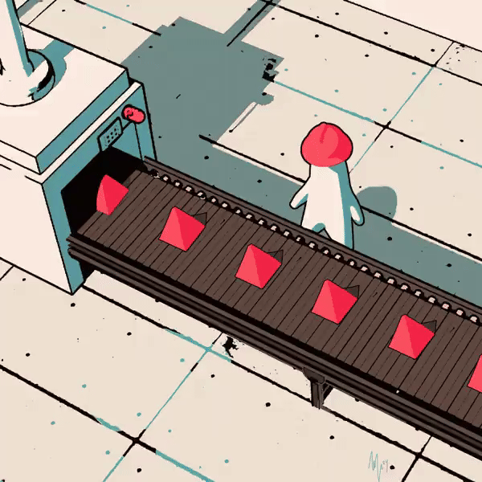

---

#### ¿Por qué usar Factory?

- **Flexibilidad**: Permite crear diferentes tipos de objetos sin necesidad de conocer la clase exacta que se va a instanciar.
- **Desacoplamiento**: Separa la lógica de creación de objetos de su uso
- **Mantenimiento**: Facilita la modificación y extensión del código sin afectar a las clases que lo utilizan

---


---
#### Ejemplos comunes

**Aplicaciones web y escritorio**

- Creación de diferentes tipos de usuarios (administrador, cliente, etc.)
- Generación de diferentes tipos de reportes (PDF, Excel, etc.)
- Creación de diferentes tipos de notificaciones (correo electrónico, SMS, etc.)

---
#### Ejemplos comunes

**Juegos y simulaciones**

- Creación de diferentes tipos de personajes (guerrero, mago, arquero, etc.)
- Generación de diferentes tipos de enemigos (zombies, dragones, robots, etc.)
- Creación de diferentes tipos de vehículos (coche, moto, avión, etc.)

---

#### Ejemplos comunes

**Seguridad y autenticación**

- Generación de diferentes tipos de autenticación (Google, Facebook, etc.)
- Generación de diferentes tipos de permisos (lectura, escritura, ejecución, etc.)
- Creación de diferentes tipos de autenticación biométrica (huella dactilar, reconocimiento facial, etc.)


---
#### Ejemplos comunes

**IoT y dispositivos inteligentes**

- Estados de diferentes tipos de sensores (temperatura, humedad, luz, etc.)
- Generación de diferentes tipos de dispositivos (termómetro, cámara, bombilla, etc.)
- Generación de diferentes tipos de protocolos de comunicación (MQTT, HTTP, etc.)

---

#### Ventajas de usar Factory

- **Reutilización de código**: Permite reutilizar el código de creación de objetos en diferentes partes.
- **Facilidad de mantenimiento**: Si se necesita cambiar la forma en que se crean los objetos, solo se modifica el Factory.
- **Escalabilidad**: Facilita la adición de nuevos tipos de objetos sin afectar al código existente.

---

#### Desventajas de usar Factory

- **Complejidad adicional**: Introduce una capa adicional de abstracción que puede hacer el código más complejo.
- **Sobrecarga de rendimiento**: En algunos casos, la creación de objetos a través de un Factory puede ser menos eficiente que la creación directa.
- **Granularidad**: Puede llevar a una sobreabundancia de clases y fábricas si no se gestiona adecuadamente.

---
#### Diagrama de clases

Lo primero es definir las clases que van a participar en el patrón Factory
los productos que van a ser creados en la fábrica

````
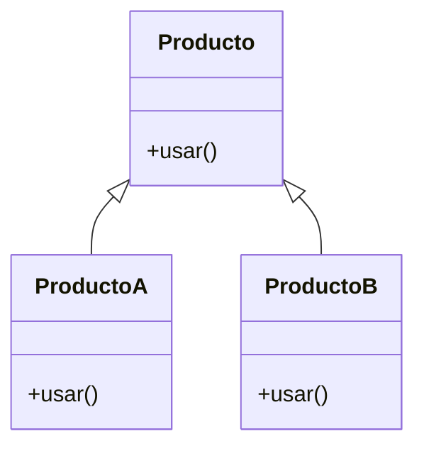
````

---
#### Diagrama de clases

Los productos A y B heredan de la clase Producto y serán creados por una fábrica

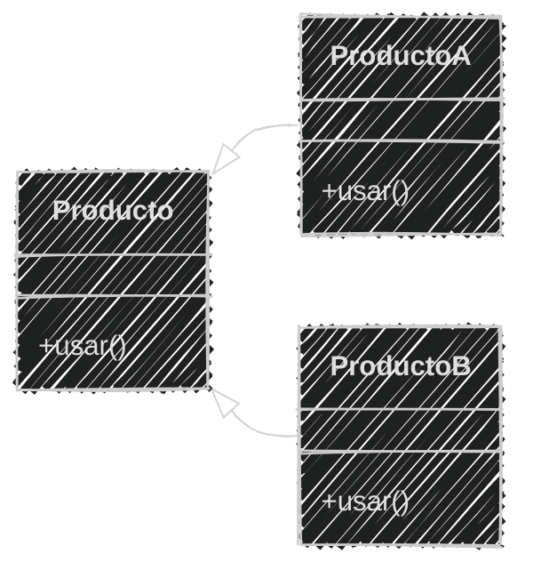
---

#### Diagrama de clases

Ahora definimos la clase Fábrica y las fábricas concretas que crearán los productos A y B

````
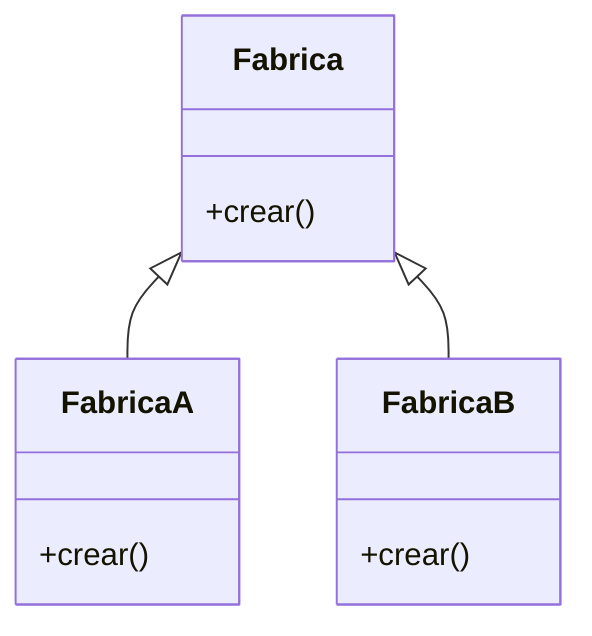
````

---
#### Diagrama de clases

La FabricaA y FabricaB heredan de la clase Fabrica ambos crearan productos de tipo Producto

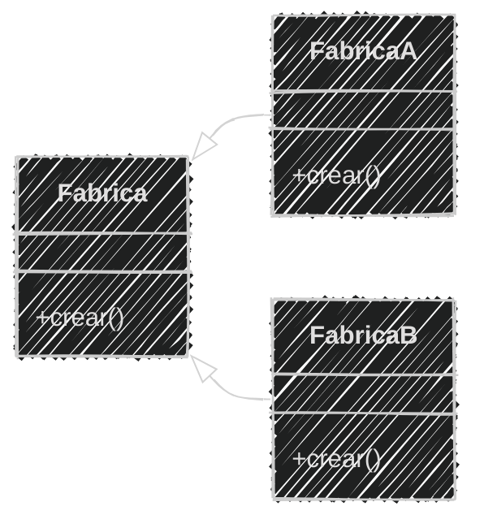
---
#### Diagrama de clases

Ahora unimos las fábricas con los productos que crean se realiza mediante
una relación de asociación, donde la fábrica crea productos de tipo Producto


````
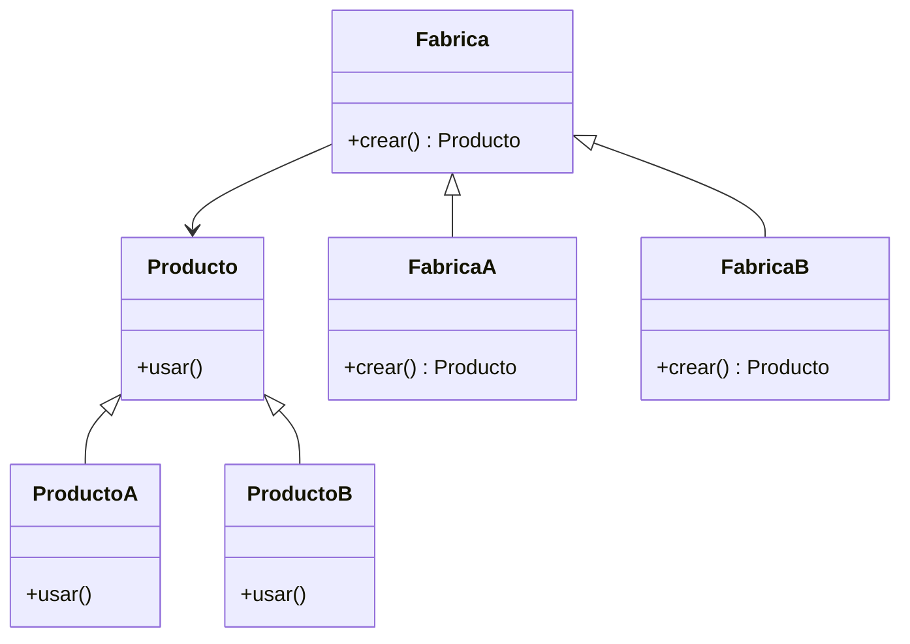
````
---
#### Diagrama de clases

El diagrama final muestra la relación entre las fábricas y los productos que se  va a crear


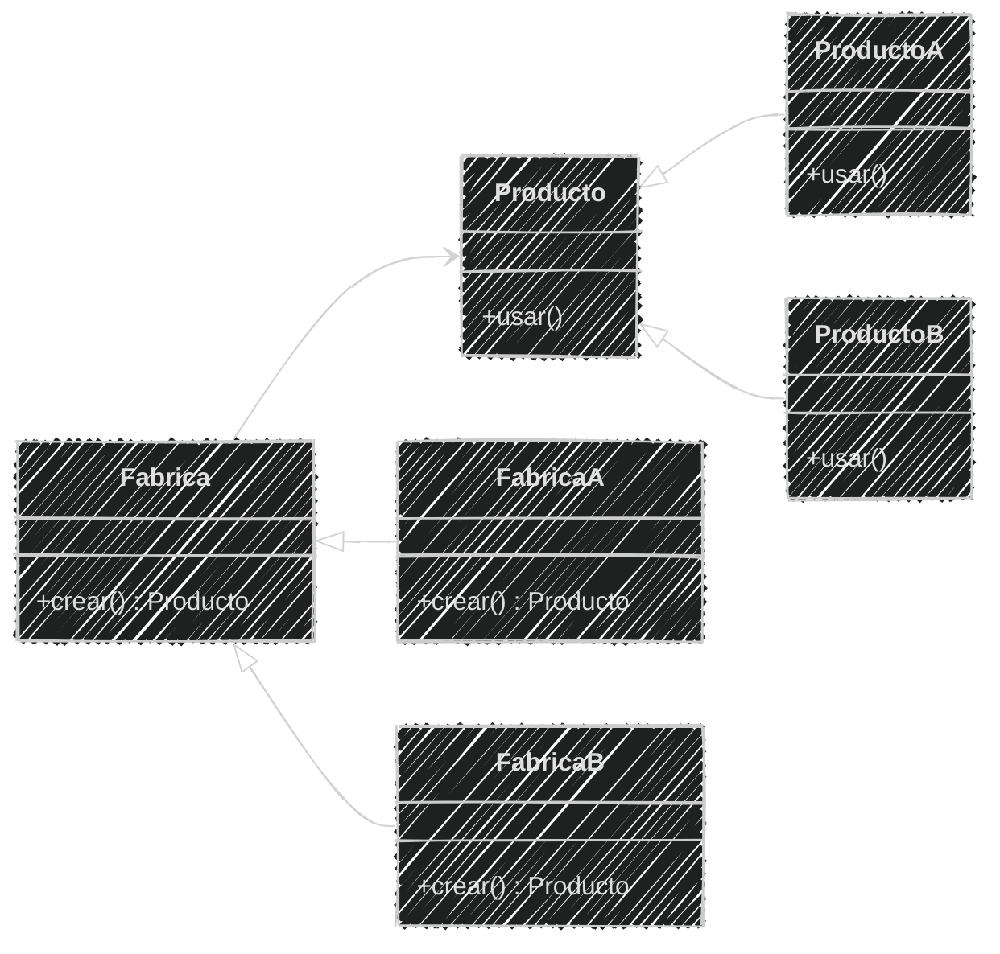
---

#### Estructura de Factory en Python

El patron Factory implementa Herencia y polimorfismo conceptos ya vistos en sesiones anteriores

Por lo que la estructura de un Factory se puede ver mejor en un ejemplo práctico

---

#### Ejemplo 01

```markdown
Una cafetería prepara Expresos y Cappuccinos,
el cliente (tú) solo debes pedir el tipo de café que desea
el barista utilizará las maquinas adecuadas para preparar el café
Todos los cafes tienen la misma cantidad y se pueden tomar
Las cafeteras preparan un tipo de café, después son consumidos
por el cliente
Al ingresar salir se termina la ejecución
```


En el archivo `cafeteria.md` se realizará el análisis y en el archivo `cafeteria.py` se implementará el patrón Factory

---
#### Análisis

```markdown
Requisitos:
- En la cafetería se preparan dos tipos de café: Expreso y Cappuccino
- El cliente solo debe pedir el tipo de café que desea
- Se utiliza la máquina adecuada para cada café
- Todos los cafés tienen la misma cantidad y se pueden tomar
- Las cafeteras preparan un tipo de café
- Si se ingresa "salir" se termina la ejecución


Objetos:
- Café (Expreso, Cappuccino)
- Cafetera
- Barista

Características:
- Café: cantidad
- Cafetera: tipo de café que prepara
- Barista: (sin características)

Acciones:
- Café: tomar()
- Cafetera: preparar()
- Barista: (sin acciones)
```

---
#### Diagrama de clases

````
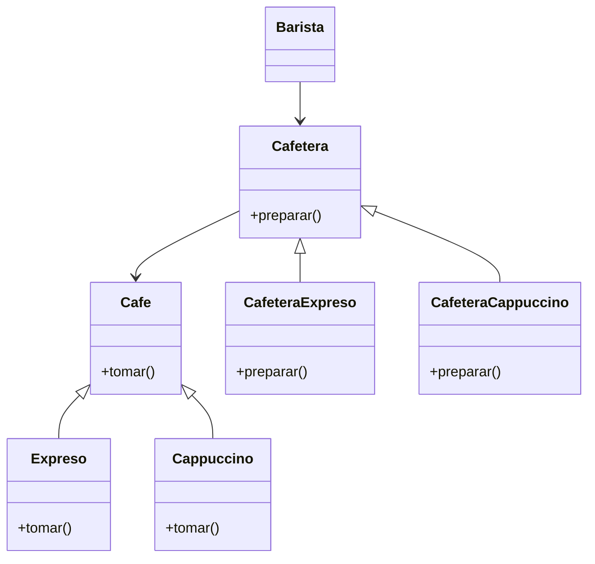
````

---
#### Diagrama de clases

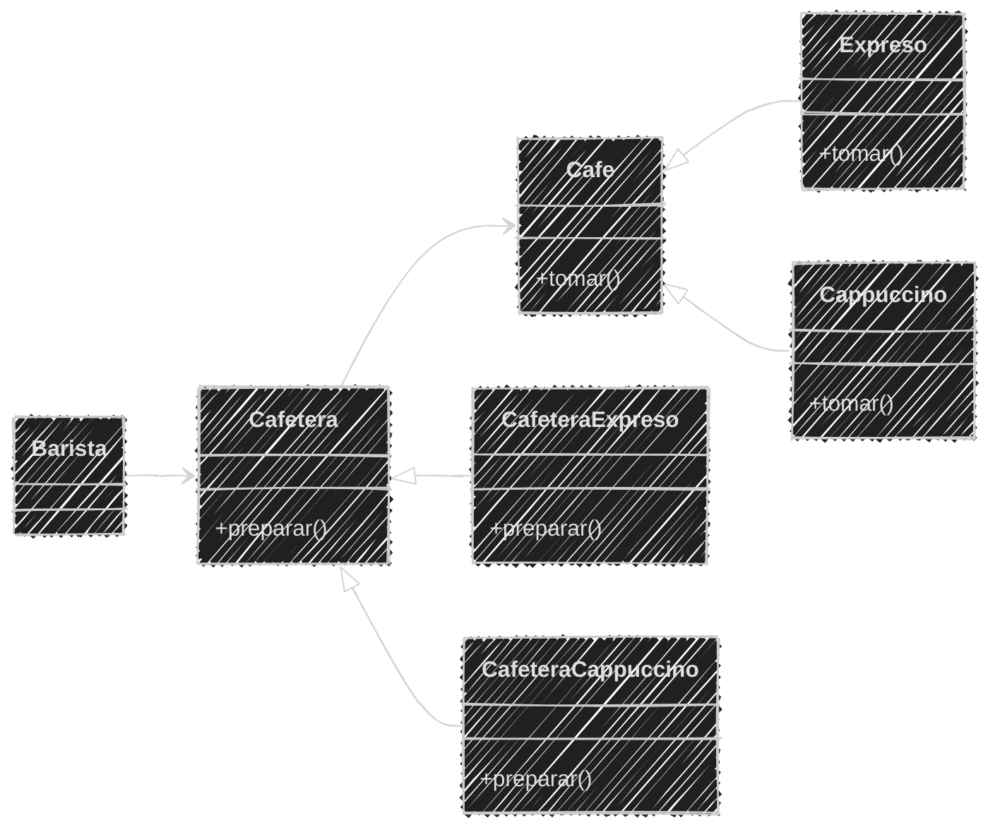

---
#### Implementación en Python

Primero definimos la clase base `Cafe` y las clases derivadas `Expreso` y `Cappuccino`

```python
class Cafe:
    def tomar(self):
        print("Tomando un café")

class Expreso(Cafe):
    def tomar(self):
        print("☕ Tomando un expreso")

class Cappuccino(Cafe):
    def tomar(self):
        print("🥛 Tomando un cappuccino")
```

---
Luego definimos la clase base `Cafetera` y las clases derivadas `CafeteraExpreso` y `CafeteraCappuccino`

```python
class Cafetera:
    def preparar(self):
        pass
class CafeteraExpreso(Cafetera):
    def preparar(self):
        return Expreso()
class CafeteraCappuccino(Cafetera):
    def preparar(self):
        return Cappuccino()
```

---
Definimos las clases `Barista` que interactúa con las cafeteras

```python
class Barista:
    def preparar_cafe(self, tipo):
        if tipo == "expreso":
            return CafeteraExpreso().preparar()
        elif tipo == "cappuccino":
            return CafeteraCappuccino().preparar()
        else:
            raise ValueError("❌ Café no disponible. Intente de nuevo")
```

---
Finalmente probamos el patrón Factory siendo nosotros el cliente que pide el café

```python
while True:
    tipo_cafe = input("💬 ¿Qué café desea? (expreso/cappuccino/salir): ")
    tipo_cafe = tipo_cafe.lower().strip()
    if tipo_cafe == "salir":
        print("🚶‍♂️ Saliendo de la cafetería.")
        break
    try:
        barista = Barista()
        cafe = barista.preparar_cafe(tipo_cafe)
        cafe.tomar()
    except ValueError as e:
        print(e)
```


---
#### Código completo

```python
# Productos
class Cafe:
    def tomar(self):
        print("Tomando un café")

class Expreso(Cafe):
    def tomar(self):
        print("☕ Tomando un expreso")

class Cappuccino(Cafe):
    def tomar(self):
        print("🥛 Tomando un cappuccino")

# Fabricas
class Cafetera:
    def preparar(self):
        pass
class CafeteraExpreso(Cafetera):
    def preparar(self):
        return Expreso()
class CafeteraCappuccino(Cafetera):
    def preparar(self):
        return Cappuccino()

# Factory Central (decide qué fábrica usar)
class Barista:
    def preparar_cafe(self, tipo):
        if tipo == "expreso":
            return CafeteraExpreso().preparar()
        elif tipo == "cappuccino":
            return CafeteraCappuccino().preparar()
        else:
            raise ValueError("❌ Café no disponible. Intente de nuevo")

# Cliente (No conoce las fábricas, solo pide el café)
while True:
    tipo_cafe = input("💬 ¿Qué café desea? (expreso/cappuccino/salir): ")
    tipo_cafe = tipo_cafe.lower().strip()
    if tipo_cafe == "salir":
        print("🚶‍♂️ Saliendo de la cafetería.")
        break
    try:
        barista = Barista()
        cafe = barista.preparar_cafe(tipo_cafe)
        cafe.tomar()
    except ValueError as e:
        print(e)
```

---

```bash
python cafeteria.py
```

```text
💬 ¿Qué café desea? (expreso/cappuccino/salir): expreso
☕ Tomando un expreso
💬 ¿Qué café desea? (expreso/cappuccino/salir): cappuccino
🥛 Tomando un cappuccino
💬 ¿Qué café desea? (expreso/cappuccino/salir): latte
❌ Café no disponible. Intente de nuevo
💬 ¿Qué café desea? (expreso/cappuccino/salir): salir
🚶‍♂️ Saliendo de la cafetería.
```

---

En el ejemplo anterior se muestra cómo el patrón Factory
permite crear diferentes tipos de café sin que el cliente 
conozca los detalles de la creación

---

El único que conoce los detalles de la creación es el Barista
que utiliza las fábricas adecuadas para preparar el café solicitado

---

#### Ejemplo 02

```markdown
En un juego de rol, los jugadores pueden elegir diferentes
tipos de armas.

Cuando un jugador solicita un arma, el armero utiliza
la herramienta adecuada para crearla.

Cada herramienta crea un solo tipo de arma:
- El martillo crea espadas.
- La Sierra crea arcos.

Todas las armas pueden usarse para atacar.

Si el jugador escribe "salir" en lugar de un tipo de arma,
el programa finaliza.
```

Realizar el análisis en `juego.md` en 3 minutos

<iframe src="https://time-stuff.com/embed.html" frameborder="0" scrolling="no" width="391" height="140"></iframe>

---

#### Análisis

```markdown
Requisitos:
- Hay dos tipos de armas: Espada y Arco.
- El jugador solo debe pedir el tipo de arma que desea.
- Se usa la herramienta adecuada para fabricar cada arma.
- Todas las armas pueden usarse para atacar.
- Cada herramienta fabrica un tipo de arma.
- Si se ingresa "salir" se termina la ejecución.

Objetos:
- Arma (Espada, Arco)
- Herramienta
- Armero

Características:
- Arma: (sin características extra)
- Herramienta: tipo de arma que fabrica
- Armero: (sin características)

Acciones:
- Arma: atacar()
- Herramienta: fabricar()
- Armero: (sin acciones)
```

---

#### Diagrama de clases


Ahora que tenemos los requisitos, características y acciones podemos definir el diseño

3 minutos

<iframe src="https://time-stuff.com/embed.html" frameborder="0" scrolling="no" width="391" height="140"></iframe>

Añadir al archivo `juego.md`

---

#### Diagrama de clases

````
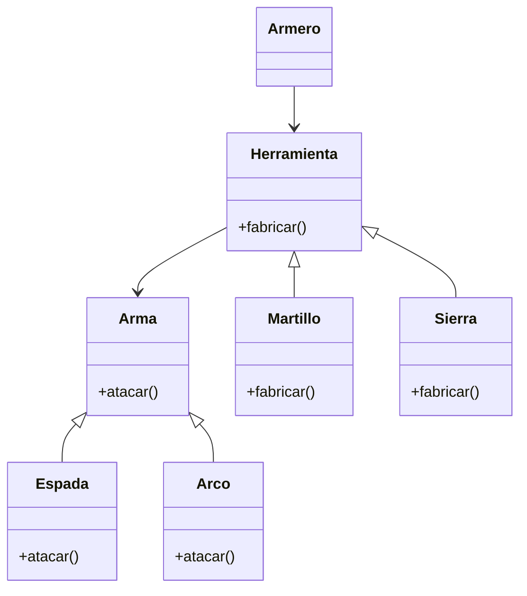
````


---

#### Diagrama de clases

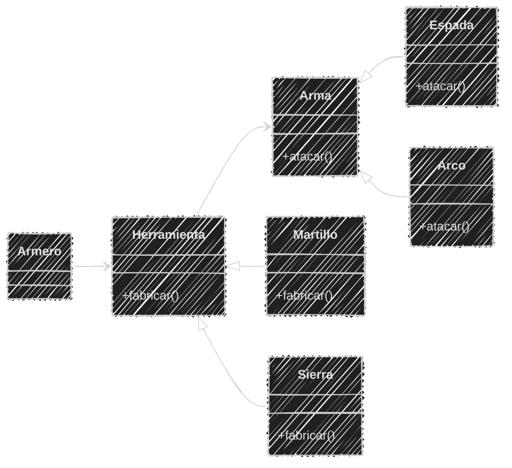


---

#### Implementación de las armas

Ahora que tenemos el diseño, podemos implementar primero las armas

3 minutos

<iframe src="https://time-stuff.com/embed.html" frameborder="0" scrolling="no" width="391" height="140"></iframe>

Añadir al archivo `juego.py`

---

```python
class Arma:
    def atacar(self):
        print("Atacando con un arma")

class Espada(Arma):
    def atacar(self):
        print("🗡️ Atacando con una espada")

class Arco(Arma):
    def atacar(self):
        print("🏹 Atacando con un arco")
```


---

#### Implementación de las herramientas

Ya tenemos las armas, ahora implementamos las herramientas que fabrican las armas

Cada herramienta crea un tipo de arma específico

3 minutos

<iframe src="https://time-stuff.com/embed.html" frameborder="0" scrolling="no" width="391" height="140"></iframe>

Añadir al archivo `juego.py`

---
```python
class Herramienta:
    def fabricar(self):
        pass

class Martillo(Herramienta):
    def fabricar(self):
        return Espada()

class Sierra(Herramienta):
    def fabricar(self):
        return Arco()
```

---

#### Implementación del Armero

Ahora implementamos el Armero que utiliza las herramientas para fabricar las armas

2 minutos

<iframe src="https://time-stuff.com/embed.html" frameborder="0" scrolling="no" width="391" height="140"></iframe>

Añadir al archivo `juego.py`

---

```python
class Armero:
    def fabricar_arma(self, tipo):
        if tipo == "espada":
            return Martillo().fabricar()
        elif tipo == "arco":
            return Sierra().fabricar()
        else:
            raise ValueError("❌ Arma no disponible. Intente de nuevo")
```

---

#### Implementación del juego

Ahora que tenemos el Armero, podemos implementar la lógica del juego donde el jugador solicita un arma
al armero y si ingresa "salir" se termina la ejecución

2 minutos

<iframe src="https://time-stuff.com/embed.html" frameborder="0" scrolling="no" width="391" height="140"></iframe>

---

```python
while True:
    tipo_arma = input("💬 ¿Qué arma desea? (espada/arco/salir): ")
    tipo_arma = tipo_arma.lower().strip()
    if tipo_arma == "salir":
        print("🚶‍♂️ Saliendo del juego.")
        break
    try:
        armero = Armero()
        arma = armero.fabricar_arma(tipo_arma)
        arma.atacar()
    except ValueError as e:
        print(e)
```

---

#### Código completo

```python
class Arma:
    def atacar(self):
        print("Atacando con un arma")

class Espada(Arma):
    def atacar(self):
        print("🗡️ Atacando con una espada")

class Arco(Arma):
    def atacar(self):
        print("🏹 Atacando con un arco")

class Herramienta:
    def fabricar(self):
        pass

class Martillo(Herramienta):
    def fabricar(self):
        return Espada()

class Sierra(Herramienta):
    def fabricar(self):
        return Arco()

class Armero:
    def fabricar_arma(self, tipo):
        if tipo == "espada":
            return Martillo().fabricar()
        elif tipo == "arco":
            return Sierra().fabricar()
        else:
            raise ValueError("❌ Arma no disponible. Intente de nuevo")

while True:
    tipo_arma = input("💬 ¿Qué arma desea? (espada/arco/salir): ")
    tipo_arma = tipo_arma.lower().strip()
    if tipo_arma == "salir":
        print("🚶‍♂️ Saliendo del juego.")
        break
    try:
        armero = Armero()
        arma = armero.fabricar_arma(tipo_arma)
        arma.atacar()
    except ValueError as e:
        print(e)
```

---
```bash
python juego.py
```

```text
💬 ¿Qué arma desea? (espada/arco/salir): espada
🗡️ Atacando con una espada
💬 ¿Qué arma desea? (espada/arco/salir): arco
🏹 Atacando con un arco
💬 ¿Qué arma desea? (espada/arco/salir): hacha
❌ Arma no disponible. Intente de nuevo
💬 ¿Qué arma desea? (espada/arco/salir): salir
🚶‍♂️ Saliendo del juego.
```

---
#### Resumen

- Un patrón de diseño es una solución típica para resolver problemas recurrentes en el desarrollo de software.
- Los patrones de diseño se clasifican en creacionales, estructurales y de comportamiento según su propósito.
- Los patrones creacionales ayudan a crear objetos de manera eficiente y flexible.

---

- El patrón Factory pertenece a los patrones creacionales y permite crear diferentes tipos de objetos según las necesidades.
- El patrón Factory aporta flexibilidad, desacoplamiento y facilidad de mantenimiento al separar la lógica de creación de objetos de su uso.
- El patrón Factory facilita la reutilización de código, la escalabilidad y el mantenimiento al permitir modificar la forma de crear objetos sin afectar el resto del código.

---

- El uso del patrón Factory puede agregar complejidad adicional y sobrecarga de rendimiento, y puede llevar a una sobreabundancia de clases si no se gestiona adecuadamente.
- El patrón Factory se representa en diagramas de clases mediante la relación entre fábricas y productos, mostrando herencia y asociación.
- La estructura del patrón Factory en Python utiliza herencia y polimorfismo para definir fábricas y productos.

---

- El análisis de requisitos, características y acciones es fundamental para diseñar correctamente las clases y sus relaciones al aplicar el patrón Factory.
- Los diagramas de clases ayudan a visualizar la estructura y relaciones entre fábricas y productos en el patrón Factory.
- El patrón Factory permite crear objetos sin que el cliente conozca los detalles de la creación, delegando esa responsabilidad a una fábrica especializada.


---

#### Retos

Crear una carpeta con el nombre "retos_sesion_10" dentro del proyecto en la raíz, en la cual por cada ejercicio debes crear los siguientes archivos:

```bash
# Estructura de carpetas
psg-oop-2025/
    retos_sesion_10/
        ejercicio_01.md
        ejercicio_01.py
        ejercicio_02.md
        ejercicio_02.py
```

---

1. Utilizando el patron Factory

```markdown
En una heladería, los clientes pueden pedir helado de vainilla o chocolate.
Puedes pedir en cono o en vaso los helados.
El encargado usa la máquina adecuada para preparar cada sabor.

La máquina de vainilla solo prepara helados de vainilla.
La máquina de chocolate solo prepara helados de chocolate.

Todos los helados se pueden comer y tienen un envase.
Escribe "salir" para terminar.
```

---

2. Utilizando el patron Factory

```markdown
Simulador de batalla de monstruos
Dos jugadores pueden elegir un monstruo para luchar.
Cada jugador selecciona un monstruo: dragón, zombi o vampiro.
Donde cada uno tiene debilidades contra otros monstruos.
- Dragon: Fuerte contra Zombi, débil contra Vampiro, igual contra Dragón.
- Zombi: Fuerte contra Vampiro, débil contra Dragón, igual contra Zombi.
- Vampiro: Fuerte contra Dragón, débil contra Zombi, igual contra Vampiro.

Muestra el resultado de la batalla.
Si alguno escribir “salir” se termina el juego.
```


---
<!-- .slide: data-background-image="../../content/psg-bg-dark.png" data-background-size="100%"-->

<br>
<br>
<br>
<br>
<br>

[ <!-- .element width="20%"-->](https://github.com/python-la-paz/python-study-group-oop/content/sesion10)

Repositorio de la Sesión

---
<!--.slide: data-visibility="hidden"-->
## Bibliografía y Referencias

- [Factory Method](https://refactoring.guru/es/design-patterns/factory-method)
- [Patrón Factory Method Introducción y ejemplos](https://revistacompleta.com/patron-factory-method-introduccion-y-ejemplos/)
- [05-FactoryPattern](https://uetitc.github.io/ProgrammingII-2024-2/Lessons/05-FactoryPattern.html)
- [Factory Pattern](https://www.chucksacademy.com/es/topic/javascript-design-patterns/factory-pattern)
- [Object Oriented Analysis](https://www.gyata.ai/es/object-oriented-programming/object-oriented-analysis)
- [Diagrama de clases](https://diagramasuml.com/diagrama-de-clases/)
- [Guía PEP 8](https://peps.python.org/pep-0008/#class-names)
- [Mermaid Charts](https://www.mermaidchart.com/play)
- [Draw.io](https://app.diagrams.net/)
- [Python 3 Object-oriented Programming, Second Edition, Dusty PhillipsDusty Phillips](https://github.com/PacktPublishing/Python-3-Object-Oriented-Programming-Second-Edition)

