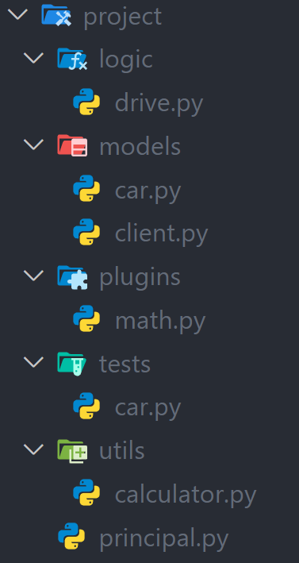
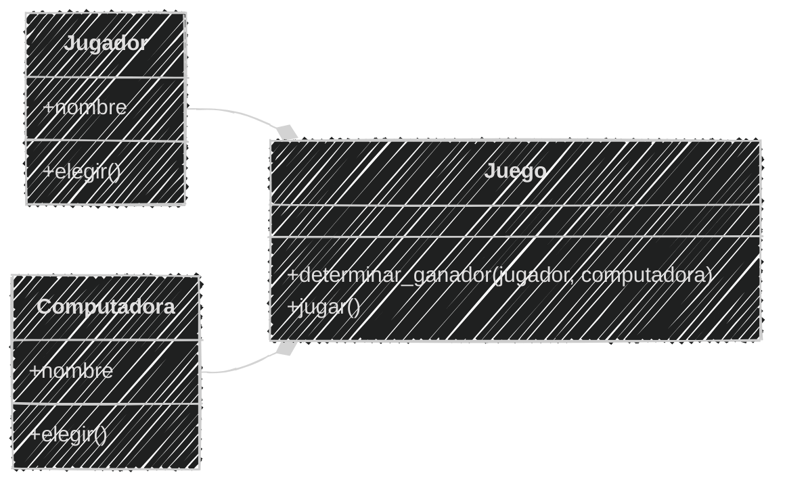
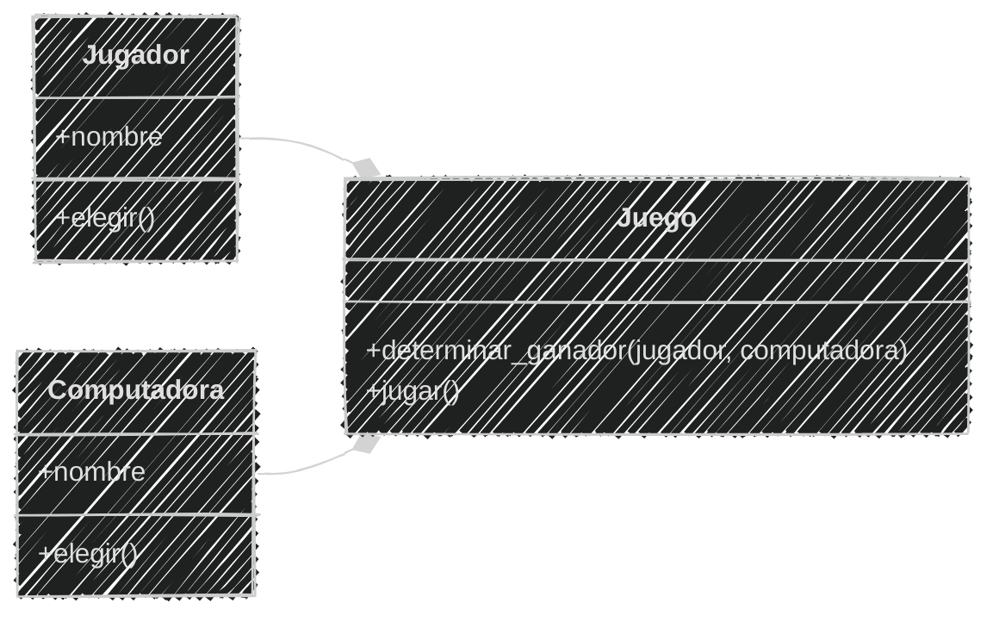
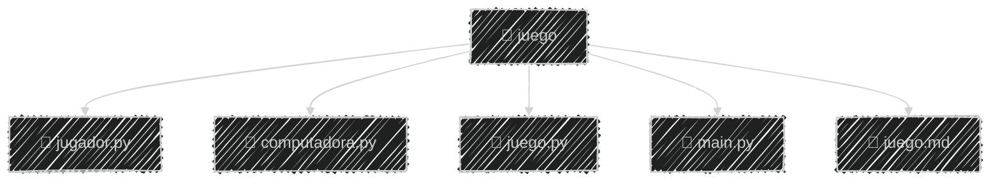
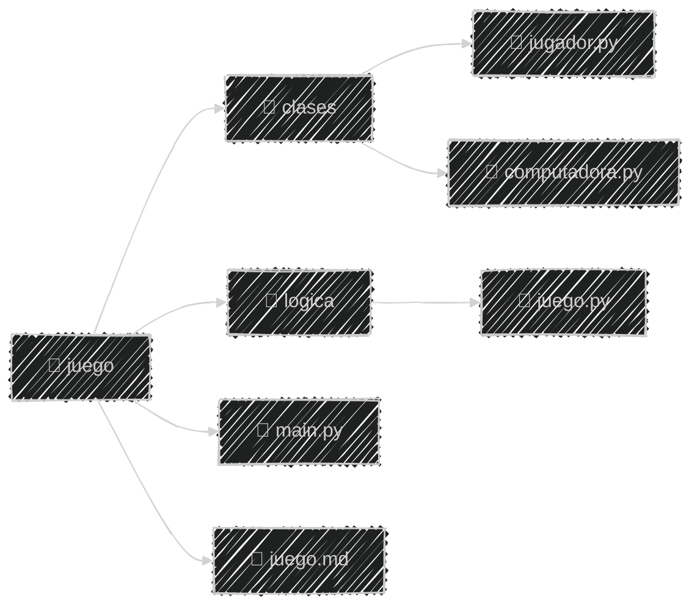
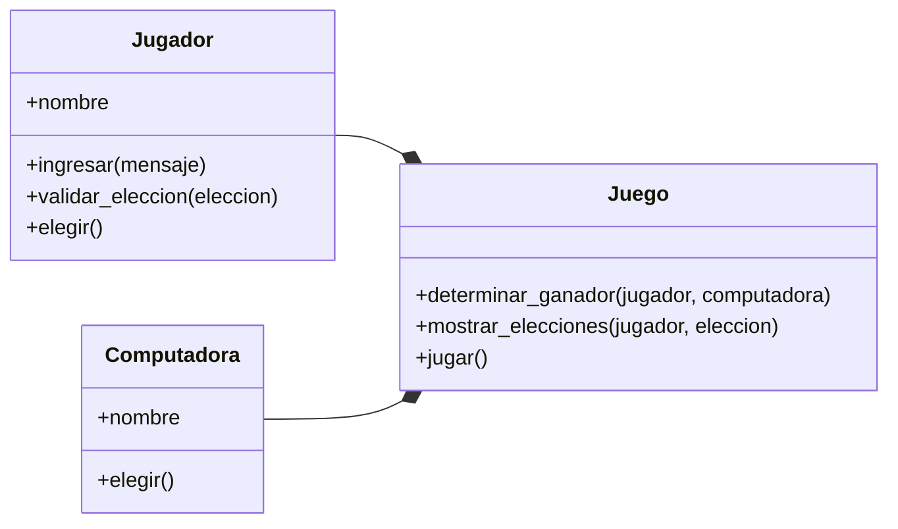
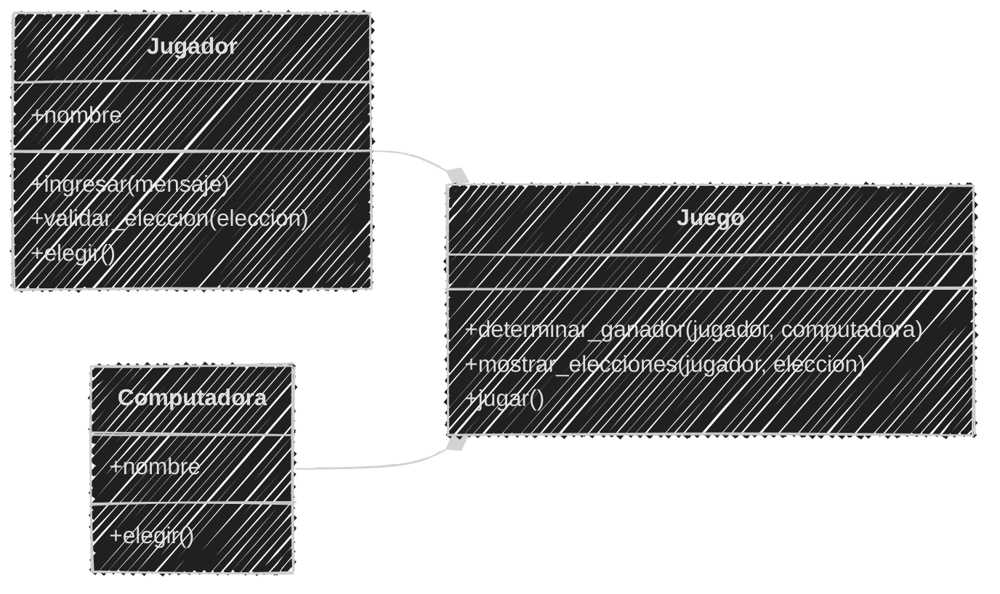
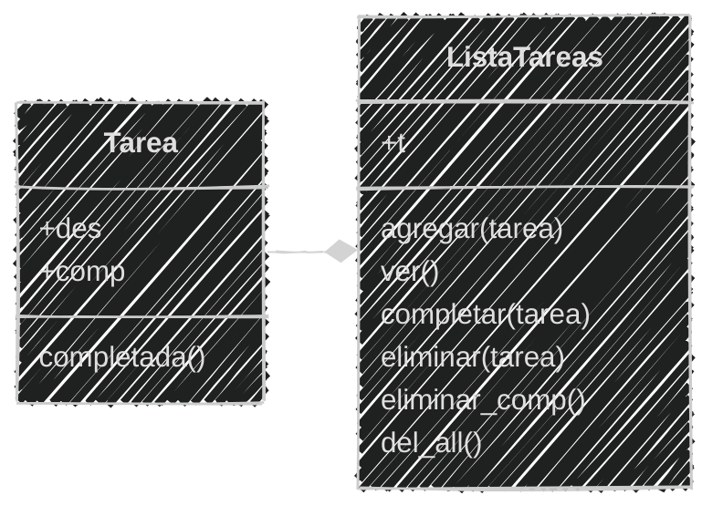

<!-- .slide: data-background-image="../../content/psg-bg-dark.png" data-background-size="100%"-->
 <!-- .element  hidden="true" -->

<br>
<br>
<br>

### Sesión  11
#### Buenas prácticas
#### Refactorización y organización

---

#### VS Code

Abrimos el proyecto del Study Group

```bash
code psg-oop-2025
```

Creamos una carpeta llamada `sesion11` dentro del proyecto

```bash
mkdir sesion11
cd sesion11
```

Aquí guardaremos los ejemplos de la sesión

---

#### Introducción a la refactorización

La refactorización es el proceso de mejorar el código existente sin cambiar su funcionalidad externa.

---

#### ¿Por qué refactorizar?

- Mejora la legibilidad del código.
- Facilita el mantenimiento y la evolución del software.
- Reduce la complejidad y el riesgo de errores.

---

#### ¿Qué implica la refactorización?

- Reorganizar el código en módulos y clases.
- Eliminar código duplicado.
- Renombrar variables y funciones para que sean más descriptivas.
- Dividir funciones grandes en funciones más pequeñas y manejables.

---

#### Reorganización del código

En python se puede organizar el código en archivos y carpetas para mejorar la estructura del proyecto.

 <!-- .element width="25%"-->

---

En lugar de tener un archivo gigante con todo el código, podemos dividirlo en varios archivos y carpetas.

---

#### Buenas prácticas de organización

- Utilizar nombres descriptivos para archivos y carpetas.
- Agrupar archivos relacionados en carpetas.
- Mantener una estructura coherente en todo el proyecto.

---

En Python se recomienda seguir la convención de nombres PEP 8:

```markdown
- Clases: `CamelCase` (ejemplo: `MiClase`)
- Funciones y variables: `snake_case` (ejemplo: `mi_funcion`)
- Constantes: `UPPER_CASE` (ejemplo: `MI_CONSTANTE`)
- Archivos y carpetas: `snake_case` (ejemplo: `mi_archivo.py`)
- Módulos y paquetes: `snake_case` (ejemplo: `mi_modulo`)
````

---

#### Ejemplo de organización

```markdown
Juega "Piedra, Papel o Tijera" con un jugador y una computadora.
Ingresa tu nombre y elige entre piedra, papel o tijera.
La computadora hará su elección al azar
y se determinará el ganador según las reglas del juego.
Cuenta con un menú para 1. jugar o 2. salir.
```

Crearemos un archivo llamado `juego.py` con la lógica del juego.
y el análisis y diagrama en el archivo `juego.md`

---

#### Análisis

```markdown
Requisitos:
- El jugador debe ingresar su nombre.
- El jugador debe elegir entre piedra, papel o tijera.
- La computadora debe elegir al azar entre piedra, papel o tijera.
- El juego debe determinar el ganador según las reglas del juego.
- El juego debe mostrar el resultado de cada partida.
- El juego debe permitir al jugador jugar varias partidas.
- El juego debe tener un menú para jugar o salir.

Objetos:
- Jugador
- Computadora
- Juego

Características:
- Jugador: (nombre)
- Computadora: (nombre)
- Juego: (jugador, computadora)

Acciones:
- Jugador: elegir()
- Computadora: elegir()
- Juego: jugar(), determinar_ganador()
```

---
#### Diagrama de clases

````

````

---
#### Diagrama de clases



---

Código del juego de Piedra, Papel o Tijera

```python
import random

class Jugador:
    def __init__(self, nombre):
        self.nombre = nombre

    def elegir(self):
        eleccion = input(f"{self.nombre}, elige piedra, papel o tijera: ").lower()
        while eleccion not in ["piedra", "papel", "tijera"]:
            eleccion = input("Opción inválida. Intenta de nuevo: ").lower()
        return eleccion


class Computadora:
    def __init__(self):
        self.nombre = "Computadora"

    def elegir(self):
        return random.choice(["piedra", "papel", "tijera"])


class Juego:
    def __init__(self, jugador, computadora):
        self.jugador = jugador
        self.computadora = computadora

    def determinar_ganador(self, eleccion_jugador, eleccion_computadora):
        if eleccion_jugador == eleccion_computadora:
            return "Empate"
        elif (
            (eleccion_jugador == "piedra" and eleccion_computadora == "tijera") or
            (eleccion_jugador == "papel" and eleccion_computadora == "piedra") or
            (eleccion_jugador == "tijera" and eleccion_computadora == "papel")
        ):
            return f"{self.jugador.nombre} gana!"
        else:
            return f"{self.computadora.nombre} gana!"

    def jugar(self):
        eleccion_jugador = self.jugador.elegir()
        eleccion_computadora = self.computadora.elegir()

        print(f"{self.jugador.nombre} eligió: {eleccion_jugador}")
        print(f"{self.computadora.nombre} eligió: {eleccion_computadora}")

        resultado = self.determinar_ganador(eleccion_jugador, eleccion_computadora)
        print(resultado)

print("🎮 Bienvenido al juego de Piedra, Papel o Tijera 🎮")
nombre = input("Introduce tu nombre: ")
jugador = Jugador(nombre)
computadora = Computadora()
juego = Juego(jugador, computadora)

while True:
    print("\n--- Menú ---")
    print("1. Jugar")
    print("2. Salir")
    opcion = input("Elige una opción: ")

    if opcion == "1":
        juego.jugar()
    elif opcion == "2":
        print("¡Gracias por jugar! 👋")
        break
    else:
        print("Opción inválida, intenta de nuevo.")
```

---
Vamos ahora a reorganizar el juego en una estructura de archivos dentro
de una carpeta llamada `juego`.

Donde primero separaremos las partes del juego en diferentes archivos:



---
#### 1: Crear la carpeta y los archivos

Vamos a crear la carpeta `juego` y los archivos vacíos necesarios para el juego.

```markdown
Con `mkdir` creamos la carpeta
Con `cd` entramos a la carpeta
Con `touch` creamos los archivos 
Con `tree` vemos la estructura de carpetas y archivos
```

```bash
mkdir juego
cd juego
touch jugador.py computadora.py juego.py main.py
tree
```

```bash
.
├── computadora.py
├── juego.py
├── jugador.py
└── main.py

1 directory, 4 files
```

---

Movemos el archivo `juego.md` a la carpeta `juego` para mantener todo organizado:

```markdown
Con `cd ..` volvemos a la carpeta anterior
Con `mv` movemos el archivo `juego.md` a la carpeta `juego`
Con `cd juego` entramos a la carpeta `juego`
Con `tree` vemos la estructura de carpetas y archivos
```

```bash
cd ..
mv juego.md juego/
cd juego
tree
```

```bash
.
├── computadora.py
├── juego.md
├── juego.py
├── jugador.py
└── main.py

1 directory, 5 files
```


---

#### 2: Llenar los archivos con el código correspondiente

Ya con la estructura creada, vamos a llenar cada archivo con el código correspondiente.

Primero, el archivo `jugador.py` contendrá la clase `Jugador`:

```python
# jugador.py
class Jugador:
    def __init__(self, nombre):
        self.nombre = nombre
    def elegir(self):
        eleccion = input(f"{self.nombre}, elige piedra, papel o tijera: ").lower()
        while eleccion not in ["piedra", "papel", "tijera"]:
            eleccion = input("Opción inválida. Intenta de nuevo: ").lower()
        return eleccion
```

---

Luego, el archivo `computadora.py` contendrá la clase `Computadora`:

```python
# computadora.py
import random
class Computadora:
    def __init__(self):
        self.nombre = "Computadora"

    def elegir(self):
        return random.choice(["piedra", "papel", "tijera"])
```

En el caso de computadora, importamos el módulo `random` porque 
el método `elegir` de la clase `Computadora` utiliza la función `choice` de este módulo para seleccionar una opción al azar.

---

Luego, el archivo `juego.py` quedaría así

```python
# juego.py
class Juego:
    def __init__(self, jugador, computadora):
        self.jugador = jugador
        self.computadora = computadora

    def determinar_ganador(self, eleccion_jugador, eleccion_computadora):
        if eleccion_jugador == eleccion_computadora:
            return "Empate"
        elif (
            (eleccion_jugador == "piedra" and eleccion_computadora == "tijera") or
            (eleccion_jugador == "papel" and eleccion_computadora == "piedra") or
            (eleccion_jugador == "tijera" and eleccion_computadora == "papel")
        ):
            return f"{self.jugador.nombre} gana!"
        else:
            return f"{self.computadora.nombre} gana!"

    def jugar(self):
        eleccion_jugador = self.jugador.elegir()
        eleccion_computadora = self.computadora.elegir()

        print(f"{self.jugador.nombre} eligió: {eleccion_jugador}")
        print(f"{self.computadora.nombre} eligió: {eleccion_computadora}")

        resultado = self.determinar_ganador(eleccion_jugador, eleccion_computadora)
        print(resultado)
```

---

Finalmente, el archivo `main.py` contendrá la lógica para iniciar el juego:

Pero primero el juego necesita tener acceso a las clases `Jugador`, `Computadora` y `Juego` 

Por lo que debemos importar nuestros archivos

---
#### Importación de módulos

Python permite importar módulos para reutilizar código

Podemos importar un módulo completo o solo partes específicas de él.

Para importar un módulo completo utilizamos la palabra clave `import` seguida del nombre del módulo.

```python
import random
```

---

Para importar una parte específica de un módulo como una función o clase, 
utilizamos la palabra clave `from` seguida del módulo y luego `import` seguido del nombre de la función o clase.

```python
from random import choice
```

---

Es recomendable importar solo lo que se necesita para evitar conflictos de nombres y mejorar la legibilidad del código.

No es necesario importar todo el módulo si solo se utiliza una parte de él.

---
Cada archivo que hemos creado puede ser importado como un módulo en Python.

Para importar las clases desde los archivos que hemos creado, utilizamos la sintaxis `from nombre_archivo import NombreClase`.

---
Por ejemplo, en el archivo `main.py`, importamos las clases de la siguiente manera:

```python
# main.py
from jugador import Jugador
from computadora import Computadora
from juego import Juego
```

Esto nos permite utilizar las clases `Jugador`, `Computadora` y `Juego` en el archivo `main.py`

---

Finalmente, el archivo `main.py` quedaría así:

```python
# main.py
from jugador import Jugador
from computadora import Computadora
from juego import Juego


print("🎮 Bienvenido al juego de Piedra, Papel o Tijera 🎮")
nombre = input("Introduce tu nombre: ")
jugador = Jugador(nombre)
computadora = Computadora()
juego = Juego(jugador, computadora)

while True:
    print("\n--- Menú ---")
    print("1. Jugar")
    print("2. Salir")
    opcion = input("Elige una opción: ")

    if opcion == "1":
        juego.jugar()
    elif opcion == "2":
        print("¡Gracias por jugar! 👋")
        break
    else:
        print("Opción inválida, intenta de nuevo.")
```

---
#### 3: Ejecutar el juego

Para ejecutar el juego, debemos asegurarnos de estar en el directorio `juego` y ejecutar el archivo `main.py`

```bash
python main.py
```

```text
🎮 Bienvenido al juego de Piedra, Papel o Tijera 🎮
Introduce tu nombre: Jhon

--- Menú ---
1. Jugar
2. Salir
Elige una opción: 1
Jhon, elige piedra, papel o tijera: tijera
Jhon eligió: tijera
Computadora eligió: piedra
Computadora gana!

--- Menú ---
1. Jugar
2. Salir
Elige una opción: 1
Jhon eligió: papel
Computadora eligió: papel
Empate

--- Menú ---
1. Jugar
2. Salir
Elige una opción: 2
¡Gracias por jugar! 👋
```

---

Hasta aquí conseguimos refactorizar el código del juego de Piedra, Papel o Tijera
y organizarlo en una estructura de archivos pero de un sólo nivel.

Podemos seguir mejorando la organización del código creando una estructura de carpetas
para ordenar los archivos de nuestro proyecto.

---
#### Estructura de carpetas

Podemos organizar el proyecto en carpetas para separar la lógica del juego y las clases



---
#### 1: Crear las carpetas y los archivos
Vamos a crear las carpetas `clases` y `logica` dentro de la carpeta `juego`

```markdown
Con `cd` entramos a la carpeta `juego`
Con `mkdir` creamos las carpetas `clases` y `logica`
```

```bash
cd juego
mkdir clases logica
```

---
Luego, movemos los archivos correspondientes a cada carpeta

```markdown
Con `mv` movemos los archivos `jugador.py` y `computadora.py`
a la carpeta `clases`
Con `mv` movemos el archivo `juego.py` a la carpeta `logica`
```

```bash
mv jugador.py clases
mv computadora.py clases
mv juego.py logica
```

---
Nos quedará la siguiente estructura de carpetas y archivos:

```markdown
Con `tree` vemos la estructura de carpetas y archivos
```

```bash
tree
```

```bash
.
├── clases
│   ├── computadora.py
│   └── jugador.py
├── logica
│   └── juego.py
├── juego.md
└── main.py


3 directories, 5 files
```

---

#### 2: Actualizar las importaciones
Ahora debemos actualizar las importaciones en los archivos para reflejar la nueva estructura de carpetas.

En el archivo `main.py`, debemos importar las clases desde las nuevas ubicaciones:

Como hemos movido los archivos para importar ahora se utiliza la sintaxis `from carpeta.archivo import Clase`

```python
# main.py
from clases.jugador import Jugador
from clases.computadora import Computadora
from logica.juego import Juego
```

---

#### 3: Ejecutar el juego

Con esto, hemos actualizado las importaciones para reflejar la nueva estructura de carpetas y podemos ejecutar
el juego de la misma manera que antes:

```bash
python main.py
```

---

Aun podemos mejorar más la organización del código,
creando un archivo `__init__.py` en cada carpeta para convertirlas en paquetes de Python.

---

#### `__init__.py`

El archivo `__init__.py` es un archivo especial en Python que indica que una carpeta debe ser tratada como un paquete.

Esto permite importar módulos desde esa carpeta de manera más sencilla.

Son opcionales pero es recomendable incluirlos para indicar que la carpeta es un paquete de Python.

---

#### 1: Crear los archivos `__init__.py`

Podemos crear un archivo `__init__.py` vacío en cada carpeta para indicar que son paquetes.

```markdown
Con `cd` entramos a la carpeta `juego` 
Con `touch` creamos los archivos `__init__.py`
en las carpetas `clases` y `logica`
```

```bash
cd juego
touch clases/__init__.py logica/__init__.py
```

---

Ahora, la estructura de carpetas y archivos quedará así:

```bash
tree
```

```bash
.
├── clases
│   ├── __init__.py
│   ├── computadora.py
│   └── jugador.py
├── logica
│   ├── __init__.py
│   └── juego.py
├── juego.md
└── main.py

3 directories, 7 files
```

---

#### 2: Importar desde los paquetes

En el archivo `__init__.py` añadimos los archivos que podremos importar directamente desde el paquete.

En el archivo `clases/__init__.py` añadimos:

```python
# clases/__init__.py
from .jugador import Jugador
from .computadora import Computadora
```

Donde al utilizar el punto `.` antes del nombre del archivo, indicando que importamos el archivo desde la misma carpeta

---

En el archivo `logica/__init__.py` añadimos:

```python
# logica/__init__.py
from .juego import Juego
```

Asi cada paquete podrá importar sus clases correspondientes sin necesidad de especificar el archivo.

---

#### 2: Importar desde los paquetes
Ahora podemos importar las clases desde los paquetes de la siguiente manera:

```python
# main.py
from clases import Jugador, Computadora
from logica import Juego
```

Esto nos permite importar las clases directamente desde los paquetes sin necesidad de especificar el archivo.

---

#### 3: Ejecutar el juego

Con esto, hemos organizado el código en paquetes y podemos ejecutar el juego de la misma manera que antes:

```bash
python main.py
```

---

Después de reestructurar el código, podemos continuar refactorizando.

Ahora eliminaremos el código duplicado y dividir en funciones más pequeñas

---
#### Eliminación de código duplicado

El código duplicado es un problema común en la programación que puede hacer que el código sea más difícil de mantener y entender.

La eliminación de código duplicado implica identificar y eliminar partes del código que se repiten innecesariamente.

y reemplazarlas por funciones o métodos reutilizables.

---
#### ¿Por qué eliminar el código duplicado?

- Mejora la legibilidad del código.
- Facilita el mantenimiento y la evolución del software.
- Reduce el riesgo de errores al modificar el código.

---

#### Refactorización del código duplicado

En el Jugador podemos notar que al elegir piedra, papel o tijera,
se repite el código para validar la elección del jugador.

```python [4-8]
class Jugador:
    def __init__(self, nombre):
        self.nombre = nombre
    def elegir(self):
        eleccion = input(f"{self.nombre}, elige piedra, papel o tijera: ").lower()
        while eleccion not in ["piedra", "papel", "tijera"]:
            eleccion = input("Opción inválida. Intenta de nuevo: ").lower()
        return eleccion
```

---
Podemos refactorizar separando las opciones válidas en una constante y 
la validación de la elección en un método separado.

```python
OPCIONES = ["piedra", "papel", "tijera"]
class Jugador:
    def __init__(self, nombre):
        self.nombre = nombre

    def validar_eleccion(self, eleccion):
        while eleccion not in OPCIONES:
            eleccion = input("Opción inválida. Intenta de nuevo: ").lower()
        return eleccion

    def elegir(self):
        opciones = ", ".join(OPCIONES)
        eleccion = input(f"{self.nombre}, elige {opciones}: ").lower()
        return self.validar_eleccion(eleccion)
```

---

También podemos refactorizar el input del jugador para que sea más claro y reutilizable.
Tambien definir un `__str__` para la clase Jugador


```python
OPCIONES = ["piedra", "papel", "tijera"]
class Jugador:
    def __init__(self, nombre):
        self.nombre = nombre

    def __str__(self):
        return self.nombre

    def ingresar(self, mensaje):
        return input(f"{self}, {mensaje}: ").lower()

    def validar_eleccion(self, eleccion):
        while eleccion not in OPCIONES:
            eleccion = self.ingresar("opción inválida. Intenta de nuevo")
        return eleccion

    def elegir(self):
        opciones = ", ".join(OPCIONES)
        eleccion = self.ingresar(f"elige {opciones}")
        return self.validar_eleccion(eleccion)
```

---

En el caso de la computadora, podemos hacer algo similar
Incluso importar sólo lo necesario del módulo `random` y no todo el módulo
y también definir un `__str__` para la clase Computadora

```python [1,7]
import random
class Computadora:
    def __init__(self):
        self.nombre = "Computadora"

    def elegir(self):
        return random.choice(["piedra", "papel", "tijera"])
```

---

Queda así:

```python
from random import choice
OPCIONES = ["piedra", "papel", "tijera"]
class Computadora:
    def __init__(self):
        self.nombre = "Computadora"

    def __str__(self):
        return self.nombre
    
    def elegir(self):
        return choice(OPCIONES)
```

---

Por último, podemos refactorizar el archivo `juego.py` usando el método `__str__` de las clases `Jugador` y `Computadora`
Tambien adicionar un método para mostrar las elecciones


```python [14-16,22-23]
class Juego:
    def __init__(self, jugador, computadora):
        self.jugador = jugador
        self.computadora = computadora

    def determinar_ganador(self, eleccion_jugador, eleccion_computadora):
        if eleccion_jugador == eleccion_computadora:
            return "Empate"
        elif (
            (eleccion_jugador == "piedra" and eleccion_computadora == "tijera") or
            (eleccion_jugador == "papel" and eleccion_computadora == "piedra") or
            (eleccion_jugador == "tijera" and eleccion_computadora == "papel")
        ):
            return f"{self.jugador.nombre} gana!"
        else:
            return f"{self.computadora.nombre} gana!"

    def jugar(self):
        eleccion_jugador = self.jugador.elegir()
        eleccion_computadora = self.computadora.elegir()

        print(f"{self.jugador.nombre} eligió: {eleccion_jugador}")
        print(f"{self.computadora.nombre} eligió: {eleccion_computadora}")

        resultado = self.determinar_ganador(eleccion_jugador, eleccion_computadora)
        print(resultado)
```

---
Queda así:

```python
class Juego:
    def __init__(self, jugador, computadora):
        self.jugador = jugador
        self.computadora = computadora

    def determinar_ganador(self, eleccion_jugador, eleccion_computadora):
        if eleccion_jugador == eleccion_computadora:
            return "Empate"
        if (
            (eleccion_jugador == "piedra" and eleccion_computadora == "tijera") or
            (eleccion_jugador == "papel" and eleccion_computadora == "piedra") or
            (eleccion_jugador == "tijera" and eleccion_computadora == "papel")
        ):
            return f"{self.jugador} gana!"
        return f"{self.computadora} gana!"

    def mostrar_elecciones(self, jugador, eleccion):
        print(f"{jugador} eligió: {eleccion}")

    def jugar(self):
        eleccion_jugador = self.jugador.elegir()
        eleccion_computadora = self.computadora.elegir()
        self.mostrar_elecciones(self.jugador, eleccion_jugador)
        self.mostrar_elecciones(self.computadora, eleccion_computadora)
        resultado = self.determinar_ganador(eleccion_jugador, eleccion_computadora)
        print(resultado)
```

---

Y asi hemos eliminado algunos duplicados y mejorado la legibilidad del código.
Pero aún podemos seguir mejorando y refactorizando el código y dividiendo
en funciones más pequeñas y manejables.

---

El objetivo es tener un código limpio y fácil de mantener. También es importante
saber cuando detenerse, ya que la refactorización excesiva puede llevar a un código innecesariamente complejo.

---

Por último actualizamos el análisis y 
el diagrama de clases para reflejar los cambios realizados

---
#### Análisis actualizado

```markdown
Requisitos:
- El jugador debe ingresar su nombre.
- El jugador debe elegir entre piedra, papel o tijera.
- La computadora debe elegir al azar entre piedra, papel o tijera.
- El juego debe determinar el ganador según las reglas del juego.
- El juego debe mostrar el resultado de cada partida.
- El juego debe permitir al jugador jugar varias partidas.
- El juego debe tener un menú para jugar o salir.
Objetos:
- Jugador
- Computadora
- Juego
Características:
- Jugador: (nombre)
- Computadora: (nombre)
- Juego: (jugador, computadora)
Acciones:
- Jugador: elegir(), validar_eleccion(), ingresar()
- Computadora: elegir()
- Juego: determinar_ganador(), mostrar_elecciones(), jugar()
```

---
#### Diagrama de clases actualizado

````

````

---

#### Diagrama de clases actualizado



---

Por último,  cambiamos el nombre del archivo `juego.md` a `README.md`
para que sea reconocido como el archivo de documentación principal del juego.

```markdown
Con `mv` cambiamos el nombre del archivo `juego.md` a `README.md`
Con `tree` vemos la estructura de carpetas y archivos
```

```bash
mv juego.md README.md
tree
```
```bash
.
├── clases
│   ├── __init__.py
│   ├── computadora.py
│   └── jugador.py
├── logica
│   ├── __init__.py
│   └── juego.py
├── README.md
└── main.py
3 directories, 7 files
```

---

#### Dependencia circular

¿Bueno o malo?

---

La dependencia circular es mala

Ocurre cuando dos o más módulos dependen entre sí directa o indirectamente.

Esto puede llevar a problemas como:
- Dificultad para entender y mantener el código.
- Problemas de rendimiento debido a la carga repetida de módulos.
- Errores en tiempo de ejecución si los módulos no se cargan en el orden correcto.

---
Para evitar dependencias circulares, es recomendable:

- Reorganizar el código para reducir las dependencias.
- Dividir módulos grandes en módulos más pequeños y manejables.

---

#### La variable `__name__`

En Python, la variable especial `__name__` se utiliza para determinar si un módulo
se está ejecutando como el programa principal o si se está importando desde otro módulo.

---

Cuando un módulo se ejecuta directamente, su variable `__name__` se establece en `"__main__"`.
Cuando se importa desde otro módulo, su variable `__name__` se establece en el nombre del módulo.

---

Esto permite que el código dentro de un bloque `if __name__ == "__main__":` se ejecute solo cuando el módulo se ejecuta directamente,
y no cuando se importa desde otro módulo.

---
Es una buena práctica utilizar este bloque para definir el punto de entrada del programa.

En nuestro caso, podemos agregarlo al final del archivo `main.py` para que el juego se ejecute solo cuando se ejecuta directamente.

```python
# main.py
from clases import Jugador, Computadora
from logica import Juego
print("🎮 Bienvenido al juego de Piedra, Papel o Tijera 🎮")
nombre = input("Introduce tu nombre: ")
jugador = Jugador(nombre)
computadora = Computadora()
juego = Juego(jugador, computadora)

while True:
    print("\n--- Menú ---")
    print("1. Jugar")
    print("2. Salir")
    opcion = input("Elige una opción: ")

    if opcion == "1":
        juego.jugar()
    elif opcion == "2":
        print("¡Gracias por jugar! 👋")
        break
    else:
        print("Opción inválida, intenta de nuevo.")
```

---
Así, el código dentro de la función `main()` se ejecutará solo cuando el archivo `main.py` se ejecute directamente.

```python
from clases import Jugador, Computadora
from logica import Juego
def main():
    print("🎮 Bienvenido al juego de Piedra, Papel o Tijera 🎮")
    nombre = input("Introduce tu nombre: ")
    jugador = Jugador(nombre)
    computadora = Computadora()
    juego = Juego(jugador, computadora)

    while True:
        print("\n--- Menú ---")
        print("1. Jugar")
        print("2. Salir")
        opcion = input("Elige una opción: ")

        if opcion == "1":
            juego.jugar()
        elif opcion == "2":
            print("¡Gracias por jugar! 👋")
            break
        else:
            print("Opción inválida, intenta de nuevo.")

if __name__ == "__main__":
    main()
```

---

Con esto hemos completado la refactorización y podemos subir los cambios al repositorio de GitHub.

```bash
git add .
git commit -m "Refactorización y organización del código"
git push
```

---


#### Ejemplo 01

```text
Una aplicación para gestionar una lista de tareas pendientes.
Permite agregar, eliminar y marcar tareas como completadas.
También permite eliminar tareas completadas y eliminar todas las tareas.
```



En el archivo `tarea.py` definimos el ejemplo y en el archivo `tareas.md` documentamos el ejemplo

---
Código del ejemplo 01

```python
class Tarea:
    def __init__(self, d):
        self.des = d
        self.comp = 0
    def completada(self):
        self.comp == 1

class ListaTareas:
    def __init__(self):
        self.t = []
    def agregar(self, t):
        self.t.append(Tarea(t))
    def ver(self):
        if not self.t:
            print("No hay tareas pendientes.")
        else:
            for i, tarea in enumerate(self.t, 1):
                estado = "✔️" if tarea.comp else " "
                print(f"{i}. [{estado}] {tarea.des} ")
    def completar(self, i):
        if 0 < i <= len(self.t):
            self.t[i-1].comp = 1
            print(f"Tarea '{self.t[i-1].des}' marcada como completada.")
        else:
            print("Índice de tarea inválido.")
    def eliminar(self, i):
        if 0 < i <= len(self.t):
            tarea_eliminada = self.t.pop(i-1)
            print(f"Tarea '{tarea_eliminada.des}' eliminada.")
        else:
            print("Índice de tarea inválido.")
    def eliminar_comp(self):
        self.t = [tarea for tarea in self.t if not tarea.comp]
        print("Tareas completadas eliminadas.")
    def del_all(self):
        self.t.clear()
        print("Todas las tareas eliminadas.")
lista = ListaTareas()
while True:
    print("\n--- Menú ---")
    print("1. Agregar tarea")
    print("2. Ver tareas")
    print("3. Completar tarea")
    print("4. Eliminar tarea")
    print("5. Eliminar tareas completadas")
    print("6. Eliminar todas las tareas")
    print("7. Salir")
    opcion = input("Elige una opción: ")

    if opcion == "1":
        tarea = input("Ingrese la descripción de la tarea: ")
        lista.agregar(tarea)
    elif opcion == "2":
        lista.ver()
    elif opcion == "3":
        lista.ver()
        i = int(input("Ingrese el índice de la tarea a completar: "))
        lista.completar(i)
    elif opcion == "4":
        lista.ver()
        i = int(input("Ingrese el índice de la tarea a eliminar: "))
        lista.eliminar(i)
    elif opcion == "5":
        lista.eliminar_comp()
    elif opcion == "6":
        lista.del_all()
    elif opcion == "7":
        print("¡Gracias por usar la aplicación! 👋")
        break
    else:
        print("Opción inválida, intenta de nuevo.")
```

---

#### Ejemplo 02

```bash


---

#### Retos

Utilizaremos el repositorio de GitHub creado en esta sesión "psg-oop-2025" 

para almacenar los retos, de todas las sesiones.

Iremos agregando los retos a medida que avancemos

Como si estuviéramos trabajando en un proyecto real

---

Crear una carpeta con el nombre "retos_sesion_01" dentro del proyecto en la raíz, en la cual por cada ejercicio debes crear los siguientes archivos:

```bash
# Estructura de carpetas
psg-oop-2025/
    sesion11/
        ejemplo01.txt
        ejemplo02.txt
        ejemplo03.txt
        ejemplo04.txt
        ejemplo05.txt
        ejemplo06.txt
        ejemplo07.md
        ejemplo08.md
    retos_sesion_01/
        ejercicio_01.md
        ejercicio_02.md
        ejercicio_03.md
```

---

---
<!-- .slide: data-background-image="../../content/psg-bg-dark.png" data-background-size="100%"-->

<br>
<br>
<br>
<br>
<br>

[ <!-- .element width="20%"-->](https://github.com/python-la-paz/python-study-group-oop/content/sesion11)

Repositorio de la Sesión

---
<!--.slide: data-visibility="hidden"-->
## Bibliografía y Referencias

- [Object Oriented Analysis](https://www.gyata.ai/es/object-oriented-programming/object-oriented-analysis)
- [DDOO Unidad 1](https://dmd.unadmexico.mx/contenidos/DCEIT/BLOQUE1/DS/02/DDOO/U1/descargables/DDOO_Unidad_1.pdf)
- [Programación procedural VS orientada a objetos](https://programacionpro.com/programacion-procedural-vs-orientada-a-objetos-diferencias-y-similitudes/)
- [Python OOP](https://www.learnpython.org/en/Classes_and_Objects)
- [Atributos de clase](https://oregoom.com/python/atributos-clase/)
- [Diagrama de clases](https://diagramasuml.com/diagrama-de-clases/)
- [Guía PEP 8](https://peps.python.org/pep-0008/#class-names)
- [Mermaid Charts](https://www.mermaidchart.com/play)
- [Draw.io](https://app.diagrams.net/)
- [Python 3 Object-oriented Programming, Second Edition, Dusty PhillipsDusty Phillips](https://github.com/PacktPublishing/Python-3-Object-Oriented-Programming-Second-Edition)
- [Objetos en programación](https://ebac.mx/blog/objeto-en-programacion)
- [Enfoque orientado a objetos](https://1library.co/article/enfoque-orientado-a-objetos-base-te%C3%B3rica.qvld461y)
- [OOAD](https://www.tutorialspoint.com/object_oriented_analysis_design/ooad_object_oriented_analysis.htm)

https://www.freecodecamp.org/news/best-practices-for-refactoring-code/
