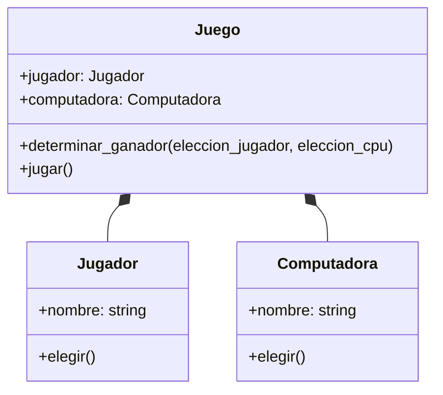
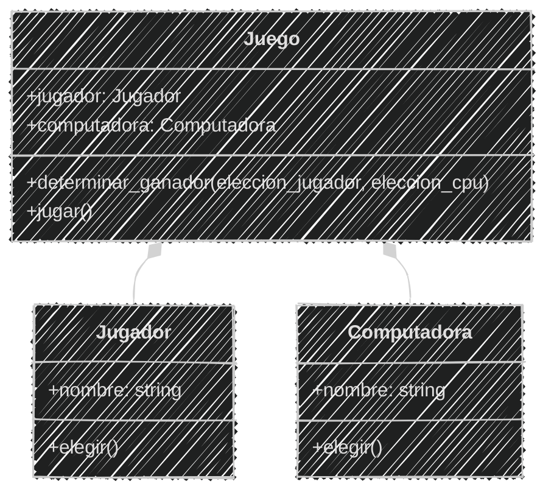
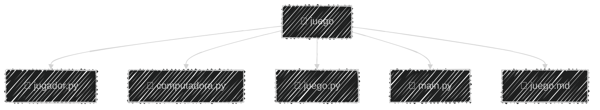
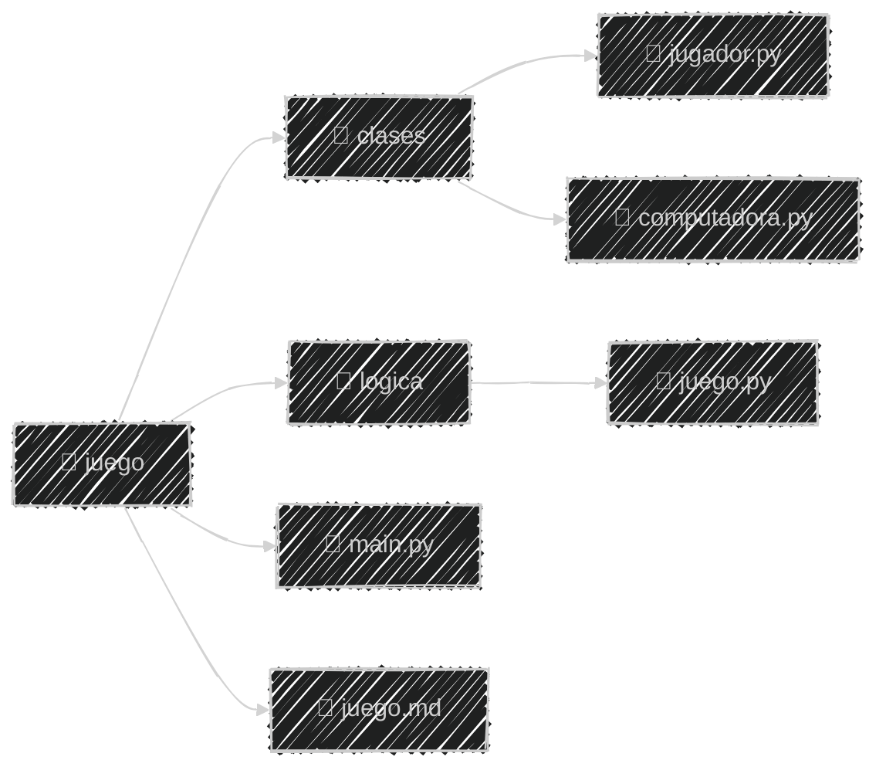
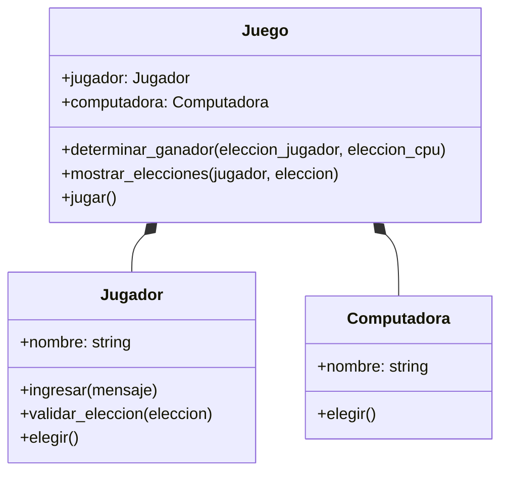
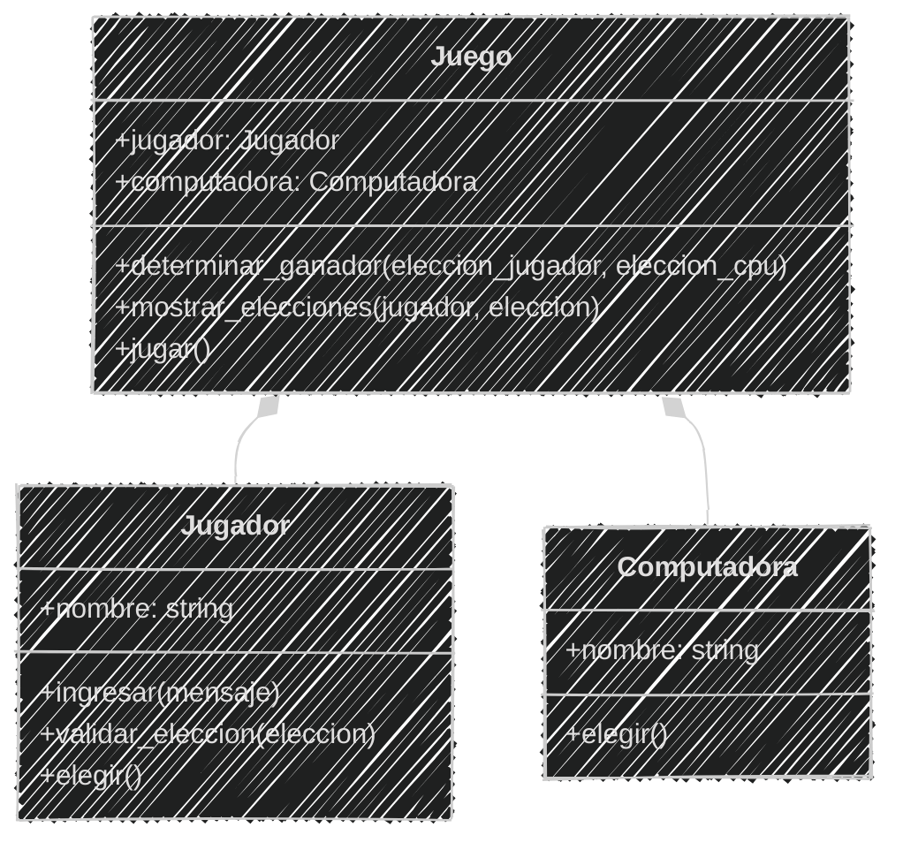
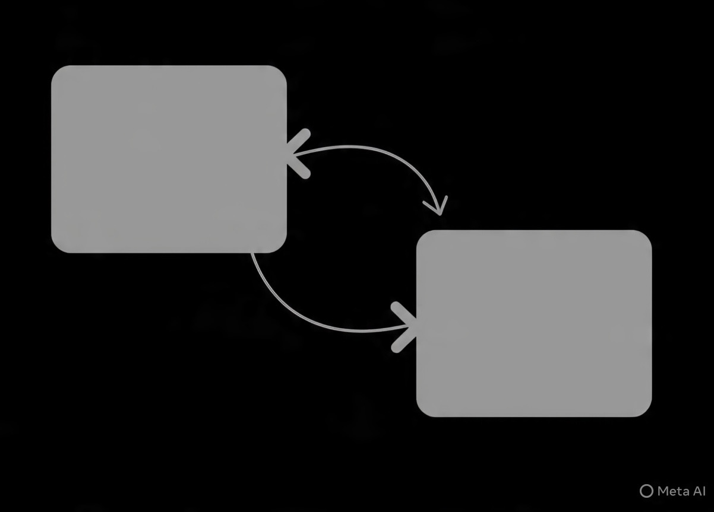
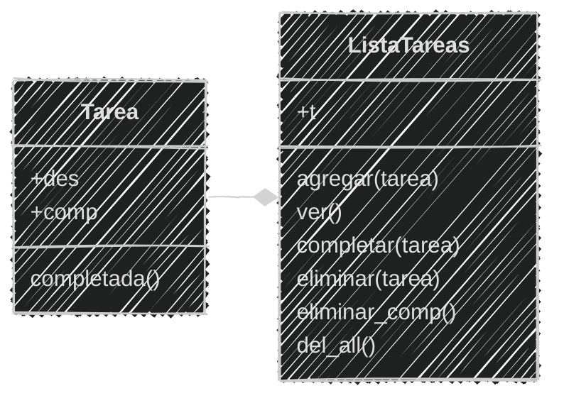

<!-- .slide: data-background-image="../../content/psg-bg-dark.png" data-background-size="100%"-->
 <!-- .element  hidden="true" -->

<br>
<br>
<br>

### Sesión  11
#### Buenas prácticas
#### Refactorización y organización

---

### Antes de empezar

---

#### Proyecto en VSCode

Abre el proyecto en VSCode

```bash
code psg-oop-2025
```

Crea una carpeta con el nombre `sesion11`

```bash
mkdir sesion11
cd sesion11
```

- Los archivos de esta sesión deben estar dentro de esta carpeta

- Al finalizar la sesión, sube los cambios al repositorio en un commit

---

#### Introducción a la refactorización

La refactorización es el proceso de mejorar el código existente sin cambiar su **funcionalidad** externa

---

#### ¿Por qué refactorizar?

- Mejora la **legibilidad** del código
- Facilita el **mantenimiento** y la evolución del software
- Reduce la **complejidad** y el riesgo de errores

---

#### ¿Qué implica la refactorización?

- *Reorganizar* el código en módulos y clases
- *Eliminar* código duplicado
- *Renombrar* variables y funciones para que sean más descriptivas
- *Dividir* funciones grandes en funciones más pequeñas y manejables

---

#### Reorganización del código

En python se puede organizar el código en **archivos y carpetas** para mejorar la estructura del proyecto

 <!-- .element width="25%"-->

---

En lugar de tener un *archivo gigante* con todo el código, podemos dividirlo en **varios archivos** y carpetas

---

#### Buenas prácticas de organización

- Utilizar **nombres descriptivos** para archivos y carpetas
- **Agrupar** archivos relacionados en carpetas
- **Mantener una estructura** coherente en todo el proyecto

---

En Python se recomienda seguir la convención [PEP 8](https://peps.python.org/pep-0008/)

| Elemento              | Convención | Ejemplo                        |
| --------------------- | ---------- | ------------------------------ |
| Clases                | CamelCase  | `MiClase`                      |
| Funciones y variables | snake_case | `mi_funcion`, `mi_variable`    |
| Constantes            | UPPER_CASE | `MI_CONSTANTE`                 |
| Archivos y carpetas   | snake_case | `mi_archivo.py`, `mi_carpeta/` |
| Módulos y paquetes    | snake_case | `mi_modulo`                    |

---

#### Ejemplo 01 

```markdown
Juega "Piedra, Papel o Tijera" con un jugador y una computadora
Ingresa el nombre del jugador y elige piedra, papel o tijera
La computadora hará su elección al azar
y se determinará el ganador según las reglas del juego
Puede jugar varias rondas hasta que el jugador decida salir
El juego esta compuesto por ambos jugadores
Cuenta con un menú

1. jugar 
2. salir
```

Crearemos un archivo llamado `juego.md` con el **análisis y diagrama**
y el archivo `juego.py` con la **lógica** del juego

---

Análisis

```markdown
Requisitos:
- El jugador debe ingresar su nombre
- El jugador debe elegir entre piedra, papel o tijera
- La computadora debe elegir al azar entre piedra, papel o tijera
- El juego debe determinar el ganador según las reglas del juego
- El juego debe mostrar el resultado de cada partida
- El juego debe permitir al jugador jugar varias partidas
- El juego debe tener un menú para jugar o salir
- El juego esta compuesto por ambos jugadores (Jugador y Computadora)

Objetos:
- Jugador
- Computadora
- Juego

Características:
- Jugador:
    - nombre
- Computadora:
    - nombre
- Juego: 
    - jugador
    - computadora

Acciones:
- Jugador:
    - elegir
- Computadora:
    - elegir
- Juego:
    - jugar
    - determinar ganador
```

---

Diagrama de clases en Mermaid

````

````

---

Diagrama de clases en Mermaid


<!--.element class="center-mermaid"-->

---

Código del juego de Piedra, Papel o Tijera

```python [1|2-11|13-18|20-45|47-65]
import random

class Jugador:
    def __init__(self, nombre):
        self.nombre = nombre

    def elegir(self):
        eleccion = input(f"{self.nombre}, elige piedra, papel o tijera: ").lower()
        while eleccion not in ["piedra", "papel", "tijera"]:
            eleccion = input("Opción inválida. Intenta de nuevo: ").lower()
        return eleccion

class Computadora:
    def __init__(self):
        self.nombre = "Computadora"

    def elegir(self):
        return random.choice(["piedra", "papel", "tijera"])

class Juego:
    def __init__(self, jugador, computadora):
        self.jugador = jugador
        self.computadora = computadora

    def determinar_ganador(self, eleccion_jugador, eleccion_computadora):
        if eleccion_jugador == eleccion_computadora:
            return "Empate"
        elif (
            (eleccion_jugador == "piedra" and eleccion_computadora == "tijera") or
            (eleccion_jugador == "papel" and eleccion_computadora == "piedra") or
            (eleccion_jugador == "tijera" and eleccion_computadora == "papel")
        ):
            return f"{self.jugador.nombre} gana!"
        else:
            return f"{self.computadora.nombre} gana!"

    def jugar(self):
        eleccion_jugador = self.jugador.elegir()
        eleccion_computadora = self.computadora.elegir()

        print(f"{self.jugador.nombre} eligió: {eleccion_jugador}")
        print(f"{self.computadora.nombre} eligió: {eleccion_computadora}")

        resultado = self.determinar_ganador(eleccion_jugador, eleccion_computadora)
        print(resultado)

print("🎮 Bienvenido al juego de Piedra, Papel o Tijera")
nombre = input("Introduce tu nombre: ")
jugador = Jugador(nombre)
computadora = Computadora()
juego = Juego(jugador, computadora)

while True:
    print("\n--- Menú ---")
    print("1. Jugar")
    print("2. Salir")
    opcion = input("Elige una opción: ")

    if opcion == "1":
        juego.jugar()
    elif opcion == "2":
        print("¡Gracias por jugar! 👋")
        break
    else:
        print("Opción inválida, intenta de nuevo.")
```

---

Probamos el juego para asegurarnos que funciona **correctamente**

```bash
python juego.py
```

```text
🎮 Bienvenido al juego de Piedra, Papel o Tijera
Introduce tu nombre: Jhon
--- Menú ---
1. Jugar
2. Salir
Elige una opción: 1
Jhon, elige piedra, papel o tijera: piedra
Jhon eligió: piedra
Computadora eligió: tijera
Jhon gana!
--- Menú ---
1. Jugar
2. Salir
Elige una opción: 2
¡Gracias por jugar! 👋
```

---

**Reorganizaremos** el juego en archivos dentro de una carpeta llamada `juego`

Donde primero separaremos las partes del juego en diferentes archivos


<!-- .element class="center-mermaid"-->

⬇


<!-- .element class="center-mermaid"-->

---

#### 1. Crear la carpeta y los archivos

**Crear** la carpeta `juego` y los archivos vacíos dentro

```markdown
Con `mkdir` creamos la carpeta
Con `cd` entramos a la carpeta
Con `touch` creamos los archivos vacíos
Con `tree` vemos la estructura de carpetas y archivos
```

```bash
mkdir juego
cd juego
touch jugador.py computadora.py juego.py main.py
tree
```

```bash
.
├── computadora.py
├── juego.py
├── jugador.py
└── main.py

1 directory, 4 files
```

---

**Mover** el archivo `juego.md` a la carpeta `juego` para mantener todo organizado

```markdown
Con `cd ..` volvemos a la carpeta anterior
Con `mv` movemos el archivo `juego.md` a la carpeta `juego`
Con `cd juego` entramos a la carpeta `juego`
Con `tree` vemos la estructura de carpetas y archivos
```

```bash
cd ..
mv juego.md juego
cd juego
tree
```

```bash
.
├── computadora.py
├── juego.md
├── juego.py
├── jugador.py
└── main.py

1 directory, 5 files
```


---

#### 2. Llenar los archivos con el código

Ya con la estructura creada, **llenar** cada archivo con el código correspondiente

El archivo `jugador.py` contendrá la clase `Jugador`

```python
# jugador.py
class Jugador:
    def __init__(self, nombre):
        self.nombre = nombre
    def elegir(self):
        eleccion = input(f"{self.nombre}, elige piedra, papel o tijera: ").lower()
        while eleccion not in ["piedra", "papel", "tijera"]:
            eleccion = input("Opción inválida. Intenta de nuevo: ").lower()
        return eleccion
```

---

El archivo `computadora.py` contendrá la clase `Computadora`


**Importamos** el módulo `random` porque el método `elegir` de la clase `Computadora` utiliza la función `choice` de este módulo para seleccionar una opción al azar

```python
# computadora.py
import random
class Computadora:
    def __init__(self):
        self.nombre = "Computadora"

    def elegir(self):
        return random.choice(["piedra", "papel", "tijera"])
```


---

En el archivo `juego.py` **copiar** la clase `Juego`

```python
# juego.py
class Juego:
    def __init__(self, jugador, computadora):
        self.jugador = jugador
        self.computadora = computadora

    def determinar_ganador(self, eleccion_jugador, eleccion_computadora):
        if eleccion_jugador == eleccion_computadora:
            return "Empate"
        elif (
            (eleccion_jugador == "piedra" and eleccion_computadora == "tijera") or
            (eleccion_jugador == "papel" and eleccion_computadora == "piedra") or
            (eleccion_jugador == "tijera" and eleccion_computadora == "papel")
        ):
            return f"{self.jugador.nombre} gana!"
        else:
            return f"{self.computadora.nombre} gana!"

    def jugar(self):
        eleccion_jugador = self.jugador.elegir()
        eleccion_computadora = self.computadora.elegir()

        print(f"{self.jugador.nombre} eligió: {eleccion_jugador}")
        print(f"{self.computadora.nombre} eligió: {eleccion_computadora}")

        resultado = self.determinar_ganador(eleccion_jugador, eleccion_computadora)
        print(resultado)
```

---

Por último, el archivo `main.py` contendrá la lógica para iniciar e interactuar con el juego

Pero primero el juego necesita tener acceso a las clases `Jugador`, `Computadora` y `Juego` que están definidas en **otros archivos**

Por lo que debemos **importar** los archivos correspondientes

---
#### Importación de módulos

Python permite **importar** módulos para reutilizar código

Podemos importar un **módulo completo** o solo **partes** específicas de él

Para importar un módulo completo utilizamos la palabra clave `import` seguida del nombre del módulo

```python
import random
```

---

Para importar **una parte** específica de un módulo como una función o clase

Utilizamos la palabra clave `from` seguida del **módulo**

Luego la palabra `import` seguido del nombre de la **función o clase**

```python
from random import choice
```

---

Es **recomendable** importar solo lo que se necesita para evitar *conflictos de nombres* y mejorar la **legibilidad** del código

> No es necesario importar todo el módulo,
> 
> si solo se utiliza una parte de él

---

Cada archivo que hemos creado **puede ser importado** en Python

Para importar las clases desde los archivos que hemos creado, utilizamos la sintaxis 

`from nombre_archivo import NombreClase`.

---

En el archivo `main.py`, importamos las clases de la siguiente manera

```python
# main.py
from jugador import Jugador
from computadora import Computadora
from juego import Juego
```

Esto nos permite utilizar las clases `Jugador`, `Computadora` y `Juego` en el archivo `main.py`

---

El archivo `main.py` quedaría así

```python
# main.py
from jugador import Jugador
from computadora import Computadora
from juego import Juego


print("🎮 Bienvenido al juego de Piedra, Papel o Tijera")
nombre = input("Introduce tu nombre: ")
jugador = Jugador(nombre)
computadora = Computadora()
juego = Juego(jugador, computadora)

while True:
    print("\n--- Menú ---")
    print("1. Jugar")
    print("2. Salir")
    opcion = input("Elige una opción: ")

    if opcion == "1":
        juego.jugar()
    elif opcion == "2":
        print("¡Gracias por jugar! 👋")
        break
    else:
        print("Opción inválida, intenta de nuevo.")
```

---

#### 3. Ejecutar el juego

Después de organizar el código en **archivos separados**, probamos que todo funcione correctamente

donde el archivo `main.py` es el **punto de entrada** del juego

Para ejecutar, debemos estar en el directorio `juego` y ejecutar el archivo `main.py`


---

Ejecutamos el juego

```bash
cd juego # Si no estamos ya en la carpeta juego
python main.py
```

```text
🎮 Bienvenido al juego de Piedra, Papel o Tijera
Introduce tu nombre: Jhon

--- Menú ---
1. Jugar
2. Salir
Elige una opción: 1
Jhon, elige piedra, papel o tijera: tijera
Jhon eligió: tijera
Computadora eligió: piedra
Computadora gana!

--- Menú ---
1. Jugar
2. Salir
Elige una opción: 1
Jhon eligió: papel
Computadora eligió: papel
Empate

--- Menú ---
1. Jugar
2. Salir
Elige una opción: 2
¡Gracias por jugar! 👋
```

---

Refactorizamos el código del juego de Piedra, Papel o Tijera
y lo **organizamos** en una estructura de archivos pero de *un sólo nivel*

Podemos seguir mejorando la organización del código creando una **estructura de carpetas**
para ordenar los archivos según su **funcionalidad**

---
#### Estructura de carpetas

Organizaremos en carpetas para **agrupar** clases y lógica del juego


<!-- .element class="center-mermaid"-->

---

#### 1. Crear las carpetas y los archivos

**Crear** las carpetas `clases` y `logica` dentro de la carpeta `juego`

```markdown
Con `cd` entramos a la carpeta `juego`
Con `mkdir` creamos las carpetas `clases` y `logica`
```

```bash
cd juego
mkdir clases logica
```

---

**Mover** los archivos correspondientes a cada carpeta

```markdown
Con `mv` movemos los archivos `jugador.py` y `computadora.py`
a la carpeta `clases`
Con `mv` movemos el archivo `juego.py` a la carpeta `logica`
```

```bash
mv jugador.py clases
mv computadora.py clases
mv juego.py logica
```

---

**Quedará** la siguiente estructura de carpetas y archivos:

```markdown
Con `tree` vemos la estructura de carpetas y archivos
```

```bash
tree
```

```bash
.
├── clases
│   ├── computadora.py
│   └── jugador.py
├── logica
│   └── juego.py
├── juego.md
└── main.py


3 directories, 5 files
```

---

#### 2. Actualizar las importaciones

Hay que **actualizar** las importaciones en los archivos para reflejar la nueva estructura de carpetas

En `main.py` **importar** las clases desde las nuevas ubicaciones

Como se movió los archivos para importar ahora se utiliza la sintaxis

`from carpeta.archivo import Clase`

```python
# main.py
from clases.jugador import Jugador
from clases.computadora import Computadora
from logica.juego import Juego
```

---

#### 3. Ejecutar el juego

Actualizado las importaciones para reflejar la nueva estructura de carpetas

**Ejecutamos** el juego de la misma manera que antes:

```bash
python main.py
```

---

Podemos mejorar más la organización del código

creando un archivo `__init__.py` en cada carpeta para convertir las *carpetas* en **paquetes** de Python

---

#### `__init__.py`

El archivo `__init__.py` es un **archivo especial** en Python que indica que una carpeta debe ser tratada como un **paquete**

Esto permite importar módulos desde esa carpeta de manera más sencilla

Son **opcionales** pero es recomendable incluirlos para indicar que la carpeta es un paquete de Python

---

#### 1. Crear los archivos `__init__.py`

**Crear** un archivo `__init__.py` vacío en cada carpeta para indicar que son paquetes

```markdown
Con `cd` entramos a la carpeta `juego` 
Con `touch` creamos los archivos `__init__.py`
en las carpetas `clases` y `logica`
```

```bash
cd juego
touch clases/__init__.py logica/__init__.py
```

---

La **estructura** de carpetas y archivos quedará así:

```bash
tree
```

```bash
.
├── clases
│   ├── __init__.py
│   ├── computadora.py
│   └── jugador.py
├── logica
│   ├── __init__.py
│   └── juego.py
├── juego.md
└── main.py

3 directories, 7 files
```

---

#### 2. Importar desde los paquetes

En el archivo `__init__.py` añadimos los archivos que podremos importar directamente desde el paquete

En `clases/__init__.py` añadimos:

```python
# clases/__init__.py
from .jugador import Jugador
from .computadora import Computadora
```

Al utilizar el punto `.` antes del **nombre del archivo**, indicando que importamos el archivo desde la **misma carpeta**

---

En `logica/__init__.py` añadimos:

```python
# logica/__init__.py
from .juego import Juego
```

Asi cada paquete podrá **importar** sus clases correspondientes sin necesidad de especificar el archivo

---

#### 2. Importar desde los paquetes

Para importar desde los paquetes en `main.py`, uilizamos el **nombre del paquete** seguido de la clase

```python
# main.py
from clases import Jugador, Computadora
from logica import Juego
```

Esto permite **importar directamente** desde los paquetes sin especificar el archivo donde se encuentra

---

#### 3. Ejecutar el juego

**Organizamos** el código en **paquetes** y podemos ejecutar el juego de la misma manera que antes:

```bash
python main.py
```

---

Después de **organizar el código**, podemos continuar **refactorizando**

Ahora *eliminaremos* el código duplicado y dividir en funciones más pequeñas

---

#### Eliminación de código duplicado

El código duplicado es un *problema* común en la programación que hace que el código sea más difícil de *mantener y entender*

La eliminación de código duplicado implica **identificar y eliminar** partes del **código que se repiten** innecesariamente

y reemplazarlas por funciones o métodos reutilizables

---

#### ¿Por qué eliminar el código duplicado?

- **Mejora** la legibilidad del código
- **Facilita** el mantenimiento y la evolución del software
- **Reduce** el riesgo de errores al modificar el código

---

#### Refactorización del código duplicado

En el Jugador podemos notar que al elegir piedra, papel o tijera,
**se repite el código** para validar la elección del jugador

```python [4-8]
# original
class Jugador:
    def __init__(self, nombre):
        self.nombre = nombre
    def elegir(self):
        eleccion = input(f"{self.nombre}, elige piedra, papel o tijera: ").lower()
        while eleccion not in ["piedra", "papel", "tijera"]:
            eleccion = input("Opción inválida. Intenta de nuevo: ").lower()
        return eleccion
```

---

**Refactorizamos** separando las opciones válidas en una constante y 
la validación de la elección en un método separado

```python [1|6-9|11-14]
OPCIONES = ["piedra", "papel", "tijera"]
class Jugador:
    def __init__(self, nombre):
        self.nombre = nombre

    def validar_eleccion(self, eleccion):
        while eleccion not in OPCIONES:
            eleccion = input("Opción inválida. Intenta de nuevo: ").lower()
        return eleccion

    def elegir(self):
        opciones = ", ".join(OPCIONES)
        eleccion = input(f"{self.nombre}, elige {opciones}: ").lower()
        return self.validar_eleccion(eleccion)
```

---

**Refactorizar** el `input` del jugador para que sea más claro y reutilizable.

**Definir** un `__str__` para la clase Jugador

```python [6-7|9-10|14,19]
OPCIONES = ["piedra", "papel", "tijera"]
class Jugador:
    def __init__(self, nombre):
        self.nombre = nombre

    def __str__(self):
        return self.nombre

    def ingresar(self, mensaje):
        return input(f"{self}, {mensaje}: ").lower()

    def validar_eleccion(self, eleccion):
        while eleccion not in OPCIONES:
            eleccion = self.ingresar("opción inválida. Intenta de nuevo")
        return eleccion

    def elegir(self):
        opciones = ", ".join(OPCIONES)
        eleccion = self.ingresar(f"elige {opciones}")
        return self.validar_eleccion(eleccion)
```

---

En la clase Computadora, se puede hacer algo similar

**Importar** sólo lo necesario del módulo `random` y no todo el módulo

**Definir** un `__str__` para la clase Computadora

```python [2,8]
# original
import random
class Computadora:
    def __init__(self):
        self.nombre = "Computadora"

    def elegir(self):
        return random.choice(["piedra", "papel", "tijera"])
```

---

**Importando** solo lo necesario del módulo `random`

**Refactorizar** la clase Computadora, separando las opciones válidas en una constante y definiendo el método `__str__`


```python [1|2,11| 7-8]
from random import choice
OPCIONES = ["piedra", "papel", "tijera"]
class Computadora:
    def __init__(self):
        self.nombre = "Computadora"

    def __str__(self):
        return self.nombre
    
    def elegir(self):
        return choice(OPCIONES)
```

---

**Identificar** el código duplicado en la clase `Juego` como la impresión de las elecciones de los jugadores y sus nombres


```python [14-16,22-23]
class Juego:
    def __init__(self, jugador, computadora):
        self.jugador = jugador
        self.computadora = computadora

    def determinar_ganador(self, eleccion_jugador, eleccion_computadora):
        if eleccion_jugador == eleccion_computadora:
            return "Empate"
        elif (
            (eleccion_jugador == "piedra" and eleccion_computadora == "tijera") or
            (eleccion_jugador == "papel" and eleccion_computadora == "piedra") or
            (eleccion_jugador == "tijera" and eleccion_computadora == "papel")
        ):
            return f"{self.jugador.nombre} gana!"
        else:
            return f"{self.computadora.nombre} gana!"

    def jugar(self):
        eleccion_jugador = self.jugador.elegir()
        eleccion_computadora = self.computadora.elegir()

        print(f"{self.jugador.nombre} eligió: {eleccion_jugador}")
        print(f"{self.computadora.nombre} eligió: {eleccion_computadora}")

        resultado = self.determinar_ganador(eleccion_jugador, eleccion_computadora)
        print(resultado)
```

---

**Refactorizar** el archivo `juego.py` usando el método `__str__` de las clases `Jugador` y `Computadora`

**Adicionar** un método para mostrar las elecciones

```python [14,15,17,18,23,24]
class Juego:
    def __init__(self, jugador, computadora):
        self.jugador = jugador
        self.computadora = computadora

    def determinar_ganador(self, eleccion_jugador, eleccion_computadora):
        if eleccion_jugador == eleccion_computadora:
            return "Empate"
        if (
            (eleccion_jugador == "piedra" and eleccion_computadora == "tijera") or
            (eleccion_jugador == "papel" and eleccion_computadora == "piedra") or
            (eleccion_jugador == "tijera" and eleccion_computadora == "papel")
        ):
            return f"{self.jugador} gana!"
        return f"{self.computadora} gana!"

    def mostrar_elecciones(self, jugador, eleccion):
        print(f"{jugador} eligió: {eleccion}")

    def jugar(self):
        eleccion_jugador = self.jugador.elegir()
        eleccion_computadora = self.computadora.elegir()
        self.mostrar_elecciones(self.jugador, eleccion_jugador)
        self.mostrar_elecciones(self.computadora, eleccion_computadora)
        resultado = self.determinar_ganador(eleccion_jugador, eleccion_computadora)
        print(resultado)
```

---

Se **eliminó** algunos duplicados y mejorado la legibilidad del código

**Podemos** seguir mejorando y refactorizando el código y dividiendo
en funciones más pequeñas y manejables

---

El objetivo es tener un **código limpio y fácil de mantener** y también es importante
saber cuando detenerse, ya que la *refactorización excesiva* puede llevar a un código innecesariamente complejo

---

Al final **actualizar** el análisis y el diagrama de clases para reflejar los cambios realizados

---

#### Análisis actualizado

```markdown
Requisitos:
- El jugador debe ingresar su nombre
- El jugador debe elegir entre piedra, papel o tijera
- La computadora debe elegir al azar entre piedra, papel o tijera
- El juego debe determinar el ganador según las reglas del juego
- El juego debe mostrar el resultado de cada partida
- El juego debe permitir al jugador jugar varias partidas
- El juego debe tener un menú para jugar o salir
- El juego esta compuesto por ambos jugadores (Jugador y Computadora)

Objetos:
- Jugador
- Computadora
- Juego

Características:
- Jugador:
    - nombre
- Computadora:
    - nombre
- Juego: 
    - jugador
    - computadora

Acciones:
- Jugador:
    - elegir
    - validar eleccion
    - ingresar
- Computadora:
    - elegir
- Juego:
    - jugar
    - determinar ganador
    - mostrar elecciones
```

---

#### Diagrama de clases actualizado

````

````

---

#### Diagrama de clases actualizado


<!-- .element class="center-mermaid"-->

---

Cambiar el nombre de `juego.md` a `README.md`
será reconocido como la documentación principal

```markdown
Con `mv` cambiamos el nombre del archivo `juego.md` a `README.md`
Con `tree` vemos la estructura de carpetas y archivos
```

```bash
mv juego.md README.md
tree
```
```bash
.
├── clases
│   ├── __init__.py
│   ├── computadora.py
│   └── jugador.py
├── logica
│   ├── __init__.py
│   └── juego.py
├── README.md
└── main.py
3 directories, 7 files
```

---

#### Dependencia circular

 <!-- .element width="45%"-->

Ocurre cuando dos o más módulos *dependen entre sí* directa o indirectamente

---

La dependencia circular es *mala*

Esto puede llevar a problemas como:

- *Dificultad* para entender y mantener el código
- *Problemas de rendimiento* debido a la carga repetida de módulos
- *Errores en tiempo de ejecución* si los módulos no se cargan en el orden correcto

---

Para evitar dependencias circulares, es recomendable:

- **Reorganizar el código** para reducir las dependencias
- **Dividir módulos grandes** en módulos más pequeños y manejables

---

Para definir el **punto de entrada** de un programa, utilizamos la variable especial `__name__` en Python

---

#### La variable `__name__`

En Python, la variable especial `__name__` se utiliza para determinar si un módulo
se está ejecutando como **programa principal** o si se está **importando** desde otro módulo

---

Cuando un módulo se **ejecuta directamente**, su variable `__name__` se establece en `"__main__"`

Cuando *se importa* desde otro módulo, su variable `__name__` se establece en el nombre del módulo

---

Esto permite que el código dentro de un bloque

`if __name__ == "__main__":`

se ejecute cuando el módulo se **ejecuta directamente**, y NO cuando se *importa* desde otro módulo

Es una buena práctica utilizar este bloque para definir el **punto de entrada** del programa

---

**Encapsular** la lógica principal del juego dentro de una función `main`

**Agregar** al final del archivo `main.py` el bloque `if` para llamar a la función `main`

```python [3|24-25]
from clases import Jugador, Computadora
from logica import Juego
def main():
    print("🎮 Bienvenido al juego de Piedra, Papel o Tijera")
    nombre = input("Introduce tu nombre: ")
    jugador = Jugador(nombre)
    computadora = Computadora()
    juego = Juego(jugador, computadora)

    while True:
        print("\n--- Menú ---")
        print("1. Jugar")
        print("2. Salir")
        opcion = input("Elige una opción: ")

        if opcion == "1":
            juego.jugar()
        elif opcion == "2":
            print("¡Gracias por jugar! 👋")
            break
        else:
            print("Opción inválida, intenta de nuevo.")

if __name__ == "__main__":
    main()
```

---

Con esto se completó la **refactorización** y se puede los cambios al repositorio de GitHub

```bash
git add .
git commit -m "Refactorización y organización del código"
git push
```

---

#### Ejemplo 02

```text
Al ejemplo anterior aún faltan algunas mejoras que hacer

Elimina la duplicidad del código en OPCIONES almacenando
en paquete que se llame `constantes` y crea un 
archivo `opciones.py` donde almacenes las opciones 
válidas del juego y reglas

El juego debe funcionar con emojis: 🧱, 📄 y ✂️
cambiando en las constantes y la lógica del juego

Crea las reglas del juego en un diccionario 
para determinar el ganador
```

Realizar los cambios 4 minutos

<iframe src="https://time-stuff.com/embed.html" frameborder="0" scrolling="no" width="391" height="140"></iframe>

---

#### 1. Estructura de carpetas y archivos

```bash
cd juego
mkdir constantes
touch constantes/__init__.py constantes/opciones.py
tree
```

```bash
.
├── clases
│   ├── __init__.py
│   ├── computadora.py
│   └── jugador.py
├── constantes
│   ├── __init__.py
│   └── opciones.py
├── logica
│   ├── __init__.py
│   └── juego.py
├── README.md
└── main.py
4 directories, 8 files
```

---

#### 2. Opciones válidas

En `constantes/opciones.py` definir las opciones válidas del juego y las reglas

```python
# constantes/opciones.py
PIEDRA = "piedra"
PAPEL = "papel"
TIJERA = "tijera"
OPCIONES = [PIEDRA, PAPEL, TIJERA]
REGLAS = {
    PIEDRA: TIJERA,
    PAPEL: PIEDRA,
    TIJERA: PAPEL
}
```

---

En `constantes/__init__.py` importamos las opciones para que estén disponibles al importar el paquete `constantes`.

```python
# constantes/__init__.py
from .opciones import OPCIONES, REGLAS
```

---

#### 3. Actualizar el código

Actualizar el código en los archivos `jugador.py`, `computadora.py` utilizando las constantes definidas

```python
# clases/jugador.py
from constantes import OPCIONES
...
```

```python
# clases/computadora.py
from constantes import OPCIONES
from random import choice
...
```

---

En `juego.py` actualizar las importaciones y el método `determinar_ganador` para utilizar las constantes y reglas definidas

```python [2|4-9]
# logica/juego.py
from constantes import REGLAS
...
    def determinar_ganador(self, eleccion_jugador, eleccion_computadora):
        if eleccion_jugador == eleccion_computadora:
            return "Empate"
        if REGLAS[eleccion_jugador] == eleccion_computadora:
            return f"{self.jugador} gana!"
        return f"{self.computadora} gana!"
```

---

Actualizar `main.py` para que muestre las opciones válidas al jugador

```python [2,6]
# main.py
from constantes import OPCIONES
from clases import Jugador, Computadora
from logica import Juego
def main():
    print(f"🎮 Bienvenido al juego de {', '.join(OPCIONES)}")
    nombre = input("Introduce tu nombre: ")
    jugador = Jugador(nombre)
    computadora = Computadora()
    juego = Juego(jugador, computadora)
...
```

---
Reafactorizado el código para utilizar constantes y mejorar la flexibilidad del juego

Ejecutar el juego para verificar que todo funciona correctamente:

```bash
python main.py
```

---

Al final *modificar* las constantes para utilizar emojis en lugar de texto

```python
# constantes/opciones.py
PIEDRA = "🧱"
PAPEL = "📄"
TIJERA = "✂️"
``` 

---

Ejecutamos el juego para verificar que todo funciona correctamente:

```bash
python main.py
```

```text
🎮 Bienvenido al juego de 🧱, 📄, ✂️
Introduce tu nombre: jose

--- Menú ---
1. Jugar
2. Salir
Elige una opción: 1
jose, elige 🧱, 📄, ✂️: 🧱
jose eligió: 🧱
Computadora eligió: 🧱
Empate
```

---

Subimos los avances de la sesión al repositorio en **GitHub**

```bash
git add .
git commit -m "Sesión 11"
git push origin main
```

---

#### Resumen

- La refactorización es el proceso de mejorar el código existente sin cambiar su funcionalidad externa.
- Refactorizar mejora la legibilidad, facilita el mantenimiento y reduce la complejidad y el riesgo de errores.
- La refactorización implica reorganizar el código en módulos y clases, eliminar código duplicado, renombrar variables y funciones, y dividir funciones grandes en funciones más pequeñas.

---

- En Python se recomienda organizar el código en archivos y carpetas para mejorar la estructura del proyecto.
- Es buena práctica utilizar nombres descriptivos para archivos y carpetas, agrupar archivos relacionados y mantener una estructura coherente.
- En Python se recomienda seguir la convención de nombres PEP 8 para clases, funciones, variables, constantes, archivos y módulos.

---

- La importación de módulos permite reutilizar código y que es recomendable importar solo lo necesario para evitar conflictos y mejorar la legibilidad.
- Crear archivos `__init__.py` en las carpetas permite que sean tratados como paquetes de Python y facilita la importación de módulos.
- Eliminar código duplicado mejora la legibilidad y facilita el mantenimiento del software.

---

- La dependencia circular entre módulos es mala porque dificulta el mantenimiento y puede causar errores de ejecución.
- La variable especial `__name__` en Python permite determinar si un módulo se ejecuta directamente o se importa desde otro módulo.
- Es buena práctica encapsular la lógica principal en una función y usar el bloque `if __name__ == "__main__":` para definir el punto de entrada del programa.

---

- El uso de constantes y la organización en paquetes mejora la flexibilidad y mantenibilidad del código.
- La documentación y la estructura clara de carpetas y archivos son esenciales para proyectos bien organizados.

---

#### Retos

Crear una carpeta con el nombre "retos_sesion_11" dentro del proyecto en la raíz, en la cual por cada ejercicio debes crear las siguientes carpetas y archivos:

```bash
# Estructura de carpetas
psg-oop-2025/
    retos_sesion_11/
        ejercicio_01/
            README.md
            <carpetas>
                <scripts>.py
            main.py
        ejercicio_02/
            README.md
            <carpetas>
                <scripts>.py
            main.py
```

---

1. Organiza el siguiente ejemplo en una estructura de carpetas y archivos

```text
Un programa para gestionar una lista de tareas pendientes
Permite agregar, eliminar y marcar tareas como completadas
También permite eliminar tareas completadas
y eliminar todas las tareas
```

- Renombra las variables y métodos siguiendo las convenciones de PEP 8 y buenas prácticas de nomenclatura
- Refactoriza el código en una estructura de carpetas y añade la documentación de análisis y diagrama de clases
en un archivo `README.md` dentro de la carpeta `ejercicio_01`.

---

Diagrama de clases


<!-- .element class="center-mermaid"-->

---
Código del ejemplo 01

```python
class Tarea:
    def __init__(self, d):
        self.des = d
        self.comp = 0
    def completada(self):
        self.comp == 1

class ListaTareas:
    def __init__(self):
        self.t = []
    def agregar(self, t):
        self.t.append(Tarea(t))
    def ver(self):
        if not self.t:
            print("No hay tareas pendientes.")
        else:
            for i, tarea in enumerate(self.t, 1):
                estado = "✔️" if tarea.comp else " "
                print(f"{i}. [{estado}] {tarea.des} ")
    def completar(self, i):
        if 0 < i <= len(self.t):
            self.t[i-1].comp = 1
            print(f"Tarea '{self.t[i-1].des}' marcada como completada.")
        else:
            print("Índice de tarea inválido.")
    def eliminar(self, i):
        if 0 < i <= len(self.t):
            tarea_eliminada = self.t.pop(i-1)
            print(f"Tarea '{tarea_eliminada.des}' eliminada.")
        else:
            print("Índice de tarea inválido.")
    def eliminar_comp(self):
        self.t = [tarea for tarea in self.t if not tarea.comp]
        print("Tareas completadas eliminadas.")
    def del_all(self):
        self.t.clear()
        print("Todas las tareas eliminadas.")
lista = ListaTareas()
while True:
    print("\n--- Menú ---")
    print("1. Agregar tarea")
    print("2. Ver tareas")
    print("3. Completar tarea")
    print("4. Eliminar tarea")
    print("5. Eliminar tareas completadas")
    print("6. Eliminar todas las tareas")
    print("7. Salir")
    opcion = input("Elige una opción: ")

    if opcion == "1":
        tarea = input("Ingrese la descripción de la tarea: ")
        lista.agregar(tarea)
    elif opcion == "2":
        lista.ver()
    elif opcion == "3":
        lista.ver()
        i = int(input("Ingrese el índice de la tarea a completar: "))
        lista.completar(i)
    elif opcion == "4":
        lista.ver()
        i = int(input("Ingrese el índice de la tarea a eliminar: "))
        lista.eliminar(i)
    elif opcion == "5":
        lista.eliminar_comp()
    elif opcion == "6":
        lista.del_all()
    elif opcion == "7":
        print("¡Gracias por usar la aplicación! 👋")
        break
    else:
        print("Opción inválida, intenta de nuevo.")
```

---

2. Crea el siguiente programa siguiendo las buenas prácticas de PEP 8 y organiza el código en una estructura de carpetas y archivos

```text
La Biblioteca Municipal va digitalizar su registro 
de préstamos de libros. Actualmente, los encargados
 anotan todo en un cuaderno:

Los libros con su título, autor e ISBN.
Los usuarios tienen un nombre
La biblioteca cuenta con un flujo de préstamos:
1. Un usuario ingresa su nombre
2. Se lista los libros disponibles
3. El usuario elige un libro para prestar
4. Se registra la lista de prestados con el 
   nombre del usuario y el libro prestado
5. Puede prestarse más de un libro al mismo usuario
6. Los usuarios tienen que devolver todos los libros a la vez
7. Se puede ver la lista de libros prestados y
   los usuarios que los tienen
8. Para salir se debe ingresar "salir"
```

---

Añade la documentación con análisis y diagrama de clases en un archivo `README.md` dentro de la carpeta `ejercicio_02` y
crea el código para el ejercicio

---
<!-- .slide: data-background-image="../../content/psg-bg-dark.png" data-background-size="100%"-->

<br>
<br>
<br>
<br>
<br>

[ <!-- .element width="20%"-->](https://github.com/python-la-paz/python-study-group-oop/tree/main/content/sesion11)

Repositorio de la Sesión

---
<!--.slide: data-visibility="hidden"-->
## Bibliografía y Referencias

- [Best Practices for Refactoring Code](https://www.freecodecamp.org/news/best-practices-for-refactoring-code/)
- [Python Refactoring](https://realpython.com/python-refactoring/)
- [Guía PEP 8](https://peps.python.org/pep-0008/#class-names)
- [Mermaid Charts](https://www.mermaidchart.com/play)
- [Draw.io](https://app.diagrams.net/)
- [Python 3 Object-oriented Programming, Second Edition, Dusty PhillipsDusty Phillips](https://github.com/PacktPublishing/Python-3-Object-Oriented-Programming-Second-Edition)
- [Objetos en programación](https://ebac.mx/blog/objeto-en-programacion)
- [Enfoque orientado a objetos](https://1library.co/article/enfoque-orientado-a-objetos-base-te%C3%B3rica.qvld461y)
- [OOAD](https://www.tutorialspoint.com/object_oriented_analysis_design/ooad_object_oriented_analysis.htm)
