<!-- .slide: data-background-image="../../content/psg-bg-dark.png" data-background-size="100%"-->
 <!-- .element  hidden="true" -->

<br>
<br>
<br>

### Sesión  12
#### Buenas prácticas
#### Anotaciones, Documentación y Principios

---

#### VS Code

Abrimos el proyecto del Study Group

```bash
code psg-oop-2025
```

Creamos una carpeta llamada `sesion12` dentro del proyecto

```bash
mkdir sesion12
cd sesion12
```

Aquí guardaremos los ejemplos de la sesión


---

Python es uno de los lenguajes más populares y entre sus características
se encuentra la facilidad para escribir código.

El tipado dinámico de Python permite a los desarrolladores escribir código
rápido y flexible

---
Pero esto también puede llevar a errores difíciles de detectar
si no se tiene cuidado.

---
Una variable puede cambiar de tipo en cualquier momento, lo que puede causar
errores en tiempo de ejecución.

Desde la terminal interactiva de Python:

```python
def sumar(a, b):
    return a + b
x = 5  # x es un entero
y = 10  # y es un entero
print(sumar(x, y))  # Funciona correctamente
x = "5"  # x ahora es una cadena
print(sumar(x, y))  # Error en tiempo de ejecución: TypeError
```

```text
15
ERROR!
Traceback (most recent call last):
  File "<main.py>", line 4, in <module>
  File "<main.py>", line 2, in sumar
TypeError: unsupported operand type(s) for +: 'int' and 'str'
```

---
Este tipo de errores puede ser difícil de detectar y corregir,
especialmente en proyectos grandes.

Para lo cual, en Python se ha introducido el concepto de "anotaciones de tipo"

---

#### Anotaciones

Python desde su versión 3.6 introdujo el concepto de "anotaciones de tipo"
que permiten a los desarrolladores especificar el tipo de datos esperado
para:

- Variables
- Parámetros de funciones
- Valores de retorno de funciones
- Atributos de clases

---

Esto ayuda a mejorar la legibilidad del código y a detectar errores
antes de que se ejecuten.

Además, los editores de código y herramientas de análisis estático
pueden utilizar estas anotaciones para proporcionar sugerencias y advertencias.

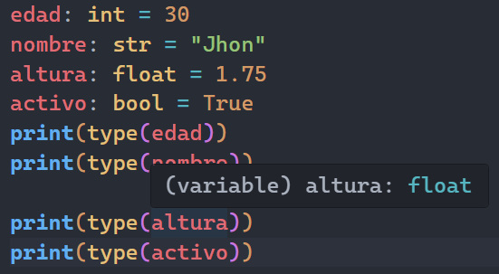 <!-- .element width="50%"-->

---

Crearemos un archivo llamado `anotaciones.py` en la carpeta `sesion12`

```bash
touch anotaciones.py
```

---

#### Anotaciones en variables

Las anotaciones de tipo en variables se utilizan para indicar el tipo de datos
que se espera que contenga una variable.

```python
edad: int = 30  
nombre: str = "Jhon" 
altura: float = 1.75
activo: bool = True
print(type(edad))  # <class 'int'>
print(type(nombre))  # <class 'str'>
print(type(altura))  # <class 'float'>
print(type(activo))  # <class 'bool'>
```

Estas anotaciones no afectan el comportamiento del código,
pero proporcionan información adicional para los desarrolladores

---

De esta manera, podemos ver que la variable `edad` es un entero,
`nombre` es una cadena, `altura` es un flotante y `activo` es un booleano.

Esto ayuda a los desarrolladores a entender mejor el código
y a detectar errores antes de que se ejecuten.

---

#### Anotaciones en variables

También se pueden utilizar anotaciones de tipo para estructuras de datos donde
se incluyen los tipos de los elementos que contienen

En el caso de listas se utiliza la sintaxis `list[tipo]`:
Donde `tipo` es el tipo de los elementos que contiene la lista.

---

En el caso de diccionarios se utiliza la sintaxis `dict[clave_tipo, valor_tipo]`:
Donde `clave_tipo` es el tipo de las claves y `valor_tipo` es el tipo de los valores.

En el caso de tuplas se utiliza la sintaxis `tuple[tipo1, tipo2, ...]`:
Donde `tipo1`, `tipo2`, etc. son los tipos de los elementos que contiene la tupla.


---

```python
numeros: list[int] = []
nombres: dict[str, str] = {}  
tuplas: tuple[int, str] = ()
print(type(numeros))  # <class 'list'>
print(type(nombres))  # <class 'dict'>
print(type(tuplas))  # <class 'tuple'>
```

- `numeros`: lista de enteros
- `nombres`: diccionario con claves y valores de tipo cadena
- `tuplas` : tuplas de enteros y cadenas

---

Sin anotaciones:

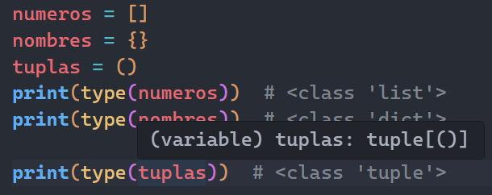 <!-- .element width="50%"-->

Con anotaciones:

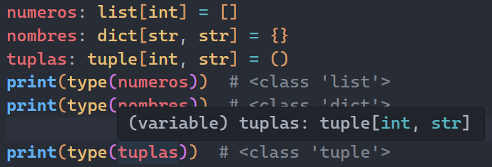 <!-- .element width="50%"-->

---

#### Anotaciones en funciones

Se utilizan para indicar los tipos de datos que se espera que contengan los parámetros 
y el tipo de dato que se espera que retorne

Los parámetros de una función se anotan utilizando la sintaxis `parametro: tipo`
y el valor de retorno se anota utilizando la sintaxis `-> tipo` 

El tipo de retorno se coloca antes de los dos puntos `:`

---

Por ejemplo, si tenemos una función que suma dos números enteros

```python
def sumar(a: int, b: int) -> int:
    return a + b
```

En este ejemplo, la función `sumar` espera dos parámetros de tipo entero
y retorna un valor de tipo entero.

---

Sin anotaciones:

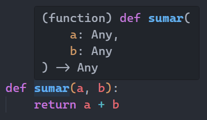 <!-- .element width="40%"-->

Con anotaciones:

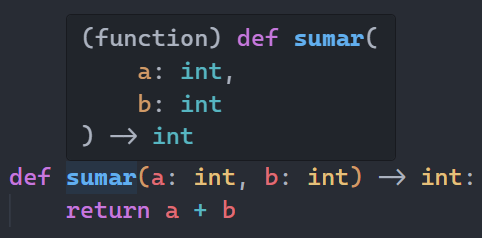 <!-- .element width="40%"-->

---

#### Anotaciones en funciones

También se pueden utilizar anotaciones de tipo para funciones que aceptan
parámetros de tipo genérico, como listas o diccionarios.

Por ejemplo, si tenemos una función que recibe una lista de enteros y 
retorna una lista de cuadrados de esos enteros

```python
def cuadrados(numeros: list[int]) -> list[int]:
    return [n ** 2 for n in numeros]
numeros = cuadrados([2,4,6])
print (numeros)
```

---

Las anotaciones nos ayudan a saber que la variable `numeros` es una lista de enteros

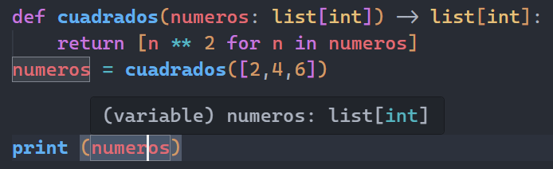 <!-- .element width="60%"-->

---

#### Anotaciones en clases

Las anotaciones de tipo también se pueden utilizar en clases para indicar
los tipos de datos de los atributos de una clase.

Por ejemplo, si tenemos una clase `Persona` con atributos de clase `especie`
y atributos de instancia `nombre` y `edad`

---

```python
class Persona:
    especie: str = "Homo sapiens"
    def __init__(self, nombre: str, edad: int):
        self.nombre: str = nombre
        self.edad: int = edad
```


La clase `Persona` tiene un atributo de clase `especie` de tipo cadena
con el valor por defecto "Humano"

Atributos de instancia `nombre` y `edad` de tipo cadena e entero

---

Con anotaciones:

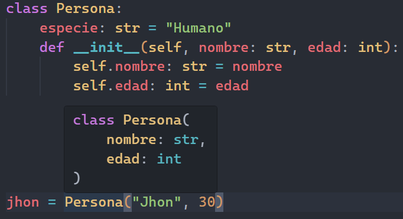 <!-- .element width="50%"-->


---

Existe otro estilo de anotaciones usado mayormente en versiones anteriores a Python 3.8

utilizando el módulo `typing` y las clases `List`, `Dict`, `Tuple`, etc.


---

Por ejemplo, si tenemos una función que recibe una lista de enteros y retorna una lista de enteros

```python
from typing import List
def cuadrados(numeros: List[int]) -> List[int]:
    return [n ** 2 for n in numeros]
numeros = cuadrados([2, 4, 6])
print(numeros)
```

Actualmente, este estilo es menos común y se recomienda utilizar las anotaciones
directamente sin importar el módulo `typing`

---

Es importante recordar que las anotaciones de tipo en Python son opcionales
y no afectan el comportamiento del código en tiempo de ejecución.

---

Pero no es suficiente, también es importante documentar el código
para que se pueda entender fácilmente su propósito y funcionamiento.

---

#### Documentación

La documentación es una parte esencial del desarrollo de software
ya que ayuda a los desarrolladores a entender el propósito y funcionamiento del código.

En las clases podemos utilizar cadenas de documentación (docstrings)
para documentar el propósito de la clase, sus atributos y métodos.

---

La documentación se coloca entre comillas triples `"""` justo después de la definición de la clase
o del método.

Los editores de código y herramientas de análisis estático pueden utilizar
estas cadenas de documentación para proporcionar sugerencias de autocompletado y advertencias.

---
Creamos un archivo llamado `documentacion.py` en la carpeta `sesion12`

```bash
touch documentacion.py
```

---

#### Documentación en clases

Por ejemplo, si tenemos una clase `Persona` con un atributo `nombre` y un método `saludar`

```python
Sin documentación:

class Persona:
    def __init__(self, nombre: str):
        self.nombre: str = nombre
    def saludar(self):
        print(f"Hola, mi nombre es {self.nombre}")
jhon = Persona("Jhon")
jhon.saludar()
```


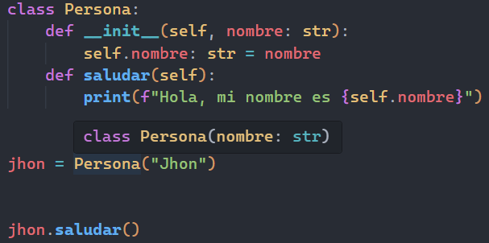 <!-- .element width="35%"-->
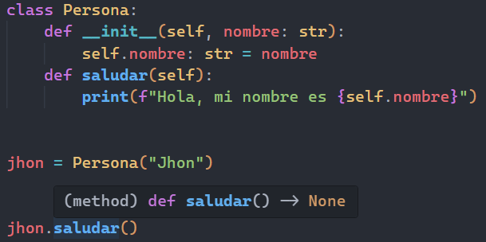 <!-- .element width="35%"-->

---

Con documentación:

```python
class Persona:
    """Clase que representa a una persona."""
    def __init__(self, nombre: str):
        """Inicializa una nueva instancia de la clase Persona.
        
        Args:
            nombre (str): El nombre de la persona.
        """
        self.nombre: str = nombre

    def saludar(self):
        """Imprime un saludo con el nombre de la persona."""
        print(f"Hola, mi nombre es {self.nombre}")
jhon = Persona("Jhon")
jhon.saludar()
```

---

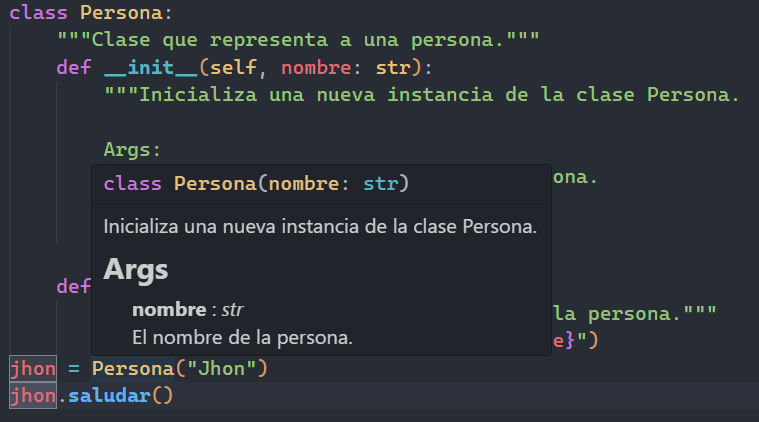 <!-- .element width="50%"-->

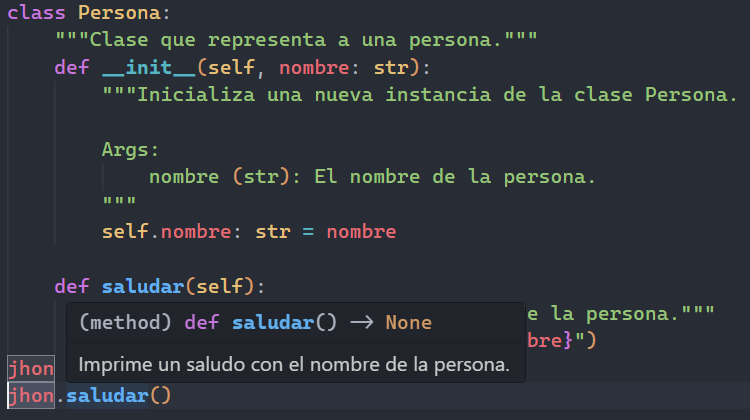 <!-- .element width="50%"-->

---

Existen diferentes convenciones para escribir documentación en Python 
la [PEP 257](https://peps.python.org/pep-0257/) establece la base para las cadenas de documentación

Existen diferentes estilos de documentación, como el estilo Google, NumPy y reStructuredText (reST)

Donde cada uno tiene su propia sintaxis y convenciones

---

| Estilo                  | Uso típico                                   |
| ----------------------- | -------------------------------------------- |
| Google                  | Documentación de proyectos y bibliotecas     |
| NumPy                   | Documentación científica y técnica           |
| reStructuredText (reST) | Documentación profesional, grandes proyectos |


---

| Estilo | Ventajas                    | Desventajas                                      |
| ------ | --------------------------- | ------------------------------------------------ |
| Google | Fácil de leer y escribir    | Menos detallado para proyectos complejos         |
| NumPy  | Estructurado y detallado    | Puede ser más difícil de leer para principiantes |
| reST   | Muy detallado y profesional | Más complejo de escribir menos amigable          |

---

| Estilo | Legibilidad                                                                       |
| ------ | --------------------------------------------------------------------------------- |
| Google | Claro y conciso, fácil  para humanos                                              |
| NumPy  | Muy estructurado, detallado, generado por herramientas                            |
| reST   | Muy detallado, profesional, orientado a herramientas de documentación como Sphinx |


---

#### Estilo Google

Para documentar una función o método, se utiliza la siguiente sintaxis:

```python
def fibonacci(n: int) -> str:
    """Devuelve la secuencia de Fibonacci hasta el n-ésimo número.

    Args:
        n (int): El índice del número de Fibonacci a calcular.

    Returns:
        str: La secuencia de Fibonacci hasta el n-ésimo número.

    Raises:
        ValueError: Si n es negativo.

    Examples:
        >>> fibonacci(5)
        '0, 1, 1, 2, 3'
    """
    if n < 0:
        raise ValueError("El índice no puede ser negativo")
    fib = [0, 1]
    for i in range(2, n):
        fib.append(fib[i - 1] + fib[i - 2])
    return ', '.join(str(x) for x in fib[:n])
print (fibonacci(5))
```

---
El editor de código puede interpretar la documentación y proporcionar sugerencias de autocompletado

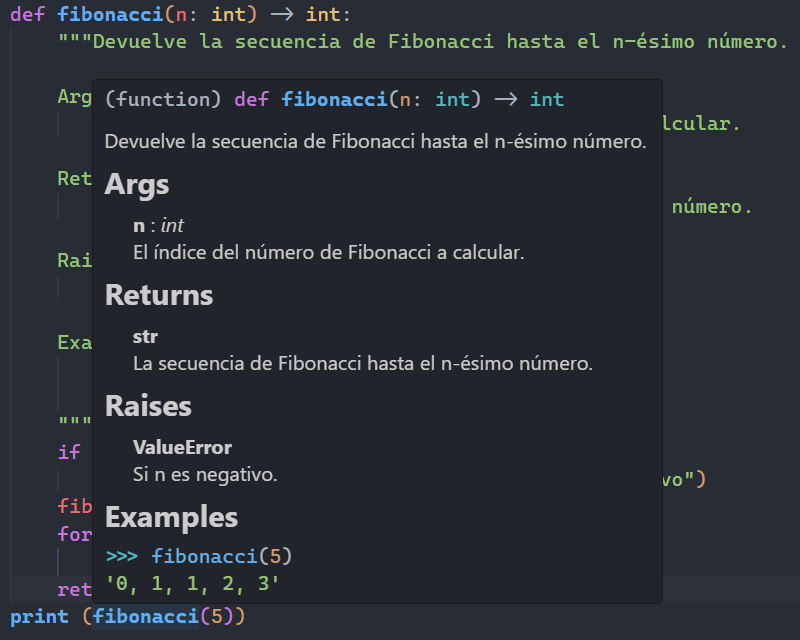 <!-- .element width="50%"-->


---
#### Estilo NumPy

Para documentar una función o método, se utiliza la siguiente sintaxis:

```python
def fibonacci(n: int) -> str:
    """
    Devuelve la secuencia de Fibonacci hasta el n-ésimo número.

    Parameters
    ----------
    n : int
        El índice del número de Fibonacci a calcular.

    Returns
    -------
    str
        La secuencia de Fibonacci hasta el n-ésimo número.

    Raises
    ------
    ValueError
        Si n es negativo.

    Examples
    --------
    >>> fibonacci(5)
    '0, 1, 1, 2, 3'
    """
    if n < 0:
        raise ValueError("El índice no puede ser negativo")
    fib = [0, 1]
    for i in range(2, n):
        fib.append(fib[i - 1] + fib[i - 2])
    return ', '.join(str(x) for x in fib[:n])

print(fibonacci(5))
```

---
El editor de código puede interpretar la documentación y proporcionar sugerencias de autocompletado

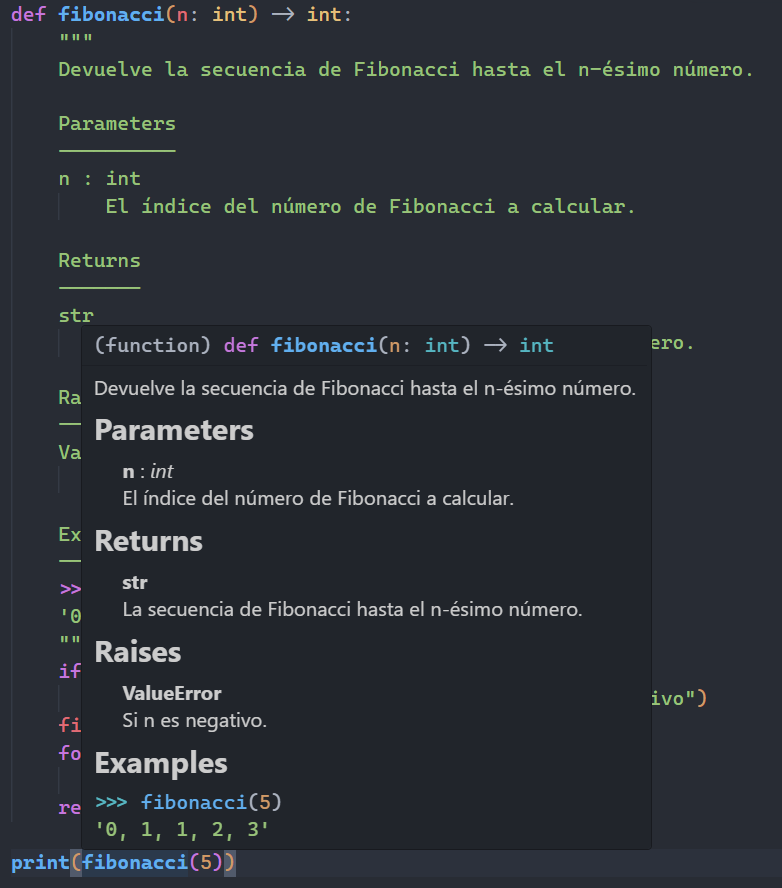 <!-- .element width="40%"-->

---
#### Estilo reStructuredText (reST)
Para documentar una función o método, se utiliza la siguiente sintaxis:

```python
def fibonacci(n: int) -> str:
    """
    Devuelve la secuencia de Fibonacci hasta el n-ésimo número.

    :param n: El índice del número de Fibonacci a calcular.
    :type n: int
    :return: La secuencia de Fibonacci hasta el n-ésimo número.
    :rtype: str
    :raises ValueError: Si n es negativo.
    :example:
        >>> fibonacci(5)
        '0, 1, 1, 2, 3'
    """
    if n < 0:
        raise ValueError("El índice no puede ser negativo")
    fib = [0, 1]
    for i in range(2, n):
        fib.append(fib[i - 1] + fib[i - 2])
    return ', '.join(str(x) for x in fib[:n])

print(fibonacci(5))
```

---
El editor de código puede interpretar la documentación y proporcionar sugerencias de autocompletado

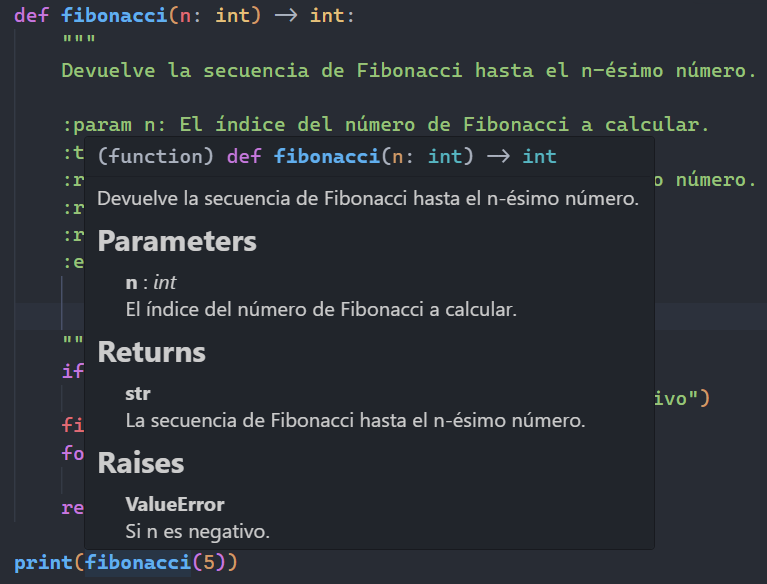 <!-- .element width="40%"-->

---

Elige un estilo de documentación y sé consistente en su uso a lo largo de tu código

Esto facilitará la lectura y comprensión del código para ti y para otros desarrolladores

---

#### Principios de desarrollo

Los principios de desarrollo son un conjunto de buenas prácticas
que ayudan a los desarrolladores a escribir código limpio, mantenible y escalable.

Al igual que los patrones de diseño, los principios de desarrollo
proporcionan soluciones a problemas comunes en el desarrollo de software.

---
Algunos de los principios más importantes son:

- KISS (Keep It Simple, Stupid)
- DRY (Don't Repeat Yourself)
- YAGNI (You Aren't Gonna Need It)

---

#### KISS (Keep It Simple, Stupid)

El principio KISS enfatiza la importancia de mantener el código simple y fácil de entender.

Un código simple es más fácil de leer, mantener y depurar.

---

Se puede resumir en:

- Simplicidad: Las soluciones deben ser lo más simples posible evitando características innecesarias.
- Claridad: El código debe ser claro y fácil de entender

---

- Minimalismo: Evitar la complejidad innecesaria y centrarse en lo esencial.
- Eficiencia: Las soluciones simples son más eficientes
- Evite la sobreingeniería: No agregue características o funcionalidades innecesarias.


---

Una forma de aplicarlo es:

- Dividir problemas complejos en partes más pequeñas y manejables.
- Evitar la sobreingeniería y centrarse en lo esencial.
- Utilizar nombres claros y descriptivos para variables, funciones y clases.

---

#### Ejemplo KISS

```text
La primera calculadora de un estudiante sólo sabe
sumar dos números, tiene una clase SumaDeNumeros 
con el método operar que realiza la suma.
Sin embargo, no es muy claro, ni simple.
Simplifica el código aplicando el principio KISS
```

```python [1-11|13-18]
# Complejidad innecesaria
class SumaDeNumeros:
    def __init__(self, a, b):
        self.a = a
        self.b = b
    
    def operar(self):
        return self.a + self.b

suma = SumaDeNumeros(5, 7)
print(suma.operar())

# Solución simple
class Calculadora:
    def sumar(self, a, b):
        return a + b
calc = Calculadora()
print(calc.sumar(5, 7))
```

---
#### Ejercicio 01

```text
Una calculadora de areas que pueda calcular
el área de rectángulos y cuadrados.
Donde el código tiene mucha complejidad
Simplifica el código aplicando el principio KISS
```

En el archivo `areas.py` en la carpeta `sesion12`

---

Realizar los cambios 4 minutos

```python
class Area:
    def __init__(self, tipo, lado1, lado2=None):
        self.tipo = tipo
        self.lado1 = lado1
        self.lado2 = lado2
    def calcular(self):
        if self.tipo == "rectangulo":
            return self.lado1 * self.lado2
        elif self.tipo == "cuadrado":
            return self.lado1 ** 2
area_rectangulo = Area("rectangulo", 5, 10)
print(area_rectangulo.calcular())
area_cuadrado = Area("cuadrado", 5)
print(area_cuadrado.calcular())
```

<iframe src="https://time-stuff.com/embed.html" frameborder="0" scrolling="no" width="391" height="140"></iframe>

---

#### Solución simple

```python
class Calculadora:
    def area(self, lado1, lado2):
        return lado1 * lado2
calc = Calculadora()
print(calc.area(5, 10))  # Área del rectángulo
print(calc.area(5, 5))   # Área del cuadrado
```

```bash
python areas.py
```

```text
50
25
```

---

#### DRY (Don't Repeat Yourself)

El principio DRY enfatiza la importancia de evitar la duplicación de código.

El código duplicado puede llevar a errores y dificultades en el mantenimiento.

---

Se puede resumir en:

- Unicidad: Cada pieza de conocimiento o lógica debe tener una única representación en el código.
- Mantenimiento: El código duplicado es más difícil de mantener y actualizar.
- Reutilización: Fomenta la reutilización de código a través de funciones, clases y módulos.

---

- Reducción de errores: Menos duplicación significa menos oportunidades para errores.
- Eficiencia: Un código sin duplicación es más eficiente
- Claridad: Un código sin duplicación es más claro y fácil de entender.


---

Una forma de aplicarlo es:

- Identificar y eliminar código duplicado.
- Utilizar funciones, clases y módulos para reutilizar código.
- Mantener el código DRY durante el desarrollo y la refactorización.

---

#### Ejemplo DRY

```python [1-7|9-13]
# Código duplicado
def area_rectangulo(lado1, lado2):
    return lado1 * lado2
def area_cuadrado(lado):
    return lado * lado
print(area_rectangulo(5, 10))
print(area_cuadrado(5))

# Código sin duplicación
def area(lado1, lado2):
    return lado1 * lado2
print(area(5, 10))  # Área del rectángulo
print(area(5, 5))      # Área del cuadrado
```

---

#### Ejercicio 02

```text
Una tienda en línea permite pagar con diferentes métodos de pago:
- Tarjeta
- Transferencia
- QR
Y por cada canal aplica un impuesto diferente
- Tarjeta 5%
- Transferencia 2%
- QR 1%
Simplifica el código aplicando el principio DRY
```

En el archivo `tienda.py` en la carpeta `sesion12`

---

Realizar los cambios 4 minutos

```python
class Tienda:
    def impuesto_tarjeta(self, monto):
        return monto * 0.05
    def impuesto_transferencia(self, monto):
        return monto * 0.02
    def impuesto_qr(self, monto):
        return monto * 0.01
    def pagar_tarjeta(self, monto):
        impuesto = self.impuesto_tarjeta(monto)
        total = monto + impuesto
        print(f"Pago con tarjeta: Monto={monto}, Impuesto={impuesto}, Total={total}")
    def pagar_transferencia(self, monto):
        impuesto = self.impuesto_transferencia(monto)
        total = monto + impuesto
        print(f"Pago con transferencia: Monto={monto}, Impuesto={impuesto}, Total={total}")
    def pagar_qr(self, monto):
        impuesto = self.impuesto_qr(monto)
        total = monto + impuesto
        print(f"Pago con QR: Monto={monto}, Impuesto={impuesto}, Total={total}")
tienda = Tienda()
tienda.pagar_tarjeta(100)
tienda.pagar_transferencia(100)
tienda.pagar_qr(100)
```

<iframe src="https://time-stuff.com/embed.html" frameborder="0" scrolling="no" width="391" height="140"></iframe>

---

#### Solución simple

```python
class Tienda:
    def calcular_impuesto(self, monto, tasa):
        return monto * tasa
    def pagar(self, monto, metodo):
        tasas = {
            "tarjeta": 0.05,
            "transferencia": 0.02,
            "qr": 0.01
        }
        tasa = tasas.get(metodo, 0)
        impuesto = self.calcular_impuesto(monto, tasa)
        total = monto + impuesto
        print(f"Pago con {metodo}: Monto={monto}, Impuesto={impuesto}, Total={total}")
tienda = Tienda()
tienda.pagar(100, "tarjeta")
tienda.pagar(100, "transferencia")
tienda.pagar(100, "qr")
```

```bash
python tienda.py
```

```text
Pago con tarjeta: Monto=100, Impuesto=5.0, Total=105.0
Pago con transferencia: Monto=100, Impuesto=2.0, Total=102.0
Pago con qr: Monto=100, Impuesto=1.0, Total=101.0
```

---

#### YAGNI (You Aren't Gonna Need It)

El principio YAGNI enfatiza la importancia de no agregar funcionalidades
o características que no son necesarias en el momento.

Esto ayuda a evitar la sobreingeniería y a mantener el código simple y enfocado.

---

Se puede resumir en:

- Necesidad: No agregue funcionalidades o características que no son necesarias.
- Simplicidad: Mantenga el código simple y enfocado en el propósito actual.
- Eficiencia: Evite la complejidad innecesaria que puede afectar el rendimiento.

---

- Mantenimiento: Un código sin características innecesarias es más fácil de mantener.
- Claridad: Un código sin características innecesarias es más claro y fácil de entender.
- Flexibilidad: Un código sin características innecesarias es más flexible y adaptable a cambios futuros.

---

Una forma de aplicarlo es:

- Enfocarse en los requisitos actuales y no en posibles requisitos futuros.
- Evitar la sobreingeniería y centrarse en lo esencial.
- Revisar y eliminar características innecesarias durante la refactorización.

---

- Priorizar la simplicidad y claridad del código.
- Mantener el código enfocado en el propósito actual.
- Evitar la tentación de agregar características "por si acaso".

---
#### Ejemplo YAGNI

```text
Un estudiante esta aprendiendo a sumar dos números, y le dieron
una calculadora para para que pueda practicar la suma, pero
la calculadora tiene muchas funciones que no va a usar aún.
```

```python [1-14|15-20]
# Característica innecesaria
class Calculadora:
    def sumar(self, a, b):
        return a + b
    def restar(self, a, b):
        return a - b
    def multiplicar(self, a, b):
        return a * b
    def dividir(self, a, b):
        if b == 0:
            raise ValueError("No se puede dividir por cero")
        return a / b
calc = Calculadora()
print(calc.sumar(5, 7))
# Solución enfocada
class Calculadora:
    def sumar(self, a, b):
        return a + b
calc = Calculadora()
print(calc.sumar(5, 7))
```

---
#### Ejercicio 03

```text
Un profesor necesita una forma sencilla de llevar
el registro de sus estudiantes, con sus nombres y
las notas de sus exámenes. Quiere poder calcular 
fácilmente el promedio de cada estudiante y saber 
de si ha aprobado o no el curso, 
con nota mayor a  51, además de tener 
un resumen claro de sus resultados para mostrárselos.
Simplifica el código aplicando el principio YAGNI
```

En el archivo `estudiantes.py` en la carpeta `sesion12`

---
Realizar los cambios 4 minutos

```python
class Estudiante:
    def __init__(self, nombre, notas):
        self.nombre = nombre
        self.notas = notas

    self.promedio_cache = None

    def calcular_promedio(self):
        total = 0
        for n in self.notas:
            total += n
        return total / len(self.notas)

    def mostrar_promedio(self):
        total = 0
        for n in self.notas:
            total += n
        return f"Promedio de {self.nombre}: {total / len(self.notas)}"

    def aprobo(self):
        promedio = self.calcular_promedio()
        return promedio > 50 or promedio == 51

    def mejor_nota(self):
        return max(self.notas)

    def peor_nota(self):
        return min(self.notas)
    def resumen(self):
        return f"Estudiante: {self.nombre}, Notas: {self.notas}, Promedio: {self.calcular_promedio()}, Aprobado: {self.aprobo()}"

estudiante1 = Estudiante("Ana", [85, 90, 78])
print(estudiante1.mostrar_promedio())
print(f"Aprobó: {estudiante1.aprobo()}")
print(estudiante1.resumen())
```

<iframe src="https://time-stuff.com/embed.html" frameborder="0" scrolling="no" width="391" height="140"></iframe>

---
#### Solución simple

```python
class Estudiante:
    def __init__(self, nombre, notas):
        self.nombre = nombre
        self.notas = notas
    def calcular_promedio(self):
        return sum(self.notas) / len(self.notas)
    def aprobo(self):
        return self.calcular_promedio() >= 51
    def resumen(self):
        mensaje = f"Estudiante: {self.nombre}"
        mensaje += f", Notas: {self.notas}"
        mensaje += f", Promedio: {self.calcular_promedio()}"
        mensaje += f", Aprobado: {self.aprobo()}"
        return mensaje
estudiante1 = Estudiante("Ana", [85, 90, 78])
print(estudiante1.resumen())
```

```bash
python estudiantes.py
```
```text
Estudiante: Ana, Notas: [85, 90, 78], Promedio: 84.33333333333333, Aprobado: True
```

---

#### Resumen

- Python es un lenguaje popular por su facilidad para escribir código y su tipado dinámico, lo que permite flexibilidad pero puede causar errores difíciles de detectar.
- Las anotaciones de tipo permiten especificar el tipo de datos esperado para variables, parámetros de funciones, valores de retorno y atributos de clases, mejorando la legibilidad y ayudando a detectar errores antes de la ejecución.

---

- Las anotaciones de tipo en Python son opcionales y no afectan el comportamiento del código en tiempo de ejecución, pero son útiles para desarrolladores y herramientas de análisis estático.
- Existen diferentes estilos para escribir anotaciones, como el uso directo de tipos o el módulo typing, aunque se recomienda el uso directo en versiones recientes.

---

- La documentación es esencial para entender el propósito y funcionamiento del código, y que se puede realizar mediante cadenas de documentación (docstrings) en clases, funciones y métodos.
- Existen diferentes estilos de documentación en Python, como Google, NumPy y reStructuredText (reST), cada uno con sus ventajas y desventajas, y que es importante elegir uno y ser consistente.

---

- Los principios de desarrollo ayudan a escribir código limpio, mantenible y escalable, proporcionando soluciones a problemas comunes en el desarrollo de software.
- El principio KISS enfatiza la simplicidad, claridad y eficiencia, evitando la sobreingeniería y manteniendo el código enfocado en lo esencial.

---

- El principio DRY promueve evitar la duplicación de código, fomentando la reutilización y facilitando el mantenimiento.
- El principio YAGNI recomienda no agregar funcionalidades innecesarias, manteniendo el código simple y enfocado en los requisitos actuales.

---

#### Retos

Crear una carpeta con el nombre "retos_sesion_12" dentro del proyecto en la raíz, en la cual por cada ejercicio debes crear los siguientes archivos:

```bash
# Estructura de carpetas
psg-oop-2025/
    retos_sesion_12/
        ejercicio_01.md
        ejercicio_01.py
        ejercicio_02.md
        ejercicio_02.py
```

---

1. Un juego de dados de la suerte, el jugador lanza dos dados y si la suma es 7 o 11 gana, si es 2, 3 o 12 pierde, cualquier otro valor puede volver a lanzar los dados. En un futuro podrías registrar el nombre del jugador y su puntuación más alta.

```markdown
- Crea el análisis, diagrama de clases y el código.
- Documenta el código y usa anotaciones de tipo.
- Utiliza los principios KISS, DRY y YAGNI
- Utiliza algún estilo de documentación
```

---

2. Un sistema de gestión de tareas, donde se pueden agregar, eliminar y marcar tareas como completadas. En un futuro podrías agregar fechas de vencimiento y prioridades a las tareas.

```markdown
Crea el análisis, diagrama de clases y el código.
Documenta el código y usa anotaciones de tipo.
Utiliza los principios KISS, DRY y YAGNI
Utiliza algún estilo de documentación
```

---

Gracias por Participar del

🐍 Python Study Group - OOP 2025 🐍

> Un objeto puede ser pequeño, pero bien diseñado puede sostener un sistema entero

---
<!-- .slide: data-background-image="../../content/psg-bg-dark.png" data-background-size="100%"-->

<br>
<br>
<br>
<br>
<br>

[ <!-- .element width="20%"-->](https://github.com/python-la-paz/python-study-group-oop/content/sesion01)

Repositorio de la Sesión

---
<!--.slide: data-visibility="hidden"-->
## Bibliografía y Referencias

- [Function Annotations](https://ellibrodepython.com/function-annotations)
- [Annotations HowTo](https://docs.python.org/es/3/howto/annotations.html)
- [Python Annotations](https://pywombat.com/articles/python-annotation)
- [PEP 484](https://peps.python.org/pep-0484/)
- [PEP 585](https://peps.python.org/pep-0585/#parameters-to-generics-are-available-at-runtime)
- [KISS Principle](https://fourweekmba.com/kiss-principle/)
- [Principles of Clean Code: DRY, KISS, and YAGNI](https://medium.com/@curiousraj/the-principles-of-clean-code-dry-kiss-and-yagni-f973aa95fc4d)
- [DRY Principle](https://www.techtarget.com/whatis/definition/DRY-principle)
- [The DRY Principle](https://dev.to/ahadalireach/the-dry-principle-50hh)
- [KISS, DRY, SOLID, YAGNI: A Simple Guide to Some Principles of Software Engineering and Clean Code](https://medium.com/@hlfdev/kiss-dry-solid-yagni-a-simple-guide-to-some-principles-of-software-engineering-and-clean-code-05e60233c79f)
- [Object Oriented Analysis](https://www.gyata.ai/es/object-oriented-programming/object-oriented-analysis)
- [DDOO Unidad 1](https://dmd.unadmexico.mx/contenidos/DCEIT/BLOQUE1/DS/02/DDOO/U1/descargables/DDOO_Unidad_1.pdf)
- [Programación procedural VS orientada a objetos](https://programacionpro.com/programacion-procedural-vs-orientada-a-objetos-diferencias-y-similitudes/)
- [Python OOP](https://www.learnpython.org/en/Classes_and_Objects)
- [Atributos de clase](https://oregoom.com/python/atributos-clase/)
- [Diagrama de clases](https://diagramasuml.com/diagrama-de-clases/)
- [Guía PEP 8](https://peps.python.org/pep-0008/#class-names)
- [Mermaid Charts](https://www.mermaidchart.com/play)
- [Draw.io](https://app.diagrams.net/)
- [Python 3 Object-oriented Programming, Second Edition, Dusty PhillipsDusty Phillips](https://github.com/PacktPublishing/Python-3-Object-Oriented-Programming-Second-Edition)
- [Objetos en programación](https://ebac.mx/blog/objeto-en-programacion)
- [Enfoque orientado a objetos](https://1library.co/article/enfoque-orientado-a-objetos-base-te%C3%B3rica.qvld461y)
- [OOAD](https://www.tutorialspoint.com/object_oriented_analysis_design/ooad_object_oriented_analysis.htm)
